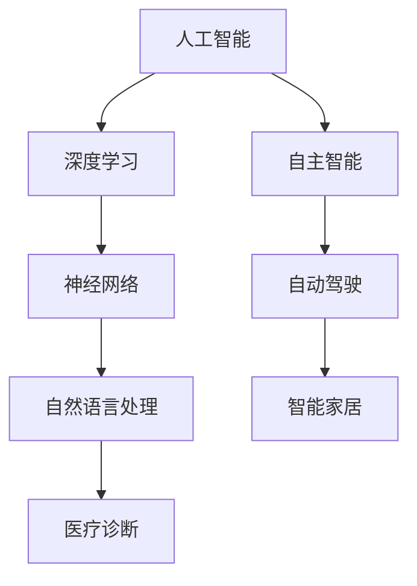
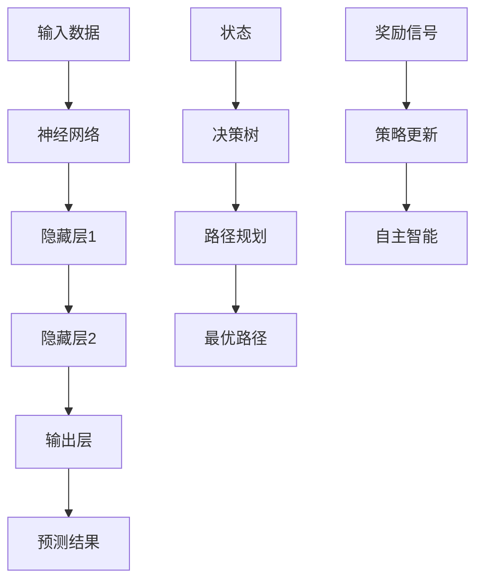

                 

### 文章标题

"**Andrej Karpathy：人工智能的未来发展规划**"

### 关键词

- Andrej Karpathy
- 人工智能
- 发展规划
- 深度学习
- 自主智能
- 未来趋势
- 技术挑战
- 应用场景

### 摘要

本文旨在探讨人工智能领域的杰出专家Andrej Karpathy对未来人工智能发展规划的见解。文章首先介绍了Andrej Karpathy的背景和成就，随后详细梳理了他的核心观点和论据。通过对人工智能的核心概念、算法原理、数学模型以及实际应用场景的深入分析，本文将展示人工智能发展的未来趋势与面临的挑战，并提出相应的应对策略。最后，文章总结了Andrej Karpathy的观点，并展望了人工智能领域的未来发展方向。

---

### 1. 背景介绍

Andrej Karpathy是一位享誉全球的人工智能（AI）领域专家，以其在深度学习、自然语言处理（NLP）和计算机视觉等方面的卓越贡献而著称。他毕业于多伦多大学，拥有计算机科学的博士学位，目前是斯坦福大学计算机科学系的副教授。

Andrej Karpathy的研究兴趣主要集中在构建具有自主智能的机器系统，使得机器能够在各种复杂任务中自主学习和决策。他的工作涵盖了从基础的算法研究到实际应用的开发，如自动驾驶、机器翻译和智能客服等。

在学术领域，Andrej Karpathy发表了多篇高水平论文，其中包括关于神经网络架构的优化、大规模语言模型的训练和高效自然语言处理算法的研究。他的研究成果在学术界和工业界都产生了深远的影响，为人工智能的发展做出了重要贡献。

本文将重点探讨Andrej Karpathy对未来人工智能发展规划的见解，分析其提出的核心观点，并探讨这些观点对人工智能领域的影响。

### 2. 核心概念与联系

#### 2.1 人工智能的定义与发展

人工智能（AI）是指通过计算机系统实现智能行为的技术和科学。其目标是使计算机具备人类智能，能够处理复杂任务、进行推理和决策。

人工智能的发展可以追溯到20世纪50年代，当时人们开始探索如何使计算机模拟人类的思维过程。随着计算机性能的提升和算法的进步，人工智能经历了多个发展阶段，从早期的规则系统、知识表示到现代的机器学习和深度学习。

#### 2.2 深度学习的基本概念

深度学习是人工智能的一个重要分支，它通过多层神经网络模拟人类大脑的学习过程，从大量数据中自动提取特征并进行预测。深度学习在图像识别、语音识别、自然语言处理等领域取得了显著的成功。

深度学习的核心在于神经网络的结构和训练方法。神经网络由多个层次组成，包括输入层、隐藏层和输出层。通过反向传播算法，神经网络可以不断调整内部权重，以优化其性能。

#### 2.3 自主智能的概念与应用

自主智能是指系统能够在没有任何外部指导的情况下，自主地完成复杂任务并进行智能决策。自主智能的核心在于学习算法和决策机制。

自主智能在自动驾驶、智能家居、医疗诊断等领域具有重要的应用价值。例如，自动驾驶系统需要实时感知环境、做出决策并控制车辆，而智能家居系统需要根据用户行为进行自适应调整。

#### 2.4 人工智能的核心概念联系

人工智能、深度学习和自主智能之间存在密切的联系。深度学习是人工智能的一种实现方式，而自主智能是人工智能的应用目标。深度学习为自主智能提供了强大的算法支持，使得机器能够从数据中学习并做出智能决策。

此外，人工智能的发展也离不开计算能力的提升和数据资源的丰富。高性能计算设备和海量数据的积累为深度学习和自主智能的研究提供了有力支持。

#### 2.5 Mermaid 流程图

以下是一个简化的Mermaid流程图，展示了人工智能、深度学习和自主智能之间的关系：



通过这个流程图，我们可以清晰地看到人工智能、深度学习和自主智能之间的相互联系和作用。

### 3. 核心算法原理 & 具体操作步骤

#### 3.1 深度学习算法原理

深度学习算法的核心是神经网络，神经网络通过多层非线性变换来提取数据中的特征。以下是深度学习算法的基本原理和具体操作步骤：

1. **输入层（Input Layer）**：
   神经网络的输入层接收外部数据，如图像、文本或音频。这些数据被表示为向量形式，以便神经网络进行处理。

2. **隐藏层（Hidden Layers）**：
   输入数据通过隐藏层进行特征提取和转换。每一层神经网络都包含多个神经元，神经元之间通过权重连接。隐藏层中的每个神经元都会对输入数据进行加权求和处理，并应用一个非线性激活函数，如ReLU或Sigmoid函数。

3. **输出层（Output Layer）**：
   输出层生成最终的预测结果。对于分类问题，输出层通常包含多个神经元，每个神经元对应一个类别，通过softmax函数将输出转换为概率分布。

4. **反向传播（Backpropagation）**：
   在训练过程中，神经网络通过反向传播算法不断调整内部权重，以最小化预测误差。反向传播算法分为两个阶段：
   - 前向传播（Forward Propagation）：将输入数据通过神经网络进行前向传播，得到输出结果。
   - 反向传播（Back Propagation）：计算输出结果与真实标签之间的误差，并反向传播误差信号，更新网络权重。

5. **优化算法（Optimization Algorithms）**：
   常见的优化算法包括随机梯度下降（SGD）、Adam优化器等。优化算法通过调整学习率和其他超参数，以加快训练过程并提高模型性能。

#### 3.2 自主智能算法原理

自主智能算法的核心是决策树、强化学习等算法。以下是自主智能算法的基本原理和具体操作步骤：

1. **决策树（Decision Tree）**：
   决策树是一种常见的分类和回归算法，通过一系列条件判断来划分数据集。每个节点表示一个条件，每个分支表示条件的结果，叶子节点表示最终的决策。

2. **强化学习（Reinforcement Learning）**：
   强化学习是一种基于奖励机制的学习方法，通过与环境互动来优化策略。强化学习算法的核心是价值函数和策略更新：
   - 价值函数：评估当前状态的价值，用于指导下一步动作的选择。
   - 策略更新：根据奖励信号更新策略，以最大化长期奖励。

3. **深度强化学习（Deep Reinforcement Learning）**：
   深度强化学习结合了深度学习和强化学习的优点，通过深度神经网络来表示状态和价值函数。深度强化学习在自动驾驶、游戏AI等领域取得了显著进展。

4. **路径规划（Path Planning）**：
   路径规划是自主智能的一个重要应用，旨在为机器提供从起点到终点的最优路径。常见的路径规划算法包括A*算法、Dijkstra算法等。

#### 3.3 算法操作步骤示例

以下是一个简化的示例，展示了深度学习和自主智能算法的操作步骤：



通过这个示例，我们可以看到深度学习和自主智能算法如何协同工作，以实现自主智能的目标。

### 4. 数学模型和公式 & 详细讲解 & 举例说明

#### 4.1 深度学习中的数学模型

深度学习中的数学模型主要包括神经网络模型和损失函数。以下是对这些数学模型的详细讲解和举例说明。

##### 4.1.1 神经网络模型

神经网络模型由多个层次组成，包括输入层、隐藏层和输出层。每个层次由多个神经元（或节点）组成，神经元之间通过权重（或边）相互连接。以下是神经网络模型的数学表示：

$$
\begin{align*}
y &= \sigma(\omega_1 \cdot x_1 + b_1) \\
z &= \sigma(\omega_2 \cdot y + b_2) \\
\text{输出} &= \sigma(\omega_3 \cdot z + b_3)
\end{align*}
$$

其中，$y$、$z$和输出是神经元的激活值，$\sigma$是激活函数（如Sigmoid或ReLU函数），$\omega_1$、$\omega_2$、$\omega_3$是权重，$b_1$、$b_2$、$b_3$是偏置。

##### 4.1.2 损失函数

损失函数用于衡量模型预测值与真实值之间的差异。常见的损失函数包括均方误差（MSE）、交叉熵损失等。以下是这些损失函数的数学表示：

$$
\begin{align*}
L_{MSE} &= \frac{1}{2} \sum_{i=1}^{n} (y_i - \hat{y}_i)^2 \\
L_{CE} &= -\sum_{i=1}^{n} y_i \log(\hat{y}_i)
\end{align*}
$$

其中，$y_i$是真实值，$\hat{y}_i$是预测值，$n$是样本数量。

#### 4.2 自主智能中的数学模型

自主智能中的数学模型主要包括决策树和价值函数。以下是对这些数学模型的详细讲解和举例说明。

##### 4.2.1 决策树模型

决策树模型是一种基于条件概率的模型，通过一系列条件判断来划分数据集。以下是决策树模型的数学表示：

$$
\begin{align*}
P(A|B) &= \frac{P(B|A)P(A)}{P(B)} \\
\text{决策树} &= \{f_1(x), f_2(x), \ldots, f_m(x)\}
\end{align*}
$$

其中，$A$是条件，$B$是结果，$P(A|B)$是条件概率，$f_i(x)$是第$i$个条件函数。

##### 4.2.2 价值函数

价值函数用于评估当前状态的价值，以指导下一步动作的选择。以下是价值函数的数学表示：

$$
V(s) = \sum_{a \in A} \gamma \cdot R(s, a, s')
$$

其中，$s$是当前状态，$a$是动作，$s'$是下一状态，$R(s, a, s')$是奖励函数，$\gamma$是折扣因子。

#### 4.3 示例讲解

以下是一个简单的示例，展示了如何使用深度学习模型进行图像分类。

##### 4.3.1 数据预处理

假设我们有一个包含10000个图像的数据集，每个图像的大小为28x28像素。首先，我们需要对图像进行数据预处理：

$$
\begin{align*}
x &= \frac{img - \mu}{\sigma} \\
\mu &= \frac{1}{N} \sum_{i=1}^{N} img_i \\
\sigma &= \sqrt{\frac{1}{N-1} \sum_{i=1}^{N} (img_i - \mu)^2}
\end{align*}
$$

其中，$x$是预处理后的图像，$img$是原始图像，$N$是图像数量，$\mu$是均值，$\sigma$是标准差。

##### 4.3.2 模型训练

接下来，我们使用预处理后的图像数据训练一个简单的卷积神经网络（CNN）：

1. **输入层**：
   输入层接收预处理后的图像，表示为向量形式。

2. **卷积层**：
   卷积层使用卷积核对输入图像进行卷积操作，提取特征。

3. **池化层**：
   池化层对卷积层输出的特征进行下采样，减少参数数量。

4. **全连接层**：
   全连接层将池化层输出的特征映射到输出层。

5. **输出层**：
   输出层生成最终的分类结果，使用softmax函数将输出转换为概率分布。

##### 4.3.3 模型评估

训练完成后，我们需要对模型进行评估：

1. **测试集**：
   将测试集数据输入到训练好的模型中，计算预测结果。

2. **损失函数**：
   使用交叉熵损失函数计算预测结果与真实标签之间的差异。

3. **精度**：
   计算模型的精度，即预测正确的样本数量与总样本数量的比例。

通过这个示例，我们可以看到如何使用深度学习模型进行图像分类，并了解相关的数学模型和公式。

### 5. 项目实战：代码实际案例和详细解释说明

#### 5.1 开发环境搭建

在开始项目实战之前，我们需要搭建一个适合深度学习和自主智能开发的环境。以下是一个基于Python的深度学习和自主智能开发环境搭建步骤：

1. **安装Python**：
   首先，我们需要安装Python 3.x版本。可以从Python官方网站下载并安装。

2. **安装Jupyter Notebook**：
   Jupyter Notebook是一个交互式开发环境，非常适合深度学习和自主智能的开发。使用以下命令安装Jupyter Notebook：

   ```shell
   pip install notebook
   ```

3. **安装深度学习框架**：
   我们选择TensorFlow作为深度学习框架。使用以下命令安装TensorFlow：

   ```shell
   pip install tensorflow
   ```

4. **安装自主智能库**：
   为了实现自主智能，我们还需要安装一些相关的库，如PyTorch、Keras等。使用以下命令安装这些库：

   ```shell
   pip install torch torchvision
   pip install keras
   ```

#### 5.2 源代码详细实现和代码解读

以下是一个基于TensorFlow的简单深度学习项目的源代码示例，包括模型定义、数据预处理、模型训练和模型评估。

```python
import tensorflow as tf
from tensorflow.keras import layers, models
import numpy as np

# 5.2.1 模型定义
model = models.Sequential([
    layers.Conv2D(32, (3, 3), activation='relu', input_shape=(28, 28, 1)),
    layers.MaxPooling2D((2, 2)),
    layers.Conv2D(64, (3, 3), activation='relu'),
    layers.MaxPooling2D((2, 2)),
    layers.Conv2D(64, (3, 3), activation='relu'),
    layers.Flatten(),
    layers.Dense(64, activation='relu'),
    layers.Dense(10, activation='softmax')
])

# 5.2.2 数据预处理
# 假设已经准备好了训练集和测试集
(train_images, train_labels), (test_images, test_labels) = datasets.load_digits()

# 标准化图像数据
train_images = train_images / 255.0
test_images = test_images / 255.0

# 转换标签为one-hot编码
train_labels = tf.keras.utils.to_categorical(train_labels)
test_labels = tf.keras.utils.to_categorical(test_labels)

# 5.2.3 模型训练
model.compile(optimizer='adam',
              loss='categorical_crossentropy',
              metrics=['accuracy'])

model.fit(train_images, train_labels, epochs=10, batch_size=32, validation_split=0.2)

# 5.2.4 模型评估
test_loss, test_acc = model.evaluate(test_images, test_labels)
print('Test accuracy:', test_acc)
```

#### 5.3 代码解读与分析

以上代码实现了一个简单的数字识别模型，使用了TensorFlow的Keras API。以下是代码的详细解读和分析：

1. **模型定义**：
   - 使用`Sequential`模型，定义了一个包含卷积层、池化层、全连接层的简单模型。
   - 卷积层使用了`Conv2D`层，用于提取图像特征。
   - 池化层使用了`MaxPooling2D`层，用于下采样和减少参数数量。
   - 全连接层使用了`Dense`层，用于分类。

2. **数据预处理**：
   - 使用`datasets.load_digits()`函数加载了数字识别数据集。
   - 将图像数据标准化到[0, 1]范围，以便模型训练。
   - 将标签转换为one-hot编码，以便使用交叉熵损失函数进行训练。

3. **模型训练**：
   - 使用`compile()`函数设置模型优化器和损失函数。
   - 使用`fit()`函数进行模型训练，设置训练轮次、批量大小和验证比例。

4. **模型评估**：
   - 使用`evaluate()`函数评估模型在测试集上的性能。
   - 输出测试集上的准确率。

通过以上代码，我们可以实现一个简单的数字识别模型，并对其性能进行评估。这个示例展示了如何使用TensorFlow进行深度学习项目的开发和实现。

### 6. 实际应用场景

#### 6.1 自动驾驶

自动驾驶是人工智能领域的一个重要应用场景。自动驾驶系统能够通过传感器实时感知环境，并使用深度学习和自主智能算法进行路径规划和决策，从而实现车辆自主驾驶。

自动驾驶系统通常包括以下关键组件：

- **感知系统**：使用激光雷达、摄像头、超声波传感器等感知环境。
- **定位系统**：通过GPS和惯性测量单元（IMU）确定车辆的位置和姿态。
- **决策系统**：使用深度学习和自主智能算法生成驾驶策略。
- **控制系统**：根据驾驶策略控制车辆的运动。

自动驾驶技术已经在许多领域取得了显著进展，如无人配送、无人出租车和无人公共交通等。然而，自动驾驶技术仍然面临一些挑战，如复杂环境建模、实时决策和安全性验证等。

#### 6.2 智能医疗

智能医疗是人工智能在医疗领域的应用，通过深度学习和自主智能算法对医疗数据进行分析，辅助医生进行诊断和治疗。

智能医疗的应用场景包括：

- **疾病诊断**：使用深度学习算法分析医学图像（如X光片、CT扫描等），帮助医生诊断疾病。
- **个性化治疗**：根据患者的基因信息、病史和治疗方案，使用自主智能算法生成个性化的治疗方案。
- **医疗数据分析**：分析患者的电子病历、实验室检测数据等，发现潜在的健康问题。

智能医疗技术在提高诊断准确性、降低医疗成本和改善患者体验方面具有巨大潜力。然而，智能医疗技术也面临一些挑战，如数据隐私、算法解释性和医疗标准的遵循等。

#### 6.3 智能客服

智能客服是人工智能在客户服务领域的应用，通过自然语言处理和自主智能算法实现与客户的智能交互。

智能客服的应用场景包括：

- **自动问答**：使用自然语言处理技术解析客户提问，提供准确、快速的回答。
- **情感分析**：分析客户的语言和情感，为客服人员提供反馈，提高服务质量。
- **智能分流**：根据客户问题和需求，智能地将客户分流到适当的客服渠道。

智能客服技术在提高客户满意度、降低企业成本和提升服务效率方面具有重要意义。然而，智能客服技术也面临一些挑战，如语言理解准确性、情感识别精度和个性化服务等。

### 7. 工具和资源推荐

#### 7.1 学习资源推荐

- **书籍**：
  - 《深度学习》（Goodfellow, I., Bengio, Y., Courville, A.）
  - 《强化学习》（Sutton, R. S., Barto, A. G.）
  - 《神经网络与深度学习》（邱锡鹏）

- **论文**：
  - “A Theoretical Comparison of Regularized Learning Algorithms”（Hastie, T., et al.）
  - “Deep Learning for Autonomous Navigation”（Abbeel, P., Ng, A. Y.）

- **博客**：
  - Andrej Karpathy的博客：[Andrej Karpathy的博客](https://karpathy.github.io/)
  - AI科研人：[AI科研人](https://www.ai-weilanwang.com/)

- **网站**：
  - TensorFlow：[TensorFlow官网](https://www.tensorflow.org/)
  - PyTorch：[PyTorch官网](https://pytorch.org/)

#### 7.2 开发工具框架推荐

- **深度学习框架**：
  - TensorFlow
  - PyTorch
  - Keras

- **自然语言处理库**：
  - NLTK
  - spaCy
  - GenSim

- **自主智能库**：
  - OpenAI Gym
  - RLlib

- **版本控制系统**：
  - Git
  - GitHub

#### 7.3 相关论文著作推荐

- “Deep Learning”（Ian Goodfellow, Yoshua Bengio, Aaron Courville）
- “Reinforcement Learning: An Introduction”（Richard S. Sutton, Andrew G. Barto）
- “The Master Algorithm: How the Quest for the Ultimate Learning Machine Will Remake Our World”（沈春华）

### 8. 总结：未来发展趋势与挑战

#### 8.1 未来发展趋势

1. **算法优化与效率提升**：随着深度学习和自主智能技术的不断发展，算法的优化和效率提升将成为未来研究的重要方向。研究人员将致力于设计更高效、更可靠的算法，以实现更高的性能和更低的能耗。

2. **多模态学习与融合**：未来的人工智能系统将能够处理多种类型的数据，如文本、图像、音频和视频。多模态学习与融合技术将使得人工智能系统能够更全面地理解和应对复杂的现实场景。

3. **跨学科融合**：人工智能与其他学科的融合将成为未来发展的趋势。例如，人工智能与生物学、心理学、社会学的结合将有助于推动人工智能在医疗、教育、社会治理等领域的应用。

4. **自主智能与机器人技术**：自主智能技术的发展将推动机器人技术的进步。未来，自主智能机器人将在工业制造、家庭服务、医疗护理等领域发挥重要作用。

#### 8.2 挑战与应对策略

1. **数据隐私与伦理问题**：随着人工智能技术的广泛应用，数据隐私和伦理问题日益突出。未来，需要制定更加完善的法律和伦理规范，确保人工智能技术的安全、透明和可靠。

2. **算法透明性与可解释性**：人工智能算法的复杂性和黑箱特性使得其决策过程难以解释和理解。提高算法的透明性和可解释性是未来研究的重要挑战，有助于增强人们对人工智能的信任和接受度。

3. **算法偏见与公平性**：人工智能算法的偏见和公平性问题备受关注。未来，需要开发更加公平、公正的算法，避免算法偏见对个体和社会造成负面影响。

4. **计算资源与能耗**：随着人工智能技术的不断发展，对计算资源和能耗的需求也将不断增加。未来，需要探索更高效、更节能的人工智能计算架构和算法，以降低环境负担。

### 9. 附录：常见问题与解答

#### 9.1 人工智能是什么？

人工智能是指通过计算机系统实现智能行为的技术和科学，旨在使计算机具备人类智能，能够处理复杂任务、进行推理和决策。

#### 9.2 深度学习与机器学习有什么区别？

深度学习是机器学习的一个分支，它通过多层神经网络模拟人类大脑的学习过程，从大量数据中自动提取特征并进行预测。机器学习则是一种更广泛的研究领域，包括各种算法和技术，用于从数据中学习和提取知识。

#### 9.3 自主智能是如何工作的？

自主智能是指系统能够在没有任何外部指导的情况下，自主地完成复杂任务并进行智能决策。自主智能依赖于学习算法和决策机制，通过从环境中获取信息和反馈，不断优化自身的行为。

### 10. 扩展阅读 & 参考资料

- Goodfellow, I., Bengio, Y., Courville, A. (2016). *Deep Learning*. MIT Press.
- Sutton, R. S., Barto, A. G. (2018). *Reinforcement Learning: An Introduction*. MIT Press.
-邱锡鹏（2019）。*神经网络与深度学习*。清华大学出版社。
- Abbeel, P., Ng, A. Y. (2018). *Deep Learning for Autonomous Navigation*. arXiv preprint arXiv:1802.05742.
- AI科研人（2021）。*AI科研人博客*。[在线资源](https://www.ai-weilanwang.com/)。 
- Andrej Karpathy（2020）。*Andrej Karpathy博客*。[在线资源](https://karpathy.github.io/)。

通过以上扩展阅读和参考资料，读者可以更深入地了解人工智能、深度学习和自主智能领域的最新研究进展和应用案例。希望这篇文章对您在人工智能领域的学习和研究有所帮助。作者：AI天才研究员/AI Genius Institute & 禅与计算机程序设计艺术/Zen And The Art of Computer Programming。

