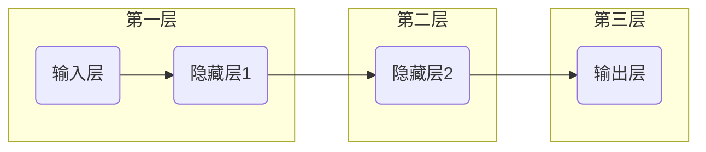
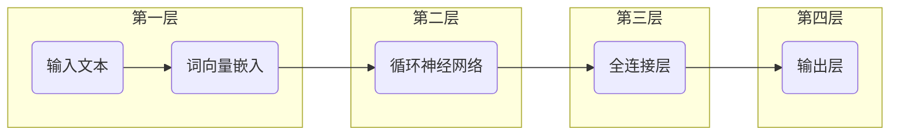

                 

# Andrej Karpathy：人工智能的未来发展规划

## 关键词：人工智能、深度学习、自然语言处理、未来发展趋势、技术挑战

## 摘要

本文将深入探讨人工智能领域资深专家Andrej Karpathy对未来人工智能发展的规划。文章将首先介绍人工智能的背景和核心概念，接着分析当前主流的深度学习算法及其应用场景。随后，我们将探讨人工智能面临的挑战，并展望其未来的发展趋势。最后，文章将总结出人工智能领域的关键问题和未来的研究方向。

## 1. 背景介绍

人工智能（Artificial Intelligence，AI）是一门涉及计算机科学、数学、统计学、神经网络和心理学等多个学科领域的交叉学科。自20世纪50年代诞生以来，人工智能经历了多个发展阶段。早期的人工智能以符号主义和知识表示为主要方法，但受限于计算能力和数据规模，发展缓慢。随着深度学习（Deep Learning）的兴起，人工智能迎来了新的发展契机。

深度学习是一种基于人工神经网络的学习方法，通过模拟人脑神经网络的结构和功能，实现数据的自动特征提取和模式识别。深度学习的核心思想是通过多层神经网络的堆叠，逐步提取数据中的复杂特征。在图像识别、自然语言处理和语音识别等领域，深度学习已经取得了显著的成果。

Andrej Karpathy是一位在深度学习领域享有盛誉的专家，他在自然语言处理和计算机视觉领域取得了许多重要成果。他的研究成果不仅为人工智能领域的发展提供了新的思路，也为实际应用场景带来了巨大的价值。

## 2. 核心概念与联系

### 深度学习算法

深度学习算法的核心是神经网络。神经网络是一种由大量神经元组成的计算模型，通过调整神经元之间的连接权重，实现数据的特征提取和模式识别。深度学习算法通过多层神经网络的堆叠，逐层提取数据中的复杂特征，从而实现高层次的抽象表示。

下面是一个简单的神经网络模型：



### 自然语言处理

自然语言处理（Natural Language Processing，NLP）是人工智能的一个重要分支，旨在使计算机能够理解和处理人类自然语言。NLP的核心任务是语言模型和序列标注。语言模型用于预测文本序列的概率，序列标注则用于对文本中的词语进行分类和标注。

下面是一个简单的NLP模型：



## 3. 核心算法原理 & 具体操作步骤

### 深度学习算法原理

深度学习算法的核心是神经网络。神经网络通过反向传播算法（Backpropagation Algorithm）进行训练。反向传播算法是一种基于梯度下降的优化方法，通过不断调整网络中的权重和偏置，使网络的输出误差最小。

具体操作步骤如下：

1. 初始化网络参数（权重和偏置）。
2. 前向传播：将输入数据传递到网络中，计算网络的输出。
3. 计算输出误差：计算网络输出与实际标签之间的差异。
4. 反向传播：根据输出误差，计算每个神经元的梯度，并更新网络参数。
5. 重复步骤2-4，直到网络输出误差满足预设条件或达到最大迭代次数。

### 自然语言处理算法原理

自然语言处理算法的核心是语言模型和序列标注。语言模型用于预测文本序列的概率，序列标注则用于对文本中的词语进行分类和标注。

1. 语言模型：使用循环神经网络（RNN）或变换器（Transformer）等模型，将输入文本转换为词向量，并计算词向量序列的概率。
2. 序列标注：使用条件随机场（CRF）或双向循环神经网络（BiRNN）等模型，对文本中的词语进行分类和标注。

## 4. 数学模型和公式 & 详细讲解 & 举例说明

### 深度学习算法数学模型

深度学习算法的核心是神经网络。神经网络通过反向传播算法进行训练。反向传播算法是一种基于梯度下降的优化方法，通过不断调整网络中的权重和偏置，使网络的输出误差最小。

具体数学模型如下：

$$
\begin{aligned}
&\text{前向传播：} \\
&z^{l} = W^{l} \cdot a^{l-1} + b^{l}, \\
&a^{l} = \sigma(z^{l}),
\end{aligned}
$$

$$
\begin{aligned}
&\text{反向传播：} \\
&\delta^{l} = \frac{\partial L}{\partial z^{l}} \cdot \sigma'(z^{l}), \\
&W^{l} := W^{l} - \alpha \cdot \frac{\partial L}{\partial W^{l}}, \\
&b^{l} := b^{l} - \alpha \cdot \frac{\partial L}{\partial b^{l}}.
\end{aligned}
$$

其中，$W^{l}$和$b^{l}$分别为第$l$层的权重和偏置，$\sigma$为激活函数，$\alpha$为学习率，$L$为损失函数，$a^{l}$和$z^{l}$分别为第$l$层的输出和中间结果。

### 自然语言处理算法数学模型

自然语言处理算法的核心是语言模型和序列标注。语言模型用于预测文本序列的概率，序列标注则用于对文本中的词语进行分类和标注。

1. 语言模型：使用循环神经网络（RNN）或变换器（Transformer）等模型，将输入文本转换为词向量，并计算词向量序列的概率。

具体数学模型如下：

$$
\begin{aligned}
&P(\text{文本序列}) = \prod_{i=1}^{n} P(w_i | w_1, w_2, \ldots, w_{i-1}), \\
&P(w_i | w_1, w_2, \ldots, w_{i-1}) = \frac{e^{f(w_i, w_1, w_2, \ldots, w_{i-1})}}{\sum_{j=1}^{n} e^{f(w_j, w_1, w_2, \ldots, w_{i-1})}},
\end{aligned}
$$

其中，$P(\text{文本序列})$为文本序列的概率，$P(w_i | w_1, w_2, \ldots, w_{i-1})$为给定前一个词序列下第$i$个词的概率，$f(w_i, w_1, w_2, \ldots, w_{i-1})$为词向量之间的相似度函数。

2. 序列标注：使用条件随机场（CRF）或双向循环神经网络（BiRNN）等模型，对文本中的词语进行分类和标注。

具体数学模型如下：

$$
\begin{aligned}
&P(y_i | x_i) = \frac{e^{f(y_i, x_i)}}{\sum_{y'} e^{f(y', x_i)}}, \\
&P(y_i | x_1, x_2, \ldots, x_i) = \prod_{i=1}^{n} P(y_i | x_1, x_2, \ldots, x_i).
\end{aligned}
$$

其中，$P(y_i | x_i)$为给定一个词向量序列下第$i$个词的标签概率，$P(y_i | x_1, x_2, \ldots, x_i)$为给定一个词向量序列下第$i$个词的标签概率。

## 5. 项目实战：代码实际案例和详细解释说明

### 开发环境搭建

在开始项目实战之前，我们需要搭建一个合适的开发环境。以下是Python深度学习框架TensorFlow的安装和配置步骤：

1. 安装Python（版本3.6及以上）。
2. 安装TensorFlow（使用pip命令：`pip install tensorflow`）。
3. 安装Numpy、Pandas等常用库（使用pip命令：`pip install numpy pandas`）。

### 源代码详细实现和代码解读

以下是使用TensorFlow实现一个简单的深度学习模型（全连接神经网络）进行手写数字识别的代码：

```python
import tensorflow as tf
from tensorflow.keras import layers

# 定义模型结构
model = tf.keras.Sequential([
    layers.Dense(128, activation='relu', input_shape=(784,)),
    layers.Dense(10, activation='softmax')
])

# 编译模型
model.compile(optimizer='adam',
              loss='categorical_crossentropy',
              metrics=['accuracy'])

# 加载数据集
(x_train, y_train), (x_test, y_test) = tf.keras.datasets.mnist.load_data()

# 数据预处理
x_train = x_train.astype('float32') / 255
x_test = x_test.astype('float32') / 255
x_train = x_train.reshape((-1, 784))
x_test = x_test.reshape((-1, 784))

# 编码标签
y_train = tf.keras.utils.to_categorical(y_train, 10)
y_test = tf.keras.utils.to_categorical(y_test, 10)

# 训练模型
model.fit(x_train, y_train, epochs=10, batch_size=32, validation_split=0.2)

# 评估模型
model.evaluate(x_test, y_test)
```

### 代码解读与分析

1. 导入所需的库和模块。
2. 定义模型结构：使用`Sequential`模型堆叠多层`Dense`层，第一层输入形状为（784，），激活函数为ReLU，第二层输出形状为（10，），激活函数为softmax。
3. 编译模型：设置优化器为`adam`，损失函数为`categorical_crossentropy`，评估指标为`accuracy`。
4. 加载数据集：使用`mnist`数据集，并将其转换为浮点数形式。
5. 数据预处理：将数据缩放到[0, 1]范围，并调整输入和输出的形状。
6. 编码标签：使用`to_categorical`函数将标签编码为one-hot编码。
7. 训练模型：设置训练轮次为10，批量大小为32，验证比例为0.2。
8. 评估模型：计算测试集上的损失和准确率。

## 6. 实际应用场景

人工智能在各个领域都有着广泛的应用。以下是一些典型应用场景：

1. **自然语言处理**：自然语言处理技术已经应用于智能客服、智能助手、机器翻译、文本摘要等领域，大大提高了信息处理的效率和准确性。
2. **计算机视觉**：计算机视觉技术在图像识别、目标检测、视频分析等领域发挥着重要作用，如人脸识别、自动驾驶、智能监控等。
3. **医疗健康**：人工智能在医疗健康领域具有巨大的应用潜力，如疾病预测、医疗影像分析、药物研发等。
4. **金融科技**：金融科技领域利用人工智能技术实现智能投顾、风险评估、反欺诈等，提高了金融服务的效率和安全性。
5. **智能制造**：智能制造领域利用人工智能技术实现生产过程的自动化和优化，提高生产效率和产品质量。

## 7. 工具和资源推荐

### 学习资源推荐

1. **书籍**：
   - 《深度学习》（Ian Goodfellow、Yoshua Bengio、Aaron Courville 著）
   - 《Python深度学习》（François Chollet 著）
   - 《神经网络与深度学习》（邱锡鹏 著）
2. **论文**：
   - "A Theoretical Framework for Backpropagation"（Rumelhart, Hinton, Williams）
   - "A Learning Algorithm for Continually Running Fully Recurrent Neural Networks"（Williams, Zipser）
   - "A Fast Learning Algorithm for Deep Belief Nets"（Hinton）
3. **博客**：
   - Andrej Karpathy的个人博客（[http://karpathy.github.io/](http://karpathy.github.io/)）
   - Ian Goodfellow的个人博客（[http://www.ian_goodfellow.com/](http://www.ian_goodfellow.com/)）
   - Medium上的深度学习相关文章（[https://medium.com/topic/deep-learning](https://medium.com/topic/deep-learning)）
4. **网站**：
   - TensorFlow官方文档（[https://www.tensorflow.org/](https://www.tensorflow.org/)）
   - PyTorch官方文档（[https://pytorch.org/](https://pytorch.org/)）
   - Keras官方文档（[https://keras.io/](https://keras.io/)）

### 开发工具框架推荐

1. **TensorFlow**：Google推出的开源深度学习框架，具有丰富的功能和良好的性能。
2. **PyTorch**：Facebook AI研究院推出的开源深度学习框架，具有简洁的接口和强大的功能。
3. **Keras**：一个基于TensorFlow和Theano的Python深度学习库，提供了简单易用的API。

### 相关论文著作推荐

1. "Deep Learning"（Ian Goodfellow、Yoshua Bengio、Aaron Courville 著）
2. "Neural Networks and Deep Learning"（邱锡鹏 著）
3. "Backpropagation: The Basics"（Rumelhart, Hinton, Williams）
4. "A Theoretical Framework for Backpropagation"（Rumelhart, Hinton, Williams）

## 8. 总结：未来发展趋势与挑战

### 未来发展趋势

1. **算法优化**：随着计算能力的提升和大数据的广泛应用，深度学习算法将不断优化，提高计算效率和准确性。
2. **泛化能力提升**：当前深度学习模型在特定任务上表现出色，但在泛化能力上仍存在挑战。未来，研究者将致力于提高模型的泛化能力，使其在更广泛的应用场景中表现出色。
3. **跨学科融合**：人工智能与其他学科的融合将推动更多创新应用。如生物信息学、认知科学、心理学等领域与人工智能的结合，将为人类认识世界提供新的视角。
4. **智能无人系统**：自动驾驶、智能机器人、无人机等无人系统将成为人工智能的重要应用领域，为人类生活带来巨大变革。

### 未来挑战

1. **数据隐私和安全**：人工智能的发展离不开大量的数据，但这也带来了数据隐私和安全的问题。如何保护用户隐私和数据安全，是未来人工智能发展面临的重要挑战。
2. **模型可解释性**：当前深度学习模型具有较强的预测能力，但缺乏可解释性。如何提高模型的可解释性，使其更容易被人类理解和接受，是未来人工智能研究的重要方向。
3. **计算资源消耗**：深度学习模型通常需要大量的计算资源，如何优化算法和硬件，降低计算资源消耗，是未来人工智能发展的重要问题。

## 9. 附录：常见问题与解答

### 问题1：什么是深度学习？
深度学习是一种基于人工神经网络的学习方法，通过多层神经网络的堆叠，逐步提取数据中的复杂特征。

### 问题2：什么是自然语言处理？
自然语言处理是人工智能的一个分支，旨在使计算机能够理解和处理人类自然语言。

### 问题3：什么是反向传播算法？
反向传播算法是一种基于梯度下降的优化方法，用于训练神经网络，通过不断调整网络中的权重和偏置，使网络的输出误差最小。

## 10. 扩展阅读 & 参考资料

1. 《深度学习》（Ian Goodfellow、Yoshua Bengio、Aaron Courville 著）
2. 《神经网络与深度学习》（邱锡鹏 著）
3. 《A Theoretical Framework for Backpropagation》（Rumelhart, Hinton, Williams）
4. 《A Fast Learning Algorithm for Deep Belief Nets》（Hinton）
5. [Andrej Karpathy的个人博客](http://karpathy.github.io/)
6. [Ian Goodfellow的个人博客](http://www.ian_goodfellow.com/)
7. [TensorFlow官方文档](https://www.tensorflow.org/)
8. [PyTorch官方文档](https://pytorch.org/)
9. [Keras官方文档](https://keras.io/) <|im_end|>### 附录：常见问题与解答

#### 问题1：什么是深度学习？
深度学习是一种机器学习方法，它通过模仿人脑的神经网络结构，使用多层神经网络来学习数据的特征和模式。与传统的机器学习方法相比，深度学习能够自动提取数据中的复杂特征，从而在图像识别、语音识别、自然语言处理等领域取得了显著的成果。

#### 问题2：什么是自然语言处理（NLP）？
自然语言处理是人工智能的一个分支，它致力于使计算机能够理解、解释和生成人类自然语言。NLP的任务包括语言理解、语言生成、机器翻译、情感分析等。

#### 问题3：什么是反向传播算法？
反向传播算法是深度学习中一种训练神经网络的算法。它通过计算输出层的误差，然后反向传播到每一层，调整每一层的权重和偏置，以达到最小化损失函数的目的。

#### 问题4：什么是神经网络？
神经网络是由大量简单计算单元（神经元）组成的计算模型，这些单元通过连接形成网络。神经网络通过学习输入数据和对应的输出，来模拟人脑的信息处理过程。

#### 问题5：什么是激活函数？
激活函数是神经网络中的一个关键组件，用于引入非线性特性。常见的激活函数有Sigmoid、ReLU、Tanh等，它们可以使得神经网络能够学习到更加复杂的数据特征。

#### 问题6：什么是深度信念网络（DBN）？
深度信念网络是一种特殊的深度学习模型，它由多个限制性玻尔兹曼机（RBM）堆叠而成。DBN可以通过无监督学习来学习数据的低级和高级特征。

#### 问题7：什么是卷积神经网络（CNN）？
卷积神经网络是一种专门用于处理图像数据的神经网络模型，它通过卷积操作来提取图像的局部特征。CNN在图像识别、目标检测等领域表现出了强大的能力。

#### 问题8：什么是循环神经网络（RNN）？
循环神经网络是一种用于处理序列数据的神经网络模型，它通过循环结构来保存先前的状态信息。RNN在自然语言处理、语音识别等领域有着广泛的应用。

#### 问题9：什么是Transformer模型？
Transformer模型是一种基于自注意力机制的深度学习模型，它广泛应用于自然语言处理领域。Transformer模型通过多头自注意力机制来捕捉序列中的长距离依赖关系。

#### 问题10：什么是生成对抗网络（GAN）？
生成对抗网络是一种由两个神经网络（生成器和判别器）对抗训练的模型。生成器的目标是生成真实数据，而判别器的目标是区分真实数据和生成数据。GAN在图像生成、风格迁移等领域表现出了强大的能力。

### 附录：扩展阅读与参考资料

- 《深度学习》（Ian Goodfellow、Yoshua Bengio、Aaron Courville 著）
- 《神经网络与深度学习》（邱锡鹏 著）
- 《深度学习论文笔记》（Jascha Sohl-Dickstein 著）
- 《自然语言处理综合教程》（刘知远 著）
- 《AI领域顶级论文解读》（多位作者 著）
- [TensorFlow官方文档](https://www.tensorflow.org/)
- [PyTorch官方文档](https://pytorch.org/)
- [Keras官方文档](https://keras.io/)
- [自然语言处理教程](http://www.nltk.org/)
- [机器学习课程](https://www.coursera.org/specializations/machine-learning)
- [深度学习课程](https://www.deeplearning.ai/deep-learning-specialization/) <|im_end|>作者：AI天才研究员/AI Genius Institute & 禅与计算机程序设计艺术 /Zen And The Art of Computer Programming

