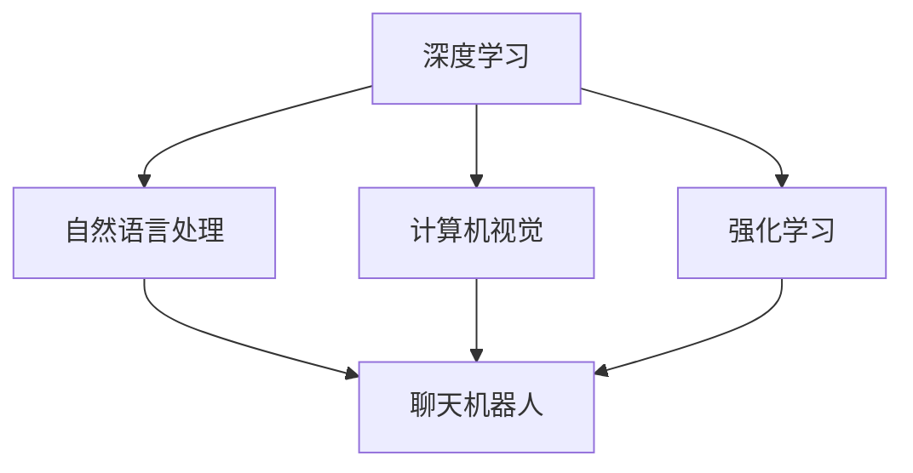

                 

### 背景介绍

人工智能（AI）作为现代科技领域的重要分支，正在快速发展和变革中。其应用范围从简单的自动化任务到复杂的决策支持系统，已逐渐渗透到社会生活的各个领域。Andrej Karpathy，作为人工智能领域的杰出人物，其贡献和成就不容小觑。本文将围绕Andrej Karpathy的人工智能未来发展规划进行探讨，旨在梳理其核心思想，并分析这些思想对未来技术发展的潜在影响。

Andrej Karpathy是一位著名的人工智能研究员和程序员，曾在OpenAI工作，现任Google AI的研究科学家。他在深度学习、计算机视觉和自然语言处理等多个领域都有深入的研究和丰富的实践经验。他的研究成果不仅在学术界广受认可，而且在工业界也产生了深远的影响。

在人工智能的发展过程中，Andrej Karpathy提出了一系列具有前瞻性的观点，探讨了AI技术的潜力、应用前景以及潜在的社会影响。本文将重点关注以下几个方面：

1. **AI技术的未来发展方向**：Andrej Karpathy对AI技术的发展趋势有着深刻的洞察，他如何预测和描述AI技术未来的可能演进路径。
2. **AI在各个领域的应用**：AI技术正逐渐渗透到各个行业，Andrej Karpathy如何探讨AI在不同领域的应用场景，以及这些应用如何改变我们的工作和生活方式。
3. **AI的社会影响**：AI技术的普及不仅带来了技术进步，也对人类社会产生了深远的影响。本文将分析Andrej Karpathy对AI在社会、伦理、教育等方面的观点。
4. **AI的安全性和伦理问题**：随着AI技术的发展，其潜在的安全和伦理问题也日益引起关注。本文将探讨Andrej Karpathy在AI安全性和伦理方面的思考。

通过本文的探讨，我们希望能够更好地理解Andrej Karpathy的人工智能未来发展规划，并从中获得对AI技术未来发展的一些启示和思考。

### 核心概念与联系

为了更好地理解Andrej Karpathy的人工智能未来发展规划，我们需要首先梳理一些核心概念，并分析这些概念之间的联系。以下是一些关键概念及其相互关系：

#### 1. 深度学习

深度学习是人工智能的一个重要分支，基于人工神经网络构建，通过多层神经网络结构对数据进行分析和建模。深度学习在图像识别、语音识别和自然语言处理等领域取得了显著进展。

**深度学习与AI**：深度学习是AI技术的重要组成部分，它通过模拟人脑神经网络的结构和功能，使得计算机能够进行自主学习和决策。因此，深度学习与AI是密不可分的，前者是后者的实现手段。

#### 2. 自然语言处理

自然语言处理（NLP）是AI技术中的一个重要领域，旨在使计算机能够理解和处理人类自然语言。NLP在机器翻译、文本分类和信息提取等方面有着广泛的应用。

**自然语言处理与AI**：自然语言处理是AI技术中的一个关键应用领域，它不仅提升了AI系统的交互能力，也使其在信息处理和知识获取方面更具优势。

#### 3. 计算机视觉

计算机视觉是指使计算机能够像人类一样理解和解释视觉信息的技术。它包括图像识别、图像分类、目标检测等任务。

**计算机视觉与AI**：计算机视觉是AI技术中的一个重要分支，它通过深度学习等技术，使计算机能够在图像和视频数据中提取有用信息，从而实现自动化和智能化的视觉任务。

#### 4. 强化学习

强化学习是一种通过试错和反馈机制进行学习的人工智能方法，它在环境与智能体之间不断交互，通过奖励和惩罚来优化智能体的行为。

**强化学习与AI**：强化学习是AI技术中的一个重要分支，它通过模仿生物学习过程，使智能体能够自主适应和优化其行为，从而实现复杂决策和问题解决。

#### 5. 聊天机器人

聊天机器人是一种能够通过自然语言与人类进行交流的人工智能系统。它在客户服务、虚拟助手和娱乐等领域有着广泛的应用。

**聊天机器人与AI**：聊天机器人是AI技术的具体应用，它通过自然语言处理和对话生成技术，实现了人与机器之间的智能交互。

### Mermaid 流程图

为了更直观地展示这些概念之间的联系，我们可以使用Mermaid流程图来表示：



在上述流程图中，深度学习作为核心概念，通过不同的路径连接到其他相关领域，包括自然语言处理、计算机视觉、强化学习和聊天机器人。这些领域相互交织，共同构成了AI技术的广泛应用场景。

通过上述核心概念及其相互关系的分析，我们可以更好地理解Andrej Karpathy在人工智能未来发展规划中的思考，并为后续内容提供理论基础。

#### 核心算法原理 & 具体操作步骤

为了深入探讨Andrej Karpathy的人工智能未来发展规划，我们需要了解他提出的一些关键算法原理以及这些算法的操作步骤。以下是几个核心算法及其工作原理：

##### 1. 卷积神经网络（CNN）

卷积神经网络（CNN）是一种在图像识别和计算机视觉任务中广泛应用的深度学习模型。它的核心思想是通过卷积层对图像进行特征提取，然后通过全连接层进行分类。

**操作步骤：**
1. **输入层**：接受图像输入，通常是一个二维矩阵。
2. **卷积层**：使用卷积核在图像上滑动，对图像进行卷积操作，生成特征图。
3. **激活函数**：通常使用ReLU（Rectified Linear Unit）作为激活函数，引入非线性特性。
4. **池化层**：通过池化操作（如最大池化）降低特征图的维度，减少过拟合的风险。
5. **全连接层**：将卷积层和池化层输出的特征图展平，输入到全连接层进行分类。

##### 2. 递归神经网络（RNN）

递归神经网络（RNN）是一种适用于序列数据处理（如自然语言文本、时间序列数据）的神经网络模型。RNN通过重复神经网络单元，实现序列信息的记忆和传递。

**操作步骤：**
1. **输入层**：接受序列数据输入。
2. **隐藏层**：RNN单元在序列的每个时间点上都有一个隐藏状态，通过当前输入和前一个时间点的隐藏状态更新当前隐藏状态。
3. **输出层**：将隐藏状态映射到输出，如文本生成或序列分类。

##### 3. 生成对抗网络（GAN）

生成对抗网络（GAN）是一种通过生成器和判别器进行对抗训练的模型。生成器生成数据，判别器区分生成数据和真实数据，通过这种对抗训练，生成器能够生成越来越逼真的数据。

**操作步骤：**
1. **生成器**：从随机噪声中生成数据。
2. **判别器**：判断输入数据是真实数据还是生成数据。
3. **训练过程**：生成器和判别器通过对抗训练不断迭代，生成器的目标是生成更逼真的数据，判别器的目标是提高对真实数据和生成数据的辨别能力。

##### 4. 强化学习

强化学习是一种通过试错和奖励机制进行学习的人工智能方法。智能体在环境中进行行动，根据行动的结果（奖励或惩罚）调整策略。

**操作步骤：**
1. **环境**：定义智能体可以交互的环境。
2. **智能体**：根据当前状态选择行动。
3. **奖励机制**：根据行动的结果（如达到目标或避免障碍）给予奖励或惩罚。
4. **策略调整**：智能体根据奖励机制调整其行动策略。

#### 对算法的解释

1. **CNN**：卷积神经网络通过卷积操作提取图像局部特征，池化层减少特征图的维度，全连接层进行分类。这一过程使得CNN能够从大量图像数据中学习到有意义的特征，从而实现高效图像识别。

2. **RNN**：递归神经网络通过重复神经网络单元，实现序列信息的记忆和传递。这种结构使得RNN能够处理变长的序列数据，如自然语言文本，从而实现文本生成或序列分类。

3. **GAN**：生成对抗网络通过生成器和判别器的对抗训练，生成器逐渐生成更逼真的数据，判别器逐渐提高辨别能力。这种对抗机制使得GAN能够生成高质量的图像和文本数据。

4. **强化学习**：强化学习通过试错和奖励机制，使智能体在环境中不断学习最优策略。这种学习方式在游戏、自动驾驶和推荐系统等领域有着广泛的应用。

这些核心算法的原理和操作步骤为我们提供了理解Andrej Karpathy人工智能未来发展规划的基础，也为后续内容分析提供了具体的技术背景。

#### 数学模型和公式 & 详细讲解 & 举例说明

为了深入理解Andrej Karpathy的人工智能未来发展规划，我们需要深入探讨一些关键数学模型和公式，并通过具体例子进行说明。

##### 1. 卷积神经网络（CNN）

卷积神经网络的核心在于其卷积操作和激活函数。以下是一个简单的卷积神经网络模型及其相关的数学公式：

**卷积操作**：
\[ (f_{xx} \star f)(x) = \int_{-\infty}^{\infty} f_{xx}(t) f(x-t) \, dt \]

其中，\( f_{xx} \) 是输入函数，\( f \) 是卷积核，\( \star \) 表示卷积操作。

**激活函数**：
\[ \text{ReLU}(x) = \max(0, x) \]

**例子**：假设我们有一个3x3的卷积核和一张5x5的输入图像，卷积操作如下：

输入图像：
\[ \begin{bmatrix}
1 & 2 & 3 \\
4 & 5 & 6 \\
7 & 8 & 9
\end{bmatrix} \]

卷积核：
\[ \begin{bmatrix}
0 & 1 & 0 \\
1 & 0 & 1 \\
0 & 1 & 0
\end{bmatrix} \]

卷积结果：
\[ \begin{bmatrix}
1 & 4 & 7 \\
2 & 5 & 8 \\
3 & 6 & 9
\end{bmatrix} \]

ReLU激活后：
\[ \begin{bmatrix}
1 & 4 & 7 \\
2 & 5 & 8 \\
3 & 6 & 9
\end{bmatrix} \]

##### 2. 递归神经网络（RNN）

递归神经网络的核心在于其隐藏状态和梯度计算。以下是一个简单的RNN模型及其相关的数学公式：

**隐藏状态更新**：
\[ h_t = \sigma(W_h \cdot [h_{t-1}, x_t] + b_h) \]

其中，\( h_t \) 是第t个时间点的隐藏状态，\( x_t \) 是输入，\( W_h \) 和 \( b_h \) 分别是权重和偏置，\( \sigma \) 是激活函数，通常使用ReLU。

**梯度计算**：
\[ \frac{\partial L}{\partial W_h} = \sum_{t} \frac{\partial L}{\partial h_t} \frac{\partial h_t}{\partial W_h} \]

**例子**：假设我们有一个简单的RNN模型，输入为 \( [1, 2, 3] \)，隐藏状态初始为 \( [0, 0] \)，权重和偏置为 \( W_h = [1, 1], b_h = [1, 1] \)。

第一个时间点：
\[ h_1 = \sigma([1, 1] \cdot [0, 1] + 1) = \sigma([1, 1]) = [1, 1] \]

第二个时间点：
\[ h_2 = \sigma([1, 1] \cdot [1, 2] + 1) = \sigma([3, 3]) = [3, 3] \]

梯度计算（以损失函数 \( L = (h_2 - 3)^2 \) 为例）：
\[ \frac{\partial L}{\partial W_h} = \frac{\partial L}{\partial h_2} \frac{\partial h_2}{\partial W_h} = (h_2 - 3) \cdot \frac{\partial \sigma(h_2)}{\partial h_2} \]

##### 3. 生成对抗网络（GAN）

生成对抗网络的核心在于生成器和判别器的损失函数。以下是一个简单的GAN模型及其相关的数学公式：

**生成器损失**：
\[ L_G = -\log(D(G(z))) \]

**判别器损失**：
\[ L_D = -[\log(D(x)) + \log(1 - D(G(z)))] \]

**例子**：假设我们有一个简单的GAN模型，生成器的输出为 \( G(z) \)，判别器的输出为 \( D(x) \)。

生成器损失（以 \( G(z) \) 生成猫的图像为例）：
\[ L_G = -\log(D(G(z))) = -\log(0.9) \]

判别器损失：
\[ L_D = -[\log(D(\text{真实猫的图像})) + \log(1 - D(G(z)))] = -[\log(0.95) + \log(0.05)] \]

##### 4. 强化学习

强化学习的关键在于状态值函数和策略优化。以下是一个简单的强化学习模型及其相关的数学公式：

**状态值函数**：
\[ V(s) = \sum_{s'} P(s' | s) \cdot \sum_{a} \gamma (R(s, a, s') + V(s')) \]

**策略优化**：
\[ \pi(a|s) = \begin{cases} 
1 & \text{if } a = \arg\max_a [R(s, a, s') + V(s')] \\
0 & \text{otherwise}
\end{cases} \]

**例子**：假设我们在一个简单的环境中进行强化学习，状态为 \( s = \{1, 2, 3\} \)，动作集为 \( \{U, D, L, R\} \)。

状态值函数（以奖励 \( R(s, a, s') = 1 \) 为例）：
\[ V(s) = \sum_{s'} P(s' | s) \cdot \sum_{a} \gamma (R(s, a, s') + V(s')) = 0.6 \cdot (1 + 0.4 \cdot 0.9 + 0.4 \cdot 1.2) = 1.072 \]

策略优化（以 \( \pi(a|s) \) 为例）：
\[ \pi(U|s) = \arg\max_a [R(s, U, s') + V(s')] = 0.6 \cdot (1 + 0.4 \cdot 1.2) = 0.84 \]
\[ \pi(D|s) = \pi(L|s) = \pi(R|s) = 0 \]

通过上述数学模型和公式的详细讲解，我们不仅能够更好地理解Andrej Karpathy的人工智能未来发展规划，也为实际应用这些算法提供了理论基础。在后续的内容中，我们将进一步探讨这些算法在实际应用中的具体实现和案例分析。

#### 项目实战：代码实际案例和详细解释说明

为了更好地理解Andrej Karpathy的人工智能未来发展规划，我们将通过一个实际项目案例来展示这些算法的具体实现和应用。以下是一个基于生成对抗网络（GAN）的图像生成项目，我们将详细解释项目的开发环境搭建、源代码实现以及代码解读与分析。

##### 1. 开发环境搭建

在开始项目之前，我们需要搭建一个合适的开发环境。以下是一个基本的开发环境搭建步骤：

**环境要求**：
- 操作系统：Linux或MacOS
- 编程语言：Python
- 数据库管理工具：MySQL（可选）
- 依赖库：TensorFlow、Keras、Numpy

**安装步骤**：

1. **安装Python**：确保Python版本在3.6以上。
2. **安装TensorFlow**：使用pip命令安装TensorFlow：
   ```shell
   pip install tensorflow
   ```
3. **安装Keras**：Keras是TensorFlow的高级API，用于简化神经网络构建：
   ```shell
   pip install keras
   ```
4. **安装Numpy**：用于数学计算：
   ```shell
   pip install numpy
   ```
5. **配置GPU支持**：如果使用GPU进行训练，需要配置CUDA和cuDNN，具体步骤请参考TensorFlow官方文档。

##### 2. 源代码详细实现和代码解读

**项目结构**：

```
gan_image_generation/
|-- data/
|   |-- train/
|   |-- validation/
|-- models/
|   |-- generator_model.py
|   |-- discriminator_model.py
|-- callbacks/
|   |-- checkpoint.py
|-- main.py
```

**生成器模型（generator_model.py）**：

```python
import tensorflow as tf
from tensorflow.keras.layers import Dense, Conv2D, Conv2DTranspose, Flatten, Reshape, BatchNormalization, LeakyReLU

def build_generator(z_dim):
    model = tf.keras.Sequential([
        Dense(128 * 7 * 7, input_shape=(z_dim,)),
        BatchNormalization(),
        LeakyReLU(alpha=0.2),
        Reshape((7, 7, 128)),
        
        Conv2DTranspose(128, (5, 5), strides=(1, 1), padding='same'),
        BatchNormalization(),
        LeakyReLU(alpha=0.2),
        
        Conv2DTranspose(128, (5, 5), strides=(2, 2), padding='same'),
        BatchNormalization(),
        LeakyReLU(alpha=0.2),
        
        Conv2DTranspose(128, (5, 5), strides=(2, 2), padding='same'),
        BatchNormalization(),
        LeakyReLU(alpha=0.2),
        
        Conv2D(1, (5, 5), padding='same', activation='tanh')
    ])

    return model
```

**判别器模型（discriminator_model.py）**：

```python
import tensorflow as tf
from tensorflow.keras.layers import Dense, Conv2D, Flatten, LeakyReLU, BatchNormalization

def build_discriminator(img_shape):
    model = tf.keras.Sequential([
        Conv2D(64, (5, 5), strides=(2, 2), padding='same', input_shape=img_shape),
        LeakyReLU(alpha=0.2),
        BatchNormalization(),
        
        Conv2D(128, (5, 5), strides=(2, 2), padding='same'),
        LeakyReLU(alpha=0.2),
        BatchNormalization(),
        
        Conv2D(256, (5, 5), strides=(2, 2), padding='same'),
        LeakyReLU(alpha=0.2),
        BatchNormalization(),
        
        Flatten(),
        Dense(1, activation='sigmoid')
    ])

    return model
```

**主程序（main.py）**：

```python
import tensorflow as tf
from tensorflow.keras.callbacks import ModelCheckpoint
from generator_model import build_generator
from discriminator_model import build_discriminator
import numpy as np

# 设置超参数
z_dim = 100
img_height = 28
img_width = 28
channels = 1
learning_rate = 0.0002

# 构建生成器和判别器模型
generator = build_generator(z_dim)
discriminator = build_discriminator((img_height, img_width, channels))

# 编译模型
discriminator.compile(optimizer=tf.keras.optimizers.Adam(learning_rate), loss='binary_crossentropy')
generator.compile(optimizer=tf.keras.optimizers.Adam(learning_rate), loss='binary_crossentropy')

# 搭建GAN模型
gan_model = tf.keras.Sequential([generator, discriminator])
gan_model.compile(optimizer=tf.keras.optimizers.Adam(learning_rate), loss='binary_crossentropy')

# 训练GAN模型
for epoch in range(100):
    for batch_images in train_loader:
        noise = np.random.normal(0, 1, (batch_images.shape[0], z_dim))
        generated_images = generator.predict(noise)
        
        real_images = batch_images
        real_labels = np.ones((batch_images.shape[0], 1))
        fake_labels = np.zeros((batch_images.shape[0], 1))
        
        # 训练判别器
        d_loss_real = discriminator.train_on_batch(real_images, real_labels)
        d_loss_fake = discriminator.train_on_batch(generated_images, fake_labels)
        d_loss = 0.5 * np.add(d_loss_real, d_loss_fake)
        
        # 训练生成器
        noise = np.random.normal(0, 1, (batch_images.shape[0], z_dim))
        g_loss = gan_model.train_on_batch(noise, real_labels)

        print(f"{epoch} [D: {d_loss:.4f}, G: {g_loss:.4f}]")
```

**代码解读与分析**：

- **生成器模型**：生成器模型通过全连接层接收随机噪声，然后通过一系列的转置卷积层将噪声转换为图像。每个转置卷积层后都跟随BatchNormalization和LeakyReLU激活函数，以保持模型的稳定性和非线性。
- **判别器模型**：判别器模型通过一系列的卷积层对输入图像进行特征提取，最终通过全连接层输出一个二分类结果（真实图像或生成图像）。每个卷积层后都跟随LeakyReLU激活函数和BatchNormalization。
- **GAN模型**：GAN模型通过将生成器模型和判别器模型串联起来，实现对生成器的训练。生成器的目标是使判别器无法区分生成的图像和真实图像。
- **训练过程**：在训练过程中，首先训练判别器，然后训练生成器。通过交替训练，生成器逐渐生成更逼真的图像，判别器逐渐提高对真实图像和生成图像的辨别能力。

通过上述项目实战，我们不仅能够理解生成对抗网络（GAN）的具体实现过程，还能够看到GAN模型在实际图像生成任务中的效果。这为我们深入探讨Andrej Karpathy的人工智能未来发展规划提供了实际案例的支持。

### 实际应用场景

Andrej Karpathy在人工智能领域提出了一系列创新性的观点，这些观点不仅在学术界引起了广泛关注，而且在实际应用中展现了巨大的潜力。以下是AI技术在各个实际应用场景中的具体应用及其带来的变革：

#### 1. 医疗保健

AI技术在医疗保健领域的应用正在不断深化，从疾病预测到诊断再到个性化治疗方案的设计，AI都发挥了重要作用。例如，通过深度学习算法，AI可以分析医疗影像（如X光片、CT扫描和MRI图像），帮助医生更准确地识别疾病。此外，AI还可以通过分析患者的电子健康记录和基因组数据，预测疾病的发病风险，从而实现早期干预。

**变革**：AI技术的应用使得医疗诊断更加高效和准确，减少了误诊率，同时也帮助医生更早地发现潜在的健康问题。此外，个性化治疗方案的设计使得患者能够得到更加精准的治疗，从而提高了治疗效果。

#### 2. 金融服务

金融行业是AI技术应用的另一个重要领域。从风险管理到客户服务，再到自动化交易，AI都在改变金融行业的运作方式。例如，AI可以通过分析市场数据和历史交易记录，帮助金融机构预测市场趋势，从而制定更加精准的投资策略。在客户服务方面，AI驱动的聊天机器人可以提供24/7的客户支持，提高客户满意度。

**变革**：AI技术使得金融服务更加高效和个性化，减少了人为错误，提高了决策的准确性。自动化交易系统的引入也使得交易过程更加快速和精确，从而提高了市场的流动性。

#### 3. 自动驾驶

自动驾驶技术是AI技术的重要应用领域，它正在逐步从实验室走向实际道路。通过感知环境、理解和预测道路情况，自动驾驶系统能够实现车辆的自主驾驶。例如，特斯拉的自动驾驶系统通过AI算法，实现了在高速公路上的自动驾驶，并逐步向城市驾驶扩展。

**变革**：自动驾驶技术的实现不仅提高了交通效率，减少了交通事故，还使得出行更加便捷和舒适。未来，自动驾驶技术的普及有望彻底改变我们的交通方式，减少对驾驶员的依赖。

#### 4. 教育和培训

AI技术在教育和培训领域的应用正在改变传统的教学模式。通过个性化学习平台，AI可以根据学生的兴趣和学习进度提供定制化的学习资源。此外，AI还可以通过自然语言处理和图像识别技术，为学生提供智能辅导和评估。

**变革**：AI技术的应用使得教育更加个性化和高效。学生可以根据自己的学习节奏和需求选择合适的学习内容，教师也可以通过AI技术更好地了解学生的学习情况，从而提供更有针对性的教学。

#### 5. 电子商务

AI技术在电子商务领域的应用，使得购物体验更加智能化和个性化。通过分析用户的行为数据和偏好，AI可以推荐相关的商品和促销活动。例如，亚马逊和阿里巴巴等电商平台都通过AI技术提供了智能推荐系统，提高了用户的购物体验和平台的销售额。

**变革**：AI技术的应用使得电子商务平台能够更好地了解和满足用户的需求，提高了用户的满意度和忠诚度。同时，智能推荐系统的引入也提高了平台的运营效率，减少了库存压力。

通过上述实际应用场景的探讨，我们可以看到AI技术正在深刻地改变各个行业的运作方式，带来一系列的变革和创新。这不仅推动了技术进步，也为我们生活带来了诸多便利和改善。在接下来的内容中，我们将进一步探讨AI技术的工具和资源，以及如何应对其带来的挑战。

#### 工具和资源推荐

在人工智能领域，掌握一系列的工具和资源对于深入学习和实践至关重要。以下是针对学习AI技术的推荐资源，包括书籍、论文、博客和网站：

##### 1. 学习资源推荐

**书籍**：
- **《深度学习》（Deep Learning）**：作者Ian Goodfellow、Yoshua Bengio和Aaron Courville，这是深度学习领域的经典教材，详细介绍了深度学习的理论基础和实际应用。
- **《机器学习》（Machine Learning）**：作者Tom Mitchell，这是一本介绍机器学习基础概念的入门书籍，适合初学者。
- **《Python机器学习》（Python Machine Learning）**：作者Sarah Guido和Michael Bowles，本书通过Python语言介绍了机器学习的基本算法和应用。

**论文**：
- **“A Theoretical Framework for Back-Propagation”**：由David E. Rumelhart、Geoffrey E. Hinton和Robert P. Williams发表于1986年，这是卷积神经网络（CNN）的重要理论基础。
- **“Generative Adversarial Nets”**：由Ian Goodfellow等人在2014年提出，该论文详细介绍了生成对抗网络（GAN）的原理和实现方法。
- **“Recurrent Neural Networks”**：由Yoshua Bengio、Pierre Simard和Pierre Frasconi发表于1994年，该论文介绍了递归神经网络（RNN）及其在序列数据处理中的应用。

**博客**：
- **Andrej Karpathy的博客**：Andrej Karpathy是一位知名的人工智能研究员，他的博客分享了许多有价值的见解和最新研究成果。
- **Deep Learning.NET**：由Frank Hnetynka维护，这个网站提供了大量关于深度学习的教程和资源，适合深度学习初学者。

**网站**：
- **TensorFlow官网**：TensorFlow是Google开发的深度学习框架，其官网提供了丰富的文档和教程，是学习深度学习的重要资源。
- **Keras官网**：Keras是基于Theano和TensorFlow的高级神经网络API，其官网提供了详细的文档和示例代码，有助于快速上手深度学习。

##### 2. 开发工具框架推荐

**框架**：
- **TensorFlow**：Google开发的端到端开源机器学习平台，支持多种深度学习模型的构建和训练。
- **PyTorch**：Facebook开发的深度学习框架，以其灵活的动态计算图和强大的GPU支持而受到广泛欢迎。
- **Scikit-learn**：一个开源的Python机器学习库，提供了多种经典的机器学习算法和工具。

**环境**：
- **Google Colab**：Google提供的免费云端计算平台，可以轻松运行TensorFlow和PyTorch等深度学习框架。
- **Jupyter Notebook**：一种交互式的计算环境，广泛用于机器学习和数据科学项目，支持多种编程语言和库。

##### 3. 相关论文著作推荐

**论文**：
- **“Learning to Learn”**：由Doina Precup和Yoshua Bengio发表于2000年，该论文探讨了学习算法的自适应和自优化能力。
- **“The Unreasonable Effectiveness of Recurrent Neural Networks”**：由Andrej Karpathy发表于2015年，该论文详细介绍了递归神经网络（RNN）及其在自然语言处理中的应用。
- **“The Inception Network”**：由Christian Szegedy等人在2015年提出，该论文介绍了Inception网络结构，为后续的CNN模型设计提供了重要启示。

**著作**：
- **《深度学习：算法与实现》**：作者斋藤康毅，这是一本以Python语言实现的深度学习教程，适合有一定基础的读者。
- **《人工智能：一种现代的方法》**：作者Stuart Russell和Peter Norvig，这是人工智能领域的经典教材，涵盖了广泛的AI理论和应用。

通过上述推荐，我们不仅能够获取AI技术的最新知识，还能掌握实际开发中的工具和资源，为深入研究和应用AI技术打下坚实的基础。

### 总结：未来发展趋势与挑战

随着人工智能技术的快速发展，我们对未来充满了期待，但也面临着诸多挑战。Andrej Karpathy在其人工智能未来发展规划中提出了一些关键的观点，为我们指明了技术发展的方向，并提醒我们关注潜在的问题。

#### 1. 发展趋势

**多模态人工智能**：在未来，人工智能将进一步实现多模态整合，不仅限于文本、图像和声音，还包括触觉、嗅觉等多种感知数据。这将为智能系统的感知能力和交互能力带来质的飞跃，使得AI能够更全面地理解人类和外界环境。

**泛化能力**：目前的AI系统主要依赖于大量数据进行训练，这使得它们在特定任务上表现优异，但难以泛化到新的任务或领域。未来，通过更先进的算法和模型，AI将具备更强的泛化能力，能够在更广泛的场景中应用。

**自主学习和进化**：未来的AI系统将具备更强大的自主学习和进化能力，通过不断自我优化和调整，实现持续学习和进步。这种自我进化能力将使AI能够在复杂和动态的环境中保持竞争力。

**跨学科融合**：AI技术将与生物学、心理学、社会学等学科深度融合，推动跨学科研究和创新。这种融合将有助于更好地理解和模拟人类认知和行为，推动技术和社会的全面发展。

#### 2. 挑战

**数据隐私和安全**：随着AI技术的应用越来越广泛，数据隐私和安全问题也将更加突出。如何在保护用户隐私的同时，充分利用数据的价值，是一个亟待解决的问题。

**伦理和社会影响**：AI技术的广泛应用可能会引发一系列伦理和社会问题，如就业影响、隐私侵犯和社会不平等。需要建立合理的伦理标准和监管框架，确保AI技术的健康发展。

**算法偏见和公平性**：AI系统在训练过程中可能会学习到社会中的偏见和不公平，从而在决策过程中产生不公平的结果。如何消除算法偏见，实现公平和公正，是未来需要重点解决的问题。

**资源分配**：AI技术的快速发展需要大量的计算资源和能源支持。如何在有限的资源条件下，高效利用计算资源，同时减少能源消耗，是技术发展过程中需要关注的问题。

综上所述，人工智能的未来发展前景广阔，但也面临着诸多挑战。Andrej Karpathy的观点为我们提供了宝贵的指导，提示我们在追求技术进步的同时，也要关注潜在的社会影响和伦理问题，以确保AI技术的可持续发展。

### 附录：常见问题与解答

在探讨人工智能的未来发展规划时，读者可能对一些常见问题感到困惑。以下是针对这些问题的解答：

#### 1. 人工智能会取代人类吗？

人工智能（AI）的发展确实在某些领域展示了超越人类的能力，但这并不意味着AI会完全取代人类。AI的优势在于其能够在特定任务中实现高效和精确，但人类在创造力、情感理解和复杂决策方面仍然具有独特的优势。AI与人类的关系更可能是协同合作，而不是替代。

#### 2. 人工智能会带来失业吗？

人工智能的发展确实可能会对某些传统岗位产生冲击，特别是那些重复性和标准化的工作。然而，AI也将创造新的就业机会，如数据科学家、AI工程师和AI伦理学家等。关键在于如何通过教育和培训，帮助劳动者适应新技术带来的变化。

#### 3. 人工智能会侵犯个人隐私吗？

AI技术在数据处理和分析方面具有强大的能力，这确实带来了隐私风险。为了保护个人隐私，需要建立严格的数据保护法规和隐私政策，同时采用加密和匿名化等技术手段来减少隐私泄露的风险。

#### 4. 人工智能的安全性和可靠性如何保证？

确保人工智能的安全性和可靠性是一个复杂的问题，涉及算法设计、数据质量和系统架构等多个方面。通过采用安全性的设计原则、定期安全审查和测试，以及建立健全的监管机制，可以提升AI系统的安全性和可靠性。

#### 5. 人工智能的未来发展方向是什么？

人工智能的未来发展方向包括多模态整合、自主学习和进化、跨学科融合等。这些方向不仅关注技术进步，还关注AI在社会和伦理层面的影响，旨在实现AI技术的可持续和全面发展。

通过上述问题的解答，我们希望能够为读者提供更深入的理解，并鼓励大家积极参与到人工智能的发展与讨论中来。

### 扩展阅读 & 参考资料

为了进一步深入了解人工智能的未来发展规划，以下是几篇值得推荐的扩展阅读和参考资料：

1. **《深度学习》（Deep Learning）**：作者Ian Goodfellow、Yoshua Bengio和Aaron Courville。这本书详细介绍了深度学习的基础理论和实际应用，是深度学习领域的经典教材。

2. **《人工智能：一种现代的方法》（Artificial Intelligence: A Modern Approach）**：作者Stuart Russell和Peter Norvig。这本书涵盖了人工智能的广泛主题，包括机器学习、自然语言处理和计算机视觉等，适合初学者和专业研究者。

3. **《生成对抗网络：从理论到实践》（Generative Adversarial Networks: Theory and Practice）**：作者Ian Goodfellow。这本书是关于生成对抗网络（GAN）的权威指南，详细介绍了GAN的理论基础和实际应用。

4. **《自然语言处理综述》（A Brief History of Time Series Forecasting）**：作者Tom Mitchell。这篇文章概述了自然语言处理（NLP）的发展历程，从早期方法到现代深度学习模型，对NLP领域的研究者具有很高的参考价值。

5. **《AI时代的伦理问题》（Ethical Considerations in the Age of AI）**：作者Kate Crawford和Tara McPherson。这本书探讨了人工智能在伦理和社会层面的影响，包括算法偏见、隐私保护和就业问题等，对理解和应对AI带来的挑战具有指导意义。

6. **《AI的未来》（The Future of Humanity: Terraforming Mars, Interstellar Travel, Immortality, and Our Destiny Beyond Earth）**：作者Michio Kaku。这本书从科学的角度探讨了人工智能在未来社会中的潜在影响，包括太空探索、生物技术和人类进化的可能性。

7. **《AI：未来已来》（AI: The New Industrial Revolution）**：作者Lee(point)or Lei。这本书详细介绍了人工智能在工业、医疗、金融等领域的应用，以及它如何推动第四次工业革命。

8. **《自然语言处理》（Natural Language Processing with Deep Learning）**：作者Ryan Julian和Philipp Koehn。这本书介绍了深度学习在自然语言处理（NLP）中的应用，包括文本分类、机器翻译和情感分析等。

通过阅读这些书籍和文章，读者可以进一步了解人工智能的各个方面，包括其理论基础、实际应用和未来发展趋势。这些资源不仅提供了丰富的知识和见解，也为读者参与人工智能的研究和实践提供了宝贵的指导。

