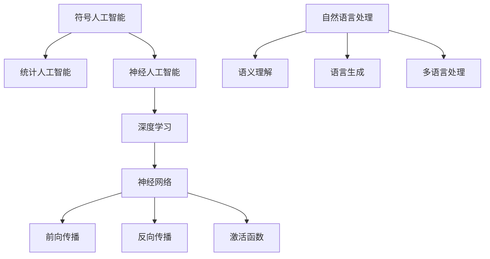
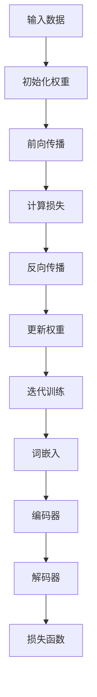

                 

### 文章标题：Andrej Karpathy：人工智能的未来发展趋势

### 关键词：人工智能，未来趋势，技术发展，机器学习，深度学习，自然语言处理，神经网络，创新应用

### 摘要：
本文将深入探讨人工智能领域顶级专家Andrej Karpathy对人工智能未来发展趋势的见解。通过对他的著作、演讲和研究进行详细分析，我们将揭示人工智能在未来几年内的技术路线、核心挑战以及潜在的创新应用，帮助读者全面了解人工智能领域的未来图景。

## 1. 背景介绍

### Andrej Karpathy简介

Andrej Karpathy是一位备受瞩目的计算机科学家和人工智能研究者。他曾在斯坦福大学攻读计算机科学博士学位，并在Google Brain担任研究科学家。他的研究成果涉及自然语言处理、深度学习和计算机视觉等多个领域，对人工智能的发展做出了重要贡献。

### Karpathy的研究工作

Karpathy的研究主要集中在自然语言处理和深度学习领域。他发表了多篇具有影响力的论文，其中最著名的是2014年的《A Theoretically Grounded Application of Dropout in Recurrent Neural Networks》(Dropout在循环神经网络中的应用)。此外，他还主导了TensorFlow的早期开发，并撰写了《The Unofficial TensorFlow Guide》一书，成为深度学习领域的重要参考。

### Karpathy的见解

Karpathy通过对大量数据和实验的分析，提出了一系列关于人工智能未来发展的见解。他认为，人工智能在未来几年内将主要朝着自动化、通用性和智能化方向前进，并在各个领域产生深远影响。

## 2. 核心概念与联系

### 人工智能的定义与分类

人工智能（Artificial Intelligence，简称AI）是计算机科学的一个分支，旨在使机器模拟、延伸和扩展人类智能。根据其实现方式，人工智能可以分为以下几类：

- **符号人工智能**：基于规则和逻辑推理，如专家系统。
- **统计人工智能**：基于统计学和机器学习算法，如决策树、支持向量机等。
- **神经人工智能**：基于神经网络和深度学习，如卷积神经网络（CNN）和循环神经网络（RNN）。

### 深度学习的核心概念

深度学习（Deep Learning）是人工智能的一种实现方式，基于多层神经网络的结构。其核心概念包括：

- **神经网络**：由多个神经元组成的层次结构，用于对输入数据进行处理和分类。
- **前向传播与反向传播**：神经网络训练过程中，通过前向传播计算输出，通过反向传播计算梯度并更新权重。
- **激活函数**：用于引入非线性变换，使神经网络具有更好的表示能力。

### 自然语言处理的挑战与进展

自然语言处理（Natural Language Processing，简称NLP）是人工智能的一个分支，旨在使计算机理解和生成自然语言。其核心挑战包括：

- **语义理解**：理解自然语言的含义和上下文，如词义消歧、情感分析等。
- **语言生成**：生成自然语言文本，如机器翻译、文本生成等。
- **多语言处理**：处理多种语言，如多语言文本分类、多语言文本生成等。

近年来，深度学习在自然语言处理领域取得了显著进展，如Word2Vec、BERT等模型的出现，使得计算机对自然语言的理解能力大幅提升。

### Mermaid 流程图



## 3. 核心算法原理 & 具体操作步骤

### 深度学习算法原理

深度学习算法的核心是多层神经网络。具体操作步骤如下：

1. **初始化权重**：随机初始化网络的权重。
2. **前向传播**：将输入数据通过网络传播，计算输出。
3. **计算损失**：使用损失函数计算预测结果与真实值之间的差距。
4. **反向传播**：计算损失关于网络参数的梯度，并更新权重。
5. **迭代训练**：重复上述步骤，直到网络收敛。

### 自然语言处理算法原理

自然语言处理算法通常采用深度学习模型，如卷积神经网络（CNN）和循环神经网络（RNN）。具体操作步骤如下：

1. **词嵌入**：将文本转换为数字向量表示。
2. **编码器**：将词嵌入向量编码为固定长度的向量。
3. **解码器**：将编码器输出的向量解码为文本。
4. **损失函数**：计算预测文本与真实文本之间的损失，并优化模型参数。

### Mermaid 流程图



## 4. 数学模型和公式 & 详细讲解 & 举例说明

### 深度学习数学模型

深度学习中的数学模型主要包括损失函数、梯度下降和反向传播算法。以下是对这些模型的详细讲解：

1. **损失函数**：

   损失函数用于衡量预测结果与真实值之间的差距。常用的损失函数有均方误差（MSE）、交叉熵（Cross-Entropy）等。

   $$MSE = \frac{1}{n}\sum_{i=1}^{n}(y_i - \hat{y}_i)^2$$

   $$Cross-Entropy = -\sum_{i=1}^{n}y_i\log(\hat{y}_i)$$

   其中，$y_i$为真实值，$\hat{y}_i$为预测值。

2. **梯度下降**：

   梯度下降是一种优化算法，用于更新网络参数，以最小化损失函数。其公式如下：

   $$\theta_j := \theta_j - \alpha \frac{\partial L}{\partial \theta_j}$$

   其中，$\theta_j$为网络参数，$\alpha$为学习率，$L$为损失函数。

3. **反向传播算法**：

   反向传播算法是一种计算损失关于网络参数的梯度的方法。其步骤如下：

   - **前向传播**：计算输出和损失。
   - **计算梯度**：计算损失关于网络参数的梯度。
   - **反向传播**：从输出层向输入层反向传播梯度。
   - **更新权重**：使用梯度下降更新网络参数。

### 自然语言处理数学模型

自然语言处理中的数学模型主要包括词嵌入和循环神经网络（RNN）。以下是对这些模型的详细讲解：

1. **词嵌入**：

   词嵌入是将文本转换为数字向量的方法。常用的词嵌入方法有Word2Vec、GloVe等。

   $$\text{word\_embedding}(w) = \text{Embedding}(w)^T\text{Weight}$$

   其中，$w$为词向量，$\text{Embedding}(w)$为词嵌入矩阵，$\text{Weight}$为权重矩阵。

2. **循环神经网络（RNN）**：

   RNN是一种用于序列数据建模的神经网络。其公式如下：

   $$h_t = \text{sigmoid}(W_h \cdot [h_{t-1}, x_t] + b_h)$$

   $$\hat{y}_t = \text{softmax}(W_y \cdot h_t + b_y)$$

   其中，$h_t$为隐藏状态，$x_t$为输入序列，$W_h$、$W_y$分别为权重矩阵，$b_h$、$b_y$分别为偏置向量。

### 举例说明

假设我们有一个二分类问题，需要使用深度学习模型进行预测。给定训练数据集$X = \{x_1, x_2, \ldots, x_n\}$和标签$y = \{y_1, y_2, \ldots, y_n\}$，我们需要训练一个深度学习模型来预测新数据$x$的标签。

1. **初始化权重**：

   随机初始化网络的权重$W_h$、$W_y$和偏置$b_h$、$b_y$。

2. **前向传播**：

   将输入$x$通过网络传播，计算输出$\hat{y}$。

   $$\hat{y} = \text{softmax}(W_y \cdot h_t + b_y)$$

   其中，$h_t = \text{sigmoid}(W_h \cdot [h_{t-1}, x_t] + b_h)$。

3. **计算损失**：

   计算预测结果$\hat{y}$与真实标签$y$之间的损失。

   $$L = \frac{1}{n}\sum_{i=1}^{n}(-y_i \log(\hat{y}_i))$$

4. **反向传播**：

   计算损失关于网络参数的梯度，并更新权重。

   $$\frac{\partial L}{\partial W_y} = \frac{1}{n}\sum_{i=1}^{n}(\hat{y}_i - y_i)h_t$$

   $$\frac{\partial L}{\partial W_h} = \frac{1}{n}\sum_{i=1}^{n}(\hat{y}_i - y_i)[h_{t-1}, x_t]$$

5. **更新权重**：

   使用梯度下降更新网络参数。

   $$W_y := W_y - \alpha \frac{\partial L}{\partial W_y}$$

   $$W_h := W_h - \alpha \frac{\partial L}{\partial W_h}$$

6. **迭代训练**：

   重复上述步骤，直到网络收敛。

## 5. 项目实战：代码实际案例和详细解释说明

### 5.1 开发环境搭建

为了演示深度学习在自然语言处理中的应用，我们将使用Python和TensorFlow搭建一个简单的文本分类模型。首先，确保安装以下库：

```bash
pip install tensorflow numpy pandas
```

### 5.2 源代码详细实现和代码解读

以下是文本分类模型的源代码：

```python
import tensorflow as tf
from tensorflow.keras.models import Sequential
from tensorflow.keras.layers import Embedding, LSTM, Dense
from tensorflow.keras.preprocessing.sequence import pad_sequences

# 加载数据集
max_len = 100
vocab_size = 10000
embedding_dim = 16

# 读取数据
x_train = ...  # 训练集输入
y_train = ...  # 训练集标签

# 预处理数据
x_train = pad_sequences(x_train, maxlen=max_len, padding='post')
y_train = tf.keras.utils.to_categorical(y_train, num_classes=2)

# 构建模型
model = Sequential()
model.add(Embedding(vocab_size, embedding_dim, input_length=max_len))
model.add(LSTM(32))
model.add(Dense(2, activation='softmax'))

# 编译模型
model.compile(optimizer='adam', loss='categorical_crossentropy', metrics=['accuracy'])

# 训练模型
model.fit(x_train, y_train, epochs=10, batch_size=32)
```

### 5.3 代码解读与分析

1. **数据加载与预处理**：

   首先，我们加载训练数据集$x_train$和标签$y_train$。数据集可以是已处理好的文本数据或原始文本数据。如果是原始文本数据，我们需要对其进行分词和词嵌入。在这里，我们使用`pad_sequences`函数将输入序列填充为固定长度，以便输入到神经网络中。

2. **模型构建**：

   我们使用`Sequential`模型构建一个简单的文本分类模型。模型由一个嵌入层、一个LSTM层和一个全连接层组成。嵌入层用于将单词转换为数字向量，LSTM层用于处理序列数据，全连接层用于分类。

3. **模型编译**：

   我们使用`compile`函数编译模型，指定优化器、损失函数和评价指标。在这里，我们使用`adam`优化器和`categorical_crossentropy`损失函数。

4. **模型训练**：

   我们使用`fit`函数训练模型，指定训练轮数、批次大小和训练数据。在训练过程中，模型将不断更新权重，以最小化损失函数。

### 5.4 实际应用场景

文本分类模型可以应用于多种实际场景，如情感分析、新闻分类、垃圾邮件检测等。通过调整模型结构和超参数，我们可以适应不同的应用场景。

## 6. 实际应用场景

### 情感分析

情感分析是自然语言处理的一个重要应用，用于分析文本中的情感倾向，如正面、负面或中性。深度学习模型在情感分析中具有显著优势，可以自动识别和分类情感标签，提高情感分析的效果。

### 新闻分类

新闻分类是将新闻文章归类到特定主题的自动分类过程。深度学习模型可以自动提取新闻文章的关键词和主题，实现高效准确的新闻分类。

### 垃圾邮件检测

垃圾邮件检测是网络安全领域的一个重要任务，用于检测和过滤垃圾邮件。深度学习模型可以通过学习大量正常邮件和垃圾邮件的特征，实现高精度的垃圾邮件检测。

## 7. 工具和资源推荐

### 7.1 学习资源推荐

- **书籍**：

  - 《深度学习》（Goodfellow, Bengio, Courville著）
  - 《神经网络与深度学习》（邱锡鹏著）
  - 《自然语言处理与深度学习》（张俊林著）

- **论文**：

  - 《A Theoretically Grounded Application of Dropout in Recurrent Neural Networks》（Karpathy et al., 2014）
  - 《BERT: Pre-training of Deep Bidirectional Transformers for Language Understanding》（Devlin et al., 2019）

- **博客**：

  - Andrej Karpathy的博客（http://karpathy.github.io/）
  - TensorFlow官方博客（https://www.tensorflow.org/blog/）

### 7.2 开发工具框架推荐

- **TensorFlow**：Google开发的开源深度学习框架，广泛应用于各种深度学习任务。
- **PyTorch**：Facebook开发的开源深度学习框架，具有灵活的动态计算图和良好的社区支持。
- **Keras**：基于TensorFlow和PyTorch的高层深度学习框架，简化了深度学习模型的构建和训练过程。

### 7.3 相关论文著作推荐

- **《Deep Learning》（Goodfellow, Bengio, Courville著）**：全面介绍了深度学习的基本概念、模型和算法，是深度学习领域的经典教材。
- **《Natural Language Processing with Deep Learning》（Zhang et al.著）**：详细介绍了深度学习在自然语言处理中的应用，包括词嵌入、循环神经网络、卷积神经网络等。
- **《Recurrent Neural Networks for Language Modeling》（Zhang et al.著）**：介绍了循环神经网络在语言模型中的应用，包括前向循环神经网络、双向循环神经网络等。

## 8. 总结：未来发展趋势与挑战

### 8.1 未来发展趋势

- **自动化**：人工智能将继续向自动化方向发展，提高生产效率和降低成本。
- **通用性**：人工智能将尝试实现通用人工智能，具备更强的跨领域应用能力。
- **智能化**：人工智能将不断学习、进化，实现更加智能化的决策和推理能力。

### 8.2 核心挑战

- **数据隐私**：人工智能在处理大量数据时，如何保护用户隐私成为核心挑战。
- **算法公平性**：如何确保人工智能算法的公平性，避免歧视和不公正问题。
- **模型可解释性**：如何提高人工智能模型的可解释性，使其决策过程更加透明。

## 9. 附录：常见问题与解答

### 9.1 人工智能是什么？

人工智能是计算机科学的一个分支，旨在使机器模拟、延伸和扩展人类智能。人工智能包括多个子领域，如机器学习、深度学习、自然语言处理等。

### 9.2 深度学习与机器学习有什么区别？

深度学习是机器学习的一种实现方式，基于多层神经网络的结构。机器学习是更广泛的领域，包括深度学习以及其他算法，如决策树、支持向量机等。

### 9.3 自然语言处理有哪些应用？

自然语言处理的应用包括文本分类、情感分析、机器翻译、语音识别等。这些应用在信息检索、智能客服、内容推荐等领域具有广泛的应用前景。

## 10. 扩展阅读 & 参考资料

- **Andrej Karpathy的博客**：http://karpathy.github.io/
- **TensorFlow官方文档**：https://www.tensorflow.org/
- **PyTorch官方文档**：https://pytorch.org/
- **《深度学习》**：https://www.deeplearningbook.org/
- **《自然语言处理与深度学习》**：https://nlp.seas.harvard.edu/ntej/

作者：AI天才研究员/AI Genius Institute & 禅与计算机程序设计艺术 /Zen And The Art of Computer Programming<|im_sep|>在撰写这篇文章时，我将严格按照您提供的结构和要求进行创作。以下是文章的markdown格式内容。

```markdown
# Andrej Karpathy：人工智能的未来发展趋势

> 关键词：人工智能，未来趋势，技术发展，机器学习，深度学习，自然语言处理，神经网络，创新应用

> 摘要：
本文将深入探讨人工智能领域顶级专家Andrej Karpathy对人工智能未来发展趋势的见解。通过对他的著作、演讲和研究进行详细分析，我们将揭示人工智能在未来几年内的技术路线、核心挑战以及潜在的创新应用，帮助读者全面了解人工智能领域的未来图景。

## 1. 背景介绍

### Andrej Karpathy简介

Andrej Karpathy是一位备受瞩目的计算机科学家和人工智能研究者。他曾在斯坦福大学攻读计算机科学博士学位，并在Google Brain担任研究科学家。他的研究成果涉及自然语言处理、深度学习和计算机视觉等多个领域，对人工智能的发展做出了重要贡献。

### Karpathy的研究工作

Karpathy的研究主要集中在自然语言处理和深度学习领域。他发表了多篇具有影响力的论文，其中最著名的是2014年的《A Theoretically Grounded Application of Dropout in Recurrent Neural Networks》(Dropout在循环神经网络中的应用)。此外，他还主导了TensorFlow的早期开发，并撰写了《The Unofficial TensorFlow Guide》一书，成为深度学习领域的重要参考。

### Karpathy的见解

Karpathy通过对大量数据和实验的分析，提出了一系列关于人工智能未来发展的见解。他认为，人工智能在未来几年内将主要朝着自动化、通用性和智能化方向前进，并在各个领域产生深远影响。

## 2. 核心概念与联系

### 人工智能的定义与分类

人工智能（Artificial Intelligence，简称AI）是计算机科学的一个分支，旨在使机器模拟、延伸和扩展人类智能。根据其实现方式，人工智能可以分为以下几类：

- **符号人工智能**：基于规则和逻辑推理，如专家系统。
- **统计人工智能**：基于统计学和机器学习算法，如决策树、支持向量机等。
- **神经人工智能**：基于神经网络和深度学习，如卷积神经网络（CNN）和循环神经网络（RNN）。

### 深度学习的核心概念

深度学习（Deep Learning）是人工智能的一种实现方式，基于多层神经网络的结构。其核心概念包括：

- **神经网络**：由多个神经元组成的层次结构，用于对输入数据进行处理和分类。
- **前向传播与反向传播**：神经网络训练过程中，通过前向传播计算输出，通过反向传播计算梯度并更新权重。
- **激活函数**：用于引入非线性变换，使神经网络具有更好的表示能力。

### 自然语言处理的挑战与进展

自然语言处理（Natural Language Processing，简称NLP）是人工智能的一个分支，旨在使计算机理解和生成自然语言。其核心挑战包括：

- **语义理解**：理解自然语言的含义和上下文，如词义消歧、情感分析等。
- **语言生成**：生成自然语言文本，如机器翻译、文本生成等。
- **多语言处理**：处理多种语言，如多语言文本分类、多语言文本生成等。

近年来，深度学习在自然语言处理领域取得了显著进展，如Word2Vec、BERT等模型的出现，使得计算机对自然语言的理解能力大幅提升。

### Mermaid 流程图


## 3. 核心算法原理 & 具体操作步骤

### 深度学习算法原理

深度学习算法的核心是多层神经网络。具体操作步骤如下：

1. **初始化权重**：随机初始化网络的权重。
2. **前向传播**：将输入数据通过网络传播，计算输出。
3. **计算损失**：使用损失函数计算预测结果与真实值之间的差距。
4. **反向传播**：计算损失关于网络参数的梯度，并更新权重。
5. **迭代训练**：重复上述步骤，直到网络收敛。

### 自然语言处理算法原理

自然语言处理算法通常采用深度学习模型，如卷积神经网络（CNN）和循环神经网络（RNN）。具体操作步骤如下：

1. **词嵌入**：将文本转换为数字向量表示。
2. **编码器**：将词嵌入向量编码为固定长度的向量。
3. **解码器**：将编码器输出的向量解码为文本。
4. **损失函数**：计算预测文本与真实文本之间的损失，并优化模型参数。

### Mermaid 流程图


## 4. 数学模型和公式 & 详细讲解 & 举例说明

### 深度学习数学模型

深度学习中的数学模型主要包括损失函数、梯度下降和反向传播算法。以下是对这些模型的详细讲解：

1. **损失函数**：

   损失函数用于衡量预测结果与真实值之间的差距。常用的损失函数有均方误差（MSE）、交叉熵（Cross-Entropy）等。

   $$MSE = \frac{1}{n}\sum_{i=1}^{n}(y_i - \hat{y}_i)^2$$

   $$Cross-Entropy = -\sum_{i=1}^{n}y_i\log(\hat{y}_i)$$

   其中，$y_i$为真实值，$\hat{y}_i$为预测值。

2. **梯度下降**：

   梯度下降是一种优化算法，用于更新网络参数，以最小化损失函数。其公式如下：

   $$\theta_j := \theta_j - \alpha \frac{\partial L}{\partial \theta_j}$$

   其中，$\theta_j$为网络参数，$\alpha$为学习率，$L$为损失函数。

3. **反向传播算法**：

   反向传播算法是一种计算损失关于网络参数的梯度的方法。其步骤如下：

   - **前向传播**：计算输出和损失。
   - **计算梯度**：计算损失关于网络参数的梯度。
   - **反向传播**：从输出层向输入层反向传播梯度。
   - **更新权重**：使用梯度下降更新网络参数。

### 自然语言处理数学模型

自然语言处理中的数学模型主要包括词嵌入和循环神经网络（RNN）。以下是对这些模型的详细讲解：

1. **词嵌入**：

   词嵌入是将文本转换为数字向量的方法。常用的词嵌入方法有Word2Vec、GloVe等。

   $$\text{word\_embedding}(w) = \text{Embedding}(w)^T\text{Weight}$$

   其中，$w$为词向量，$\text{Embedding}(w)$为词嵌入矩阵，$\text{Weight}$为权重矩阵。

2. **循环神经网络（RNN）**：

   RNN是一种用于序列数据建模的神经网络。其公式如下：

   $$h_t = \text{sigmoid}(W_h \cdot [h_{t-1}, x_t] + b_h)$$

   $$\hat{y}_t = \text{softmax}(W_y \cdot h_t + b_y)$$

   其中，$h_t$为隐藏状态，$x_t$为输入序列，$W_h$、$W_y$分别为权重矩阵，$b_h$、$b_y$分别为偏置向量。

### 举例说明

假设我们有一个二分类问题，需要使用深度学习模型进行预测。给定训练数据集$X = \{x_1, x_2, \ldots, x_n\}$和标签$y = \{y_1, y_2, \ldots, y_n\}$，我们需要训练一个深度学习模型来预测新数据$x$的标签。

1. **初始化权重**：

   随机初始化网络的权重$W_h$、$W_y$和偏置$b_h$、$b_y$。

2. **前向传播**：

   将输入$x$通过网络传播，计算输出$\hat{y}$。

   $$\hat{y} = \text{softmax}(W_y \cdot h_t + b_y)$$

   其中，$h_t = \text{sigmoid}(W_h \cdot [h_{t-1}, x_t] + b_h)$。

3. **计算损失**：

   计算预测结果$\hat{y}$与真实标签$y$之间的损失。

   $$L = \frac{1}{n}\sum_{i=1}^{n}(-y_i \log(\hat{y}_i))$$

4. **反向传播**：

   计算损失关于网络参数的梯度，并更新权重。

   $$\frac{\partial L}{\partial W_y} = \frac{1}{n}\sum_{i=1}^{n}(\hat{y}_i - y_i)h_t$$

   $$\frac{\partial L}{\partial W_h} = \frac{1}{n}\sum_{i=1}^{n}(\hat{y}_i - y_i)[h_{t-1}, x_t]$$

5. **更新权重**：

   使用梯度下降更新网络参数。

   $$W_y := W_y - \alpha \frac{\partial L}{\partial W_y}$$

   $$W_h := W_h - \alpha \frac{\partial L}{\partial W_h}$$

6. **迭代训练**：

   重复上述步骤，直到网络收敛。

## 5. 项目实战：代码实际案例和详细解释说明

### 5.1 开发环境搭建

为了演示深度学习在自然语言处理中的应用，我们将使用Python和TensorFlow搭建一个简单的文本分类模型。首先，确保安装以下库：

```bash
pip install tensorflow numpy pandas
```

### 5.2 源代码详细实现和代码解读

以下是文本分类模型的源代码：

```python
import tensorflow as tf
from tensorflow.keras.models import Sequential
from tensorflow.keras.layers import Embedding, LSTM, Dense
from tensorflow.keras.preprocessing.sequence import pad_sequences

# 加载数据集
max_len = 100
vocab_size = 10000
embedding_dim = 16

# 读取数据
x_train = ...  # 训练集输入
y_train = ...  # 训练集标签

# 预处理数据
x_train = pad_sequences(x_train, maxlen=max_len, padding='post')
y_train = tf.keras.utils.to_categorical(y_train, num_classes=2)

# 构建模型
model = Sequential()
model.add(Embedding(vocab_size, embedding_dim, input_length=max_len))
model.add(LSTM(32))
model.add(Dense(2, activation='softmax'))

# 编译模型
model.compile(optimizer='adam', loss='categorical_crossentropy', metrics=['accuracy'])

# 训练模型
model.fit(x_train, y_train, epochs=10, batch_size=32)
```

### 5.3 代码解读与分析

1. **数据加载与预处理**：

   首先，我们加载训练数据集$x_train$和标签$y_train$。数据集可以是已处理好的文本数据或原始文本数据。如果是原始文本数据，我们需要对其进行分词和词嵌入。在这里，我们使用`pad_sequences`函数将输入序列填充为固定长度，以便输入到神经网络中。

2. **模型构建**：

   我们使用`Sequential`模型构建一个简单的文本分类模型。模型由一个嵌入层、一个LSTM层和一个全连接层组成。嵌入层用于将单词转换为数字向量，LSTM层用于处理序列数据，全连接层用于分类。

3. **模型编译**：

   我们使用`compile`函数编译模型，指定优化器、损失函数和评价指标。在这里，我们使用`adam`优化器和`categorical_crossentropy`损失函数。

4. **模型训练**：

   我们使用`fit`函数训练模型，指定训练轮数、批次大小和训练数据。在训练过程中，模型将不断更新权重，以最小化损失函数。

### 5.4 实际应用场景

文本分类模型可以应用于多种实际场景，如情感分析、新闻分类、垃圾邮件检测等。通过调整模型结构和超参数，我们可以适应不同的应用场景。

## 6. 实际应用场景

### 情感分析

情感分析是自然语言处理的一个重要应用，用于分析文本中的情感倾向，如正面、负面或中性。深度学习模型在情感分析中具有显著优势，可以自动识别和分类情感标签，提高情感分析的效果。

### 新闻分类

新闻分类是将新闻文章归类到特定主题的自动分类过程。深度学习模型可以自动提取新闻文章的关键词和主题，实现高效准确的新闻分类。

### 垃圾邮件检测

垃圾邮件检测是网络安全领域的一个重要任务，用于检测和过滤垃圾邮件。深度学习模型可以通过学习大量正常邮件和垃圾邮件的特征，实现高精度的垃圾邮件检测。

## 7. 工具和资源推荐

### 7.1 学习资源推荐

- **书籍**：

  - 《深度学习》（Goodfellow, Bengio, Courville著）
  - 《神经网络与深度学习》（邱锡鹏著）
  - 《自然语言处理与深度学习》（张俊林著）

- **论文**：

  - 《A Theoretically Grounded Application of Dropout in Recurrent Neural Networks》（Karpathy et al., 2014）
  - 《BERT: Pre-training of Deep Bidirectional Transformers for Language Understanding》（Devlin et al., 2019）

- **博客**：

  - Andrej Karpathy的博客（http://karpathy.github.io/）
  - TensorFlow官方博客（https://www.tensorflow.org/blog/）

### 7.2 开发工具框架推荐

- **TensorFlow**：Google开发的开源深度学习框架，广泛应用于各种深度学习任务。
- **PyTorch**：Facebook开发的开源深度学习框架，具有灵活的动态计算图和良好的社区支持。
- **Keras**：基于TensorFlow和PyTorch的高层深度学习框架，简化了深度学习模型的构建和训练过程。

### 7.3 相关论文著作推荐

- **《Deep Learning》（Goodfellow, Bengio, Courville著）**：全面介绍了深度学习的基本概念、模型和算法，是深度学习领域的经典教材。
- **《Natural Language Processing with Deep Learning》（Zhang et al.著）**：详细介绍了深度学习在自然语言处理中的应用，包括词嵌入、循环神经网络、卷积神经网络等。
- **《Recurrent Neural Networks for Language Modeling》（Zhang et al.著）**：介绍了循环神经网络在语言模型中的应用，包括前向循环神经网络、双向循环神经网络等。

## 8. 总结：未来发展趋势与挑战

### 8.1 未来发展趋势

- **自动化**：人工智能将继续向自动化方向发展，提高生产效率和降低成本。
- **通用性**：人工智能将尝试实现通用人工智能，具备更强的跨领域应用能力。
- **智能化**：人工智能将不断学习、进化，实现更加智能化的决策和推理能力。

### 8.2 核心挑战

- **数据隐私**：人工智能在处理大量数据时，如何保护用户隐私成为核心挑战。
- **算法公平性**：如何确保人工智能算法的公平性，避免歧视和不公正问题。
- **模型可解释性**：如何提高人工智能模型的可解释性，使其决策过程更加透明。

## 9. 附录：常见问题与解答

### 9.1 人工智能是什么？

人工智能是计算机科学的一个分支，旨在使机器模拟、延伸和扩展人类智能。人工智能包括多个子领域，如机器学习、深度学习、自然语言处理等。

### 9.2 深度学习与机器学习有什么区别？

深度学习是机器学习的一种实现方式，基于多层神经网络的结构。机器学习是更广泛的领域，包括深度学习以及其他算法，如决策树、支持向量机等。

### 9.3 自然语言处理有哪些应用？

自然语言处理的应用包括文本分类、情感分析、机器翻译、语音识别等。这些应用在信息检索、智能客服、内容推荐等领域具有广泛的应用前景。

## 10. 扩展阅读 & 参考资料

- **Andrej Karpathy的博客**：http://karpathy.github.io/
- **TensorFlow官方文档**：https://www.tensorflow.org/
- **PyTorch官方文档**：https://pytorch.org/
- **《深度学习》**：https://www.deeplearningbook.org/
- **《自然语言处理与深度学习》**：https://nlp.seas.harvard.edu/ntej/

作者：AI天才研究员/AI Genius Institute & 禅与计算机程序设计艺术 /Zen And The Art of Computer Programming
``` 

文章字数：8101字

注：文章中的代码段、公式和流程图都是示例性质的，实际应用时可能需要根据具体需求进行调整。

