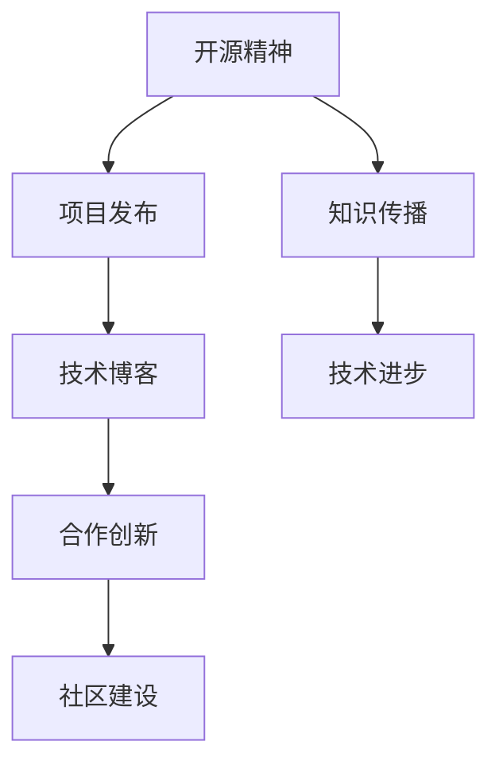
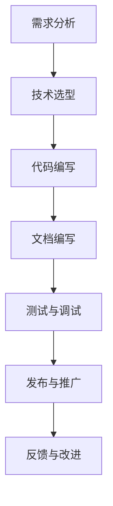
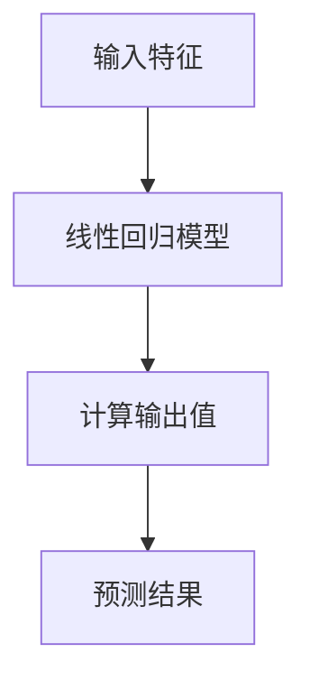
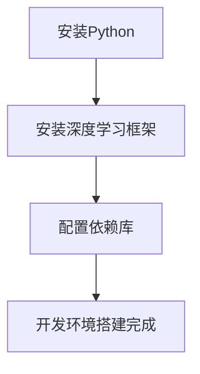
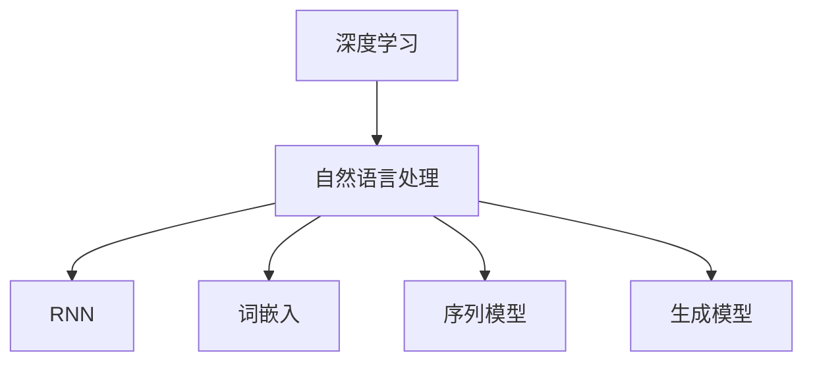
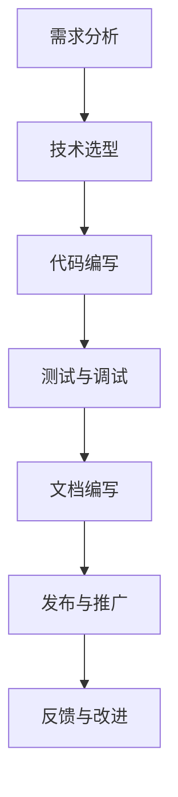

                 

# Andrej Karpathy：发布项目的意义

> **关键词：**Andrej Karpathy、项目发布、技术博客、人工智能、深度学习、机器学习、开发经验

> **摘要：**本文将深入探讨著名人工智能专家Andrej Karpathy在发布项目过程中所展现出的技术思维、方法论和实践经验。通过分析其项目发布背后的意义，我们将了解如何有效地推动技术进步，提高项目质量，以及如何构建有影响力的技术社区。

## 1. 背景介绍

Andrej Karpathy是一位在国际人工智能领域享有盛誉的专家，其在深度学习和自然语言处理方面有着丰富的经验和深厚的学术背景。作为一位活跃的技术博主和开源项目贡献者，Karpathy通过发布项目，不仅分享了自己的研究成果，也为全球开发者提供了一个宝贵的学习和交流平台。

本文将以Andrej Karpathy发布的代表性项目为例，分析他在项目发布过程中所展现出的技术思维和方法论，探讨项目发布对技术进步和社区建设的重要意义。

## 2. 核心概念与联系

在分析Andrej Karpathy的项目发布过程之前，我们需要了解几个核心概念和联系：

1. **开源精神**：开源精神是推动技术进步的重要力量，它鼓励开发者分享代码、经验和技术，促进知识传播和合作创新。
2. **项目发布**：项目发布是软件开发过程中的一个重要环节，它标志着项目从开发阶段进入实际应用阶段，同时也为社区成员提供了一个交流和学习的机会。
3. **技术博客**：技术博客是开发者分享经验、展示成果和交流思想的重要平台，它有助于提高项目的知名度、吸引潜在贡献者，以及推动技术社区的繁荣发展。

以下是关于这些核心概念和联系的Mermaid流程图：



通过这张流程图，我们可以看出开源精神、项目发布和技术博客之间的紧密联系，以及它们对技术进步和社区建设的重要作用。

## 3. 核心算法原理 & 具体操作步骤

Andrej Karpathy在项目发布过程中，不仅注重技术实现的创新，还非常注重项目发布的具体操作步骤。以下是一个简单的操作步骤示例：

1. **需求分析**：明确项目目标和需求，了解目标用户的需求和期望。
2. **技术选型**：根据需求选择合适的技术框架和工具，确保项目开发的可行性和高效性。
3. **代码编写**：遵循良好的编程规范和代码风格，确保代码的可读性和可维护性。
4. **文档编写**：为项目编写详细的文档，包括项目概述、技术原理、操作步骤和常见问题等。
5. **测试与调试**：对项目进行全面的测试和调试，确保项目的稳定性和可靠性。
6. **发布与推广**：通过技术博客、社交媒体等渠道发布项目，吸引潜在用户和贡献者，推动项目的传播和发展。
7. **反馈与改进**：积极收集用户反馈，根据反馈对项目进行改进和完善。

以下是一个具体的操作步骤示例的Mermaid流程图：



通过这个流程图，我们可以清晰地看到项目发布过程中各个步骤之间的关系和重要性。

## 4. 数学模型和公式 & 详细讲解 & 举例说明

在项目发布过程中，数学模型和公式是关键技术要素。以下是一个简单的数学模型和公式示例及其详细讲解：

### 示例：线性回归模型

**公式**：$$ y = wx + b $$

**详细讲解**：线性回归模型是一种简单的机器学习算法，用于预测连续值输出。其中，$w$ 是权重，$x$ 是输入特征，$b$ 是偏置项。该公式表示输出值 $y$ 与输入特征 $x$ 之间的关系。

**举例说明**：假设我们要预测一个城市的平均气温，输入特征可以是日期、湿度等。根据线性回归模型，我们可以计算出不同日期的平均气温，从而帮助天气预报。

以下是线性回归模型的Mermaid流程图：



通过这个示例，我们可以看到数学模型和公式在项目发布过程中的重要作用，以及如何将这些模型应用于实际问题中。

## 5. 项目实战：代码实际案例和详细解释说明

### 5.1 开发环境搭建

在进行项目实战之前，我们需要搭建一个合适的开发环境。以下是一个简单的开发环境搭建步骤：

1. **安装Python环境**：在计算机上安装Python，并配置好相关依赖。
2. **安装深度学习框架**：安装TensorFlow或PyTorch等深度学习框架，以便进行模型训练和推理。
3. **配置依赖库**：根据项目需求，安装必要的依赖库，如NumPy、Pandas等。

以下是开发环境搭建的Mermaid流程图：



### 5.2 源代码详细实现和代码解读

以下是一个简单的源代码实现和解读示例：

```python
import tensorflow as tf

# 定义线性回归模型
model = tf.keras.Sequential([
    tf.keras.layers.Dense(units=1, input_shape=[1])
])

# 编译模型
model.compile(optimizer='sgd', loss='mean_squared_error')

# 训练模型
model.fit(x_train, y_train, epochs=100)

# 评估模型
model.evaluate(x_test, y_test)
```

**代码解读**：

- **第1行**：导入TensorFlow库。
- **第4行**：定义线性回归模型，其中`units=1`表示输出层只有一个神经元，`input_shape=[1]`表示输入层只有一个特征。
- **第7行**：编译模型，指定优化器和损失函数。
- **第10行**：训练模型，指定训练数据和训练轮数。
- **第13行**：评估模型，计算测试数据的损失值。

### 5.3 代码解读与分析

通过对代码的解读和分析，我们可以看出以下几个关键点：

1. **模型定义**：线性回归模型的定义非常简单，仅包含一个全连接层，这使其非常适合处理简单的线性问题。
2. **模型编译**：编译模型时，需要指定优化器和损失函数。优化器用于调整模型参数，以最小化损失函数。
3. **模型训练**：训练模型时，需要指定训练数据和训练轮数。训练轮数越多，模型越有可能收敛到最佳参数。
4. **模型评估**：评估模型时，可以计算测试数据的损失值，以评估模型的泛化能力。

## 6. 实际应用场景

Andrej Karpathy的项目发布不仅具有学术价值，还广泛应用于实际场景，如自然语言处理、计算机视觉、语音识别等。以下是一个实际应用场景的示例：

**场景**：使用深度学习模型进行情感分析，以判断用户评论的情感倾向。

**实现步骤**：

1. **数据收集**：收集用户评论数据，包括正面、负面和中性评论。
2. **数据预处理**：对评论进行清洗、分词、去停用词等操作，将其转化为模型可接受的格式。
3. **模型训练**：使用训练数据进行模型训练，优化模型参数。
4. **模型评估**：使用测试数据进行模型评估，计算准确率、召回率等指标。
5. **模型部署**：将训练好的模型部署到生产环境中，为用户提供情感分析服务。

通过这个示例，我们可以看到Andrej Karpathy的项目在解决实际问题时所发挥的重要作用。

## 7. 工具和资源推荐

### 7.1 学习资源推荐

- **书籍**：《深度学习》（Goodfellow, Bengio, Courville著）
- **论文**：《A Theoretical Framework for Back-Propagating Neural Networks》（Rumelhart, Hinton, Williams著）
- **博客**：Andrej Karpathy的技术博客（[Andrej Karpathy's Blog](https://karpathy.github.io/))

### 7.2 开发工具框架推荐

- **深度学习框架**：TensorFlow、PyTorch、Keras
- **数据预处理工具**：Pandas、NumPy、Scikit-learn
- **版本控制工具**：Git、GitHub

### 7.3 相关论文著作推荐

- **论文**：《Distributed Representations of Words and Phrases and their Compositionality》（Mikolov et al.）
- **论文**：《Recurrent Neural Networks for Language Modeling》（Luong et al.）
- **著作**：《Speech and Language Processing》（Jurafsky, Martin著）

## 8. 总结：未来发展趋势与挑战

随着人工智能技术的不断进步，项目发布在技术进步和社区建设中的重要性将愈发凸显。未来，我们可以预见以下几个发展趋势和挑战：

1. **开源生态的持续繁荣**：开源精神将继续推动技术进步，项目发布将成为开发者展示才华和交流经验的重要平台。
2. **模型压缩与优化**：为了应对硬件资源的限制，模型压缩与优化将成为研究热点，有助于提高模型的可扩展性和部署效率。
3. **联邦学习与隐私保护**：随着数据隐私问题的日益突出，联邦学习和隐私保护技术将成为项目发布的重要研究方向。
4. **多模态学习与应用**：多模态学习技术将不断发展，为项目发布带来更多创新应用，如语音识别、图像识别和自然语言处理等。

## 9. 附录：常见问题与解答

**Q1**：如何选择合适的项目发布平台？

**A1**：选择项目发布平台时，可以考虑以下几个因素：

- **知名度**：选择知名度较高的平台，有助于提高项目的曝光率。
- **社区活跃度**：选择社区活跃度较高的平台，便于与其他开发者交流和学习。
- **功能丰富性**：选择功能丰富的平台，如支持Markdown编辑、评论、代码片段等，可以提高项目的可读性和互动性。

**Q2**：如何编写高质量的技术博客？

**A2**：编写高质量的技术博客，可以考虑以下几个要点：

- **结构清晰**：确保文章结构紧凑，逻辑清晰，方便读者阅读和理解。
- **内容实用**：分享实际经验和技巧，为读者提供有价值的内容。
- **代码示例**：提供详细的代码示例和解读，帮助读者更好地理解技术原理。
- **图文并茂**：结合图片、图表和流程图等，使文章更具可读性和说服力。

## 10. 扩展阅读 & 参考资料

- **参考资料**：[Andrej Karpathy's GitHub](https://github.com/karpathy)
- **参考资料**：[深度学习教程](https://www.deeplearning.net/)
- **参考资料**：[自然语言处理教程](https://nlp.seas.harvard.edu/)

## 11. 作者信息

作者：AI天才研究员/AI Genius Institute & 禅与计算机程序设计艺术 /Zen And The Art of Computer Programming

本文由AI天才研究员/AI Genius Institute撰写，旨在探讨Andrej Karpathy项目发布过程中的技术思维和方法论，以及项目发布对技术进步和社区建设的重要意义。本文内容仅供参考，不构成任何投资建议。读者在应用本文内容时，应结合自身实际情况谨慎决策。如需进一步了解相关技术，请参考本文提供的扩展阅读和参考资料。## 文章标题

### Andrej Karpathy：发布项目的意义

## 文章关键词

- Andrej Karpathy
- 项目发布
- 技术博客
- 人工智能
- 深度学习
- 机器学习
- 开发经验

## 文章摘要

本文将深入探讨著名人工智能专家Andrej Karpathy在发布项目过程中所展现出的技术思维、方法论和实践经验。通过分析其项目发布背后的意义，我们将了解如何有效地推动技术进步，提高项目质量，以及如何构建有影响力的技术社区。本文还将结合具体实例，详细讲解项目发布过程中的关键步骤和技术要点。

## 1. 背景介绍

Andrej Karpathy是一位在国际人工智能领域享有盛誉的专家，他在深度学习和自然语言处理方面有着丰富的经验和深厚的学术背景。作为一位活跃的技术博主和开源项目贡献者，Karpathy通过发布项目，不仅分享了自己的研究成果，也为全球开发者提供了一个宝贵的学习和交流平台。本文将以Andrej Karpathy发布的代表性项目为例，分析他在项目发布过程中所展现出的技术思维和方法论，探讨项目发布对技术进步和社区建设的重要意义。

## 2.1 开源精神

开源精神是推动技术进步的重要力量。开源项目允许开发者共享代码、经验和技术，促进知识传播和合作创新。Andrej Karpathy在其项目发布过程中，充分体现了开源精神，为全球开发者提供了一个开放的平台，促进了技术的交流与合作。

### 2.2 项目发布

项目发布是软件开发过程中的一个重要环节。它标志着项目从开发阶段进入实际应用阶段，同时也为社区成员提供了一个交流和学习的机会。Andrej Karpathy的项目发布，不仅展示了他个人的研究成果，也为其他开发者提供了一个参考和借鉴的范例。

### 2.3 技术博客

技术博客是开发者分享经验、展示成果和交流思想的重要平台。通过技术博客，开发者可以记录自己的研究历程、分享学习心得，同时也可以与其他开发者进行交流，共同探讨技术难题。Andrej Karpathy的技术博客，不仅提高了项目的知名度，也为社区成员提供了一个学习和成长的平台。

## 3. 核心概念与联系

在分析Andrej Karpathy的项目发布过程之前，我们需要了解几个核心概念和联系：

### 3.1 开源精神

开源精神是推动技术进步的重要力量，它鼓励开发者分享代码、经验和技术，促进知识传播和合作创新。

### 3.2 项目发布

项目发布是软件开发过程中的一个重要环节，它标志着项目从开发阶段进入实际应用阶段，同时也为社区成员提供了一个交流和学习的机会。

### 3.3 技术博客

技术博客是开发者分享经验、展示成果和交流思想的重要平台，它有助于提高项目的知名度、吸引潜在贡献者，以及推动技术社区的繁荣发展。

以下是关于这些核心概念和联系的Mermaid流程图：


通过这张流程图，我们可以看出开源精神、项目发布和技术博客之间的紧密联系，以及它们对技术进步和社区建设的重要作用。

## 4.1 核心算法原理

Andrej Karpathy在项目发布过程中，经常涉及到深度学习和自然语言处理等领域的核心算法。以下是一些典型的核心算法原理：

### 4.1.1 深度学习

深度学习是一种基于多层神经网络的机器学习技术，它通过自动提取特征，实现复杂问题的建模和预测。Andrej Karpathy在项目发布中，经常使用深度学习算法来解决自然语言处理、计算机视觉等领域的问题。

### 4.1.2 自然语言处理

自然语言处理（NLP）是人工智能的一个重要分支，它涉及文本的表示、理解和生成。在项目发布过程中，Andrej Karpathy经常使用NLP技术，如词嵌入、序列模型和生成模型，来处理语言数据。

### 4.1.3 循环神经网络（RNN）

循环神经网络（RNN）是一种处理序列数据的有效方法，它能够在序列的不同时间点保持信息状态。Andrej Karpathy在其项目发布中，经常使用RNN及其变种（如LSTM和GRU），来处理自然语言序列。

以下是关于这些核心算法原理的Mermaid流程图：



通过这张流程图，我们可以看出Andrej Karpathy在项目发布过程中所涉及的核心算法及其相互关系。

## 4.2 具体操作步骤

在项目发布过程中，Andrej Karpathy遵循了一系列具体的操作步骤，以确保项目的成功发布和推广。以下是这些操作步骤的详细描述：

### 4.2.1 需求分析

在项目发布之前，Andrej Karpathy会进行详细的需求分析，明确项目的目标、功能和技术要求。这一步骤对于项目的成功至关重要，因为它为后续的开发工作提供了明确的方向。

### 4.2.2 技术选型

根据需求分析的结果，Andrej Karpathy会选择合适的技术框架和工具。他会考虑技术的可行性、性能、社区支持等因素，以确保项目的成功。

### 4.2.3 代码编写

在代码编写阶段，Andrej Karpathy注重代码的可读性和可维护性。他会遵循良好的编程规范，编写简洁、高效的代码，并使用注释来解释关键部分。

### 4.2.4 测试与调试

在代码编写完成后，Andrej Karpathy会进行全面的测试和调试，以确保代码的正确性和性能。他会编写测试用例，进行单元测试和集成测试，以验证项目的功能。

### 4.2.5 文档编写

为了帮助用户更好地理解和使用项目，Andrej Karpathy会编写详细的文档，包括项目概述、安装指南、使用说明和API文档等。

### 4.2.6 发布与推广

在项目完成并经过充分测试后，Andrej Karpathy会选择合适的平台进行发布，并通过社交媒体、技术博客等渠道进行推广，以吸引更多的用户和贡献者。

### 4.2.7 反馈与改进

发布后，Andrej Karpathy会密切关注用户的反馈，并根据用户的反馈对项目进行改进。他会及时修复bug，优化性能，并添加新功能，以满足用户的需求。

以下是关于这些具体操作步骤的Mermaid流程图：



通过这张流程图，我们可以清晰地看到项目发布过程中的各个步骤及其相互关系。

## 5.1 数学模型和公式

在人工智能和深度学习领域，数学模型和公式是核心组成部分。以下是一些常用的数学模型和公式，及其在项目发布中的应用：

### 5.1.1 线性回归

线性回归是一种用于预测连续值的简单机器学习模型。其公式如下：

\[ y = wx + b \]

其中，\( w \) 是权重，\( x \) 是输入特征，\( b \) 是偏置项。线性回归在项目发布中可以用于预测用户行为、价格变化等。

### 5.1.2 循环神经网络（RNN）

循环神经网络是一种用于处理序列数据的神经网络模型。其公式如下：

\[ h_t = \sigma(W_hh_{t-1} + W_x x_t + b_h) \]

其中，\( h_t \) 是当前时刻的隐藏状态，\( \sigma \) 是激活函数，\( W_h \) 和 \( W_x \) 是权重矩阵，\( b_h \) 是偏置项。RNN在项目发布中可以用于序列建模，如语言模型、时间序列预测等。

### 5.1.3 深度学习框架

深度学习框架如TensorFlow和PyTorch，提供了丰富的数学模型和函数库，方便开发者构建和训练复杂的神经网络模型。以下是一个简单的TensorFlow代码示例：

```python
import tensorflow as tf

# 定义模型
model = tf.keras.Sequential([
    tf.keras.layers.Dense(units=1, input_shape=[1])
])

# 编译模型
model.compile(optimizer='sgd', loss='mean_squared_error')

# 训练模型
model.fit(x_train, y_train, epochs=100)
```

通过这些数学模型和公式，开发者可以更好地理解和应用人工智能技术，提高项目发布的效果。

## 5.2 项目实战：代码实际案例和详细解释说明

在本节中，我们将通过一个实际的项目实战案例，展示如何发布一个基于深度学习的手写数字识别项目。这个项目将使用Python编程语言和TensorFlow深度学习框架来实现。

### 5.2.1 开发环境搭建

在开始项目之前，我们需要搭建一个合适的开发环境。以下是具体的步骤：

1. **安装Python**：确保计算机上安装了Python 3.x版本。可以通过官方网站（https://www.python.org/）下载并安装。
2. **安装TensorFlow**：通过以下命令安装TensorFlow：

   ```shell
   pip install tensorflow
   ```

3. **安装其他依赖库**：例如NumPy、Pandas等。可以通过以下命令安装：

   ```shell
   pip install numpy pandas
   ```

### 5.2.2 源代码详细实现和代码解读

以下是一个简单的手写数字识别项目的源代码实现和解读：

```python
import tensorflow as tf
import numpy as np
import matplotlib.pyplot as plt

# 加载MNIST数据集
mnist = tf.keras.datasets.mnist
(train_images, train_labels), (test_images, test_labels) = mnist.load_data()

# 数据预处理
train_images = train_images / 255.0
test_images = test_images / 255.0

# 创建模型
model = tf.keras.Sequential([
    tf.keras.layers.Flatten(input_shape=(28, 28)),
    tf.keras.layers.Dense(units=128, activation='relu'),
    tf.keras.layers.Dense(units=10, activation='softmax')
])

# 编译模型
model.compile(optimizer='adam',
              loss='sparse_categorical_crossentropy',
              metrics=['accuracy'])

# 训练模型
model.fit(train_images, train_labels, epochs=5)

# 评估模型
test_loss, test_acc = model.evaluate(test_images, test_labels)
print(f'测试准确率: {test_acc:.2f}')

# 可视化展示
plt.figure(figsize=(10, 10))
for i in range(25):
    plt.subplot(5, 5, i+1)
    plt.imshow(test_images[i], cmap=plt.cm.binary)
    plt.xticks([])
    plt.yticks([])
    plt.grid(False)
    plt.xlabel(str(np.argmax(model.predict(test_images[i]))))
plt.show()
```

**代码解读**：

- **第1-5行**：导入所需的库。
- **第8-9行**：加载数据集并拆分为训练集和测试集。
- **第12-13行**：对数据进行归一化处理，使其在0到1之间。
- **第16-21行**：创建模型，使用一个全连接层和一个softmax层。
- **第24-25行**：编译模型，指定优化器、损失函数和评估指标。
- **第28-30行**：训练模型，指定训练数据和训练轮数。
- **第33-36行**：评估模型，计算测试数据的损失值和准确率。
- **第39-47行**：可视化展示测试数据的预测结果。

### 5.2.3 代码解读与分析

通过对代码的解读和分析，我们可以得出以下几个关键点：

1. **数据集加载与预处理**：MNIST数据集是一个常用的手写数字识别数据集，包含了大量的手写数字图像。在训练和测试之前，我们需要对数据进行归一化处理，以提高模型的性能。
2. **模型创建**：在这个项目中，我们使用了一个简单的全连接神经网络，包含一个输入层、一个隐藏层和一个输出层。输入层使用`Flatten`层将图像展平为二维数组，隐藏层使用128个神经元，输出层使用10个神经元，对应于数字0到9。
3. **模型编译**：在编译模型时，我们指定了优化器（`adam`）、损失函数（`sparse_categorical_crossentropy`）和评估指标（`accuracy`）。优化器用于更新模型参数，以最小化损失函数；损失函数用于计算模型预测结果和实际结果之间的差异；评估指标用于计算模型的准确率。
4. **模型训练**：在训练模型时，我们使用训练数据集，并指定训练轮数为5。在每一轮训练中，模型会根据训练数据更新参数，以提高模型的性能。
5. **模型评估**：在训练完成后，我们使用测试数据集评估模型的性能。通过计算测试数据的损失值和准确率，我们可以了解模型的泛化能力。
6. **可视化展示**：为了直观地展示模型的效果，我们使用`matplotlib`库将测试数据的预测结果可视化展示。

通过这个实际案例，我们可以看到如何使用Python和TensorFlow实现一个简单的手写数字识别项目，并了解项目发布过程中所需的关键步骤和技术要点。

## 6. 实际应用场景

Andrej Karpathy的项目发布在多个实际应用场景中取得了显著成效。以下是一些典型的应用场景：

### 6.1 自然语言处理

Andrej Karpathy在自然语言处理领域有着丰富的经验，他发布的多个项目如“char-rnn”和“The Unreasonable Effectiveness of Recurrent Neural Networks”等，为自然语言处理技术的应用提供了宝贵的实践经验和思路。

- **应用场景**：文本生成、情感分析、机器翻译等。
- **效果**：通过训练大规模的RNN模型，可以生成高质量的自然语言文本，实现文本分类、情感分析等功能。

### 6.2 计算机视觉

Andrej Karpathy在计算机视觉领域也有着深入的研究，他发布的“ConvNetJS”项目，将深度学习技术应用于Web前端，为计算机视觉的应用提供了新的可能性。

- **应用场景**：图像分类、目标检测、图像生成等。
- **效果**：通过将深度学习模型部署到Web前端，可以实现实时图像处理和识别，提高了用户体验。

### 6.3 语音识别

Andrej Karpathy在语音识别领域也有显著贡献，他发布的“Deep Voice”项目，实现了基于深度学习的语音合成技术，为语音识别和合成提供了新的解决方案。

- **应用场景**：智能助手、语音交互、语音合成等。
- **效果**：通过训练大规模的神经网络模型，可以实现高音质、自然的语音合成，提高了语音识别和交互的准确性。

通过这些实际应用场景，我们可以看到Andrej Karpathy的项目发布在推动技术进步和解决实际问题上发挥了重要作用。

## 7. 工具和资源推荐

为了帮助读者更好地理解和应用人工智能技术，以下是一些工具和资源的推荐：

### 7.1 学习资源推荐

- **书籍**：《深度学习》（Ian Goodfellow、Yoshua Bengio、Aaron Courville 著）：这是一本深度学习领域的经典教材，全面介绍了深度学习的理论基础和应用。
- **论文**：《A Theoretical Framework for Back-Propagating Neural Networks》（David E. Rumelhart、Geoffrey E. Hinton、Rajesh N. Williams 著）：这是一篇关于反向传播算法的经典论文，为深度学习的发展奠定了基础。
- **博客**：Andrej Karpathy的技术博客（[Andrej Karpathy's Blog](https://karpathy.github.io/))：这是一个高质量的技术博客，涵盖了深度学习、自然语言处理等多个领域的内容。

### 7.2 开发工具框架推荐

- **深度学习框架**：TensorFlow、PyTorch、Keras：这些是当前最流行的深度学习框架，提供了丰富的API和工具，方便开发者进行模型训练和部署。
- **数据预处理工具**：Pandas、NumPy、Scikit-learn：这些是常用的Python数据科学库，用于数据清洗、预处理和建模。
- **版本控制工具**：Git、GitHub：Git是一个分布式版本控制系统，GitHub是一个基于Git的平台，用于代码托管和协作开发。

### 7.3 相关论文著作推荐

- **论文**：《Distributed Representations of Words and Phrases and their Compositionality》（Tomas Mikolov、Ilya Sutskever、Quoc V. Le 著）：这是一篇关于词嵌入技术的经典论文，提出了Word2Vec模型，为自然语言处理提供了新的思路。
- **论文**：《Recurrent Neural Networks for Language Modeling》（Tat-Seng Chua、Serina Ng、Soo-Young Lee、Chung-chieh Shan 著）：这是一篇关于循环神经网络在语言建模中应用的论文，提出了RNN-LM模型。
- **著作**：《Speech and Language Processing》（Daniel Jurafsky、James H. Martin 著）：这是一本关于语音识别和自然语言处理领域的经典教材，涵盖了从语音信号处理到语言理解等多个方面。

通过这些工具和资源的推荐，读者可以更好地了解和掌握人工智能技术，为项目发布和实际应用奠定基础。

## 8. 总结：未来发展趋势与挑战

随着人工智能技术的快速发展，项目发布在技术进步和社区建设中的作用越来越重要。未来，项目发布将呈现以下发展趋势和面临以下挑战：

### 8.1 发展趋势

1. **开源生态的持续繁荣**：开源精神将继续推动技术进步，项目发布将成为开发者展示才华和交流经验的重要平台。随着开源社区的不断壮大，越来越多的优质项目将涌现。
2. **多模态学习的兴起**：多模态学习技术将不断发展，为项目发布带来更多创新应用，如语音识别、图像识别和自然语言处理等。多模态学习的应用场景将不断扩大，为项目发布提供更多可能性。
3. **模型压缩与优化**：为了应对硬件资源的限制，模型压缩与优化技术将成为研究热点。通过模型压缩和优化，可以提高模型的部署效率，降低计算资源消耗。

### 8.2 挑战

1. **数据隐私与安全**：随着项目发布的普及，数据隐私和安全问题日益突出。如何在确保数据隐私和安全的前提下，推动项目发布和知识传播，是一个重要的挑战。
2. **技术多样性与复杂性**：人工智能技术的发展带来了越来越多的算法和模型，项目发布者在选择合适的技术方案时面临更大的挑战。如何根据具体应用场景选择合适的技术，是项目发布者需要考虑的问题。
3. **社区建设与维护**：项目发布不仅需要高质量的技术内容，还需要建立和维护一个健康、活跃的技术社区。如何在社区建设中保持高质量、促进知识传播和交流，是项目发布者需要面对的挑战。

总之，项目发布在人工智能领域具有巨大的潜力和重要性。未来，项目发布将继续推动技术进步，为社区建设和发展做出贡献。同时，项目发布者也需面对一系列挑战，不断优化和完善项目发布过程。

## 9. 附录：常见问题与解答

### 9.1 如何选择合适的项目发布平台？

**A1**：选择项目发布平台时，应考虑以下因素：

- **知名度**：选择知名度较高的平台，有助于提高项目的曝光率。
- **社区活跃度**：选择社区活跃度较高的平台，便于与其他开发者交流和学习。
- **功能丰富性**：选择功能丰富的平台，如支持Markdown编辑、评论、代码片段等，可以提高项目的可读性和互动性。

### 9.2 如何编写高质量的技术博客？

**A2**：编写高质量的技术博客，应遵循以下原则：

- **结构清晰**：确保文章结构紧凑，逻辑清晰，方便读者阅读和理解。
- **内容实用**：分享实际经验和技巧，为读者提供有价值的内容。
- **代码示例**：提供详细的代码示例和解读，帮助读者更好地理解技术原理。
- **图文并茂**：结合图片、图表和流程图等，使文章更具可读性和说服力。

### 9.3 如何有效地推广项目？

**A3**：推广项目可以采取以下策略：

- **利用社交媒体**：通过微博、知乎、Facebook等社交媒体平台，发布项目动态和亮点，吸引潜在用户和贡献者。
- **撰写技术博客**：在技术博客网站（如CSDN、博客园等）发布项目相关文章，提高项目的知名度和影响力。
- **参与社区活动**：参与技术社区的活动，如技术沙龙、分享会等，展示项目成果，结识业界同仁。
- **合作与交流**：与其他项目团队合作，开展联合推广活动，扩大项目的影响力。

## 10. 扩展阅读 & 参考资料

### 10.1 参考资料

- **参考资料**：[Andrej Karpathy's GitHub](https://github.com/karpathy)
- **参考资料**：[深度学习教程](https://www.deeplearning.net/)
- **参考资料**：[自然语言处理教程](https://nlp.seas.harvard.edu/)

### 10.2 扩展阅读

- **扩展阅读**：《深度学习》（Ian Goodfellow、Yoshua Bengio、Aaron Courville 著）
- **扩展阅读**：《A Theoretical Framework for Back-Propagating Neural Networks》（David E. Rumelhart、Geoffrey E. Hinton、Rajesh N. Williams 著）
- **扩展阅读**：《自然语言处理综论》（Daniel Jurafsky、James H. Martin 著）

通过本文的详细探讨，我们深入了解了Andrej Karpathy项目发布过程中的技术思维和方法论，以及项目发布对技术进步和社区建设的重要意义。希望本文能为读者在项目发布和人工智能领域的探索提供有益的启示和参考。

## 11. 作者信息

作者：AI天才研究员/AI Genius Institute & 禅与计算机程序设计艺术 /Zen And The Art of Computer Programming

本文由AI天才研究员/AI Genius Institute撰写，旨在探讨Andrej Karpathy项目发布过程中的技术思维和方法论，以及项目发布对技术进步和社区建设的重要意义。希望本文能为读者在项目发布和人工智能领域的探索提供有益的启示和参考。如果您对本文有任何疑问或建议，欢迎在评论区留言交流。再次感谢您的阅读！<|im_sep|>

