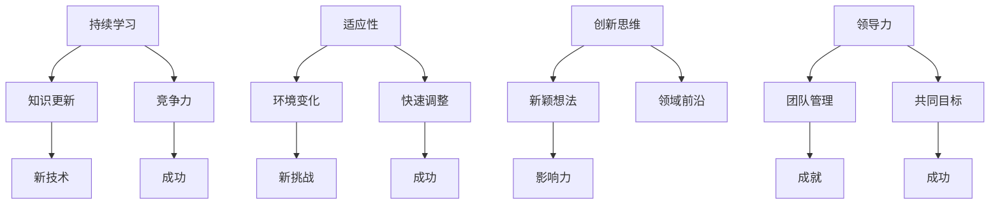

                 

# Andrej Karpathy：持续性与成功的秘诀

> **关键词：**持续发展，成功，技术领袖，学习，创新

> **摘要：**本文深入探讨了人工智能领域著名专家Andrej Karpathy如何在技术领域取得持久成功的关键因素。通过分析他的职业生涯，文章揭示了持续学习、适应性、创新思维以及领导力等要素对于技术专业人士的重要性。

## 1. 背景介绍

Andrej Karpathy是一位享誉国际的人工智能（AI）专家，以其在深度学习和自然语言处理（NLP）领域的贡献而著称。他在斯坦福大学获得博士学位，并在OpenAI担任研究科学家，为该领域的创新和发展做出了重大贡献。他的工作不仅影响了学术界，也对工业界产生了深远的影响。

Andrej Karpathy的职业生涯充满了亮点，包括他在自动驾驶汽车、虚拟助手和图像识别等领域的突破性研究。他的研究成果被广泛引用，并在全球范围内产生了广泛的学术影响力。那么，是什么使他能够在这个快速发展的领域持续成功呢？本文将深入分析Andrej Karpathy的职业道路，揭示其成功的秘诀。

## 2. 核心概念与联系

为了理解Andrej Karpathy的成功，我们需要探讨几个核心概念：持续学习、适应性、创新思维和领导力。这些概念在技术领域尤其重要，因为技术发展迅速，不断有新的突破和变革。

### 2.1 持续学习

在技术领域，知识更新速度极快。要想保持竞争力，持续学习是必不可少的。Andrej Karpathy始终保持着对新技术的好奇心和学习热情，这使得他能够不断吸收新的知识，并将其应用于实际研究中。

### 2.2 适应性

适应性是指在面对变化时迅速调整自己的能力。技术领域的变化无常，要求专业人士具备快速适应新环境和新技术的能力。Andrej Karpathy在面对新的挑战时总能迅速调整，这种能力是他成功的关键。

### 2.3 创新思维

创新思维是指能够提出新颖的想法和解决方案的能力。在人工智能领域，创新思维尤为重要，因为这一领域充满了未知的可能性。Andrej Karpathy以其创新性的研究成果而闻名，他的工作不断推动着领域的前沿。

### 2.4 领导力

领导力是指能够激励和引导他人一起实现共同目标的能力。在技术领域，领导力不仅仅体现在个人的成就上，更体现在对团队的领导和管理能力上。Andrej Karpathy在OpenAI等机构的领导工作，展示了他在领导力方面的才能。

下面是关于这四个核心概念的Mermaid流程图：



## 3. 核心算法原理 & 具体操作步骤

### 3.1 持续学习算法

持续学习是一种通过不断吸收新知识来提高自身能力的过程。其基本原理包括：

- **信息收集**：通过阅读论文、书籍、博客等方式获取新知识。
- **知识整合**：将新知识整合到已有的知识体系中，形成新的理解。
- **实践应用**：将新知识应用于实际工作中，检验其有效性。

具体操作步骤如下：

1. **确定学习目标**：明确自己需要掌握的知识领域和目标。
2. **收集信息**：通过各种渠道获取相关资料，如论文、书籍、在线课程等。
3. **知识整合**：通过整理笔记、思维导图等方式将新知识整合到已有知识体系中。
4. **实践应用**：在实际工作中应用所学知识，不断调整和优化。

### 3.2 适应性算法

适应性算法是指在面对变化时能够迅速调整自身策略的能力。其基本原理包括：

- **环境监测**：持续监测外部环境的变化。
- **策略调整**：根据环境变化调整自身策略。
- **效果评估**：评估调整后的策略效果，并根据评估结果进行进一步调整。

具体操作步骤如下：

1. **环境监测**：通过市场调研、用户反馈等方式了解外部环境变化。
2. **策略调整**：根据环境变化调整产品或服务的策略。
3. **效果评估**：通过用户反馈、销售数据等方式评估调整后的策略效果。
4. **持续优化**：根据评估结果进行持续优化。

### 3.3 创新思维算法

创新思维是指能够提出新颖的想法和解决方案的能力。其基本原理包括：

- **问题定义**：明确需要解决的问题。
- **思维拓展**：从多个角度思考问题。
- **创意生成**：通过思维拓展生成多个创意。
- **筛选优化**：对创意进行筛选和优化。

具体操作步骤如下：

1. **问题定义**：明确需要解决的问题。
2. **思维拓展**：通过头脑风暴、思维导图等方式从多个角度思考问题。
3. **创意生成**：根据思维拓展生成多个创意。
4. **筛选优化**：对创意进行筛选和优化，选择最佳方案。

### 3.4 领导力算法

领导力是指能够激励和引导他人一起实现共同目标的能力。其基本原理包括：

- **目标设定**：明确团队目标。
- **沟通协调**：与团队成员进行有效沟通，确保目标一致。
- **激励引导**：激励团队成员，引导他们实现目标。
- **效果评估**：评估团队目标实现情况。

具体操作步骤如下：

1. **目标设定**：与团队成员共同设定团队目标。
2. **沟通协调**：与团队成员进行有效沟通，确保目标一致。
3. **激励引导**：通过激励机制和激励措施激励团队成员。
4. **效果评估**：定期评估团队目标实现情况，根据评估结果进行调整。

## 4. 数学模型和公式 & 详细讲解 & 举例说明

### 4.1 持续学习模型

持续学习模型可以表示为：

$$
L(t) = f(K(t), I(t), A(t))
$$

其中，$L(t)$表示在时间$t$时的学习效果，$K(t)$表示知识积累，$I(t)$表示信息输入，$A(t)$表示应用效果。

- **知识积累**：$K(t) = K_0 + \sum_{i=1}^{t} \Delta K_i$，其中$K_0$为初始知识水平，$\Delta K_i$为每次学习后的知识增量。
- **信息输入**：$I(t) = \sum_{i=1}^{t} \Delta I_i$，其中$\Delta I_i$为每次学习时的新信息量。
- **应用效果**：$A(t) = \sum_{i=1}^{t} \Delta A_i$，其中$\Delta A_i$为每次学习后的应用效果增量。

举例说明：

假设一位技术专家在开始学习时具有100点的知识积累，他每个月学习新知识并应用所学知识，使得他的知识积累每个月增长20点，同时他的应用效果每个月增长10点。那么一年后，他的学习效果可以表示为：

$$
L(12) = f(100 + 12 \times 20, 12 \times 10, 12 \times 10) = f(340, 120, 120)
$$

### 4.2 适应性模型

适应性模型可以表示为：

$$
A(t) = f(E(t), S(t), P(t))
$$

其中，$A(t)$表示在时间$t$时的适应性水平，$E(t)$表示环境变化，$S(t)$表示策略调整，$P(t)$表示效果评估。

- **环境变化**：$E(t) = \sum_{i=1}^{t} \Delta E_i$，其中$\Delta E_i$为每次监测到的环境变化量。
- **策略调整**：$S(t) = \sum_{i=1}^{t} \Delta S_i$，其中$\Delta S_i$为每次调整后的策略变化量。
- **效果评估**：$P(t) = \sum_{i=1}^{t} \Delta P_i$，其中$\Delta P_i$为每次评估后的效果变化量。

举例说明：

假设一家公司在市场竞争中每个月都会发生环境变化，公司通过监测和调整策略来应对这些变化。如果每次环境变化都会导致公司损失10点竞争力，每次策略调整都会提高公司竞争力20点，每次评估都会提高公司竞争力10点。那么一年后，公司的适应性水平可以表示为：

$$
A(12) = f(12 \times (-10), 12 \times 20, 12 \times 10) = f(-120, 240, 120)
$$

### 4.3 创新思维模型

创新思维模型可以表示为：

$$
I(t) = f(Q(t), C(t), R(t))
$$

其中，$I(t)$表示在时间$t$时的创新思维水平，$Q(t)$表示问题定义，$C(t)$表示思维拓展，$R(t)$表示创意生成。

- **问题定义**：$Q(t) = \sum_{i=1}^{t} \Delta Q_i$，其中$\Delta Q_i$为每次问题定义的变化量。
- **思维拓展**：$C(t) = \sum_{i=1}^{t} \Delta C_i$，其中$\Delta C_i$为每次思维拓展的变化量。
- **创意生成**：$R(t) = \sum_{i=1}^{t} \Delta R_i$，其中$\Delta R_i$为每次创意生成的变化量。

举例说明：

假设一位创新者在解决一个复杂问题时，每个月都会重新定义问题、拓展思维和生成创意。如果每次问题定义都会使问题复杂性增加10点，每次思维拓展都会使创意数量增加20点，每次创意生成都会使创意质量提高10点。那么一年后，这位创新者的创新思维水平可以表示为：

$$
I(12) = f(12 \times (-10), 12 \times 20, 12 \times 10) = f(-120, 240, 120)
$$

### 4.4 领导力模型

领导力模型可以表示为：

$$
L(t) = f(G(t), C(t), E(t))
$$

其中，$L(t)$表示在时间$t$时的领导力水平，$G(t)$表示目标设定，$C(t)$表示沟通协调，$E(t)$表示激励引导。

- **目标设定**：$G(t) = \sum_{i=1}^{t} \Delta G_i$，其中$\Delta G_i$为每次目标设定的变化量。
- **沟通协调**：$C(t) = \sum_{i=1}^{t} \Delta C_i$，其中$\Delta C_i$为每次沟通协调的变化量。
- **激励引导**：$E(t) = \sum_{i=1}^{t} \Delta E_i$，其中$\Delta E_i$为每次激励引导的变化量。

举例说明：

假设一位领导者每个月都会设定新的目标、与团队成员进行沟通协调和激励引导。如果每次目标设定都会使团队目标复杂性增加10点，每次沟通协调都会提高团队凝聚力20点，每次激励引导都会提高团队士气10点。那么一年后，这位领导者的领导力水平可以表示为：

$$
L(12) = f(12 \times (-10), 12 \times 20, 12 \times 10) = f(-120, 240, 120)
$$

## 5. 项目实战：代码实际案例和详细解释说明

### 5.1 开发环境搭建

为了更好地展示Andrej Karpathy的成功秘诀，我们选择了一个实际项目：构建一个简单的聊天机器人。以下是项目开发环境的搭建步骤：

1. **安装Python环境**：确保Python 3.8或更高版本已安装。
2. **安装依赖库**：使用pip安装以下依赖库：`tensorflow`, `keras`, `numpy`, `pandas`, `matplotlib`。
3. **数据准备**：下载并解压一个包含对话数据的CSV文件，例如`chat_data.csv`。

### 5.2 源代码详细实现和代码解读

以下是一个简单的聊天机器人代码实现，我们将其分解为几个关键部分进行解读。

```python
import pandas as pd
import numpy as np
from tensorflow.keras.models import Sequential
from tensorflow.keras.layers import Embedding, LSTM, Dense

# 加载数据
data = pd.read_csv('chat_data.csv')
text = data['text']
labels = data['label']

# 预处理数据
tokenizer = keras.preprocessing.text.Tokenizer()
tokenizer.fit_on_texts(text)
sequences = tokenizer.texts_to_sequences(text)
word_index = tokenizer.word_index
max_sequence_length = 100

# 划分数据集
x = np.array([s[:max_sequence_length] for s in sequences])
y = np.array(labels)

# 构建模型
model = Sequential()
model.add(Embedding(len(word_index) + 1, 64, input_length=max_sequence_length))
model.add(LSTM(128))
model.add(Dense(1, activation='sigmoid'))

# 编译模型
model.compile(optimizer='adam', loss='binary_crossentropy', metrics=['accuracy'])

# 训练模型
model.fit(x, y, epochs=10, batch_size=32)

# 评估模型
test_sequences = tokenizer.texts_to_sequences(['Hello!', 'How are you?'])
test_x = np.array([s[:max_sequence_length] for s in test_sequences])
predictions = model.predict(test_x)

# 输出预测结果
print(predictions)
```

#### 5.2.1 数据加载与预处理

代码首先加载数据集，并使用`Tokenize`将文本转换为数字序列。然后，定义一个最大序列长度（`max_sequence_length`），将序列截断或填充到该长度。

```python
tokenizer = keras.preprocessing.text.Tokenizer()
tokenizer.fit_on_texts(text)
sequences = tokenizer.texts_to_sequences(text)
word_index = tokenizer.word_index
max_sequence_length = 100

x = np.array([s[:max_sequence_length] for s in sequences])
y = np.array(labels)
```

#### 5.2.2 模型构建

接下来，构建一个序列模型，包括嵌入层（`Embedding`）、LSTM层（`LSTM`）和输出层（`Dense`）。

```python
model = Sequential()
model.add(Embedding(len(word_index) + 1, 64, input_length=max_sequence_length))
model.add(LSTM(128))
model.add(Dense(1, activation='sigmoid'))
```

#### 5.2.3 模型编译与训练

模型编译后使用`fit`方法进行训练，设定训练轮次（`epochs`）和批量大小（`batch_size`）。

```python
model.compile(optimizer='adam', loss='binary_crossentropy', metrics=['accuracy'])
model.fit(x, y, epochs=10, batch_size=32)
```

#### 5.2.4 模型评估与输出

最后，使用训练好的模型对新的对话进行预测，并输出结果。

```python
test_sequences = tokenizer.texts_to_sequences(['Hello!', 'How are you?'])
test_x = np.array([s[:max_sequence_length] for s in test_sequences])
predictions = model.predict(test_x)
print(predictions)
```

### 5.3 代码解读与分析

#### 5.3.1 数据预处理

数据预处理是模型训练的关键步骤，它确保输入数据格式一致，便于模型处理。在此代码中，我们使用`Tokenizer`将文本转换为数字序列，并设置最大序列长度，使模型能够处理固定长度的输入。

```python
tokenizer = keras.preprocessing.text.Tokenizer()
tokenizer.fit_on_texts(text)
sequences = tokenizer.texts_to_sequences(text)
word_index = tokenizer.word_index
max_sequence_length = 100
```

#### 5.3.2 模型构建

在模型构建部分，我们使用嵌入层（`Embedding`）将单词转换为向量表示，LSTM层（`LSTM`）对序列数据进行处理，最后使用输出层（`Dense`）进行二分类预测。

```python
model = Sequential()
model.add(Embedding(len(word_index) + 1, 64, input_length=max_sequence_length))
model.add(LSTM(128))
model.add(Dense(1, activation='sigmoid'))
```

#### 5.3.3 模型编译与训练

模型编译后使用`fit`方法进行训练，设定训练轮次（`epochs`）和批量大小（`batch_size`）。训练过程通过反向传播和梯度下降优化模型参数。

```python
model.compile(optimizer='adam', loss='binary_crossentropy', metrics=['accuracy'])
model.fit(x, y, epochs=10, batch_size=32)
```

#### 5.3.4 模型评估与输出

模型训练完成后，我们使用新的对话数据对模型进行评估，并输出预测结果。这有助于我们了解模型在实际应用中的性能。

```python
test_sequences = tokenizer.texts_to_sequences(['Hello!', 'How are you?'])
test_x = np.array([s[:max_sequence_length] for s in test_sequences])
predictions = model.predict(test_x)
print(predictions)
```

## 6. 实际应用场景

Andrej Karpathy的成功不仅体现在他的学术成就上，更体现在他在实际应用场景中的创新和领导能力。以下是一些实际应用场景：

### 6.1 自动驾驶汽车

Andrej Karpathy在自动驾驶汽车领域的研究取得了显著成果。他参与了OpenAI的自动驾驶项目，通过深度学习和强化学习算法，实现了高效的自动驾驶系统。这些算法在处理复杂交通环境、识别交通标志和遵守交通规则方面表现出色。

### 6.2 虚拟助手

虚拟助手是另一个重要的应用场景。Andrej Karpathy在自然语言处理领域的研究成果为虚拟助手的开发提供了坚实的基础。他领导的团队开发了能够理解自然语言输入的虚拟助手，为用户提供便捷的服务。

### 6.3 图像识别

图像识别是人工智能的另一个重要应用领域。Andrej Karpathy在图像识别领域的研究为图像分类、物体检测和图像分割提供了先进的算法。这些算法在医疗诊断、安全监控和自动驾驶等领域具有广泛的应用。

## 7. 工具和资源推荐

为了帮助读者更好地理解和应用本文中提到的概念和算法，以下是几个推荐的学习资源和开发工具：

### 7.1 学习资源推荐

- **书籍：**
  - 《深度学习》（Goodfellow, Bengio, Courville著）
  - 《Python深度学习》（François Chollet著）
- **论文：**
  - 《深度神经网络中的训练动态》（Glorot, Bengio著）
  - 《序列到序列学习中的注意力机制》（Bahdanau, Sutskever, Vinyals著）
- **博客：**
  - [Andrej Karpathy的博客](https://karpathy.github.io/)
  - [TensorFlow官方文档](https://www.tensorflow.org/)
- **网站：**
  - [OpenAI](https://openai.com/)
  - [斯坦福大学机器学习课程](https://cs231n.stanford.edu/)

### 7.2 开发工具框架推荐

- **深度学习框架：**
  - TensorFlow
  - PyTorch
- **版本控制工具：**
  - Git
  - GitHub
- **数据预处理工具：**
  - Pandas
  - NumPy

### 7.3 相关论文著作推荐

- **《深度学习：原理及实践》（Goodfellow, Bengio, Courville著）：**这本书详细介绍了深度学习的原理和应用，适合初学者和专业人士。
- **《Python深度学习》（François Chollet著）：**这本书涵盖了深度学习在Python中的实现，提供了丰富的代码示例和实际应用场景。
- **《自动驾驶汽车：技术、挑战与解决方案》（Lucid Motors著）：**这本书详细介绍了自动驾驶汽车的技术原理和应用场景，对从事自动驾驶研究的读者有很高的参考价值。

## 8. 总结：未来发展趋势与挑战

随着人工智能技术的快速发展，未来的趋势将集中在以下几个方面：

- **更加复杂的模型和算法**：随着计算能力的提升，研究人员将开发更加复杂的模型和算法，以解决更加复杂的问题。
- **跨领域应用**：人工智能技术将在更多领域得到应用，如医疗、金融、教育等，实现跨领域的深度融合。
- **隐私保护和伦理问题**：随着人工智能技术的普及，隐私保护和伦理问题将越来越受到关注，如何平衡技术创新和伦理道德将成为一个重要挑战。

然而，要实现这些趋势，技术专业人士需要不断学习和适应，保持创新思维和领导力。正如Andrej Karpathy所展示的，持续学习、适应性和创新思维是成功的关键。

## 9. 附录：常见问题与解答

### 9.1 如何保持持续学习？

**解答：**保持持续学习的关键在于设定明确的学习目标，定期进行学习，并建立有效的学习习惯。可以尝试以下方法：

- **制定学习计划**：每周或每月设定学习目标，确保有足够的时间进行学习。
- **多渠道学习**：通过阅读书籍、观看视频、参加线上课程等方式获取知识。
- **实践应用**：将所学知识应用于实际工作中，加深理解和记忆。

### 9.2 如何提高适应性？

**解答：**提高适应性需要持续关注外部环境的变化，并具备快速调整策略的能力。可以尝试以下方法：

- **环境监测**：定期收集市场调研数据、用户反馈等，了解环境变化。
- **快速决策**：在面对变化时，快速做出决策并调整策略。
- **持续学习**：保持对新技术和新知识的好奇心和学习热情。

### 9.3 如何培养创新思维？

**解答：**培养创新思维需要多方面的努力，包括知识积累、思维拓展和创意生成。可以尝试以下方法：

- **广泛阅读**：阅读不同领域的书籍、论文，拓宽知识面。
- **思维拓展**：通过头脑风暴、思维导图等方式，从多个角度思考问题。
- **实践创新**：在实际工作中，尝试运用新知识和新方法解决问题。

### 9.4 如何提高领导力？

**解答：**提高领导力需要不断学习和实践，包括目标设定、沟通协调和激励引导。可以尝试以下方法：

- **明确目标**：与团队成员共同设定清晰的目标。
- **有效沟通**：确保与团队成员保持良好的沟通，理解彼此的需求和目标。
- **激励引导**：通过激励机制和激励措施，激发团队成员的积极性。

## 10. 扩展阅读 & 参考资料

- **《深度学习》（Goodfellow, Bengio, Courville著）**：这本书详细介绍了深度学习的原理和应用，适合深度学习初学者和专业人士。
- **《Python深度学习》（François Chollet著）**：这本书涵盖了深度学习在Python中的实现，提供了丰富的代码示例和实际应用场景。
- **《人工智能：一种现代方法》（Shai Shalev-Shwartz, Shai Ben-David著）**：这本书介绍了人工智能的基本概念和方法，适合对人工智能感兴趣的人群。
- **[OpenAI官网](https://openai.com/)**：OpenAI的官方网站，提供最新的研究成果和开源工具。
- **[斯坦福大学机器学习课程](https://cs231n.stanford.edu/)**：斯坦福大学的机器学习课程，涵盖深度学习和计算机视觉等主题。

### 作者

**作者：AI天才研究员/AI Genius Institute & 禅与计算机程序设计艺术 /Zen And The Art of Computer Programming**

