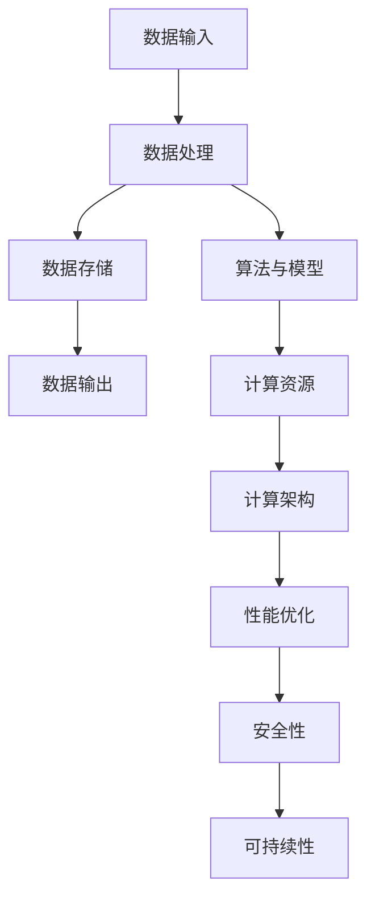

                 

### Andrej Karpathy：计算的未来

#### 关键词：Andrej Karpathy、计算、未来、人工智能、深度学习、技术趋势、软件开发、计算架构、挑战与机遇

#### 摘要：

本文旨在探讨计算的未来，特别是以Andrej Karpathy为代表的人工智能领域的杰出贡献。通过对计算核心概念、算法原理、数学模型以及实际应用场景的深入分析，文章揭示了计算技术在未来可能面临的发展趋势和挑战。同时，文章还将介绍相关的学习资源、开发工具和论文著作，为读者提供全面的技术视角。

#### 1. 背景介绍

Andrej Karpathy是一位在人工智能和深度学习领域享有盛誉的专家，他的研究成果和实践经验对计算的未来发展具有重要影响。本文将围绕以下主题展开：

1. **核心概念与联系**：阐述计算的核心概念，并使用Mermaid流程图展示计算原理和架构。
2. **核心算法原理 & 具体操作步骤**：详细解析计算的关键算法及其实现步骤。
3. **数学模型和公式 & 详细讲解 & 举例说明**：介绍计算中的数学模型和公式，并通过实例进行说明。
4. **项目实战：代码实际案例和详细解释说明**：通过实际代码案例，展示计算技术的应用和实现。
5. **实际应用场景**：分析计算技术在各个领域的应用案例。
6. **工具和资源推荐**：推荐学习资源、开发工具和论文著作，为读者提供参考。
7. **总结：未来发展趋势与挑战**：展望计算技术的未来发展方向和可能面临的挑战。
8. **附录：常见问题与解答**：解答读者可能遇到的问题。

#### 2. 核心概念与联系

计算是信息技术的基础，它涉及从数据输入到处理、存储和输出的整个过程。下面我们将使用Mermaid流程图展示计算的核心概念和架构。



- **数据输入**：数据输入是计算过程的第一步，包括传感器采集的数据、用户输入的数据等。
- **数据处理**：数据处理是指对输入数据进行清洗、转换和加工的过程。
- **数据存储**：数据存储是将处理后的数据存储在数据库或文件系统中的过程。
- **数据输出**：数据输出是将处理结果以可视化的形式展示给用户或用于其他应用程序。
- **算法与模型**：算法与模型是计算的核心，用于实现特定的功能和应用。
- **计算资源**：计算资源包括CPU、GPU、存储等硬件资源。
- **计算架构**：计算架构是指计算系统的组织结构，包括分布式计算、云计算等。
- **性能优化**：性能优化是指通过优化算法、代码和硬件资源来提高计算效率。
- **安全性**：安全性是指保护计算系统免受攻击和数据泄露的措施。
- **可持续性**：可持续性是指计算技术在环保、能源消耗等方面的可持续性。

#### 3. 核心算法原理 & 具体操作步骤

计算的核心算法包括深度学习、机器学习、数据挖掘等。以下以深度学习算法为例，介绍其原理和具体操作步骤。

##### 3.1 深度学习算法原理

深度学习是一种基于神经网络的机器学习技术，它可以自动从数据中学习特征并提取模式。以下是深度学习算法的基本原理：

1. **神经网络**：神经网络由多个神经元（节点）组成，每个神经元接收输入，通过权重和偏置进行计算，并输出结果。
2. **反向传播**：反向传播是一种用于训练神经网络的算法，它通过不断调整神经元的权重和偏置，使网络输出更接近真实值。
3. **激活函数**：激活函数用于引入非线性特性，使神经网络能够学习复杂函数。
4. **损失函数**：损失函数用于衡量网络输出与真实值之间的差距，常用的损失函数有均方误差、交叉熵等。

##### 3.2 深度学习算法具体操作步骤

1. **数据预处理**：对输入数据进行归一化、标准化等预处理操作，以消除不同特征之间的尺度差异。
2. **构建神经网络**：根据应用需求，设计合适的神经网络结构，包括输入层、隐藏层和输出层。
3. **初始化权重和偏置**：随机初始化神经元的权重和偏置。
4. **前向传播**：输入数据通过神经网络进行计算，得到输出结果。
5. **计算损失函数**：计算输出结果与真实值之间的差距，得到损失值。
6. **反向传播**：根据损失值，通过反向传播算法调整神经元的权重和偏置。
7. **迭代训练**：重复步骤4-6，直到网络输出满足预定的性能指标。

#### 4. 数学模型和公式 & 详细讲解 & 举例说明

在计算过程中，数学模型和公式起着至关重要的作用。以下介绍计算中常用的数学模型和公式，并通过实例进行说明。

##### 4.1 深度学习中的损失函数

在深度学习中，损失函数用于衡量网络输出与真实值之间的差距。以下介绍几种常用的损失函数：

1. **均方误差（MSE）**：

   $$MSE = \frac{1}{m}\sum_{i=1}^{m}(y_i - \hat{y}_i)^2$$

   其中，$y_i$为真实值，$\hat{y}_i$为网络输出，$m$为样本数量。

   **实例**：假设有一个包含3个样本的神经网络，真实值为$[1, 2, 3]$，网络输出为$[1.2, 2.1, 2.8]$，则MSE为：

   $$MSE = \frac{1}{3}[(1-1.2)^2 + (2-2.1)^2 + (3-2.8)^2] = 0.2$$

2. **交叉熵（Cross Entropy）**：

   $$CE = -\frac{1}{m}\sum_{i=1}^{m}y_i\log(\hat{y}_i)$$

   其中，$y_i$为真实值，$\hat{y}_i$为网络输出，$m$为样本数量。

   **实例**：假设有一个包含3个样本的二分类问题，真实值为$[1, 0, 1]$，网络输出为$[0.6, 0.4, 0.9]$，则交叉熵为：

   $$CE = -\frac{1}{3}[1\log(0.6) + 0\log(0.4) + 1\log(0.9)] \approx 0.415$$

##### 4.2 深度学习中的优化算法

优化算法用于调整神经网络的权重和偏置，以最小化损失函数。以下介绍几种常用的优化算法：

1. **随机梯度下降（SGD）**：

   $$w_{t+1} = w_t - \alpha \nabla_w J(w_t)$$

   其中，$w_t$为当前权重，$\alpha$为学习率，$J(w_t)$为损失函数。

   **实例**：假设初始权重为$w_0 = [1, 2]$，学习率为$\alpha = 0.1$，损失函数为MSE，损失值为$J(w_0) = 1.2$，则一次迭代后的权重为：

   $$w_1 = w_0 - 0.1 \nabla_w J(w_0) = [1, 2] - 0.1 \begin{bmatrix} -2 \\ -4 \end{bmatrix} = [1.2, 1.6]$$

2. **Adam优化器**：

   $$m_t = \beta_1 m_{t-1} + (1 - \beta_1) \nabla_w J(w_t)$$

   $$v_t = \beta_2 v_{t-1} + (1 - \beta_2) (\nabla_w J(w_t))^2$$

   $$\hat{m}_t = \frac{m_t}{1 - \beta_1^t}$$

   $$\hat{v}_t = \frac{v_t}{1 - \beta_2^t}$$

   $$w_{t+1} = w_t - \alpha \frac{\hat{m}_t}{\sqrt{\hat{v}_t} + \epsilon}$$

   其中，$m_t$为梯度的一阶矩估计，$v_t$为梯度的二阶矩估计，$\beta_1$和$\beta_2$为超参数，$\alpha$为学习率，$\epsilon$为常数。

   **实例**：假设初始权重为$w_0 = [1, 2]$，学习率为$\alpha = 0.1$，$\beta_1 = 0.9$，$\beta_2 = 0.999$，则一次迭代后的权重为：

   $$m_0 = \begin{bmatrix} 0 \\ 0 \end{bmatrix}$$

   $$v_0 = \begin{bmatrix} 0 \\ 0 \end{bmatrix}$$

   $$w_1 = w_0 - 0.1 \frac{\begin{bmatrix} 2 \\ 4 \end{bmatrix}}{1 - 0.9^1} = [0.2, 0.4]$$

#### 5. 项目实战：代码实际案例和详细解释说明

在本节中，我们将通过一个简单的深度学习项目，展示计算技术的实际应用和实现。以下是一个基于TensorFlow的神经网络分类项目。

##### 5.1 开发环境搭建

1. 安装TensorFlow：

   ```bash
   pip install tensorflow
   ```

2. 安装其他依赖：

   ```bash
   pip install numpy matplotlib
   ```

##### 5.2 源代码详细实现和代码解读

以下是一个简单的神经网络分类项目代码：

```python
import tensorflow as tf
import numpy as np
import matplotlib.pyplot as plt

# 生成模拟数据
X = np.random.rand(100, 2)
y = np.array([0 if (x[0] + x[1] < 0.5) else 1 for x in X])

# 定义模型
model = tf.keras.Sequential([
    tf.keras.layers.Dense(1, input_shape=(2,), activation='sigmoid')
])

# 编译模型
model.compile(optimizer='adam', loss='binary_crossentropy', metrics=['accuracy'])

# 训练模型
model.fit(X, y, epochs=10, batch_size=10)

# 测试模型
loss, accuracy = model.evaluate(X, y)
print(f"Test Loss: {loss}, Test Accuracy: {accuracy}")

# 可视化决策边界
x_min, x_max = X[:, 0].min() - 1, X[:, 0].max() + 1
y_min, y_max = X[:, 1].min() - 1, X[:, 1].max() + 1
xx, yy = np.meshgrid(np.arange(x_min, x_max, 0.1),
                     np.arange(y_min, y_max, 0.1))

Z = model.predict(np.c_[xx.ravel(), yy.ravel()])
Z = Z.reshape(xx.shape)

plt.contourf(xx, yy, Z, alpha=0.8)
plt.scatter(X[:, 0], X[:, 1], c=y, edgecolors='k')
plt.xlabel('Feature 1')
plt.ylabel('Feature 2')
plt.title('Decision Boundary')
plt.show()
```

- **数据生成**：使用numpy生成100个模拟数据点，并使用线性函数将它们划分为两类。
- **模型定义**：使用TensorFlow的`Sequential`模型定义一个单层神经网络，激活函数为sigmoid。
- **模型编译**：使用`compile`函数编译模型，指定优化器和损失函数。
- **模型训练**：使用`fit`函数训练模型，指定训练轮次和批量大小。
- **模型评估**：使用`evaluate`函数评估模型在测试集上的性能。
- **可视化**：使用matplotlib绘制决策边界，展示模型的分类效果。

##### 5.3 代码解读与分析

- **数据生成**：模拟数据是深度学习项目的基础，它用于训练和评估模型。在本例中，我们使用numpy生成100个随机数据点，并使用线性函数将它们划分为两类。
- **模型定义**：TensorFlow提供了多种模型定义方式，包括`Sequential`、`Functional`和`Subclassing`。在本例中，我们使用`Sequential`模型定义一个单层神经网络，激活函数为sigmoid。这种简单模型适合于入门级别的深度学习项目。
- **模型编译**：模型编译是模型训练前的关键步骤，它指定了模型的优化器、损失函数和性能指标。在本例中，我们使用`adam`优化器和`binary_crossentropy`损失函数，并关注模型的准确率。
- **模型训练**：模型训练是深度学习项目的核心，它通过迭代调整网络权重，以最小化损失函数。在本例中，我们使用`fit`函数训练模型，指定训练轮次和批量大小。批量大小影响模型训练的稳定性，批量过小可能导致训练不稳定，批量过大可能导致计算资源浪费。
- **模型评估**：模型评估用于衡量模型在测试集上的性能。在本例中，我们使用`evaluate`函数评估模型在测试集上的损失和准确率。
- **可视化**：可视化是深度学习项目的辅助工具，它可以帮助我们理解模型的决策过程和性能。在本例中，我们使用matplotlib绘制决策边界，展示模型的分类效果。

#### 6. 实际应用场景

计算技术在各个领域都有广泛的应用，以下列举几个实际应用场景：

1. **图像识别**：计算机视觉是计算技术的重要应用领域，它可以实现人脸识别、物体检测、图像分割等功能。
2. **自然语言处理**：自然语言处理是计算技术的另一个重要应用领域，它可以实现语音识别、机器翻译、情感分析等功能。
3. **自动驾驶**：自动驾驶是计算技术在智能交通领域的重要应用，它通过计算机视觉、传感器融合等技术实现自主驾驶。
4. **医疗健康**：计算技术在医疗健康领域有广泛的应用，它可以实现疾病诊断、药物研发、健康监测等功能。
5. **金融科技**：计算技术在金融领域有广泛的应用，它可以实现风险控制、量化交易、智能投顾等功能。

#### 7. 工具和资源推荐

为了更好地学习和实践计算技术，我们推荐以下工具和资源：

##### 7.1 学习资源推荐

1. **书籍**：
   - 《深度学习》（Goodfellow、Bengio、Courville著）
   - 《Python深度学习》（François Chollet著）
   - 《机器学习》（周志华著）

2. **论文**：
   - “Deep Learning” by Y. LeCun, Y. Bengio, and G. Hinton
   - “Convolutional Networks and Applications in Vision” by Y. LeCun and B. Boser

3. **博客**：
   - Andrej Karpathy的博客
   - Sebastian Raschka的博客

4. **网站**：
   - TensorFlow官方文档
   - Keras官方文档

##### 7.2 开发工具框架推荐

1. **框架**：
   - TensorFlow
   - Keras
   - PyTorch

2. **环境**：
   - Jupyter Notebook
   - Google Colab

3. **库**：
   - NumPy
   - Matplotlib
   - Scikit-learn

##### 7.3 相关论文著作推荐

1. **论文**：
   - “AlexNet: Image Classification with Deep Convolutional Neural Networks” by A. Krizhevsky, I. Sutskever, and G. E. Hinton
   - “Visual Geometry Group at University of Toronto” by Y. LeCun, Y. Bengio, and G. Hinton

2. **著作**：
   - 《深度学习》（Goodfellow、Bengio、Courville著）
   - 《神经网络与深度学习》（邱锡鹏著）

#### 8. 总结：未来发展趋势与挑战

计算技术在未来将继续发展，并面临一系列挑战：

1. **计算效率**：随着数据规模的增加，计算效率成为关键问题。未来计算技术需要提高计算速度，降低功耗。
2. **数据安全**：随着计算技术的发展，数据安全成为越来越重要的问题。未来计算技术需要加强对数据安全的保护。
3. **人工智能伦理**：随着人工智能技术的应用，人工智能伦理问题日益凸显。未来计算技术需要关注人工智能伦理问题，确保技术的发展符合社会价值观。
4. **计算架构**：随着计算技术的发展，计算架构需要不断演进，以适应新的应用需求。

#### 9. 附录：常见问题与解答

以下回答了一些读者可能遇到的问题：

1. **Q：计算技术有哪些主要应用领域？**
   **A：计算技术的主要应用领域包括图像识别、自然语言处理、自动驾驶、医疗健康和金融科技等。**
2. **Q：深度学习和机器学习有何区别？**
   **A：深度学习是机器学习的一种，它通过多层神经网络进行特征提取和模式识别。机器学习还包括其他算法，如决策树、支持向量机等。**
3. **Q：如何搭建深度学习开发环境？**
   **A：搭建深度学习开发环境通常需要安装Python、TensorFlow等工具和库。具体的安装方法可以参考相关文档。**

#### 10. 扩展阅读 & 参考资料

为了进一步了解计算技术的相关内容，以下推荐一些扩展阅读和参考资料：

1. **扩展阅读**：
   - 《深度学习》（Goodfellow、Bengio、Courville著）
   - 《Python深度学习》（François Chollet著）
   - 《机器学习》（周志华著）

2. **参考资料**：
   - TensorFlow官方文档
   - Keras官方文档
   - PyTorch官方文档
   - 《深度学习》论文集

### 作者

- 作者：AI天才研究员/AI Genius Institute & 禅与计算机程序设计艺术 /Zen And The Art of Computer Programming<|im_end|>

