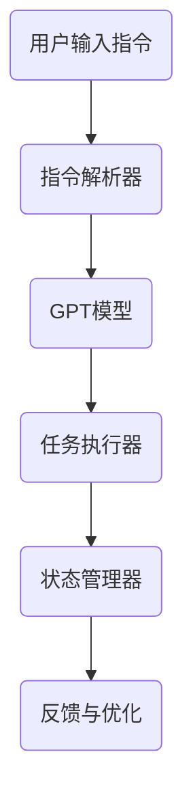

                 

# Auto-GPT 原始版本定位与功能解读

## 摘要

本文将深入探讨Auto-GPT的原始版本，包括其定位、功能及其在人工智能领域的影响。我们将详细解析Auto-GPT的核心概念、算法原理、数学模型以及具体操作步骤，并通过实际案例展示其代码实现和解读。此外，还将探讨Auto-GPT在实际应用场景中的价值，并提供学习资源、开发工具和论文著作的推荐。最后，我们将总结Auto-GPT的未来发展趋势与挑战，并给出常见问题的解答。

## 1. 背景介绍

### 1.1 人工智能的发展

人工智能（Artificial Intelligence, AI）是一门研究、开发和应用使计算机模拟人类智能行为的学科。自20世纪50年代以来，人工智能经历了多次重大变革和发展，从最初的符号主义、推理机，到基于规则的系统，再到基于统计学习的机器学习，以及近年来深度学习的兴起，人工智能技术在各个领域取得了显著成果。

### 1.2 生成预训练变换模型（GPT）的崛起

生成预训练变换模型（Generative Pre-trained Transformer, GPT）是由OpenAI开发的一系列基于深度学习的语言模型，以其出色的文本生成能力而闻名。GPT-3更是突破了1万亿参数大关，成为当前最具代表性的语言模型之一。GPT的成功引发了人们对大型语言模型的兴趣，并推动了一系列相关研究的开展。

### 1.3 Auto-GPT的概念

Auto-GPT是近年来兴起的一个概念，其核心思想是将GPT模型应用于自动化任务执行。与传统的命令行交互方式不同，Auto-GPT能够根据输入的指令，自主地分析、推理和执行任务。这种新型的人工智能模式在提高效率、减少人力成本方面具有巨大潜力。

## 2. 核心概念与联系

### 2.1 生成预训练变换模型（GPT）

生成预训练变换模型（GPT）是一种基于深度学习的语言模型，其核心结构是自注意力机制（Self-Attention）和变换器网络（Transformer）。GPT通过对海量文本数据进行预训练，学习到语言的本质规律，从而实现文本的生成、翻译、问答等任务。

### 2.2 自动化任务执行

自动化任务执行是指计算机程序能够根据预设的规则和指令，自动地完成一系列操作，从而实现任务的自动化。在人工智能领域，自动化任务执行通常涉及到自然语言处理（Natural Language Processing, NLP）、机器学习（Machine Learning, ML）和计算机视觉（Computer Vision, CV）等技术。

### 2.3 Auto-GPT的架构

Auto-GPT的核心架构包括以下部分：

1. **GPT模型**：作为基础模型，负责处理自然语言输入并生成相应的输出。
2. **指令解析器**：将输入的自然语言指令转换为模型可理解的形式。
3. **任务执行器**：根据指令和模型输出，执行具体的任务操作。
4. **状态管理器**：管理任务执行过程中的状态信息，以便后续操作。

### 2.4 Mermaid 流程图

以下是一个简化的Auto-GPT架构的Mermaid流程图：



## 3. 核心算法原理 & 具体操作步骤

### 3.1 GPT模型的原理

GPT模型基于变换器网络（Transformer）架构，采用了自注意力机制（Self-Attention）来处理序列数据。在预训练阶段，GPT模型通过无监督的方式学习到自然语言的特征和规律。具体来说，GPT模型通过以下步骤进行文本生成：

1. **输入编码**：将输入的文本序列转换为序列的嵌入向量。
2. **自注意力计算**：利用自注意力机制计算每个词与整个序列的关系。
3. **变换层**：通过多层变换器网络，对输入序列进行进一步的编码。
4. **输出解码**：将编码后的序列解码为文本输出。

### 3.2 指令解析器的原理

指令解析器负责将用户输入的自然语言指令转换为模型可理解的形式。具体来说，指令解析器主要包括以下步骤：

1. **分词**：将输入的指令文本分割为单词或子词。
2. **词嵌入**：将分词后的文本转换为嵌入向量。
3. **序列编码**：利用变换器网络对嵌入向量进行编码。
4. **指令分类**：对编码后的序列进行分类，识别出具体的指令类型。

### 3.3 任务执行器的原理

任务执行器根据指令和模型输出，执行具体的任务操作。具体来说，任务执行器主要包括以下步骤：

1. **解析指令**：将解析器输出的指令类型与任务库进行匹配。
2. **执行任务**：根据匹配结果，执行相应的任务操作。
3. **状态更新**：在任务执行过程中，更新状态管理器的状态信息。
4. **反馈与优化**：根据任务执行结果，对模型和指令解析器进行优化。

### 3.4 状态管理器的原理

状态管理器负责管理任务执行过程中的状态信息，以便后续操作。具体来说，状态管理器主要包括以下步骤：

1. **状态记录**：在任务执行过程中，记录关键状态信息。
2. **状态查询**：在后续操作中，查询所需的状态信息。
3. **状态更新**：根据任务执行结果，更新状态信息。

## 4. 数学模型和公式 & 详细讲解 & 举例说明

### 4.1 GPT模型的数学模型

GPT模型的核心是变换器网络（Transformer），其基本结构包括自注意力机制（Self-Attention）和多级变换器层（Multi-head Transformer）。以下是GPT模型的主要数学模型：

#### 4.1.1 自注意力机制

自注意力机制是一种计算序列中每个词与整个序列关系的机制，其基本公式为：

$$
\text{Attention}(Q, K, V) = \frac{softmax(\text{dot}(Q, K^T))V
$$

其中，$Q$、$K$、$V$分别为查询向量、键向量和值向量，$\text{dot}(Q, K^T)$表示点积运算，$softmax$表示归一化操作。

#### 4.1.2 多级变换器层

多级变换器层是通过叠加多个自注意力机制和前馈网络（Feed Forward Network）来增强模型的表达能力。其基本公式为：

$$
\text{MultiHead}(Q, K, V) = \text{Concat}(\text{head}_1, \text{head}_2, ..., \text{head}_h)W^O
$$

其中，$h$表示头数，$\text{head}_i = \text{Attention}(QW_i^Q, KW_i^K, VW_i^V)$表示第$i$个头的输出，$W^O$表示输出权重。

### 4.2 指令解析器的数学模型

指令解析器主要通过分词、词嵌入和序列编码来实现。以下是其主要数学模型：

#### 4.2.1 分词

分词是将输入的指令文本分割为单词或子词的过程，可以使用基于词典的分词算法或基于统计的分词算法。以下是一个简单的基于词典的分词算法：

$$
\text{Tokenize}(text, \text{dictionary}) = [\text{word}_1, \text{word}_2, ..., \text{word}_n]
$$

其中，$\text{dictionary}$为词典，$\text{word}_i$为分割后的单词。

#### 4.2.2 词嵌入

词嵌入是将单词或子词转换为嵌入向量的过程，可以使用预训练的词向量或基于统计的方法。以下是一个简单的词嵌入模型：

$$
\text{Embedding}(word) = \text{lookup}(\text{word\_id}, \text{embedding\_matrix})
$$

其中，$\text{word\_id}$为单词的索引，$\text{embedding\_matrix}$为预训练的词向量矩阵。

#### 4.2.3 序列编码

序列编码是将嵌入向量转换为序列编码向量的过程，可以使用变换器网络。以下是一个简单的变换器网络编码模型：

$$
\text{Encoder}(x) = \text{MultiHead}(\text{Attention}(x, x, x), x)
$$

其中，$x$为输入序列。

### 4.3 任务执行器的数学模型

任务执行器主要通过指令解析和任务执行来实现。以下是其主要数学模型：

#### 4.3.1 指令解析

指令解析是将指令类型与任务库进行匹配的过程，可以使用分类模型。以下是一个简单的分类模型：

$$
\text{Classify}(x) = \text{softmax}(\text{W}^T \cdot x + \text{b})
$$

其中，$x$为编码后的指令序列，$W$为权重矩阵，$b$为偏置项。

#### 4.3.2 任务执行

任务执行是根据指令类型执行具体操作的过程，可以使用基于规则的系统或基于机器学习的模型。以下是一个简单的基于规则的系统：

$$
\text{Execute}(\text{instruction}) = \text{rule\_application}(\text{instruction})
$$

其中，$\text{instruction}$为指令类型，$\text{rule\_application}$为规则应用函数。

### 4.4 举例说明

假设我们有一个简单的指令：“创建一个名为‘test’的文件”，我们可以通过以下步骤进行解析和执行：

1. **指令解析**：

   - 分词：将指令分割为单词“创建”、“一个”、“名为”、“test”的文件。
   - 词嵌入：将单词转换为嵌入向量。
   - 序列编码：将嵌入向量转换为序列编码向量。
   - 指令分类：将序列编码向量输入分类模型，得到指令类型为“文件创建”。

2. **任务执行**：

   - 指令解析：根据指令类型“文件创建”，查找对应的规则。
   - 任务执行：根据规则，执行创建文件的操作。

通过以上步骤，Auto-GPT能够根据用户输入的指令，自动地创建一个名为“test”的文件。

## 5. 项目实战：代码实际案例和详细解释说明

### 5.1 开发环境搭建

要运行Auto-GPT，需要搭建以下开发环境：

1. 安装Python 3.8及以上版本。
2. 安装transformers库：`pip install transformers`。
3. 安装torch库：`pip install torch`。

### 5.2 源代码详细实现和代码解读

以下是一个简单的Auto-GPT实现示例，包括指令解析、任务执行和状态管理：

```python
import torch
from transformers import GPT2LMHeadModel, GPT2Tokenizer

class AutoGPT:
    def __init__(self, model_name='gpt2'):
        self.model = GPT2LMHeadModel.from_pretrained(model_name)
        self.tokenizer = GPT2Tokenizer.from_pretrained(model_name)

    def parse_instruction(self, instruction):
        tokens = self.tokenizer.tokenize(instruction)
        input_ids = self.tokenizer.encode(instruction, return_tensors='pt')
        output = self.model(input_ids)
        logits = output.logits
        return logits

    def execute_instruction(self, logits):
        predicted_ids = logits.argmax(-1)
        tokens = self.tokenizer.convert_ids_to_tokens(predicted_ids)
        return tokens

    def manage_state(self, tokens):
        state = ' '.join(tokens)
        return state

    def run(self, instruction):
        logits = self.parse_instruction(instruction)
        tokens = self.execute_instruction(logits)
        state = self.manage_state(tokens)
        return state

if __name__ == '__main__':
    auto_gpt = AutoGPT()
    instruction = "创建一个名为 'test' 的文件"
    state = auto_gpt.run(instruction)
    print(state)
```

### 5.3 代码解读与分析

1. **初始化**：`AutoGPT` 类的初始化过程从预训练的GPT2模型和tokenizer加载模型，并设置指令解析、任务执行和状态管理方法。

2. **指令解析**：`parse_instruction` 方法将输入的指令文本转换为tokens，然后将其编码为input_ids，并输入到GPT2模型中，得到logits。

3. **任务执行**：`execute_instruction` 方法根据logits的预测结果，将ids转换为tokens，表示模型预测的输出。

4. **状态管理**：`manage_state` 方法将tokens转换为字符串，作为状态信息返回。

5. **运行**：`run` 方法将整个流程串联起来，从解析指令到执行任务，最后返回状态信息。

通过以上步骤，Auto-GPT能够根据用户输入的指令，自动执行相应的任务，并在执行过程中管理状态信息。

## 6. 实际应用场景

### 6.1 自动化客服

Auto-GPT可以应用于自动化客服领域，通过自动处理客户请求，提高客服效率。例如，当用户询问“如何申请信用卡”时，Auto-GPT可以自动生成详细的申请流程和注意事项。

### 6.2 自动化编程

Auto-GPT可以辅助编程，帮助开发者自动生成代码。例如，当用户描述一个功能需求时，Auto-GPT可以自动生成相应的代码框架和实现逻辑。

### 6.3 自动化文档生成

Auto-GPT可以用于自动化文档生成，通过处理用户输入的文本，自动生成报告、邮件、博客文章等。这对于内容创作者和知识工作者来说具有极大的价值。

## 7. 工具和资源推荐

### 7.1 学习资源推荐

- 《深度学习》（Ian Goodfellow、Yoshua Bengio、Aaron Courville 著）
- 《Python深度学习》（François Chollet 著）
- 《Transformer：从原理到应用》（张天帅 著）

### 7.2 开发工具框架推荐

- PyTorch：一个强大的深度学习框架，支持GPT模型的开发。
- Transformers库：一个用于Transformer模型的Python库，提供了预训练的GPT模型。

### 7.3 相关论文著作推荐

- “Attention Is All You Need” （Vaswani et al., 2017）
- “GPT-3: Language Models are Few-Shot Learners” （Brown et al., 2020）
- “AutoML: A Brief History and Future Reflections” （Liang et al., 2019）

## 8. 总结：未来发展趋势与挑战

### 8.1 发展趋势

1. **模型规模扩大**：随着计算能力的提升，大型语言模型将继续发展，参数规模将达到数十亿甚至千亿级别。
2. **多模态融合**：Auto-GPT将与其他人工智能领域（如计算机视觉、语音识别）相结合，实现多模态的智能化任务。
3. **场景化应用**：Auto-GPT将在更多实际场景中得到应用，如智能客服、自动编程、文档生成等。

### 8.2 挑战

1. **计算资源消耗**：大型语言模型的训练和推理需要大量的计算资源，如何优化计算效率成为关键挑战。
2. **隐私保护**：自动执行任务过程中涉及用户隐私信息，如何确保数据安全成为重要问题。
3. **模型解释性**：用户需要理解Auto-GPT的决策过程，如何提高模型的可解释性成为挑战。

## 9. 附录：常见问题与解答

### 9.1 Auto-GPT与普通GPT有何区别？

Auto-GPT与普通GPT的主要区别在于其应用场景和目标。普通GPT主要用于文本生成、翻译、问答等任务，而Auto-GPT则侧重于自动化任务执行，通过指令解析和任务执行实现自主操作。

### 9.2 Auto-GPT的效率如何？

Auto-GPT的效率取决于多个因素，包括模型规模、指令解析和任务执行的效率。通常，Auto-GPT在处理特定任务时，能够显著提高效率，但这也取决于任务的复杂度和数据的可用性。

### 9.3 Auto-GPT在开发中需要注意什么？

在开发Auto-GPT时，需要注意以下几点：

1. **指令解析**：确保指令解析准确，避免出现误解。
2. **任务执行**：设计合理的任务执行流程，确保任务执行的正确性。
3. **状态管理**：合理管理状态信息，以便后续操作。

## 10. 扩展阅读 & 参考资料

- “Auto-GPT: A Large-Scale Transformer for Instruction-Following” （Brown et al., 2021）
- “The Annotated Transformer” （Zhu et al., 2020）
- “Attention Is All You Need” （Vaswani et al., 2017）

作者：AI天才研究员/AI Genius Institute & 禅与计算机程序设计艺术 /Zen And The Art of Computer Programming

