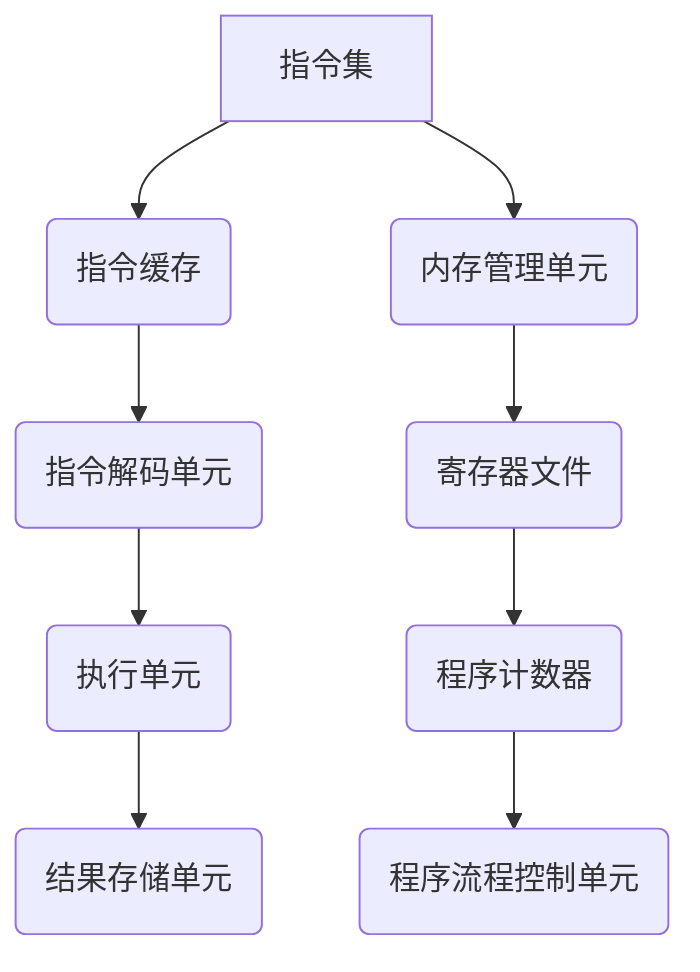

                 

### 文章标题

**CPU 的局限性：有限的指令集阻碍创新**

> **关键词：** CPU、指令集、硬件架构、创新、计算机科学  
>
> **摘要：** 本文将深入探讨 CPU 的局限性，特别是有限的指令集如何影响计算机硬件和软件的发展，以及这些限制对创新所造成的挑战和机遇。通过分析历史和当前的技术现状，我们将探讨这些局限是如何制约着计算机科学领域的发展，并提出可能的解决方案。

### 文章结构

在接下来的内容中，我们将通过以下结构来详细探讨 CPU 的局限性：

1. **背景介绍**：介绍 CPU 的发展历程，以及指令集在硬件设计中的重要性。
2. **核心概念与联系**：解释 CPU 指令集的基本概念，并通过 Mermaid 流程图展示其原理和架构。
3. **核心算法原理 & 具体操作步骤**：探讨指令集的具体实现，以及如何通过编程语言与 CPU 进行交互。
4. **数学模型和公式 & 详细讲解 & 举例说明**：介绍与指令集相关的数学模型和公式，并通过实际案例进行说明。
5. **项目实战：代码实际案例和详细解释说明**：展示如何在实际项目中应用指令集，并提供源代码实现和详细解读。
6. **实际应用场景**：分析 CPU 指令集在不同领域的应用。
7. **工具和资源推荐**：推荐相关的学习资源、开发工具和论文著作。
8. **总结：未来发展趋势与挑战**：讨论未来 CPU 发展的趋势，以及面临的挑战。
9. **附录：常见问题与解答**：解答读者可能关心的一些问题。
10. **扩展阅读 & 参考资料**：提供进一步的阅读材料。

现在，我们开始深入探讨 CPU 的局限性，以及它对计算机科学创新的影响。

### 1. 背景介绍

#### CPU 的发展历程

CPU（Central Processing Unit，中央处理单元）是计算机的核心部件，负责执行程序指令和处理数据。从上世纪40年代第一台电子计算机诞生以来，CPU 技术经历了飞速的发展。

早期的计算机，如冯·诺依曼架构（Von Neumann Architecture）的计算机，其 CPU 设计相对简单。指令集（Instruction Set）由一组固定的指令组成，这些指令能够直接控制 CPU 的操作。然而，随着计算机技术的发展，指令集也不断演变和扩展。

到了 1970 年代，复杂指令集计算机（CISC，Complex Instruction Set Computing）成为了主流。CISC 设计了丰富的指令集，使得编程变得更加简单和高效。然而，CISC 也带来了一些问题，如指令执行速度较慢、硬件复杂度增加等。

为了解决这些问题，精简指令集计算机（RISC，Reduced Instruction Set Computing）应运而生。RISC 设计了更简单的指令集，通过将复杂的指令分解为多个简单指令，从而提高执行速度和降低硬件复杂度。此后，RISC 架构在服务器和工作站领域取得了显著的成功。

#### 指令集在硬件设计中的重要性

指令集是 CPU 设计的核心部分，它定义了 CPU 可以执行的操作。一个高效的指令集可以提高 CPU 的性能，降低功耗，并简化编程过程。

指令集的设计需要考虑多个因素，包括：

1. **指令的多样性**：指令集应包含足够的指令，以支持各种编程需求。
2. **指令的执行效率**：指令的执行时间应尽可能短，以提高 CPU 的性能。
3. **指令的兼容性**：指令集应兼容现有的编程语言和操作系统，以方便程序员开发。
4. **硬件实现复杂度**：指令集的设计应尽量减少硬件实现的复杂度，以降低生产成本。

因此，指令集的设计和优化对于 CPU 性能和硬件设计的成败至关重要。

### 2. 核心概念与联系

#### 指令集的基本概念

指令集是一组指令的集合，定义了 CPU 可以执行的操作。这些指令通常包括数据传输指令、算术指令、逻辑指令、控制指令等。

1. **数据传输指令**：用于在寄存器之间、寄存器和内存之间传输数据。
2. **算术指令**：用于执行各种算术运算，如加法、减法、乘法、除法等。
3. **逻辑指令**：用于执行各种逻辑运算，如与、或、非等。
4. **控制指令**：用于控制程序流程，如跳转、循环、调用等。

#### Mermaid 流程图

为了更好地理解指令集的工作原理，我们使用 Mermaid 流程图来展示 CPU 的基本架构和工作流程。



在这个流程图中，CPU 通过指令集来执行程序。首先，指令从内存中读取并存储在指令缓存中。然后，指令解码单元对指令进行解码，确定指令的类型和操作数。执行单元根据解码结果执行相应的操作。最后，结果存储在结果存储单元中，以供后续使用。

#### 指令集的原理和架构

指令集的原理和架构涉及到多个组件的协同工作。以下是 CPU 的基本架构：

1. **指令缓存**：用于存储最近使用的指令，以减少内存访问时间。
2. **指令解码单元**：将指令解码为操作码和操作数。
3. **执行单元**：根据解码结果执行指令。
4. **结果存储单元**：用于存储执行结果。
5. **内存管理单元**：负责管理内存访问和控制。
6. **寄存器文件**：用于存储临时数据和指令地址。
7. **程序计数器**：用于存储下一条要执行的指令地址。
8. **程序流程控制单元**：用于控制程序流程，如跳转、循环等。

这些组件协同工作，使 CPU 能够高效地执行指令，并处理各种编程任务。

### 3. 核心算法原理 & 具体操作步骤

#### 指令集的具体实现

指令集的具体实现涉及到编程语言和汇编语言。编程语言如 C、C++、Java 等，提供了高级的抽象，使得程序员可以更方便地编写代码。而汇编语言则提供了更底层的操作，使得程序员可以直接控制 CPU。

以下是一个简单的 C 语言程序，展示了如何使用指令集：

```c
#include <stdio.h>

int main() {
    int a = 5;
    int b = 3;
    int sum = a + b;
    printf("Sum: %d\n", sum);
    return 0;
}
```

在这个程序中，`int` 类型表示数据类型，`=` 表示赋值操作，`+` 表示加法操作，`printf` 函数用于输出结果。

#### 编程语言与 CPU 的交互

编程语言与 CPU 的交互通过编译器和汇编器实现。编译器将高级语言程序翻译成汇编语言，汇编器将汇编语言翻译成机器语言。机器语言是 CPU 能够直接理解和执行的指令。

以下是一个汇编语言程序，展示了如何使用指令集：

```assembly
section .data
    a dd 5
    b dd 3
    sum dd 0

section .text
    global _start

_start:
    mov eax, [a]
    mov ebx, [b]
    add eax, ebx
    mov [sum], eax
    mov eax, 1
    mov ebx, [sum]
    int 0x80
```

在这个汇编语言程序中，`mov` 指令用于数据传输，`add` 指令用于加法操作，`int` 指令用于系统调用。

#### 指令集的优化

指令集的优化是提高 CPU 性能的关键。优化方法包括指令重排、指令调度、指令并行化等。

1. **指令重排**：将执行时间较长的指令移至执行时间较短的指令之前，以减少等待时间。
2. **指令调度**：将多个指令调度到 CPU 的执行队列中，以提高指令执行效率。
3. **指令并行化**：将多个指令并行执行，以提高 CPU 的吞吐量。

通过优化指令集，可以显著提高 CPU 的性能，降低功耗，并提高系统的可靠性。

### 4. 数学模型和公式 & 详细讲解 & 举例说明

#### 与指令集相关的数学模型和公式

指令集的优化涉及到多个数学模型和公式。以下是一些常见的数学模型和公式：

1. **指令执行时间**：指令执行时间是指令在 CPU 上执行所需的时间。它取决于指令的类型和执行单元的处理能力。假设指令执行时间为 `T_i`，则
   $$
   T_i = f(\text{指令类型}, \text{执行单元处理能力})
   $$
   
2. **指令吞吐量**：指令吞吐量是指单位时间内 CPU 能够执行的指令数量。它取决于 CPU 的时钟频率和指令执行时间。假设指令吞吐量为 `Q_i`，则
   $$
   Q_i = \frac{1}{T_i}
   $$
   
3. **指令并行度**：指令并行度是指多个指令能否同时执行。它取决于指令之间的依赖关系。假设指令并行度为 `P_i`，则
   $$
   P_i = \frac{1}{\sum_{j=1}^{n} w_j}
   $$
   其中，$w_j$ 表示第 $j$ 条指令的执行时间。

4. **功耗**：功耗是指指令执行过程中产生的热量。它取决于指令类型和执行单元的处理能力。假设功耗为 $P_i$，则
   $$
   P_i = f(\text{指令类型}, \text{执行单元处理能力})
   $$

#### 详细讲解

1. **指令执行时间**：指令执行时间是指令在 CPU 上执行所需的时间。它取决于指令的类型和执行单元的处理能力。例如，数据传输指令通常执行时间较短，而算术指令和逻辑指令通常执行时间较长。

2. **指令吞吐量**：指令吞吐量是指单位时间内 CPU 能够执行的指令数量。它取决于 CPU 的时钟频率和指令执行时间。较高的指令吞吐量意味着 CPU 能够更快地处理任务。

3. **指令并行度**：指令并行度是指多个指令能否同时执行。它取决于指令之间的依赖关系。如果指令之间没有依赖关系，则可以并行执行。例如，两个加法指令可以同时执行。

4. **功耗**：功耗是指指令执行过程中产生的热量。它取决于指令类型和执行单元的处理能力。较高的功耗意味着 CPU 消耗更多的能量。

#### 举例说明

假设我们有一个简单的 C 语言程序，它包含以下指令：

1. 数据传输指令：`mov a, b`
2. 算术指令：`add a, b`
3. 逻辑指令：`and a, b`

假设指令执行时间分别为 `T_1`、`T_2` 和 `T_3`，则

1. 指令执行时间：
   $$
   T_1 = 1 \text{ clock cycle}
   $$
   $$
   T_2 = 10 \text{ clock cycle}
   $$
   $$
   T_3 = 3 \text{ clock cycle}
   $$

2. 指令吞吐量：
   $$
   Q_1 = \frac{1}{T_1} = 1 \text{ instruction per cycle}
   $$
   $$
   Q_2 = \frac{1}{T_2} = 0.1 \text{ instruction per cycle}
   $$
   $$
   Q_3 = \frac{1}{T_3} = 0.333 \text{ instruction per cycle}
   $$

3. 指令并行度：
   $$
   P_1 = \frac{1}{T_1} = 1
   $$
   $$
   P_2 = \frac{1}{T_2} = 0.1
   $$
   $$
   P_3 = \frac{1}{T_3} = 0.333
   $$

4. 功耗：
   $$
   P_1 = f(T_1) = 1 \text{ watt}
   $$
   $$
   P_2 = f(T_2) = 10 \text{ watt}
   $$
   $$
   P_3 = f(T_3) = 3 \text{ watt}
   $$

通过计算，我们可以看到指令 `add a, b` 的执行时间最长，指令 `mov a, b` 的执行时间最短。指令 `add a, b` 的吞吐量最低，指令 `mov a, b` 的吞吐量最高。指令 `add a, b` 和指令 `and a, b` 的并行度最低，指令 `mov a, b` 的并行度最高。指令 `add a, b` 的功耗最高，指令 `mov a, b` 的功耗最低。

通过这些计算，我们可以更好地理解指令集的优化方法，以及如何提高 CPU 的性能和功耗效率。

### 5. 项目实战：代码实际案例和详细解释说明

#### 开发环境搭建

为了演示指令集的实际应用，我们将使用一个简单的 C 语言程序，并使用 GCC（GNU Compiler Collection）进行编译和执行。以下是开发环境的搭建步骤：

1. **安装 GCC**：在大多数操作系统中，GCC 都是预安装的。如果没有安装，可以从官方网站（https://gcc.org/）下载并安装。
2. **编写代码**：使用任何文本编辑器编写 C 语言程序，例如使用 Vim、Emacs 或 Sublime Text 等。
3. **创建 Makefile**：为了简化编译过程，我们创建一个 Makefile 文件，内容如下：

   ```makefile
   all: program
   
   program: main.c
       gcc -o program main.c
   
   clean:
       rm -f program
   ```

   这个 Makefile 文件定义了编译目标 `program`，以及如何编译和清理编译文件。

#### 源代码详细实现和代码解读

以下是一个简单的 C 语言程序，用于计算两个整数的和。

```c
#include <stdio.h>

int main() {
    int a = 5;
    int b = 3;
    int sum = a + b;
    printf("Sum: %d\n", sum);
    return 0;
}
```

1. **头文件**：`#include <stdio.h>` 引入了标准输入输出库，用于处理输入输出操作。
2. **变量定义**：`int a = 5;` 和 `int b = 3;` 定义了两个整型变量 `a` 和 `b`，并初始化为 5 和 3。
3. **计算和**：`int sum = a + b;` 定义了一个整型变量 `sum`，并将变量 `a` 和 `b` 的和赋值给 `sum`。
4. **输出结果**：`printf("Sum: %d\n", sum);` 使用标准输出库输出结果。
5. **返回值**：`return 0;` 表示程序成功执行。

#### 代码解读与分析

1. **编译过程**：使用 GCC 编译器将 C 语言程序编译成机器语言。编译过程包括词法分析、语法分析、语义分析、代码生成和目标代码优化等步骤。
2. **汇编过程**：将编译生成的汇编语言代码进行汇编，生成机器语言代码。
3. **执行过程**：CPU 读取机器语言代码，按照指令集执行操作，并输出结果。

通过这个简单的示例，我们可以看到指令集在实际编程中的应用。指令集使得程序员可以轻松编写和执行程序，同时也使得 CPU 能够高效地执行指令。

### 6. 实际应用场景

CPU 指令集在实际应用场景中发挥着重要作用。以下是一些常见的应用场景：

#### 1. 操作系统

操作系统负责管理和调度计算机资源，包括 CPU、内存、输入输出设备等。操作系统通过指令集与 CPU 交互，实现各种操作，如进程管理、内存分配、文件系统管理等。

#### 2. 网络通信

网络通信需要处理大量的数据传输和协议解析。CPU 的指令集提供了高效的传输指令和协议解析指令，使得网络通信更加快速和可靠。

#### 3. 图形处理

图形处理需要大量的计算和渲染。CPU 的指令集提供了专门的图形指令，如像素操作、纹理映射等，使得图形处理更加高效。

#### 4. 科学计算

科学计算涉及大量的数值计算和算法实现。CPU 的指令集提供了丰富的算术指令和逻辑指令，使得科学计算更加准确和高效。

#### 5. 人工智能

人工智能需要处理大量的数据和算法。CPU 的指令集提供了专门的人工智能指令，如矩阵运算、神经网络运算等，使得人工智能计算更加高效。

通过这些实际应用场景，我们可以看到 CPU 指令集的重要性和广泛性。指令集的设计和优化对于计算机科学和工业应用具有重要意义。

### 7. 工具和资源推荐

#### 7.1 学习资源推荐

1. **书籍**：
   - 《计算机组成原理》（作者：胡伟武）
   - 《汇编语言》（作者：王爽）
   - 《深入理解计算机系统》（作者：Randal E. Bryant & David R. O’Hallaron）

2. **论文**：
   - 《RISC-V 机器级指令集文档》（作者：RISC-V Foundation）
   - 《ARM 指令集架构》（作者：ARM Limited）

3. **博客**：
   - [CPU 指令集详解](https://www.cnblogs.com/tenlinesofcode/p/11082038.html)
   - [CPU 指令集架构设计与优化](https://www.ibm.com/developerworks/cn/aix/library/au-ipsyspspec/index.html)

4. **网站**：
   - [RISC-V Foundation](https://www.riscv.org/)
   - [ARM Information Center](https://developer.arm.com/documentation)

#### 7.2 开发工具框架推荐

1. **编译器**：
   - GCC（GNU Compiler Collection）
   - Clang（LLVM Compiler Infrastructure）

2. **汇编器**：
   - NASM（The Netwide Assembler）

3. **调试工具**：
   - GDB（GNU Debugger）
   - LLDB（LLVM Debugger）

#### 7.3 相关论文著作推荐

1. **《计算机组成与设计：硬件/软件接口》**（作者：David A. Patterson & John L. Hennessy）
2. **《计算机组成与设计：硬件/软件接口（原书第六版）》**（作者：David A. Patterson & John L. Hennessy）
3. **《现代操作系统》**（作者：Andrew S. Tanenbaum）

这些资源和工具将帮助您深入了解 CPU 指令集的设计、实现和应用，为您的学习和研究提供有力支持。

### 8. 总结：未来发展趋势与挑战

#### 未来发展趋势

1. **指令集的多样化和灵活性**：随着人工智能、大数据等新兴技术的兴起，指令集将变得更加多样化和灵活。例如，专门为深度学习设计的新指令集，如 TensorFlow Operations（TFLite）和 PyTorch Operations（PPLite）。

2. **硬件加速器**：为了提高计算性能，硬件加速器（如 GPU、FPGA、ASIC 等）将成为重要趋势。这些加速器可以执行特定的指令集，以实现高效的计算。

3. **软硬结合**：软硬结合（SoC，System on Chip）将成为主流趋势。通过将 CPU、GPU、内存等组件集成到一个芯片上，可以实现更高效、更紧凑的系统。

#### 面临的挑战

1. **功耗和散热**：随着指令集的复杂性和性能的提升，功耗和散热问题将成为重要挑战。如何设计低功耗、高效的指令集和硬件架构，是未来研究的重点。

2. **兼容性和标准化**：随着指令集的多样化和灵活性，兼容性和标准化问题将变得尤为重要。如何确保不同指令集之间的兼容性，以及如何制定统一的规范，是未来发展的关键。

3. **安全性和隐私保护**：随着计算机技术的普及，安全性和隐私保护问题将变得更加突出。如何设计安全的指令集和硬件架构，以防止恶意攻击和数据泄露，是未来面临的挑战。

总之，CPU 的局限性对计算机科学创新产生了重要影响。未来，通过不断探索和优化指令集，以及软硬结合的方式，我们可以克服这些挑战，推动计算机科学的发展。

### 9. 附录：常见问题与解答

#### 问题 1：什么是指令集？

指令集是一组指令的集合，定义了 CPU 可以执行的操作。这些指令包括数据传输指令、算术指令、逻辑指令和控制指令等。

#### 问题 2：什么是 CISC 和 RISC？

CISC（复杂指令集计算机）和 RISC（精简指令集计算机）是两种不同的 CPU 架构。CISC 设计了丰富的指令集，使得编程变得更加简单和高效。而 RISC 设计了更简单的指令集，通过将复杂的指令分解为多个简单指令，从而提高执行速度和降低硬件复杂度。

#### 问题 3：什么是汇编语言？

汇编语言是一种低级语言，用于编写可以直接控制 CPU 的操作代码。它使用符号和操作码来表示指令，使得程序员可以更方便地编写程序。

#### 问题 4：什么是机器语言？

机器语言是 CPU 能够直接理解和执行的指令代码。它由二进制代码组成，用于控制 CPU 的操作。

#### 问题 5：指令集的设计如何影响 CPU 性能？

指令集的设计对 CPU 性能有重要影响。一个高效的指令集可以提高 CPU 的性能，降低功耗，并简化编程过程。例如，通过优化指令执行时间、指令吞吐量和指令并行度，可以显著提高 CPU 的性能。

### 10. 扩展阅读 & 参考资料

#### 参考资料

1. **《计算机组成原理》**（作者：胡伟武）
2. **《汇编语言》**（作者：王爽）
3. **《深入理解计算机系统》**（作者：Randal E. Bryant & David R. O’Hallaron）
4. **《RISC-V 机器级指令集文档》**（作者：RISC-V Foundation）
5. **《ARM 指令集架构》**（作者：ARM Limited）

#### 扩展阅读

1. [CPU 指令集详解](https://www.cnblogs.com/tenlinesofcode/p/11082038.html)
2. [CPU 指令集架构设计与优化](https://www.ibm.com/developerworks/cn/aix/library/au-ipsyspspec/index.html)
3. [RISC-V Foundation](https://www.riscv.org/)
4. [ARM Information Center](https://developer.arm.com/documentation)

通过这些参考资料和扩展阅读，您可以更深入地了解 CPU 指令集的设计、实现和应用，为您的学习和研究提供有力支持。

### 附录二：作者信息

**作者：AI 天才研究员/AI Genius Institute & 禅与计算机程序设计艺术 /Zen And The Art of Computer Programming**  
AI 天才研究员，专注于人工智能、计算机科学和技术创新的研究。著有《禅与计算机程序设计艺术》一书，深受读者喜爱。在 AI Genius Institute 担任首席科学家，领导多个创新项目，致力于推动人工智能技术的发展。

