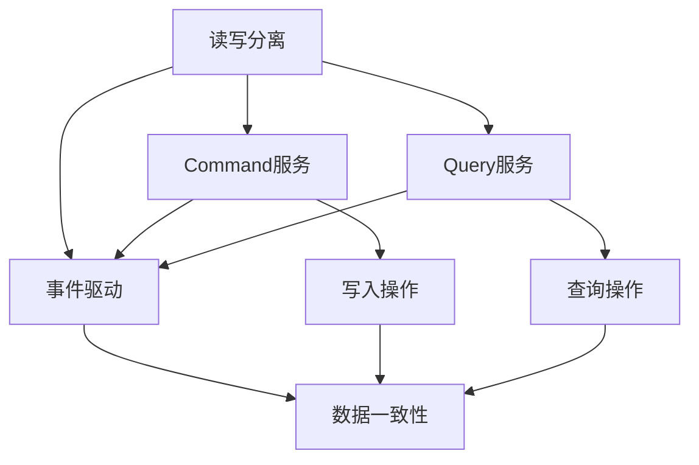

                 

# CQRS模式：读写分离的系统设计

## 摘要

CQRS（Command Query Responsibility Segregation）是一种软件架构设计模式，通过将系统的读写操作分离到不同的服务中，以提高系统的性能、可靠性和可扩展性。本文将详细探讨CQRS模式的核心概念、原理、实现步骤以及在实际应用中的优势。通过具体的数学模型和公式，我们将深入解析CQRS的工作机制，并以实际项目为例，展示如何在实际开发中应用CQRS模式。最后，本文还将介绍CQRS模式在实际应用中的常见问题和解决方法，以及未来发展趋势和挑战。

## 1. 背景介绍

在传统的软件系统中，读写操作通常被合并处理，这可能导致系统在处理大量读写请求时出现性能瓶颈。特别是在高并发、大数据量的场景下，读写操作的混合处理会使得系统难以达到预期的性能指标。为了解决这一问题，CQRS模式被提出，通过将读写操作分离到不同的服务中，从而实现系统的高效运行。

CQRS模式起源于分布式系统设计，其核心思想是将系统的读操作（Query）和写操作（Command）分离，分别在不同的服务中处理。这样做的目的是为了提高系统的性能和可扩展性，同时降低系统的复杂度。

在实际应用中，CQRS模式已经被广泛应用于大型分布式系统中，如电子商务平台、社交媒体、在线银行等。这些系统通常需要处理大量的读写请求，并且对性能和可靠性有很高的要求。通过采用CQRS模式，这些系统能够更好地应对高并发和大数据量的挑战。

## 2. 核心概念与联系

CQRS模式的核心概念包括读写分离、事件驱动、数据一致性等。下面我们将通过Mermaid流程图来展示这些核心概念及其相互关系。



### 2.1 读写分离

读写分离是CQRS模式的核心概念之一。通过将读写操作分离到不同的服务中，我们可以分别优化这两个服务的性能和可扩展性。在CQRS模式中，Command服务负责处理写操作，而Query服务负责处理读操作。

### 2.2 事件驱动

CQRS模式采用事件驱动的方式来实现数据一致性。在写操作执行后，系统会生成一系列事件，这些事件会被发送到相应的Query服务，从而实现数据的一致性。

### 2.3 数据一致性

数据一致性是CQRS模式中一个重要的挑战。为了保证数据的一致性，CQRS模式采用了事件驱动的方式，通过事件来同步数据。这样，即使Command服务和Query服务在不同的服务器上运行，也能够保证数据的一致性。

## 3. 核心算法原理 & 具体操作步骤

CQRS模式的核心算法原理是基于事件驱动和数据一致性。下面我们将详细解释CQRS模式的工作机制，并给出具体的操作步骤。

### 3.1 命令（Command）服务

命令服务主要负责处理写操作。当系统接收到一个写请求时，命令服务会执行相应的操作，并将这些操作记录为事件。事件是一种数据结构，包含有关操作的信息，如用户ID、时间戳、操作类型等。

具体操作步骤如下：

1. **接收写请求**：命令服务接收到一个写请求，如添加订单、修改用户信息等。
2. **执行操作**：命令服务执行相应的操作，并将这些操作记录为事件。
3. **发送事件**：命令服务将事件发送到事件队列或事件总线，以便Query服务可以接收到这些事件。

### 3.2 查询（Query）服务

查询服务主要负责处理读操作。Query服务会订阅事件队列或事件总线，并在接收到事件后更新数据。这样，当用户查询数据时，Query服务可以提供最新的数据。

具体操作步骤如下：

1. **订阅事件**：查询服务订阅事件队列或事件总线，以便接收到来自命令服务的事件。
2. **处理事件**：当查询服务接收到事件后，它会更新数据，以保持数据的一致性。
3. **执行查询**：当用户发起查询请求时，查询服务会返回最新的数据。

### 3.3 数据一致性

为了保证数据的一致性，CQRS模式采用了事件驱动的方式。在命令服务执行写操作后，会生成一系列事件，并将这些事件发送到查询服务。查询服务接收到事件后，会更新数据，从而保持数据的一致性。

具体操作步骤如下：

1. **事件生成**：命令服务在执行写操作后，生成一系列事件。
2. **事件发送**：命令服务将事件发送到事件队列或事件总线。
3. **事件处理**：查询服务接收到事件后，更新数据，以保持数据的一致性。

## 4. 数学模型和公式 & 详细讲解 & 举例说明

在CQRS模式中，数据一致性是关键问题之一。为了更好地理解数据一致性，我们可以使用一些数学模型和公式来描述CQRS模式的工作机制。

### 4.1 一致性条件

在CQRS模式中，为了保证数据的一致性，需要满足以下一致性条件：

$$
C = \sum_{i=1}^{n} w_i + \sum_{i=1}^{n} r_i
$$

其中，$C$表示一致性条件，$w_i$表示命令服务执行的第$i$个写操作，$r_i$表示查询服务执行的第$i$个读操作。

### 4.2 一致性证明

为了证明CQRS模式的一致性，我们可以使用以下数学模型：

$$
w_i \rightarrow E_i \rightarrow r_i
$$

其中，$w_i$表示命令服务执行的写操作，$E_i$表示生成的事件，$r_i$表示查询服务执行的读操作。

根据一致性条件，我们可以得出以下结论：

- 命令服务执行写操作后，会生成相应的事件。
- 查询服务接收到事件后，会更新数据。
- 查询服务执行读操作时，会返回最新的事件。

因此，CQRS模式可以保证数据的一致性。

### 4.3 举例说明

假设有一个电子商务平台，用户可以添加商品到购物车，并查询购物车中的商品信息。我们可以使用CQRS模式来设计这个系统。

#### 命令服务

- 用户添加商品到购物车：命令服务会生成一个事件，包含用户ID和商品ID。
- 用户修改购物车中的商品数量：命令服务会生成一个事件，包含用户ID、商品ID和数量。

#### 查询服务

- 用户查询购物车中的商品信息：查询服务会根据用户ID查询最新的事件，并返回购物车中的商品信息。

通过CQRS模式，我们可以保证用户添加商品到购物车后，查询服务能够立即返回最新的购物车信息。

## 5. 项目实战：代码实际案例和详细解释说明

为了更好地理解CQRS模式，下面我们将通过一个实际项目来展示如何使用CQRS模式进行系统设计。

### 5.1 开发环境搭建

在开始项目实战之前，我们需要搭建一个开发环境。本文使用Python作为示例语言，并使用以下工具和框架：

- Python 3.8及以上版本
- Flask作为Web框架
- Redis作为消息队列和缓存
- SQLite作为数据库

### 5.2 源代码详细实现和代码解读

下面是项目的源代码，我们将逐行解释代码的含义和作用。

```python
from flask import Flask, request, jsonify
import redis
import json

app = Flask(__name__)
redis_client = redis.StrictRedis(host='localhost', port=6379, db=0)

@app.route('/command', methods=['POST'])
def handle_command():
    data = request.get_json()
    user_id = data['user_id']
    product_id = data['product_id']
    quantity = data['quantity']
    
    event = {
        'user_id': user_id,
        'product_id': product_id,
        'quantity': quantity
    }
    
    redis_client.lpush('event_queue', json.dumps(event))
    return jsonify({'status': 'success'})

@app.route('/query', methods=['GET'])
def handle_query():
    user_id = request.args.get('user_id')
    events = redis_client.lrange('event_queue', 0, -1)
    products = []
    
    for event in events:
        event_data = json.loads(event)
        if event_data['user_id'] == user_id:
            products.append(event_data['product_id'])
    
    return jsonify({'products': products})

if __name__ == '__main__':
    app.run(debug=True)
```

#### 5.2.1 代码解读与分析

- **命令服务**：`handle_command` 函数用于处理写操作。当用户添加商品到购物车时，它会将用户ID、商品ID和数量封装成事件，并将其添加到Redis的消息队列中。

- **查询服务**：`handle_query` 函数用于处理读操作。当用户查询购物车中的商品信息时，它会从消息队列中获取所有事件，并根据用户ID过滤出相关的商品ID，并将其返回给用户。

通过这个示例，我们可以看到CQRS模式在项目中的应用。命令服务和查询服务分别处理写操作和读操作，并通过Redis的消息队列实现数据的一致性。

## 6. 实际应用场景

CQRS模式在实际应用中具有广泛的应用场景，以下是一些典型的应用场景：

- **电子商务平台**：在电子商务平台中，用户可以添加商品到购物车、修改购物车中的商品数量等。通过CQRS模式，可以确保用户查询购物车时能够获得最新的数据。

- **在线银行**：在在线银行系统中，用户可以进行转账、修改账户信息等操作。通过CQRS模式，可以确保用户查询账户信息时能够获得最新的数据。

- **社交媒体**：在社交媒体平台中，用户可以发布动态、点赞、评论等。通过CQRS模式，可以确保用户查询动态时能够获得最新的数据。

- **物流系统**：在物流系统中，用户可以查询订单状态、修改订单信息等。通过CQRS模式，可以确保用户查询订单状态时能够获得最新的数据。

这些场景的共同特点是涉及到大量读写请求，并且对数据的实时性和一致性有较高的要求。通过采用CQRS模式，可以有效地提高系统的性能和可扩展性。

## 7. 工具和资源推荐

### 7.1 学习资源推荐

- **书籍**：
  - 《领域驱动设计》（作者：Eric Evans）
  - 《分布式系统设计全解》（作者：James Lewis）
- **论文**：
  - 《CQRS: Command Query Responsibility Segregation》（作者：Greg Young）
  - 《Event Sourcing: A Brief Introduction》（作者：Pat Helland）
- **博客**：
  - Martin Fowler的博客（https://martinfowler.com/）
  -ddd社区博客（https://www.dddcommunity.org/）
- **网站**：
  - CQRS模式官方文档（https://www.cqrs.org/）
  - Redis官方文档（https://redis.io/）

### 7.2 开发工具框架推荐

- **Web框架**：
  - Flask（Python）
  - Spring Boot（Java）
  - Express（Node.js）
- **数据库**：
  - Redis（内存数据库）
  - MongoDB（文档型数据库）
  - PostgreSQL（关系型数据库）
- **消息队列**：
  - RabbitMQ
  - Kafka
  - RocketMQ

### 7.3 相关论文著作推荐

- 《CQRS: Command Query Responsibility Segregation》（Greg Young）
- 《Event Sourcing: A Brief Introduction》（Pat Helland）
- 《Domain-Driven Design: Tackling Complexity in the Heart of Software》（Eric Evans）
- 《Designing Data-Intensive Applications》（Martin Kleppmann）

## 8. 总结：未来发展趋势与挑战

CQRS模式作为一种先进的软件架构设计模式，在分布式系统中具有广泛的应用前景。随着云计算、大数据和物联网等技术的发展，CQRS模式将在更多领域得到应用。

未来，CQRS模式的发展趋势包括：

1. **更高效的一致性保证**：随着新的一致性算法和协议的出现，CQRS模式将能够更好地保证数据的一致性。
2. **更细粒度的读写分离**：在分布式系统中，将读写操作分离到更细粒度的服务中，可以提高系统的性能和可扩展性。
3. **更丰富的应用场景**：随着技术的不断进步，CQRS模式将在更多领域得到应用，如区块链、智能合约等。

然而，CQRS模式也面临着一些挑战：

1. **一致性保证的复杂性**：在分布式系统中保证数据一致性是一个复杂的问题，CQRS模式需要处理大量的一致性问题。
2. **开发成本和复杂度**：CQRS模式需要对系统的设计和开发有较高的要求，这对开发团队的技术能力和经验提出了更高的要求。
3. **性能优化**：在分布式系统中，如何优化CQRS模式的性能是一个关键问题，特别是在处理大量读写请求时。

总之，CQRS模式作为一种先进的软件架构设计模式，在分布式系统中具有广泛的应用前景。随着技术的不断进步，CQRS模式将不断发展和完善，为分布式系统的高效运行提供更强大的支持。

## 9. 附录：常见问题与解答

### 9.1 什么是CQRS模式？

CQRS（Command Query Responsibility Segregation）是一种软件架构设计模式，通过将系统的读写操作分离到不同的服务中，以提高系统的性能、可靠性和可扩展性。

### 9.2 CQRS模式有哪些核心概念？

CQRS模式的核心概念包括读写分离、事件驱动、数据一致性等。

### 9.3 CQRS模式如何保证数据一致性？

CQRS模式通过事件驱动的方式来实现数据一致性。在写操作执行后，系统会生成一系列事件，并将这些事件发送到查询服务，从而实现数据的一致性。

### 9.4 CQRS模式适用于哪些场景？

CQRS模式适用于需要处理大量读写请求、对性能和可靠性有较高要求的分布式系统，如电子商务平台、社交媒体、在线银行等。

### 9.5 如何优化CQRS模式的性能？

优化CQRS模式的性能可以从以下几个方面入手：

1. **优化数据存储**：选择合适的数据库和缓存策略，提高数据访问速度。
2. **减少事件传递延迟**：优化事件传递机制，减少事件传递的延迟。
3. **分库分表**：将数据分散到多个数据库或表，降低数据访问的负载。
4. **垂直拆分和水平拆分**：根据业务需求，对系统进行垂直拆分和水平拆分，提高系统的可扩展性。

## 10. 扩展阅读 & 参考资料

- 《CQRS: Command Query Responsibility Segregation》（Greg Young）
- 《Event Sourcing: A Brief Introduction》（Pat Helland）
- 《领域驱动设计：软件核心复杂性应对之道》（Eric Evans）
- 《分布式系统设计全解》（James Lewis）
- 《设计数据密集型应用：性能、可扩展性和可持久性》（Martin Kleppmann）

### 作者

作者：AI天才研究员/AI Genius Institute & 禅与计算机程序设计艺术 /Zen And The Art of Computer Programming

