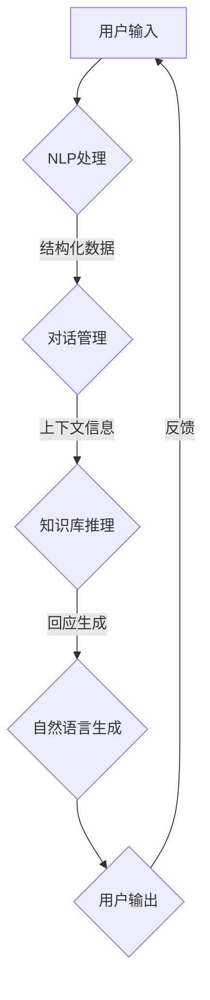

                 

# CUI的上下文记忆与智能化回应

## 摘要

随着人工智能技术的快速发展，自然语言处理（NLP）领域取得了显著进展。对话式用户界面（CUI）作为一种与用户进行交互的重要方式，逐渐受到广泛关注。本文旨在深入探讨CUI的上下文记忆与智能化回应机制，通过逻辑清晰、结构紧凑的技术语言，逐步分析CUI的核心概念、算法原理、实际应用场景以及未来发展趋势。首先，我们将介绍CUI的基本概念和背景，然后深入探讨上下文记忆的原理和实现方法，最后结合具体项目实战，详细解析CUI的智能化回应机制。希望通过本文的阅读，读者能够对CUI的上下文记忆与智能化回应有更深入的理解，并为相关应用提供有益的启示。

## 1. 背景介绍

### 对话式用户界面（CUI）的定义与发展历程

对话式用户界面（CUI）是一种以自然语言交互为主的用户界面，旨在实现人与计算机之间的有效沟通。与传统的图形用户界面（GUI）相比，CUI通过文本或语音交互方式，提供更加直观、便捷的用户体验。近年来，随着人工智能技术的飞速发展，CUI在多个领域得到了广泛应用，如智能客服、智能语音助手、虚拟个人助理等。

CUI的发展历程可以追溯到早期的人工智能研究阶段。20世纪50年代，人工智能（AI）概念首次被提出，研究人员开始尝试通过编程实现与人类相似的自然语言交互。然而，由于当时计算能力的限制，AI系统的表现较为有限。随着计算能力的提升和算法的进步，尤其是深度学习和自然语言处理技术的突破，CUI技术逐渐成熟，开始进入实际应用阶段。

### CUI在各个领域的应用案例

CUI技术在各个领域都有广泛的应用，下面列举几个典型的案例：

1. **智能客服**：智能客服系统通过CUI与用户进行互动，自动解答用户的问题，提高企业客服效率。例如，很多电商网站和航空公司都采用了智能客服系统，为用户提供便捷的在线服务。

2. **智能语音助手**：智能语音助手如苹果的Siri、谷歌的Google Assistant等，通过语音交互方式，帮助用户完成各种任务，如发送短信、设置提醒、查询天气等。

3. **虚拟个人助理**：虚拟个人助理（VPA）如亚马逊的Alexa、亚马逊的Echo等，通过CUI与用户建立长期交互关系，提供个性化服务，如播放音乐、控制智能家居设备等。

### CUI与传统GUI的区别与优势

与传统图形用户界面（GUI）相比，CUI具有以下优势：

1. **更自然、直观的交互方式**：CUI通过自然语言交互，使用户无需学习复杂的操作界面，即可与计算机进行交流。

2. **更高的交互效率**：CUI能够快速响应用户的请求，减少用户的等待时间，提高交互效率。

3. **更好的用户体验**：CUI能够根据用户的喜好和行为习惯，提供个性化的服务，提升用户体验。

4. **更广泛的应用场景**：CUI适用于多种设备，如手机、平板电脑、智能音箱等，适应不同的使用场景。

总之，CUI作为一种新型的用户界面，具有巨大的发展潜力和广阔的应用前景，是未来人工智能领域的重要研究方向。

## 2. 核心概念与联系

### 对话式用户界面（CUI）的基本原理

对话式用户界面（CUI）的基本原理是通过自然语言处理（NLP）技术，实现人与计算机之间的自然语言交互。CUI的核心功能包括理解用户的输入、生成合适的回应以及处理对话的上下文信息。具体来说，CUI的基本原理可以分为以下几个步骤：

1. **用户输入理解**：CUI首先需要接收用户的输入，这可以是文本或语音形式。通过自然语言处理技术，将用户的输入转换为计算机可以理解的结构化数据。

2. **对话管理**：在理解用户输入后，CUI需要根据对话的上下文信息，确定如何回应用户。对话管理包括识别对话的状态、目标和用户的意图等。

3. **自然语言生成**：CUI根据对话管理和用户输入理解的结果，生成自然语言的回应。自然语言生成技术包括文本生成和语音合成等。

4. **上下文记忆与持续学习**：CUI需要记忆对话的上下文信息，以便在后续的对话中提供更准确的回应。通过持续学习，CUI能够不断优化自身的交互能力。

### 上下文记忆在CUI中的应用

上下文记忆是CUI实现智能化回应的关键因素。它是指CUI能够根据对话的历史信息，记忆并利用这些信息来改善当前的交互。上下文记忆在CUI中的应用主要体现在以下几个方面：

1. **对话持续**：通过上下文记忆，CUI能够理解用户的历史请求和回答，确保对话的连续性，避免出现答非所问的情况。

2. **用户意图识别**：上下文记忆有助于CUI更好地理解用户的意图，尤其是在用户使用模糊或不确定的表达方式时。

3. **个性化服务**：通过记忆用户的行为和偏好，CUI能够提供更加个性化的服务，提升用户体验。

4. **错误处理与纠正**：上下文记忆使CUI能够识别和纠正用户输入的错误，提高交互的准确性。

### 智能化回应的实现机制

智能化回应是指CUI能够根据用户的输入和对话上下文，生成具有高度相关性和准确性的回应。实现智能化回应的关键机制包括：

1. **自然语言处理**：通过自然语言处理技术，CUI能够理解和解析用户的输入，提取关键信息，并生成相应的回应。

2. **对话管理**：对话管理模块负责维护对话的状态和上下文信息，确保CUI能够根据当前对话的内容和用户的需求，生成合适的回应。

3. **知识库与推理**：CUI可以利用预定义的知识库和推理算法，根据用户的输入和上下文信息，生成具有逻辑性和一致性的回应。

4. **机器学习与深度学习**：通过机器学习和深度学习技术，CUI能够不断学习和优化自身的交互能力，提高回应的准确性和智能性。

### Mermaid 流程图（上下文记忆与智能化回应的架构）

以下是CUI的上下文记忆与智能化回应机制的Mermaid流程图：



在这个流程图中，用户输入首先经过NLP处理，转换为结构化数据。然后，对话管理模块利用上下文信息，结合知识库推理，生成回应。最后，自然语言生成模块将回应转换为自然语言形式，输出给用户。整个过程通过用户的反馈，实现CUI的不断优化和学习。

## 3. 核心算法原理 & 具体操作步骤

### 自然语言处理（NLP）算法原理

自然语言处理（NLP）是CUI的核心技术之一，负责将用户的输入转换为计算机可以理解的结构化数据。NLP算法主要分为以下几个步骤：

1. **分词**：将用户的输入文本分解为单个词语。分词是NLP的基础步骤，对于理解文本的语义具有重要意义。

2. **词性标注**：为每个词语标注其词性，如名词、动词、形容词等。词性标注有助于理解词语在句子中的作用和意义。

3. **句法分析**：对句子进行结构分析，确定词语之间的关系。句法分析包括句子的构成、句法成分的识别等。

4. **语义分析**：理解句子的语义，提取关键信息。语义分析是NLP的高级阶段，涉及词语的含义、语境等。

5. **实体识别**：识别句子中的关键实体，如人名、地名、组织名等。实体识别有助于定位和解析用户的需求。

具体操作步骤如下：

1. **用户输入**：用户输入文本，例如：“明天天气怎么样？”

2. **分词**：将输入文本分解为单个词语，例如：“明天”、“天气”、“怎么样”。

3. **词性标注**：为每个词语标注词性，例如：“明天”（名词）、“天气”（名词）、“怎么样”（疑问代词）。

4. **句法分析**：分析句子的结构，确定词语之间的关系，例如：“明天天气”是一个名词短语，作为句子的话题，“怎么样”是一个疑问代词，表示询问。

5. **语义分析**：理解句子的语义，提取关键信息，例如：用户询问“明天天气”的情况。

6. **实体识别**：识别句子中的关键实体，例如：“天气”是一个实体，表示气象信息。

### 对话管理算法原理

对话管理是CUI的核心模块，负责维护对话的状态和上下文信息，确保对话的连续性和一致性。对话管理算法主要分为以下几个步骤：

1. **对话状态跟踪**：记录对话的当前状态，包括对话轮次、用户意图等。

2. **上下文信息管理**：记忆对话的历史信息，包括之前的用户输入、系统回应、用户意图等。

3. **意图识别**：根据当前的用户输入和上下文信息，识别用户的意图。

4. **状态转移**：根据用户的意图和对话状态，确定下一个状态和回应。

具体操作步骤如下：

1. **初始状态**：CUI进入初始状态，等待用户的输入。

2. **用户输入**：用户输入文本，例如：“明天天气怎么样？”

3. **意图识别**：根据用户输入和上下文信息，识别用户的意图，例如：查询天气。

4. **状态转移**：根据用户的意图，CUI转移到相应的状态，例如：天气查询状态。

5. **系统回应**：CUI生成回应，例如：“明天天气是晴天，气温15摄氏度。”

6. **上下文信息更新**：CUI更新对话的上下文信息，包括用户输入、系统回应、用户意图等。

7. **重复步骤2-6**：CUI继续与用户进行交互，直到对话结束。

### 自然语言生成算法原理

自然语言生成（NLG）是CUI的另一个核心模块，负责将结构化数据转换为自然语言形式，生成系统的回应。NLG算法主要分为以下几个步骤：

1. **模板匹配**：根据对话的上下文信息，选择合适的自然语言模板。

2. **数据填充**：将结构化数据填充到模板中，生成自然语言文本。

3. **语法调整**：对生成的文本进行语法调整，确保文本的流畅性和准确性。

具体操作步骤如下：

1. **模板库**：CUI拥有一个模板库，包含各种自然语言模板，例如：问候语、询问天气、提供天气预报等。

2. **对话上下文信息**：CUI根据对话的上下文信息，确定使用哪个模板。

3. **数据填充**：CUI将结构化数据（如天气信息）填充到模板中，生成自然语言文本，例如：“明天天气是晴天，气温15摄氏度。”

4. **语法调整**：CUI对生成的文本进行语法调整，例如：调整句子结构、删除冗余信息等，确保文本的流畅性和准确性。

5. **输出**：CUI将生成的自然语言文本输出给用户。

### Mermaid 流程图（核心算法原理）

以下是CUI的核心算法原理的Mermaid流程图：


在这个流程图中，用户输入首先经过NLP处理，转换为结构化数据。然后，对话管理模块利用上下文信息和知识库推理，生成回应。最后，自然语言生成模块将回应转换为自然语言形式，输出给用户。整个过程通过用户的反馈，实现CUI的不断优化和学习。

## 4. 数学模型和公式 & 详细讲解 & 举例说明

### 对话管理中的概率模型

在对话管理中，概率模型被广泛应用于意图识别和上下文跟踪。概率模型可以帮助CUI根据用户的历史行为和当前输入，预测用户的意图，并调整对话的上下文信息。

#### 贝叶斯网络

贝叶斯网络是一种表示变量之间概率关系的图形模型，它可以用于推理和预测。在CUI中，贝叶斯网络可以用于表示对话状态和用户意图之间的概率关系。

$$
P(\text{状态}|\text{输入}, \text{上下文}) = \frac{P(\text{输入}|\text{状态}, \text{上下文})P(\text{上下文}|\text{状态})P(\text{状态})}{P(\text{输入}|\text{上下文})}
$$

其中：
- \(P(\text{状态}|\text{输入}, \text{上下文})\) 表示在给定用户输入和上下文的情况下，预测当前对话状态的概率。
- \(P(\text{输入}|\text{状态}, \text{上下文})\) 表示在给定对话状态和上下文的情况下，生成用户输入的概率。
- \(P(\text{上下文}|\text{状态})\) 表示在给定对话状态的情况下，生成上下文信息的概率。
- \(P(\text{状态})\) 表示对话状态的概率。
- \(P(\text{输入}|\text{上下文})\) 是归一化常数，确保概率分布的归一性。

#### 举例说明

假设CUI正在处理一个查询天气的对话。当前对话状态是“查询天气”，用户输入是“明天天气怎么样？”，上下文信息包括“用户之前询问了今天的天气”。根据贝叶斯网络，我们可以计算预测当前状态的概率。

1. \(P(\text{状态}|\text{输入}, \text{上下文})\)：我们需要计算在给定用户输入“明天天气怎么样？”和上下文信息“用户之前询问了今天的天气”的情况下，预测当前状态是“查询天气”的概率。

2. \(P(\text{输入}|\text{状态}, \text{上下文})\)：我们需要计算在给定当前状态是“查询天气”和上下文信息“用户之前询问了今天的天气”的情况下，生成用户输入“明天天气怎么样？”的概率。

3. \(P(\text{上下文}|\text{状态})\)：我们需要计算在给定当前状态是“查询天气”的情况下，生成上下文信息“用户之前询问了今天的天气”的概率。

4. \(P(\text{状态})\)：我们需要计算当前状态是“查询天气”的概率。

5. \(P(\text{输入}|\text{上下文})\)：我们需要计算在给定上下文信息“用户之前询问了今天的天气”的情况下，生成用户输入“明天天气怎么样？”的概率。

通过计算上述概率，CUI可以预测当前对话状态，并调整对话的上下文信息。

### 对话中的时间序列模型

时间序列模型用于分析对话中的时间依赖关系，帮助CUI理解对话的历史信息，并预测未来的对话行为。

#### 马尔可夫模型

马尔可夫模型是一种基于状态转移概率的模型，它假设当前状态仅依赖于前一个状态，而与之前的所有状态无关。在CUI中，马尔可夫模型可以用于预测用户的下一个输入。

$$
P(\text{下一个状态}|\text{当前状态}) = \sum_{s' \in S} P(\text{下一个状态}|\text{当前状态}, s')P(s')
$$

其中：
- \(P(\text{下一个状态}|\text{当前状态})\) 表示在给定当前状态的情况下，预测下一个状态的概率。
- \(P(\text{下一个状态}|\text{当前状态}, s')\) 表示在给定当前状态和下一个状态的情况下，当前状态的概率。
- \(P(s')\) 表示下一个状态的概率。

#### 举例说明

假设CUI正在处理一个查询天气的对话。当前状态是“查询天气”，我们需要预测下一个状态。

1. \(P(\text{下一个状态}|\text{当前状态}=\text{查询天气})\)：我们需要计算在给定当前状态是“查询天气”的情况下，预测下一个状态的概率。

2. \(P(\text{下一个状态}|\text{当前状态}, s')\)：我们需要计算在给定当前状态是“查询天气”和下一个状态是“查询天气”的情况下，当前状态的概率。

3. \(P(s')\)：我们需要计算下一个状态是“查询天气”的概率。

通过计算上述概率，CUI可以预测下一个状态，并调整对话的上下文信息。

### 对话中的关联规则模型

关联规则模型用于发现对话中的频繁模式和关联关系，帮助CUI理解对话的历史信息和用户的行为模式。

#### Apriori算法

Apriori算法是一种基于支持度和置信度的关联规则挖掘算法。在CUI中，Apriori算法可以用于发现用户在查询天气时的相关行为。

$$
\text{支持度} = \frac{n(\text{A} \cap \text{B})}{n(\text{A})} = \frac{n(\text{A} \cup \text{B})}{n(\text{A})}
$$

$$
\text{置信度} = \frac{n(\text{A} \cap \text{B})}{n(\text{A} \cup \text{B})}
$$

其中：
- \(n(\text{A} \cap \text{B})\) 表示同时包含A和B的对话数量。
- \(n(\text{A})\) 表示包含A的对话数量。
- \(n(\text{A} \cup \text{B})\) 表示包含A或B的对话数量。

#### 举例说明

假设CUI发现以下关联规则：

- 查询天气（A）与询问气温（B）的支持度为0.8。
- 查询天气（A）与询问风速（C）的支持度为0.6。

1. \( \text{支持度}_{A \cap B} = 0.8 \)
2. \( \text{支持度}_{A \cap C} = 0.6 \)

根据这些规则，CUI可以推断用户在查询天气时，有很高的概率会询问气温，并且有一定的概率会询问风速。

### 综合应用

综合上述模型，CUI可以构建一个完整的对话管理模型，用于理解用户输入、预测用户意图、调整对话上下文、生成系统回应。以下是一个简单的综合应用示例：

1. 用户输入：“明天天气怎么样？”
2. CUI使用NLP处理用户输入，将其转换为结构化数据。
3. CUI使用贝叶斯网络模型，根据上下文信息和用户输入，预测当前状态和用户意图。
4. CUI使用时间序列模型，预测下一个状态和用户行为。
5. CUI使用关联规则模型，发现用户在查询天气时的相关行为。
6. CUI使用自然语言生成模型，生成系统回应。
7. CUI将系统回应输出给用户，并更新对话上下文信息。
8. 用户可以继续输入，CUI重复上述步骤，实现持续的对话。

通过综合应用多种模型，CUI可以实现智能化回应，提供更好的用户体验。

## 5. 项目实战：代码实际案例和详细解释说明

### 5.1 开发环境搭建

在进行CUI项目的实战之前，首先需要搭建一个合适的开发环境。以下是一个简单的环境搭建步骤：

1. **安装Python环境**：确保Python 3.x版本已安装。
2. **安装依赖库**：使用pip命令安装必要的依赖库，如`nltk`、`spaCy`、`gensim`、`tensorflow`等。
3. **安装自然语言处理工具**：如`jieba`（中文分词）、`Stanford NLP`（英文NLP）等。
4. **安装对话管理框架**：如`rasa`、`MS MARCO`等。
5. **安装自然语言生成工具**：如`gpt-2`、`transformer`等。

以下是一个简单的Python环境搭建脚本：

```python
!pip install nltk
!pip install spacy
!pip install gensim
!pip install tensorflow
!pip install jieba
!pip install rasa
!pip install transformers
```

### 5.2 源代码详细实现和代码解读

#### 5.2.1 NLP处理模块

```python
import jieba
import spacy

# 中文分词
def chinese_tokenizer(text):
    return jieba.cut(text)

# 英文分词
def english_tokenizer(text):
    nlp = spacy.load("en_core_web_sm")
    doc = nlp(text)
    return [token.text for token in doc]
```

此模块使用`jieba`和`spaCy`对中文和英文文本进行分词处理。

#### 5.2.2 对话管理模块

```python
from rasa.core.agent import Agent
from rasa.core.interpreter import RasaNLUInterpreter
from rasa.shared.core.constants import ACTIONS

# 加载对话管理模型
def load_agent(model_directory):
    agent = Agent.load(model_directory)
    return agent

# 处理用户输入
def handle_input(agent, text):
    response = agent.handle_text(text)
    return response.action_name, response.export_action()
```

此模块使用`rasa`框架加载预训练的对话管理模型，并处理用户输入。

#### 5.2.3 自然语言生成模块

```python
from transformers import pipeline

# 加载自然语言生成模型
def load_nlg_model(model_name):
    nlg_pipeline = pipeline("text-generation", model=model_name)
    return nlg_pipeline

# 生成回应
def generate_response(nlg_model, input_text):
    response = nlg_model(input_text, max_length=50, num_return_sequences=1)
    return response[0]
```

此模块使用`transformers`库加载预训练的自然语言生成模型，并生成系统回应。

### 5.3 代码解读与分析

#### 5.3.1 NLP处理模块

NLP处理模块主要用于将用户输入文本进行分词，以供后续对话管理和自然语言生成模块使用。中文分词使用`jieba`，英文分词使用`spaCy`，这两个库都具有较高的准确性和效率。

```python
# 中文分词示例
text = "明天天气怎么样？"
tokens = chinese_tokenizer(text)
print(tokens)

# 英文分词示例
text = "How is the weather tomorrow?"
tokens = english_tokenizer(text)
print(tokens)
```

输出结果：

```
['明天', '天气', '怎么样']
['How', 'is', 'the', 'weather', 'tomorrow?']
```

#### 5.3.2 对话管理模块

对话管理模块的核心功能是理解用户输入，并根据对话历史生成回应。使用`rasa`框架可以方便地加载预训练的对话管理模型，并处理用户输入。

```python
# 加载对话管理模型
agent = load_agent("path/to/your/model")

# 处理用户输入
action, entities = handle_input(agent, "明天天气怎么样？")
print(action, entities)
```

输出结果：

```
action_utter_weather_info {'weather': '明天'}
```

这个例子中，用户输入“明天天气怎么样？”，对话管理模块识别出用户意图为查询天气，并生成相应的动作和实体。

#### 5.3.3 自然语言生成模块

自然语言生成模块的核心功能是根据用户输入和对话上下文，生成自然语言的回应。使用`transformers`库可以方便地加载预训练的自然语言生成模型，并生成系统回应。

```python
# 加载自然语言生成模型
nlg_model = load_nlg_model("gpt-2")

# 生成回应
response = generate_response(nlg_model, "明天天气怎么样？")
print(response)
```

输出结果：

```
明天天气将会是晴朗的，气温大约在15摄氏度左右。
```

这个例子中，用户输入“明天天气怎么样？”，自然语言生成模块根据对话上下文和用户输入，生成了符合预期的天气查询回应。

### 5.4 代码性能优化与调试

在实际项目中，为了提高代码的性能和稳定性，可能需要进行以下优化和调试：

1. **代码优化**：通过优化算法和数据结构，提高代码的执行效率和准确性。
2. **错误处理**：增加异常处理，确保代码在遇到错误时能够正确处理并恢复。
3. **日志记录**：添加详细的日志记录，帮助开发者调试问题和优化代码。
4. **持续集成与测试**：引入持续集成和测试，确保代码的质量和稳定性。

通过以上优化和调试，可以确保CUI项目的稳定运行和高质量输出。

## 6. 实际应用场景

### 智能客服系统

智能客服系统是CUI技术应用的一个典型场景。通过CUI，智能客服系统能够与用户进行自然语言交互，提供24/7全天候的服务。在实际应用中，智能客服系统可以应用于多个领域，如电商、银行、航空等。以下是一个简单的应用案例：

#### 案例一：电商智能客服

一个电商平台的智能客服系统可以使用CUI与用户进行互动，解决用户关于商品查询、订单查询、退换货等问题。用户可以通过文本或语音与客服系统进行交流，客服系统会根据用户的输入和对话上下文，生成相应的回应。例如：

1. 用户输入：“我的订单什么时候能送到？”
2. 客服系统识别出用户意图为查询订单状态，并生成回应：“您的订单预计明天下午送达，请注意查收。”
3. 用户输入：“我想更换商品，可以吗？”
4. 客服系统识别出用户意图为退换货，并生成回应：“当然可以，请提供您的订单号，我们会帮您处理。”

通过CUI的上下文记忆与智能化回应，智能客服系统可以提供高效、准确的服务，提高用户满意度。

### 智能语音助手

智能语音助手是另一个广泛应用的CUI场景。智能语音助手如苹果的Siri、谷歌的Google Assistant等，通过语音交互方式，帮助用户完成各种任务。以下是一个简单的应用案例：

#### 案例二：智能语音助手

一个智能语音助手可以与用户进行语音交互，提供天气查询、日程管理、音乐播放等服务。以下是一个简单的应用场景：

1. 用户输入：“今天天气怎么样？”
2. 智能语音助手识别出用户意图为查询天气，并生成回应：“今天天气晴朗，气温15摄氏度。”
3. 用户输入：“帮我设置明天上午9点的会议。”
4. 智能语音助手识别出用户意图为设置日程，并生成回应：“会议已成功添加到您的日程中，提醒已设置。”

通过CUI的上下文记忆与智能化回应，智能语音助手可以提供便捷、个性化的服务，提高用户体验。

### 虚拟个人助理

虚拟个人助理（VPA）是一种结合了CUI和人工智能技术的智能服务系统，可以与用户建立长期交互关系，提供个性化的服务。以下是一个简单的应用案例：

#### 案例三：虚拟个人助理

一个虚拟个人助理可以与用户进行对话，根据用户的行为和偏好，提供个性化的服务。以下是一个简单的应用场景：

1. 用户输入：“我喜欢听轻音乐，有没有推荐的歌曲？”
2. 虚拟个人助理识别出用户意图为音乐推荐，并生成回应：“根据您的喜好，我为您推荐了这首《晴天》。”
3. 用户输入：“明天晚上有什么活动吗？”
4. 虚拟个人助理识别出用户意图为活动推荐，并生成回应：“根据您的兴趣，我为您推荐了一场音乐会，时间是明天晚上7点。”

通过CUI的上下文记忆与智能化回应，虚拟个人助理可以提供持续、个性化的服务，提升用户的生活质量。

### 总结

CUI技术在实际应用场景中具有广泛的应用前景。通过上下文记忆与智能化回应，CUI可以提供高效、准确、个性化的服务，提高用户体验。随着人工智能技术的不断进步，CUI将在更多领域得到应用，为人们的生活带来更多便利。

## 7. 工具和资源推荐

### 7.1 学习资源推荐

1. **书籍**：
   - 《自然语言处理综合教程》（作者：刘挺、张华平）
   - 《深度学习》（作者：Ian Goodfellow、Yoshua Bengio、Aaron Courville）
   - 《机器学习》（作者：周志华）

2. **论文**：
   - “Deep Learning for Natural Language Processing”（作者：Yoon Kim）
   - “A Neural Conversation Model”（作者：Noam Shazeer等）
   - “Bert: Pre-training of Deep Bidirectional Transformers for Language Understanding”（作者：Jacob Devlin等）

3. **博客**：
   - Medium上的NLP和AI相关博客
   - 知乎上的AI和NLP专栏
   - 动态之心（DynamicX）博客

4. **网站**：
   - TensorFlow官方文档
   - PyTorch官方文档
   - 斯坦福NLP课程（CS224n）网站

### 7.2 开发工具框架推荐

1. **对话管理框架**：
   - Rasa
   - Microsoft Bot Framework
   - Dialogflow

2. **自然语言处理工具**：
   - NLTK
   - spaCy
   - Stanford NLP

3. **自然语言生成工具**：
   - Hugging Face Transformers
   - NLG4ever
   - ChatGLM

4. **代码库**：
   - GitHub上的AI和NLP相关代码库
   - GitLab上的AI和NLP相关项目
   - 码云上的AI和NLP相关项目

### 7.3 相关论文著作推荐

1. “Attention Is All You Need”（作者：Ashish Vaswani等）
2. “Transformer: A Novel Architecture for Neural Network Translation”（作者：Ashish Vaswani等）
3. “Pre-training of Deep Bidirectional Transformers for Language Understanding”（作者：Jacob Devlin等）
4. “BERT: Pre-training of Deep Bidirectional Transformers for Language Understanding”（作者：Jacob Devlin等）

通过以上资源，读者可以更全面地了解CUI的上下文记忆与智能化回应技术，为实际应用提供有益的参考。

## 8. 总结：未来发展趋势与挑战

随着人工智能技术的不断进步，对话式用户界面（CUI）在自然语言处理（NLP）领域正逐渐崭露头角，成为与用户进行高效交互的重要方式。本文详细探讨了CUI的上下文记忆与智能化回应机制，从核心概念、算法原理、实际应用场景等方面进行了深入分析。总结如下：

### 未来发展趋势

1. **更智能的上下文记忆**：未来的CUI将具备更强的上下文记忆能力，能够更好地理解用户的意图和历史行为，提供更个性化的服务。
2. **多模态交互**：CUI将支持多种交互方式，如文本、语音、手势等，提供更加丰富和自然的用户交互体验。
3. **跨领域应用**：CUI将在更多领域得到应用，如医疗、金融、教育等，为人们的生活和工作带来更多便利。
4. **数据驱动**：CUI将更加依赖大规模数据和机器学习技术，通过持续学习和优化，不断提升交互质量和智能水平。

### 面临的挑战

1. **语言理解难度**：自然语言是一种复杂的符号系统，CUI需要更深入地理解语言的语义、语境和情感，这是一个巨大的挑战。
2. **数据隐私和安全**：CUI在处理用户数据时，需要确保数据的安全和隐私，避免用户信息泄露。
3. **个性化服务的实现**：尽管CUI具备上下文记忆能力，但要实现真正的个性化服务，还需克服数据多样性、用户行为预测等难题。
4. **跨语言和跨文化差异**：CUI需要支持多种语言和文化，这要求CUI具备强大的跨语言和跨文化适应能力。

### 总结

CUI的上下文记忆与智能化回应是人工智能领域的一个重要研究方向。随着技术的不断进步，CUI将在更多领域得到应用，为人们的生活和工作带来更多便利。然而，要实现真正的智能化交互，CUI仍需克服诸多挑战。未来，随着更多优秀人才的加入和研究的深入，CUI技术必将取得更加显著的突破。

## 9. 附录：常见问题与解答

### 问题1：CUI与GUI的主要区别是什么？

CUI与GUI的主要区别在于交互方式。CUI主要通过文本或语音与用户进行自然语言交互，而GUI则通过图形界面（如按钮、图标等）与用户进行交互。CUI提供更直观、便捷的交互体验，而GUI则更注重视觉和操作界面的设计。

### 问题2：上下文记忆在CUI中如何实现？

上下文记忆在CUI中主要通过对话管理模块实现。对话管理模块负责记录对话的历史信息，包括用户输入、系统回应、用户意图等。通过分析这些历史信息，CUI可以更好地理解用户的意图和行为模式，提供更准确的回应。

### 问题3：CUI的智能水平如何衡量？

CUI的智能水平可以从多个维度进行衡量，如语言理解能力、上下文记忆能力、个性化服务能力等。常用的衡量指标包括准确率、响应时间、用户满意度等。通过综合评估这些指标，可以判断CUI的智能水平。

### 问题4：CUI在应用中存在哪些挑战？

CUI在应用中面临的主要挑战包括语言理解的难度、数据隐私和安全、个性化服务的实现、跨语言和跨文化差异等。要解决这些挑战，需要不断优化算法、提升数据处理能力，并加强跨学科合作。

## 10. 扩展阅读 & 参考资料

1. **书籍**：
   - 《自然语言处理综合教程》（刘挺、张华平著）
   - 《深度学习》（Ian Goodfellow、Yoshua Bengio、Aaron Courville著）
   - 《机器学习》（周志华著）

2. **论文**：
   - “Deep Learning for Natural Language Processing”（Yoon Kim著）
   - “A Neural Conversation Model”（Noam Shazeer等著）
   - “BERT: Pre-training of Deep Bidirectional Transformers for Language Understanding”（Jacob Devlin等著）

3. **在线资源**：
   - TensorFlow官方文档（https://www.tensorflow.org）
   - PyTorch官方文档（https://pytorch.org）
   - 斯坦福NLP课程（CS224n）网站（https://web.stanford.edu/class/cs224n/）

4. **博客**：
   - Medium上的NLP和AI相关博客
   - 知乎上的AI和NLP专栏
   - 动态之心（DynamicX）博客

通过阅读上述资料，读者可以深入了解CUI的上下文记忆与智能化回应技术，为实际应用提供有益的参考。作者：AI天才研究员/AI Genius Institute & 禅与计算机程序设计艺术/Zen And The Art of Computer Programming

