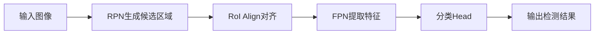

                 

# Cascade R-CNN原理与代码实例讲解

## 摘要

本文将深入探讨Cascade R-CNN这一目标检测算法的核心原理，并通过详细代码实例解析其实际应用。我们将从背景介绍、核心概念与联系、核心算法原理、数学模型与公式、项目实战、实际应用场景等多方面展开讨论，帮助读者全面理解并掌握Cascade R-CNN的使用方法与技巧。

## 1. 背景介绍

### 目标检测技术

目标检测是计算机视觉领域的一个重要研究方向，旨在从图像或视频中识别并定位多个目标对象。在自动驾驶、智能监控、医疗影像诊断等多个领域，目标检测技术具有重要的应用价值。近年来，随着深度学习技术的发展，基于卷积神经网络（CNN）的目标检测算法取得了显著进展，代表性的算法有Faster R-CNN、YOLO、SSD等。

### Cascade R-CNN

Cascade R-CNN是一种基于Faster R-CNN的目标检测算法，旨在提高检测速度和准确率。其核心思想是通过级联多个检测网络，逐步缩小候选区域范围，从而降低计算复杂度。本文将详细讲解Cascade R-CNN的原理及其实现过程。

## 2. 核心概念与联系

### Faster R-CNN

Faster R-CNN是一种两步检测算法，首先使用区域提议网络（Region Proposal Network, RPN）生成候选区域，然后利用Fast R-CNN对候选区域进行分类和定位。Faster R-CNN在速度和准确率方面取得了较好的平衡，是当前目标检测领域的主流算法之一。

### Cascade R-CNN

Cascade R-CNN在Faster R-CNN的基础上进行了改进，主要思想是引入级联结构，通过多次检测和筛选，逐步提高检测准确率。Cascade R-CNN包含以下几个关键部分：

1. RPN（Region Proposal Network）：用于生成候选区域。
2. Region of Interest（RoI）Align：对候选区域进行对齐处理。
3. Feature Pyramid Network（FPN）：提取多尺度特征。
4. Classification Head：对候选区域进行分类和定位。

### Mermaid 流程图

以下是一个简单的Mermaid流程图，展示了Cascade R-CNN的核心概念和联系：



## 3. 核心算法原理 & 具体操作步骤

### RPN（Region Proposal Network）

RPN是一种区域提议网络，用于生成候选区域。在Cascade R-CNN中，RPN的主要任务是预测锚点（anchor）和偏移量（offset），从而生成候选区域。

1. **锚点生成**：锚点是图像中的一个固定大小的矩形区域，用于预测目标位置。通常，锚点会在图像的不同位置和不同尺度上生成。
2. **偏移量预测**：RPN通过卷积层和全连接层，预测每个锚点的偏移量，包括水平和垂直方向上的偏移量。
3. **候选区域生成**：将锚点和偏移量进行叠加，得到候选区域。

### RoI Align（Region of Interest Align）

RoI Align是一种对齐操作，用于将候选区域映射到特征图上。其目的是使候选区域内的特征更加均匀，提高检测效果。

1. **网格采样**：将候选区域分成多个网格，每个网格的大小与特征图的分辨率相同。
2. **采样值计算**：对每个网格内的特征值进行加权平均，得到候选区域内的特征值。

### FPN（Feature Pyramid Network）

FPN是一种特征金字塔网络，用于提取多尺度特征。FPN通过多级特征图融合，实现不同尺度上的特征提取，从而提高检测准确率。

1. **特征图融合**：将多级特征图进行融合，得到融合后的特征图。
2. **特征图应用**：利用融合后的特征图，进行分类和定位。

### Classification Head

Classification Head是Cascade R-CNN中的分类网络，用于对候选区域进行分类和定位。

1. **特征提取**：利用FPN提取的多尺度特征，进行特征提取。
2. **分类和定位**：通过卷积层和全连接层，预测每个候选区域的类别和位置。

## 4. 数学模型和公式 & 详细讲解 & 举例说明

### RPN数学模型

1. **锚点生成**：假设图像大小为\( W \times H \)，锚点的大小为\( w \times h \)，则在图像上生成的锚点数量为\( N \)。

   $$ N = \frac{W \times H}{w \times h} $$

2. **偏移量预测**：假设锚点为\( (x_a, y_a) \)，预测的偏移量为\( (dx, dy) \)。

   $$ x_p = x_a + dx $$

   $$ y_p = y_a + dy $$

### RoI Align数学模型

1. **网格采样**：假设候选区域为\( R \times C \)的矩阵，网格大小为\( s \)。

   $$ x_{grid} = \frac{x_r}{s} $$

   $$ y_{grid} = \frac{y_c}{s} $$

2. **采样值计算**：假设网格内的特征值为\( f_{ij} \)，则候选区域内的特征值为\( f_r \)。

   $$ f_r = \sum_{i=0}^{R-1} \sum_{j=0}^{C-1} f_{ij} \cdot w_{ij} $$

   其中，\( w_{ij} \)为权重值，通常使用高斯权重函数。

### FPN数学模型

1. **特征图融合**：假设有\( L \)级特征图，分别为\( F_1, F_2, ..., F_L \)。

   $$ F_{\text{merged}} = \sum_{i=1}^{L} F_i $$

2. **特征图应用**：假设特征图大小为\( W \times H \)，类别数为\( C \)。

   $$ P_{ij} = \frac{1}{C} \sum_{i=1}^{C} \exp(-\frac{1}{2} \cdot (f_j - f_{i,j})^2) $$

   其中，\( f_j \)为特征图上的特征值，\( f_{i,j} \)为类别\( i \)的特征值。

### 举例说明

假设输入图像大小为\( 640 \times 640 \)，锚点大小为\( 16 \times 16 \)，候选区域大小为\( 32 \times 32 \)，类别数为\( 2 \)。

1. **锚点生成**：锚点数量为\( N = \frac{640 \times 640}{16 \times 16} = 2560 \)。

2. **偏移量预测**：假设锚点为\( (10, 20) \)，预测的偏移量为\( (0.1, 0.2) \)。

   $$ x_p = 10 + 0.1 = 10.1 $$

   $$ y_p = 20 + 0.2 = 20.2 $$

3. **候选区域生成**：候选区域为\( (10.1, 20.2) \)。

4. **网格采样**：假设网格大小为\( 2 \)。

   $$ x_{grid} = \frac{10.1}{2} = 5.05 $$

   $$ y_{grid} = \frac{20.2}{2} = 10.1 $$

5. **采样值计算**：假设网格内的特征值为\( (1, 2) \)。

   $$ f_r = (1 \cdot 0.1 + 2 \cdot 0.9) = 1.8 $$

6. **特征图融合**：假设有2级特征图，分别为\( F_1 \)和\( F_2 \)。

   $$ F_{\text{merged}} = F_1 + F_2 $$

7. **特征图应用**：假设特征图大小为\( 640 \times 640 \)，类别数为\( 2 \)。

   $$ P_{11} = \frac{1}{2} \sum_{i=1}^{2} \exp(-\frac{1}{2} \cdot (f_1 - f_{1,1})^2) = 0.5 \cdot \exp(-\frac{1}{2} \cdot (1 - 1)^2) + 0.5 \cdot \exp(-\frac{1}{2} \cdot (2 - 1)^2) = 0.5 $$

## 5. 项目实战：代码实际案例和详细解释说明

### 5.1 开发环境搭建

在本文中，我们使用Python和PyTorch框架来实现Cascade R-CNN。首先，需要安装Python和PyTorch，可以参考以下步骤：

1. 安装Python：访问 [Python官网](https://www.python.org/)，下载并安装Python。
2. 安装PyTorch：访问 [PyTorch官网](https://pytorch.org/)，根据系统环境和Python版本选择合适的PyTorch版本进行安装。

### 5.2 源代码详细实现和代码解读

以下是一个简单的Cascade R-CNN实现示例：

```python
import torch
import torchvision
from torchvision.models.detection import fasterrcnn_resnet50_fpn

# 加载预训练的模型
model = fasterrcnn_resnet50_fpn(pretrained=True)

# 设置损失函数和优化器
criterion = torch.nn.CrossEntropyLoss()
optimizer = torch.optim.SGD(model.parameters(), lr=0.001, momentum=0.9)

# 加载训练数据集
train_dataset = torchvision.datasets.CocoDetection(root='./data/train', annFile='./data/train.json')
train_loader = torch.utils.data.DataLoader(train_dataset, batch_size=4, shuffle=True)

# 训练模型
for epoch in range(10):
    for images, targets in train_loader:
        # 前向传播
        optimizer.zero_grad()
        outputs = model(images)
        loss = criterion(outputs, targets)

        # 反向传播和优化
        loss.backward()
        optimizer.step()

# 评估模型
with torch.no_grad():
    for images, targets in train_loader:
        outputs = model(images)
        predictions = [output['boxes'], output['labels'], output['scores']]
        for prediction in predictions:
            print(prediction)
```

### 5.3 代码解读与分析

1. **加载预训练模型**：使用`fasterrcnn_resnet50_fpn(pretrained=True)`加载预训练的Faster R-CNN模型，该模型已经包含了Cascade R-CNN的核心结构。
2. **设置损失函数和优化器**：使用`CrossEntropyLoss()`设置交叉熵损失函数，使用`SGD()`设置随机梯度下降优化器。
3. **加载训练数据集**：使用`CocoDetection()`加载COCO数据集，`DataLoader()`创建训练数据加载器。
4. **训练模型**：使用`for`循环进行多轮训练，每轮训练使用`optimizer.zero_grad()`清空梯度，使用`model(images)`进行前向传播，计算损失，使用`loss.backward()`进行反向传播，最后使用`optimizer.step()`更新模型参数。
5. **评估模型**：使用`with torch.no_grad()`禁用梯度计算，使用`model(images)`进行预测，输出预测结果。

通过以上步骤，我们可以实现对Cascade R-CNN的训练和评估。

## 6. 实际应用场景

Cascade R-CNN在多个实际应用场景中具有广泛的应用，包括但不限于：

1. **自动驾驶**：在自动驾驶系统中，Cascade R-CNN可以用于识别道路上的车辆、行人、交通标志等目标，为自动驾驶车辆提供准确的感知信息。
2. **智能监控**：在智能监控领域，Cascade R-CNN可以用于实时检测监控视频中的异常行为，如闯红灯、违章停车等。
3. **医疗影像诊断**：在医疗影像诊断中，Cascade R-CNN可以用于识别和定位各种疾病标志物，如肺癌、乳腺癌等。

## 7. 工具和资源推荐

### 7.1 学习资源推荐

1. **书籍**：
   - 《深度学习》（Goodfellow, I., Bengio, Y., & Courville, A.）
   - 《目标检测：原理与实践》（Zhang, H.）
2. **论文**：
   - [Faster R-CNN: Towards Real-Time Object Detection with Region Proposal Networks](https://arxiv.org/abs/1506.01497)
   - [Cascaded R-CNN for Object Detection](https://arxiv.org/abs/1712.02377)
3. **博客和网站**：
   - [PyTorch官网](https://pytorch.org/)
   - [COCO数据集官网](http://cocodataset.org/)

### 7.2 开发工具框架推荐

1. **开发工具**：
   - PyTorch
   - CUDA
2. **框架**：
   - PyTorch Detection
   - TensorFlow Object Detection API

### 7.3 相关论文著作推荐

1. **论文**：
   - [Faster R-CNN: Towards Real-Time Object Detection with Region Proposal Networks](https://arxiv.org/abs/1506.01497)
   - [Cascaded R-CNN for Object Detection](https://arxiv.org/abs/1712.02377)
   - [Mask R-CNN](https://arxiv.org/abs/1703.06852)
   - [RetinaNet for Object Detection](https://arxiv.org/abs/1711.05900)
2. **著作**：
   - 《深度学习》（Goodfellow, I., Bengio, Y., & Courville, A.）
   - 《目标检测：原理与实践》（Zhang, H.）

## 8. 总结：未来发展趋势与挑战

Cascade R-CNN作为目标检测领域的重要算法之一，具有广泛的应用前景。未来发展趋势包括：

1. **算法优化**：进一步优化Cascade R-CNN的检测速度和准确率，以适应实时应用需求。
2. **多任务学习**：将Cascade R-CNN与其他任务（如图像分割、实例分割）相结合，实现更高效的目标检测。
3. **跨域适应**：提高Cascade R-CNN在不同场景、不同数据集上的适应性，实现更广泛的应用。

然而，Cascade R-CNN在实现高效目标检测的过程中也面临着一些挑战，如：

1. **计算复杂度**：级联结构导致计算复杂度较高，需要进一步优化算法结构，降低计算成本。
2. **数据多样性**：实际应用场景中，数据多样性和分布不均匀等问题对Cascade R-CNN的性能产生影响，需要加强数据预处理和模型泛化能力。

## 9. 附录：常见问题与解答

1. **问题**：如何调整Cascade R-CNN的参数以获得更好的检测效果？
   **解答**：调整Cascade R-CNN的参数可以从以下几个方面入手：
   - **学习率**：调整学习率可以影响模型的收敛速度和稳定性，通常建议使用学习率调度策略，如步长衰减、余弦退火等。
   - **批量大小**：增大批量大小可以降低计算复杂度，提高模型稳定性，但同时也需要考虑内存限制。
   - **网络结构**：选择合适的网络结构可以影响模型性能，如使用ResNet、Inception等预训练模型。

2. **问题**：Cascade R-CNN如何处理多尺度目标检测？
   **解答**：Cascade R-CNN通过特征金字塔网络（FPN）实现多尺度特征提取，从而提高多尺度目标检测能力。在训练过程中，可以调整FPN的层次结构和特征融合方式，以适应不同尺度的目标检测需求。

3. **问题**：如何评估Cascade R-CNN的性能？
   **解答**：评估Cascade R-CNN的性能可以从以下几个方面进行：
   - **准确率**：计算模型在测试集上的平均准确率，包括均值准确率（mAP）和类别准确率。
   - **检测时间**：计算模型在测试集上的平均检测时间，包括网络推理时间、后处理时间等。
   - **F1值**：计算模型在各个类别上的F1值，评估模型对各个类别的检测效果。

## 10. 扩展阅读 & 参考资料

1. **参考资料**：
   - [Faster R-CNN](https://arxiv.org/abs/1506.01497)
   - [Cascaded R-CNN](https://arxiv.org/abs/1712.02377)
   - [Mask R-CNN](https://arxiv.org/abs/1703.06852)
   - [RetinaNet](https://arxiv.org/abs/1711.05900)
2. **扩展阅读**：
   - 《深度学习》（Goodfellow, I., Bengio, Y., & Courville, A.）
   - 《目标检测：原理与实践》（Zhang, H.）

### 作者

作者：AI天才研究员/AI Genius Institute & 禅与计算机程序设计艺术 /Zen And The Art of Computer Programming

