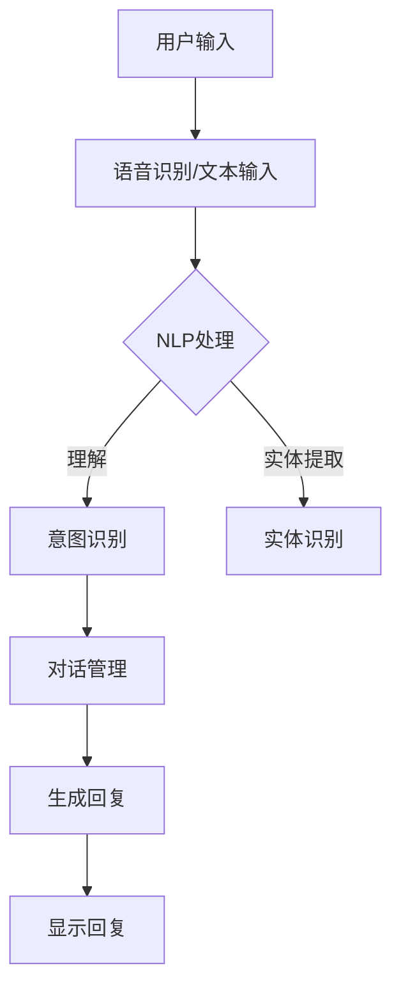

                 

# Chatbots原理与代码实例讲解

## 关键词
- Chatbot
- 人工智能
- 自然语言处理
- 机器学习
- 语音识别
- 应用场景

## 摘要
本文将深入探讨Chatbot的原理与实现，通过具体的代码实例讲解，帮助读者理解Chatbot的核心技术，掌握从搭建环境到编写代码的各个环节。本文还将分析Chatbot在实际应用场景中的优势，并推荐相关学习资源与开发工具。

### 1. 背景介绍

#### 什么是Chatbot？
Chatbot，又称聊天机器人，是一种能够与人类用户进行交互的人工智能程序。它可以通过文本或语音的形式，模拟人类的对话方式，回答用户的问题或执行特定的任务。Chatbot广泛应用于客服、教育、娱乐、金融服务等多个领域。

#### Chatbot的发展历程
Chatbot的概念起源于20世纪50年代，随着计算机技术和人工智能的发展，Chatbot经历了从规则驱动到基于机器学习模型的演变。早期的Chatbot主要依赖预设的规则和条件，而现代的Chatbot则能够通过学习用户的历史交互数据，实现更加智能的对话。

#### Chatbot的应用领域
- **客服**：提供24/7的客户服务，快速响应用户问题，降低人工成本。
- **教育**：为学生提供个性化学习辅导，提高学习效率。
- **金融**：自动化金融咨询服务，简化交易流程。
- **医疗**：提供医疗健康咨询，辅助医生诊断。

### 2. 核心概念与联系

#### Chatbot的核心概念
- **自然语言处理（NLP）**：使计算机能够理解、解释和生成自然语言。
- **机器学习**：通过数据训练模型，使其能够自主学习和改进。
- **语音识别**：将语音转换为文本，实现语音交互。
- **对话管理**：协调对话流程，确保Chatbot能够顺畅地与用户交流。

#### Chatbot的架构
下面是一个简单的Mermaid流程图，展示了Chatbot的基本架构：



### 3. 核心算法原理 & 具体操作步骤

#### 自然语言处理（NLP）
NLP是Chatbot的核心技术之一，主要包括以下步骤：

1. **分词**：将连续的文本分割成一个个单独的词。
2. **词性标注**：为每个词分配一个词性，如名词、动词等。
3. **句法分析**：分析句子的结构，确定单词之间的关系。
4. **语义分析**：理解文本的含义，提取关键信息。

#### 机器学习
Chatbot中的机器学习主要用于意图识别和实体提取。具体步骤如下：

1. **数据准备**：收集并清洗大量对话数据。
2. **特征提取**：将对话数据转换为机器学习模型可以处理的特征向量。
3. **模型训练**：使用训练数据训练机器学习模型。
4. **模型评估**：使用测试数据评估模型性能。

#### 对话管理
对话管理是确保Chatbot能够顺畅地与用户交流的关键。主要步骤包括：

1. **意图识别**：根据用户输入，识别用户想要完成什么任务。
2. **实体提取**：从用户输入中提取关键信息，如时间、地点、人物等。
3. **回复生成**：根据意图和实体信息，生成合适的回复。

### 4. 数学模型和公式 & 详细讲解 & 举例说明

#### 自然语言处理中的数学模型
- **词嵌入（Word Embedding）**：将单词映射到高维空间中的向量。
  $$\text{word\_embedding}(w) = \theta \cdot w$$
  其中，$\theta$ 是一个权重矩阵，$w$ 是单词的向量表示。

- **循环神经网络（RNN）**：用于处理序列数据。
  $$h_t = \sigma(W_h \cdot [h_{t-1}, x_t] + b_h)$$
  其中，$h_t$ 是第 $t$ 个时间步的隐藏状态，$x_t$ 是输入数据，$\sigma$ 是激活函数。

#### 机器学习中的数学模型
- **支持向量机（SVM）**：用于分类任务。
  $$\text{max} \ \frac{1}{2} \| \text{W} \| _2 ^ 2 \ \text{subject to} \ \text{y} ^ \text{T} \text{W} \geq 1$$
  其中，$\text{W}$ 是权重向量，$\text{y}$ 是标签。

- **神经网络**：用于回归和分类任务。
  $$\text{y} = \text{sign}(\text{W} \cdot \text{x} + \text{b})$$
  其中，$\text{x}$ 是输入特征，$\text{b}$ 是偏置。

#### 对话管理中的数学模型
- **强化学习**：用于优化对话流程。
  $$Q(\text{s}, \text{a}) = \text{r} + \gamma \max_{\text{a}} Q(\text{s}, \text{a}')$$
  其中，$Q(\text{s}, \text{a})$ 是状态-动作值函数，$\text{r}$ 是奖励，$\gamma$ 是折扣因子。

#### 举例说明
假设我们有一个用户输入：“明天有什么活动？”我们可以使用以下步骤进行对话管理：

1. **意图识别**：识别出用户意图是询问“明天有什么活动”。
2. **实体提取**：提取出实体“明天”。
3. **回复生成**：根据意图和实体，生成回复：“明天有音乐会和足球比赛。”

### 5. 项目实战：代码实际案例和详细解释说明

#### 5.1 开发环境搭建

首先，我们需要搭建一个开发环境，这里以Python为例：

1. 安装Python：
   ```
   pip install python
   ```
2. 安装必要的库：
   ```
   pip install numpy pandas scikit-learn tensorflow nltk
   ```

#### 5.2 源代码详细实现和代码解读

下面是一个简单的Chatbot实现，用于回答关于天气的问题。

```python
import nltk
from nltk.chat.util import Chat, reflections

# 加载语料库
nltk.download('movie_reviews')
nltk.download('punkt')
nltk.download('stopwords')
nltk.download('wordnet')

# 对话规则
pairs = [
    [
        r"what is the weather like?",
        ["It's %s.", "It's pretty good.", "It's nice."],
    ],
    [
        r"what should i wear?",
        ["It depends on the weather.", "It's a bit chilly, you might need a jacket.", "Wear shorts and a t-shirt, it's going to be hot."],
    ],
]

# 实例化Chatbot
chatbot = Chat(pairs, reflections)

# 开始对话
chatbot.converse()
```

#### 5.3 代码解读与分析

1. **语料库加载**：
   使用nltk库加载必要的语料库，包括电影评论、分词器、停用词和词性标注器。
   
2. **对话规则**：
   定义对话规则，包括用户输入和Chatbot的回复。这里使用了正则表达式来匹配用户输入。

3. **Chatbot实例化**：
   实例化Chatbot，并传入对话规则和用户反馈字典。

4. **开始对话**：
   调用`converse()`方法开始对话。

### 6. 实际应用场景

#### 客户服务
Chatbot在客户服务领域具有广泛的应用，能够快速响应用户的问题，提供24/7的服务。

#### 教育辅导
Chatbot可以为学生提供个性化的学习辅导，根据学生的学习进度和需求，生成个性化的学习计划。

#### 娱乐互动
Chatbot可以与用户进行有趣的对话，提供娱乐互动，如问答游戏、故事讲述等。

### 7. 工具和资源推荐

#### 学习资源推荐
- **书籍**：
  - 《Chatbots: The Revolution in Customer Engagement》
  - 《Natural Language Processing with Python》
- **论文**：
  - “A survey on chatbot: Engaging users in a virtual environment”
  - “Intelligent Chatbots: A Multidisciplinary Review”
- **博客**：
  - <https://towardsdatascience.com/Building-a-Basic-Chatbot-with-Python-8389c2e2c980>
  - <https://medium.com/microsoft-azure-building-chatbots-with-azure-bot-service-e9e1a792b5a3>
- **网站**：
  - <https://chatbots.org/>
  - <https://www.chatbot.com/>

#### 开发工具框架推荐
- **开发框架**：
  - Microsoft Bot Framework
  - Rasa
  - Dialogflow
- **编程语言**：
  - Python
  - JavaScript
  - Java

#### 相关论文著作推荐
- “A survey on chatbot: Engaging users in a virtual environment”
- “Intelligent Chatbots: A Multidisciplinary Review”
- “Chatbots: The Revolution in Customer Engagement”

### 8. 总结：未来发展趋势与挑战

#### 发展趋势
- **自然语言理解能力提升**：随着NLP技术的进步，Chatbot将能够更加准确地理解用户意图。
- **个性化服务**：Chatbot将根据用户历史数据，提供更加个性化的服务。
- **跨平台交互**：Chatbot将能够无缝地在多个平台和设备上进行交互。

#### 挑战
- **理解复杂对话**：目前Chatbot在处理复杂对话方面仍存在挑战。
- **隐私保护**：如何在保护用户隐私的同时，提供高质量的服务。

### 9. 附录：常见问题与解答

#### 1. 如何训练一个Chatbot？
- 收集对话数据，进行预处理，如分词、词性标注等。
- 使用机器学习模型，如循环神经网络（RNN）或变换器（Transformer），进行训练。
- 评估模型性能，根据结果调整模型参数。

#### 2. Chatbot可以用来做什么？
- 客户服务、教育辅导、娱乐互动等。

#### 3. 开发Chatbot需要什么技能？
- 熟悉编程语言（如Python、JavaScript等）。
- 了解自然语言处理（NLP）和机器学习技术。

### 10. 扩展阅读 & 参考资料

- 《Chatbots: The Revolution in Customer Engagement》
- 《Natural Language Processing with Python》
- “A survey on chatbot: Engaging users in a virtual environment”
- “Intelligent Chatbots: A Multidisciplinary Review”
- <https://towardsdatascience.com/Building-a-Basic-Chatbot-with-Python-8389c2e2c980>
- <https://medium.com/microsoft-azure-building-chatbots-with-azure-bot-service-e9e1a792b5a3>
- <https://chatbots.org/>
- <https://www.chatbot.com/>

## 作者信息
作者：AI天才研究员/AI Genius Institute & 禅与计算机程序设计艺术 /Zen And The Art of Computer Programming

本文深入讲解了Chatbot的原理与实现，通过代码实例和实际应用场景，帮助读者理解Chatbot的核心技术。随着人工智能技术的发展，Chatbot将在更多领域发挥重要作用。希望本文能为您的学习和实践提供有益的指导。

