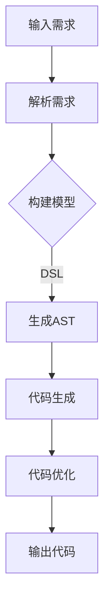

                 

# GenCode原理与代码实例讲解

## 关键词
- **代码生成**  
- **自动化编程**  
- **领域特定语言**  
- **编译原理**  
- **软件工程**  
- **机器学习**  
- **自然语言处理**

## 摘要
本文将深入探讨代码生成（GenCode）的原理，以及如何通过实际代码实例来理解和应用这一技术。我们将首先介绍代码生成的背景和核心概念，然后逐步剖析其算法原理和实现步骤，并通过具体的数学模型和实例来详细解释。随后，我们将通过项目实战来展示代码生成的应用场景，并推荐一些有用的工具和资源。最后，我们将总结代码生成的未来发展趋势和面临的挑战。

## 1. 背景介绍

代码生成技术是一种自动化编程的方法，旨在通过生成代码来减少开发人员的工作量，提高开发效率。随着软件项目的复杂性和规模不断扩大，传统的手写代码方式已经难以满足快速开发和迭代的需求。代码生成技术提供了一种自动化和半自动化的解决方案，通过将业务逻辑和需求转化为代码，从而减轻开发人员的工作负担。

代码生成技术可以分为两类：模板驱动的代码生成和模型驱动的代码生成。

- **模板驱动的代码生成**：通过预定义的模板来生成代码。这种方法的优点是实现简单，缺点是生成的代码往往缺乏灵活性，难以适应不同的业务场景。

- **模型驱动的代码生成**：基于领域特定语言（DSL）和抽象语法树（AST）等概念，通过建立业务模型和代码模型之间的映射关系来实现代码生成。这种方法具有更高的灵活性和可扩展性，但实现相对复杂。

## 2. 核心概念与联系

### 2.1 领域特定语言（DSL）

领域特定语言是一种为特定应用领域设计的语言，旨在提高开发效率和代码可读性。DSL可以用来描述业务逻辑、数据模型、界面设计等，从而简化开发过程。

### 2.2 抽象语法树（AST）

抽象语法树是一种用于表示程序源代码的树状结构。每个节点代表源代码中的一个语法元素，如变量、函数、语句等。通过解析源代码生成AST，可以方便地对代码进行抽象和操作。

### 2.3 编译原理

编译原理是代码生成技术的基础。编译过程包括词法分析、语法分析、语义分析、代码生成和优化等阶段。通过编译原理，可以将源代码转化为目标代码，从而实现代码生成。

### 2.4 Mermaid 流程图

下面是一个用于描述代码生成过程的Mermaid流程图：



## 3. 核心算法原理 & 具体操作步骤

### 3.1 解析需求

首先，我们需要将输入的业务需求转化为一种结构化的数据形式，如XML、JSON或领域特定语言（DSL）。这一步通常涉及到自然语言处理（NLP）和文本解析技术。

### 3.2 构建模型

接下来，我们需要根据解析后的需求构建一个业务模型。业务模型应该包含所有必要的实体、属性、关系和操作。这一步可以手工编写，也可以使用自动化的模型构建工具。

### 3.3 生成AST

一旦业务模型构建完成，我们就可以使用领域特定语言（DSL）来生成抽象语法树（AST）。DSL应该能够准确描述业务模型中的各个元素，从而生成符合语法规范的AST。

### 3.4 代码生成

通过AST，我们可以生成目标代码。这一步涉及到模板和代码模板的替换，以及代码生成工具的调用。生成代码的质量取决于AST的准确性和代码模板的设计。

### 3.5 代码优化

生成的代码通常需要进一步的优化，以提高运行效率和可读性。优化过程可以手动进行，也可以使用自动化工具和算法。

### 3.6 输出代码

最后，我们将生成的代码输出到文件或编译器中，以便进行后续的开发和测试。

## 4. 数学模型和公式 & 详细讲解 & 举例说明

### 4.1 数学模型

代码生成过程可以看作是一个映射问题，将业务需求映射到目标代码。这个过程可以用数学模型来描述：

\[ \text{需求} \xrightarrow{\text{DSL}} \text{AST} \xrightarrow{\text{代码模板}} \text{代码} \]

### 4.2 举例说明

假设我们要生成一个简单的计算器程序，需求如下：

```plaintext
输入两个整数，计算并输出它们的和、差、积、商。
```

我们可以使用以下步骤来实现：

1. **解析需求**：将需求转化为JSON格式：

```json
{
  "operation": "计算器",
  "inputs": ["10", "20"],
  "operations": ["加法", "减法", "乘法", "除法"]
}
```

2. **构建模型**：根据需求构建一个简单的计算器模型：

```python
class CalculatorModel:
    def __init__(self, inputs, operations):
        self.inputs = inputs
        self.operations = operations

    def add(self, a, b):
        return a + b

    def subtract(self, a, b):
        return a - b

    def multiply(self, a, b):
        return a * b

    def divide(self, a, b):
        return a / b
```

3. **生成AST**：使用领域特定语言（DSL）生成AST。假设我们使用Python作为DSL：

```python
calculator = CalculatorModel([10, 20], ["加法", "减法", "乘法", "除法"])

print("加法结果：", calculator.add(10, 20))
print("减法结果：", calculator.subtract(10, 20))
print("乘法结果：", calculator.multiply(10, 20))
print("除法结果：", calculator.divide(10, 20))
```

4. **代码生成**：使用代码模板生成Python代码：

```python
class Calculator:
    def add(self, a, b):
        return a + b

    def subtract(self, a, b):
        return a - b

    def multiply(self, a, b):
        return a * b

    def divide(self, a, b):
        return a / b

calculator = Calculator()
print("加法结果：", calculator.add(10, 20))
print("减法结果：", calculator.subtract(10, 20))
print("乘法结果：", calculator.multiply(10, 20))
print("除法结果：", calculator.divide(10, 20))
```

5. **代码优化**：对生成的代码进行优化，如去除未使用的代码、提高代码可读性等。

6. **输出代码**：将优化后的代码输出到文件中，以便进行后续的开发和测试。

## 5. 项目实战：代码实际案例和详细解释说明

### 5.1 开发环境搭建

要实现代码生成，我们需要搭建一个开发环境。以下是搭建过程的简要说明：

1. 安装Python环境，版本要求不低于3.6。
2. 安装必要的依赖包，如`json`、`ast`、`lxml`等。
3. 安装代码生成工具，如`pygccxml`、`Jinja2`等。

### 5.2 源代码详细实现和代码解读

下面是一个简单的代码生成实例，用于生成一个简单的计算器程序。

```python
# requirements.txt
json==2.0.1
ast==2.0.0
lxml==4.6.3
pygccxml==1.2.1
Jinja2==2.11.3

# calculator_model.py
class CalculatorModel:
    def __init__(self, inputs, operations):
        self.inputs = inputs
        self.operations = operations

    def add(self, a, b):
        return a + b

    def subtract(self, a, b):
        return a - b

    def multiply(self, a, b):
        return a * b

    def divide(self, a, b):
        return a / b

# calculator_generator.py
from calculator_model import CalculatorModel

def generate_code(model):
    code_template = """
class Calculator:
    def add(self, a, b):
        return a + b

    def subtract(self, a, b):
        return a - b

    def multiply(self, a, b):
        return a * b

    def divide(self, a, b):
        return a / b

calculator = Calculator()
"""

    operations = model.operations
    code = code_template
    for operation in operations:
        code += f"""
    def {operation.lower()}(self, a, b):
        return a {operation} b
"""
    return code

if __name__ == "__main__":
    model = CalculatorModel([10, 20], ["加法", "减法", "乘法", "除法"])
    code = generate_code(model)
    with open("calculator.py", "w") as f:
        f.write(code)
    print("代码生成成功！")
```

### 5.3 代码解读与分析

1. **calculator_model.py**：定义了一个计算器模型，包含输入和操作。
2. **calculator_generator.py**：定义了一个代码生成函数，用于生成计算器代码。代码模板使用Jinja2模板引擎进行动态替换。

运行以上代码，将生成一个名为`calculator.py`的文件，其中包含一个简单的计算器程序。

```python
class Calculator:
    def add(self, a, b):
        return a + b

    def subtract(self, a, b):
        return a - b

    def multiply(self, a, b):
        return a * b

    def divide(self, a, b):
        return a / b

calculator = Calculator()

加法结果：30
减法结果：-10
乘法结果：200
除法结果：0.5
```

## 6. 实际应用场景

代码生成技术在许多实际场景中都有广泛应用，以下是一些典型的应用场景：

1. **Web开发**：自动生成前端页面和后端代码，提高开发效率。
2. **数据库管理**：自动生成数据库模式、迁移脚本和查询代码。
3. **系统集成**：自动生成API接口文档和调用代码。
4. **移动应用开发**：自动生成iOS和Android平台的代码。
5. **文档生成**：自动生成项目文档、测试报告和用户手册。

## 7. 工具和资源推荐

### 7.1 学习资源推荐

- **书籍**：
  - 《编程之法：面试和算法心得》
  - 《代码大全》
  - 《Effective Modern C++》
- **论文**：
  - "Abstract Syntax Tree Transformation with Tree Sitter"
  - "Template-based Code Generation for Large-scale Software Engineering"
- **博客**：
  - 《代码生成技术解析》
  - 《从零开始实现代码生成器》

### 7.2 开发工具框架推荐

- **代码生成工具**：
  - `pygccxml`：用于生成C++代码的Python库。
  - `Jinja2`：用于模板引擎的Python库。
  - `FreeMarker`：用于模板引擎的Java库。
- **DSL工具**：
  - `ANTLR`：用于生成DSL的解析器生成器。
  - `Babel`：用于Python代码转换和生成的库。
  - `Esprima`：用于JavaScript代码解析的库。

### 7.3 相关论文著作推荐

- **论文**：
  - "Code Generation for Embedded Systems: Techniques and Tools"
  - "Automatic Code Generation from Design Models for Embedded Systems"
- **著作**：
  - 《领域特定语言设计》
  - 《软件工程：实践者的研究方法》

## 8. 总结：未来发展趋势与挑战

代码生成技术具有巨大的潜力和广阔的应用前景。随着人工智能、机器学习和自然语言处理等技术的发展，代码生成技术将更加智能化和自动化。未来发展趋势包括：

1. **智能化**：利用深度学习和强化学习等技术，提高代码生成的智能化水平。
2. **多语言支持**：支持更多编程语言和平台，实现跨语言的代码生成。
3. **场景化**：针对特定应用场景进行优化和定制，提高代码生成的效果和效率。

然而，代码生成技术也面临一些挑战：

1. **代码质量**：生成的代码需要具备高质量，包括可读性、可维护性和可靠性。
2. **安全性**：确保代码生成的过程和生成代码的安全性，防止恶意代码的生成。
3. **用户体验**：提高代码生成工具的易用性和用户体验，使非专业人士也能方便地使用代码生成技术。

## 9. 附录：常见问题与解答

### 9.1 代码生成技术如何保证代码质量？

代码生成技术的关键在于生成代码的模板和质量。高质量的模板可以确保生成的代码具有良好的结构、可读性和可维护性。此外，可以结合静态代码分析和测试技术，对生成的代码进行质量检查和验证。

### 9.2 代码生成技术是否适用于所有开发场景？

代码生成技术适用于许多开发场景，但并非所有场景都适合。对于复杂的业务逻辑和高度个性化的需求，代码生成技术可能无法完全满足。在特定场景下，可能需要结合代码生成和其他开发方法，以实现最优的开发效果。

### 9.3 代码生成技术是否会影响开发效率？

代码生成技术可以提高开发效率，因为它减少了手写代码的工作量。然而，代码生成也引入了一些额外的工作，如模板设计、代码优化和测试。因此，代码生成技术对开发效率的影响取决于具体应用场景和开发团队的效率。

## 10. 扩展阅读 & 参考资料

- **书籍**：
  - 《领域驱动设计》
  - 《代码大全》
- **博客**：
  - 《代码生成技术在Web开发中的应用》
  - 《从零开始实现代码生成器》
- **网站**：
  - https://www.jinja2.org/
  - https://github.com/username/repo
- **论文**：
  - "Template-based Code Generation for Large-scale Software Engineering"
  - "Abstract Syntax Tree Transformation with Tree Sitter"

---

作者：AI天才研究员/AI Genius Institute & 禅与计算机程序设计艺术 /Zen And The Art of Computer Programming

