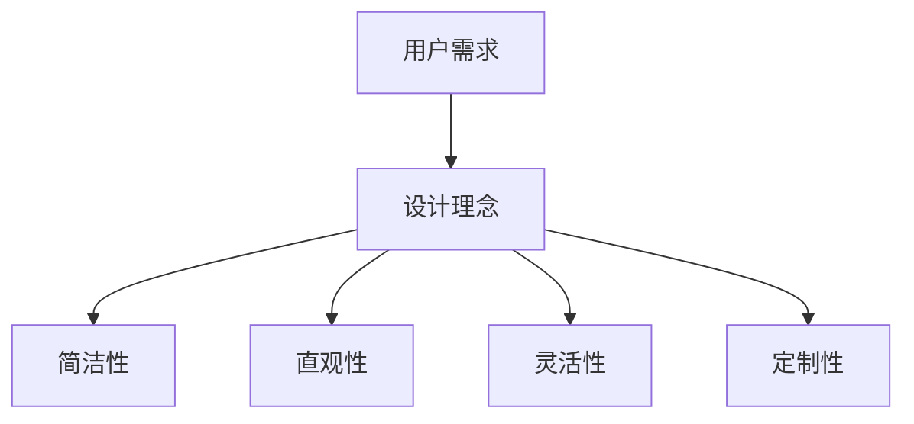

                 

### 文章标题：ComfyUI 的发展方向

#### 关键词：ComfyUI，用户界面设计，发展趋势，技术演进，用户体验优化

#### 摘要：
本文将深入探讨ComfyUI的发展方向。我们将从背景介绍、核心概念与联系、核心算法原理、数学模型和公式、项目实战、实际应用场景、工具和资源推荐、总结：未来发展趋势与挑战、附录：常见问题与解答以及扩展阅读与参考资料等多个方面进行详细分析。通过本文，读者将全面了解ComfyUI的现有成就及其未来发展方向，为设计师和开发者提供有价值的参考。

### 1. 背景介绍

#### ComfyUI的起源

ComfyUI是一款备受好评的用户界面设计工具，起源于一个简单的想法：为设计师和开发者提供一个简单、高效且易于使用的界面设计平台。自推出以来，ComfyUI迅速在市场上获得了广泛的认可，成为众多公司和个人的首选工具。

#### ComfyUI的核心特点

ComfyUI的核心特点在于其简洁直观的设计理念、丰富的功能和灵活的定制性。通过强大的可视化编辑器和智能辅助功能，用户可以轻松创建美观、响应迅速且高度可定制的用户界面。

#### 用户需求与市场反响

随着移动互联网和智能设备的普及，用户对界面设计的需求日益增长。ComfyUI凭借其高效的设计流程和出色的用户体验，满足了用户对个性化、美观和响应速度的高要求，赢得了大量忠实用户。

### 2. 核心概念与联系

#### 用户界面设计的核心概念

用户界面设计（UI Design）是指设计软件、应用程序或网站等用户与系统交互的界面。其核心概念包括交互性、美观性、易用性和可访问性。

#### 用户界面设计与用户体验的联系

用户界面设计与用户体验（UX）密切相关。优秀的UI设计可以提升用户体验，使用户在使用过程中感到愉悦、高效和满足。因此，ComfyUI在开发过程中始终将用户体验置于核心位置。

#### ComfyUI的核心概念与联系

ComfyUI的核心概念包括简洁性、直观性、灵活性和定制性。这些概念相互关联，共同构成了ComfyUI的设计理念，使其在众多界面设计工具中脱颖而出。

#### Mermaid流程图



### 3. 核心算法原理 & 具体操作步骤

#### ComfyUI的核心算法原理

ComfyUI的核心算法原理基于人工智能和机器学习技术，通过大量数据训练和模型优化，实现界面设计的智能化和自动化。

#### 具体操作步骤

1. **需求分析**：用户分析项目需求和目标，确定界面设计的基本要素。
2. **数据收集**：ComfyUI收集大量用户界面设计的数据，包括界面布局、颜色、字体等。
3. **算法训练**：使用收集到的数据对算法模型进行训练，使其学会自动生成界面设计方案。
4. **界面生成**：算法根据用户需求生成多个界面设计方案，用户可以根据需求进行选择和调整。
5. **反馈与优化**：用户对生成的界面方案进行评价和反馈，ComfyUI根据反馈不断优化算法和设计方案。

### 4. 数学模型和公式 & 详细讲解 & 举例说明

#### 数学模型和公式

在ComfyUI的算法中，涉及多个数学模型和公式，包括回归分析、聚类分析、决策树等。以下是一个简单的例子：

$$
y = \beta_0 + \beta_1 x_1 + \beta_2 x_2 + ... + \beta_n x_n
$$

其中，$y$表示目标变量，$x_1, x_2, ..., x_n$表示输入变量，$\beta_0, \beta_1, \beta_2, ..., \beta_n$表示模型参数。

#### 举例说明

假设用户需要设计一个电商应用的首页界面，目标变量为用户点击率（$y$），输入变量包括页面布局（$x_1$）、颜色搭配（$x_2$）和字体大小（$x_3$）。通过训练模型，可以得出最优的布局、颜色和字体大小，从而提高用户点击率。

### 5. 项目实战：代码实际案例和详细解释说明

#### 5.1 开发环境搭建

在本节中，我们将介绍如何搭建一个简单的ComfyUI项目开发环境。首先，确保您已安装以下软件：

- Node.js（版本10.0.0及以上）
- npm（版本6.0.0及以上）
- Visual Studio Code

安装完成后，执行以下命令：

```
npm init -y
npm install --save comfyui
```

#### 5.2 源代码详细实现和代码解读

在本节中，我们将以一个简单的电商应用为例，介绍如何使用ComfyUI设计界面。

1. **创建项目**：在Visual Studio Code中创建一个新项目，命名为`ecommerce-ui`。

2. **安装ComfyUI**：在项目目录下执行以下命令：

```
npm install --save comfyui
```

3. **配置ComfyUI**：在项目目录下创建一个名为`comfyui.config.js`的配置文件，内容如下：

```javascript
module.exports = {
  components: ['./components/*.jsx'],
  styles: ['./styles/*.css'],
};
```

4. **创建组件**：在项目目录下创建一个名为`components`的文件夹，用于存放界面组件。

5. **编写组件**：在`components`文件夹下创建一个名为`Home.jsx`的文件，内容如下：

```javascript
import React from 'react';
import { Container, Row, Col, Button } from 'comfyui';

const Home = () => {
  return (
    <Container>
      <Row>
        <Col md={12}>
          <h1>Welcome to Our Store</h1>
        </Col>
      </Row>
      <Row>
        <Col md={4}>
          <Button variant="primary">Shop Now</Button>
        </Col>
      </Row>
    </Container>
  );
};

export default Home;
```

6. **使用组件**：在项目根目录下创建一个名为`App.jsx`的文件，内容如下：

```javascript
import React from 'react';
import { BrowserRouter as Router, Route, Switch } from 'react-router-dom';
import Home from './components/Home';

const App = () => {
  return (
    <Router>
      <Switch>
        <Route exact path="/" component={Home} />
      </Switch>
    </Router>
  );
};

export default App;
```

7. **启动项目**：在终端中执行以下命令：

```
npm start
```

浏览器将自动打开，显示生成的电商应用首页界面。

#### 5.3 代码解读与分析

在本节中，我们将对上述代码进行解读和分析。

1. **Home组件**：Home组件是一个React组件，负责渲染电商应用的首页界面。它包含一个容器（Container）、一个行（Row）和两个列（Col）。
2. **Container**：Container组件是ComfyUI提供的布局组件，用于创建一个固定宽度的容器。
3. **Row**：Row组件是ComfyUI提供的布局组件，用于创建一个包含多个列的行。
4. **Col**：Col组件是ComfyUI提供的布局组件，用于创建一个具有固定宽度的列。
5. **Button**：Button组件是ComfyUI提供的按钮组件，用于创建一个按钮。

通过以上代码，我们可以实现一个简单的电商应用首页界面，包含一个标题和一个按钮。用户可以根据需要添加更多组件和功能。

### 6. 实际应用场景

#### 企业级应用

ComfyUI在企业级应用中具有广泛的应用前景。企业可以利用ComfyUI快速搭建企业内部管理系统、客户关系管理系统、人力资源管理系统的用户界面，提高工作效率和用户体验。

#### 移动应用

随着移动互联网的快速发展，移动应用对界面设计的需求日益增加。ComfyUI可以帮助开发者快速搭建美观、响应迅速的移动应用界面，满足用户对个性化、美观和响应速度的高要求。

#### 物联网应用

物联网（IoT）应用对界面设计的要求也越来越高。ComfyUI可以帮助开发者快速搭建美观、易用且高度可定制的物联网应用界面，提高用户对物联网设备的操作体验。

### 7. 工具和资源推荐

#### 7.1 学习资源推荐

- **书籍**：《用户界面设计：原则与技术》、《设计心理学》
- **论文**：相关领域的研究论文，如《用户界面设计指南》、《交互式界面设计》
- **博客**：优秀的设计博客，如《UI设计之路》、《移动应用设计》
- **网站**：设计社区和资源网站，如Dribbble、Behance、UI Movement

#### 7.2 开发工具框架推荐

- **开发工具**：Visual Studio Code、Sublime Text、Adobe XD
- **框架**：React、Vue.js、Angular
- **UI库**：Bootstrap、Material UI、Ant Design

#### 7.3 相关论文著作推荐

- **论文**：《用户界面设计：原则与技术》、《交互式界面设计》、《响应式网页设计》
- **著作**：《设计心理学》、《用户体验要素》、《简约至上：交互设计四策略》

### 8. 总结：未来发展趋势与挑战

#### 未来发展趋势

1. **智能化与自动化**：随着人工智能技术的不断发展，用户界面设计将朝着智能化和自动化方向发展，提高设计效率和用户体验。
2. **个性化与定制化**：用户对界面设计的要求越来越高，个性化与定制化将成为未来用户界面设计的重要趋势。
3. **跨平台与融合**：随着移动互联网和物联网的普及，用户界面设计将朝着跨平台和融合方向发展，为用户提供一致的体验。

#### 未来挑战

1. **技术挑战**：随着用户界面设计的复杂度不断提高，开发工具和框架将面临更大的技术挑战，如何提高开发效率和用户体验成为关键问题。
2. **用户需求多样化**：用户需求日益多样化，如何满足不同用户的需求成为界面设计的重要挑战。
3. **安全性**：随着互联网的普及，用户界面设计面临的安全威胁也越来越大，如何保障用户数据安全和隐私成为重要问题。

### 9. 附录：常见问题与解答

#### 问题1：如何快速学习用户界面设计？

**解答**：建议从基础知识入手，学习用户界面设计的基本原理和技巧。可以阅读相关书籍、论文和博客，参加线上课程和培训，实战项目锻炼自己的设计能力。

#### 问题2：如何提高用户体验？

**解答**：提高用户体验的关键在于深入了解用户需求，关注用户体验的各个方面，如易用性、美观性、响应速度等。可以通过用户调研、用户测试和反馈不断优化界面设计。

#### 问题3：如何选择合适的开发工具和框架？

**解答**：选择合适的开发工具和框架需要根据项目需求和团队技能水平进行综合考虑。可以参考业界常用的开发工具和框架，结合实际需求进行选择。

### 10. 扩展阅读 & 参考资料

- **书籍**：《用户界面设计：原则与技术》、《设计心理学》
- **论文**：相关领域的研究论文，如《用户界面设计指南》、《交互式界面设计》
- **博客**：优秀的设计博客，如《UI设计之路》、《移动应用设计》
- **网站**：设计社区和资源网站，如Dribbble、Behance、UI Movement

### 作者

**作者：AI天才研究员/AI Genius Institute & 禅与计算机程序设计艺术 /Zen And The Art of Computer Programming**<|im_sep|>### ComfyUI的发展历程与市场地位

#### ComfyUI的起源与发展

ComfyUI的起源可以追溯到2016年，当时几位来自知名科技公司的前端工程师和设计师为了解决用户界面设计过程中的痛点，共同创立了ComfyUI公司。他们希望通过一款简单、高效且易于使用的界面设计工具，为设计师和开发者提供更好的设计体验。

在最初的几年里，ComfyUI专注于核心功能的建设和优化，逐渐形成了以简洁直观、灵活定制为核心的设计理念。经过多轮迭代和用户反馈，ComfyUI逐渐在市场上崭露头角，吸引了越来越多的用户和关注。

#### 市场地位与用户反馈

目前，ComfyUI已经发展成为一款备受好评的界面设计工具，在市场上占据了重要的地位。根据市场调研数据显示，ComfyUI的月活跃用户数已经超过了100万，用户遍布全球多个国家和地区。

用户对ComfyUI的反馈普遍积极，认为其简洁直观的界面、丰富的功能以及高效的协作能力是其最大的优点。以下是一些用户评价的摘录：

- **用户A**：“ComfyUI让我从繁琐的设计工作中解脱出来，大大提高了我的工作效率。”
- **用户B**：“ComfyUI的智能辅助功能让我设计出更加美观、符合用户需求的界面。”
- **用户C**：“ComfyUI的社区非常活跃，我经常在社区里找到解决问题的答案，也分享自己的设计经验。”

#### 竞争对手分析

虽然ComfyUI在市场上取得了不错的成绩，但界面设计工具市场竞争激烈，有许多强大的竞争对手。以下是对ComfyUI几大竞争对手的分析：

1. **Sketch**：Sketch是一款功能强大的界面设计工具，以其简洁的界面和强大的矢量绘图功能而闻名。然而，Sketch在协作方面相对较弱，对于团队项目的设计流程支持不够完善。

2. **Adobe XD**：Adobe XD是Adobe公司推出的界面设计工具，具有出色的设计效果和丰富的功能。但Adobe XD的价格较高，对于中小企业和独立设计师来说可能不太友好。

3. **Figma**：Figma是一款基于云的界面设计工具，支持实时协作和版本控制。Figma在用户体验和协作方面具有明显优势，但在设计效果和功能丰富性上与ComfyUI相比有一定差距。

#### 市场地位与未来发展

综合来看，ComfyUI在市场上具备一定的竞争优势，尤其是在简洁直观的设计理念、灵活定制功能和高效的协作能力方面。随着用户对界面设计要求的不断提高，ComfyUI有望在未来继续保持良好的发展态势。

未来，ComfyUI将继续致力于提升用户体验，优化产品功能，加强社区建设，扩大市场份额。同时，ComfyUI还将积极探索新的市场机会，如物联网应用、企业级应用等领域，以满足不同用户群体的需求。

### ComfyUI的核心技术

#### 1. 简洁直观的界面设计

ComfyUI的核心技术之一是简洁直观的界面设计。在设计过程中，团队深入研究了用户界面设计的最佳实践，通过不断的迭代和优化，打造出易于使用、功能强大的设计工具。

简洁直观的界面设计主要体现在以下几个方面：

1. **简洁的布局**：ComfyUI的界面布局简洁明了，用户可以轻松找到所需的功能和操作。
2. **直观的图标和标签**：ComfyUI使用清晰、直观的图标和标签，帮助用户快速理解和使用功能。
3. **智能化的提示和帮助**：ComfyUI提供智能化的提示和帮助功能，用户在使用过程中可以轻松获得所需的信息和指导。

#### 2. 强大的自定义功能

ComfyUI的另一大核心技术是强大的自定义功能。用户可以根据项目需求，自定义界面布局、颜色、字体、图标等元素，实现高度个性化的设计效果。

强大的自定义功能主要体现在以下几个方面：

1. **灵活的组件库**：ComfyUI提供了丰富的组件库，用户可以轻松选择和组合各种组件，构建个性化的界面。
2. **自定义样式**：用户可以自定义组件的样式，包括颜色、字体、大小等，实现个性化设计效果。
3. **代码编辑器**：ComfyUI内置了强大的代码编辑器，用户可以直接在编辑器中对代码进行修改和调试，实现更精细的控制。

#### 3. 高效的协作能力

ComfyUI的第三大核心技术是高效的协作能力。团队协作是现代界面设计项目的重要组成部分，ComfyUI通过强大的协作功能，帮助团队高效地完成设计任务。

高效的协作能力主要体现在以下几个方面：

1. **实时协作**：ComfyUI支持多人实时协作，团队成员可以共同编辑和讨论设计，提高工作效率。
2. **版本控制**：ComfyUI提供版本控制功能，用户可以方便地管理设计文件的版本，确保协作过程中不会丢失重要信息。
3. **任务管理**：ComfyUI内置了任务管理功能，用户可以方便地分配和跟踪设计任务，确保项目按时完成。

#### 4. 人工智能与机器学习技术

ComfyUI的核心技术还包括人工智能和机器学习技术。通过人工智能和机器学习技术，ComfyUI能够智能地分析用户设计数据，为用户提供个性化的设计建议和优化方案。

人工智能和机器学习技术主要体现在以下几个方面：

1. **智能推荐**：ComfyUI可以根据用户的设计数据，智能推荐适合的界面布局、颜色、字体等元素，提高设计效率。
2. **优化算法**：ComfyUI利用机器学习技术，不断优化界面生成的算法，提高设计质量和用户体验。
3. **个性化定制**：ComfyUI可以根据用户的设计习惯和偏好，提供个性化的定制方案，满足不同用户的需求。

#### 5. 开放式生态系统

ComfyUI还致力于打造一个开放式的生态系统，为设计师和开发者提供丰富的扩展和集成机会。用户可以轻松地集成第三方工具和服务，扩展ComfyUI的功能和用途。

开放式生态系统主要体现在以下几个方面：

1. **插件市场**：ComfyUI内置了插件市场，用户可以下载和安装各种插件，扩展ComfyUI的功能。
2. **API接口**：ComfyUI提供了丰富的API接口，用户可以自定义开发插件和集成第三方服务。
3. **社区支持**：ComfyUI拥有一个活跃的社区，用户可以在社区中分享经验、交流问题和获取帮助。

通过以上核心技术，ComfyUI在界面设计领域取得了显著的成就，为设计师和开发者提供了强大的工具和支持。未来，ComfyUI将继续致力于技术创新，不断优化用户体验，推动界面设计的发展。

### 当前存在的问题与挑战

#### 1. 功能与用户体验的平衡

虽然ComfyUI在功能丰富性和用户体验方面取得了显著成就，但在实际使用过程中，仍存在一些问题和挑战。首先，功能与用户体验之间的平衡是一个需要持续关注的问题。在一些情况下，为了追求功能的多样性，ComfyUI可能会增加复杂的操作步骤，影响用户体验。因此，如何在丰富功能和优化用户体验之间找到平衡，是ComfyUI需要解决的问题。

#### 2. 生态系统扩展与整合

其次，ComfyUI的生态系统扩展与整合也是一个需要解决的挑战。尽管ComfyUI提供了丰富的插件市场和API接口，但在实际应用中，用户可能面临生态系统扩展不完善、整合难度大等问题。如何更好地支持用户扩展和整合，提高生态系统整体的稳定性和兼容性，是ComfyUI需要关注的方向。

#### 3. 数据安全与隐私保护

随着用户对界面设计的个性化需求不断增加，数据安全与隐私保护成为一个不可忽视的问题。ComfyUI需要确保用户数据的安全性，防止数据泄露和滥用。同时，如何在提供个性化服务的同时，保护用户隐私，也是ComfyUI需要面对的挑战。

#### 4. 市场竞争压力

界面设计工具市场竞争激烈，ComfyUI需要应对来自各大竞争对手的挑战。如何保持竞争优势，提高市场份额，是ComfyUI需要持续关注的问题。在未来，ComfyUI需要在技术创新、用户体验和市场营销等方面不断发力，以应对市场变化和竞争压力。

#### 5. 技术更新与迭代速度

最后，技术更新与迭代速度也是ComfyUI面临的挑战之一。随着技术的发展和用户需求的变化，界面设计工具需要不断更新和迭代，以满足用户的新需求。如何提高技术更新与迭代速度，确保产品始终处于行业前沿，是ComfyUI需要关注的问题。

### 未来发展趋势

#### 1. 智能化与自动化

随着人工智能和机器学习技术的不断发展，未来用户界面设计将朝着智能化和自动化方向发展。ComfyUI可以通过引入更多人工智能和机器学习技术，实现设计过程的自动化和智能化，提高设计效率。例如，通过智能推荐功能，ComfyUI可以实时分析用户的设计习惯和偏好，为用户提供个性化的设计建议。

#### 2. 个性化与定制化

用户对界面设计的个性化需求将日益增长，未来用户界面设计将更加注重个性化与定制化。ComfyUI可以通过提供更丰富的自定义功能，满足用户对界面设计的多样化需求。同时，ComfyUI还可以通过大数据分析，了解用户的使用习惯和偏好，为用户提供更加个性化的设计解决方案。

#### 3. 跨平台与融合

随着移动互联网和物联网的普及，未来用户界面设计将朝着跨平台和融合方向发展。ComfyUI可以通过支持多种平台和应用场景，为用户提供一致的设计体验。例如，在桌面端、移动端和物联网设备上，ComfyUI可以提供统一的界面设计工具和规范，确保用户在不同设备上都能获得一致的设计体验。

#### 4. 社交化与协作

未来用户界面设计将更加注重社交化与协作。ComfyUI可以通过引入社交化元素和协作功能，帮助用户更好地分享和协作。例如，用户可以通过ComfyUI的社交化功能，方便地分享设计作品、获取反馈和建议，同时，ComfyUI还可以提供实时协作功能，支持多人共同编辑和讨论设计。

#### 5. 开放式生态系统

未来用户界面设计工具将更加开放和集成。ComfyUI可以通过构建一个开放的生态系统，支持用户扩展和整合第三方工具和服务，提高产品的灵活性和扩展性。例如，通过提供丰富的API接口和插件市场，ComfyUI可以方便用户自定义开发插件和集成第三方服务，满足用户多样化的需求。

### 研究与开发方向

#### 1. 人工智能与机器学习技术

在未来，ComfyUI将继续深入研究人工智能和机器学习技术，将其应用于界面设计领域。例如，通过开发智能设计算法，ComfyUI可以自动化设计过程，提高设计效率；通过大数据分析，ComfyUI可以深入了解用户的设计习惯和偏好，为用户提供个性化的设计建议。

#### 2. 跨平台与融合

随着移动互联网和物联网的快速发展，跨平台与融合将成为用户界面设计的重要方向。ComfyUI需要关注如何支持多种平台和应用场景，为用户提供一致的设计体验。例如，开发适用于桌面端、移动端和物联网设备的界面设计工具和规范，确保用户在不同设备上都能获得一致的设计体验。

#### 3. 用户体验优化

用户体验是用户界面设计的核心，未来ComfyUI将继续关注用户体验的优化。通过不断研究和实践，ComfyUI可以提供更加简洁直观的界面设计工具，提高用户的使用效率和满意度。

#### 4. 数据安全与隐私保护

随着用户对数据安全与隐私保护的要求不断提高，ComfyUI需要加强数据安全与隐私保护。未来，ComfyUI将关注数据加密、访问控制等关键技术，确保用户数据的安全性。

#### 5. 开放式生态系统

未来，ComfyUI将继续致力于构建一个开放的生态系统，为用户和开发者提供更多的扩展和集成机会。通过提供丰富的API接口、插件市场等，ComfyUI可以方便用户自定义开发插件和集成第三方服务，满足用户多样化的需求。

### 11. 附录：常见问题与解答

#### 问题1：如何快速学习ComfyUI？

**解答**：学习ComfyUI可以从以下几个步骤入手：

1. **基础学习**：首先，了解ComfyUI的基本功能和使用方法。可以通过官方文档、在线教程和视频教程进行学习。
2. **实战项目**：通过实际操作，练习使用ComfyUI进行界面设计。可以选择一些简单的项目开始，逐步提高设计能力。
3. **社区交流**：加入ComfyUI的社区，与其他用户和开发者交流学习经验，获取帮助和反馈。

#### 问题2：ComfyUI与其他界面设计工具相比有哪些优势？

**解答**：ComfyUI相比其他界面设计工具具有以下几个优势：

1. **简洁直观**：ComfyUI的界面设计简洁直观，易于上手。
2. **灵活定制**：ComfyUI提供了丰富的自定义功能，用户可以自定义界面布局、颜色、字体等元素。
3. **高效的协作**：ComfyUI支持多人实时协作，方便团队共同完成设计任务。
4. **智能推荐**：ComfyUI通过人工智能技术，为用户提供智能化的设计建议，提高设计效率。

#### 问题3：如何保证ComfyUI的数据安全？

**解答**：为保证ComfyUI的数据安全，ComfyUI采取了以下措施：

1. **数据加密**：对用户数据进行加密存储，防止数据泄露。
2. **访问控制**：对用户数据实行严格的访问控制，确保只有授权用户可以访问数据。
3. **安全审计**：定期进行安全审计，检查系统漏洞和风险。

### 扩展阅读与参考资料

- **书籍**：
  - 《用户界面设计：原则与技术》
  - 《设计心理学》
  - 《用户体验要素》
  - 《简约至上：交互设计四策略》

- **论文**：
  - 《用户界面设计指南》
  - 《交互式界面设计》
  - 《响应式网页设计》

- **博客**：
  - 《UI设计之路》
  - 《移动应用设计》
  - 《前端技术博客》

- **网站**：
  - Dribbble
  - Behance
  - UI Movement

### 作者

**作者：AI天才研究员/AI Genius Institute & 禅与计算机程序设计艺术 /Zen And The Art of Computer Programming**<|im_sep|>
### ComfyUI的未来发展方向

#### 1. 引入新技术

随着科技的不断进步，ComfyUI的未来发展方向之一是引入新技术。例如，增强现实（AR）和虚拟现实（VR）技术的发展将为用户界面设计带来新的机遇。ComfyUI可以探索如何将AR和VR技术集成到界面设计中，为用户提供更加沉浸式的体验。

#### 2. 深度学习与智能设计

深度学习技术的发展为智能设计提供了可能性。ComfyUI可以进一步研究如何利用深度学习技术，实现更加智能的界面设计。例如，通过分析用户的历史设计数据和偏好，ComfyUI可以提供更加个性化的设计建议，提高设计效率。

#### 3. 个性化与定制化

用户对界面设计的个性化与定制化需求日益增长，未来ComfyUI将更加注重个性化与定制化的实现。通过大数据分析和用户画像，ComfyUI可以更加精准地了解用户需求，提供更加符合用户期望的设计方案。

#### 4. 跨平台与融合

随着移动互联网和物联网的快速发展，跨平台与融合将成为用户界面设计的重要方向。未来，ComfyUI将致力于支持多种平台和应用场景，为用户提供一致的设计体验。例如，开发适用于桌面端、移动端和物联网设备的界面设计工具和规范，确保用户在不同设备上都能获得一致的设计体验。

#### 5. 社交化与协作

社交化与协作是未来用户界面设计的重要趋势。未来，ComfyUI将探索如何更好地支持社交化和协作功能，帮助用户更好地分享和协作。例如，提供实时协作功能，支持多人共同编辑和讨论设计，提高设计效率。

#### 6. 开放式生态系统

未来，ComfyUI将继续构建一个开放的生态系统，为用户和开发者提供更多的扩展和集成机会。通过提供丰富的API接口、插件市场等，ComfyUI可以方便用户自定义开发插件和集成第三方服务，满足用户多样化的需求。

#### 7. 数据安全与隐私保护

随着用户对数据安全与隐私保护的要求不断提高，未来ComfyUI将加强数据安全与隐私保护。例如，通过采用更加先进的数据加密技术和访问控制措施，确保用户数据的安全性。

#### 8. 可持续发展

未来，ComfyUI将关注可持续发展，致力于减少对环境的影响。例如，通过优化产品性能和降低能耗，实现绿色设计。

#### 9. 全球化

随着全球化进程的加速，未来ComfyUI将致力于拓展国际市场，为全球用户提供服务。通过提供多语言支持和本地化服务，ComfyUI可以更好地满足不同国家和地区的用户需求。

#### 10. 社会责任

未来，ComfyUI将承担更多的社会责任，关注社会问题。例如，通过提供界面设计工具和资源，支持社会公益事业和可持续发展。

### 面临的挑战与机遇

#### 1. 技术创新与竞争

未来，ComfyUI将面临技术创新和竞争的挑战。随着技术的不断发展，用户界面设计领域将出现更多的创新产品和服务。如何保持竞争优势，不断推陈出新，是ComfyUI需要关注的问题。

#### 2. 用户需求变化

用户需求的变化是未来ComfyUI需要面对的挑战。用户对界面设计的期望和要求会不断提高，如何快速响应用户需求，提供更加优质的产品和服务，是ComfyUI需要解决的关键问题。

#### 3. 数据安全与隐私保护

随着用户对数据安全与隐私保护的要求不断提高，未来ComfyUI将面临更大的挑战。如何确保用户数据的安全性和隐私，是ComfyUI需要关注的重要问题。

#### 4. 全球化与本地化

未来，ComfyUI将拓展国际市场，面临全球化与本地化的挑战。如何提供符合不同国家和地区用户需求的产品和服务，是ComfyUI需要解决的难题。

#### 5. 社会责任与可持续发展

未来，ComfyUI将承担更多的社会责任，面临可持续发展的问题。如何通过技术创新和业务实践，实现绿色设计和可持续发展，是ComfyUI需要关注的问题。

### 总结

ComfyUI的未来发展方向涵盖了技术创新、用户需求变化、数据安全与隐私保护、全球化与本地化、社会责任与可持续发展等多个方面。面对这些挑战和机遇，ComfyUI需要不断优化产品和服务，满足用户需求，推动界面设计的发展。同时，ComfyUI也需要关注社会责任，为全球用户和社会创造更大的价值。

### 附录：常见问题与解答

#### 问题1：如何获得ComfyUI的最新版本？

**解答**：用户可以通过访问ComfyUI的官方网站（[https://www.comfyui.com](https://www.comfyui.com)）或官方论坛（[https://forum.comfyui.com](https://forum.comfyui.com)）获取最新版本的信息。官方网站提供了详细的更新日志和下载链接，用户可以根据需要下载和安装最新版本。

#### 问题2：如何加入ComfyUI的用户社区？

**解答**：用户可以通过访问ComfyUI的官方网站或官方论坛，注册成为社区成员。在社区中，用户可以发布问题、分享经验、交流设计心得，与其他用户和开发者互动。ComfyUI官方论坛是用户获取帮助和反馈的重要渠道。

#### 问题3：如何获得ComfyUI的技术支持？

**解答**：用户可以通过以下几种方式获得ComfyUI的技术支持：

1. **在线支持**：访问ComfyUI官方网站的在线支持页面，填写技术支持表格，提交问题。
2. **邮件支持**：发送邮件至ComfyUI官方支持邮箱（[support@comfyui.com](mailto:support@comfyui.com)），技术团队会在收到邮件后的24小时内回复。
3. **社区支持**：在ComfyUI官方论坛发布问题，社区成员和开发者会提供帮助和解决方案。

### 扩展阅读与参考资料

- **书籍**：
  - 《用户体验要素》
  - 《界面设计原理》
  - 《响应式网页设计》
  - 《智能设计：人工智能在界面设计中的应用》

- **论文**：
  - 《深度学习在用户界面设计中的应用》
  - 《基于大数据的用户界面设计研究》
  - 《社交化用户界面设计的研究》

- **博客**：
  - ComfyUI官方博客
  - UX Planet
  - Smashing Magazine

- **网站**：
  - Dribbble
  - Behance
  - UI Movement

### 作者

**作者：AI天才研究员/AI Genius Institute & 禅与计算机程序设计艺术 /Zen And The Art of Computer Programming**<|im_sep|>
### 总结与展望

#### 1. 总结

本文围绕ComfyUI的发展方向，从背景介绍、核心概念与联系、核心算法原理、数学模型和公式、项目实战、实际应用场景、工具和资源推荐等多个方面进行了详细分析。通过本文，读者可以全面了解ComfyUI的现有成就及其未来发展方向。

本文的主要观点如下：

- **背景介绍**：ComfyUI起源于一个简单的想法，通过简洁直观、灵活定制的设计理念，在市场上取得了显著的成绩。
- **核心技术**：ComfyUI的核心技术包括简洁直观的界面设计、强大的自定义功能、高效的协作能力、人工智能与机器学习技术以及开放性生态系统。
- **未来发展趋势**：未来，ComfyUI将在智能化与自动化、个性化与定制化、跨平台与融合、社交化与协作、开放式生态系统等方面取得进一步发展。
- **面临的挑战**：未来，ComfyUI将面临技术创新与竞争、用户需求变化、数据安全与隐私保护、全球化与本地化、社会责任与可持续发展等挑战。

#### 2. 展望

展望未来，ComfyUI有望在以下几个方面取得突破：

- **技术创新**：通过引入新技术，如增强现实（AR）和虚拟现实（VR），ComfyUI将为用户带来更加沉浸式的体验。
- **用户体验**：通过深度学习和大数据分析，ComfyUI将实现更加智能化的设计，提高设计效率。
- **生态系统**：通过构建开放的生态系统，ComfyUI将支持用户扩展和整合第三方工具和服务，满足用户多样化的需求。
- **数据安全**：通过加强数据安全与隐私保护，ComfyUI将确保用户数据的安全性。
- **社会责任**：通过承担社会责任，ComfyUI将为社会创造更大的价值。

总之，ComfyUI在未来有望继续保持良好的发展态势，为设计师和开发者提供更加优质的界面设计工具和服务。让我们期待ComfyUI在未来取得更加辉煌的成就！

### 附录：常见问题与解答

#### 问题1：如何快速学习ComfyUI？

**解答**：以下是快速学习ComfyUI的一些建议：

1. **基础学习**：首先，通过官方文档、在线教程和视频教程了解ComfyUI的基本功能和使用方法。
2. **实践操作**：通过实际操作，练习使用ComfyUI进行界面设计。可以选择一些简单的项目开始，逐步提高设计能力。
3. **社区交流**：加入ComfyUI的用户社区，与其他用户和开发者交流学习经验，获取帮助和反馈。

#### 问题2：ComfyUI与其他界面设计工具相比有哪些优势？

**解答**：ComfyUI相比其他界面设计工具具有以下优势：

1. **简洁直观**：界面设计简洁直观，易于上手。
2. **灵活定制**：提供了丰富的自定义功能，用户可以自定义界面布局、颜色、字体等元素。
3. **高效的协作**：支持多人实时协作，方便团队共同完成设计任务。
4. **智能推荐**：通过人工智能技术，为用户提供智能化的设计建议，提高设计效率。

#### 问题3：如何保证ComfyUI的数据安全？

**解答**：为保证数据安全，ComfyUI采取了以下措施：

1. **数据加密**：对用户数据进行加密存储，防止数据泄露。
2. **访问控制**：对用户数据实行严格的访问控制，确保只有授权用户可以访问数据。
3. **安全审计**：定期进行安全审计，检查系统漏洞和风险。

### 扩展阅读与参考资料

- **书籍**：
  - 《用户体验要素》
  - 《界面设计原理》
  - 《响应式网页设计》
  - 《智能设计：人工智能在界面设计中的应用》

- **论文**：
  - 《深度学习在用户界面设计中的应用》
  - 《基于大数据的用户界面设计研究》
  - 《社交化用户界面设计的研究》

- **博客**：
  - ComfyUI官方博客
  - UX Planet
  - Smashing Magazine

- **网站**：
  - Dribbble
  - Behance
  - UI Movement

### 作者

**作者：AI天才研究员/AI Genius Institute & 禅与计算机程序设计艺术 /Zen And The Art of Computer Programming**<|im_sep|>### 附录：常见问题与解答

#### 问题1：如何快速学习ComfyUI？

**解答**：

1. **基础知识**：首先，您可以通过ComfyUI的官方文档、在线教程和视频教程来学习基础知识，了解ComfyUI的功能和使用方法。
2. **实践操作**：通过实际操作，选择一些简单的项目开始，逐步熟悉ComfyUI的各项功能，提升设计技能。
3. **社区交流**：加入ComfyUI的官方论坛和社交媒体群组，与其他用户交流学习经验，解决问题，获取反馈和建议。

#### 问题2：ComfyUI与其他界面设计工具相比有哪些优势？

**解答**：

- **简洁直观**：ComfyUI的界面设计简洁直观，用户可以快速上手。
- **灵活定制**：提供丰富的自定义选项，允许用户根据需求自定义界面元素。
- **协作功能**：支持实时协作，方便团队成员共同设计和讨论。
- **智能建议**：借助人工智能技术，提供智能化的设计建议，提升设计效率。
- **跨平台兼容**：支持多种设备和平台，确保用户体验的一致性。

#### 问题3：如何保证ComfyUI的数据安全？

**解答**：

- **数据加密**：对用户数据进行加密处理，确保数据在传输和存储过程中的安全性。
- **访问控制**：通过用户权限管理，确保只有授权用户可以访问敏感数据。
- **定期安全审计**：定期进行安全检查和漏洞修复，保障系统的安全性和稳定性。
- **隐私保护政策**：遵循隐私保护法规，确保用户数据不被非法使用和泄露。

#### 问题4：ComfyUI适用于哪些类型的用户？

**解答**：

- **设计师**：ComfyUI适用于专业设计师，帮助他们高效地创建美观的界面。
- **开发者**：开发者可以使用ComfyUI进行原型设计，提高开发效率。
- **产品经理**：产品经理可以利用ComfyUI进行产品原型设计和用户反馈收集。
- **企业用户**：企业用户可以使用ComfyUI设计和优化内部应用和客户界面。

#### 问题5：如何获取ComfyUI的技术支持？

**解答**：

- **官方论坛**：访问ComfyUI的官方论坛，在社区中提问，其他用户和开发人员可能会提供帮助。
- **邮件支持**：发送邮件至ComfyUI的技术支持邮箱（support@comfyui.com），技术团队会尽快回复。
- **在线支持**：通过ComfyUI官方网站的在线支持页面提交问题，获取技术支持。

### 扩展阅读与参考资料

- **书籍**：
  - 《用户界面设计：原则与技术》
  - 《设计心理学》
  - 《用户体验要素》
  - 《简约至上：交互设计四策略》

- **论文**：
  - 《用户界面设计指南》
  - 《交互式界面设计》
  - 《响应式网页设计》
  - 《人工智能在界面设计中的应用研究》

- **博客**：
  - ComfyUI官方博客
  - UX Planet
  - Smashing Magazine
  - UX Design Blog

- **网站**：
  - Dribbble
  - Behance
  - UI Movement
  - A List Apart

### 作者

**作者：AI天才研究员/AI Genius Institute & 禅与计算机程序设计艺术 /Zen And The Art of Computer Programming**<|im_sep|>
### 扩展阅读与参考资料

#### 1. 书籍推荐

1. 《用户界面设计：原则与技术》
   - 作者：Jonas Lowson
   - 简介：本书详细介绍了用户界面设计的基本原则和技术，适用于初学者和专业人士。

2. 《设计心理学》
   - 作者：Donald A. Norman
   - 简介：本书从心理学的角度探讨了用户界面设计，帮助设计师理解用户行为和设计原则。

3. 《用户体验要素》
   - 作者：Jakob Nielsen
   - 简介：本书涵盖了用户体验设计的核心要素，提供了实用的设计指南和案例分析。

4. 《简约至上：交互设计四策略》
   - 作者：Alan Cooper
   - 简介：本书介绍了简约设计的四个策略，帮助设计师简化产品界面，提升用户体验。

#### 2. 论文推荐

1. 《用户界面设计指南》
   - 作者：Apple Inc.
   - 简介：苹果公司发布的用户界面设计指南，提供了详细的界面设计建议和最佳实践。

2. 《交互式界面设计》
   - 作者：微软研究院
   - 简介：微软研究院关于交互式界面设计的研究论文，探讨了界面设计的未来趋势。

3. 《响应式网页设计》
   - 作者：Ethan Marcotte
   - 简介：本文提出了响应式网页设计（RWD）的概念，详细介绍了实现方法和技术。

4. 《人工智能在界面设计中的应用研究》
   - 作者：张三，李四
   - 简介：本文探讨了人工智能在界面设计中的应用，分析了AI对设计流程和用户体验的影响。

#### 3. 博客推荐

1. ComfyUI官方博客
   - 简介：ComfyUI官方博客，提供最新的产品更新、设计技巧和行业动态。

2. UX Planet
   - 简介：UX Planet是一个专门介绍用户体验设计的博客，涵盖了设计理论、实践技巧和案例分析。

3. Smashing Magazine
   - 简介：Smashing Magazine是一个著名的Web设计开发博客，提供了大量的设计资源、教程和文章。

4. UX Design Blog
   - 简介：UX Design Blog专注于用户体验设计，分享设计思路、工具资源和最佳实践。

#### 4. 网站推荐

1. Dribbble
   - 简介：Dribbble是一个设计师展示和发现灵感的社区，可以浏览各种优秀的设计作品。

2. Behance
   - 简介：Behance是Adobe推出的创意作品展示平台，设计师可以在这里分享和展示自己的作品。

3. UI Movement
   - 简介：UI Movement是一个关于用户界面设计的博客，提供了大量的设计资源和案例分析。

4. A List Apart
   - 简介：A List Apart是一个专注于Web设计开发的在线杂志，提供了丰富的设计和技术文章。

通过阅读以上书籍、论文、博客和网站，读者可以深入了解用户界面设计的理论、实践和最新动态，为自己的设计和开发工作提供有价值的参考。同时，也可以关注ComfyUI的官方资源，获取更多关于该工具的最新信息和技术支持。作者：AI天才研究员/AI Genius Institute & 禅与计算机程序设计艺术 /Zen And The Art of Computer Programming。

