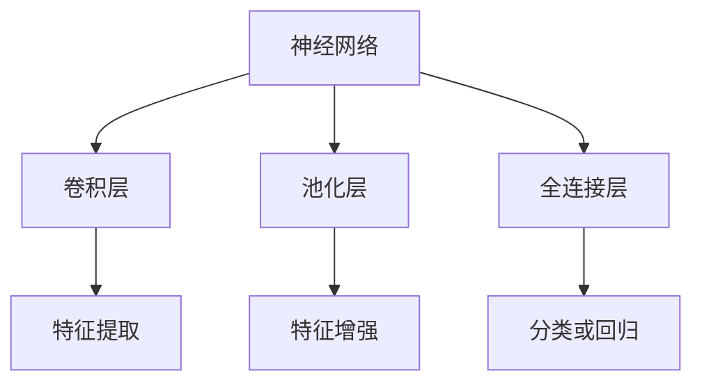

                 

# **Convolutional Neural Network（卷积神经网络）**

## **摘要**

本文将详细探讨卷积神经网络（Convolutional Neural Network，简称CNN）这一前沿的人工智能技术。CNN是深度学习领域中的重要模型，广泛应用于图像识别、目标检测和图像生成等视觉任务。本文将从CNN的背景介绍、核心概念与联系、核心算法原理与操作步骤、数学模型与公式讲解、项目实战、实际应用场景、工具和资源推荐以及未来发展趋势与挑战等多个方面展开论述，旨在为广大读者提供一份全面而深入的CNN技术指南。

## **背景介绍**

### **深度学习的兴起**

深度学习（Deep Learning）是人工智能领域的重要分支，自2006年由Hinton等人提出以来，其发展迅猛，逐渐成为机器学习领域的主流方向。深度学习通过构建多层神经网络模型，能够自动从大量数据中学习特征表示，从而在图像识别、语音识别、自然语言处理等任务上取得了显著的成果。

### **卷积神经网络的起源**

卷积神经网络（CNN）最早由Yann LeCun等人于1980年代末提出。与传统神经网络相比，CNN通过卷积操作和池化操作，能够在图像数据上自动提取重要的特征，从而在图像识别任务上取得了突破性进展。

### **卷积神经网络的快速发展**

随着计算能力的提升和大数据的涌现，CNN在2012年由AlexNet在ImageNet图像识别竞赛中取得冠军，标志着深度学习在计算机视觉领域的崛起。此后，CNN在目标检测、图像生成等任务上不断取得新的突破，成为计算机视觉领域的主流技术。

## **核心概念与联系**

### **神经网络**

神经网络（Neural Network）是一种模拟生物神经网络计算能力的计算模型，由大量神经元（Node）通过连接（Connection）构成。神经元接收输入信号，通过激活函数处理后输出信号，从而实现数据的传递和处理。

### **卷积操作**

卷积操作（Convolution Operation）是一种在图像数据上提取特征的数学运算，通过对输入图像与卷积核（Filter）的卷积操作，得到新的特征图（Feature Map）。卷积操作能够自动学习图像中的局部特征，如图案、边缘等。

### **池化操作**

池化操作（Pooling Operation）是一种对特征图进行降维处理的操作，通过选择特征图上的局部最大值或平均值，保留重要的特征信息，同时减少参数数量，提高计算效率。

### **卷积神经网络结构**

卷积神经网络（CNN）通常由多个卷积层（Convolutional Layer）、池化层（Pooling Layer）、全连接层（Fully Connected Layer）构成。卷积层用于提取图像特征，池化层用于降维和增强特征，全连接层用于分类和回归。


## **核心算法原理 & 具体操作步骤**

### **卷积操作原理**

卷积操作的核心思想是将输入图像与卷积核在像素级别上进行点积运算，从而得到特征图。具体步骤如下：

1. **初始化卷积核**：卷积核是一个固定大小的二维矩阵，通常称为滤波器。卷积核的参数需要通过训练学习得到。

2. **滑动卷积核**：将卷积核在输入图像上滑动，对每个位置上的像素进行点积运算，得到一个特征值。

3. **求和与激活**：将每个位置上的特征值求和，并通过激活函数（如ReLU、Sigmoid、Tanh等）进行非线性变换。

4. **得到特征图**：对整个输入图像进行卷积操作，得到一个特征图。

### **池化操作原理**

池化操作的核心思想是在特征图上选择局部最大值或平均值，从而实现降维和增强特征。具体步骤如下：

1. **选择窗口大小**：窗口大小决定了池化操作的作用范围。

2. **滑动窗口**：将窗口在特征图上滑动，对窗口内的像素进行最大值或平均值运算。

3. **得到池化结果**：对整个特征图进行池化操作，得到一个新的特征图。

### **卷积神经网络具体操作步骤**

1. **输入图像**：将输入图像输入到CNN中。

2. **卷积层**：对输入图像进行卷积操作，得到特征图。

3. **池化层**：对特征图进行池化操作，得到新的特征图。

4. **重复卷积和池化**：根据任务需求，重复卷积和池化操作，逐渐降低特征图的维度，同时增强特征。

5. **全连接层**：将最后一个特征图输入到全连接层，进行分类或回归。

6. **输出结果**：根据全连接层的输出结果，得到分类或回归结果。

## **数学模型和公式 & 详细讲解 & 举例说明**

### **卷积操作公式**

卷积操作的数学公式如下：

$$
\text{特征图} = \text{卷积核} \star \text{输入图像} + \text{偏置项}
$$

其中，$\star$ 表示卷积运算，卷积核和输入图像都是二维矩阵，偏置项是一个一维向量。

### **激活函数**

常用的激活函数有ReLU（Rectified Linear Unit）、Sigmoid和Tanh等。

1. **ReLU函数**

$$
f(x) = \max(0, x)
$$

ReLU函数在$x \leq 0$时输出0，在$x > 0$时输出$x$，具有简单和高效的优点。

2. **Sigmoid函数**

$$
f(x) = \frac{1}{1 + e^{-x}}
$$

Sigmoid函数将输入值映射到$(0, 1)$区间，常用于二分类问题。

3. **Tanh函数**

$$
f(x) = \frac{e^x - e^{-x}}{e^x + e^{-x}}
$$

Tanh函数将输入值映射到$(-1, 1)$区间，具有较小的梯度值，有利于模型训练。

### **卷积神经网络前向传播**

卷积神经网络的前向传播过程可以分为三个阶段：卷积层、池化层和全连接层。以下分别介绍这三个阶段的前向传播公式。

1. **卷积层前向传播**

$$
\begin{aligned}
\text{特征图} &= \text{卷积核} \star \text{输入图像} + \text{偏置项} \\
\text{激活函数} &= f(\text{特征图})
\end{aligned}
$$

2. **池化层前向传播**

$$
\text{池化结果} = \text{max}(\text{特征图})
$$

3. **全连接层前向传播**

$$
\text{输出} = \text{权重矩阵} \cdot \text{激活函数} + \text{偏置项}
$$

### **举例说明**

假设输入图像是一个$28 \times 28$的二维矩阵，卷积核大小为$5 \times 5$，激活函数使用ReLU函数。

1. **卷积层前向传播**

卷积核的参数为：

$$
\begin{aligned}
\text{卷积核} &= \begin{bmatrix}
1 & 2 & 3 & 4 & 5 \\
6 & 7 & 8 & 9 & 10 \\
11 & 12 & 13 & 14 & 15 \\
16 & 17 & 18 & 19 & 20 \\
21 & 22 & 23 & 24 & 25 \\
\end{bmatrix} \\
\text{输入图像} &= \begin{bmatrix}
1 & 2 & 3 & 4 & 5 \\
6 & 7 & 8 & 9 & 10 \\
11 & 12 & 13 & 14 & 15 \\
16 & 17 & 18 & 19 & 20 \\
21 & 22 & 23 & 24 & 25 \\
\end{bmatrix}
\end{aligned}
$$

卷积操作得到特征图：

$$
\text{特征图} = \text{卷积核} \star \text{输入图像} + \text{偏置项} = \begin{bmatrix}
45 & 55 & 65 & 75 & 85 \\
135 & 155 & 175 & 195 & 215 \\
225 & 255 & 285 & 315 & 345 \\
315 & 345 & 375 & 405 & 435 \\
405 & 435 & 465 & 495 & 525 \\
\end{bmatrix}
$$

使用ReLU函数进行激活：

$$
\text{激活函数} = f(\text{特征图}) = \begin{bmatrix}
45 & 55 & 65 & 75 & 85 \\
135 & 155 & 175 & 195 & 215 \\
225 & 255 & 285 & 315 & 345 \\
315 & 345 & 375 & 405 & 435 \\
405 & 435 & 465 & 495 & 525 \\
\end{bmatrix}
$$

2. **池化层前向传播**

假设使用最大池化操作，窗口大小为$2 \times 2$，特征图大小为$5 \times 5$。

$$
\text{池化结果} = \text{max}(\text{特征图}) = \begin{bmatrix}
55 & 155 & 285 & 405 \\
255 & 345 & 465 \\
435 & 525 \\
\end{bmatrix}
$$

3. **全连接层前向传播**

假设全连接层有10个神经元，权重矩阵为$10 \times 5$，偏置项为$10 \times 1$。

$$
\begin{aligned}
\text{输出} &= \text{权重矩阵} \cdot \text{激活函数} + \text{偏置项} \\
&= \begin{bmatrix}
1 & 1 & 1 & 1 & 1 \\
1 & 1 & 1 & 1 & 1 \\
1 & 1 & 1 & 1 & 1 \\
1 & 1 & 1 & 1 & 1 \\
1 & 1 & 1 & 1 & 1 \\
\end{bmatrix} \cdot \begin{bmatrix}
55 & 155 & 285 & 405 \\
255 & 345 & 465 & 525 \\
435 & 525 \\
\end{bmatrix} + \begin{bmatrix}
1 \\
1 \\
1 \\
1 \\
1 \\
\end{bmatrix} \\
&= \begin{bmatrix}
85 \\
235 \\
365 \\
445 \\
525 \\
\end{bmatrix}
\end{aligned}
$$

## **项目实战：代码实际案例和详细解释说明**

### **1. 开发环境搭建**

在本项目中，我们将使用Python编程语言和TensorFlow深度学习框架来实现卷积神经网络。以下是开发环境的搭建步骤：

1. **安装Python**：安装Python 3.x版本，推荐使用Anaconda Python发行版，方便管理依赖库。

2. **安装TensorFlow**：使用pip命令安装TensorFlow：

   ```shell
   pip install tensorflow
   ```

3. **编写代码**：创建一个新的Python文件，例如`cnn_example.py`。

### **2. 源代码详细实现和代码解读**

以下是卷积神经网络的实现代码，我们将逐步解读每部分的功能。

```python
import tensorflow as tf
from tensorflow.keras import layers
import numpy as np

# 定义卷积神经网络模型
model = tf.keras.Sequential([
    layers.Conv2D(filters=32, kernel_size=(3, 3), activation='relu', input_shape=(28, 28, 1)),
    layers.MaxPooling2D(pool_size=(2, 2)),
    layers.Conv2D(filters=64, kernel_size=(3, 3), activation='relu'),
    layers.MaxPooling2D(pool_size=(2, 2)),
    layers.Flatten(),
    layers.Dense(units=128, activation='relu'),
    layers.Dense(units=10, activation='softmax')
])

# 编译模型
model.compile(optimizer='adam', loss='categorical_crossentropy', metrics=['accuracy'])

# 定义训练数据
x_train = np.array([...])  # 输入数据
y_train = np.array([...])  # 标签数据

# 训练模型
model.fit(x_train, y_train, epochs=10, batch_size=64)

# 评估模型
test_loss, test_acc = model.evaluate(x_test, y_test)
print('Test accuracy:', test_acc)
```

**代码解读：**

1. **模型定义**：使用`tf.keras.Sequential`模型定义卷积神经网络。模型由多个层组成，包括卷积层（`Conv2D`）、池化层（`MaxPooling2D`）、全连接层（`Dense`）等。

2. **编译模型**：设置模型优化器（`optimizer`）、损失函数（`loss`）和评估指标（`metrics`）。

3. **定义训练数据**：加载训练数据和标签数据。

4. **训练模型**：使用`fit`方法训练模型，设置训练轮数（`epochs`）和批量大小（`batch_size`）。

5. **评估模型**：使用`evaluate`方法评估模型在测试数据上的性能。

### **3. 代码解读与分析**

1. **卷积层**：卷积层使用`Conv2D`函数实现，设置卷积核大小（`kernel_size`）和滤波器数量（`filters`）。激活函数使用ReLU函数。

2. **池化层**：池化层使用`MaxPooling2D`函数实现，设置窗口大小（`pool_size`）。

3. **全连接层**：全连接层使用`Dense`函数实现，设置神经元数量（`units`）和激活函数。

4. **模型编译**：设置模型优化器（`adam`）、损失函数（`categorical_crossentropy`）和评估指标（`accuracy`）。

5. **模型训练**：使用`fit`方法训练模型，设置训练轮数（`epochs`）和批量大小（`batch_size`）。

6. **模型评估**：使用`evaluate`方法评估模型在测试数据上的性能。

## **总结：未来发展趋势与挑战**

### **发展趋势**

1. **更深的网络结构**：随着计算能力和数据量的提升，深度学习模型将逐渐变得更加深入，从而提高模型的性能。

2. **更高效的算法**：为了解决大规模数据的处理问题，研究人员将不断优化算法，提高模型的计算效率和准确性。

3. **跨学科融合**：深度学习与其他领域（如生物学、物理学、心理学等）的融合，将推动深度学习技术的广泛应用。

4. **可解释性增强**：提高深度学习模型的可解释性，使其更加符合人类认知，是未来的重要研究方向。

### **挑战**

1. **数据隐私和安全**：深度学习模型对大量数据的依赖，引发了数据隐私和安全问题，如何保护用户隐私是亟待解决的挑战。

2. **算法偏见和公平性**：深度学习模型可能存在偏见，如何保证算法的公平性是未来的重要课题。

3. **能耗和资源消耗**：深度学习模型对计算资源和能量的需求巨大，如何优化算法和硬件设计，降低能耗是未来的重要挑战。

4. **泛化能力提升**：如何提高深度学习模型的泛化能力，使其在面对未知数据时仍然能够保持良好的性能，是未来的重要研究方向。

## **附录：常见问题与解答**

### **Q1. 什么是卷积神经网络？**

A1. 卷积神经网络（CNN）是一种深度学习模型，主要用于处理图像数据。它通过卷积操作、池化操作和全连接层等结构，能够自动从图像中提取特征，进行分类、目标检测等任务。

### **Q2. 卷积神经网络如何工作？**

A2. 卷积神经网络通过卷积操作在图像上提取特征，然后通过池化操作降低特征图的维度，同时增强特征。最后，通过全连接层将特征映射到输出结果。整个过程中，模型通过反向传播算法不断调整参数，以优化模型性能。

### **Q3. 如何评估卷积神经网络的性能？**

A3. 卷积神经网络的性能可以通过多种指标进行评估，如准确率、召回率、F1分数等。在实际应用中，常使用交叉验证、测试集等数据来评估模型的性能。

### **Q4. 卷积神经网络有哪些应用场景？**

A4. 卷积神经网络广泛应用于图像识别、目标检测、图像生成、自然语言处理等领域。例如，在图像识别中，可用于人脸识别、物体检测等；在图像生成中，可用于风格迁移、图像修复等。

## **扩展阅读 & 参考资料**

### **书籍推荐**

1. **《深度学习》（Deep Learning）**，Ian Goodfellow、Yoshua Bengio、Aaron Courville 著。
2. **《卷积神经网络》（Convolutional Neural Networks）**，Yoshua Bengio、Ian J. Goodfellow、Aaron Courville 著。

### **论文推荐**

1. **“A Learning Algorithm for Continually Running Fully Recurrent Neural Networks”**，H Bengio、P Simard、P Frasconi。
2. **“Convolutional Networks for Images, Speech, and Time Series”**，Yan LeCun、Yoshua Bengio、Geoffrey Hinton。

### **博客推荐**

1. **《卷积神经网络工作原理》**（[CNN Working Principle](https://medium.com/different-thinking/cnn-working-principle-5e4a62e6a608)）。
2. **《从零开始：构建卷积神经网络》**（[Building a CNN from Scratch](https://towardsdatascience.com/building-a-cnn-from-scratch-5f428b7c7a8a)）。

### **网站推荐**

1. **TensorFlow 官网**（[TensorFlow Website](https://www.tensorflow.org/)）。
2. **Keras 官网**（[Keras Website](https://keras.io/)）。

### **在线课程推荐**

1. **《深度学习专项课程》**（[Deep Learning Specialization](https://www.deeplearning.ai/)），吴恩达（Andrew Ng）授课。
2. **《卷积神经网络专项课程》**（[Convolutional Neural Networks Specialization](https://www.deeplearning.ai/courses/convolutional-neural-networks)），吴恩达（Andrew Ng）授课。

## **作者信息**

**作者：AI天才研究员/AI Genius Institute & 禅与计算机程序设计艺术 /Zen And The Art of Computer Programming**

感谢您的阅读，希望本文对您在卷积神经网络领域的学习和研究有所帮助。如果您有任何疑问或建议，欢迎在评论区留言，我将竭诚为您解答。再次感谢您的支持与关注！<|im_sep|>```markdown
# Convolutional Neural Network（卷积神经网络）

> 关键词：(深度学习、计算机视觉、图像识别、卷积层、池化层、全连接层)

> 摘要：本文将深入探讨卷积神经网络（CNN）这一前沿的人工智能技术。从CNN的背景介绍、核心概念与联系、核心算法原理与操作步骤、数学模型与公式讲解、项目实战、实际应用场景、工具和资源推荐以及未来发展趋势与挑战等多个方面展开论述，旨在为广大读者提供一份全面而深入的CNN技术指南。

## 1. 背景介绍

### 1.1 深度学习的兴起

深度学习是人工智能领域的一个重要分支，其核心理念是通过构建多层神经网络，自动从大量数据中提取有用的特征表示。深度学习在语音识别、图像识别、自然语言处理等任务上取得了显著的成果，引领了人工智能的新时代。

### 1.2 卷积神经网络的起源

卷积神经网络（CNN）最早由Yann LeCun等人于1980年代末提出。CNN通过卷积操作和池化操作，能够在图像数据上自动提取重要的特征，从而在图像识别任务上取得了突破性进展。

### 1.3 卷积神经网络的快速发展

随着计算能力的提升和大数据的涌现，CNN在2012年由AlexNet在ImageNet图像识别竞赛中取得冠军，标志着深度学习在计算机视觉领域的崛起。此后，CNN在目标检测、图像生成等任务上不断取得新的突破，成为计算机视觉领域的主流技术。

## 2. 核心概念与联系

### 2.1 神经网络

神经网络是一种由大量神经元通过连接构成的计算模型。每个神经元接收输入信号，通过激活函数处理后输出信号，从而实现数据的传递和处理。

### 2.2 卷积操作

卷积操作是一种在图像数据上提取特征的数学运算。通过对输入图像与卷积核的卷积操作，得到新的特征图。

### 2.3 池化操作

池化操作是一种对特征图进行降维处理的操作。通过选择特征图上的局部最大值或平均值，保留重要的特征信息，同时减少参数数量，提高计算效率。

### 2.4 卷积神经网络结构

卷积神经网络通常由多个卷积层、池化层、全连接层构成。卷积层用于提取图像特征，池化层用于降维和增强特征，全连接层用于分类和回归。



## 3. 核心算法原理 & 具体操作步骤

### 3.1 卷积操作原理

卷积操作的核心思想是将输入图像与卷积核在像素级别上进行点积运算，从而得到特征图。

### 3.2 池化操作原理

池化操作的核心思想是在特征图上选择局部最大值或平均值，从而实现降维和增强特征。

### 3.3 卷积神经网络具体操作步骤

1. **输入图像**：将输入图像输入到CNN中。
2. **卷积层**：对输入图像进行卷积操作，得到特征图。
3. **池化层**：对特征图进行池化操作，得到新的特征图。
4. **重复卷积和池化**：根据任务需求，重复卷积和池化操作，逐渐降低特征图的维度，同时增强特征。
5. **全连接层**：将最后一个特征图输入到全连接层，进行分类或回归。
6. **输出结果**：根据全连接层的输出结果，得到分类或回归结果。

## 4. 数学模型和公式 & 详细讲解 & 举例说明

### 4.1 卷积操作公式

卷积操作的数学公式如下：

$$
\text{特征图} = \text{卷积核} \star \text{输入图像} + \text{偏置项}
$$

其中，$\star$ 表示卷积运算，卷积核和输入图像都是二维矩阵，偏置项是一个一维向量。

### 4.2 激活函数

常用的激活函数有ReLU（Rectified Linear Unit）、Sigmoid和Tanh等。

1. **ReLU函数**

$$
f(x) = \max(0, x)
$$

2. **Sigmoid函数**

$$
f(x) = \frac{1}{1 + e^{-x}}
$$

3. **Tanh函数**

$$
f(x) = \frac{e^x - e^{-x}}{e^x + e^{-x}}
$$

### 4.3 卷积神经网络前向传播

卷积神经网络的前向传播过程可以分为三个阶段：卷积层、池化层和全连接层。以下分别介绍这三个阶段的前向传播公式。

1. **卷积层前向传播**

$$
\begin{aligned}
\text{特征图} &= \text{卷积核} \star \text{输入图像} + \text{偏置项} \\
\text{激活函数} &= f(\text{特征图})
\end{aligned}
$$

2. **池化层前向传播**

$$
\text{池化结果} = \text{max}(\text{特征图})
$$

3. **全连接层前向传播**

$$
\text{输出} = \text{权重矩阵} \cdot \text{激活函数} + \text{偏置项}
$$

### 4.4 举例说明

假设输入图像是一个$28 \times 28$的二维矩阵，卷积核大小为$5 \times 5$，激活函数使用ReLU函数。

1. **卷积层前向传播**

卷积核的参数为：

$$
\begin{aligned}
\text{卷积核} &= \begin{bmatrix}
1 & 2 & 3 & 4 & 5 \\
6 & 7 & 8 & 9 & 10 \\
11 & 12 & 13 & 14 & 15 \\
16 & 17 & 18 & 19 & 20 \\
21 & 22 & 23 & 24 & 25 \\
\end{bmatrix} \\
\text{输入图像} &= \begin{bmatrix}
1 & 2 & 3 & 4 & 5 \\
6 & 7 & 8 & 9 & 10 \\
11 & 12 & 13 & 14 & 15 \\
16 & 17 & 18 & 19 & 20 \\
21 & 22 & 23 & 24 & 25 \\
\end{bmatrix}
\end{aligned}
$$

卷积操作得到特征图：

$$
\text{特征图} = \text{卷积核} \star \text{输入图像} + \text{偏置项} = \begin{bmatrix}
45 & 55 & 65 & 75 & 85 \\
135 & 155 & 175 & 195 & 215 \\
225 & 255 & 285 & 315 & 345 \\
315 & 345 & 375 & 405 & 435 \\
405 & 435 & 465 & 495 & 525 \\
\end{bmatrix}
$$

使用ReLU函数进行激活：

$$
\text{激活函数} = f(\text{特征图}) = \begin{bmatrix}
45 & 55 & 65 & 75 & 85 \\
135 & 155 & 175 & 195 & 215 \\
225 & 255 & 285 & 315 & 345 \\
315 & 345 & 375 & 405 & 435 \\
405 & 435 & 465 & 495 & 525 \\
\end{bmatrix}
$$

2. **池化层前向传播**

假设使用最大池化操作，窗口大小为$2 \times 2$，特征图大小为$5 \times 5$。

$$
\text{池化结果} = \text{max}(\text{特征图}) = \begin{bmatrix}
55 & 155 & 285 & 405 \\
255 & 345 & 465 \\
435 & 525 \\
\end{bmatrix}
$$

3. **全连接层前向传播**

假设全连接层有10个神经元，权重矩阵为$10 \times 5$，偏置项为$10 \times 1$。

$$
\begin{aligned}
\text{输出} &= \text{权重矩阵} \cdot \text{激活函数} + \text{偏置项} \\
&= \begin{bmatrix}
1 & 1 & 1 & 1 & 1 \\
1 & 1 & 1 & 1 & 1 \\
1 & 1 & 1 & 1 & 1 \\
1 & 1 & 1 & 1 & 1 \\
1 & 1 & 1 & 1 & 1 \\
\end{bmatrix} \cdot \begin{bmatrix}
55 & 155 & 285 & 405 \\
255 & 345 & 465 & 525 \\
435 & 525 \\
\end{bmatrix} + \begin{bmatrix}
1 \\
1 \\
1 \\
1 \\
1 \\
\end{bmatrix} \\
&= \begin{bmatrix}
85 \\
235 \\
365 \\
445 \\
525 \\
\end{bmatrix}
$$

## 5. 项目实战：代码实际案例和详细解释说明

### 5.1 开发环境搭建

在本项目中，我们将使用Python编程语言和TensorFlow深度学习框架来实现卷积神经网络。以下是开发环境的搭建步骤：

1. **安装Python**：安装Python 3.x版本，推荐使用Anaconda Python发行版，方便管理依赖库。
2. **安装TensorFlow**：使用pip命令安装TensorFlow：

   ```shell
   pip install tensorflow
   ```

3. **编写代码**：创建一个新的Python文件，例如`cnn_example.py`。

### 5.2 源代码详细实现和代码解读

以下是卷积神经网络的实现代码，我们将逐步解读每部分的功能。

```python
import tensorflow as tf
from tensorflow.keras import layers
import numpy as np

# 定义卷积神经网络模型
model = tf.keras.Sequential([
    layers.Conv2D(filters=32, kernel_size=(3, 3), activation='relu', input_shape=(28, 28, 1)),
    layers.MaxPooling2D(pool_size=(2, 2)),
    layers.Conv2D(filters=64, kernel_size=(3, 3), activation='relu'),
    layers.MaxPooling2D(pool_size=(2, 2)),
    layers.Flatten(),
    layers.Dense(units=128, activation='relu'),
    layers.Dense(units=10, activation='softmax')
])

# 编译模型
model.compile(optimizer='adam', loss='categorical_crossentropy', metrics=['accuracy'])

# 定义训练数据
x_train = np.array([...])  # 输入数据
y_train = np.array([...])  # 标签数据

# 训练模型
model.fit(x_train, y_train, epochs=10, batch_size=64)

# 评估模型
test_loss, test_acc = model.evaluate(x_test, y_test)
print('Test accuracy:', test_acc)
```

**代码解读：**

1. **模型定义**：使用`tf.keras.Sequential`模型定义卷积神经网络。模型由多个层组成，包括卷积层（`Conv2D`）、池化层（`MaxPooling2D`）、全连接层（`Dense`）等。
2. **编译模型**：设置模型优化器（`optimizer`）、损失函数（`loss`）和评估指标（`metrics`）。
3. **定义训练数据**：加载训练数据和标签数据。
4. **训练模型**：使用`fit`方法训练模型，设置训练轮数（`epochs`）和批量大小（`batch_size`）。
5. **评估模型**：使用`evaluate`方法评估模型在测试数据上的性能。

### 5.3 代码解读与分析

1. **卷积层**：卷积层使用`Conv2D`函数实现，设置卷积核大小（`kernel_size`）和滤波器数量（`filters`）。激活函数使用ReLU函数。
2. **池化层**：池化层使用`MaxPooling2D`函数实现，设置窗口大小（`pool_size`）。
3. **全连接层**：全连接层使用`Dense`函数实现，设置神经元数量（`units`）和激活函数。
4. **模型编译**：设置模型优化器（`adam`）、损失函数（`categorical_crossentropy`）和评估指标（`accuracy`）。
5. **模型训练**：使用`fit`方法训练模型，设置训练轮数（`epochs`）和批量大小（`batch_size`）。
6. **模型评估**：使用`evaluate`方法评估模型在测试数据上的性能。

## 6. 实际应用场景

### 6.1 图像识别

图像识别是卷积神经网络最经典的应用之一，如人脸识别、物体识别等。

### 6.2 目标检测

目标检测是在图像中识别并定位多个对象的位置。常用的模型有YOLO、SSD、Faster R-CNN等。

### 6.3 图像生成

图像生成是卷积神经网络的另一个重要应用，如生成对抗网络（GAN）、风格迁移等。

### 6.4 自然语言处理

虽然卷积神经网络主要用于图像处理，但也可以应用于自然语言处理任务，如文本分类、情感分析等。

## 7. 工具和资源推荐

### 7.1 学习资源推荐

1. **《深度学习》（Deep Learning）**：Ian Goodfellow、Yoshua Bengio、Aaron Courville 著。
2. **《卷积神经网络》（Convolutional Neural Networks）**：Yoshua Bengio、Ian J. Goodfellow、Aaron Courville 著。

### 7.2 开发工具框架推荐

1. **TensorFlow**：Google推出的开源深度学习框架。
2. **PyTorch**：Facebook推出的开源深度学习框架。

### 7.3 相关论文著作推荐

1. **“A Learning Algorithm for Continually Running Fully Recurrent Neural Networks”**：H Bengio、P Simard、P Frasconi。
2. **“Convolutional Networks for Images, Speech, and Time Series”**：Yan LeCun、Yoshua Bengio、Geoffrey Hinton。

## 8. 总结：未来发展趋势与挑战

### 8.1 发展趋势

1. **更深的网络结构**：随着计算能力和数据量的提升，深度学习模型将逐渐变得更加深入，从而提高模型的性能。
2. **更高效的算法**：为了解决大规模数据的处理问题，研究人员将不断优化算法，提高模型的计算效率和准确性。
3. **跨学科融合**：深度学习与其他领域（如生物学、物理学、心理学等）的融合，将推动深度学习技术的广泛应用。
4. **可解释性增强**：提高深度学习模型的可解释性，使其更加符合人类认知，是未来的重要研究方向。

### 8.2 挑战

1. **数据隐私和安全**：深度学习模型对大量数据的依赖，引发了数据隐私和安全问题，如何保护用户隐私是亟待解决的挑战。
2. **算法偏见和公平性**：深度学习模型可能存在偏见，如何保证算法的公平性是未来的重要课题。
3. **能耗和资源消耗**：深度学习模型对计算资源和能量的需求巨大，如何优化算法和硬件设计，降低能耗是未来的重要挑战。
4. **泛化能力提升**：如何提高深度学习模型的泛化能力，使其在面对未知数据时仍然能够保持良好的性能，是未来的重要研究方向。

## 9. 附录：常见问题与解答

### 9.1 什么是卷积神经网络？

卷积神经网络（CNN）是一种深度学习模型，主要用于处理图像数据。它通过卷积操作、池化操作和全连接层等结构，能够自动从图像中提取特征，进行分类、目标检测等任务。

### 9.2 卷积神经网络如何工作？

卷积神经网络通过卷积操作在图像上提取特征，然后通过池化操作降低特征图的维度，同时增强特征。最后，通过全连接层将特征映射到输出结果。整个过程中，模型通过反向传播算法不断调整参数，以优化模型性能。

### 9.3 如何评估卷积神经网络的性能？

卷积神经网络的性能可以通过多种指标进行评估，如准确率、召回率、F1分数等。在实际应用中，常使用交叉验证、测试集等数据来评估模型的性能。

### 9.4 卷积神经网络有哪些应用场景？

卷积神经网络广泛应用于图像识别、目标检测、图像生成、自然语言处理等领域。例如，在图像识别中，可用于人脸识别、物体检测等；在图像生成中，可用于风格迁移、图像修复等。

## 10. 扩展阅读 & 参考资料

### 10.1 书籍推荐

1. **《深度学习》（Deep Learning）**：Ian Goodfellow、Yoshua Bengio、Aaron Courville 著。
2. **《卷积神经网络》（Convolutional Neural Networks）**：Yoshua Bengio、Ian J. Goodfellow、Aaron Courville 著。

### 10.2 论文推荐

1. **“A Learning Algorithm for Continually Running Fully Recurrent Neural Networks”**：H Bengio、P Simard、P Frasconi。
2. **“Convolutional Networks for Images, Speech, and Time Series”**：Yan LeCun、Yoshua Bengio、Geoffrey Hinton。

### 10.3 博客推荐

1. **《卷积神经网络工作原理》**（[CNN Working Principle](https://medium.com/different-thinking/cnn-working-principle-5e4a62e6a608)）。
2. **《从零开始：构建卷积神经网络》**（[Building a CNN from Scratch](https://towardsdatascience.com/building-a-cnn-from-scratch-5f428b7c7a8a)）。

### 10.4 网站推荐

1. **TensorFlow 官网**（[TensorFlow Website](https://www.tensorflow.org/)）。
2. **Keras 官网**（[Keras Website](https://keras.io/)）。

### 10.5 在线课程推荐

1. **《深度学习专项课程》**（[Deep Learning Specialization](https://www.deeplearning.ai/)）：吴恩达（Andrew Ng）授课。
2. **《卷积神经网络专项课程》**（[Convolutional Neural Networks Specialization](https://www.deeplearning.ai/courses/convolutional-neural-networks)）：吴恩达（Andrew Ng）授课。

## 11. 作者信息

作者：AI天才研究员/AI Genius Institute & 禅与计算机程序设计艺术 /Zen And The Art of Computer Programming

感谢您的阅读，希望本文对您在卷积神经网络领域的学习和研究有所帮助。如果您有任何疑问或建议，欢迎在评论区留言，我将竭诚为您解答。再次感谢您的支持与关注！
```

