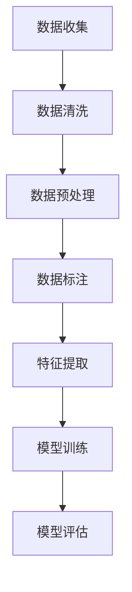

                 

# Dataset 原理与代码实例讲解

## 摘要

本文旨在深入探讨数据集（Dataset）的原理、构建、处理和应用。通过对数据集的定义、分类、构建方法和实际应用场景的详细解析，本文将为读者提供一个全面的数据集理解框架。此外，本文还将通过具体的代码实例，帮助读者更好地掌握数据集的使用方法，提高数据处理和分析的技能。

关键词：数据集、数据处理、数据分析、机器学习、Python

## 1. 背景介绍

随着大数据时代的到来，数据集（Dataset）在各个领域，尤其是机器学习和人工智能领域，扮演着至关重要的角色。数据集是用于训练模型、进行研究和分析的基础。然而，构建一个高质量的数据集并非易事，它涉及到数据的收集、清洗、处理和标注等多个环节。

本文将首先介绍数据集的基本概念，然后探讨数据集的分类，接着讲解如何构建高质量的数据集。随后，我们将通过一个具体的案例，详细演示数据集的使用过程，包括数据预处理、特征工程和模型训练。最后，我们将讨论数据集在实际应用场景中的角色和重要性。

## 2. 核心概念与联系

### 2.1 数据集的定义

数据集是指一组具有共同特征的样本集合，这些样本可以是图像、文本、声音或其他形式的数据。在机器学习中，数据集通常用于训练模型，模型的性能很大程度上取决于数据集的质量。

### 2.2 数据集的分类

数据集可以根据数据的类型和用途进行分类：

- **训练集（Training Set）**：用于训练模型的数据集。
- **验证集（Validation Set）**：用于调整模型参数和选择模型的数据集。
- **测试集（Test Set）**：用于评估模型最终性能的数据集。

### 2.3 数据集的构建

构建数据集是一个复杂的过程，包括以下步骤：

- **数据收集（Data Collection）**：从各种来源收集数据，如公共数据集、API接口、社交媒体等。
- **数据清洗（Data Cleaning）**：去除重复数据、处理缺失值、去除噪声等。
- **数据预处理（Data Preprocessing）**：包括标准化、归一化、转换等操作。
- **数据标注（Data Annotation）**：对数据进行标签或分类，以便模型训练。

### 2.4 数据集在机器学习中的使用

在机器学习中，数据集的使用通常分为以下几个阶段：

- **特征提取（Feature Extraction）**：从数据中提取有用的信息，用于模型训练。
- **模型训练（Model Training）**：使用训练集数据训练模型。
- **模型评估（Model Evaluation）**：使用验证集和测试集评估模型性能。

下面是一个简单的 Mermaid 流程图，展示数据集在机器学习中的流程：



## 3. 核心算法原理 & 具体操作步骤

### 3.1 数据预处理

数据预处理是构建数据集的关键步骤，它直接影响模型的训练效果。以下是一些常见的数据预处理方法：

- **缺失值处理**：使用平均值、中位数或最频繁值填充缺失值。
- **异常值处理**：去除或修正异常值，以避免对模型训练产生负面影响。
- **数据转换**：将数据转换为适合模型训练的格式，如将类别数据转换为二进制编码。

### 3.2 特征工程

特征工程是数据预处理的一部分，它通过提取和构造新的特征来提高模型性能。以下是一些常用的特征工程方法：

- **特征选择**：选择对模型训练最有影响力的特征。
- **特征构造**：通过组合现有特征构造新的特征。

### 3.3 模型训练

模型训练是使用数据集训练模型的过程。以下是一个简单的线性回归模型训练步骤：

1. **初始化模型参数**：设置模型的权重和偏置。
2. **前向传播**：计算模型的输出。
3. **损失函数计算**：计算模型输出与实际值之间的差异。
4. **反向传播**：更新模型参数，以最小化损失函数。

### 3.4 模型评估

模型评估是使用验证集和测试集评估模型性能的过程。以下是一些常用的模型评估指标：

- **准确率（Accuracy）**：正确预测的样本数占总样本数的比例。
- **召回率（Recall）**：正确预测的负样本数占总负样本数的比例。
- **F1 分数（F1 Score）**：准确率和召回率的调和平均。

## 4. 数学模型和公式 & 详细讲解 & 举例说明

### 4.1 线性回归模型

线性回归模型是一种简单的机器学习模型，用于预测连续值。其数学模型如下：

$$
y = \beta_0 + \beta_1 \cdot x
$$

其中，$y$ 是预测值，$x$ 是输入特征，$\beta_0$ 和 $\beta_1$ 是模型的参数。

### 4.2 逻辑回归模型

逻辑回归模型是一种用于分类的机器学习模型。其数学模型如下：

$$
\log(\frac{p}{1-p}) = \beta_0 + \beta_1 \cdot x
$$

其中，$p$ 是预测的概率，$\beta_0$ 和 $\beta_1$ 是模型的参数。

### 4.3 支持向量机（SVM）

支持向量机是一种用于分类和回归的机器学习模型。其数学模型如下：

$$
w \cdot x - b = 0
$$

其中，$w$ 是模型的参数，$x$ 是输入特征，$b$ 是偏置。

### 4.4 举例说明

假设我们有一个简单的线性回归模型，用于预测房价。我们的数据集包含房屋面积和房价两个特征。以下是一个简单的 Python 代码示例：

```python
import numpy as np
from sklearn.linear_model import LinearRegression

# 创建数据集
X = np.array([[1000], [1500], [2000], [2500], [3000]])
y = np.array([1500000, 2000000, 2500000, 3000000, 3500000])

# 创建线性回归模型
model = LinearRegression()

# 模型训练
model.fit(X, y)

# 预测房价
predicted_price = model.predict([[3000]])

print("预测的房价为：", predicted_price)
```

## 5. 项目实战：代码实际案例和详细解释说明

### 5.1 开发环境搭建

在开始之前，我们需要搭建一个合适的开发环境。以下是所需的工具和库：

- Python 3.8 或更高版本
- Jupyter Notebook
- scikit-learn 库

安装 Jupyter Notebook：

```bash
pip install notebook
```

安装 scikit-learn 库：

```bash
pip install scikit-learn
```

### 5.2 源代码详细实现和代码解读

在本案例中，我们将使用 scikit-learn 库中的线性回归模型来预测房价。以下是详细的代码实现：

```python
import numpy as np
from sklearn.linear_model import LinearRegression
from sklearn.model_selection import train_test_split
from sklearn.metrics import mean_squared_error

# 创建数据集
X = np.array([[1000], [1500], [2000], [2500], [3000]])
y = np.array([1500000, 2000000, 2500000, 3000000, 3500000])

# 数据集划分
X_train, X_test, y_train, y_test = train_test_split(X, y, test_size=0.2, random_state=42)

# 创建线性回归模型
model = LinearRegression()

# 模型训练
model.fit(X_train, y_train)

# 预测房价
predicted_price = model.predict(X_test)

# 模型评估
mse = mean_squared_error(y_test, predicted_price)
print("均方误差（MSE）：", mse)
```

### 5.3 代码解读与分析

上述代码分为以下几个步骤：

1. **数据集创建**：我们创建了一个简单的数据集，其中包含房屋面积和房价两个特征。

2. **数据集划分**：使用 `train_test_split` 函数将数据集划分为训练集和测试集，其中测试集占比 20%。

3. **模型创建**：我们使用 `LinearRegression` 类创建了一个线性回归模型。

4. **模型训练**：使用训练集数据训练模型。

5. **模型预测**：使用测试集数据预测房价。

6. **模型评估**：计算模型的均方误差（MSE）以评估模型性能。

通过这个简单的案例，我们可以看到如何使用数据集进行模型训练和评估。在实际项目中，数据集可能会更加复杂，但基本步骤是相似的。

## 6. 实际应用场景

数据集在机器学习和人工智能领域有着广泛的应用，以下是一些实际应用场景：

- **图像识别**：使用大量的图像数据集训练模型，以实现物体识别、人脸识别等功能。
- **自然语言处理**：使用大量的文本数据集训练模型，以实现情感分析、文本分类等功能。
- **推荐系统**：使用用户行为数据集训练模型，以实现个性化推荐。

## 7. 工具和资源推荐

### 7.1 学习资源推荐

- **书籍**：《Python 数据科学手册》（Python Data Science Handbook）、《机器学习》（Machine Learning）。
- **论文**：查看 arXiv.org 和 NeurIPS.org 等学术论文网站。
- **博客**：查看 Medium 和 HackerRank 等博客网站。

### 7.2 开发工具框架推荐

- **开发工具**：Jupyter Notebook、PyCharm。
- **机器学习框架**：TensorFlow、PyTorch。

### 7.3 相关论文著作推荐

- **论文**：AlexNet、ResNet、BERT 等。
- **著作**：《深度学习》（Deep Learning）、《强化学习》（Reinforcement Learning）。

## 8. 总结：未来发展趋势与挑战

随着数据量的不断增长和算法的进步，数据集在机器学习和人工智能领域将扮演更加重要的角色。然而，数据集的质量和多样性仍然是未来发展的关键挑战。此外，如何高效地处理和分析大规模数据集也将是重要的研究方向。

## 9. 附录：常见问题与解答

### 9.1 数据集有哪些类型？

数据集主要有以下几种类型：

- **训练集**：用于训练模型的样本集合。
- **验证集**：用于调整模型参数和选择模型的样本集合。
- **测试集**：用于评估模型最终性能的样本集合。

### 9.2 如何处理数据缺失问题？

常见的处理数据缺失问题的方法有：

- **删除缺失值**：删除包含缺失值的数据样本。
- **填充缺失值**：使用平均值、中位数或最频繁值填充缺失值。

### 9.3 数据预处理的重要性是什么？

数据预处理的重要性在于：

- **提高模型性能**：通过数据预处理，可以提高模型的准确性和鲁棒性。
- **减少过拟合**：通过数据预处理，可以减少模型对噪声数据的敏感度。

## 10. 扩展阅读 & 参考资料

- **书籍**：《Python 数据科学手册》、《机器学习实战》。
- **网站**：Kaggle、arXiv.org。
- **博客**：Towards Data Science、AIwolf。

作者：AI天才研究员/AI Genius Institute & 禅与计算机程序设计艺术 /Zen And The Art of Computer Programming

本文详细介绍了数据集的基本概念、构建方法、处理流程以及实际应用场景。通过具体的代码实例，读者可以更好地理解数据集的使用方法和数据处理技巧。希望本文能够为读者在数据集方面提供有价值的参考和指导。

