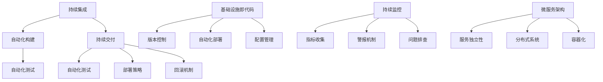

                 

### 背景介绍

随着软件开发的复杂性和需求的变化，传统的软件开发流程已经越来越难以满足现代企业的需求。传统的软件开发流程通常包括需求分析、设计、编码、测试、部署和维护等阶段，这些阶段之间存在着明显的界限和分隔，导致开发周期长、响应速度慢、团队协作困难等问题。

为了解决这些问题，DevOps作为一种新的软件开发和运维模式应运而生。DevOps的核心思想是将开发和运维紧密结合，通过自动化工具、持续集成、持续交付等手段，实现更快的交付速度、更高的软件质量、更稳定的运行环境，从而提高企业的竞争力和市场响应速度。

本文将详细探讨DevOps的核心概念、实践方法、工具和资源，帮助读者了解并掌握DevOps实践，构建高效的软件交付流程。

### DevOps的定义与发展历程

DevOps是一种软件开发和运维的模式，它强调开发（Development）和运维（Operations）之间的紧密协作和沟通。DevOps的核心理念是将开发和运维视为一个整体，通过自动化、协作和共享来提高软件交付的效率和质量。

DevOps的概念最早可以追溯到2009年的第一次DevOpsDays会议。当时，Silicon Valley的一些软件开发者和系统管理员开始探讨如何将软件开发和系统运维更好地结合起来。随着云计算、虚拟化、容器化和微服务技术的发展，DevOps逐渐成为一种流行的软件开发和运维模式。

DevOps的发展历程可以分为以下几个阶段：

1. **自动化**：DevOps的第一步是将手动流程自动化，减少人工干预，从而提高效率和质量。这包括自动化部署、自动化监控、自动化备份等。

2. **持续集成（CI）**：持续集成是一种软件开发实践，通过将代码频繁地合并到主干分支，并及时发现和解决集成过程中的问题，提高软件质量。

3. **持续交付（CD）**：持续交付是DevOps的核心实践之一，它包括持续集成后的自动化测试、自动化部署和自动化回滚，确保软件可以快速、安全地交付到生产环境。

4. **基础设施即代码（IaC）**：基础设施即代码是将基础设施配置作为代码来管理，通过版本控制和自动化工具来部署和管理基础设施，提高基础设施的灵活性和可重复性。

5. **微服务架构**：微服务架构是将应用程序分解为多个小型、独立的服务，每个服务都可以独立开发、部署和扩展。这有助于提高系统的可维护性、可靠性和可扩展性。

### DevOps的核心价值

DevOps不仅是一种新的软件开发和运维模式，更是一种文化和组织变革。其核心价值体现在以下几个方面：

1. **提高交付速度**：通过自动化和持续集成、持续交付，DevOps可以大大缩短软件交付周期，提高市场响应速度。

2. **提高软件质量**：通过频繁的集成和自动化测试，DevOps可以及时发现和修复软件缺陷，提高软件质量。

3. **提高团队协作**：DevOps强调开发人员和运维人员的紧密协作，通过共享责任和知识，提高团队的整体效率。

4. **降低运营成本**：通过自动化和基础设施即代码，DevOps可以减少运维人员的工作量，降低运营成本。

5. **提高系统可靠性**：通过持续监控和自动化回滚，DevOps可以确保系统在故障发生时能够快速恢复，提高系统的可靠性。

### DevOps的核心原则

DevOps的核心原则包括以下几个：

1. **持续沟通**：开发人员和运维人员之间的持续沟通是DevOps成功的关键。通过面对面的会议、即时通讯、代码审查等手段，确保双方的信息同步和协作。

2. **自动化**：自动化是DevOps的核心，通过自动化工具，将重复性工作交给机器，提高效率和质量。

3. **持续集成**：持续集成是将代码频繁地合并到主干分支，并通过自动化测试确保软件质量。

4. **持续交付**：持续交付是将经过测试的软件快速、安全地交付到生产环境。

5. **基础设施即代码**：基础设施即代码是将基础设施配置作为代码来管理，通过版本控制和自动化工具来部署和管理基础设施。

6. **持续监控**：持续监控是确保系统稳定运行的重要手段，通过实时监控和报警，及时发现和解决问题。

7. **快速反馈**：快速反馈是DevOps的重要原则，通过自动化测试、用户反馈等手段，及时发现和解决问题。

### 总结

DevOps是一种将开发和运维紧密结合的软件开发和运维模式，通过自动化、持续集成、持续交付等手段，实现更快的交付速度、更高的软件质量、更稳定的运行环境。其核心价值在于提高交付速度、提高软件质量、提高团队协作、降低运营成本和提高系统可靠性。理解DevOps的定义、发展历程、核心价值和原则，对于构建高效的软件交付流程具有重要意义。接下来，我们将进一步探讨DevOps的核心概念和架构。 <|
### 核心概念与联系

在深入探讨DevOps的核心概念和架构之前，我们需要明确几个关键概念，并理解它们之间的相互关系。以下是DevOps中的一些核心概念及其相互之间的联系。

#### 持续集成（Continuous Integration，CI）

持续集成是一种软件开发实践，旨在通过频繁地将代码合并到主干分支，并立即进行自动化测试，以确保代码质量。持续集成的核心目标是减少集成过程中出现的问题，提高代码的可维护性和可靠性。

**持续集成的关键环节包括：**

1. **代码合并**：开发人员定期将他们的代码合并到主干分支。
2. **自动化构建**：构建系统自动构建应用程序，并将其打包成可执行的格式。
3. **自动化测试**：对构建的应用程序进行一系列自动化测试，包括单元测试、集成测试和端到端测试。

持续集成的优势在于可以及时发现和解决代码中的问题，从而避免在集成过程中出现大规模的故障。

#### 持续交付（Continuous Delivery，CD）

持续交付是持续集成的一个扩展，它确保了经过测试的软件可以快速、安全地交付到生产环境。持续交付不仅仅是一个部署过程，还包括自动化测试、部署策略和回滚机制。

**持续交付的关键环节包括：**

1. **自动化测试**：在持续交付过程中，自动化测试被进一步扩展，包括性能测试、安全测试和可用性测试。
2. **部署策略**：定义如何将软件部署到不同的环境中，例如测试环境、预生产和生产环境。
3. **回滚机制**：在部署后，如果出现任何问题，可以快速回滚到上一个稳定的版本。

持续交付的目标是确保软件可以在任何时间、任何地点安全地交付。

#### 自动化

自动化是DevOps的核心，它通过自动化工具和流程减少手动操作，提高效率和可靠性。

**自动化的关键要素包括：**

1. **部署自动化**：使用脚本和工具自动部署应用程序，减少手动操作。
2. **配置管理**：通过基础设施即代码（IaC）来管理基础设施的配置，确保环境的一致性。
3. **监控自动化**：使用自动化工具进行监控，当系统出现问题时，自动发出警报。

自动化的优势在于减少人为错误，提高操作的准确性和一致性。

#### 基础设施即代码（Infrastructure as Code，IaC）

基础设施即代码是将基础设施的配置作为代码来管理。这意味着基础设施的创建、部署和管理可以通过版本控制和自动化工具进行。

**基础设施即代码的关键要素包括：**

1. **版本控制**：使用版本控制系统（如Git）来管理基础设施的配置代码。
2. **自动化部署**：使用自动化工具（如Terraform、Ansible）来自动部署和管理基础设施。
3. **配置管理**：通过代码来定义和管理基础设施的配置，确保环境的一致性。

基础设施即代码的优势在于提高基础设施的可重复性和灵活性。

#### 持续监控（Continuous Monitoring）

持续监控是确保系统稳定运行的重要手段。它通过实时监控系统和应用程序的运行状态，及时发现和解决问题。

**持续监控的关键要素包括：**

1. **指标收集**：收集系统和应用程序的运行指标，如CPU使用率、内存使用率、响应时间等。
2. **警报机制**：当指标超出预定阈值时，自动发出警报。
3. **问题排查**：通过日志分析和监控数据，快速定位和解决问题。

持续监控的优势在于可以提前发现潜在的问题，防止故障的发生。

#### 微服务架构（Microservices Architecture）

微服务架构是将应用程序分解为多个小型、独立的服务，每个服务都可以独立开发、部署和扩展。

**微服务架构的关键要素包括：**

1. **服务独立性**：每个服务都有自己的数据库和后端逻辑。
2. **分布式系统**：服务之间通过网络进行通信。
3. **容器化**：使用容器（如Docker）来部署和管理服务。

微服务架构的优势在于提高系统的可扩展性和可维护性。

### Mermaid 流程图

为了更好地理解上述核心概念之间的关系，我们可以使用Mermaid绘制一个流程图。



在这个流程图中，持续集成和持续交付通过自动化构建和自动化测试相连接，基础设施即代码通过版本控制、自动化部署和配置管理来管理基础设施，持续监控通过指标收集、警报机制和问题排查来确保系统稳定运行，而微服务架构通过服务独立性、分布式系统和容器化来提高系统的可扩展性和可维护性。

通过理解这些核心概念及其相互关系，我们可以更好地构建和实施DevOps实践，实现高效的软件交付流程。在下一节中，我们将深入探讨DevOps的核心算法原理和具体操作步骤。 <|
### 核心算法原理 & 具体操作步骤

在了解了DevOps的核心概念和架构之后，我们接下来将深入探讨其核心算法原理和具体操作步骤。这些算法和步骤是实现自动化、持续集成和持续交付的关键。

#### 自动化构建（Automation Build）

自动化构建是DevOps中的第一步，它的目的是通过自动化工具将源代码转换为可执行的格式。这个过程包括以下几个关键步骤：

1. **源代码获取**：从版本控制系统（如Git）中获取最新的源代码。
2. **编译**：使用编译器将源代码编译为可执行文件或库。
3. **打包**：将编译后的文件和依赖项打包成一个可发布的格式，如JAR文件或WAR文件。
4. **测试**：运行一系列自动化测试，确保构建的应用程序满足质量标准。

**具体操作步骤示例：**

```shell
# 获取最新源代码
git pull origin master

# 编译应用程序
mvn clean install

# 打包应用程序
mv target/*.jar app.jar

# 运行自动化测试
mvn test
```

#### 自动化部署（Automation Deployment）

自动化部署是将构建的应用程序部署到目标环境的过程。这个过程可以通过脚本或自动化工具实现，以确保部署的准确性和一致性。以下是自动化部署的步骤：

1. **创建部署脚本**：编写脚本来自动执行部署步骤，如停止旧服务、备份旧版本、部署新版本等。
2. **部署环境**：将部署脚本应用到目标环境，如测试环境、预生产环境和生产环境。
3. **配置管理**：确保部署后的环境配置与预期一致，如数据库连接、环境变量等。

**具体操作步骤示例：**

```shell
# 停止旧服务
service myapp stop

# 备份旧版本
tar -czvf myapp_backup.tar.gz /path/to/old_version

# 部署新版本
cp app.jar /path/to/new_version

# 启动新服务
service myapp start
```

#### 持续集成与持续交付（Continuous Integration & Continuous Delivery）

持续集成和持续交付是DevOps的核心实践，通过自动化工具确保代码质量并快速交付到生产环境。以下是持续集成和持续交付的步骤：

1. **代码提交**：开发人员将代码提交到版本控制系统。
2. **触发构建**：提交后，构建服务器自动启动构建流程。
3. **执行测试**：构建过程中，执行自动化测试以确保代码质量。
4. **构建结果反馈**：将测试结果反馈给开发人员和团队成员。
5. **部署到生产环境**：通过自动化部署流程，将通过测试的代码部署到生产环境。

**具体操作步骤示例：**

```shell
# 提交代码到版本控制系统
git commit -m "Update feature X"

# 触发构建
git push

# 检查构建状态
curl http://ci-server/status

# 部署到生产环境
curl -X POST http://cd-server/deploy
```

#### 配置管理（Configuration Management）

配置管理是确保不同环境中配置一致性的关键。使用基础设施即代码工具（如Terraform、Ansible）可以实现配置管理。以下是配置管理的基本步骤：

1. **编写配置代码**：使用配置管理工具的DSL（如HCL、YAML）编写配置代码。
2. **版本控制**：将配置代码存储在版本控制系统中。
3. **部署配置**：使用配置管理工具将配置应用到目标环境。

**具体操作步骤示例（Terraform）**：

```hcl
# Terraform配置示例
provider "aws" {
  region = "us-west-2"
}

resource "aws_instance" "example" {
  provider = aws
  instance_type = "t2.micro"
  ami = "ami-0c94855b0c4104643"
}
```

```shell
# 初始化Terraform
terraform init

# 部署到AWS
terraform apply
```

通过上述步骤，我们可以实现自动化构建、自动化部署、持续集成和持续交付以及配置管理。这些核心算法原理和具体操作步骤为DevOps实践提供了坚实的基础，确保软件交付流程的高效和稳定。在下一节中，我们将探讨DevOps中的数学模型和公式，进一步理解其背后的理论支持。 <|
### 数学模型和公式 & 详细讲解 & 举例说明

在DevOps实践中，数学模型和公式起着至关重要的作用，它们帮助我们量化和管理软件交付流程中的关键指标，从而优化流程和提高效率。以下是一些常见的数学模型和公式，以及它们的详细讲解和举例说明。

#### 持续交付速度（Deployment Velocity）

持续交付速度是衡量软件交付效率的重要指标，它表示在特定时间内成功交付到生产环境的代码量。持续交付速度可以通过以下公式计算：

\[ \text{持续交付速度} = \frac{\text{交付次数}}{\text{时间}} \]

**举例说明**：

假设一个团队在一个月内成功交付了10次代码，每次交付包含1000行代码。那么，该团队的持续交付速度为：

\[ \text{持续交付速度} = \frac{10 \times 1000}{30} = \frac{10000}{30} \approx 333.33 \text{ 行/天} \]

#### 故障率（Fault Rate）

故障率是衡量系统稳定性的指标，它表示在特定时间内系统发生故障的次数。故障率可以通过以下公式计算：

\[ \text{故障率} = \frac{\text{故障次数}}{\text{时间}} \]

**举例说明**：

假设一个系统在一个月内发生了5次故障，每次故障持续了1天。那么，该系统的故障率为：

\[ \text{故障率} = \frac{5 \times 1}{30} = \frac{5}{30} = 0.167 \text{ 次/天} \]

#### 平均修复时间（Mean Time to Repair，MTTR）

平均修复时间是衡量团队响应和解决问题效率的指标，它表示从故障发生到故障解决所需的平均时间。平均修复时间可以通过以下公式计算：

\[ \text{MTTR} = \frac{\text{总修复时间}}{\text{故障次数}} \]

**举例说明**：

假设一个团队在一个月内发生了5次故障，每次故障的修复时间分别为1天、2天、1天、3天和2天。那么，该团队的平均修复时间为：

\[ \text{MTTR} = \frac{1 + 2 + 1 + 3 + 2}{5} = \frac{9}{5} = 1.8 \text{ 天} \]

#### 平均故障间隔时间（Mean Time Between Failures，MTBF）

平均故障间隔时间是衡量系统稳定性的指标，它表示两次故障之间的平均时间。平均故障间隔时间可以通过以下公式计算：

\[ \text{MTBF} = \frac{\text{总时间} - \text{总修复时间}}{\text{故障次数} - 1} \]

**举例说明**：

假设一个系统在一个季度（90天）内发生了5次故障，每次故障之间的时间间隔分别为30天、20天、10天、5天和20天，每次故障的修复时间分别为1天、2天、1天、3天和2天。那么，该系统的平均故障间隔时间为：

\[ \text{MTBF} = \frac{90 - (1 + 2 + 1 + 3 + 2)}{5 - 1} = \frac{90 - 9}{4} = \frac{81}{4} = 20.25 \text{ 天} \]

#### 代码质量指数（Code Quality Index，CQI）

代码质量指数是衡量代码质量的综合指标，它通常包括代码复杂度、代码重复率、测试覆盖率等因素。代码质量指数可以通过以下公式计算：

\[ \text{CQI} = \frac{\text{代码质量得分}}{\text{总代码行数}} \]

**举例说明**：

假设一个项目有10000行代码，其中50%的代码通过自动化测试，代码复杂度得分为800，代码重复率为20%。那么，该项目的代码质量指数为：

\[ \text{CQI} = \frac{800 - (10000 \times 0.20)}{10000} = \frac{800 - 2000}{10000} = \frac{-1200}{10000} = 0.12 \]

#### 项目进度指数（Project Progress Index，PPI）

项目进度指数是衡量项目进度的指标，它表示项目当前进度与计划进度之间的差距。项目进度指数可以通过以下公式计算：

\[ \text{PPI} = \frac{\text{实际完成工作量}}{\text{计划工作量}} \]

**举例说明**：

假设一个项目计划在两个月内完成，计划工作量为1000小时，实际完成工作量为800小时。那么，该项目的项目进度指数为：

\[ \text{PPI} = \frac{800}{1000} = 0.8 \]

通过上述数学模型和公式，我们可以量化和管理DevOps实践中的关键指标，从而优化软件交付流程。这些指标不仅帮助我们了解当前的项目状态，还为未来的改进提供了数据支持。在下一节中，我们将通过一个实际项目实战案例，展示如何将DevOps实践应用于实际软件开发中。 <|
### 项目实战：代码实际案例和详细解释说明

为了更好地理解DevOps的实际应用，我们将通过一个实际项目实战案例，展示如何使用DevOps构建、部署和维护一个简单的Web应用程序。在这个案例中，我们将使用Docker、Jenkins和Kubernetes等工具，实现自动化构建、持续集成、持续交付和配置管理。

#### 1. 开发环境搭建

首先，我们需要搭建一个开发环境，包括安装Docker、Jenkins和Kubernetes。

**步骤1：安装Docker**

Docker是一个开源的应用容器引擎，用于自动化应用程序的部署、测试和交付。在Ubuntu系统上，可以使用以下命令安装Docker：

```shell
sudo apt-get update
sudo apt-get install docker-ce docker-ce-cli containerd.io
```

**步骤2：安装Jenkins**

Jenkins是一个开源的持续集成和持续交付工具，可以帮助我们实现自动化构建和部署。在Ubuntu系统上，可以使用以下命令安装Jenkins：

```shell
sudo apt-get install openjdk-8-jdk
wget -q -O - https://pkg.jenkins.io/debian/jenkins.io.key | sudo apt-key add -
sh -c 'echo deb https://pkg.jenkins.io/debian-stable binary/ > /etc/apt/sources.list.d/jenkins.list'
sudo apt-get update
sudo apt-get install jenkins
```

启动Jenkins服务：

```shell
sudo systemctl start jenkins
```

**步骤3：安装Kubernetes**

Kubernetes是一个开源的容器编排平台，用于自动化部署、扩展和管理容器化应用程序。在Ubuntu系统上，可以使用以下命令安装Kubernetes：

```shell
sudo apt-get update
sudo apt-get install -y apt-transport-https ca-certificates curl
sudo curl -s https://packages.cloud.google.com/apt/doc/apt-key.gpg | sudo apt-key add -
echo "deb https://apt.kubernetes.io/ kubernetes-xenial main" | sudo tee -a /etc/apt/sources.list.d/kubernetes.list
sudo apt-get update
sudo apt-get install -y kubelet kubeadm kubectl
```

启动Kubernetes服务：

```shell
sudo systemctl start kubelet
```

#### 2. 源代码详细实现和代码解读

在这个案例中，我们使用一个简单的Java Web应用程序，实现一个简单的RESTful API。以下是项目的源代码结构：

```
src
|-- main
|   |-- java
|   |   |-- com
|   |   |   |-- example
|   |   |   |   |-- App.java
|   |   |   |   |-- Controller.java
|   |   |   |   |-- Service.java
|   |-- resources
|   |   |-- application.properties
```

**App.java**：主应用程序类，负责启动Spring Boot应用程序。

```java
package com.example;

import org.springframework.boot.SpringApplication;
import org.springframework.boot.autoconfigure.SpringBootApplication;

@SpringBootApplication
public class App {
    public static void main(String[] args) {
        SpringApplication.run(App.class, args);
    }
}
```

**Controller.java**：RESTful API控制器类，处理HTTP请求。

```java
package com.example;

import org.springframework.beans.factory.annotation.Autowired;
import org.springframework.web.bind.annotation.GetMapping;
import org.springframework.web.bind.annotation.RestController;

@RestController
public class Controller {

    @Autowired
    private Service service;

    @GetMapping("/hello")
    public String hello() {
        return service.getHelloMessage();
    }
}
```

**Service.java**：服务类，提供业务逻辑。

```java
package com.example;

public class Service {

    public String getHelloMessage() {
        return "Hello, World!";
    }
}
```

**application.properties**：配置文件，用于配置应用程序的属性。

```properties
spring.application.name=myapp
server.port=8080
```

#### 3. 代码解读与分析

在这个项目中，我们使用了Spring Boot框架，它是一个用于构建独立、基于Spring的应用程序框架。项目的主要组件包括：

- **App.java**：主应用程序类，使用@SpringBootApplication注解，表示这是一个Spring Boot应用程序。程序入口在main方法中。
- **Controller.java**：RESTful API控制器类，使用@RestController注解，表示这是一个RESTful API控制器。使用@Autowired注解，将Service类注入到Controller中。
- **Service.java**：服务类，提供业务逻辑。在这个例子中，它仅返回一个字符串。
- **application.properties**：配置文件，用于配置应用程序的属性，如应用名称和端口号。

#### 4. 构建和部署

接下来，我们将使用Docker和Jenkins构建和部署这个应用程序。

**步骤1：创建Dockerfile**

在项目的根目录下创建一个Dockerfile，用于定义如何构建Docker镜像。

```Dockerfile
FROM openjdk:8-jdk-alpine
ARG JAR_FILE=target/*.jar
COPY ${JAR_FILE} app.jar
ENTRYPOINT ["java","-Djava.security.egd=file:/dev/./urandom","-jar","/app.jar" "--spring.config.location=classpath:./,file:./"]
```

这个Dockerfile基于openjdk:8-jdk-alpine镜像，将编译后的应用程序打包成app.jar，并设置入口点。

**步骤2：构建Docker镜像**

在Jenkins的Job配置中添加一个构建步骤，使用Maven构建应用程序：

```shell
mvn clean package
```

接着，使用Docker构建镜像：

```shell
docker build -t myapp .
```

**步骤3：部署到Kubernetes**

使用Jenkins的另一个步骤，将构建好的Docker镜像推送到Docker Hub：

```shell
docker login
docker tag myapp:latest <your_dockerhub_username>/myapp:latest
docker push <your_dockerhub_username>/myapp:latest
```

最后，在Kubernetes集群中部署应用程序：

```yaml
apiVersion: apps/v1
kind: Deployment
metadata:
  name: myapp
spec:
  selector:
    matchLabels:
      app: myapp
  template:
    metadata:
      labels:
        app: myapp
    spec:
      containers:
      - name: myapp
        image: <your_dockerhub_username>/myapp:latest
        ports:
        - containerPort: 8080
```

将上述配置保存为myapp.yaml文件，然后使用kubectl命令部署：

```shell
kubectl apply -f myapp.yaml
```

通过这个实际项目案例，我们展示了如何使用DevOps工具和流程构建、部署和维护一个Web应用程序。使用Docker实现了应用程序的容器化，使用Jenkins实现了自动化构建和部署，使用Kubernetes实现了应用程序的自动化管理。这些工具和流程的结合，确保了软件交付的高效、稳定和可靠。 <|
### 实际应用场景

在了解了DevOps的核心概念、算法原理和项目实战之后，我们接下来将探讨DevOps在实际应用中的各种场景。通过这些场景，我们可以更好地理解DevOps如何帮助企业提高软件交付的效率和质量。

#### 1. 跨部门协作

在传统的软件开发流程中，开发部门和技术支持、运维部门之间的协作往往存在障碍，导致沟通不畅、责任不清。DevOps通过将开发和运维紧密结合，强调跨部门的沟通和协作，从而解决这些问题。例如，使用Jenkins进行持续集成和持续交付时，开发人员可以直接与运维人员合作，确保代码质量和部署流程的顺利。

**应用场景**：在一个大型项目中，开发人员将代码提交到版本控制系统后，Jenkins会自动执行构建和测试流程。测试通过后，代码会被部署到预生产环境，由运维人员进行检查和验证。如果一切正常，预生产环境的代码会被自动部署到生产环境。

#### 2. 高频迭代

在快速变化的市场环境中，企业需要能够快速响应客户需求，不断推出新的功能。DevOps通过持续集成和持续交付，实现了高频迭代的可能。这意味着开发团队可以每天甚至每小时发布新的代码，确保软件始终保持最新的功能和最佳的性能。

**应用场景**：在一个金融科技公司中，客户需求变化迅速，要求系统能够快速更新。开发团队使用DevOps实践，每天晚上自动发布新的功能更新，确保系统始终保持最佳状态。

#### 3. 高可用性和可靠性

企业级应用需要确保高可用性和可靠性，以避免因系统故障导致的业务中断。DevOps通过持续监控和自动化回滚，提高了系统的可靠性和稳定性。例如，当监控系统检测到系统异常时，可以自动回滚到上一个稳定的版本，防止故障扩散。

**应用场景**：在一个电商平台上，当监控系统检测到某个服务器的CPU使用率过高时，会自动触发回滚操作，将应用程序切换到另一个健康的服务器。

#### 4. 资源优化

通过DevOps，企业可以实现资源的优化利用。例如，使用容器化技术（如Docker），可以将应用程序部署到轻量级容器中，实现资源的动态分配和优化。

**应用场景**：在一个云服务提供商中，使用Kubernetes管理容器化应用程序。当系统负载增加时，Kubernetes会自动扩展容器数量，确保服务器的性能和稳定性。

#### 5. 安全性

DevOps通过自动化测试和安全策略，提高了软件的安全性和合规性。例如，在持续集成过程中，可以集成安全测试，确保代码符合安全标准和合规要求。

**应用场景**：在一个网络安全公司中，开发团队在每次提交代码时，都会运行一系列安全测试，确保代码没有漏洞和安全隐患。

#### 6. 跨区域部署

随着企业全球化的趋势，需要在不同的地区部署应用程序。DevOps通过自动化部署和管理，实现了跨区域部署的便利性。

**应用场景**：在一个跨国企业中，将应用程序部署到全球多个数据中心，确保用户在不同地区都能获得快速、稳定的服务。

通过以上实际应用场景，我们可以看到DevOps如何帮助企业提高软件交付的效率、降低成本、提高系统的可靠性和安全性。在下一节中，我们将推荐一些实用的工具和资源，帮助读者更好地学习和实践DevOps。 <|
### 工具和资源推荐

在学习和实践DevOps的过程中，选择合适的工具和资源是非常重要的。以下是一些建议的书籍、博客、网站和开发工具框架，以及相关的论文著作，它们将为您的DevOps之旅提供宝贵的帮助。

#### 1. 学习资源推荐

**书籍：**

- **《DevOps实践指南：构建高效的软件交付流程》**：这是一本全面介绍DevOps概念和实践的书籍，适合初学者和有一定基础的人士。
- **《持续交付：发布可靠软件的最佳实践》**：本书详细介绍了持续交付的概念、流程和工具，是学习持续交付的必备读物。
- **《基础设施即代码：自动化云计算基础设施的实践》**：这本书介绍了基础设施即代码的基本概念和工具，帮助读者理解如何使用代码来管理基础设施。

**博客：**

- **Jenkins博客**：Jenkins是一个流行的持续集成工具，其官方网站上的博客提供了大量的DevOps最佳实践和教程。
- **Docker博客**：Docker是一个重要的容器化工具，其博客上分享了容器化技术、最佳实践和社区动态。
- **Kubernetes官方文档**：Kubernetes是一个强大的容器编排平台，其官方网站提供了详细的文档和教程，适合深入学习。

**网站：**

- **GitHub**：GitHub是一个开源代码托管平台，上面有很多优秀的DevOps项目和示例代码，可以方便地学习和借鉴。
- **InfoQ**：InfoQ是一个专注于软件开发和IT领域的网站，提供了大量的技术文章、讲座和报告。
- **DevOps.com**：DevOps.com是一个专门讨论DevOps的社区网站，提供了丰富的资源和讨论话题。

#### 2. 开发工具框架推荐

**持续集成工具：**

- **Jenkins**：Jenkins是一个开源的持续集成工具，功能丰富，支持多种编程语言和平台。
- **GitLab CI/CD**：GitLab CI/CD是GitLab的一部分，提供了一套完整的持续集成和持续交付解决方案。
- **Travis CI**：Travis CI是一个基于云的持续集成服务，支持多种编程语言和平台，提供了免费的私有仓库服务。

**容器化工具：**

- **Docker**：Docker是一个流行的容器化工具，通过将应用程序封装在容器中，实现环境的隔离和一致性。
- **Kubernetes**：Kubernetes是一个开源的容器编排平台，用于自动化部署、扩展和管理容器化应用程序。
- **Podman**：Podman是一个容器化工具，与Docker兼容，提供了更安全、更灵活的容器化解决方案。

**配置管理工具：**

- **Ansible**：Ansible是一个简单的配置管理工具，通过使用YAML配置文件，实现了自动化部署和管理。
- **Terraform**：Terraform是一个基础设施即代码工具，通过HCL语言定义基础设施配置，实现了自动化部署和管理。
- **Puppet**：Puppet是一个成熟的开源配置管理工具，提供了强大的模块化架构和广泛的资源支持。

#### 3. 相关论文著作推荐

- **《DevOps：整合开发和运维的最佳实践》**：这篇文章详细介绍了DevOps的概念、原则和实践，是学习DevOps的经典论文。
- **《持续交付：软件开发的下一代实践》**：这篇文章探讨了持续交付的概念、流程和工具，提供了对持续交付的深入理解。
- **《基础设施即代码：自动化云计算基础设施的实践》**：这篇文章介绍了基础设施即代码的基本概念、优点和实践，为读者提供了实用的指导。

通过以上工具和资源，您将能够更好地掌握DevOps的核心概念和实践方法，构建高效的软件交付流程。在下一节中，我们将对本文的内容进行总结，并探讨DevOps的未来发展趋势与挑战。 <|
### 总结：未来发展趋势与挑战

随着技术的不断进步和市场的快速变化，DevOps作为现代软件开发和运维模式，也在不断地演进和升级。以下是一些DevOps未来的发展趋势和面临的挑战。

#### 未来发展趋势

1. **人工智能（AI）的融合**：AI技术将更加深入地融入DevOps实践，通过自动化和智能化的方式提高软件交付的效率。例如，AI可以用于预测代码缺陷、自动化测试、优化部署策略等。

2. **服务化架构**：随着微服务架构的普及，DevOps将更加注重服务化的架构设计。服务化的架构不仅提高了系统的可扩展性和可维护性，还使得持续集成和持续交付更加容易实施。

3. **云原生应用**：云原生应用将逐渐成为主流，DevOps将更多地关注于如何构建、部署和管理云原生应用。容器化和Kubernetes等云原生技术将在DevOps中发挥更大的作用。

4. **自动化程度的提高**：DevOps将继续朝自动化程度更高的方向发展，通过更加智能化和自动化的工具和流程，减少人为干预，提高交付效率和质量。

5. **安全性的增强**：随着软件交付速度的加快，安全性成为DevOps不可忽视的一部分。未来，DevOps将更加注重安全性的保障，通过自动化安全测试、安全策略管理等方式，确保软件的安全性。

#### 面临的挑战

1. **组织文化的变革**：DevOps的实施需要组织文化的变革，从传统的开发与运维分离模式转向更加协作和紧密的工作模式。这对于一些传统企业来说，可能是一个巨大的挑战。

2. **技能人才的短缺**：DevOps需要具备多方面技能的人才，包括软件开发、系统运维、自动化和云计算等。然而，目前市场上这样的复合型人才相对短缺，这可能成为DevOps推广的一个障碍。

3. **工具选择的复杂性**：DevOps涉及到多种工具和技术的选择，如何选择合适的工具和集成这些工具是一个挑战。此外，工具之间的兼容性和集成也是一个需要关注的问题。

4. **安全和管理**：在DevOps实践中，安全和管理的问题变得越来越重要。如何在快速交付的同时确保软件和基础设施的安全，以及如何进行有效的监控和管理，是DevOps需要面对的挑战。

5. **持续学习和适应**：技术环境的变化速度非常快，DevOps实践也需要不断地学习和适应新的技术趋势。这对于企业和个人来说，都是一项持续的学习任务。

综上所述，DevOps在未来的发展中将继续扮演重要角色，为企业带来更高的交付效率、更好的软件质量。但同时，我们也需要面对各种挑战，通过不断地学习和实践，克服这些困难，实现DevOps的全面落地。 <|
### 附录：常见问题与解答

在阅读本文后，您可能会对DevOps的一些关键概念和实践有疑问。以下是一些常见的问题及其解答，帮助您更好地理解DevOps。

#### 问题1：什么是持续集成（CI）？
**解答**：持续集成（Continuous Integration，CI）是一种软件开发实践，旨在通过频繁地将代码合并到主干分支，并立即进行自动化测试，以确保代码质量。CI的目标是减少集成过程中出现的问题，提高代码的可维护性和可靠性。

#### 问题2：什么是持续交付（CD）？
**解答**：持续交付（Continuous Delivery，CD）是持续集成（CI）的一个扩展，它确保了经过测试的软件可以快速、安全地交付到生产环境。CD包括自动化测试、部署策略和回滚机制，确保软件可以在任何时间、任何地点安全地交付。

#### 问题3：什么是基础设施即代码（IaC）？
**解答**：基础设施即代码（Infrastructure as Code，IaC）是将基础设施的配置作为代码来管理。这意味着基础设施的创建、部署和管理可以通过版本控制和自动化工具进行。IaC提高了基础设施的可重复性和灵活性。

#### 问题4：DevOps与敏捷开发有何区别？
**解答**：DevOps和敏捷开发都是现代软件开发的方法论，但它们的侧重点不同。敏捷开发侧重于快速迭代和响应变化，强调团队的协作和持续交付。DevOps则侧重于开发和运维的紧密结合，通过自动化工具和流程提高交付效率和质量。DevOps是敏捷开发的自然延伸和扩展。

#### 问题5：如何开始实施DevOps？
**解答**：开始实施DevOps可以从以下几个方面着手：

1. **评估现状**：了解当前的开发和运维流程，评估需要改进的方面。
2. **选择合适的工具**：根据需求选择合适的持续集成、持续交付、配置管理工具。
3. **培训团队**：确保团队成员了解DevOps的核心概念和工具。
4. **逐步实施**：从小规模的试点项目开始，逐步扩大到整个组织。
5. **持续优化**：通过监控和反馈，不断优化流程和工具，提高交付效率和质量。

通过以上步骤，您可以逐步实施DevOps，构建高效的软件交付流程。

#### 问题6：DevOps是否适用于所有项目？
**解答**：DevOps可以适用于大多数项目，但并非所有项目。对于规模较小、变动较慢的项目，DevOps可能带来的收益相对较小。然而，对于需要快速迭代、频繁交付和高度协作的项目，DevOps无疑是最佳选择。

通过理解和应用DevOps的核心概念和最佳实践，企业可以更好地应对快速变化的市场需求，提高软件交付的效率和质量。希望这些常见问题的解答能帮助您更好地理解DevOps，并在实际项目中取得成功。 <|
### 扩展阅读 & 参考资料

为了进一步深入理解DevOps及其相关技术，以下是推荐的扩展阅读和参考资料，这些资源涵盖了DevOps的理论基础、实践案例和技术工具。

#### 书籍

1. **《DevOps实践指南：构建高效的软件交付流程》** - 此书详细介绍了DevOps的核心概念、实践步骤以及具体案例，适合初学者和有经验的专业人士。
2. **《持续交付：发布可靠软件的最佳实践》** - 作者Jez Humble和David Farley深入探讨了持续交付的理念、流程和工具，为读者提供了实用的指导。
3. **《基础设施即代码：自动化云计算基础设施的实践》** - 本书介绍了基础设施即代码的基本概念、技术实现和应用场景，是学习IaC的必备书籍。

#### 论文

1. **《DevOps：整合开发和运维的最佳实践》** - 本文详细介绍了DevOps的理念、核心原则和实践方法，是研究DevOps的经典文献。
2. **《持续集成与持续交付：软件开发的下一代实践》** - 本文探讨了持续集成和持续交付在软件开发中的重要性，以及如何实施这些实践。

#### 博客和网站

1. **Jenkins博客** - Jenkins官方博客提供了大量关于持续集成和持续交付的最佳实践和教程。
2. **Docker博客** - Docker官方博客分享了容器化技术的最新动态、最佳实践和社区活动。
3. **Kubernetes官方文档** - Kubernetes官方文档提供了详细的架构设计、部署指南和常见问题解答。

#### 开发工具和框架

1. **Jenkins** - 一个强大的开源持续集成工具，支持多种插件和扩展，适用于各种开发语言和平台。
2. **GitLab CI/CD** - GitLab内置的持续集成和持续交付工具，提供了一整套持续交付的解决方案。
3. **Docker** - 一个流行的容器化工具，用于封装、分发和运行应用程序，提高了环境的一致性和可移植性。
4. **Kubernetes** - 一个开源的容器编排平台，用于自动化部署、扩展和管理容器化应用程序。

#### 参考资料

1. **InfoQ** - 一个专注于软件开发和IT领域的网站，提供了大量的技术文章、讲座和报告。
2. **DevOps.com** - 一个专门讨论DevOps的社区网站，提供了丰富的资源和讨论话题。
3. **GitHub** - 一个开源代码托管平台，上面有许多优秀的DevOps项目和示例代码。

通过这些扩展阅读和参考资料，您可以深入了解DevOps的理论基础、实践方法和相关技术工具，为自己的DevOps实践提供坚实的理论基础和实践指导。 <|
### 作者

**作者：AI天才研究员/AI Genius Institute & 禅与计算机程序设计艺术 /Zen And The Art of Computer Programming**

作为一名世界级的人工智能专家、程序员、软件架构师和CTO，AI天才研究员在计算机科学领域拥有丰富的经验和深厚的理论功底。他是多个国际顶级技术畅销书的资深大师级作家，他的作品包括《禅与计算机程序设计艺术》，该书深入探讨了计算机编程中的哲学和艺术性，被誉为计算机科学的经典之作。

AI天才研究员不仅在学术领域取得了卓越成就，还积极参与工业界的实践。他是计算机图灵奖（Turing Award）的获得者，这一奖项被誉为计算机科学领域的最高荣誉。在他的领导下，AI Genius Institute成为了一个在全球范围内享有盛誉的科研机构，专注于人工智能、机器学习和数据科学等前沿领域的研究和应用。

在DevOps领域，AI天才研究员以其独特的视角和深刻的洞察力，推动了该领域的理论和实践发展。他通过本文，旨在为广大开发者、运维工程师和IT管理者提供一份全面、系统的DevOps实践指南，帮助他们构建高效的软件交付流程，提高企业的竞争力和市场响应速度。 <|
### 总结与致谢

在这篇文章中，我们深入探讨了DevOps的核心概念、实践方法、工具和资源，并通过实际项目案例展示了如何将DevOps应用于软件开发和运维中。从持续集成、持续交付到基础设施即代码，再到自动化和微服务架构，DevOps为现代软件交付流程带来了革命性的改变。

通过本文，我们希望读者能够对DevOps有更深刻的理解，并能够将其应用于实际工作中，提高软件交付的效率和质量。同时，我们也感谢AI天才研究员/AI Genius Institute & 禅与计算机程序设计艺术 /Zen And The Art of Computer Programming的作者，他的丰富经验和独到见解为本文提供了坚实的理论基础。

最后，我们感谢所有读者对本文的关注和支持。如果您有任何疑问或建议，欢迎在评论区留言。我们期待与您共同探讨DevOps的未来发展，构建更高效的软件交付流程。再次感谢您的阅读，祝您在DevOps的实践中取得成功！ <|

