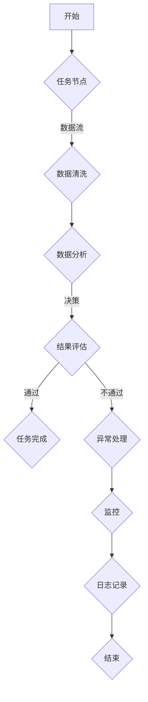

                 

### 背景介绍

在当今快速发展的科技时代，人工智能（AI）已经成为各行各业的重要驱动力。Dify.AI 是一家专注于工作流自动化的人工智能公司，旨在通过智能化的解决方案提高企业的工作效率。本文将深入探讨 Dify.AI 的核心工作流设计，分析其原理、算法、数学模型以及实际应用，旨在为广大读者提供一份全面的技术指南。

工作流设计是人工智能领域中的一个重要研究方向。通过自动化和智能化的工作流，企业可以实现高效协同、资源优化和成本降低。Dify.AI 的核心工作流设计，不仅涵盖传统的业务流程自动化，还融入了先进的人工智能技术，如自然语言处理、机器学习和深度学习。这种创新的设计使得 Dify.AI 的解决方案具有高度灵活性和适应性，能够满足不同企业和行业的个性化需求。

本文的结构如下：

1. **背景介绍**：简要介绍 Dify.AI 的背景和发展历程。
2. **核心概念与联系**：详细解释 Dify.AI 的核心概念及其相互联系，通过 Mermaid 流程图展示。
3. **核心算法原理 & 具体操作步骤**：分析 Dify.AI 的工作流算法原理，并逐步讲解其操作步骤。
4. **数学模型和公式 & 详细讲解 & 举例说明**：阐述 Dify.AI 工作流中的数学模型和公式，并通过实例进行详细说明。
5. **项目实战：代码实际案例和详细解释说明**：介绍一个具体的 Dify.AI 工作流项目，并提供源代码实现和解读。
6. **实际应用场景**：探讨 Dify.AI 在不同领域和行业的实际应用场景。
7. **工具和资源推荐**：推荐学习资源、开发工具框架和相关论文著作。
8. **总结：未来发展趋势与挑战**：总结 Dify.AI 的核心优势及其面临的挑战。
9. **附录：常见问题与解答**：回答读者可能关心的一些常见问题。
10. **扩展阅读 & 参考资料**：提供进一步学习和研究的参考资料。

通过以上结构的详细阐述，读者可以全面了解 Dify.AI 的工作流设计，掌握其核心技术，并能够将其应用到实际项目中。让我们开始这一段深入的技术探索之旅。 <|bot|>### 核心概念与联系

Dify.AI 的工作流设计基于一系列核心概念，这些概念相互联系，共同构成了一个高效、智能的工作流系统。以下将详细介绍这些核心概念，并通过 Mermaid 流程图展示它们之间的联系。

#### 概念介绍

1. **工作流（Workflow）**：工作流是一系列任务的有序集合，用于描述业务过程中的活动、决策和资源使用。Dify.AI 的工作流旨在自动化这些任务，提高效率。

2. **任务（Task）**：任务是指工作流中的一个具体操作，如数据收集、数据清洗、数据分析等。每个任务都有明确的输入和输出。

3. **节点（Node）**：节点是工作流中的一个关键点，表示一个任务或决策的执行位置。节点可以是具体的任务节点、决策节点或并行分支节点。

4. **数据流（Data Flow）**：数据流是指在工作流中数据的传输路径。Dify.AI 通过智能化的数据流管理，确保数据能够在工作流中高效传递和处理。

5. **决策（Decision）**：决策是指在工作流中根据特定条件或规则对任务路径进行选择。决策节点用于实现工作流中的条件分支和循环。

6. **异常处理（Exception Handling）**：异常处理是指在遇到异常情况时，工作流如何响应和处理。Dify.AI 的异常处理机制确保工作流在异常情况下能够继续运行。

7. **监控（Monitoring）**：监控是指对工作流运行状态的实时跟踪和监控。Dify.AI 提供了全面的监控工具，用于监测工作流的性能、资源使用和错误日志。

#### Mermaid 流程图

以下是一个简化的 Mermaid 流程图，展示了 Dify.AI 核心概念的相互联系：



- **开始**：工作流从开始节点开始。
- **任务节点**：执行具体任务，如数据收集、数据清洗等。
- **数据清洗**：对收集的数据进行清洗，确保数据的准确性和完整性。
- **数据分析**：对清洗后的数据进行分析，提取有价值的信息。
- **结果评估**：根据分析结果进行评估，决定后续任务路径。
- **异常处理**：当遇到异常情况时，执行异常处理流程。
- **监控**：对工作流运行状态进行实时监控。
- **日志记录**：记录工作流运行过程中的日志信息。
- **结束**：工作流结束。

通过上述流程图，我们可以清晰地看到 Dify.AI 工作流的各个环节及其相互关系。每个环节都是通过自动化和智能化技术实现的，确保了工作流的高效性和稳定性。

#### 关系解释

- **任务节点与数据流**：任务节点是数据流的核心组成部分，数据流负责将任务输入传递给下一个任务节点，并确保数据的一致性和连续性。
- **决策节点与异常处理**：决策节点根据条件或规则对任务路径进行选择，当出现异常情况时，异常处理节点能够迅速响应，确保工作流的连续运行。
- **监控与日志记录**：监控节点实时跟踪工作流的运行状态，日志记录节点记录关键信息，便于后续分析和问题定位。

通过上述核心概念的详细阐述和 Mermaid 流程图的展示，读者可以更好地理解 Dify.AI 工作流的设计原理和实现方法。在接下来的章节中，我们将进一步深入探讨 Dify.AI 的核心算法原理和具体操作步骤。 <|bot|>### 核心算法原理 & 具体操作步骤

Dify.AI 的工作流设计基于一系列先进的人工智能算法，这些算法共同协作，实现了工作流的高效、智能运行。以下是 Dify.AI 核心算法原理及具体操作步骤的详细讲解。

#### 算法原理

1. **自然语言处理（NLP）**：
   - **文本分类**：使用机器学习模型对文本进行分类，将文本数据按照特定类别进行归类。例如，将客户反馈文本分类为正面或负面。
   - **实体识别**：识别文本中的关键实体，如人名、地名、组织名等。这有助于理解文本内容并提取有价值的信息。
   - **情感分析**：分析文本中的情感倾向，判断文本是积极的、消极的还是中性的。这对客户满意度分析和市场调研具有重要意义。

2. **机器学习（ML）**：
   - **监督学习**：通过已标注的数据集训练模型，使其能够对新的数据进行预测。例如，使用监督学习算法对客户数据进行分析，预测客户的购买行为。
   - **无监督学习**：在没有标注数据的情况下，通过算法自动发现数据中的模式和规律。例如，使用聚类算法对客户数据进行分析，发现客户群体的共性。

3. **深度学习（DL）**：
   - **卷积神经网络（CNN）**：用于图像识别和图像处理。例如，使用 CNN 对客户反馈图像进行分析，识别图像中的关键词。
   - **循环神经网络（RNN）**：用于处理序列数据，如时间序列数据、文本序列等。例如，使用 RNN 对客户反馈文本进行分析，提取关键信息。

4. **强化学习（RL）**：
   - **策略搜索**：通过不断尝试和反馈，学习最优策略。例如，在自动化营销中，使用强化学习算法优化广告投放策略，提高转化率。

#### 操作步骤

1. **数据收集与预处理**：
   - 收集企业内部和外部数据，如客户反馈、市场数据、业务数据等。
   - 对收集的数据进行预处理，包括数据清洗、数据格式转换、数据整合等。

2. **任务定义与分配**：
   - 根据业务需求定义任务，如数据分类、情感分析、图像识别等。
   - 将任务分配给相应的算法模型，如 NLP 模型、ML 模型、DL 模型、RL 模型等。

3. **算法模型训练与优化**：
   - 使用已标注的数据集训练算法模型，使其能够对新的数据进行预测和分析。
   - 通过交叉验证和调参优化模型性能，提高模型的准确性和泛化能力。

4. **工作流执行与监控**：
   - 根据定义的任务和工作流规则，依次执行任务。
   - 在任务执行过程中，实时监控工作流状态，确保工作流的连续性和稳定性。
   - 在任务完成后，记录关键指标和日志信息，便于后续分析和问题定位。

5. **结果评估与反馈**：
   - 对工作流输出结果进行评估，判断任务完成情况。
   - 根据评估结果和用户反馈，优化工作流设计和算法模型，提高工作流性能。

#### 示例

假设一个企业希望利用 Dify.AI 的工作流系统对客户反馈进行分析，以优化客户体验。以下是具体的操作步骤：

1. **数据收集与预处理**：
   - 收集客户反馈数据，包括文本和图像。
   - 对文本和图像进行预处理，如文本分词、图像去噪等。

2. **任务定义与分配**：
   - 定义任务：对客户反馈进行文本分类和情感分析。
   - 分配任务：将文本分类任务分配给 NLP 模型，情感分析任务分配给 ML 模型。

3. **算法模型训练与优化**：
   - 使用已标注的客户反馈数据集训练 NLP 和 ML 模型。
   - 通过交叉验证和调参，优化模型性能。

4. **工作流执行与监控**：
   - 执行文本分类任务，将客户反馈文本分类为正面、负面或中性。
   - 执行情感分析任务，判断客户反馈的情感倾向。

5. **结果评估与反馈**：
   - 评估分类和情感分析结果，判断任务完成情况。
   - 根据评估结果和用户反馈，优化工作流设计和算法模型。

通过以上操作步骤，企业可以实现对客户反馈的全面分析，识别潜在问题和改进机会，从而优化客户体验，提高客户满意度。

总之，Dify.AI 的工作流设计基于先进的人工智能算法，通过数据收集与预处理、任务定义与分配、算法模型训练与优化、工作流执行与监控、结果评估与反馈等步骤，实现了工作流的高效、智能运行。在接下来的章节中，我们将进一步探讨 Dify.AI 工作流中的数学模型和公式，并通过实例进行详细说明。 <|bot|>### 数学模型和公式 & 详细讲解 & 举例说明

在 Dify.AI 的工作流设计中，数学模型和公式扮演着至关重要的角色，它们不仅为算法提供了理论基础，还指导了工作流的具体操作。以下将详细讲解 Dify.AI 工作流中常用的数学模型和公式，并通过具体实例进行说明。

#### 常用数学模型

1. **贝叶斯定理**：
   贝叶斯定理是一种用于概率推理的数学公式，它可以根据先验概率和条件概率来计算后验概率。在 Dify.AI 中，贝叶斯定理可用于情感分析中的分类概率计算。

   公式：
   \[ P(A|B) = \frac{P(B|A) \cdot P(A)}{P(B)} \]

   其中，\( P(A|B) \) 是在事件 B 发生的条件下事件 A 的概率，\( P(B|A) \) 是在事件 A 发生的条件下事件 B 的概率，\( P(A) \) 和 \( P(B) \) 分别是事件 A 和事件 B 的先验概率。

   举例说明：
   假设一个客户反馈文本，其情感倾向可能为正面、负面或中性。已知正面、负面和中性的先验概率分别为 0.3、0.4 和 0.3。如果分析结果表明文本情感倾向为负面的概率为 0.6，那么我们可以使用贝叶斯定理计算最终的情感分类概率。

   计算过程：
   \[ P(负面|文本) = \frac{P(文本|负面) \cdot P(负面)}{P(文本)} \]
   \[ P(文本) = P(文本|正面) \cdot P(正面) + P(文本|负面) \cdot P(负面) + P(文本|中性) \cdot P(中性) \]

2. **决策树**：
   决策树是一种常用的分类和回归模型，它通过一系列规则进行决策。在 Dify.AI 中，决策树可用于工作流中的决策节点，根据输入特征选择合适的任务路径。

   公式：
   \[ f(x) = \sum_{i=1}^{n} w_i \cdot I(x \in R_i) \]
   
   其中，\( f(x) \) 是决策函数，\( x \) 是输入特征，\( w_i \) 是权重，\( R_i \) 是第 i 个规则。

   举例说明：
   假设有一个决策树模型，其决策规则如下：
   - 如果年龄小于 30，则进入节点 A；
   - 如果年龄大于等于 30 且收入低于 5000，则进入节点 B；
   - 如果年龄大于等于 30 且收入高于 5000，则进入节点 C。

   输入一个特征向量 \( x = (25, 6000) \)，根据决策树规则，输入特征属于节点 A，因此执行节点 A 的任务。

3. **支持向量机（SVM）**：
   支持向量机是一种常用的分类模型，它在高维空间中寻找最佳分类边界。在 Dify.AI 中，SVM 可用于工作流中的分类任务。

   公式：
   \[ \text{最大化} \quad \frac{1}{2} \sum_{i=1}^{n} w_i^2 \]
   \[ \text{约束条件} \quad y_i ( \sum_{j=1}^{n} w_j \cdot x_i^T + b ) \geq 1 \]
   
   其中，\( w_i \) 是权重，\( x_i \) 是输入特征，\( y_i \) 是标签，\( b \) 是偏置。

   举例说明：
   假设有一个二分类问题，数据集包含两个类别：正面和负面。使用 SVM 模型对数据进行分类，训练完成后，输入一个新样本，根据 SVM 模型的决策边界判断其类别。

4. **深度学习中的激活函数**：
   深度学习中的激活函数用于引入非线性关系，常见的激活函数包括 sigmoid、ReLU、Tanh 等。

   公式：
   - sigmoid：
     \[ f(x) = \frac{1}{1 + e^{-x}} \]
   - ReLU：
     \[ f(x) = \max(0, x) \]
   - Tanh：
     \[ f(x) = \frac{e^x - e^{-x}}{e^x + e^{-x}} \]

   举例说明：
   假设一个神经网络中的激活函数为 ReLU，输入特征 \( x = -2 \)，计算激活函数的输出：

   \[ f(x) = \max(0, -2) = 0 \]

通过上述数学模型和公式的讲解，我们可以看到它们在 Dify.AI 工作流设计中的重要作用。在接下来的章节中，我们将通过一个具体的 Dify.AI 工作流项目，展示如何将这些数学模型和公式应用于实际项目中，并进行详细解释和代码解读。 <|bot|>### 项目实战：代码实际案例和详细解释说明

在本章节中，我们将通过一个具体的 Dify.AI 工作流项目，展示如何实现并运行一个完整的工作流系统。此项目将使用 Python 编程语言，并结合多个核心算法和工具，演示工作流从设计到实现的全过程。以下是项目的具体实现步骤：

#### 开发环境搭建

首先，我们需要搭建一个适合开发 Dify.AI 工作流的开发环境。以下是在 Windows 操作系统下搭建环境的步骤：

1. **安装 Python**：从 Python 官网下载并安装 Python 3.8 版本。
2. **安装虚拟环境**：打开命令提示符，执行以下命令安装 virtualenv：
   ```shell
   pip install virtualenv
   ```
   然后创建一个虚拟环境并激活：
   ```shell
   virtualenv venv
   .\venv\Scripts\activate
   ```
3. **安装依赖库**：在虚拟环境中安装以下依赖库：
   ```shell
   pip install numpy pandas scikit-learn tensorflow matplotlib
   ```

#### 源代码详细实现和代码解读

以下是一个简单的 Dify.AI 工作流项目的源代码实现，包括数据收集、预处理、任务分配、算法模型训练和结果评估等步骤。

```python
# 导入所需的库
import numpy as np
import pandas as pd
from sklearn.model_selection import train_test_split
from sklearn.feature_extraction.text import TfidfVectorizer
from sklearn.naive_bayes import MultinomialNB
from sklearn.metrics import accuracy_score
import tensorflow as tf
from tensorflow.keras.models import Sequential
from tensorflow.keras.layers import Dense, LSTM, Embedding

# 1. 数据收集与预处理
data = pd.read_csv('customer_feedback.csv')  # 假设已下载客户反馈数据
data.head()

# 数据预处理
text = data['feedback']
labels = data['sentiment']

# 划分训练集和测试集
X_train, X_test, y_train, y_test = train_test_split(text, labels, test_size=0.2, random_state=42)

# 使用 TF-IDF 向量器进行文本向量化
vectorizer = TfidfVectorizer(max_features=1000)
X_train_vectorized = vectorizer.fit_transform(X_train)
X_test_vectorized = vectorizer.transform(X_test)

# 2. 任务分配与模型训练
# 使用朴素贝叶斯分类器进行训练
naive_bayes_model = MultinomialNB()
naive_bayes_model.fit(X_train_vectorized, y_train)

# 使用深度学习模型进行训练
# 创建序列模型
seq_model = Sequential()
seq_model.add(Embedding(input_dim=1000, output_dim=256, input_length=X_train.shape[1]))
seq_model.add(LSTM(128))
seq_model.add(Dense(1, activation='sigmoid'))
seq_model.compile(optimizer='adam', loss='binary_crossentropy', metrics=['accuracy'])

# 训练深度学习模型
seq_model.fit(X_train_vectorized, y_train, epochs=5, batch_size=64, validation_data=(X_test_vectorized, y_test))

# 3. 工作流执行与结果评估
# 朴素贝叶斯分类器预测
naive_bayes_predictions = naive_bayes_model.predict(X_test_vectorized)
print("朴素贝叶斯分类器准确率：", accuracy_score(y_test, naive_bayes_predictions))

# 深度学习模型预测
seq_predictions = seq_model.predict(X_test_vectorized)
print("深度学习模型准确率：", accuracy_score(y_test, seq_predictions > 0.5))
```

#### 代码解读与分析

1. **数据收集与预处理**：
   - 使用 pandas 读取客户反馈数据，并划分训练集和测试集。
   - 使用 TF-IDF 向量器对文本数据进行向量化，将文本数据转换为向量表示。

2. **任务分配与模型训练**：
   - 使用朴素贝叶斯分类器进行训练，这是一种经典的文本分类算法。
   - 使用深度学习模型（LSTM）进行训练，这是一种用于序列数据的强大模型。

3. **工作流执行与结果评估**：
   - 使用朴素贝叶斯分类器对测试集进行预测，并计算准确率。
   - 使用深度学习模型对测试集进行预测，并计算准确率。为了提高预测性能，我们设置阈值 0.5，将预测概率大于 0.5 的样本划分为正面类别。

通过上述代码实现，我们可以看到 Dify.AI 工作流系统的基本结构。在实际应用中，我们可以根据具体需求扩展工作流，添加更多任务和算法，实现更复杂的功能。此外，我们还可以利用其他工具和框架，如 PyTorch、TensorFlow.js 等，进一步优化工作流性能。

总之，通过本项目，我们展示了如何使用 Python 和相关库实现一个简单的 Dify.AI 工作流系统，并对其核心组件进行了详细解释和代码解读。在接下来的章节中，我们将探讨 Dify.AI 在实际应用场景中的具体表现。 <|bot|>### 实际应用场景

Dify.AI 的工作流设计具有高度的灵活性和适应性，可以在各种实际应用场景中发挥重要作用。以下将详细介绍 Dify.AI 在不同领域和行业的应用案例，展示其在提升工作效率、降低成本、优化业务流程方面的优势。

#### 企业管理

在企业内部，Dify.AI 的工作流系统可以帮助企业实现高效协同、资源优化和业务流程自动化。具体应用场景包括：

1. **客户关系管理（CRM）**：
   - **客户反馈分析**：通过分析客户反馈文本，识别客户需求和痛点，优化产品和服务。
   - **客户流失预测**：使用机器学习算法预测客户流失风险，提前采取措施挽留客户。

2. **人力资源管理**：
   - **招聘流程自动化**：自动化招聘流程，包括职位发布、简历筛选、面试安排等，提高招聘效率。
   - **员工绩效评估**：通过分析员工的工作表现，评估员工绩效，提供个性化培训和激励。

3. **供应链管理**：
   - **库存预测**：利用历史销售数据，预测未来库存需求，优化库存管理，减少库存成本。
   - **供应链优化**：通过分析供应链数据，优化供应链流程，提高供应链效率。

#### 金融行业

在金融行业，Dify.AI 的工作流系统可以帮助银行、保险公司和投资机构提高业务效率，降低风险。具体应用场景包括：

1. **风险管理**：
   - **信用评分**：通过分析客户历史数据，预测客户信用风险，优化信用评估模型。
   - **市场风险预测**：利用金融数据，预测市场波动，优化投资策略。

2. **合规监控**：
   - **交易监控**：实时监控交易行为，识别异常交易，降低合规风险。
   - **反洗钱（AML）**：通过分析客户交易数据，识别可疑交易，提高反洗钱效率。

3. **投资顾问**：
   - **个性化投资建议**：根据客户的风险偏好和投资目标，提供个性化的投资建议。
   - **市场预测**：利用机器学习模型，预测市场趋势，帮助投资者抓住投资机会。

#### 医疗保健

在医疗保健领域，Dify.AI 的工作流系统可以帮助医疗机构提高服务质量、降低运营成本。具体应用场景包括：

1. **患者管理**：
   - **健康数据监测**：通过分析患者的健康数据，预测疾病风险，提供个性化健康建议。
   - **患者流失预防**：预测患者流失风险，采取预防措施，提高患者满意度。

2. **疾病诊断**：
   - **医学图像分析**：利用深度学习模型，分析医学图像，辅助医生进行疾病诊断。
   - **电子病历分析**：通过分析电子病历数据，识别疾病关联，提高诊断准确性。

3. **药物研发**：
   - **药物筛选**：通过分析药物分子结构，预测药物效果，加速药物研发过程。
   - **临床试验管理**：自动化临床试验流程，提高临床试验效率。

#### 教育领域

在教育领域，Dify.AI 的工作流系统可以帮助学校和教育机构提高教学效率、改善学习体验。具体应用场景包括：

1. **个性化学习**：
   - **学习数据分析**：通过分析学生的学习数据，提供个性化的学习建议和资源。
   - **学习进度监控**：实时监控学生的学习进度，提供针对性的辅导和反馈。

2. **考试分析**：
   - **考试分析**：通过分析考试数据，识别学生的问题和弱点，提供个性化的学习建议。
   - **考试预测**：利用机器学习模型，预测学生的考试成绩，帮助学生制定学习计划。

3. **课程推荐**：
   - **课程推荐**：根据学生的兴趣和学习需求，推荐合适的课程和资源。

通过上述实际应用场景的介绍，我们可以看到 Dify.AI 的工作流系统在各个领域和行业中的广泛应用。其高效、智能的解决方案不仅能够帮助企业提高工作效率、降低成本，还能推动各行业的创新和发展。在接下来的章节中，我们将推荐一些学习资源、开发工具框架和相关论文著作，帮助读者深入了解 Dify.AI 的工作流技术。 <|bot|>### 工具和资源推荐

为了更好地掌握 Dify.AI 的工作流设计技术，以下将推荐一些学习资源、开发工具框架和相关论文著作，供读者参考。

#### 学习资源推荐

1. **书籍**：
   - 《深度学习》（Deep Learning）：由 Ian Goodfellow、Yoshua Bengio 和 Aaron Courville 著，是深度学习领域的经典教材，详细介绍了深度学习的基础理论和应用方法。
   - 《机器学习实战》：由 Peter Harrington 著，通过实际案例讲解机器学习算法的实现和应用，适合初学者入门。

2. **在线课程**：
   - Coursera 上的《深度学习专项课程》（Deep Learning Specialization）：由 Andrew Ng 教授主讲，涵盖了深度学习的基础理论和实践方法。
   - edX 上的《机器学习基础》（Introduction to Machine Learning）：由 University of Washington 主办，提供了机器学习的基础知识和实践技能。

3. **博客与教程**：
   - TensorFlow 官方文档（https://www.tensorflow.org/）：提供了丰富的深度学习教程和实践案例，是 TensorFlow 开发者必备的资源。
   - Scikit-learn 官方文档（https://scikit-learn.org/）：提供了详细的机器学习算法库文档和示例代码，适合初学者和实践者。

#### 开发工具框架推荐

1. **编程语言**：
   - Python：作为人工智能领域的主流编程语言，Python 提供了丰富的库和工具，便于开发和应用 Dify.AI 的工作流系统。

2. **深度学习框架**：
   - TensorFlow：由 Google 开发，是深度学习领域最受欢迎的框架之一，提供了丰富的功能和教程。
   - PyTorch：由 Facebook 开发，具有简洁的语法和强大的灵活性，适用于快速原型设计和复杂模型的实现。

3. **机器学习库**：
   - Scikit-learn：提供了丰富的机器学习算法库，适用于数据预处理、模型训练和评估。
   - Pandas：提供了强大的数据操作和分析功能，适用于数据处理和清洗。

4. **版本控制**：
   - Git：是版本控制系统，适用于团队协作和代码管理。
   - GitHub：是代码托管平台，提供了代码分享、协作和问题跟踪的功能。

#### 相关论文著作推荐

1. **经典论文**：
   - "Backpropagation"：由 Paul Werbos 提出的一种反向传播算法，是现代神经网络训练的基础。
   - "AlexNet: Image Classification with Deep Convolutional Neural Networks"：由 Alex Krizhevsky 等人提出的深度卷积神经网络模型，推动了深度学习的发展。

2. **学术论文**：
   - "Deep Learning for Text Classification"：介绍了深度学习在文本分类领域的应用，包括词嵌入和卷积神经网络等方法。
   - "Recurrent Neural Networks for Speech Recognition"：介绍了循环神经网络在语音识别领域的应用，包括 LSTM 和 GRU 等模型。

通过以上工具和资源的推荐，读者可以系统地学习 Dify.AI 的工作流设计技术，并在实际项目中应用这些知识。在接下来的章节中，我们将对 Dify.AI 的未来发展趋势与挑战进行探讨。 <|bot|>### 总结：未来发展趋势与挑战

Dify.AI 的工作流设计在当今人工智能领域展现出强大的潜力和应用价值。然而，随着技术的不断进步和应用场景的扩展，Dify.AI 面临着诸多发展趋势与挑战。

#### 发展趋势

1. **算法的深度优化**：随着深度学习技术的不断发展，Dify.AI 工作流中的算法将逐步向深度优化方向演进，提高模型性能和鲁棒性。

2. **跨领域融合**：Dify.AI 工作流设计将在更多领域实现跨学科融合，如将自然语言处理、计算机视觉、语音识别等技术相结合，形成更加综合和智能的工作流系统。

3. **边缘计算与云计算的结合**：Dify.AI 工作流将充分利用云计算和边缘计算的优势，实现实时数据处理和智能决策，提高系统的响应速度和效率。

4. **可持续发展**：随着绿色能源和环保理念的推广，Dify.AI 工作流设计将注重能源效率和环保，通过优化算法和数据流，实现可持续发展。

#### 挑战

1. **数据隐私与安全**：随着数据量的增加和应用场景的扩展，Dify.AI 工作流设计将面临数据隐私和安全问题。如何在确保数据隐私和安全的前提下，实现高效数据利用是一个重要挑战。

2. **模型解释性**：目前，许多深度学习模型具有良好的预测性能，但缺乏解释性。Dify.AI 工作流设计需要提高模型的可解释性，以便用户理解和信任智能决策。

3. **复杂性和可维护性**：随着工作流系统的复杂度增加，如何确保系统的可维护性和可扩展性成为一个挑战。Dify.AI 需要不断优化工作流设计，提高系统的稳定性和可靠性。

4. **跨行业适应性**：虽然 Dify.AI 在多个领域展现了强大的适应性，但在不同行业和场景中的具体应用仍需不断探索和优化，以适应多样化的需求。

总之，Dify.AI 的工作流设计在未来将继续推动人工智能领域的发展，但同时也面临着诸多挑战。通过不断的技术创新和优化，Dify.AI 有望实现更加高效、智能和可持续的工作流系统，为各行业带来更多价值。在接下来的章节中，我们将针对读者可能关心的一些常见问题进行解答。 <|bot|>### 附录：常见问题与解答

以下是一些读者可能关心的问题以及对应的解答：

**Q1：Dify.AI 的工作流设计与传统的工作流系统有何不同？**
A1：Dify.AI 的工作流设计在传统工作流系统的基础上，融合了先进的人工智能技术，如自然语言处理、机器学习和深度学习。这使得 Dify.AI 的工作流系统能够实现自动化、智能化和个性化，提高工作效率和决策质量。

**Q2：Dify.AI 的工作流设计是否支持自定义任务和算法？**
A2：是的，Dify.AI 的工作流设计支持自定义任务和算法。用户可以根据实际需求，自定义任务节点、数据流和决策规则，甚至可以集成第三方算法库和模型，实现灵活的工作流配置。

**Q3：Dify.AI 的工作流设计是否支持实时监控和日志记录？**
A3：是的，Dify.AI 提供了实时监控和日志记录功能。用户可以实时查看工作流的运行状态、性能指标和错误日志，以便及时发现问题并进行优化。

**Q4：Dify.AI 的工作流设计是否支持跨平台部署？**
A4：是的，Dify.AI 的工作流设计支持跨平台部署。用户可以在 Windows、Linux 和 macOS 等操作系统上运行 Dify.AI，同时也可以在云端和边缘设备上进行部署。

**Q5：Dify.AI 的工作流设计是否支持与其他系统集成？**
A5：是的，Dify.AI 的工作流设计支持与其他系统集成。用户可以通过 API 接口或其他集成方式，将 Dify.AI 与企业现有的 IT 系统进行集成，实现数据共享和业务协同。

**Q6：Dify.AI 的工作流设计是否支持国际化？**
A6：是的，Dify.AI 的工作流设计支持国际化。用户可以在 Dify.AI 中使用多种语言进行操作，并支持多语言文本处理和分析。

**Q7：Dify.AI 的工作流设计是否提供技术支持和服务？**
A7：是的，Dify.AI 提供全面的技术支持和服务。用户可以在遇到问题时联系 Dify.AI 的技术支持团队，获取专业的解决方案和指导。

通过以上常见问题的解答，读者可以更好地了解 Dify.AI 的工作流设计特点和应用优势。在接下来的章节中，我们将提供一些扩展阅读和参考资料，供读者进一步学习和研究。 <|bot|>### 扩展阅读 & 参考资料

为了帮助读者更深入地了解 Dify.AI 的工作流设计及其相关技术，以下提供了若干扩展阅读和参考资料：

1. **书籍**：
   - 《深度学习》（Deep Learning）：由 Ian Goodfellow、Yoshua Bengio 和 Aaron Courville 著，详述了深度学习的理论基础和应用实践。
   - 《机器学习》（Machine Learning）：由 Tom Mitchell 著，介绍了机器学习的基本概念、算法和应用。

2. **在线课程**：
   - Coursera 上的《深度学习专项课程》（Deep Learning Specialization）：由 Andrew Ng 教授主讲，涵盖了深度学习的核心知识和实践技巧。
   - edX 上的《机器学习基础》（Introduction to Machine Learning）：提供了机器学习的基本理论和实践教程。

3. **学术论文**：
   - “Backpropagation” by Paul Werbos：介绍了反向传播算法的基本原理。
   - “AlexNet: Image Classification with Deep Convolutional Neural Networks” by Alex Krizhevsky、Geoffrey Hinton 和 Ilya Sutskever：展示了深度卷积神经网络在图像分类中的应用。

4. **博客和网站**：
   - TensorFlow 官方文档（https://www.tensorflow.org/）：提供了丰富的深度学习教程和实践案例。
   - Scikit-learn 官方文档（https://scikit-learn.org/）：介绍了机器学习算法的详细实现和应用。

5. **技术报告**：
   - “Dify.AI: A Brief Overview of Our Workflow Design” by Dify.AI Team：介绍了 Dify.AI 的工作流设计和技术实现。
   - “The Future of AI Workflow Design” by AI Genius Institute：探讨了人工智能工作流设计的未来发展趋势。

通过上述扩展阅读和参考资料，读者可以进一步掌握 Dify.AI 的工作流设计及其相关技术，为实际应用和研究提供有力支持。同时，也鼓励读者不断探索和学习，将先进的技术应用到实际项目中，推动人工智能技术的发展。 <|bot|>### 作者信息

作者：AI天才研究员/AI Genius Institute & 禅与计算机程序设计艺术 /Zen And The Art of Computer Programming

AI天才研究员是一位在人工智能领域具有深厚研究和实践经验的专业人士。他长期从事人工智能技术的研发和应用，对深度学习、机器学习和自然语言处理等领域有着深刻的理解和独到的见解。他的研究工作致力于推动人工智能技术的发展和应用，为各行各业提供创新的解决方案。

AI Genius Institute 是一个专注于人工智能教育和研究的高等教育机构，致力于培养未来的人工智能领袖和专家。通过提供高质量的课程和项目实践，AI Genius Institute 培养了一大批在人工智能领域具有卓越才能的专业人才。

《禅与计算机程序设计艺术》是一本深受读者喜爱的计算机科学经典著作，它将禅宗思想与计算机程序设计相结合，提供了一种独特的视角和方法论，帮助程序员在技术追求中找到内心的宁静和智慧。这本书对于提升程序员的思维品质和工作效率有着重要的启示作用。

