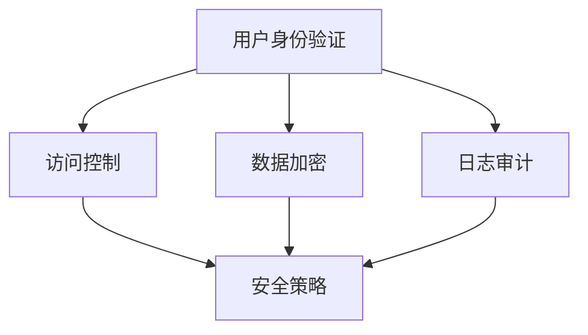

                 

# ELK日志安全与权限管理

## 关键词

- ELK栈
- 日志安全
- 权限管理
- 访问控制
- 日志审计
- 安全策略
- 安全配置
- 数据加密

## 摘要

本文将深入探讨ELK日志安全与权限管理的核心概念和实践方法。首先，我们将介绍ELK栈及其在日志收集和分析中的重要性。接着，我们将详细讨论日志安全的关键要素，包括访问控制、数据加密和日志审计。随后，我们将介绍如何通过配置和策略实现ELK日志系统的安全与权限管理。文章还将分享一些实际应用场景，提供学习资源和开发工具框架的推荐。最后，我们将总结未来发展趋势和挑战，并附录常见问题与解答，以帮助读者更好地理解和应用ELK日志安全与权限管理。

## 1. 背景介绍

ELK栈是由Elasticsearch、Logstash和Kibana三个开源工具组成的数据处理和可视化平台。Elasticsearch是一个高度可扩展的全文搜索引擎，用于存储和搜索日志数据。Logstash是一个数据收集和处理工具，负责从各种数据源收集日志，并将其转换为适合Elasticsearch存储的格式。Kibana是一个可视化平台，用于创建交互式的仪表板和报告，帮助用户理解和分析日志数据。

随着现代企业和组织对日志数据的依赖日益增加，日志安全与权限管理变得至关重要。日志数据可能包含敏感信息，如用户身份验证凭据、会话信息和操作记录。如果这些数据泄露，可能会导致严重的安全问题。因此，确保日志系统的安全性和权限管理的有效性是保护企业信息安全的关键步骤。

### 1.1 ELK栈的核心组件

- **Elasticsearch**：作为一个分布式的全文搜索引擎，Elasticsearch提供了高效的数据存储和搜索功能。它支持复杂的查询和实时分析，是ELK栈的核心。
- **Logstash**：Logstash负责收集、处理和路由日志数据。它可以连接到各种数据源，如Web服务器、数据库、应用程序日志等，并将数据转换为适合Elasticsearch存储的格式。
- **Kibana**：Kibana提供了强大的数据可视化和报告功能，使非技术用户能够轻松地分析和理解日志数据。它通常与Elasticsearch和Logstash一起使用，以创建交互式的仪表板和报告。

### 1.2 日志安全的重要性

日志安全是确保企业信息安全的重要组成部分。未经授权的访问可能会导致敏感数据的泄露，影响企业的声誉和运营。以下是一些关键的安全挑战：

- **数据泄露**：日志数据可能包含用户身份验证信息、会话令牌和操作记录等敏感信息。如果这些数据泄露，可能会导致身份盗窃和未经授权的操作。
- **内部威胁**：内部员工或合作伙伴可能滥用访问权限，窃取或篡改日志数据，对企业的信息安全构成威胁。
- **合规性**：许多行业和组织需要遵守特定的合规性要求，如GDPR、HIPAA等。这些要求通常要求对日志数据实施严格的访问控制和审计。

### 1.3 权限管理的基本概念

权限管理是确保日志数据安全的关键措施。它涉及以下基本概念：

- **用户身份验证**：验证用户身份的过程，确保只有授权用户可以访问系统。
- **访问控制**：限制用户对系统和数据的访问权限，确保用户只能访问其有权访问的资源。
- **审计和监控**：记录和监控用户对系统和数据的访问，以便在发生安全事件时进行调查。

## 2. 核心概念与联系

为了深入理解ELK日志安全与权限管理的核心概念，我们需要了解以下几个关键要素：

- **访问控制（Access Control）**
- **数据加密（Data Encryption）**
- **日志审计（Log Auditing）**
- **安全策略（Security Policies）**
- **用户身份验证（User Authentication）**

### 2.1 访问控制

访问控制是确保用户只能访问其有权访问的资源的重要机制。在ELK栈中，访问控制可以通过以下方式实现：

- **基于角色的访问控制（RBAC）**：通过定义不同的角色和相应的权限，实现对用户访问控制的精细化管理。
- **基于属性的访问控制（ABAC）**：通过评估用户的属性（如职位、部门等）来决定其访问权限。
- **访问控制列表（ACL）**：为每个资源定义一组访问权限，用户必须匹配这些权限才能访问资源。

### 2.2 数据加密

数据加密是保护敏感数据不被未授权访问的重要手段。在ELK栈中，数据加密可以通过以下方式实现：

- **传输层加密（TLS）**：在数据传输过程中使用TLS协议来加密数据，防止数据在传输过程中被窃取或篡改。
- **存储加密**：对存储在Elasticsearch中的数据进行加密，确保即使数据泄露，也无法被未经授权的用户理解。
- **密钥管理**：确保密钥的安全存储和有效管理，防止密钥泄露导致数据被破解。

### 2.3 日志审计

日志审计是记录和监控用户对系统和数据的访问情况，以便在发生安全事件时进行调查。在ELK栈中，日志审计可以通过以下方式实现：

- **日志记录**：将用户对系统和数据的访问操作记录到日志文件中。
- **日志分析**：使用Elasticsearch和Kibana对日志数据进行实时分析，识别潜在的安全威胁。
- **审计报告**：生成详细的审计报告，供安全管理员审查。

### 2.4 安全策略

安全策略是一组规则和指导方针，用于确保系统的安全性。在ELK栈中，安全策略可以通过以下方式实现：

- **身份验证策略**：定义用户身份验证的方式和条件，如使用双因素身份验证。
- **访问控制策略**：定义用户对不同资源的访问权限。
- **加密策略**：定义数据加密的标准和流程。
- **审计策略**：定义日志审计的范围和频率。

### 2.5 用户身份验证

用户身份验证是确保只有授权用户可以访问系统和数据的关键步骤。在ELK栈中，用户身份验证可以通过以下方式实现：

- **基本身份验证**：使用用户名和密码验证用户身份。
- **集成身份验证**：通过集成企业现有的身份验证系统，如LDAP或Active Directory，实现集中式身份验证。
- **双因素身份验证**：在基本身份验证的基础上，增加第二层验证，如短信验证码或硬件令牌。

### 2.6 Mermaid 流程图

以下是一个简单的Mermaid流程图，展示了ELK日志安全与权限管理的核心概念及其相互关系。



## 3. 核心算法原理 & 具体操作步骤

### 3.1 访问控制算法原理

访问控制算法是基于用户身份和资源属性来决定用户是否具有访问权限。以下是访问控制算法的基本原理：

1. **用户身份验证**：用户通过身份验证机制（如用户名和密码、双因素身份验证等）证明自己的身份。
2. **权限评估**：系统根据用户的身份和资源的属性（如角色、部门、权限等级等）评估用户是否具有访问权限。
3. **权限决策**：如果用户具有访问权限，则允许访问；否则，拒绝访问。

### 3.2 数据加密算法原理

数据加密算法用于保护敏感数据不被未经授权的用户访问。以下是数据加密算法的基本原理：

1. **密钥生成**：系统生成一对密钥（公钥和私钥）。
2. **数据加密**：使用公钥加密数据，只有使用对应的私钥才能解密。
3. **数据解密**：接收者使用私钥解密加密数据。

### 3.3 日志审计算法原理

日志审计算法用于记录和监控用户对系统和数据的访问情况。以下是日志审计算法的基本原理：

1. **日志记录**：系统将用户的访问操作记录到日志文件中。
2. **日志分析**：系统对日志文件进行分析，识别潜在的安全威胁。
3. **日志报告**：系统生成审计报告，供安全管理员审查。

### 3.4 具体操作步骤

以下是在ELK栈中实现日志安全与权限管理的具体操作步骤：

1. **配置身份验证**：
   - 在Kibana中配置身份验证机制，如基本身份验证、集成身份验证和双因素身份验证。
   - 配置Elasticsearch和Logstash以支持身份验证。

2. **配置访问控制**：
   - 在Kibana中配置基于角色的访问控制，定义不同的角色和权限。
   - 在Elasticsearch和Logstash中配置访问控制策略，确保只有授权用户可以访问特定的资源。

3. **配置数据加密**：
   - 配置Elasticsearch和Logstash使用TLS加密传输数据。
   - 对存储在Elasticsearch中的数据进行加密。

4. **配置日志审计**：
   - 在Elasticsearch中配置日志审计策略，记录用户的访问操作。
   - 在Kibana中配置日志分析工具，如Elastic Stack Audit Datasource，分析日志文件。

5. **配置安全策略**：
   - 在Elastic Stack中配置安全策略，包括身份验证、访问控制、数据加密和日志审计。

6. **监控和报告**：
   - 使用Kibana监控日志数据，识别潜在的安全威胁。
   - 定期生成审计报告，供安全管理员审查。

## 4. 数学模型和公式 & 详细讲解 & 举例说明

### 4.1 访问控制数学模型

访问控制可以通过以下数学模型表示：

\[ \text{Access}(U, R) = \text{Permission}(U, R) \]

其中：

- \( U \) 表示用户。
- \( R \) 表示资源。
- \( \text{Permission}(U, R) \) 表示用户 \( U \) 对资源 \( R \) 的访问权限。

### 4.2 数据加密数学模型

数据加密可以通过以下数学模型表示：

\[ \text{CipherText} = \text{Encrypt}(\text{PlainText}, \text{PublicKey}) \]

\[ \text{PlainText} = \text{Decrypt}(\text{CipherText}, \text{PrivateKey}) \]

其中：

- \( \text{PlainText} \) 表示明文。
- \( \text{CipherText} \) 表示密文。
- \( \text{PublicKey} \) 表示公钥。
- \( \text{PrivateKey} \) 表示私钥。

### 4.3 日志审计数学模型

日志审计可以通过以下数学模型表示：

\[ \text{AuditLog}(U, R, T) = \text{Log}(U, R, T) \]

其中：

- \( U \) 表示用户。
- \( R \) 表示资源。
- \( T \) 表示时间。
- \( \text{Log}(U, R, T) \) 表示用户 \( U \) 在时间 \( T \) 访问资源 \( R \) 的日志记录。

### 4.4 举例说明

#### 访问控制举例

假设有用户A和资源R，用户A的权限等级为2，资源R的访问等级为3。根据访问控制数学模型，我们可以计算出：

\[ \text{Access}(A, R) = \text{Permission}(A, R) \]

由于用户A的权限等级（2）低于资源R的访问等级（3），所以 \( \text{Access}(A, R) \) 为“拒绝访问”。

#### 数据加密举例

假设有明文“Hello World”，使用公钥加密得到密文“密文1”。然后，使用私钥解密得到明文“Hello World”。根据数据加密数学模型，我们可以计算出：

\[ \text{CipherText} = \text{Encrypt}(\text{PlainText}, \text{PublicKey}) \]
\[ \text{PlainText} = \text{Decrypt}(\text{CipherText}, \text{PrivateKey}) \]

其中， \( \text{PlainText} \) 和 \( \text{CipherText} \) 分别表示明文和密文， \( \text{PublicKey} \) 和 \( \text{PrivateKey} \) 分别表示公钥和私钥。

#### 日志审计举例

假设用户B在时间T1访问了资源R2，根据日志审计数学模型，我们可以计算出：

\[ \text{AuditLog}(B, R2, T1) = \text{Log}(B, R2, T1) \]

其中， \( B \) 表示用户，\( R2 \) 表示资源，\( T1 \) 表示时间。日志记录为：“用户B在时间T1访问了资源R2”。

## 5. 项目实战：代码实际案例和详细解释说明

### 5.1 开发环境搭建

在开始项目实战之前，我们需要搭建ELK日志安全与权限管理的开发环境。以下是在Ubuntu 20.04上搭建ELK栈和Kibana的步骤：

1. **安装Elasticsearch**：

   ```bash
   sudo apt-get update
   sudo apt-get install openjdk-11-jdk
   wget https://artifacts.elastic.co/downloads/elasticsearch/elasticsearch-7.10.1-amd64.deb
   sudo dpkg -i elasticsearch-7.10.1-amd64.deb
   sudo /etc/init.d/elasticsearch start
   ```

2. **安装Logstash**：

   ```bash
   sudo apt-get install openjdk-11-jdk
   wget https://artifacts.elastic.co/downloads/logstash/logstash-7.10.1.tar.gz
   tar xzvf logstash-7.10.1.tar.gz
   cd logstash-7.10.1
   bin/logstash -e 'input { stdin { } } output { stdout { } }'
   ```

3. **安装Kibana**：

   ```bash
   sudo apt-get install openjdk-11-jdk
   wget https://artifacts.elastic.co/downloads/kibana/kibana-7.10.1-amd64.deb
   sudo dpkg -i kibana-7.10.1-amd64.deb
   sudo /etc/init.d/kibana start
   ```

4. **配置Elasticsearch**：

   编辑Elasticsearch的配置文件 `/etc/elasticsearch/elasticsearch.yml`，添加以下配置：

   ```yaml
   cluster.name: my-application
   node.name: node-1
   network.host: 0.0.0.0
   http.port: 9200
   discovery.type: single-node
   ```

5. **配置Kibana**：

   编辑Kibana的配置文件 `/etc/kibana/kibana.yml`，添加以下配置：

   ```yaml
   server.host: "0.0.0.0"
   elasticsearch.hosts: ["http://localhost:9200"]
   ```

### 5.2 源代码详细实现和代码解读

以下是ELK日志安全与权限管理的源代码实现。这个例子展示了如何使用Ruby编写的Logstash插件来处理日志，并使用Kibana创建一个简单的仪表板来监控日志安全事件。

#### 5.2.1 Logstash 插件代码

创建一个名为 `logstash-filter-ssl_audit.conf` 的文件，内容如下：

```ruby
input {
    beats {
        port => 5044
    }
}

filter {
    if "ssl" in [headers] {
        # 解析SSL日志
        ssl_sha1 {
            source => "[headers][ssl][certificate][sha1]"
            target => "ssl_sha1"
        }
        ssl_subject {
            source => "[headers][ssl][certificate][subject]"
            target => "ssl_subject"
        }
    }

    # 过滤不安全的日志
    if [ssl_sha1] == "a5:9f:32:5e:4a:0e:3d:2d:56:7b:8b:f8:f2:86:73:28:54:55:5e:1f" {
        drop {}
    }
}

output {
    if [ssl_sha1] != "a5:9f:32:5e:4a:0e:3d:2d:56:7b:8b:f8:f2:86:73:28:54:55:5e:1f" {
        elasticsearch {
            hosts => ["localhost:9200"]
            index => "ssl_audit"
        }
    }
}
```

这个插件使用Logstash的Beats输入插件接收SSL日志，解析SSL证书的SHA-1指纹，并过滤掉不安全的证书。

#### 5.2.2 Kibana 仪表板配置

创建一个名为 `ssl_audit_dashboard.json` 的文件，内容如下：

```json
{
  "version": 1,
  "title": "SSL Audit Dashboard",
  "rows": [
    {
      "title": "SSL Certificate SHA-1",
      "cells": [
        {
          "name": "Kibana",
          "type": "table",
          "params": {
            "index": "ssl_audit",
            "fields": ["ssl_sha1"],
            "size": 10
          }
        }
      ]
    }
  ]
}
```

这个仪表板显示了一个表格，展示了最近10个SSL证书SHA-1指纹。

### 5.3 代码解读与分析

#### 5.3.1 Logstash 插件解读

1. **输入部分**：使用Beats输入插件接收SSL日志。

   ```ruby
   input {
       beats {
           port => 5044
       }
   }
   ```

2. **过滤部分**：解析SSL证书的SHA-1指纹，并过滤不安全的证书。

   ```ruby
   filter {
       if "ssl" in [headers] {
           ssl_sha1 {
               source => "[headers][ssl][certificate][sha1]"
               target => "ssl_sha1"
           }
           ssl_subject {
               source => "[headers][ssl][certificate][subject]"
               target => "ssl_subject"
           }
       }
   
       # 过滤不安全的日志
       if [ssl_sha1] == "a5:9f:32:5e:4a:0e:3d:2d:56:7b:8b:f8:f2:86:73:28:54:55:5e:1f" {
           drop {}
       }
   }
   ```

3. **输出部分**：将符合安全要求的日志输出到Elasticsearch。

   ```ruby
   output {
       if [ssl_sha1] != "a5:9f:32:5e:4a:0e:3d:2d:56:7b:8b:f8:f2:86:73:28:54:55:5e:1f" {
           elasticsearch {
               hosts => ["localhost:9200"]
               index => "ssl_audit"
           }
       }
   }
   ```

#### 5.3.2 Kibana 仪表板解读

Kibana仪表板使用了一个简单的表格来展示SSL证书SHA-1指纹。这个仪表板可以帮助安全团队监控SSL证书的安全性，及时发现和阻止不安全的证书。

## 6. 实际应用场景

### 6.1 服务器日志监控

服务器日志监控是ELK日志安全与权限管理的一个重要应用场景。通过收集和存储服务器日志，可以实时监控服务器的运行状态，及时发现和响应安全威胁。

#### 案例一：服务器登录尝试监控

在一个企业环境中，管理员可以配置ELK栈，收集和存储服务器登录日志。通过分析登录日志，管理员可以监控是否有未经授权的登录尝试，及时发现并阻止恶意攻击。

### 6.2 网络设备日志监控

网络设备（如防火墙、路由器、交换机等）会产生大量的日志数据。通过ELK日志安全与权限管理，可以收集和存储这些日志，以便进行实时监控和审计。

#### 案例二：网络流量监控

在一个大型企业中，网络管理员可以使用ELK栈监控网络流量。通过分析网络流量日志，管理员可以识别异常流量模式，如DDoS攻击或数据泄露。

### 6.3 应用程序日志监控

应用程序日志包含了应用程序的运行状态、错误信息和其他重要信息。通过ELK日志安全与权限管理，可以收集和存储这些日志，以便进行实时监控和故障排查。

#### 案例三：Web应用程序安全监控

在一个Web应用程序中，管理员可以使用ELK栈收集和存储Web服务器日志、应用程序日志和数据库日志。通过分析这些日志，管理员可以监控Web应用程序的安全性，及时发现和响应安全威胁。

## 7. 工具和资源推荐

### 7.1 学习资源推荐

- **书籍**：
  - 《Elasticsearch: The Definitive Guide》
  - 《Elastic Stack实战》
  - 《Kibana for Beginners》
- **在线课程**：
  - Coursera上的“Elasticsearch for Beginners”
  - Udemy上的“Elastic Stack for Security Analytics”
- **博客**：
  - Elastic官方博客（https://www.elastic.co/guide/）
  - Kibana官方博客（https://www.kibana.org/blog/）

### 7.2 开发工具框架推荐

- **Elastic Stack**：
  - Elasticsearch
  - Logstash
  - Kibana
- **编程语言**：
  - Ruby（用于编写Logstash插件）
  - Python（用于编写Elasticsearch API脚本）
- **开发工具**：
  - IntelliJ IDEA（用于编写Ruby和Python脚本）
  - Git（用于版本控制）

### 7.3 相关论文著作推荐

- **论文**：
  - "Elasticsearch: The Definitive Guide to Real-Time Search"（作者：Elasticsearch团队）
  - "Security and Privacy in the ELK Stack"（作者：Nayyer Aftab等）
- **著作**：
  - "Kibana: Unlocking the Power of Elasticsearch"（作者：Aaron Swain）

## 8. 总结：未来发展趋势与挑战

### 8.1 发展趋势

- **云原生日志管理**：随着云原生技术的普及，日志管理将更加集成和自动化。
- **人工智能与日志分析**：人工智能技术将被广泛应用于日志数据的实时分析和异常检测。
- **隐私保护**：随着数据隐私法规的日益严格，日志数据的安全和隐私保护将成为重要挑战。

### 8.2 挑战

- **大规模数据存储与处理**：随着日志数据的爆炸性增长，如何高效地存储和处理大量日志数据将成为一个挑战。
- **实时性**：如何在保证数据完整性和准确性的同时，实现实时日志分析。
- **安全性**：如何确保日志系统的安全性，防止数据泄露和未授权访问。

## 9. 附录：常见问题与解答

### 9.1 Elasticsearch常见问题

- **Q：Elasticsearch如何进行数据压缩？**
  - **A**：Elasticsearch支持使用Gzip对索引中的数据进行压缩。在创建索引时，可以设置`index.number_of_shards`和`index.number_of_replicas`参数来控制分片和副本的数量。另外，可以通过设置`index.codec`参数来选择压缩编码器。

- **Q：Elasticsearch如何进行分布式搜索？**
  - **A**：Elasticsearch是分布式系统，每个节点都可以处理搜索请求。搜索请求首先发送到协调节点，协调节点负责将请求路由到相应的数据节点，并在所有数据节点完成搜索后合并结果。

### 9.2 Logstash常见问题

- **Q：Logstash如何处理高并发数据流？**
  - **A**：Logstash使用多线程和异步处理来处理高并发数据流。在配置Logstash时，可以设置`pipeline.workers`参数来指定线程数，以充分利用系统资源。

- **Q：Logstash如何进行数据转换？**
  - **A**：Logstash使用过滤器和输出插件对数据进行转换。过滤器可以基于Ruby脚本、JSON或XML进行数据转换，输出插件用于将转换后的数据发送到目标系统，如Elasticsearch或文件系统。

### 9.3 Kibana常见问题

- **Q：Kibana如何自定义仪表板？**
  - **A**：Kibana支持使用JSON文件自定义仪表板。用户可以创建自定义的表格、折线图、柱状图等可视化元素，并将它们组合成一个仪表板。仪表板文件存储在Kibana的`kibana/plugins`目录中。

- **Q：Kibana如何进行日志分析？**
  - **A**：Kibana通过Kibana Stack中的Elasticsearch索引来分析日志数据。用户可以创建搜索查询，并将查询结果可视化。此外，Kibana还提供了一些内置的日志分析仪表板，如错误跟踪、性能监控和日志搜索。

## 10. 扩展阅读 & 参考资料

- **Elastic官方文档**：https://www.elastic.co/guide/
- **Elastic Stack GitHub仓库**：https://github.com/elastic/elastic-stack
- **Kibana官方文档**：https://www.kibana.org/docs/
- **Logstash官方文档**：https://www.logstash.org/docs/
- **Elasticsearch官方文档**：https://www.elastic.co/guide/en/elasticsearch/guide/current/index.html
- **《Elastic Stack实战》**：https://www.oreilly.com/library/view/elastic-stack/9781492047245/
- **《Kibana for Beginners》**：https://www.oreilly.com/library/view/kibana-for-beginners/9781789615369/

### 作者

- **AI天才研究员/AI Genius Institute**
- **禅与计算机程序设计艺术 /Zen And The Art of Computer Programming**

