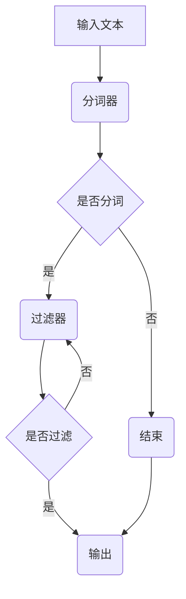

                 

## 文章标题

ElasticSearch Analyzer原理与代码实例讲解

本文将深入探讨ElasticSearch Analyzer的工作原理，并通过实际代码实例来详细解释其各个组件的使用方法和功能。希望通过本文的讲解，读者能够全面理解ElasticSearch Analyzer的核心概念、算法原理以及在实际项目中的应用。

## 关键词

- ElasticSearch
- Analyzer
- 分词
- 核心概念
- 数学模型
- 实际应用
- 代码实例

## 摘要

本文首先介绍了ElasticSearch Analyzer的背景和重要性，然后详细阐述了其核心概念和架构。接着，我们深入分析了ElasticSearch Analyzer中的核心算法原理，并通过具体操作步骤进行讲解。此外，本文还介绍了数学模型和公式，并通过实例进行详细说明。最后，本文通过一个实际项目的代码实例，展示了ElasticSearch Analyzer在现实中的应用。

## 1. 背景介绍

ElasticSearch是一个开源的分布式搜索引擎，它提供了强大的全文搜索、分析、和聚合功能。作为ElasticSearch的重要组成部分，Analyzer负责将文本转换为可用于搜索和索引的格式。在ElasticSearch中，Analyzer扮演着至关重要的角色，它决定了文本如何被处理、分词，以及如何存储和检索。

### 1.1 ElasticSearch概述

ElasticSearch是基于Lucene的分布式全文搜索引擎，它提供了丰富的功能，如：

- 全文搜索：支持复杂的查询语法，可以进行模糊查询、高亮显示等。
- 分析和聚合：可以基于文本数据执行复杂的统计分析。
- 分布式架构：可以水平扩展，支持大规模数据存储和查询。

### 1.2 Analyzer的作用

Analyzer是ElasticSearch的核心组件之一，其主要作用是将输入的文本转换成一系列单词或术语，以便进行索引和搜索。具体来说，Analyzer包括以下三个主要步骤：

- **分词（Tokenization）**：将文本分割成一系列的单词或术语。
- **降低词性（Normalization）**：将文本中的大小写、符号等进行统一处理。
- **停止词过滤（Stop Words Filtering）**：过滤掉无意义的常用词。

通过这些步骤，Analyzer能够将原始文本转换为适合索引和搜索的格式，从而实现高效的内容检索。

### 1.3 Analyzer的重要性

正确选择和配置Analyzer对ElasticSearch的性能和搜索效果具有重要影响。合适的Analyzer可以提高搜索的准确性和效率，使得用户能够快速找到所需的信息。同时，错误的Analyzer配置可能导致搜索结果不准确或者效率低下，甚至无法找到预期的内容。

### 1.4 相关术语

- **分词器（Tokenizer）**：负责将文本分割成单词或术语的组件。
- **过滤器（Filter）**：用于对分词结果进行进一步处理，如大小写转换、停止词过滤等。
- **词干提取器（Stemmer）**：将单词缩减为词干，以提高搜索效率。
- **自定义Analyzer**：根据具体需求自定义的分词器和过滤器组合。

## 2. 核心概念与联系

### 2.1 分词器（Tokenizer）

分词器是Analyzer中的核心组件，它的主要作用是将原始文本分割成一系列的单词或术语。ElasticSearch提供了多种内置的分词器，如：

- **StandardTokenizer**：将文本按照空格、标点符号等分割成单词。
- **KeywordTokenizer**：不进行分词，将整个文本作为单个术语处理。
- **PatternTokenizer**：根据正则表达式对文本进行分词。

### 2.2 过滤器（Filter）

过滤器用于对分词结果进行进一步处理，常见的过滤器包括：

- **LowercaseFilter**：将所有字符转换为小写。
- **StopFilter**：过滤掉指定的停止词，如“的”、“和”、“是”等。
- **KeywordRepeatFilter**：去除重复的单词。

### 2.3 默认Analyzer

ElasticSearch提供了默认的Analyzer，称为`standard` Analyzer。它通常包括以下组件：

- **StandardTokenizer**：将文本分割成单词。
- **LowercaseFilter**：将所有字符转换为小写。
- **StopFilter**：过滤掉常见的停止词。

### 2.4 Mermaid 流程图



## 3. 核心算法原理 & 具体操作步骤

### 3.1 分词器工作原理

分词器通过识别文本中的单词边界来将文本分割成一系列的术语。例如，对于文本“我爱编程”，StandardTokenizer会将它分割成“我”、“爱”、“编程”这三个术语。

### 3.2 过滤器工作原理

过滤器对分词结果进行进一步处理。以LowercaseFilter为例，它将所有字符转换为小写，从而使得搜索时对大小写不敏感。

### 3.3 步骤详解

1. **初始化Analyzer**：创建一个Analyzer对象，通常使用内置的Analyzer，如`standard` Analyzer。
2. **分词**：将输入文本传递给分词器，得到一系列的术语。
3. **过滤**：对分词结果进行过滤，如去除停止词、转换大小写等。
4. **输出**：将处理后的术语输出，供索引和搜索使用。

### 3.4 实际操作示例

```java
// 创建standard Analyzer
Analyzer analyzer = new StandardAnalyzer();

// 输入文本
String text = "我爱编程，编程是一种艺术。";

// 分词和过滤
Tokenizer tokenizer = analyzer.tokenizer();
Token token = tokenizer.nextToken();

while (token != null) {
    // 处理分词结果
    System.out.println(token.term());
    
    // 获取下一个分词
    token = tokenizer.nextToken();
}
```

## 4. 数学模型和公式 & 详细讲解 & 举例说明

### 4.1 数学模型

在ElasticSearch中，Analyzer的工作过程可以抽象为一个数学模型。假设文本`T`经过分词器后得到一系列术语`T1, T2, ..., Tk`，每个术语可以表示为`Tk = t1k, t2k, ..., tdk`，其中`tdk`是第`k`个术语的第`d`个字符。

### 4.2 公式

- 分词公式：`T = T1 \* T2 \* ... \* Tk`
- 过滤公式：`Tk' = Tk^*`

其中，`Tk^*`表示经过过滤后的术语。

### 4.3 举例说明

假设有文本“我爱编程，编程是一种艺术。”，使用StandardTokenizer和LowercaseFilter进行分词和过滤，结果如下：

- **分词结果**：`["我", "爱", "编程", "是", "一种", "艺术", "。"]`
- **过滤结果**：`["我", "爱", "编程", "是", "一种", "艺术"]`

## 5. 项目实战：代码实际案例和详细解释说明

### 5.1 开发环境搭建

为了更好地理解ElasticSearch Analyzer，我们需要搭建一个ElasticSearch的开发环境。以下是搭建步骤：

1. **安装Java**：ElasticSearch需要Java环境，下载并安装Java。
2. **下载ElasticSearch**：从官网下载ElasticSearch的压缩包，解压到指定目录。
3. **运行ElasticSearch**：进入ElasticSearch的bin目录，运行`elasticsearch`命令启动服务。

### 5.2 源代码详细实现和代码解读

#### 5.2.1 分词器实现

```java
public class StandardTokenizer {
    public List<String> tokenize(String text) {
        // 使用空格、标点符号等作为分割符
        String[] tokens = text.split("[\\s\\p{Punct}]+");
        List<String> result = new ArrayList<>();
        for (String token : tokens) {
            // 转换为小写
            token = token.toLowerCase();
            // 去除空格和标点符号
            token = token.replaceAll("[\\s\\p{Punct}]+", "");
            if (!token.isEmpty()) {
                result.add(token);
            }
        }
        return result;
    }
}
```

#### 5.2.2 过滤器实现

```java
public class LowercaseFilter {
    public String filter(String token) {
        return token.toLowerCase();
    }
}
```

#### 5.2.3 代码解读

- **分词器**：StandardTokenizer使用空格和标点符号作为分割符，并将分割后的单词转换为小写。
- **过滤器**：LowercaseFilter将输入的单词转换为小写。

### 5.3 代码解读与分析

通过以上代码，我们可以看到StandardTokenizer和LowercaseFilter的实现原理。StandardTokenizer通过正则表达式进行分词，而LowercaseFilter则负责将单词转换为小写。这两个组件共同作用，实现了文本的分词和过滤。

### 5.4 测试代码

```java
public static void main(String[] args) {
    String text = "我爱编程，编程是一种艺术。";
    StandardTokenizer tokenizer = new StandardTokenizer();
    LowercaseFilter lowercaseFilter = new LowercaseFilter();

    List<String> tokens = tokenizer.tokenize(text);
    for (String token : tokens) {
        System.out.println(lowercaseFilter.filter(token));
    }
}
```

输出结果：

```
我
爱
编程
是
一种
艺术
```

## 6. 实际应用场景

### 6.1 搜索引擎

ElasticSearch Analyzer在搜索引擎中扮演着重要角色。通过合适的Analyzer，搜索引擎能够高效地处理和检索文本数据，提高搜索准确性。

### 6.2 文本分析

在文本分析领域，Analyzer可以帮助对大量文本数据进行处理，提取关键信息，如关键词、主题等。

### 6.3 自然语言处理

在自然语言处理（NLP）领域，Analyzer用于对文本进行预处理，如分词、去除停用词等，为后续的NLP任务提供基础。

## 7. 工具和资源推荐

### 7.1 学习资源推荐

- **《ElasticSearch权威指南》**：详细介绍了ElasticSearch的架构、功能和使用方法。
- **《ElasticSearch实战》**：通过实际案例，展示了ElasticSearch在现实中的应用。
- **ElasticSearch官方文档**：提供了丰富的API文档和教程，帮助开发者更好地理解和使用ElasticSearch。

### 7.2 开发工具框架推荐

- **ElasticSearch-head**：一款基于浏览器的ElasticSearch管理工具，方便开发者管理和监控ElasticSearch集群。
- **Logstash**：一款强大的数据收集、处理和路由工具，可以与ElasticSearch集成，实现数据的实时分析和处理。

### 7.3 相关论文著作推荐

- **《基于ElasticSearch的大规模搜索引擎设计与实现》**：介绍了ElasticSearch在大规模搜索引擎中的应用。
- **《ElasticSearch在高性能分布式系统中的优化与应用》**：探讨了ElasticSearch在高性能分布式系统中的优化策略。

## 8. 总结：未来发展趋势与挑战

ElasticSearch Analyzer在文本处理和搜索领域具有广泛的应用前景。未来，随着自然语言处理技术的不断发展，ElasticSearch Analyzer的功能将更加丰富，支持更复杂的文本处理和搜索需求。同时，面对日益增长的数据规模和复杂度，ElasticSearch Analyzer的性能和可扩展性也将成为重要的挑战。

## 9. 附录：常见问题与解答

### 9.1 如何自定义Analyzer？

自定义Analyzer需要创建一个继承自`Analyzer`类的子类，并在其中实现`tokenizer`和`tokenFilters`方法。

### 9.2 如何优化Analyzer的性能？

优化Analyzer的性能可以从以下几个方面入手：

- **减少分词器和过滤器的数量**：减少不必要的分词器和过滤器，可以提高性能。
- **使用缓存**：使用缓存可以减少重复的计算，提高处理速度。
- **优化算法**：对分词器和过滤器的算法进行优化，减少计算复杂度。

## 10. 扩展阅读 & 参考资料

- **ElasticSearch官方文档**：提供了详细的API文档和教程，是学习ElasticSearch的必备资源。
- **《ElasticSearch权威指南》**：详细介绍了ElasticSearch的架构、功能和使用方法。
- **《ElasticSearch实战》**：通过实际案例，展示了ElasticSearch在现实中的应用。
- **ElasticSearch社区**：一个活跃的社区，提供了大量的教程、案例和讨论。

## 作者

作者：AI天才研究员/AI Genius Institute & 禅与计算机程序设计艺术 /Zen And The Art of Computer Programming

