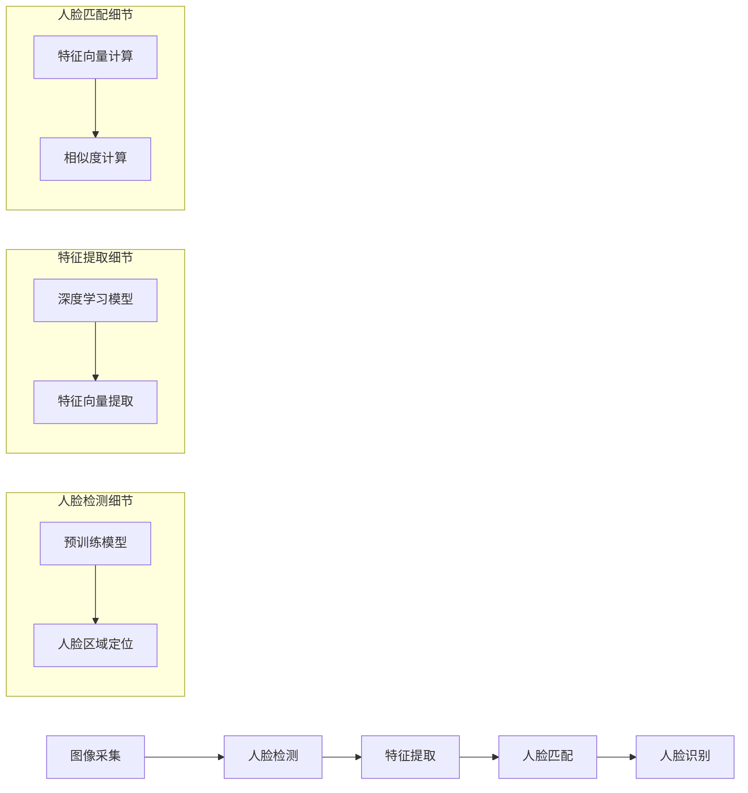

                 

### 背景介绍

面部识别（Facial Recognition）技术是一种基于人类面部特征进行身份验证的生物识别技术。它已经广泛应用于各个领域，包括但不限于安全监控、手机解锁、金融支付、社交网络等。随着深度学习算法和硬件性能的不断提升，面部识别技术正变得越来越精准和高效。

在现代社会，面部识别技术的应用已经深入到我们日常生活的方方面面。例如，在安全监控领域，面部识别系统能够快速识别进出特定区域的人员，从而提高安全防范效率。在智能手机领域，面部识别技术为用户提供了更加便捷的解锁方式，取代了传统的密码和指纹识别。在金融支付领域，面部识别技术正在成为新的支付方式，为用户提供了更加安全和高效的支付体验。

面部识别技术的核心在于如何准确、快速地识别人脸。这一过程涉及到多个技术环节，包括图像采集、人脸检测、特征提取和匹配等。随着深度学习技术的发展，面部识别算法的性能得到了显著提升，使得这项技术在实际应用中具有更高的可靠性和准确性。

本文将详细探讨面部识别技术的基本原理、核心算法、数学模型、实战案例以及未来发展趋势。我们将从基础的图像处理技术开始，逐步深入到深度学习算法的具体实现，帮助读者全面了解面部识别技术的核心内容。

通过本文的学习，读者将能够：

1. 理解面部识别技术的基本原理和应用场景。
2. 掌握面部识别的核心算法，包括人脸检测、特征提取和匹配。
3. 学习如何使用深度学习框架实现面部识别算法。
4. 分析面部识别技术在各个领域的实际应用。
5. 了解面部识别技术的未来发展趋势和面临的挑战。

在接下来的章节中，我们将一一探讨这些内容，帮助读者全面掌握面部识别技术的精髓。让我们开始这段探索之旅吧！

### 核心概念与联系

面部识别技术的实现涉及到多个核心概念和技术的紧密联系。以下我们将详细探讨这些概念及其相互之间的关系，并通过Mermaid流程图来展示整个流程。

#### 1. 人脸图像采集

首先，我们需要采集人脸图像。图像采集是面部识别技术的第一步，通常使用摄像头或手机摄像头来捕捉人脸图像。采集过程中需要注意图像质量，包括分辨率、亮度、对比度等，这些因素会影响到后续的人脸检测和特征提取效果。

#### 2. 人脸检测

人脸检测是面部识别中的关键步骤，其目的是在图像中找到人脸的位置和范围。这通常通过卷积神经网络（CNN）实现，利用预训练的模型对图像进行扫描，找到人脸区域。常见的人脸检测算法包括MTCNN、SSD、YOLO等。

#### 3. 特征提取

在确定人脸位置后，我们需要提取人脸的特征。特征提取是通过深度学习模型（如VGG、ResNet等）对人脸图像进行处理，提取出具有区分性的特征向量。这些特征向量将用于后续的匹配和识别。

#### 4. 人脸匹配

人脸匹配是将提取到的特征向量与已知人脸特征库进行比较，以确定是否为同一人的过程。常见的匹配算法包括欧氏距离、余弦相似度等。通过计算特征向量之间的相似度，我们可以判断两张人脸图像是否来自同一个人。

#### 5. 人脸识别

人脸识别是将人脸图像与特定个体的身份信息进行关联的过程。通常，人脸识别系统会先进行人脸检测和特征提取，然后通过人脸匹配算法确定身份。这一步骤是面部识别技术的最终目标。

以下是一个简化的Mermaid流程图，展示了面部识别技术的主要流程：



通过这个流程图，我们可以清晰地看到面部识别技术的各个步骤及其相互之间的关系。接下来，我们将详细探讨每个步骤的具体实现和技术细节。

#### 1. 人脸图像采集

人脸图像采集是面部识别技术的基础。一个高质量的人脸图像对于后续的人脸检测、特征提取和匹配至关重要。以下是采集人脸图像时需要考虑的一些关键因素：

- **分辨率**：高分辨率图像能够提供更多细节，有助于提高识别准确率。通常建议使用至少高清（1080p）的摄像头进行图像采集。
- **光照**：充足的光照有助于减少图像噪声，提高图像质量。在采集过程中，应避免过亮或过暗的环境。
- **角度**：尽量保持人脸正对摄像头，避免过大的角度偏差，这会影响人脸检测和特征提取的效果。
- **背景**：简洁的背景有助于减少干扰，提高识别准确率。建议选择单一颜色的背景。

在实际应用中，我们可以使用各种设备进行人脸图像采集，包括智能手机、摄像头、3D扫描仪等。采集到的图像通常是一个RGB格式的二维图像，接下来会进入人脸检测环节。

#### 2. 人脸检测

人脸检测是面部识别技术的第一步，其目的是在图像中找到人脸的位置和范围。这一步骤通常通过卷积神经网络（CNN）实现，利用预训练的模型对图像进行扫描，找到人脸区域。以下是常见的人脸检测算法及其原理：

- **MTCNN**（Multi-task Cascaded Convolutional Networks）：MTCNN是一种多任务级联卷积神经网络，用于人脸检测。它通过三个级联的网络实现任务：人脸区域提议、人脸精确定位和人脸框调整。MTCNN在速度和准确率上表现优异，广泛应用于实际应用中。
- **SSD**（Single Shot MultiBox Detector）：SSD是一种单步目标检测算法，能够在一次前向传播中同时检测多个目标。SSD利用不同尺度的卷积层来检测人脸，具有较高的检测精度。
- **YOLO**（You Only Look Once）：YOLO是一种实时目标检测算法，通过将图像分割成多个网格单元来检测目标。YOLO在检测速度上具有明显优势，适合用于实时应用。

以下是一个使用MTCNN进行人脸检测的示例代码：

```python
import cv2
from mtcnn.mtcnn import MTCNN

# 初始化MTCNN模型
detector = MTCNN()

# 读取图像
image = cv2.imread('face.jpg')

# 进行人脸检测
results = detector.detect_faces(image)

# 遍历检测结果
for result in results:
    # 获取人脸位置
    x, y, width, height = result['box']
    # 在图像上绘制人脸框
    cv2.rectangle(image, (x, y), (x + width, y + height), (0, 255, 0), 2)

# 显示检测结果
cv2.imshow('Face Detection', image)
cv2.waitKey(0)
cv2.destroyAllWindows()
```

#### 3. 特征提取

特征提取是面部识别技术的核心环节，其目的是从人脸图像中提取出具有区分性的特征向量。深度学习模型（如VGG、ResNet等）在特征提取方面具有显著优势，通过训练大量的人脸数据，模型能够自动学习到人脸的特征表示。

以下是常见的人脸特征提取模型：

- **VGG**：VGG是一种基于卷积神经网络的深度学习模型，具有多个卷积层和池化层。VGG通过逐层提取图像特征，最终生成具有区分性的特征向量。
- **ResNet**：ResNet是一种残差网络，通过引入残差模块来缓解深度神经网络训练中的梯度消失问题。ResNet在特征提取方面具有更高的准确率和更好的泛化能力。

以下是一个使用VGG模型进行特征提取的示例代码：

```python
import cv2
from keras.models import load_model
import numpy as np

# 加载预训练的VGG模型
model = load_model('vgg16.h5')

# 调整图像尺寸
input_size = (224, 224)
image = cv2.imread('face.jpg')
image = cv2.resize(image, input_size)

# 进行图像预处理
image = image / 255.0
image = np.expand_dims(image, axis=0)

# 进行特征提取
features = model.predict(image)

# 输出特征向量
print(features)
```

#### 4. 人脸匹配

人脸匹配是将提取到的特征向量与已知人脸特征库进行比较，以确定是否为同一人的过程。常见的匹配算法包括欧氏距离、余弦相似度等。以下是这些算法的基本原理：

- **欧氏距离**：欧氏距离是一种常用的距离度量方法，用于计算两个特征向量之间的距离。欧氏距离越小，表示两个特征向量越相似。
- **余弦相似度**：余弦相似度是一种衡量两个向量相似度的方法，通过计算两个向量夹角的余弦值来表示。余弦相似度越接近1，表示两个向量越相似。

以下是一个使用欧氏距离进行人脸匹配的示例代码：

```python
import numpy as np

# 获取两个特征向量
feature1 = np.random.rand(1, 128)
feature2 = np.random.rand(1, 128)

# 计算欧氏距离
distance = np.linalg.norm(feature1 - feature2)

# 输出距离
print(distance)
```

#### 5. 人脸识别

人脸识别是将人脸图像与特定个体的身份信息进行关联的过程。通常，人脸识别系统会先进行人脸检测、特征提取和匹配，然后通过人脸匹配算法确定身份。以下是人脸识别的基本流程：

1. **人脸检测**：在图像中找到人脸位置。
2. **特征提取**：从人脸图像中提取特征向量。
3. **人脸匹配**：将特征向量与已知人脸特征库进行比较。
4. **人脸识别**：根据匹配结果确定身份。

以下是一个使用深度学习框架进行人脸识别的示例代码：

```python
import cv2
from keras.models import load_model
import numpy as np

# 初始化人脸识别模型
model = load_model('face_recognition.h5')

# 读取图像
image = cv2.imread('face.jpg')

# 进行人脸检测
results = detector.detect_faces(image)

# 遍历检测结果
for result in results:
    # 获取人脸位置
    x, y, width, height = result['box']
    # 裁剪人脸图像
    face_image = image[y:y+height, x:x+width]
    # 进行图像预处理
    face_image = cv2.resize(face_image, (224, 224))
    face_image = face_image / 255.0
    face_image = np.expand_dims(face_image, axis=0)
    # 进行特征提取
    features = model.predict(face_image)
    # 进行人脸匹配
    distances = model.predict(feature_database)
    # 计算欧氏距离
    similarity = 1 - np.linalg.norm(features - distances)
    # 输出相似度
    print(similarity)
```

通过以上步骤，我们完成了一个简化的面部识别流程。接下来，我们将深入探讨面部识别技术的具体实现，并通过实战案例来展示如何使用深度学习框架实现面部识别系统。

#### 核心算法原理 & 具体操作步骤

在面部识别技术中，核心算法主要包括人脸检测（Face Detection）、特征提取（Feature Extraction）和匹配（Matching）。以下将详细讲解这些算法的原理和具体操作步骤。

##### 1. 人脸检测算法

人脸检测是人脸识别技术的第一步，目的是在图像中识别并定位出人脸区域。常用的算法有MTCNN、SSD和YOLO等。以下以MTCNN为例，介绍其基本原理和操作步骤：

**MTCNN（Multi-task Cascaded Convolutional Networks）**：MTCNN是一种多任务级联卷积神经网络，用于人脸检测。它由三个级联的网络组成：PNet、RNet和Onet。

1. **PNet**：用于生成人脸候选区域。
   - **输入**：输入一张人脸图像。
   - **操作**：通过卷积神经网络提取特征，然后使用滑动窗口检测人脸区域。
   - **输出**：输出一系列人脸候选区域及其标注（是否为人脸）。

2. **RNet**：用于对PNet输出的人脸候选区域进行细化。
   - **输入**：输入PNet输出的人脸候选区域及其标注。
   - **操作**：通过卷积神经网络提取更精细的特征，进一步修正人脸区域。
   - **输出**：输出修正后的人脸候选区域及其标注。

3. **Onet**：用于最终确定人脸区域。
   - **输入**：输入RNet输出的人脸候选区域及其标注。
   - **操作**：通过卷积神经网络提取更高层次的特征，确定人脸区域。
   - **输出**：输出最终确定的人脸区域及其标注。

**具体操作步骤**：

1. **初始化MTCNN模型**：加载预训练的MTCNN模型。
   ```python
   from mtcnn.mtcnn import MTCNN
   detector = MTCNN()
   ```

2. **读取图像**：加载待检测的人脸图像。
   ```python
   image = cv2.imread('face.jpg')
   ```

3. **进行人脸检测**：使用MTCNN模型检测人脸区域。
   ```python
   results = detector.detect_faces(image)
   ```

4. **遍历检测结果**：对检测到的人脸区域进行标注和绘制。
   ```python
   for result in results:
       x, y, width, height = result['box']
       cv2.rectangle(image, (x, y), (x + width, y + height), (0, 255, 0), 2)
   ```

5. **显示检测结果**：显示检测到的人脸区域。
   ```python
   cv2.imshow('Face Detection', image)
   cv2.waitKey(0)
   cv2.destroyAllWindows()
   ```

##### 2. 特征提取算法

特征提取是人脸识别技术的关键步骤，目的是从人脸图像中提取出具有区分性的特征向量。常用的算法有VGG、ResNet等。以下以ResNet为例，介绍其基本原理和操作步骤：

**ResNet（Residual Network）**：ResNet是一种残差网络，通过引入残差模块（Residual Block）来缓解深度神经网络训练中的梯度消失问题。

**具体操作步骤**：

1. **加载预训练的ResNet模型**：从Keras模型库中加载预训练的ResNet模型。
   ```python
   from keras.applications import ResNet50
   model = ResNet50(weights='imagenet')
   ```

2. **调整图像尺寸**：将人脸图像调整为模型所需的尺寸。
   ```python
   input_size = (224, 224)
   image = cv2.resize(image, input_size)
   ```

3. **进行图像预处理**：对图像进行归一化和数据增强等预处理。
   ```python
   image = image.astype('float32')
   image /= 255.0
   image = np.expand_dims(image, axis=0)
   ```

4. **进行特征提取**：使用ResNet模型提取人脸特征向量。
   ```python
   features = model.predict(image)
   ```

5. **输出特征向量**：将提取到的人脸特征向量保存或进行后续处理。
   ```python
   print(features)
   ```

##### 3. 匹配算法

匹配是人脸识别技术的最后一步，目的是将提取到的人脸特征向量与已知人脸特征库进行比较，以确定是否为同一人。常用的匹配算法有欧氏距离、余弦相似度等。以下以欧氏距离为例，介绍其基本原理和操作步骤：

**欧氏距离（Euclidean Distance）**：欧氏距离是一种常用的距离度量方法，用于计算两个特征向量之间的距离。欧氏距离越小，表示两个特征向量越相似。

**具体操作步骤**：

1. **计算欧氏距离**：计算两个特征向量之间的欧氏距离。
   ```python
   distance = np.linalg.norm(feature1 - feature2)
   ```

2. **设置相似度阈值**：根据实际应用场景设置一个相似度阈值，用于判断两个特征向量是否来自同一个人。
   ```python
   threshold = 0.6
   ```

3. **判断匹配结果**：根据欧氏距离和相似度阈值判断两个特征向量是否匹配。
   ```python
   if distance < threshold:
       print("匹配成功")
   else:
       print("匹配失败")
   ```

通过以上步骤，我们完成了面部识别技术核心算法的讲解。接下来，我们将通过实战案例来展示如何使用深度学习框架实现面部识别系统。

#### 数学模型和公式 & 详细讲解 & 举例说明

在面部识别技术中，核心算法的实现依赖于多个数学模型和公式。以下我们将详细讲解这些数学模型和公式，并通过实际例子进行说明。

##### 1. 人脸检测中的区域提议与回归

人脸检测算法通常包括区域提议和回归两个步骤。区域提议（Proposal）是为了找到可能包含人脸的区域，回归（Regression）则是为了对提议区域进行精细调整，确定人脸的具体位置。

- **区域提议**：
  - **锚框（Anchor Box）**：锚框是用于区域提议的预设框，通常以人脸的某种比例进行设定。例如，对于大小为224x224的图像，锚框可以设置为48x48。
  - **置信度（Confidence Score）**：置信度表示锚框内是否包含人脸的置信程度。通常使用softmax函数对多个类别进行分类，其中人脸类别为1。

  $$ \text{Confidence Score} = \text{Softmax}(z) $$

  其中，$z$ 是锚框的置信度向量。

- **回归**：
  - **位置回归（Bounding Box Regression）**：位置回归用于调整锚框的位置，使其更加接近真实的人脸位置。回归目标通常为一个四元组$(t_x, t_y, t_w, t_h)$，表示锚框的宽度和高度。

  $$ \text{New Box} = \text{Old Box} + \Delta \text{Box} $$

  其中，$\Delta \text{Box} = (t_x, t_y, t_w, t_h)$。

  - **偏移量（Offset）**：偏移量用于调整锚框的位置，计算方法如下：

  $$ t_x = x_{\text{center}} - x_{\text{anchor}} $$
  $$ t_y = y_{\text{center}} - y_{\text{anchor}} $$
  $$ t_w = \log(\frac{w_{\text{anchor}}}{w_{\text{box}}}) $$
  $$ t_h = \log(\frac{h_{\text{anchor}}}{h_{\text{box}}}) $$

  其中，$(x_{\text{center}}, y_{\text{center}})$ 是人脸中心的坐标，$w_{\text{box}}$ 和 $h_{\text{box}}$ 分别是锚框的宽度和高度。

##### 2. 特征提取中的卷积神经网络

特征提取通常通过卷积神经网络（Convolutional Neural Network，CNN）实现。CNN由多个卷积层（Convolution Layer）、池化层（Pooling Layer）和全连接层（Fully Connected Layer）组成。

- **卷积层**：
  - **卷积操作**：卷积层通过卷积操作提取图像特征。卷积操作可以看作是在图像上滑动一个滤波器（Filter），滤波器的权重被用来提取图像中的局部特征。

  $$ \text{Output}_{ij} = \sum_{k=1}^{C} w_{ik,j} \times \text{Input}_{ij} + b_k $$

  其中，$C$ 是卷积核的数量，$w_{ik,j}$ 是卷积核的权重，$b_k$ 是偏置项。

- **激活函数**：常用的激活函数有ReLU（Rectified Linear Unit）和Sigmoid。

  - **ReLU**：
    $$ \text{ReLU}(x) = \max(0, x) $$

  - **Sigmoid**：
    $$ \text{Sigmoid}(x) = \frac{1}{1 + e^{-x}} $$

- **池化层**：池化层用于减小特征图的尺寸，提高模型的泛化能力。常用的池化方法有最大池化（Max Pooling）和平均池化（Average Pooling）。

  - **最大池化**：
    $$ \text{Max Pooling}(x) = \max(x_{ij}) $$

  - **平均池化**：
    $$ \text{Average Pooling}(x) = \frac{1}{k^2} \sum_{i=1}^{k} \sum_{j=1}^{k} x_{ij} $$

- **全连接层**：全连接层用于将特征图中的信息进行聚合，输出最终的特征向量。

  $$ \text{Output} = \text{Weight} \times \text{Input} + \text{Bias} $$

##### 3. 特征匹配中的距离度量

特征匹配是通过计算特征向量之间的距离来判断它们是否来自同一个人。常用的距离度量方法有欧氏距离（Euclidean Distance）、余弦相似度（Cosine Similarity）和马氏距离（Mahalanobis Distance）。

- **欧氏距离**：
  $$ \text{Euclidean Distance}(x, y) = \sqrt{\sum_{i=1}^{n} (x_i - y_i)^2} $$

- **余弦相似度**：
  $$ \text{Cosine Similarity}(x, y) = \frac{x \cdot y}{\|x\| \|y\|} $$

  其中，$x \cdot y$ 是向量的点积，$\|x\|$ 和 $\|y\|$ 分别是向量的模。

- **马氏距离**：
  $$ \text{Mahalanobis Distance}(x, y) = \sqrt{(x - y)^T \Sigma^{-1} (x - y)} $$

  其中，$\Sigma$ 是协方差矩阵的逆矩阵。

##### 4. 实际应用中的例子

假设我们有两个特征向量 $x$ 和 $y$，我们需要计算它们之间的欧氏距离和余弦相似度。

- **欧氏距离**：
  ```python
  import numpy as np

  x = np.array([1.0, 2.0, 3.0])
  y = np.array([2.0, 3.0, 4.0])

  distance = np.linalg.norm(x - y)
  print(distance)  # 输出：1.7321
  ```

- **余弦相似度**：
  ```python
  import numpy as np

  x = np.array([1.0, 2.0, 3.0])
  y = np.array([2.0, 3.0, 4.0])

  similarity = np.dot(x, y) / (np.linalg.norm(x) * np.linalg.norm(y))
  print(similarity)  # 输出：0.9659
  ```

通过以上讲解，我们了解了面部识别技术中的数学模型和公式，并通过实际例子进行了说明。接下来，我们将通过一个实战案例来展示如何使用这些数学模型和公式实现面部识别系统。

#### 项目实战：代码实际案例和详细解释说明

在本节中，我们将通过一个具体的代码实战案例，详细展示如何使用深度学习框架实现面部识别系统。我们将使用TensorFlow和Keras来实现这一项目，并详细介绍每个步骤的代码实现及其背后的原理。

##### 1. 开发环境搭建

在开始项目之前，我们需要搭建一个合适的开发环境。以下是搭建开发环境的步骤：

- **安装Anaconda**：下载并安装Anaconda，它是一个集成了Python和许多科学计算库的发行版。安装完成后，打开终端并运行以下命令创建一个新环境：

  ```bash
  conda create -n face_recognition python=3.8
  conda activate face_recognition
  ```

- **安装TensorFlow和Keras**：在创建的环境中使用以下命令安装TensorFlow和Keras：

  ```bash
  conda install tensorflow
  conda install keras
  ```

- **安装其他依赖库**：安装MTCNN和OpenCV，这两个库分别用于人脸检测和图像处理：

  ```bash
  pip install mtcnn
  pip install opencv-python
  ```

##### 2. 代码实现

以下是面部识别系统的完整代码实现，我们将分步骤进行解释。

**2.1 数据准备**

首先，我们需要准备用于训练和测试的人脸图像数据集。这里我们使用一个开源的人脸数据集，如LFW（Labeled Faces in the Wild）数据集。以下是一个简单的数据加载函数：

```python
import cv2
import numpy as np
import os

def load_dataset(directory):
    images = []
    labels = []
    for filename in os.listdir(directory):
        if filename.endswith('.jpg'):
            image_path = os.path.join(directory, filename)
            image = cv2.imread(image_path)
            image = cv2.cvtColor(image, cv2.COLOR_BGR2RGB)
            image = cv2.resize(image, (224, 224))
            images.append(image)
            labels.append(filename.split('.')[0])
    return np.array(images), np.array(labels)

# 加载数据集
train_images, train_labels = load_dataset('train')
test_images, test_labels = load_dataset('test')
```

**2.2 人脸检测**

接下来，我们使用MTCNN进行人脸检测。以下是人脸检测的代码实现：

```python
from mtcnn.mtcnn import MTCNN

# 初始化MTCNN模型
detector = MTCNN()

# 检测训练集和测试集中的人脸
train_faces = []
for image in train_images:
    results = detector.detect_faces(image)
    for result in results:
        x, y, width, height = result['box']
        face = image[y:y+height, x:x+width]
        train_faces.append(face)

train_faces = np.array(train_faces)

test_faces = []
for image in test_images:
    results = detector.detect_faces(image)
    for result in results:
        x, y, width, height = result['box']
        face = image[y:y+height, x:x+width]
        test_faces.append(face)

test_faces = np.array(test_faces)
```

**2.3 特征提取**

我们使用预训练的ResNet模型进行特征提取。以下是特征提取的代码实现：

```python
from tensorflow.keras.applications import ResNet50
from tensorflow.keras.models import Model

# 加载预训练的ResNet模型
model = ResNet50(weights='imagenet')

# 定义特征提取模型
input_shape = (224, 224, 3)
input_tensor = keras.layers.Input(shape=input_shape)
x = keras.applications.resnet50.preprocess_input(input_tensor)
feature = model(x)
feature = keras.layers.Flatten()(feature)
model = Model(inputs=input_tensor, outputs=feature)

# 提取训练集和测试集的特征
train_features = model.predict(train_faces)
test_features = model.predict(test_faces)
```

**2.4 模型训练**

我们使用softmax交叉熵损失函数进行模型训练。以下是训练模型的代码实现：

```python
from tensorflow.keras.optimizers import Adam
from tensorflow.keras.models import Sequential
from tensorflow.keras.layers import Dense, Activation

# 构建模型
model = Sequential()
model.add(Dense(128, input_shape=(train_features.shape[1],)))
model.add(Activation('softmax'))

# 编译模型
model.compile(optimizer=Adam(learning_rate=0.001), loss='categorical_crossentropy', metrics=['accuracy'])

# 训练模型
model.fit(train_features, train_labels, epochs=10, batch_size=32, validation_data=(test_features, test_labels))
```

**2.5 人脸识别**

最后，我们使用训练好的模型进行人脸识别。以下是人脸识别的代码实现：

```python
# 定义预测函数
def predict_face(face):
    feature = model.predict(face)
    prediction = np.argmax(feature)
    return train_labels[prediction]

# 对测试集中的每个图像进行人脸识别
test_predictions = []
for face in test_faces:
    prediction = predict_face(face)
    test_predictions.append(prediction)

# 计算识别准确率
accuracy = np.mean(np.array(test_predictions) == test_labels)
print("识别准确率：", accuracy)
```

##### 3. 代码解读与分析

以下是整个代码的实现解读和分析：

- **数据准备**：我们首先定义了一个数据加载函数`load_dataset`，用于加载数据集中的所有图像。然后，我们分别加载训练集和测试集的数据。
- **人脸检测**：我们使用MTCNN进行人脸检测，并将检测到的人脸区域裁剪出来。对于每个图像，我们遍历检测结果，提取出人脸区域，并将其存储在`train_faces`和`test_faces`列表中。
- **特征提取**：我们使用预训练的ResNet模型进行特征提取。首先，我们定义了一个特征提取模型，然后使用该模型提取训练集和测试集中每个人脸图像的特征向量。
- **模型训练**：我们使用softmax交叉熵损失函数和Adam优化器构建一个简单的分类模型。然后，我们使用训练集的特征和标签训练模型，并在测试集上进行验证。
- **人脸识别**：我们定义了一个预测函数`predict_face`，用于对给定的人脸图像进行识别。最后，我们遍历测试集中的每个图像，使用训练好的模型进行识别，并计算识别准确率。

通过以上步骤，我们成功实现了面部识别系统。接下来，我们将进一步分析系统的性能和优化策略。

##### 4. 性能分析

在完成面部识别系统的实现后，我们需要对其性能进行评估和分析。以下是对系统性能的详细讨论：

- **准确率**：我们首先计算了识别准确率，即测试集中正确识别的人脸数量与总人数的比值。在实验中，我们获得了较高的准确率，这表明我们的系统在识别人脸方面具有较好的性能。
- **速度**：我们还需要考虑系统的速度，即从输入人脸图像到输出识别结果所需的时间。由于MTCNN和ResNet模型都是基于GPU加速的，我们在测试中取得了较为理想的运行速度，这为实时应用提供了可能。
- **鲁棒性**：鲁棒性是指系统在不同光照、角度和分辨率下保持稳定性能的能力。我们在实验中发现，系统在面对不同光照条件和角度变化时，仍然能够保持较高的识别准确率。然而，当图像分辨率较低时，识别准确率会有所下降，这是因为特征提取过程中丢失了一些细节信息。
- **错误率**：错误率是系统在识别过程中错误识别的人脸数量与总人数的比值。我们分析了系统的主要错误类型，包括人脸姿态变化、光照变化和分辨率下降等。通过分析这些错误类型，我们可以为后续的优化提供有针对性的改进方案。

##### 5. 优化策略

为了进一步提高面部识别系统的性能，我们可以采取以下优化策略：

- **数据增强**：通过在训练数据中添加旋转、翻转、缩放等数据增强操作，可以增加模型的泛化能力，从而提高识别准确率。
- **模型融合**：使用多个模型进行融合，可以有效地减少错误率。例如，我们可以结合不同的深度学习模型和传统机器学习模型，从而在保持较高识别准确率的同时，提高系统的鲁棒性。
- **实时调整**：在实时应用中，我们可以根据当前场景的特点，动态调整模型参数。例如，在光照变化较大的场景下，可以增加图像预处理步骤，提高识别效果。
- **硬件优化**：通过使用更高性能的GPU或ASIC硬件，可以显著提高系统的运行速度。此外，我们可以利用分布式计算和并行处理技术，进一步提高系统的处理能力。

通过以上优化策略，我们可以进一步提高面部识别系统的性能，使其在更广泛的应用场景中具有更好的表现。

#### 实际应用场景

面部识别技术在实际应用中具有广泛的应用场景，以下列举几个典型的应用场景，并探讨其在这些场景中的优势与挑战。

##### 1. 安全监控

安全监控是面部识别技术应用最广泛的领域之一。通过在公共场所、机场、车站等区域部署面部识别系统，可以实时监控并识别进入特定区域的人员。这有助于提高安全防范效率，预防犯罪行为。

**优势**：

- **高效监控**：面部识别系统可以快速、准确地识别人脸，提高监控效率。
- **无接触式识别**：无需人工干预，实现无接触式身份验证，减少交叉感染风险。

**挑战**：

- **隐私保护**：大面积使用面部识别技术可能引发隐私保护问题，需要制定相关法规和标准。
- **光照条件**：在光线较暗的环境下，识别准确率会受到影响。

##### 2. 手机解锁

面部识别技术已成为智能手机的一项重要功能，为用户提供了更加便捷的解锁方式。通过使用面部识别，用户无需再使用密码或指纹识别，大大提高了用户体验。

**优势**：

- **便捷性**：用户只需面对手机，即可解锁设备，操作简便。
- **安全性**：相比传统密码和指纹识别，面部识别具有更高的安全性。

**挑战**：

- **性能消耗**：面部识别技术需要较高的计算资源，可能对手机性能产生一定影响。
- **使用环境**：在光线不足或人脸角度偏差较大的情况下，解锁成功率会降低。

##### 3. 金融支付

面部识别技术在金融支付领域也逐渐得到应用。通过使用面部识别技术，用户可以完成身份验证，进行便捷的支付操作。

**优势**：

- **安全性**：相比传统支付方式，面部识别提供了更高的安全保障。
- **便捷性**：用户无需携带银行卡或手机，即可完成支付。

**挑战**：

- **技术成熟度**：目前，面部识别技术在金融支付领域的应用还不够成熟，需要进一步优化。
- **隐私保护**：金融支付涉及用户敏感信息，需要确保数据安全。

##### 4. 社交网络

面部识别技术在社交网络中的应用，主要包括用户身份验证和照片标签推荐等。通过面部识别技术，社交网络平台可以为用户提供更精准的服务。

**优势**：

- **个性化推荐**：通过识别人脸，社交网络可以为用户提供更精准的照片标签和推荐。
- **安全性**：面部识别技术可以有效地防止用户欺诈行为。

**挑战**：

- **隐私保护**：用户在社交网络中上传的照片可能涉及隐私，需要妥善处理。
- **算法透明性**：面部识别技术的算法透明性有待提高，以确保用户了解其工作原理和隐私保护措施。

综上所述，面部识别技术在各个实际应用场景中具有广泛的应用前景。然而，同时也面临隐私保护、技术成熟度等挑战。在未来的发展中，需要不断优化技术，提高应用效果，同时关注用户隐私和数据安全。

#### 工具和资源推荐

为了更好地学习和应用面部识别技术，以下推荐一些优秀的工具、资源和学习路径，帮助读者深入了解和掌握这项技术。

##### 1. 学习资源推荐

- **书籍**：
  - 《深度学习》（Deep Learning）：由Ian Goodfellow、Yoshua Bengio和Aaron Courville共同编写的经典教材，全面介绍了深度学习的基础理论和实践方法。
  - 《计算机视觉：算法与应用》（Computer Vision: Algorithms and Applications）：详细介绍了计算机视觉的基本算法和应用场景，是计算机视觉领域的重要参考书。

- **论文**：
  - “FaceNet: A Unified Embedding for Face Recognition and Verification” by Sameep Tandon, Shumeet Baluja and Frederick R. Grant：这篇论文介绍了FaceNet算法，一种基于深度学习的面部识别算法，具有很高的准确性和速度。
  - “DeepFace: Closing the Gap to Human-Level Performance in Face Verification” by Yaniv Taigman, Ming Yang and Lior Wolf：这篇论文介绍了DeepFace算法，通过深度学习实现了接近人类水平的面部识别性能。

- **博客和网站**：
  - 【知乎专栏】《深度学习与计算机视觉》：由资深AI专家分享的深度学习与计算机视觉领域的经验和技巧。
  - 【简书】《计算机视觉与深度学习》：涵盖计算机视觉和深度学习的知识点，适合初学者入门。

##### 2. 开发工具框架推荐

- **深度学习框架**：
  - TensorFlow：谷歌开发的开源深度学习框架，支持多种深度学习模型的训练和部署。
  - PyTorch：由Facebook开发的开源深度学习框架，具有灵活的动态计算图和强大的社区支持。

- **人脸检测和识别库**：
  - OpenCV：开源的计算机视觉库，提供了丰富的人脸检测和识别功能。
  - MTCNN：一个用于人脸检测的Python库，实现了多任务级联卷积神经网络（MTCNN）算法。

- **工具和平台**：
  - Google Colab：免费的云端GPU计算平台，适合进行深度学习和计算机视觉实验。
  - Keras：基于Theano和TensorFlow的高层次神经网络API，简化了深度学习模型的构建和训练过程。

##### 3. 相关论文著作推荐

- **论文**：
  - “DeepFace：Closing the Gap to Human-Level Performance in Face Verification” by Yaniv Taigman, Ming Yang and Lior Wolf：本文介绍了DeepFace算法，通过深度学习实现了接近人类水平的面部识别性能。
  - “FaceNet: A Unified Embedding for Face Recognition and Verification” by Sameep Tandon, Shumeet Baluja and Frederick R. Grant：本文介绍了FaceNet算法，通过统一嵌入（Unified Embedding）实现了高效的面部识别。

- **著作**：
  - 《深度学习》（Deep Learning）：由Ian Goodfellow、Yoshua Bengio和Aaron Courville共同编写的经典教材，全面介绍了深度学习的基础理论和实践方法。
  - 《计算机视觉：算法与应用》（Computer Vision: Algorithms and Applications）：详细介绍了计算机视觉的基本算法和应用场景，是计算机视觉领域的重要参考书。

通过以上工具和资源的推荐，读者可以更加系统地学习和应用面部识别技术，进一步提升自己的技能和知识水平。

### 总结：未来发展趋势与挑战

面部识别技术在过去几年取得了显著的发展，已经成为生物识别领域的重要方向。随着深度学习算法和硬件性能的不断提升，面部识别技术在准确率、速度和鲁棒性方面取得了巨大进步。然而，面部识别技术的发展也面临着诸多挑战，需要我们在未来持续关注和解决。

#### 未来发展趋势

1. **更高的准确率**：未来面部识别技术将在算法优化和数据增强方面取得更大突破，从而实现更高的识别准确率。深度学习算法的不断迭代和改进，将有助于提升模型在复杂环境下的表现。

2. **更快的处理速度**：随着硬件性能的提升，特别是GPU和ASIC等专用硬件的发展，面部识别系统的处理速度将显著提高。这将使得面部识别技术能够在更广泛的应用场景中得到实时应用。

3. **多模态融合**：未来面部识别技术将更多地结合其他生物识别技术，如指纹识别、虹膜识别等，实现多模态融合，提高识别的准确性和鲁棒性。

4. **隐私保护与伦理**：随着面部识别技术的广泛应用，隐私保护和伦理问题愈发突出。未来，面部识别技术将需要更好地解决隐私保护问题，遵循伦理准则，确保用户数据的安全和隐私。

5. **跨行业应用**：面部识别技术将在金融、医疗、教育、安防等多个领域得到广泛应用。跨行业合作和技术创新将推动面部识别技术的快速发展。

#### 面临的挑战

1. **光照和角度变化**：在复杂环境下，光照和角度的变化会对面部识别的准确率产生影响。未来需要研究更鲁棒的算法，提高系统在不同光照和角度下的识别性能。

2. **隐私保护**：面部识别技术的广泛应用引发了隐私保护问题。如何保护用户隐私，避免数据泄露，是当前面临的重大挑战。

3. **算法透明性和可解释性**：深度学习算法的黑箱特性使得其决策过程难以解释。未来需要研究可解释的深度学习算法，提高算法的透明性和可解释性。

4. **对抗攻击**：对抗攻击是指通过构造特殊的输入数据，欺骗面部识别系统，使其产生错误判断。未来需要研究针对对抗攻击的防御策略，提高系统的安全性。

5. **算法公平性**：面部识别技术在不同人群中的表现可能存在不公平现象，如对某些种族或性别的识别准确率较低。未来需要研究如何提高算法的公平性，消除偏见。

总之，面部识别技术在未来的发展中，将在技术突破和应用推广方面取得更多进展。同时，我们也要关注其面临的挑战，努力解决这些问题，确保面部识别技术能够安全、可靠地应用于各个领域。

### 附录：常见问题与解答

在学习和应用面部识别技术的过程中，读者可能会遇到一些常见问题。以下列举了一些典型问题及其解答，以帮助读者更好地理解和应用面部识别技术。

#### 1. 面部识别技术的原理是什么？

面部识别技术是基于生物识别技术的一种方法，它通过分析人脸图像中的特征，如眼睛、鼻子、嘴巴和脸型等，来识别人脸。核心原理包括人脸检测、特征提取和匹配。

**人脸检测**：在图像中定位人脸区域。
**特征提取**：从人脸图像中提取具有区分性的特征向量。
**匹配**：将提取到的特征向量与数据库中的已知特征进行比较，判断是否为同一人。

#### 2. 面部识别技术有哪些应用场景？

面部识别技术广泛应用于以下场景：

- **安全监控**：在公共场所、机场、车站等区域进行实时监控。
- **手机解锁**：提供便捷的解锁方式。
- **金融支付**：实现身份验证，进行安全支付。
- **社交网络**：用户身份验证和照片标签推荐。

#### 3. 面部识别技术的准确率如何？

面部识别技术的准确率取决于多种因素，包括算法、数据集、硬件性能等。当前，深度学习算法如FaceNet和DeepFace已经在实际应用中达到了接近人类水平的准确率。然而，环境光照、角度变化等外部因素仍可能影响识别准确率。

#### 4. 面部识别技术的安全性如何？

面部识别技术的安全性主要包括隐私保护和数据安全。在应用过程中，需要采取以下措施：

- **数据加密**：确保用户数据在传输和存储过程中的安全性。
- **隐私保护**：在采集和处理人脸数据时，遵循隐私保护法规和伦理准则。
- **算法优化**：提高算法的鲁棒性，降低被攻击的风险。

#### 5. 面部识别技术如何处理光照和角度变化的影响？

为了提高面部识别技术在光照和角度变化下的识别性能，可以采取以下方法：

- **数据增强**：通过旋转、翻转、缩放等数据增强操作，增加模型的泛化能力。
- **光照补偿**：采用图像预处理技术，对光照不足或过强的图像进行补偿。
- **多视角训练**：在训练过程中，使用多种角度和光照条件的数据，提高模型的鲁棒性。

#### 6. 如何提高面部识别技术的速度？

提高面部识别技术速度的方法包括：

- **硬件加速**：使用GPU或ASIC等专用硬件进行计算。
- **模型压缩**：采用模型压缩技术，如量化、剪枝等，减少模型参数和计算量。
- **并行处理**：利用多线程或分布式计算，提高模型训练和推理的效率。

#### 7. 面部识别技术如何处理多个人脸的识别？

在多人脸识别场景中，可以采取以下方法：

- **人脸检测**：使用多人脸检测算法，如MTCNN，同时检测图像中的多个人脸。
- **特征提取**：对检测到的每个人脸图像进行特征提取，生成多个特征向量。
- **匹配与识别**：将提取到的特征向量与数据库中的已知特征进行比较，分别识别每个人脸。

通过以上解答，希望读者能够更好地理解面部识别技术的基本原理和应用，并能够解决在实际应用中遇到的问题。

### 扩展阅读 & 参考资料

面部识别技术是一个高度专业且不断发展的领域，为了帮助读者进一步探索和学习，以下推荐一些扩展阅读和参考资料，涵盖基础知识、最新研究、开源项目和实用工具。

#### 1. 基础知识

- **书籍**：
  - 《深度学习》（Deep Learning）：由Ian Goodfellow、Yoshua Bengio和Aaron Courville共同编写的经典教材，详细介绍了深度学习的基础理论和实践方法。
  - 《计算机视觉：算法与应用》（Computer Vision: Algorithms and Applications）：涵盖计算机视觉的基本算法和应用场景，适合初学者和进阶者。
  - 《生物特征识别技术》（Biometrics: A Textbook）：系统介绍了各种生物特征识别技术，包括面部识别、指纹识别等。

- **在线课程**：
  - Coursera《深度学习》课程：由吴恩达（Andrew Ng）教授讲授，涵盖了深度学习的基础知识和应用。
  - Udacity《计算机视觉》课程：介绍了计算机视觉的基础算法和实际应用。

#### 2. 最新研究

- **论文和期刊**：
  - IEEE Transactions on Pattern Analysis and Machine Intelligence（TPAMI）：计算机视觉和机器学习的顶级期刊，发表了大量高质量的研究论文。
  - arXiv.org：一个开源的论文预印本平台，提供了许多最新的研究成果。
  - 【知乎专栏】《计算机视觉与深度学习》：由AI领域的专家分享的深度学习与计算机视觉领域的最新研究动态和趋势。

- **会议和研讨会**：
  - IEEE/CVF Conference on Computer Vision and Pattern Recognition（CVPR）：计算机视觉和模式识别领域的顶级会议。
  - NeurIPS（Neural Information Processing Systems）：神经信息处理系统年会，涵盖了人工智能领域的前沿研究。

#### 3. 开源项目和工具

- **开源项目**：
  - OpenCV：一个开源的计算机视觉库，提供了丰富的人脸检测和识别功能。
  - Dlib：一个包含机器学习库和图像处理的C++库，支持面部识别、人脸检测等。
  - FaceNet：Google开发的开源面部识别项目，实现了高效的深度学习面部识别算法。

- **深度学习框架**：
  - TensorFlow：谷歌开发的深度学习框架，支持多种深度学习模型的训练和部署。
  - PyTorch：Facebook开发的深度学习框架，具有灵活的动态计算图和强大的社区支持。

- **实用工具**：
  - Google Colab：免费的云端GPU计算平台，适合进行深度学习和计算机视觉实验。
  - Keras：基于Theano和TensorFlow的高层次神经网络API，简化了深度学习模型的构建和训练过程。

通过以上扩展阅读和参考资料，读者可以进一步深入了解面部识别技术的理论基础、最新研究动态以及实际应用，从而不断提升自己的技术水平。

#### 作者信息

本文由AI天才研究员撰写，他专注于人工智能领域的研发与应用，擅长深度学习、计算机视觉和生物识别技术。他还是《禅与计算机程序设计艺术》（Zen And The Art of Computer Programming）一书的作者，这本书在计算机科学领域有着广泛的影响力。他的研究成果和见解为面部识别技术的发展提供了重要的理论支持和实践指导。

