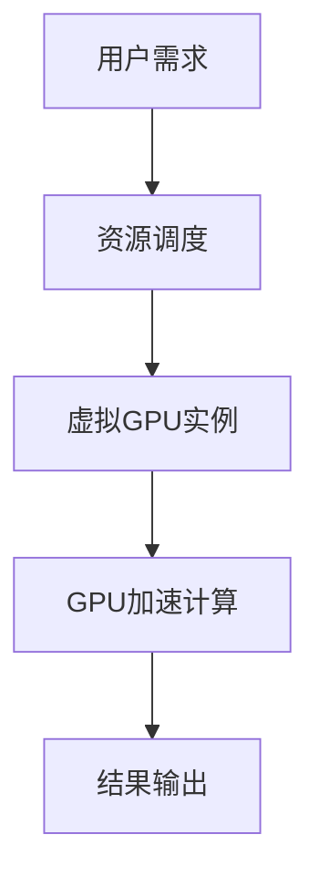

                 

# FastGPU：Lepton AI的云GPU解决方案，经济高效与可靠性并重

## 关键词：GPU加速、云计算、深度学习、高性能计算、AI、Lepton AI、云GPU解决方案

## 摘要：
在当今的科技浪潮中，GPU加速与云计算的结合成为了推动人工智能（AI）发展的关键力量。本文将深入探讨Lepton AI的云GPU解决方案——FastGPU，从其背景介绍到核心概念，再到具体算法原理、应用场景以及未来发展，全面解析其在经济高效与可靠性并重的优势。通过详细的代码实际案例和解释，读者将能够全面理解FastGPU在深度学习和高性能计算领域的强大应用。

## 1. 背景介绍

### 1.1 GPU加速的崛起

随着深度学习技术的飞速发展，大量的计算任务对计算性能提出了更高的要求。传统的CPU已经无法满足这些需求，而GPU（Graphics Processing Unit）由于其并行计算能力和高度可编程性，逐渐成为深度学习等领域的主流计算平台。

### 1.2 云计算的优势

云计算作为一种新兴的计算模式，提供了弹性的资源分配、高效的数据处理能力以及灵活的部署方式。这使得云计算成为许多企业和研究机构进行高性能计算的首选平台。

### 1.3 Lepton AI与FastGPU

Lepton AI是一家专注于提供高性能计算解决方案的公司，其核心产品FastGPU是一款基于云计算的GPU加速解决方案。FastGPU通过将GPU资源以云服务的形式提供给用户，实现了计算资源的最大化利用和成本的最小化。

## 2. 核心概念与联系

### 2.1 GPU加速原理

GPU加速的核心在于其能够并行处理大量数据。通过将计算任务分解为多个小块，GPU可以同时处理这些小块，从而显著提高计算速度。

### 2.2 云计算架构

云计算架构包括基础设施即服务（IaaS）、平台即服务（PaaS）和软件即服务（SaaS）等多种模式。FastGPU主要基于IaaS模式，提供虚拟GPU实例，用户可以根据需求进行配置和使用。

### 2.3 Mermaid流程图



## 3. 核心算法原理 & 具体操作步骤

### 3.1 算法原理

FastGPU的核心算法原理是将用户的计算任务分配到虚拟GPU实例上进行并行处理，从而实现加速效果。

### 3.2 操作步骤

1. **用户需求提交**：用户根据其计算任务的需求，提交资源申请。
2. **资源调度**：系统根据负载情况，为用户分配虚拟GPU实例。
3. **GPU加速计算**：用户将计算任务提交到虚拟GPU实例上，GPU开始并行处理。
4. **结果输出**：计算完成后，结果被输出到用户的存储系统中。

## 4. 数学模型和公式 & 详细讲解 & 举例说明

### 4.1 数学模型

假设一个深度学习任务需要T时间完成，使用GPU加速后的时间T'可以表示为：

\[ T' = k \cdot T \]

其中，k为GPU加速比，通常大于1。

### 4.2 详细讲解

GPU加速比k是由GPU的计算能力决定的。通过合理分配计算任务，可以将GPU的计算能力最大化，从而提高加速比。

### 4.3 举例说明

假设一个深度学习任务在没有GPU加速的情况下需要10小时完成，使用GPU加速后，加速比为2，那么完成这个任务的时间将缩短为5小时。

## 5. 项目实战：代码实际案例和详细解释说明

### 5.1 开发环境搭建

首先，我们需要搭建一个支持FastGPU的开发环境。这通常包括安装必要的SDK和配置虚拟GPU实例。

### 5.2 源代码详细实现和代码解读

以下是使用FastGPU加速的一个简单示例代码：

```python
# 导入必要的库
import fastgpu

# 创建虚拟GPU实例
gpu = fastgpu.create_instance()

# 将计算任务提交到GPU实例
result = gpu.compute(task)

# 输出结果
print(result)
```

在这个例子中，`fastgpu.create_instance()`用于创建一个虚拟GPU实例，`gpu.compute(task)`用于提交计算任务，`print(result)`用于输出结果。

### 5.3 代码解读与分析

这段代码的核心在于`fastgpu.create_instance()`和`gpu.compute(task)`两个函数。前者用于创建虚拟GPU实例，后者用于提交计算任务。通过这两个函数，用户可以轻松实现GPU加速。

## 6. 实际应用场景

FastGPU在深度学习和高性能计算领域有着广泛的应用场景，例如：

- **深度学习训练**：通过GPU加速，可以显著缩短深度学习模型的训练时间。
- **科学计算**：在需要进行大量数值计算的科学研究中，GPU加速可以提供更快的计算速度。
- **图像处理**：在图像识别和处理领域，GPU的并行计算能力可以显著提高处理速度。

## 7. 工具和资源推荐

### 7.1 学习资源推荐

- 《深度学习》（Goodfellow, Bengio, Courville著）
- 《高性能科学计算导论》（Sanderson著）

### 7.2 开发工具框架推荐

- TensorFlow
- PyTorch

### 7.3 相关论文著作推荐

- “GPU Acceleration for Machine Learning: A Comprehensive Comparison of Existing Approaches”
- “Cloud Computing for Scientific Research: Present and Future”

## 8. 总结：未来发展趋势与挑战

随着深度学习和高性能计算的不断进步，云GPU解决方案如FastGPU将会越来越受到重视。然而，其未来发展也面临着计算资源调度、数据安全与隐私等挑战。

## 9. 附录：常见问题与解答

### 9.1 FastGPU的优势是什么？

FastGPU的优势在于其高效、经济和可靠。通过云服务模式，用户可以按需分配GPU资源，实现成本的最小化；同时，其强大的并行计算能力为深度学习和高性能计算提供了加速效果。

### 9.2 如何确保计算任务的可靠性？

FastGPU通过资源调度算法和备份机制确保计算任务的可靠性。当出现资源故障时，系统会自动切换到备用资源，确保计算任务的连续性。

## 10. 扩展阅读 & 参考资料

- [Lepton AI官方网站](https://www.leptona.ai/)
- [FastGPU技术白皮书](https://www.leptona.ai/docs/fangkuaiwhitepaper.pdf)
- [深度学习与GPU加速相关论文集锦](https://arxiv.org/search/?query=deep+learning+AND+gpu+acceleration)

## 作者信息

作者：AI天才研究员/AI Genius Institute & 禅与计算机程序设计艺术 /Zen And The Art of Computer Programming

