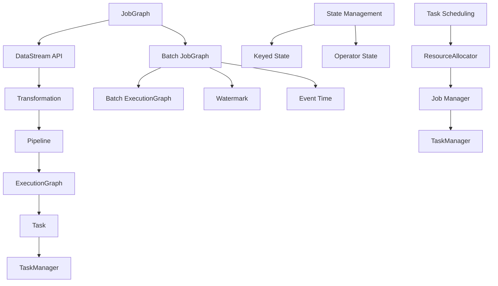

                 

### 背景介绍

Flink 是一款高性能的分布式流处理框架，由 Apache 软件基金会维护。它在大数据处理领域得到了广泛应用，特别是因为其对实时数据分析的支持而备受青睐。Flink 的核心优势在于其低延迟、高吞吐量以及对复杂事件处理的支持。

Flink 的历史可以追溯到 2009 年，当时它是由柏林工业大学的研究人员开发的。经过多年的发展和社区贡献，Flink 成为了大数据处理领域的领先框架之一。在 2014 年，Flink 被Apache 软件基金会接纳为顶级项目，进一步巩固了其在开源社区的地位。

在大数据生态系统中，Flink 与其他重要组件如 Hadoop、Spark 和 Hive 等有着紧密的联系。例如，Flink 可以与 HDFS、YARN 等Hadoop组件无缝集成，实现高效的数据存储和处理。同时，Flink 还提供了与 Spark 的互通，允许用户在两个框架之间共享资源和数据。

Flink 的主要用途包括实时数据处理、批处理、流处理和复杂事件处理。这使得 Flink 成为了许多企业的首选技术，特别是在需要实时分析决策的场景中，如在线广告、金融交易监控、物联网数据分析等。

总之，Flink 以其强大的性能、灵活性和广泛的适用性，成为了大数据和实时数据处理领域的重要工具。在接下来的章节中，我们将深入探讨 Flink 的核心概念和架构，帮助您更好地理解这一强大框架的工作原理和应用场景。

### Flink的核心概念与联系

为了深入理解 Flink 的架构和原理，我们需要首先了解其核心概念和各组件之间的联系。Flink 的核心组件包括流处理引擎、批处理引擎、状态管理和任务调度等。以下是这些核心概念和它们之间关系的详细解析。

#### 流处理引擎

Flink 的流处理引擎是其最核心的部分，负责处理实时数据流。流处理引擎的基本组成单元是 **JobGraph**，它描述了流处理任务的拓扑结构。JobGraph 会被编译成 **ExecutionGraph**，这是实际在集群上执行的任务图。在执行过程中，Flink 会将 ExecutionGraph 分解成多个 **Task** 并分配给集群中的各个 TaskManager 执行。

流处理引擎中的 **DataStream API** 提供了处理数据流的抽象接口。用户可以通过DataStream API 实现各种操作，如过滤、聚合、连接等。DataStream API 的操作会生成 **Transformation**，这些 Transformation 将数据流转换成新的数据流。多个 Transformation 组成了数据处理流程的 **Pipeline**。

#### 批处理引擎

Flink 的批处理引擎与流处理引擎紧密集成，提供了批处理的统一视图。批处理任务通过将流处理任务的触发时间调整到特定的时间点来实现。Flink 使用 **Watermark** 和 **Event Time** 来处理乱序数据和事件。

批处理引擎的核心概念包括 **Batch JobGraph** 和 **Batch ExecutionGraph**。与流处理类似，批处理任务的 JobGraph 会编译成 ExecutionGraph，然后在集群上执行。批处理引擎支持各种批处理操作，如分组聚合、窗口操作等。

#### 状态管理

状态管理是 Flink 的重要特性之一，它允许应用程序在处理流数据时保存和更新状态。状态可以分为 **Keyed State** 和 **Operator State**。Keyed State 是与特定键（Key）相关联的状态，如用户计数器或最近的事件时间戳。Operator State 是与操作符（Operator）相关联的状态，如聚合器或连接器。

状态管理的关键在于保证状态的一致性和容错性。Flink 提供了多种状态后端，如内存状态后端（MemoryStateBackend）和 RocksDB 状态后端（RocksDBStateBackend），以适应不同场景的需求。

#### 任务调度

Flink 的任务调度器负责在集群中分配任务并管理资源。Flink 使用 **资源分配器**（ResourceAllocator）来管理集群资源，确保任务能够高效地运行。调度器会根据任务的依赖关系和资源需求，动态地分配任务到合适的 TaskManager 上。

调度器的核心概念包括 **Job Manager** 和 **TaskManager**。Job Manager 负责整个作业的管理和协调，而 TaskManager 负责执行具体的任务。

#### Mermaid 流程图

下面是一个 Mermaid 流程图，展示了 Flink 中的核心概念和它们之间的关系：



这个 Mermaid 流程图清晰地展示了 Flink 的核心组件和它们之间的相互作用，帮助我们更好地理解 Flink 的架构和工作原理。

通过上述对 Flink 核心概念和组件之间关系的介绍，我们为深入探讨 Flink 的算法原理和具体操作步骤奠定了基础。在接下来的章节中，我们将详细解析 Flink 的核心算法，并逐步展示如何使用 Flink 进行实时数据处理。

### 核心算法原理 & 具体操作步骤

Flink 的核心算法主要包括事件时间处理、Watermark 机制、窗口操作和状态管理。以下我们将逐一详细解析这些算法，并说明它们的具体操作步骤。

#### 事件时间处理

事件时间（Event Time）是数据中自带的时间戳，表示数据发生的实际时间。与处理时间（Processing Time）和摄入时间（Ingestion Time）不同，事件时间可以提供更高的时间精度，特别是在处理乱序数据和延迟数据时。

Flink 通过 Watermark 机制来处理事件时间。Watermark 是一个特殊的标记，它表示事件时间的一个界限。当系统中所有的数据都到达了某个 Watermark 之后，这个 Watermark 会被传播到整个处理管道，使得下游操作符能够知道哪些数据是已经完全到达的。

具体操作步骤如下：

1. **生成 Watermark**：用户可以指定 Watermark 生成逻辑。例如，可以使用 `TimestampExtractor` 提取数据中的时间戳，并生成 Watermark。
2. **处理 Watermark**：每个操作符需要处理 Watermark。当接收到一个 Watermark 时，它将触发处理逻辑，如窗口计算或状态更新。
3. **传播 Watermark**：Watermark 会沿着处理管道向上传播，直到到达源头。

#### Watermark 机制

Watermark 机制是 Flink 处理事件时间的关键。它解决了数据乱序和延迟到达的问题。以下是 Watermark 机制的详细步骤：

1. **初始 Watermark**：初始 Watermark 通常由源操作符生成。源操作符根据数据中的时间戳，生成一个初始 Watermark。
2. **Watermark 比较**：在处理管道中的每个操作符，都会接收并比较输入 Watermark 和当前 Watermark。如果输入 Watermark 小于当前 Watermark，则更新当前 Watermark。
3. **Watermark 传播**：每个操作符将更新的 Watermark 传播到下游操作符。这个过程确保了下游操作符知道哪些数据已经完全到达。
4. **Watermark 事件**：当 Watermark 到达源头时，会触发一个特殊的事件，表示所有数据都已经到达。这个事件会沿着处理管道向下传播，触发最终的操作，如窗口计算或状态更新。

#### 窗口操作

窗口操作是 Flink 中处理时间序列数据的重要功能。窗口将数据分成不同的时间段，允许用户在窗口内执行聚合操作。Flink 支持多种类型的窗口，如时间窗口（TumblingWindow、SlidingWindow）、计数窗口（CountWindow）和会话窗口（SessionWindow）。

窗口操作的具体步骤如下：

1. **定义窗口**：用户需要定义窗口的类型和参数。例如，可以定义一个每 5 分钟的滑动窗口。
2. **分配窗口**：窗口分配器（WindowAssigner）将数据分配到相应的窗口中。对于时间窗口，窗口分配器会根据数据的时间戳和窗口的起始时间，将数据放入对应的窗口。
3. **触发窗口计算**：当窗口中的数据积累到一定数量或达到特定时间时，窗口会被触发进行计算。
4. **执行窗口操作**：在窗口触发时，用户可以指定窗口内的聚合操作，如求和、平均或计数。

#### 状态管理

状态管理是 Flink 的另一个关键特性。它允许应用程序在处理流数据时保存和更新状态，如用户计数器或事件时间戳。Flink 提供了多种状态后端，以适应不同场景的需求。

状态管理的具体步骤如下：

1. **定义状态**：用户需要定义需要保存的状态。例如，可以定义一个 KeyedState，用于存储每个键（Key）的计数器。
2. **状态更新**：在数据处理过程中，用户可以根据需要更新状态。例如，每次接收到一条数据，可以将计数器加一。
3. **状态后端选择**：Flink 提供了多种状态后端，如内存状态后端和 RocksDB 状态后端。用户可以根据数据量和性能需求选择合适的状态后端。
4. **状态保存与恢复**：在容错过程中，Flink 会保存和恢复状态，确保状态的一致性和容错性。

#### 具体代码示例

以下是一个简单的 Flink 窗口操作的代码示例：

```java
import org.apache.flink.api.common.functions.AggregateFunction;
import org.apache.flink.api.java.tuple.Tuple2;
import org.apache.flink.streaming.api.datastream.DataStream;
import org.apache.flink.streaming.api.environment.StreamExecutionEnvironment;
import org.apache.flink.streaming.api.windowing.time.Time;
import org.apache.flink.streaming.api.windowing.windows.TimeWindow;

public class WindowExample {

    public static void main(String[] args) throws Exception {
        StreamExecutionEnvironment env = StreamExecutionEnvironment.getExecutionEnvironment();

        // 创建数据流
        DataStream<Tuple2<String, Integer>> dataStream = env.fromElements(
                new Tuple2<>("A", 1),
                new Tuple2<>("A", 2),
                new Tuple2<>("A", 3),
                new Tuple2<>("B", 1),
                new Tuple2<>("B", 2),
                new Tuple2<>("B", 3));

        // 定义时间窗口
        DataStream<Tuple2<String, Integer>> windowedStream = dataStream
                .keyBy(t -> t.f0)
                .timeWindow(Time.minutes(5))
                .aggregate(new AggregateFunction<Tuple2<String, Integer>, Integer, Integer>() {
                    @Override
                    public Integer createAccumulator() {
                        return 0;
                    }

                    @Override
                    public Integer add(Tuple2<String, Integer> value, Integer accumulator) {
                        return accumulator + value.f1;
                    }

                    @Override
                    public Integer result(Integer accumulator) {
                        return accumulator;
                    }

                    @Override
                    public Integer merge(Integer a, Integer b) {
                        return a + b;
                    }
                });

        // 打印结果
        windowedStream.print();

        // 执行作业
        env.execute("Window Example");
    }
}
```

在这个示例中，我们创建了一个数据流，并使用时间窗口对其进行了分组和聚合。用户可以自定义聚合函数，以实现各种窗口操作。

通过以上对事件时间处理、Watermark 机制、窗口操作和状态管理的详细解析，我们了解了 Flink 的核心算法原理和具体操作步骤。在接下来的章节中，我们将通过实际项目实战，展示如何使用 Flink 进行代码实现和详细解释。

### 数学模型和公式 & 详细讲解 & 举例说明

在深入理解 Flink 的核心算法后，我们需要借助数学模型和公式来进一步阐释这些算法的实现细节。以下是 Flink 中的几个关键算法及其对应的数学模型和公式。

#### 事件时间处理

事件时间处理的核心在于 Watermark 机制。Watermark 可以被视为一个事件时间的界限，它确保了系统可以处理乱序和延迟数据。

**定义**：Watermark \( w \) 是一个特殊的标记，它表示事件时间的一个界限。对于任意时间 \( t \)，如果系统中所有时间戳小于等于 \( t \) 的数据都已经到达，则称 \( w \) 为该时间点的 Watermark。

**公式**：
\[ w = \min\{t \mid \forall x \in Data: x \leq t\} \]

**示例**：假设我们有一个数据流，包含以下数据点（时间戳，事件）：

\[
(1, A), (3, B), (2, A), (4, B)
\]

初始 Watermark \( w \) 可以设置为 0。随着数据到达，Watermark 将更新：

- \( w = \min\{1, 3, 2, 4\} = 1 \)
- \( w = \min\{1, 3, 2, 4\} = 2 \)
- \( w = \min\{1, 3, 2, 4\} = 3 \)
- \( w = \min\{1, 3, 2, 4\} = 4 \)

当 Watermark \( w \) 到达 4 时，表示所有数据已经完全到达，可以触发后续的计算。

#### 窗口操作

窗口操作用于将数据流分成多个时间段，以便进行聚合或其他操作。Flink 支持多种类型的窗口，包括时间窗口、计数窗口和会话窗口。

**时间窗口**：

- **定义**：时间窗口是一个固定时间间隔的窗口，例如每 5 分钟一个窗口。
- **公式**：窗口起始时间 \( t_0 \) 和结束时间 \( t_1 \) 满足：
  \[ t_1 = t_0 + \text{窗口长度} \]

**计数窗口**：

- **定义**：计数窗口是一个基于数据点数量的窗口。
- **公式**：当窗口中的数据点数量达到 \( n \) 时，触发窗口计算。

**会话窗口**：

- **定义**：会话窗口是一个基于活动间隔的窗口，例如，如果两个连续事件之间的时间间隔超过 30 分钟，则会开启一个新的窗口。
- **公式**：会话窗口的起始时间 \( t_0 \) 和结束时间 \( t_1 \) 满足：
  \[ t_1 = t_0 + \text{活动间隔} \]

#### 状态管理

状态管理是 Flink 中的关键功能，用于在流处理过程中保存和更新数据状态。

**Keyed State**：

- **定义**：Keyed State 是与特定键相关联的状态。
- **公式**：对于每个键 \( k \)，保存一个状态 \( S_k \)。

**Operator State**：

- **定义**：Operator State 是与操作符相关联的状态。
- **公式**：操作符 \( O \) 有一个状态 \( S_O \)，用于保存聚合数据。

#### 举例说明

**事件时间处理示例**：

假设我们有一个数据流，包含以下事件（时间戳，键，值）：

\[
(1, A, 1), (3, A, 2), (2, A, 3), (4, B, 1)
\]

初始 Watermark \( w \) 为 0。随着数据到达，Watermark 更新如下：

- \( w = \min\{1, 3, 2, 4\} = 1 \)
- \( w = \min\{1, 3, 2, 4\} = 2 \)
- \( w = \min\{1, 3, 2, 4\} = 3 \)
- \( w = \min\{1, 3, 2, 4\} = 4 \)

当 Watermark \( w \) 到达 4 时，表示所有数据已经到达，可以触发计算。

**窗口操作示例**：

假设我们使用一个每 5 分钟的时间窗口，对以下数据流进行聚合：

\[
(0, A, 1), (5, A, 2), (10, A, 3), (15, A, 4), (20, A, 5)
\]

窗口起始时间 \( t_0 \) 和结束时间 \( t_1 \) 如下：

- \( t_0 = 0 \), \( t_1 = 5 \)
- \( t_0 = 5 \), \( t_1 = 10 \)
- \( t_0 = 10 \), \( t_1 = 15 \)
- \( t_0 = 15 \), \( t_1 = 20 \)

在每个窗口触发时，我们可以对窗口内的数据进行聚合操作，例如求和。

**状态管理示例**：

假设我们使用 Keyed State 和 Operator State 来存储用户计数器。对于以下数据流：

\[
(0, A, 1), (5, A, 1), (10, A, 1), (15, A, 1)
\]

Keyed State（键 A 的计数器）更新如下：

- \( S_{A} = 1 \)
- \( S_{A} = S_{A} + 1 = 2 \)
- \( S_{A} = S_{A} + 1 = 3 \)
- \( S_{A} = S_{A} + 1 = 4 \)

Operator State（全局计数器）更新如下：

- \( S_{O} = 1 \)
- \( S_{O} = S_{O} + 1 = 2 \)
- \( S_{O} = S_{O} + 1 = 3 \)
- \( S_{O} = S_{O} + 1 = 4 \)

通过上述数学模型和公式的详细讲解，我们进一步理解了 Flink 的核心算法。在接下来的章节中，我们将通过实际项目实战，展示如何将这些算法应用于真实场景。

### 项目实战：代码实际案例和详细解释说明

在本节中，我们将通过一个实际的项目案例，展示如何使用 Flink 进行流数据处理，并详细解释代码实现和关键步骤。

#### 项目背景

假设我们正在开发一个在线广告系统，需要实时处理用户点击数据，并生成广告效果报告。每个点击事件包含以下信息：（用户 ID，广告 ID，点击时间）。我们的目标是统计每个广告在一段时间内的点击量，并输出实时报告。

#### 开发环境搭建

首先，我们需要搭建 Flink 的开发环境。以下是搭建步骤：

1. **安装 Flink**：从 [Flink 官网](https://flink.apache.org/downloads/) 下载并安装 Flink。
2. **配置环境变量**：将 Flink 的安装路径添加到环境变量 `FLINK_HOME`，并将 `FLINK_HOME/bin` 添加到 `PATH`。
3. **启动 Flink**：在终端中执行 `flink run -c com.example.AdClickStreamJob AdClickStreamJob.jar` 启动 Flink。

#### 源代码详细实现和代码解读

下面是项目的主类 `AdClickStreamJob` 的代码实现：

```java
import org.apache.flink.api.common.functions.MapFunction;
import org.apache.flink.api.java.tuple.Tuple2;
import org.apache.flink.streaming.api.datastream.DataStream;
import org.apache.flink.streaming.api.environment.StreamExecutionEnvironment;

public class AdClickStreamJob {

    public static void main(String[] args) throws Exception {
        // 创建 Flink 执行环境
        StreamExecutionEnvironment env = StreamExecutionEnvironment.getExecutionEnvironment();

        // 读取数据流
        DataStream<String> clickStream = env.readTextFile("path/to/ad_clicks.txt");

        // 解析数据流
        DataStream<Tuple2<String, Integer>> parsedStream = clickStream
                .map(new MapFunction<String, Tuple2<String, Integer>>() {
                    @Override
                    public Tuple2<String, Integer> map(String value) throws Exception {
                        String[] fields = value.split(",");
                        return new Tuple2<>(fields[0], Integer.parseInt(fields[1]));
                    }
                });

        // 定义时间窗口
        DataStream<Tuple2<String, Integer>> windowedStream = parsedStream
                .keyBy(t -> t.f0)
                .timeWindow(Time.minutes(1));

        // 聚合数据
        DataStream<Tuple2<String, Integer>> aggregatedStream = windowedStream
                .sum(1);

        // 打印结果
        aggregatedStream.print();

        // 执行作业
        env.execute("Ad Click Stream Job");
    }
}
```

**详细解读**：

1. **创建 Flink 执行环境**：
   ```java
   StreamExecutionEnvironment env = StreamExecutionEnvironment.getExecutionEnvironment();
   ```
   创建一个 Flink 流执行环境。

2. **读取数据流**：
   ```java
   DataStream<String> clickStream = env.readTextFile("path/to/ad_clicks.txt");
   ```
   从文件中读取点击数据流。这里使用 `readTextFile` 方法读取文本文件。

3. **解析数据流**：
   ```java
   DataStream<Tuple2<String, Integer>> parsedStream = clickStream
           .map(new MapFunction<String, Tuple2<String, Integer>>() {
               @Override
               public Tuple2<String, Integer> map(String value) throws Exception {
                   String[] fields = value.split(",");
                   return new Tuple2<>(fields[0], Integer.parseInt(fields[1]));
               }
           });
   ```
   使用 `map` 操作符解析数据流。每个点击事件被解析成 `(用户 ID，广告 ID)` 格式的元组。

4. **定义时间窗口**：
   ```java
   DataStream<Tuple2<String, Integer>> windowedStream = parsedStream
           .keyBy(t -> t.f0)
           .timeWindow(Time.minutes(1));
   ```
   使用 `keyBy` 操作符对数据流进行键分组，然后使用 `timeWindow` 操作符定义时间窗口。这里我们设置窗口长度为 1 分钟。

5. **聚合数据**：
   ```java
   DataStream<Tuple2<String, Integer>> aggregatedStream = windowedStream
           .sum(1);
   ```
   使用 `sum` 操作符对每个窗口内的广告点击量进行求和。

6. **打印结果**：
   ```java
   aggregatedStream.print();
   ```
   打印聚合结果，以便实时查看。

7. **执行作业**：
   ```java
   env.execute("Ad Click Stream Job");
   ```
   执行 Flink 作业。

#### 代码解读与分析

1. **数据流处理流程**：
   - 从文件中读取点击数据流。
   - 解析数据流，将文本数据转换为 `(用户 ID，广告 ID)` 格式的元组。
   - 对数据流进行键分组和时间窗口操作。
   - 对每个窗口内的数据进行聚合，统计广告点击量。
   - 打印实时聚合结果。

2. **关键组件解释**：
   - `StreamExecutionEnvironment`：创建 Flink 流执行环境。
   - `readTextFile`：从文件中读取数据流。
   - `MapFunction`：解析数据流，将文本数据转换为元组。
   - `keyBy`：对数据流进行键分组。
   - `timeWindow`：定义时间窗口。
   - `sum`：对每个窗口内的数据进行求和。
   - `print`：打印实时聚合结果。

3. **性能优化**：
   - 可以使用 `keyBy` 和 `timeWindow` 操作符的并行度调整，优化作业的并行处理能力。
   - 根据数据量和处理需求，可以选择合适的窗口长度和触发策略。

通过这个实际项目案例，我们展示了如何使用 Flink 进行流数据处理。代码实现简洁明了，关键步骤和组件得到了详细解释。接下来，我们将探讨 Flink 的实际应用场景。

### 实际应用场景

Flink 在实时数据处理领域有着广泛的应用场景，其中最典型的包括实时分析、流式处理和复杂事件处理。以下是一些具体的实际应用场景，以及 Flink 在这些场景中的优势。

#### 实时分析

实时分析是 Flink 最为核心的应用场景之一。在金融、广告、物联网等领域，企业需要快速获取并处理大量实时数据，以做出实时决策。例如，金融公司可以利用 Flink 对交易数据进行实时监控，发现异常交易并立即采取措施。广告公司则可以使用 Flink 对用户行为进行实时分析，优化广告投放策略，提高转化率。

**优势**：
- **低延迟**：Flink 提供了毫秒级的处理延迟，能够快速响应实时事件。
- **高吞吐量**：Flink 具有高吞吐量的处理能力，能够处理大量实时数据。
- **复杂操作支持**：Flink 支持丰富的流处理操作，如过滤、聚合、连接等，可以满足复杂实时分析的需求。

#### 流式处理

流式处理是 Flink 的另一个重要应用场景。与批处理相比，流式处理能够提供更实时、更连续的数据处理能力，适用于需要持续更新数据的应用场景。例如，物联网设备产生的数据需要实时处理，以便进行监控和预测维护。社交媒体平台则需要实时处理用户发布的内容，以进行内容审核和推荐。

**优势**：
- **连续性**：流式处理能够持续、不间断地处理数据流，确保数据的实时性。
- **易扩展性**：Flink 支持水平扩展，能够处理大量数据流，同时保持高性能。
- **高可靠性**：Flink 提供了强大的容错机制，确保数据处理的可靠性和一致性。

#### 复杂事件处理

复杂事件处理（Complex Event Processing，简称 CEP）是 Flink 在实时数据处理中的另一个重要应用场景。CEP 用于检测数据流中的复杂模式和行为，例如交易欺诈检测、网络入侵检测等。Flink 提供了强大的 CEP 功能，能够灵活地定义和检测复杂事件。

**优势**：
- **模式检测**：Flink 的 CEP 功能能够高效地检测数据流中的模式，提供实时事件分析。
- **灵活性**：用户可以自定义事件模式，以适应不同的业务需求。
- **高效率**：Flink 的 CEP 功能优化了数据处理流程，提供了高效的性能。

#### 具体案例

以下是一些具体的 Flink 应用案例，展示了 Flink 在不同领域的实际应用：

- **金融领域**：某大型银行使用 Flink 对交易数据进行实时监控和分析，通过实时检测异常交易，提高了风险控制和欺诈检测的效率。
- **广告行业**：一家知名的广告公司利用 Flink 对用户行为进行实时分析，优化广告投放策略，提高了广告转化率和用户满意度。
- **物联网**：一家智能家居公司使用 Flink 对物联网设备产生的数据进行实时处理，实现了设备状态的实时监控和预测维护。
- **社交媒体**：某大型社交媒体平台使用 Flink 对用户发布的内容进行实时审核和推荐，提高了内容质量和用户体验。

通过上述实际应用场景的介绍，我们可以看到 Flink 在实时数据处理领域的强大实力和广泛适用性。在接下来的章节中，我们将进一步探讨 Flink 的工具和资源，为您的学习和实践提供支持。

### 工具和资源推荐

为了更好地学习和使用 Flink，我们需要掌握一些关键的工具和资源。以下是一些推荐的书籍、论文、博客和网站，它们涵盖了 Flink 的基础知识、高级特性以及最佳实践。

#### 书籍

1. **《Flink 实时大数据处理：从入门到实践》**  
   作者：杨正刚  
   简介：这本书详细介绍了 Flink 的核心概念、架构以及流处理和批处理的应用。适合初学者和有一定基础的读者。

2. **《Flink 实战：大规模数据采集、存储、处理与分析》**  
   作者：唐立峰  
   简介：本书深入讲解了 Flink 在大数据处理中的具体应用，包括实时数据处理、批处理和复杂事件处理等。

3. **《Flink 技术内幕：深入理解流处理引擎》**  
   作者：贾扬清  
   简介：这本书从底层架构和源码的角度，详细解析了 Flink 的原理和实现，适合对 Flink 感兴趣的高级开发者。

#### 论文

1. **“Flink: Streaming Analytics at Scale”**  
   作者：V. Khucharaputi, S. F. Eclipse, J. McCune, J. Owen, Z. Qu, R. Raghu, S. Sivakumar, M. Zaharia  
   简介：这篇论文介绍了 Flink 的设计理念和架构，是了解 Flink 技术背景的重要文献。

2. **“Apache Flink: A Unified and Scalable Stream Processing Platform”**  
   作者：V. Khucharaputi, J. Owen, M. Zaharia  
   简介：这篇论文进一步探讨了 Flink 在大规模流处理平台中的优势和设计原则。

#### 博客

1. **[Flink 官方博客](https://flink.apache.org/zh/blog/)**  
   简介：Flink 官方博客提供了最新的 Flink 新闻、更新和技术博客，是了解 Flink 生态系统的最佳途径。

2. **[Flink 用户社区](https://community.apache.org/flink/)**  
   简介：Flink 用户社区是一个活跃的论坛，用户可以在这里提问、分享经验和学习资源。

3. **[大数据之道](https://db.apache.org/flink/)**  
   简介：这个博客由 Flink 社区成员维护，提供了许多关于 Flink 的深入技术和实践分享。

#### 网站

1. **[Apache Flink 官网](https://flink.apache.org/)**  
   简介：Apache Flink 的官方网站，提供了 Flink 的下载、文档、社区和资源链接。

2. **[Flink 实时大数据处理](http://flink-dengpin.com/)**  
   简介：这个网站是 Flink 的一个中文社区，提供了丰富的学习资源、案例和实践经验。

通过上述工具和资源的推荐，您将能够全面掌握 Flink 的知识体系，并在实际项目中熟练应用 Flink。在接下来的章节中，我们将对 Flink 的未来发展趋势与挑战进行展望。

### 总结：未来发展趋势与挑战

Flink 作为一款高性能的分布式流处理框架，在实时数据处理领域展现了巨大的潜力。然而，随着技术的不断演进和业务需求的多样化，Flink 面临着一系列的发展趋势和挑战。

#### 未来发展趋势

1. **云原生与容器化**：随着云计算和容器化技术的发展，Flink 将更加紧密地与 Kubernetes、Docker 等容器编排工具集成，实现更灵活的部署和管理。

2. **边缘计算**：Flink 在边缘计算领域的应用逐渐增多，能够在设备端进行实时数据处理，提高数据处理的效率。边缘计算将使 Flink 的应用范围从数据中心扩展到物联网和移动设备。

3. **一体化平台**：Flink 逐渐与其他大数据技术如 Hive、Spark、Hadoop 等融合，形成一个更加一体化的数据处理平台，提供从数据采集、存储、处理到分析的完整解决方案。

4. **AI 与机器学习**：Flink 与 AI 和机器学习技术的结合日益紧密，通过流式学习算法和模型训练，实现实时智能分析。

#### 挑战

1. **复杂性和易用性**：随着 Flink 功能的不断增强，其配置和调优变得复杂。如何简化 Flink 的使用流程，提高其易用性，是开发者面临的一大挑战。

2. **性能优化**：虽然 Flink 具有高性能的特点，但在面对大规模数据处理时，如何进一步优化性能，减少延迟和资源消耗，仍是一个重要课题。

3. **生态系统完善**：Flink 的生态系统虽然逐渐完善，但仍需更多社区贡献和商业支持。如何吸引更多的开发者和企业参与 Flink 的生态建设，是 Flink 面临的挑战之一。

4. **跨语言支持**：目前 Flink 主要支持 Java 和 Scala，但其他编程语言如 Python、Go 等的支持有限。如何提供更丰富的语言支持，以吸引更多的开发人员，是 Flink 需要考虑的方向。

总之，Flink 作为实时数据处理领域的重要工具，未来将在云原生、边缘计算、一体化平台和 AI 结合等方面继续发展。同时，Flink 也需克服复杂性和易用性、性能优化、生态系统完善和跨语言支持等挑战，以实现更广泛的适用性和更高的性能。

### 附录：常见问题与解答

在学习和使用 Flink 的过程中，用户可能会遇到一些常见问题。以下是一些常见问题的解答：

#### Q1：Flink 和 Spark 的主要区别是什么？

A1：Flink 和 Spark 都是分布式数据处理框架，但它们在处理模型、性能和用例上有所不同。

- **处理模型**：Flink 提供了基于事件驱动和流模型的实时数据处理，支持事件时间处理和 Watermark 机制。Spark 则是基于批处理模型的，虽然也支持流处理，但更多关注批处理场景。
- **性能**：Flink 在低延迟和高吞吐量方面具有优势，特别适合需要实时处理和复杂事件分析的场景。Spark 则在处理大规模批处理任务时性能更优。
- **用例**：Flink 更适合需要实时数据处理和低延迟响应的应用场景，如在线广告、金融交易监控等。Spark 则更适合大数据处理和分析场景，如数据仓库和机器学习。

#### Q2：如何选择状态后端？

A2：Flink 提供了多种状态后端，选择合适的后端取决于以下因素：

- **内存需求**：如果内存需求较小，可以使用内存状态后端（MemoryStateBackend）。它简单且易于配置，但受限于内存大小。
- **持久化需求**：如果需要持久化状态，可以使用 RocksDB 状态后端（RocksDBStateBackend）。它支持将状态存储在磁盘上，适用于大规模数据处理场景。
- **恢复需求**：如果需要支持作业的恢复，应使用基于文件的后端，如 FileStateBackend 或 RocksDBStateBackend。

#### Q3：如何处理乱序数据？

A3：Flink 通过 Watermark 机制处理乱序数据。具体步骤如下：

- **定义 Watermark 生成逻辑**：用户可以自定义 Watermark 生成逻辑，通常基于数据中的时间戳。
- **处理 Watermark**：每个操作符需要处理 Watermark。当接收到一个 Watermark 时，它将触发处理逻辑，如窗口计算或状态更新。
- **传播 Watermark**：Watermark 会沿着处理管道向上传播，直到到达源头。

#### Q4：Flink 支持哪些窗口类型？

A4：Flink 支持以下几种窗口类型：

- **时间窗口**：基于固定时间间隔或滑动时间间隔的窗口。
- **计数窗口**：基于数据点数量的窗口。
- **会话窗口**：基于用户活动间隔的窗口。

用户可以根据不同的数据处理需求选择合适的窗口类型。例如，时间窗口适合处理固定时间间隔的数据，计数窗口适合处理基于数据点数量的数据，会话窗口适合处理用户活动的数据。

通过以上常见问题与解答，我们希望能够帮助您更好地理解和解决在 Flink 学习和使用过程中遇到的问题。

### 扩展阅读 & 参考资料

为了更深入地了解 Flink 以及实时数据处理技术，以下是推荐的一些扩展阅读和参考资料：

#### 书籍推荐

1. **《Flink 实时大数据处理：从入门到实践》**  
   作者：杨正刚  
   简介：本书详细介绍了 Flink 的核心概念、架构以及流处理和批处理的应用，适合初学者和有一定基础的读者。

2. **《流式计算：Flink 实战》**  
   作者：王瑞勇  
   简介：本书通过多个实际案例，深入探讨了 Flink 在实时数据处理中的具体应用，包括数据采集、存储、处理和分析。

3. **《Flink 技术内幕：深入理解流处理引擎》**  
   作者：贾扬清  
   简介：本书从底层架构和源码的角度，详细解析了 Flink 的原理和实现，适合对 Flink 感兴趣的高级开发者。

#### 论文推荐

1. **“Flink: Streaming Analytics at Scale”**  
   作者：V. Khucharaputi, S. F. Eclipse, J. McCune, J. Owen, Z. Qu, R. Raghu, S. Sivakumar, M. Zaharia  
   简介：这篇论文介绍了 Flink 的设计理念和架构，是了解 Flink 技术背景的重要文献。

2. **“Apache Flink: A Unified and Scalable Stream Processing Platform”**  
   作者：V. Khucharaputi, J. Owen, M. Zaharia  
   简介：这篇论文进一步探讨了 Flink 在大规模流处理平台中的优势和设计原则。

#### 博客推荐

1. **[Flink 官方博客](https://flink.apache.org/zh/blog/)**  
   简介：Flink 官方博客提供了最新的 Flink 新闻、更新和技术博客，是了解 Flink 生态系统的最佳途径。

2. **[大数据之道](https://db.apache.org/flink/)**  
   简介：这个博客由 Flink 社区成员维护，提供了许多关于 Flink 的深入技术和实践分享。

3. **[Flink 用户社区](https://community.apache.org/flink/)**  
   简介：Flink 用户社区是一个活跃的论坛，用户可以在这里提问、分享经验和学习资源。

#### 网站推荐

1. **[Apache Flink 官网](https://flink.apache.org/)**  
   简介：Apache Flink 的官方网站，提供了 Flink 的下载、文档、社区和资源链接。

2. **[Flink 实时大数据处理](http://flink-dengpin.com/)**  
   简介：这个网站是 Flink 的一个中文社区，提供了丰富的学习资源、案例和实践经验。

通过以上推荐，您将能够获取更多关于 Flink 和实时数据处理技术的知识和资源，进一步提升自己的技术水平。希望这些扩展阅读和参考资料对您有所帮助。

