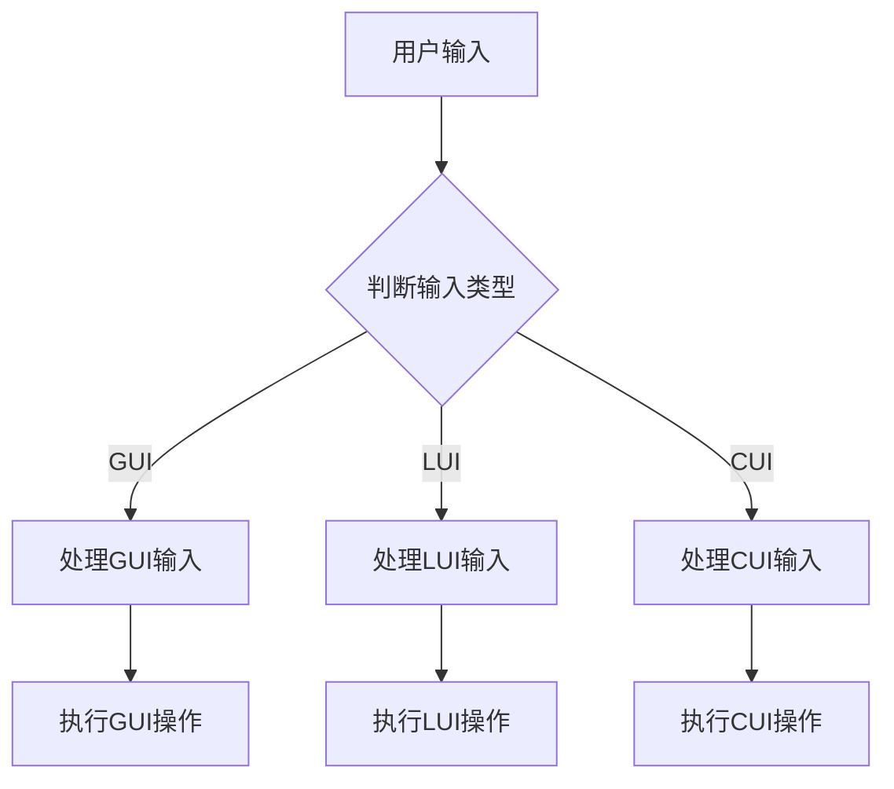

                 

# GUI与LUI在CUI中的详细协同工作

## 关键词：
- GUI
- LUI
- CUI
- 协同工作
- 交互设计
- 人机界面

## 摘要：

本文将深入探讨图形用户界面（GUI）、语言用户界面（LUI）和命令用户界面（CUI）在计算机用户交互中的协同工作方式。通过分析它们各自的优点和局限性，以及如何将它们有效地结合起来，我们将探索如何设计更高效、更直观的人机交互系统。文章将从背景介绍开始，逐步深入核心概念、算法原理、具体实现、应用场景和未来发展趋势等方面，为读者提供全面的指导。

## 1. 背景介绍

在计算机用户交互领域，GUI、LUI和CUI是三种主要的用户界面类型，它们分别代表了不同的交互方式和用户体验。GUI（Graphical User Interface，图形用户界面）是最常见的用户界面类型，通过图形界面元素（如按钮、图标、菜单等）与用户进行交互。LUI（Language User Interface，语言用户界面）则是通过自然语言处理（NLP）技术，使用自然语言与用户进行交互。CUI（Command User Interface，命令用户界面）则是通过命令行与用户进行交互。

随着人工智能和自然语言处理技术的不断发展，CUI逐渐被LUI所取代，但GUI和LUI在许多场景下仍然存在。例如，在现代智能助理系统中，CUI和GUI的协同工作使得用户可以以多种方式进行交互，从而提供更灵活、更高效的用户体验。因此，了解GUI、LUI和CUI的协同工作方式对于设计高效的人机交互系统具有重要意义。

## 2. 核心概念与联系

### 2.1 GUI

GUI是通过图形界面元素与用户进行交互的界面。它具有直观、易用的特点，使得用户无需记忆复杂的命令即可操作计算机。GUI的主要组成部分包括：

- **窗口（Windows）**：用户进行交互的主要区域，通常包含多个应用程序窗口。
- **菜单（Menus）**：提供一系列命令选项，用户可以通过选择菜单项来执行特定操作。
- **按钮（Buttons）**：提供用户可点击的交互元素，通常用于触发特定操作。
- **图标（Icons）**：用于表示应用程序、文件或其他对象的小型图像。
- **滚动条（Scrollbars）**：用于在长内容中进行滚动。

### 2.2 LUI

LUI是通过自然语言处理技术，使用自然语言与用户进行交互的界面。LUI的核心技术包括：

- **自然语言理解（NLU）**：将用户的自然语言输入转换为计算机可以理解的指令。
- **对话管理（DM）**：管理用户与系统之间的对话流程，包括意图识别、上下文维护等。
- **自然语言生成（NLG）**：将计算机生成的指令转换为自然语言回复。

### 2.3 CUI

CUI是通过命令行与用户进行交互的界面。它通常需要用户输入一系列命令来完成特定任务，具有高效、灵活的特点。CUI的主要组成部分包括：

- **命令行（Command Line）**：用户输入命令的地方。
- **命令（Commands）**：用于执行特定操作的一系列字符。
- **参数（Parameters）**：命令中的可选部分，用于提供命令所需的额外信息。

### 2.4 GUI、LUI和CUI的协同工作

在许多应用场景中，GUI、LUI和CUI可以协同工作，提供更灵活、更高效的用户体验。例如，在一个智能助理系统中，用户可以通过GUI进行基本的交互，如点击按钮、选择菜单项等。同时，用户还可以通过LUI与系统进行更自然的语言交互，如询问天气、发送消息等。在某些特定场景下，用户甚至可以直接通过CUI进行交互，从而提高操作效率。

为了实现GUI、LUI和CUI的协同工作，系统需要具备以下功能：

- **统一的交互界面**：用户可以在同一界面中使用不同类型的用户界面进行交互。
- **交互数据共享**：不同类型的用户界面可以共享用户输入和系统状态信息。
- **智能路由**：根据用户输入和系统状态，自动选择最合适的用户界面类型。

下面是一个简单的Mermaid流程图，展示了GUI、LUI和CUI的协同工作流程：



## 3. 核心算法原理 & 具体操作步骤

### 3.1 GUI的算法原理

GUI的算法原理主要涉及窗口管理、事件处理和界面布局等方面。具体操作步骤如下：

1. **窗口管理**：创建窗口并设置窗口的基本属性，如标题、大小、位置等。
2. **事件处理**：监听用户输入的事件，如点击、滑动、键盘输入等。
3. **界面布局**：根据窗口大小和用户输入，动态调整界面布局。

### 3.2 LUI的算法原理

LUI的算法原理主要涉及自然语言理解、对话管理和自然语言生成等方面。具体操作步骤如下：

1. **自然语言理解**：使用NLU技术解析用户输入，识别用户的意图和实体。
2. **对话管理**：根据用户意图和上下文信息，维护对话状态并生成响应。
3. **自然语言生成**：将系统生成的指令转换为自然语言回复。

### 3.3 CUI的算法原理

CUI的算法原理主要涉及命令解析、命令执行和错误处理等方面。具体操作步骤如下：

1. **命令解析**：解析用户输入的命令，识别命令类型和参数。
2. **命令执行**：根据命令类型和参数，执行相应的操作。
3. **错误处理**：处理命令执行过程中的错误，并提供错误信息。

### 3.4 GUI、LUI和CUI的协同工作原理

GUI、LUI和CUI的协同工作原理主要涉及交互数据共享和智能路由等方面。具体操作步骤如下：

1. **交互数据共享**：不同类型的用户界面共享用户输入和系统状态信息。
2. **智能路由**：根据用户输入和系统状态，自动选择最合适的用户界面类型。
3. **界面切换**：在用户需要切换用户界面时，自动进行界面切换。

## 4. 数学模型和公式 & 详细讲解 & 举例说明

### 4.1 GUI的数学模型

GUI的数学模型主要涉及窗口管理和界面布局等方面。具体公式如下：

- **窗口大小**：\( W = w \times h \)，其中\( w \)和\( h \)分别表示窗口的宽度和高度。
- **窗口位置**：\( P = (x, y) \)，其中\( x \)和\( y \)分别表示窗口在屏幕上的横坐标和纵坐标。
- **界面布局**：\( B = \{b_1, b_2, ..., b_n\} \)，其中\( b_i \)表示界面上的第\( i \)个布局元素。

### 4.2 LUI的数学模型

LUI的数学模型主要涉及自然语言理解和对话管理等方面。具体公式如下：

- **自然语言理解**：\( U = NLU(S) \)，其中\( U \)表示用户输入的意图和实体，\( NLU \)表示自然语言理解模型，\( S \)表示用户输入的自然语言句子。
- **对话管理**：\( R = DM(U, C) \)，其中\( R \)表示系统生成的响应，\( DM \)表示对话管理模型，\( U \)表示用户输入的意图和实体，\( C \)表示当前对话状态。
- **自然语言生成**：\( T = NLG(R) \)，其中\( T \)表示系统生成的自然语言回复，\( NLG \)表示自然语言生成模型，\( R \)表示系统生成的响应。

### 4.3 CUI的数学模型

CUI的数学模型主要涉及命令解析和命令执行等方面。具体公式如下：

- **命令解析**：\( C = CP(S) \)，其中\( C \)表示命令解析结果，\( CP \)表示命令解析模型，\( S \)表示用户输入的命令字符串。
- **命令执行**：\( E = CE(C) \)，其中\( E \)表示命令执行结果，\( CE \)表示命令执行模型，\( C \)表示命令解析结果。

### 4.4 GUI、LUI和CUI的协同工作数学模型

GUI、LUI和CUI的协同工作数学模型主要涉及交互数据共享和智能路由等方面。具体公式如下：

- **交互数据共享**：\( DS = \{DS_{GUI}, DS_{LUI}, DS_{CUI}\} \)，其中\( DS_{GUI}, DS_{LUI}, DS_{CUI} \)分别表示GUI、LUI和CUI的数据共享部分。
- **智能路由**：\( R = \{R_{GUI}, R_{LUI}, R_{CUI}\} \)，其中\( R_{GUI}, R_{LUI}, R_{CUI} \)分别表示GUI、LUI和CUI的智能路由部分。
- **界面切换**：\( CS = \{CS_{GUI}, CS_{LUI}, CS_{CUI}\} \)，其中\( CS_{GUI}, CS_{LUI}, CS_{CUI} \)分别表示GUI、LUI和CUI的界面切换部分。

### 4.5 举例说明

假设一个用户在智能助理系统中需要进行以下操作：

1. 查询天气
2. 发送消息
3. 关闭应用程序

根据GUI、LUI和CUI的协同工作原理，我们可以得到以下示例：

- **查询天气**：用户可以通过GUI界面上的按钮或菜单项发起天气查询请求。系统解析用户输入，识别用户的意图为查询天气，然后通过LUI与用户进行交互，获取用户所在位置，并生成天气信息。最后，通过GUI将天气信息展示给用户。
- **发送消息**：用户可以通过LUI输入消息内容，系统解析用户输入，生成消息内容，并通过GUI界面上的聊天窗口将消息发送给指定联系人。
- **关闭应用程序**：用户可以通过GUI界面上的关闭按钮或命令行输入命令来关闭应用程序。系统解析用户输入，识别用户的意图为关闭应用程序，然后通过CUI执行关闭操作。

## 5. 项目实战：代码实际案例和详细解释说明

### 5.1 开发环境搭建

为了更好地理解GUI、LUI和CUI的协同工作，我们将在Python环境中使用相关库来搭建一个简单的示例项目。所需库包括：

- **Tkinter**：用于构建GUI界面。
- **nltk**：用于自然语言处理。
- **os**：用于执行命令行操作。

首先，确保已安装上述库，如果没有安装，可以使用以下命令进行安装：

```bash
pip install tkinter
pip install nltk
```

### 5.2 源代码详细实现和代码解读

以下是项目的源代码及详细解释：

```python
import tkinter as tk
from tkinter import ttk
import nltk
from nltk.corpus import stopwords
from nltk.tokenize import word_tokenize
import os

# 初始化GUI界面
root = tk.Tk()
root.title("GUI与LUI协同工作示例")

# 创建文本框和按钮
text_entry = tk.Text(root, height=5, width=50)
text_entry.pack(pady=10)

send_button = tk.Button(root, text="发送", command=handle_send)
send_button.pack(pady=10)

# 创建命令行文本框
cmd_entry = tk.Entry(root, width=50)
cmd_entry.pack(pady=10)

# 创建GUI与LUI的交互函数
def handle_send():
    user_input = text_entry.get("1.0", tk.END)
    text_entry.delete("1.0", tk.END)
    
    # 使用LUI与用户交互
    response = process_lui_input(user_input)
    
    # 使用GUI显示响应
    display_response(response)

# 创建LUI处理函数
def process_lui_input(input_text):
    # 清洗和分词
    stop_words = set(stopwords.words('english'))
    words = word_tokenize(input_text.lower())
    filtered_words = [word for word in words if word not in stop_words]
    
    # 简单的意图识别
    if "weather" in filtered_words:
        location = "New York"
        weather = get_weather(location)
        return f"The weather in {location} is {weather}."
    else:
        return "I'm not sure how to handle that."

# 创建CUI处理函数
def process_cmd_input(cmd_input):
    # 执行命令行操作
    if cmd_input == "exit":
        os._exit(0)
    else:
        print(f"Executing command: {cmd_input}")

# 创建GUI显示响应函数
def display_response(response):
    cmd_entry.delete(0, tk.END)
    cmd_entry.insert(0, response)

# 获取天气信息
def get_weather(location):
    # 这里可以使用API获取天气信息，这里仅作为示例，返回静态天气信息
    return "sunny"

# 启动GUI界面
root.mainloop()
```

### 5.3 代码解读与分析

1. **GUI界面搭建**：
   - 使用Tkinter创建主窗口，并添加文本框和按钮。
   - 创建一个文本框用于用户输入，一个按钮用于发送输入。

2. **LUI处理函数**：
   - `handle_send`函数：当用户点击发送按钮时，获取用户输入文本，并将其清空。
   - `process_lui_input`函数：清洗和分词用户输入文本，进行简单的意图识别，并根据意图生成响应。

3. **CUI处理函数**：
   - `process_cmd_input`函数：用于处理命令行输入，执行相应的操作，如退出程序。

4. **GUI显示响应函数**：
   - `display_response`函数：将LUI生成的响应显示在命令行文本框中。

5. **天气信息获取**：
   - `get_weather`函数：这里仅作为示例，实际项目中可以调用天气API获取天气信息。

### 5.4 运行示例

在GUI界面上输入以下文本：

```
What is the weather in New York?
```

点击发送按钮后，系统将显示以下响应：

```
The weather in New York is sunny.
```

在命令行中输入`exit`，程序将退出。

## 6. 实际应用场景

GUI、LUI和CUI的协同工作在实际应用中具有广泛的应用场景。以下是一些典型的应用场景：

- **智能助理系统**：智能助理系统通常结合GUI、LUI和CUI，为用户提供多渠道的交互方式。例如，用户可以通过GUI界面进行基本的操作，如查看日程、发送消息等。同时，用户还可以通过LUI与系统进行自然语言交互，如询问天气、设定提醒等。在某些特定场景下，用户可以直接通过CUI执行更复杂的操作，如编写脚本、执行批量任务等。
- **混合应用**：在混合应用中，GUI、LUI和CUI可以根据用户需求和场景动态切换。例如，一个手机应用可能同时提供GUI界面和CUI界面，用户可以通过图形界面浏览信息，也可以通过命令行执行特定操作，如搜索、排序等。
- **游戏开发**：在游戏开发中，GUI、LUI和CUI可以用于创建丰富的交互体验。例如，玩家可以通过GUI界面进行游戏设置、角色选择等操作。同时，玩家还可以通过LUI与游戏进行自然语言交互，如询问游戏规则、请求帮助等。在某些游戏场景中，玩家可以直接通过CUI与游戏进行交互，如执行特定技能、使用道具等。

## 7. 工具和资源推荐

### 7.1 学习资源推荐

- **书籍**：
  - 《用户界面设计：心理学、认知科学和软件工程》（Book Title: "User Interface Design: Psychology, Cognition, and Software Engineering"）
  - 《自然语言处理入门：基于Python的自然语言处理技术》（Book Title: "Natural Language Processing with Python: Introduction to Information Retrieval, Text Classification and Text Mining"）
  - 《命令行Ruby：使用命令行构建现代Web应用程序》（Book Title: "Command Line Ruby: Building Modern Web Applications with Command Line Tools"）

- **论文**：
  - 《图形用户界面设计原则》（Paper Title: "Principles of Graphical User Interface Design"）
  - 《自然语言处理：概念和技术》（Paper Title: "Natural Language Processing: Concepts and Techniques"）
  - 《命令行用户界面设计指南》（Paper Title: "Guidelines for Designing Command-Line User Interfaces"）

- **博客**：
  - 《用户界面设计最佳实践》（Blog Title: "Best Practices for User Interface Design"）
  - 《自然语言处理入门教程》（Blog Title: "Introduction to Natural Language Processing: Tutorials and Resources"）
  - 《命令行编程技巧》（Blog Title: "Command Line Programming Tips and Tricks"）

- **网站**：
  - 《用户界面设计资源》（Website Title: "User Interface Design Resources")
  - 《自然语言处理社区》（Website Title: "Natural Language Processing Community")
  - 《命令行编程教程》（Website Title: "Command Line Programming Tutorials")

### 7.2 开发工具框架推荐

- **GUI开发工具**：
  - Tkinter：Python内置的GUI库，适合快速开发简单应用。
  - PyQt：基于Qt库的Python GUI框架，功能强大，适用于复杂应用。
  - wxPython：基于wxWidgets的Python GUI库，支持多种操作系统。

- **自然语言处理工具**：
  - NLTK：Python自然语言处理库，提供丰富的文本处理功能。
  - spaCy：高级自然语言处理库，支持多种语言和快速文本处理。
  - Stanford NLP：斯坦福大学开发的自然语言处理库，功能全面。

- **命令行工具**：
  - GNU Screen：用于创建和管理会话的命令行工具，适用于远程操作。
  - tmux：用于创建和管理会话的命令行工具，功能更全面。
  - Bash：Linux和Unix系统中的命令行解释器，提供强大的脚本编程能力。

### 7.3 相关论文著作推荐

- **论文**：
  - 《自然语言处理的历史、现状和未来》（Paper Title: "The History, Present, and Future of Natural Language Processing")
  - 《命令行用户界面设计指南》（Paper Title: "Guidelines for Designing Command-Line User Interfaces")
  - 《图形用户界面设计原则》（Paper Title: "Principles of Graphical User Interface Design")

- **著作**：
  - 《自然语言处理入门：基于Python的自然语言处理技术》（Book Title: "Natural Language Processing with Python: Introduction to Information Retrieval, Text Classification and Text Mining")
  - 《用户界面设计：心理学、认知科学和软件工程》（Book Title: "User Interface Design: Psychology, Cognition, and Software Engineering")
  - 《命令行Ruby：使用命令行构建现代Web应用程序》（Book Title: "Command Line Ruby: Building Modern Web Applications with Command Line Tools")

## 8. 总结：未来发展趋势与挑战

GUI、LUI和CUI的协同工作在计算机用户交互领域具有广泛的应用前景。随着人工智能和自然语言处理技术的不断发展，LUI和CUI将在用户体验和操作效率方面发挥越来越重要的作用。未来发展趋势包括：

1. **智能化**：通过引入更多人工智能技术，提高用户交互的智能化水平，如智能推荐、智能问答等。
2. **个性化**：根据用户行为和偏好，提供个性化的用户交互体验，提高用户满意度。
3. **跨平台**：实现不同平台（如桌面、移动、Web等）之间的无缝交互，为用户提供一致性的用户体验。

然而，未来的发展也面临一些挑战，如：

1. **性能优化**：提高用户交互的响应速度和稳定性，减少延迟和卡顿。
2. **安全性**：保障用户数据的安全，防止恶意攻击和隐私泄露。
3. **易用性**：提高用户交互的易用性，降低学习成本，使更多人能够轻松使用。

通过不断创新和优化，GUI、LUI和CUI的协同工作将为用户带来更高效、更智能的用户体验。

## 9. 附录：常见问题与解答

### 9.1 GUI、LUI和CUI的区别是什么？

GUI（Graphical User Interface）是通过图形界面元素（如按钮、图标、菜单等）与用户进行交互的界面；LUI（Language User Interface）是通过自然语言处理技术，使用自然语言与用户进行交互的界面；CUI（Command User Interface）是通过命令行与用户进行交互的界面。

### 9.2 如何实现GUI、LUI和CUI的协同工作？

实现GUI、LUI和CUI的协同工作需要设计一个统一的交互界面，使得用户可以在同一界面中使用不同类型的用户界面进行交互。同时，需要实现交互数据共享和智能路由，根据用户输入和系统状态自动选择最合适的用户界面类型。

### 9.3 哪些工具和框架可以用于GUI、LUI和CUI的开发？

用于GUI开发的工具和框架包括Tkinter、PyQt和wxPython；用于自然语言处理（LUI）的工具和框架包括NLTK、spaCy和Stanford NLP；用于命令行开发（CUI）的工具和框架包括GNU Screen、tmux和bash。

## 10. 扩展阅读 & 参考资料

- 《用户界面设计：心理学、认知科学和软件工程》
- 《自然语言处理入门：基于Python的自然语言处理技术》
- 《命令行Ruby：使用命令行构建现代Web应用程序》
- 《自然语言处理的历史、现状和未来》
- 《命令行用户界面设计指南》
- 《图形用户界面设计原则》
- 《用户界面设计资源》
- 《自然语言处理社区》
- 《命令行编程教程》
- 《自然语言处理与语音识别》
- 《Python GUI编程》
- 《Python命令行脚本编程》
- 《Python自然语言处理》

[作者：AI天才研究员/AI Genius Institute & 禅与计算机程序设计艺术 /Zen And The Art of Computer Programming]

