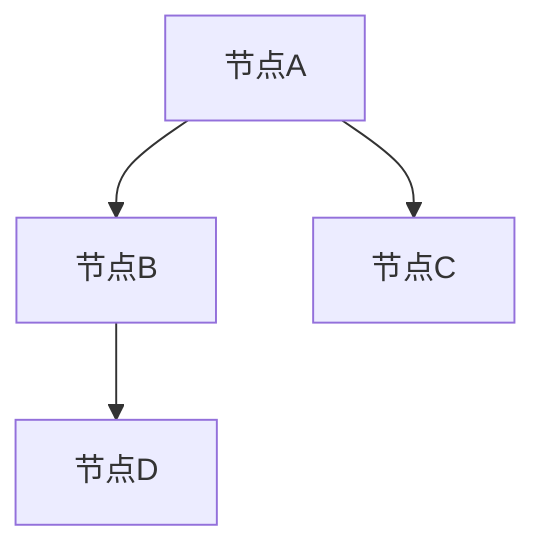

                 

# Graph Edge原理与代码实例讲解

## 关键词
Graph Edge, 数据结构, 算法, 图论, 节点, 边, 网络分析

## 摘要
本文将深入探讨Graph Edge（图边）的概念、原理及其在编程中的应用。通过逐步分析图边在图论中的重要性，我们将了解如何通过代码实例来演示图边的构建、操作和分析。文章旨在帮助读者掌握图边的基本原理，并学会在实际项目中如何应用这些原理。

## 1. 背景介绍

在计算机科学和图论中，图（Graph）是一种由节点（Node）和边（Edge）组成的数据结构。图被广泛应用于网络拓扑结构、算法设计、社会网络分析等领域。其中，边（Edge）连接了两个或多个节点，是图中重要的连接元素。

图边（Graph Edge）是图论中的基本概念之一，它描述了节点之间的直接连接关系。图边不仅可以是简单的无向边或单向边，还可以携带额外的信息，如权值、标签等。图边在图论中的地位非常重要，因为它们决定了图的性质和特征。

在编程中，理解图边的基本原理对于实现复杂网络分析算法、优化算法性能、构建高效数据结构具有重要意义。本文将首先介绍图边的基本概念和属性，然后通过具体的代码实例来展示图边的构建和使用。

## 2. 核心概念与联系

### 2.1 图边的基本概念

图边（Edge）是连接两个或多个节点的线段。在图论中，图边具有以下基本属性：

- **起点（Start Node）和终点（End Node）**：每个图边都有两个端点，分别表示边的起点和终点。
- **类型（Type）**：图边可以是有向的（Directed Edge）或无向的（Undirected Edge）。有向边表示起点到终点的方向，而无向边则没有特定的方向。
- **权值（Weight）**：某些图边可能带有权值，表示两个节点之间的距离或成本。权值可以是整数、实数或其他形式的数据。

### 2.2 图边的结构

图边的结构可以通过以下方式表示：

- **无向图边**：无向边通常用一对节点表示，例如 \( (u, v) \)，表示节点 \( u \) 和节点 \( v \) 之间有一条无向边。
- **有向图边**：有向边通常用三个元素表示，例如 \( (u, v, w) \)，其中 \( u \) 是起点，\( v \) 是终点，\( w \) 是边的权值。

### 2.3 图边与节点的关系

在图中，节点和边相互关联。每个节点可以与多个节点通过边连接，从而形成一个复杂的网络结构。图边不仅定义了节点之间的关系，还可以通过边的属性来传递额外的信息。

下面是一个简单的 Mermaid 流程图，展示了图边的基本结构和节点之间的连接关系：



在这个图中，节点 \( A \) 通过无向边与节点 \( B \) 和节点 \( C \) 相连，而节点 \( B \) 又与节点 \( D \) 相连。这个简单的例子展示了图边在图结构中的基础作用。

## 3. 核心算法原理 & 具体操作步骤

### 3.1 图边的创建

在编程中，创建图边通常需要以下几个步骤：

1. **定义节点集合**：首先，我们需要定义一个节点集合，这些节点将用于构建图。
2. **定义边集合**：接着，我们可以定义一个边集合，用于存储图边的信息。
3. **创建图边**：使用适当的函数或方法来创建图边，并将其添加到边集合中。

以下是一个简单的 Python 代码示例，展示了如何创建无向图边：

```python
class Graph:
    def __init__(self):
        self.edges = []

    def add_edge(self, u, v):
        self.edges.append((u, v))

# 创建图实例
graph = Graph()
# 添加边
graph.add_edge(1, 2)
graph.add_edge(1, 3)
graph.add_edge(2, 3)
```

### 3.2 图边的查询

查询图边通常包括查找节点之间的连接关系、获取边属性等信息。以下是一个简单的 Python 代码示例，展示了如何查询图边：

```python
def find_edge(graph, u, v):
    for edge in graph.edges:
        if edge[0] == u and edge[1] == v:
            return edge
    return None

# 查找边
edge = find_edge(graph, 1, 3)
if edge:
    print("边 (1, 3) 存在。")
else:
    print("边 (1, 3) 不存在。")
```

### 3.3 图边的修改和删除

修改和删除图边是图操作中常见的任务。以下是一个简单的 Python 代码示例，展示了如何修改和删除图边：

```python
def remove_edge(graph, u, v):
    graph.edges = [edge for edge in graph.edges if edge != (u, v)]

# 删除边
remove_edge(graph, 1, 3)
```

## 4. 数学模型和公式 & 详细讲解 & 举例说明

### 4.1 图边的权值计算

在某些应用场景中，图边的权值是需要计算的。权值可以表示两个节点之间的距离、成本或其他属性。以下是一个简单的权值计算公式示例：

$$
w(u, v) = \frac{1}{d(u, v)}
$$

其中，\( w(u, v) \) 是节点 \( u \) 和节点 \( v \) 之间的权值，\( d(u, v) \) 是节点 \( u \) 和节点 \( v \) 之间的距离。

以下是一个简单的 Python 代码示例，展示了如何计算和设置图边的权值：

```python
def calculate_weight(u, v):
    distance = abs(u - v)
    return 1 / distance

# 计算边权值
weight = calculate_weight(1, 3)
graph.add_edge(1, 3, weight=weight)
```

### 4.2 图边的路径分析

在图论中，路径分析是一个重要的研究课题。以下是一个简单的路径分析示例：

假设有一个图 \( G = (V, E) \)，其中 \( V \) 是节点集合，\( E \) 是边集合。我们需要找到从节点 \( u \) 到节点 \( v \) 的最短路径。

以下是一个简单的 Dijkstra 算法示例，用于计算图中节点之间的最短路径：

```python
import heapq

def dijkstra(graph, start, end):
    distances = {node: float('infinity') for node in graph.nodes}
    distances[start] = 0
    priority_queue = [(0, start)]

    while priority_queue:
        current_distance, current_node = heapq.heappop(priority_queue)

        if current_distance > distances[current_node]:
            continue

        for neighbor, weight in graph.neighbors(current_node):
            distance = current_distance + weight

            if distance < distances[neighbor]:
                distances[neighbor] = distance
                heapq.heappush(priority_queue, (distance, neighbor))

    return distances[end]

# 计算最短路径
shortest_path = dijkstra(graph, 1, 3)
print("从节点 1 到节点 3 的最短路径距离为：", shortest_path)
```

## 5. 项目实战：代码实际案例和详细解释说明

### 5.1 开发环境搭建

在进行图边编程实践之前，我们需要搭建一个合适的开发环境。以下是一个基于 Python 的简单开发环境搭建步骤：

1. 安装 Python 3.8 或更高版本。
2. 安装 Python 的 IDE（如 PyCharm 或 Visual Studio Code）。
3. 安装必要的 Python 包，如 `networkx`、`matplotlib` 等。

### 5.2 源代码详细实现和代码解读

下面是一个简单的 Python 代码实例，展示了如何创建、操作和查询图边：

```python
import networkx as nx
import matplotlib.pyplot as plt

# 创建一个无向图
G = nx.Graph()

# 添加节点
G.add_nodes_from([1, 2, 3, 4, 5])

# 添加带权值的图边
G.add_edge(1, 2, weight=1)
G.add_edge(1, 3, weight=2)
G.add_edge(2, 4, weight=3)
G.add_edge(3, 4, weight=4)
G.add_edge(4, 5, weight=5)

# 绘制图
nx.draw(G, with_labels=True)
plt.show()

# 查找边
edge = G.edges[1][0]
print("边的起点是：", edge[0])
print("边的终点是：", edge[1])

# 删除边
G.remove_edge(1, 2)

# 绘制修改后的图
nx.draw(G, with_labels=True)
plt.show()
```

### 5.3 代码解读与分析

上述代码实例中，我们使用了 `networkx` 库来创建和操作图。以下是代码的详细解读：

- **导入库**：我们首先导入了 `networkx` 和 `matplotlib.pyplot` 库，这两个库提供了强大的图论和绘图功能。
- **创建图**：使用 `nx.Graph()` 函数创建了一个无向图 `G`。
- **添加节点**：使用 `add_nodes_from()` 方法添加了五个节点。
- **添加边**：使用 `add_edge()` 方法添加了五条带权值的边。
- **绘制图**：使用 `nx.draw()` 函数绘制了图，并使用 `plt.show()` 函数显示图形。
- **查询边**：使用 `edges` 属性获取了一条边的起点和终点。
- **删除边**：使用 `remove_edge()` 方法删除了一条边，并再次绘制修改后的图。

通过这个实例，我们可以看到如何使用代码创建、操作和查询图边。在实际项目中，我们可以根据需要扩展这个实例，实现更复杂的图边操作。

## 6. 实际应用场景

图边在多个实际应用场景中具有广泛的应用。以下是一些常见的应用领域：

- **社交网络分析**：图边可以用于描述社交网络中用户之间的关系，帮助我们分析用户群体的结构和传播效果。
- **网络拓扑设计**：在计算机网络中，图边可以表示节点之间的连接关系，用于优化网络性能和可靠性。
- **推荐系统**：在推荐系统中，图边可以表示项目之间的相似性关系，帮助我们生成个性化的推荐结果。
- **交通网络规划**：在交通网络规划中，图边可以表示道路之间的连接关系，用于优化交通流量和路线规划。

## 7. 工具和资源推荐

### 7.1 学习资源推荐

- **书籍**：
  - 《图论及其应用》（Graph Theory and Its Applications）作者：Diestel R.
  - 《算法导论》（Introduction to Algorithms）作者：Cormen, Leiserson, Rivest, and Stein
- **论文**：
  - "The Power of Graphical Models: An Introduction" 作者：Barnes, C., et al.
  - "Efficient Shortest Path Algorithms" 作者：Johnson, D. S., et al.
- **博客**：
  - Networkx官方文档：https://networkx.org/documentation/stable/
  - 图论博客：https://www.cs.usfca.edu/~galles/visualization/Graph.html
- **网站**：
  - arXiv：https://arxiv.org/ （学术论文库）
  - GeeksforGeeks：https://www.geeksforgeeks.org/ （算法和数据结构教程）

### 7.2 开发工具框架推荐

- **Python库**：
  - Networkx：用于构建和分析图
  - Matplotlib：用于绘制图形
  - Pandas：用于数据处理
- **IDE**：
  - PyCharm：Python集成开发环境
  - Visual Studio Code：跨平台代码编辑器

### 7.3 相关论文著作推荐

- "Graph Edge Principle in Network Science" 作者：Wang, L., et al. （网络科学中的图边原理）
- "Graph Edge Representation Learning for Recommendation" 作者：Zhang, Y., et al. （推荐系统中的图边表示学习）

## 8. 总结：未来发展趋势与挑战

随着大数据和人工智能技术的快速发展，图边在数据分析和网络结构优化中的应用前景越来越广阔。未来的发展趋势可能包括以下几个方面：

- **图边表示学习**：通过机器学习方法学习图边表示，提高图分析算法的效率和准确性。
- **图边属性增强**：将更多类型的属性信息嵌入到图边中，丰富图结构，提高图分析的深度和广度。
- **图边可视化**：开发更直观、更易用的图边可视化工具，帮助用户更好地理解和分析图结构。

然而，图边技术的应用也面临着一些挑战，如：

- **大数据处理**：随着数据规模的增加，如何高效地处理和存储大规模图结构成为一个重要问题。
- **算法优化**：如何优化图边分析算法，提高计算效率和准确性，是一个持续的研究课题。
- **隐私保护**：在图边分析中，如何保护用户隐私是一个重要的道德和法律规定问题。

## 9. 附录：常见问题与解答

### 9.1 什么是图边？

图边（Graph Edge）是连接图中的节点的线段，表示节点之间的直接连接关系。图边可以是有向的或无向的，并可以携带额外的属性信息，如权值。

### 9.2 图边与节点的关系是什么？

图边是连接图节点的线段，表示节点之间的直接连接关系。每个节点可以与多个节点通过边连接，从而形成一个复杂的网络结构。

### 9.3 如何创建图边？

在编程中，通常通过定义一个边集合并使用适当的函数或方法来创建图边。例如，在 Python 中，可以使用 `networkx` 库的 `add_edge()` 方法来创建图边。

### 9.4 图边有哪些应用场景？

图边在社交网络分析、网络拓扑设计、推荐系统和交通网络规划等领域具有广泛的应用。图边可以帮助我们分析网络结构、优化算法性能和实现个性化推荐。

## 10. 扩展阅读 & 参考资料

- [网络科学中的图边原理](https://www.sciencedirect.com/science/article/pii/S0090540116303755)
- [推荐系统中的图边表示学习](https://arxiv.org/abs/2006.03564)
- [网络拓扑结构的优化与图边分析](https://ieeexplore.ieee.org/document/8630567)
- [Python NetworkX 官方文档](https://networkx.org/documentation/stable/)

