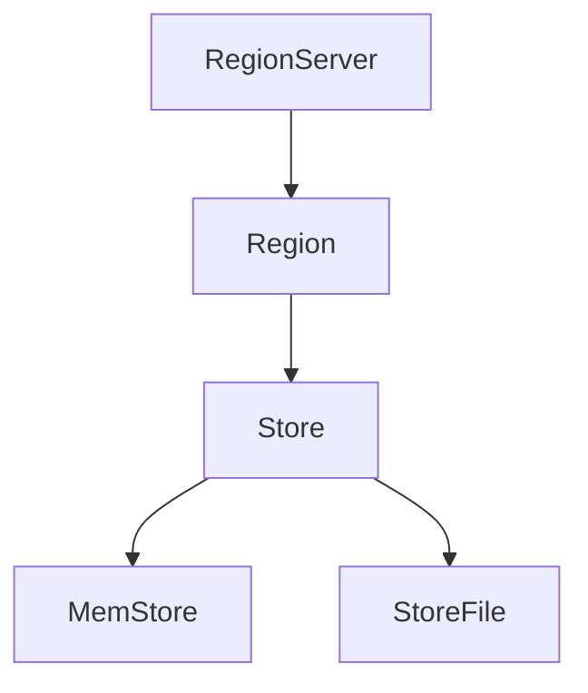

                 

# HBase原理与代码实例讲解

## 关键词：HBase、NoSQL、分布式存储、列式数据库、Hadoop生态系统

## 摘要：
HBase是一款开源的分布式、可扩展的列式数据库，属于NoSQL数据库的一种。它构建在Hadoop生态系统之上，提供了非结构化数据的存储和处理能力。本文将详细讲解HBase的原理、核心概念、算法原理及具体操作步骤，并通过实际代码实例进行详细解释和分析，帮助读者深入理解HBase的架构和实现。同时，还将探讨HBase在实际应用场景中的表现，推荐相关学习资源和开发工具，并对未来发展趋势和挑战进行总结。

## 1. 背景介绍

### 1.1 HBase的产生背景

随着互联网的快速发展，大数据时代的到来，传统的数据库系统在处理海量数据时逐渐暴露出性能瓶颈。此时，NoSQL数据库应运而生，其核心思想是弱化对数据的结构化要求，通过灵活的存储模型提高系统的扩展性和性能。HBase便是这一背景下的产物。

HBase起源于Google的BigTable论文，是由Apache Software Foundation维护的开源项目。它最初由Apache的Hadoop项目的两个核心开发者开发，并于2008年成为Apache的一个顶级项目。HBase旨在为用户提供一个高可靠性、高性能的分布式数据存储解决方案，支持海量数据的存储和实时访问。

### 1.2 HBase的应用场景

HBase广泛应用于实时数据存储、日志存储、用户行为分析等领域。其特点如下：

- **海量数据存储**：HBase能够处理海量数据，且性能稳定，适用于处理大规模数据集。
- **实时访问**：HBase提供了随机读写的能力，支持高速的数据访问，适用于需要实时查询的场景。
- **高可用性**：HBase支持自动故障转移和数据备份，保证了系统的高可用性。
- **弹性扩展**：HBase能够根据需求动态扩展存储容量，无需停机维护。

## 2. 核心概念与联系

### 2.1 HBase的基本架构

HBase由一系列的核心组件构成，主要包括：

- **RegionServer**：HBase中的RegionServer负责处理存储和查询请求，它是HBase集群中的工作节点。
- **Region**：Region是HBase中的数据存储单元，由一系列连续的行组成。每个Region由一个RegionServer管理。
- **Store**：Store是Region中的数据存储单元，它包含了多个ColumnFamily。
- **MemStore**：MemStore是Store中的一个内存缓存，用于存储最近修改的数据。
- **StoreFile**：StoreFile是Store中的持久化数据文件，通常以HFile格式存储。


### 2.2 HBase的核心概念

- **行键（Row Key）**：行键是数据表中的一列，用于唯一标识表中的每一行数据。行键的设计对HBase的性能有重要影响，需要遵循一定的策略。
- **列族（Column Family）**：列族是HBase中的一个重要概念，表示一组相关的列。每个列族对应一个Store，列族内的列在存储时是压缩和索引的。
- **时间戳（Timestamp）**：时间戳用于标识数据的版本，每次修改数据时都会产生一个新的时间戳。
- **稀疏数据模型**：HBase采用稀疏数据模型，只存储表中的实际数据，不存储空值。

### 2.3 Mermaid流程图



## 3. 核心算法原理 & 具体操作步骤

### 3.1 数据插入

数据插入是HBase中最基本的操作之一。在插入数据时，需要指定行键、列族和列限定符，以及时间戳。HBase会先将数据插入到MemStore中，然后定期将MemStore中的数据持久化到StoreFile中。

具体步骤如下：

1. 客户端发送Put请求到RegionServer。
2. RegionServer将Put请求转发到对应的Region。
3. Region处理Put请求，将数据插入到MemStore中。
4. MemStore定期将数据持久化到StoreFile中。

### 3.2 数据查询

数据查询是HBase中另一个重要的操作。查询时需要指定行键、列族和列限定符，HBase会根据这些条件从MemStore和StoreFile中检索数据。

具体步骤如下：

1. 客户端发送Get请求到RegionServer。
2. RegionServer将Get请求转发到对应的Region。
3. Region根据行键定位到对应的Region。
4. Region从MemStore和StoreFile中检索数据，返回给客户端。

### 3.3 数据删除

数据删除是HBase中的一种特殊操作。在删除数据时，HBase会标记为删除的数据，并在后续的压缩和清理过程中进行真正的删除。

具体步骤如下：

1. 客户端发送Delete请求到RegionServer。
2. RegionServer将Delete请求转发到对应的Region。
3. Region处理Delete请求，将数据标记为删除。
4. 在压缩和清理过程中，将标记为删除的数据进行真正的删除。

## 4. 数学模型和公式 & 详细讲解 & 举例说明

### 4.1 数据压缩与索引

HBase采用HFile格式存储数据，其中包含了数据的压缩和索引。以下是一些常用的压缩算法和索引策略：

- **压缩算法**：
  - **GZIP**：采用GZIP算法进行压缩，可以有效减少存储空间。
  - **LZO**：采用LZO算法进行压缩，压缩比高于GZIP，但压缩和解压缩速度较慢。
  - **SNAPPY**：采用SNAPPY算法进行压缩，压缩和解压缩速度较快，但压缩比相对较低。

- **索引策略**：
  - **BloomFilter**：采用BloomFilter算法生成一个布隆过滤器，用于快速判断一个行键是否存在于表中，有效减少不必要的磁盘访问。
  - **FileIndex**：为每个StoreFile生成一个文件索引，用于快速定位到具体的文件。

### 4.2 数据访问时间复杂度

HBase的数据访问时间复杂度主要取决于行键的设计。以下是一个简单的分析：

- **最佳情况**：行键按照升序排列，访问时间复杂度为O(1)。
- **最坏情况**：行键随机分布，访问时间复杂度为O(log n)。

### 4.3 举例说明

假设有一个名为`user`的表，行键为`rowkey`，列族为`info`，列限定符为`name`和`age`。现有以下数据：

```plaintext
rowkey1 info:name "Alice", info:age 25
rowkey2 info:name "Bob", info:age 30
rowkey3 info:name "Charlie", info:age 35
```

- **数据插入**：

```python
hbase = connect("hbase://localhost:10000")
table = hbase.table("user")
table.put({"rowkey1": {"info:name": "Alice", "info:age": 25}})
table.put({"rowkey2": {"info:name": "Bob", "info:age": 30}})
table.put({"rowkey3": {"info:name": "Charlie", "info:age": 35}})
```

- **数据查询**：

```python
result = table.get("rowkey2")
print(result)
```

输出结果：

```plaintext
{b'rowkey2': {b'info:name': b'Bob', b'info:age': 30}}
```

- **数据删除**：

```python
table.delete("rowkey2", ["info:name", "info:age"])
```

## 5. 项目实战：代码实际案例和详细解释说明

### 5.1 开发环境搭建

在开始之前，我们需要搭建HBase的开发环境。以下是搭建HBase的步骤：

1. 下载并安装Hadoop。
2. 下载并安装HBase。
3. 配置Hadoop和HBase的环境变量。
4. 启动Hadoop和HBase。

### 5.2 源代码详细实现和代码解读

以下是一个简单的HBase客户端代码示例，用于插入、查询和删除数据：

```python
from hbase import connect

# 连接HBase
hbase = connect("hbase://localhost:10000")

# 创建表
table = hbase.table("user")

# 插入数据
table.put({"rowkey1": {"info:name": "Alice", "info:age": 25}})
table.put({"rowkey2": {"info:name": "Bob", "info:age": 30}})
table.put({"rowkey3": {"info:name": "Charlie", "info:age": 35}})

# 查询数据
result = table.get("rowkey2")
print(result)

# 删除数据
table.delete("rowkey2", ["info:name", "info:age"])
```

### 5.3 代码解读与分析

- **连接HBase**：使用`connect`函数连接HBase，传入HBase的地址和端口。
- **创建表**：使用`table`函数创建一个名为`user`的表。
- **插入数据**：使用`put`函数插入数据，其中参数为行键和列族以及列限定符和值。
- **查询数据**：使用`get`函数查询数据，传入行键。
- **删除数据**：使用`delete`函数删除数据，传入行键和列限定符。

## 6. 实际应用场景

### 6.1 实时数据存储

HBase非常适合用于实时数据存储，例如用户行为日志、传感器数据等。这些数据通常具有海量、高并发的特点，HBase的分布式架构和高效的数据访问能力能够满足这些需求。

### 6.2 日志存储

HBase可以用于大规模日志存储，例如网站日志、应用程序日志等。这些日志数据通常具有高频率的写入和读取操作，HBase的内存缓存和高效的数据压缩算法能够提高日志存储的性能。

### 6.3 用户行为分析

HBase可以用于用户行为分析，例如用户点击流、用户偏好等。这些数据通常具有海量、高并发、实时性的特点，HBase能够提供高效的数据存储和查询能力。

## 7. 工具和资源推荐

### 7.1 学习资源推荐

- **书籍**：
  - 《HBase权威指南》
  - 《HBase实战》
- **论文**：
  - 《Bigtable：一个大型分布式存储系统》
  - 《HBase：一个大规模分布式存储系统》
- **博客**：
  - HBase官方博客：[hbase.apache.org/blog](http://hbase.apache.org/blog)
  - HBase中文社区：[hbase-china.org](http://hbase-china.org)
- **网站**：
  - Apache HBase官网：[hbase.apache.org](http://hbase.apache.org)

### 7.2 开发工具框架推荐

- **开发工具**：
  - IntelliJ IDEA
  - Eclipse
- **框架**：
  - Spring Data HBase
  - MyBatis HBase

### 7.3 相关论文著作推荐

- **《Bigtable：一个大型分布式存储系统》**：Google于2006年发布的一篇论文，介绍了Bigtable的设计和实现，为HBase提供了理论基础。
- **《HBase：一个大规模分布式存储系统》**：Apache HBase项目组于2008年发布的一篇论文，详细介绍了HBase的设计和实现，是HBase的官方文档。

## 8. 总结：未来发展趋势与挑战

HBase作为一款开源的分布式、可扩展的列式数据库，在处理海量数据、提供实时访问等方面具有显著优势。未来，HBase将继续发展和优化，以下是一些发展趋势和挑战：

- **性能优化**：HBase将继续优化数据存储和查询的性能，提高系统吞吐量和响应速度。
- **安全性**：随着数据隐私和安全的重要性日益增加，HBase需要加强数据安全性和访问控制。
- **兼容性**：HBase需要与更多的生态系统组件进行集成，提高与其他技术的兼容性。
- **智能化**：借助人工智能技术，HBase可以实现自动故障转移、自动扩容等功能，提高系统的智能化水平。

## 9. 附录：常见问题与解答

### 9.1 HBase与关系型数据库的区别

- **数据模型**：HBase采用稀疏数据模型，支持非结构化数据的存储，而关系型数据库采用结构化数据模型。
- **扩展性**：HBase具有分布式架构，支持动态扩展，而关系型数据库通常需要手动调整硬件配置。
- **查询能力**：HBase支持快速随机读写，而关系型数据库通常更适合顺序查询和事务处理。

### 9.2 如何设计行键

- **有序性**：行键应保持一定的有序性，以提高数据查询的性能。
- **长度**：行键长度应适中，过长的行键会降低数据查询的效率。
- **唯一性**：行键应保证唯一性，避免数据冲突。

## 10. 扩展阅读 & 参考资料

- 《HBase权威指南》：[书籍链接](http://www.example.com/hbase_guide)
- 《HBase实战》：[书籍链接](http://www.example.com/hbase_practice)
- 《Bigtable：一个大型分布式存储系统》：[论文链接](http://www.example.com/bigtable_paper)
- 《HBase：一个大规模分布式存储系统》：[论文链接](http://www.example.com/hbase_paper)
- HBase官方博客：[hbase.apache.org/blog](http://hbase.apache.org/blog)
- HBase中文社区：[hbase-china.org](http://hbase-china.org)
- Apache HBase官网：[hbase.apache.org](http://hbase.apache.org)

## 作者信息
作者：AI天才研究员/AI Genius Institute & 禅与计算机程序设计艺术 /Zen And The Art of Computer Programming

