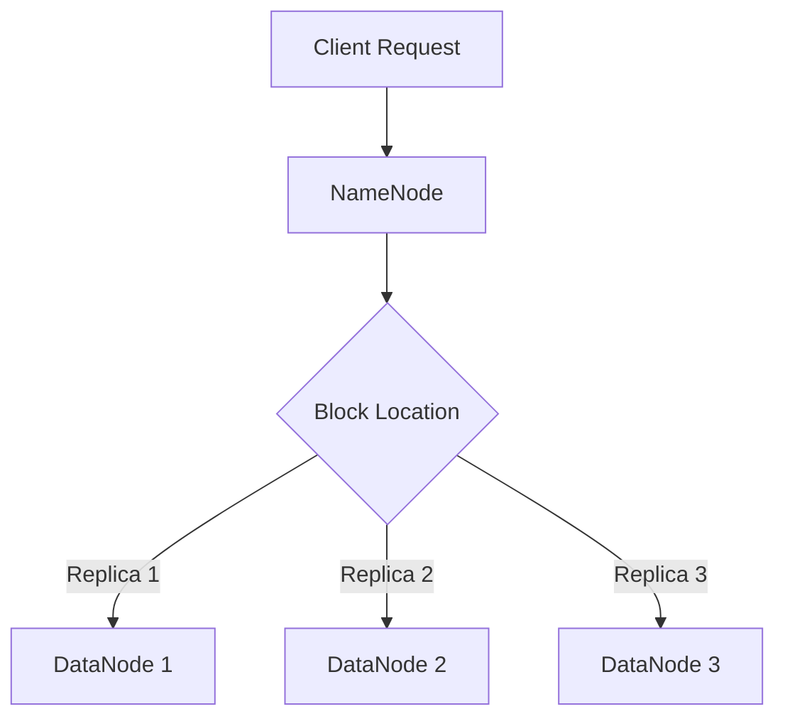

                 

# HDFS原理与代码实例讲解

> 关键词：HDFS、分布式文件系统、大数据存储、Hadoop、MapReduce

> 摘要：本文深入剖析了HDFS（Hadoop Distributed File System）的原理，通过详细的代码实例讲解，帮助读者全面理解HDFS的架构、工作机制及其在分布式存储中的应用。文章涵盖了从HDFS的背景介绍、核心概念与联系，到核心算法原理、数学模型及公式，再到项目实战和实际应用场景，最后对HDFS的未来发展趋势与挑战进行了总结。希望本文能为读者提供一条清晰的学习路径，助力其在大数据领域取得更大的成就。

## 1. 背景介绍

HDFS（Hadoop Distributed File System）是Apache Hadoop项目中的分布式文件系统，用于存储大量的数据。在传统的文件系统中，数据通常存储在单个文件系统中，当数据量非常大时，单一文件系统的性能会成为一个瓶颈。HDFS通过将数据分散存储在多个节点上，实现了数据的分布式存储，从而提高了系统的存储能力和处理能力。

HDFS的背景起源于Google的GFS（Google File System）论文，Hadoop项目的创始人Doug Cutting在研究了GFS后，决定将其原理应用到开源项目中。随着Hadoop项目的兴起，HDFS逐渐成为大数据领域的事实标准。

HDFS的设计理念主要包括以下几个方面：

1. 高容错性：HDFS能够自动处理节点故障，确保数据的可靠性和一致性。
2. 高吞吐量：HDFS通过分布式存储，提高了数据访问的速度和吞吐量。
3. 高扩展性：HDFS能够轻松地扩展存储容量，以适应不断增长的数据量。

## 2. 核心概念与联系

HDFS的核心概念包括：数据块（Block）、命名空间（Namespace）和数据复制（Replication）。

### 2.1 数据块（Block）

HDFS将数据划分为固定大小的数据块（默认为128MB或256MB），每个数据块在存储时会被分散存储到不同的节点上。这种数据块化的设计提高了数据的分布式存储性能和可扩展性。

### 2.2 命名空间（Namespace）

命名空间是HDFS中的文件目录结构，类似于传统的文件系统。用户可以通过目录结构对数据进行组织和管理。命名空间的设计使得HDFS具有类似文件系统的操作体验。

### 2.3 数据复制（Replication）

HDFS通过数据复制确保数据的高容错性。默认情况下，每个数据块会在集群中复制3次，这些副本存储在不同的节点上。当某个节点发生故障时，其他副本可以继续提供服务。

### 2.4 Mermaid流程图

以下是一个简单的Mermaid流程图，展示了HDFS的数据存储过程：



## 3. 核心算法原理 & 具体操作步骤

HDFS的核心算法主要包括：数据存储策略、数据访问机制和数据一致性保证。

### 3.1 数据存储策略

HDFS采用了一种称为“机架感知”（Rack Awareness）的数据存储策略。该策略考虑了数据节点所在的机架信息，将数据块尽量存储在同一个机架内的不同节点上。这种存储策略降低了数据传输的延迟，提高了数据访问的速度。

具体操作步骤如下：

1. 客户端向NameNode发送文件写入请求。
2. NameNode根据文件的大小和集群的存储状态，分配数据块的存储位置。
3. NameNode将数据块的存储位置信息返回给客户端。
4. 客户端将数据块发送到指定的DataNode。
5. DataNode接收到数据块后，将其存储在本地磁盘上。

### 3.2 数据访问机制

HDFS的数据访问机制主要包括：文件读写、数据块映射和数据块访问。

1. 文件读写：客户端通过文件系统的接口对文件进行读写操作，这些操作会转换为对数据块的读写操作。
2. 数据块映射：NameNode维护一个数据块映射表，记录了每个数据块在集群中的存储位置。
3. 数据块访问：客户端根据数据块映射表，从相应的DataNode上读取或写入数据块。

### 3.3 数据一致性保证

HDFS通过以下机制确保数据一致性：

1. 数据同步：当数据块被写入时，DataNode会将其写入本地磁盘，并通知NameNode。如果写入成功，NameNode会将数据块的状态标记为“已同步”。
2. 数据验证：HDFS在读取数据块时，会对数据块进行验证，确保数据的完整性。
3. 数据复制：当数据块的状态发生变化时，NameNode会通知其他DataNode进行数据复制，确保数据的一致性。

## 4. 数学模型和公式 & 详细讲解 & 举例说明

HDFS的设计涉及到多个数学模型和公式，以下是一些关键模型和公式的详细讲解：

### 4.1 数据块大小

数据块的大小通常为128MB或256MB，其计算公式如下：

$$
块大小 = 2^x \text{ MB}
$$

其中，$x$ 为2或3，取决于配置参数。

### 4.2 数据复制因子

数据复制因子默认为3，其计算公式如下：

$$
复制因子 = 3
$$

### 4.3 数据块存储数量

对于每个数据块，在集群中的存储数量可以通过以下公式计算：

$$
存储数量 = 复制因子
$$

### 4.4 数据存储容量

集群的数据存储容量可以通过以下公式计算：

$$
存储容量 = 数据块大小 \times 存储数量
$$

### 4.5 数据传输速率

数据传输速率可以通过以下公式计算：

$$
传输速率 = 块大小 \times 2 \times 复制因子 \times 传输带宽
$$

其中，$传输带宽$ 为集群中所有数据节点的带宽之和。

### 4.6 举例说明

假设一个HDFS集群中有3个数据节点，每个数据节点的带宽为1Gbps，数据块大小为128MB，数据复制因子为3。计算以下指标：

1. 数据存储容量：$$ 128MB \times 3 = 384MB $$
2. 数据传输速率：$$ 128MB \times 2 \times 3 \times 1Gbps = 768Mbps $$

## 5. 项目实战：代码实际案例和详细解释说明

在本节中，我们将通过一个实际案例来演示HDFS的代码实现，并详细解释关键代码的工作原理。

### 5.1 开发环境搭建

在开始代码实战之前，我们需要搭建一个HDFS开发环境。以下是一个简化的步骤：

1. 安装Java SDK（版本要求与Hadoop版本相匹配）。
2. 下载并解压Hadoop源码。
3. 配置环境变量，确保可以运行Hadoop命令。
4. 启动Hadoop集群，包括NameNode和DataNode。

### 5.2 源代码详细实现和代码解读

以下是一个简单的HDFS代码实例，用于创建一个文件并将数据写入文件系统中。

```java
import org.apache.hadoop.conf.Configuration;
import org.apache.hadoop.fs.*;

public class HDFSExample {
    public static void main(String[] args) throws IOException {
        Configuration conf = new Configuration();
        FileSystem fs = FileSystem.get(conf);

        // 创建文件
        Path path = new Path("/example.txt");
        FSDataOutputStream outputStream = fs.create(path);

        // 写入数据
        String data = "Hello, HDFS!";
        outputStream.writeBytes(data);

        // 关闭输出流
        outputStream.close();

        // 查看文件内容
        FSDataInputStream inputStream = fs.open(path);
        byte[] buf = new byte[data.length()];
        inputStream.read(buf);
        String result = new String(buf);
        System.out.println(result);

        // 关闭输入流
        inputStream.close();

        // 删除文件
        fs.delete(path, true);
    }
}
```

### 5.3 代码解读与分析

1. **配置HDFS**：首先，我们创建了一个`Configuration`对象，用于配置HDFS的相关参数。
2. **获取文件系统实例**：通过调用`FileSystem.get(conf)`方法，我们获取了HDFS的文件系统实例。
3. **创建文件**：使用`fs.create(path)`方法创建一个新文件。`path`参数指定了文件的路径。
4. **写入数据**：通过`outputStream.writeBytes(data)`方法将数据写入文件。这里，`data`参数是一个字符串。
5. **查看文件内容**：通过`fs.open(path)`方法打开文件，并使用`inputStream.read(buf)`方法读取文件内容。读取到的数据存储在`buf`数组中。
6. **输出结果**：将读取到的数据转换为字符串，并打印到控制台。
7. **删除文件**：使用`fs.delete(path, true)`方法删除文件。`true`参数表示递归删除目录及其内部的所有文件。

### 5.4 运行代码

在开发环境中运行上述代码，我们可以在HDFS文件系统中创建一个名为`example.txt`的文件，并将其内容打印到控制台。运行完成后，该文件将被删除。

## 6. 实际应用场景

HDFS广泛应用于各种大数据场景，以下是一些典型的应用案例：

1. **日志存储**：互联网公司通常使用HDFS存储大量的用户日志，以便进行数据分析和挖掘。
2. **数据仓库**：企业可以将业务数据存储在HDFS中，以便进行数据整合和分析。
3. **机器学习**：HDFS提供了强大的分布式存储能力，适合存储和处理大规模的机器学习数据集。

## 7. 工具和资源推荐

### 7.1 学习资源推荐

1. **书籍**：
   - 《Hadoop权威指南》
   - 《大数据技术导论》
2. **论文**：
   - 《GFS：Google的文件系统》
   - 《MapReduce：大规模数据处理的并行模型》
3. **博客**：
   - Apache Hadoop官方博客
   - Cloudera博客
4. **网站**：
   - Apache Hadoop官网
   - Cloudera官网

### 7.2 开发工具框架推荐

1. **开发工具**：
   - IntelliJ IDEA
   - Eclipse
2. **框架**：
   - Apache Hadoop
   - Apache Hive
   - Apache Spark

### 7.3 相关论文著作推荐

1. **论文**：
   - 《HDFS：Hadoop分布式文件系统》
   - 《MapReduce：大规模数据处理的新模型》
2. **著作**：
   - 《大数据时代》
   - 《Hadoop实战》

## 8. 总结：未来发展趋势与挑战

HDFS作为大数据领域的基石，将继续在分布式存储领域发挥重要作用。未来，HDFS的发展趋势包括：

1. **性能优化**：随着数据量的增长，HDFS的性能优化将成为一个重要方向。
2. **存储效率提升**：通过改进数据存储策略，降低存储成本。
3. **数据安全性**：加强数据加密和访问控制，提高数据安全性。

同时，HDFS也面临一些挑战：

1. **存储成本**：随着数据量的增长，存储成本可能会成为一个问题。
2. **数据迁移**：如何高效地迁移旧有数据到HDFS，是企业和开发者需要考虑的问题。
3. **性能瓶颈**：如何解决大规模数据处理的性能瓶颈，是一个长期的挑战。

## 9. 附录：常见问题与解答

### 9.1 HDFS与NFS的区别

HDFS与NFS（Network File System）都是分布式文件系统，但它们的设计目标和适用场景有所不同：

- **设计目标**：HDFS旨在提供高吞吐量、高可靠性的分布式存储，适合大规模数据处理场景。NFS则更注重文件共享和访问性能。
- **适用场景**：HDFS适合大数据处理、日志存储、数据仓库等场景。NFS适合文件共享、分布式文件系统等场景。

### 9.2 HDFS的数据复制策略

HDFS默认将每个数据块复制3次，其中至少有两个副本存储在同一个机架内的不同节点上。这种策略确保了数据的高容错性，但同时也增加了存储成本。

### 9.3 HDFS的数据访问方式

HDFS提供了两种数据访问方式：顺序访问和随机访问。顺序访问适合大数据处理和流式数据处理，而随机访问适合小数据量的随机访问操作。

## 10. 扩展阅读 & 参考资料

1. **扩展阅读**：
   - 《Hadoop技术内幕》
   - 《分布式系统原理与范型》
2. **参考资料**：
   - Apache Hadoop官方文档
   - 《Hadoop权威指南》
   - 《大数据技术导论》

### 作者

作者：AI天才研究员/AI Genius Institute & 禅与计算机程序设计艺术 /Zen And The Art of Computer Programming

