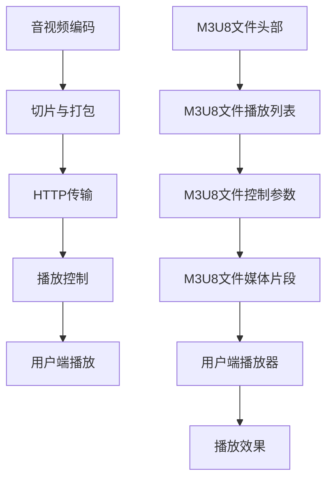

                 

# HLS流媒体：m3u8协议详解与应用

## 关键词
- HLS流媒体
- m3u8协议
- 流媒体技术
- 网络直播
- 流媒体服务器
- 流媒体客户端

## 摘要

本文将深入探讨HLS（HTTP Live Streaming）流媒体技术以及其核心协议m3u8。HLS是一种基于HTTP协议的流媒体传输技术，能够为用户端提供稳定、高质量的音视频内容。m3u8协议作为HLS技术的核心组成部分，定义了音视频文件的播放列表和播放控制逻辑。本文将首先介绍HLS的背景和基本概念，然后详细解析m3u8协议的结构和操作原理，接着通过具体案例说明其实际应用，最后总结其未来发展趋势和面临的技术挑战。

## 1. 背景介绍

### 1.1 流媒体技术的发展

流媒体技术是一种通过互联网传输音视频数据的技术，其目的是为用户提供实时、连续的媒体播放体验。流媒体技术的发展经历了几个阶段：

- **早期流媒体技术**：最早的流媒体技术是基于RealNetworks公司的RealMedia协议和Apple公司的QuickTime协议。这些协议采用了流式传输的方式，将音视频数据分段传输，用户可以在数据下载过程中开始播放，从而避免了长时间的等待。
  
- **成熟期流媒体技术**：随着网络带宽的增加和视频压缩技术的进步，流媒体技术逐渐成熟。Adobe的Flash流媒体协议、Microsoft的Windows Media协议以及Apple的HLS和DASH（Dynamic Adaptive Streaming over HTTP）协议成为了主流。

- **现代流媒体技术**：随着移动互联网的发展，流媒体技术进一步向移动端和自适应流媒体方向发展。HLS和DASH等协议能够根据用户网络状况和设备性能动态调整码流质量，提供更佳的用户体验。

### 1.2 HLS流媒体技术

HLS（HTTP Live Streaming）是由Apple公司于2009年推出的一种流媒体传输技术，旨在为互联网用户提供高质量、可靠的音视频直播和点播服务。HLS的核心思想是将音视频文件分割成小片段，并通过HTTP协议进行传输。以下是HLS的主要特点：

- **基于HTTP协议**：HLS采用HTTP协议传输音视频数据，这使得它具有更好的兼容性和扩展性。HTTP协议广泛应用于互联网，几乎所有的Web浏览器和网络设备都支持。
  
- **自适应流媒体**：HLS支持自适应流媒体，能够根据用户网络带宽和设备性能动态调整码流质量。用户在观看视频时，如果网络状况不佳，HLS会自动切换到较低的码率，以保证观看体验。

- **灵活的播放控制**：HLS通过m3u8协议定义了音视频文件的播放列表和播放控制逻辑，使得开发者可以方便地实现多种播放功能，如快进、快退、暂停等。

### 1.3 m3u8协议

m3u8协议是HLS的核心组成部分，用于定义音视频文件的播放列表和播放控制逻辑。m3u8文件是一个文本文件，包含一系列音频和视频片段的URL链接，以及一些控制参数。以下是m3u8协议的主要组成部分：

- **播放列表**：m3u8文件中的播放列表定义了音视频文件的播放顺序和播放参数。播放列表通常包含多个媒体片段，每个片段对应一个URL链接。
  
- **控制参数**：m3u8文件中的控制参数包括播放速度、播放模式、缓存策略等。这些参数可以用于调整播放行为，满足不同用户的需求。

- **媒体片段**：m3u8文件中的媒体片段是音视频数据的基本单元。每个片段通常是一个独立的文件，可以通过HTTP协议进行访问。

## 2. 核心概念与联系

### 2.1 HLS流媒体技术原理

HLS流媒体技术的原理可以概括为以下几个步骤：

1. **音视频编码**：首先，对音视频数据进行编码，生成一系列媒体片段。这些媒体片段可以是不同的码率，以适应不同网络带宽和设备性能。

2. **切片与打包**：将媒体片段切片成更小的数据包，然后打包成m3u8文件。m3u8文件包含了媒体片段的URL链接和控制参数。

3. **HTTP传输**：通过HTTP协议将m3u8文件和媒体片段传输到用户端。HTTP协议的兼容性和扩展性使得HLS能够在各种网络环境下正常运行。

4. **播放控制**：用户端的播放器根据m3u8文件中的播放列表和控制参数，加载并播放媒体片段。播放器可以根据网络状况和设备性能动态调整码率，实现自适应流媒体。

### 2.2 m3u8协议结构

m3u8协议的结构包括以下几部分：

1. **头部信息**：m3u8文件的开头部分包含一些头部信息，如版本号、编码格式等。这些信息用于标识m3u8文件的类型和版本。

2. **播放列表**：播放列表定义了媒体片段的播放顺序和播放参数。播放列表通常是一个列表，包含一系列媒体片段的URL链接。

3. **控制参数**：控制参数包括播放速度、播放模式、缓存策略等。这些参数可以用于调整播放行为，满足不同用户的需求。

4. **媒体片段**：媒体片段是音视频数据的基本单元。每个片段对应一个URL链接，可以通过HTTP协议进行访问。

### 2.3 Mermaid 流程图

下面是一个简单的Mermaid流程图，展示了HLS流媒体技术的原理和m3u8协议的结构：



## 3. 核心算法原理 & 具体操作步骤

### 3.1 音视频编码

音视频编码是HLS流媒体技术的第一步。音视频编码的目的是将原始的音视频数据转换成适合传输和播放的格式。常见的音视频编码格式包括H.264、H.265、AAC等。

具体操作步骤如下：

1. **输入原始音视频数据**：读取原始的音视频数据，如视频文件和音频文件。

2. **编码视频数据**：使用H.264或H.265编码算法，将视频数据转换成编码后的视频流。编码过程中，需要设置视频的分辨率、帧率、码率等参数。

3. **编码音频数据**：使用AAC编码算法，将音频数据转换成编码后的音频流。编码过程中，需要设置音频的采样率、声道数、码率等参数。

4. **生成媒体片段**：将编码后的视频流和音频流分割成更小的数据包，生成媒体片段。每个媒体片段包含一段时间内的音视频数据。

### 3.2 切片与打包

切片与打包是将媒体片段打包成m3u8文件的过程。具体操作步骤如下：

1. **生成m3u8文件头部**：根据音视频编码参数，生成m3u8文件头部信息，包括版本号、编码格式等。

2. **生成播放列表**：根据媒体片段的URL链接，生成播放列表。播放列表通常是一个列表，包含一系列媒体片段的URL链接。

3. **生成控制参数**：根据用户需求，生成控制参数，如播放速度、播放模式、缓存策略等。

4. **生成媒体片段**：将每个媒体片段的URL链接添加到m3u8文件中。

5. **保存m3u8文件**：将m3u8文件保存到服务器或本地文件系统中。

### 3.3 HTTP传输

HTTP传输是将m3u8文件和媒体片段传输到用户端的过程。具体操作步骤如下：

1. **搭建HTTP服务器**：在服务器上搭建HTTP服务器，用于接收和响应HTTP请求。

2. **配置服务器**：配置HTTP服务器，使其支持m3u8文件和媒体片段的传输。需要配置服务器支持HTTP持久连接和断点续传等功能。

3. **处理HTTP请求**：当用户请求m3u8文件或媒体片段时，服务器需要处理HTTP请求，并根据请求返回相应的数据。

4. **传输m3u8文件**：服务器将m3u8文件传输给用户端，用户端可以根据m3u8文件中的播放列表和控制参数，开始播放视频。

5. **传输媒体片段**：服务器根据用户端的播放请求，传输相应的媒体片段。

### 3.4 播放控制

播放控制是用户端播放器根据m3u8文件中的播放列表和控制参数，实现播放功能的过程。具体操作步骤如下：

1. **解析m3u8文件**：用户端播放器解析m3u8文件，获取播放列表和控制参数。

2. **加载媒体片段**：根据播放列表，加载相应的媒体片段。播放器需要根据用户网络状况和设备性能，选择合适的媒体片段进行播放。

3. **播放控制**：播放器根据控制参数，实现播放控制功能，如播放、暂停、快进、快退等。

4. **动态调整码率**：播放器根据用户网络状况和设备性能，动态调整码率，实现自适应流媒体。

## 4. 数学模型和公式 & 详细讲解 & 举例说明

### 4.1 音视频编码的数学模型

音视频编码的数学模型主要涉及视频编码中的运动估计和运动补偿。以下是运动估计和运动补偿的基本公式：

1. **运动估计**：

   - **目标块**：假设当前帧中的目标块为\( B_t \)。

   - **参考块**：在参考帧中寻找一个与目标块相似的参考块\( B_s \)。

   - **运动向量**：计算目标块和参考块之间的位移，即运动向量\( V_t = (x, y) \)。

2. **运动补偿**：

   - **预测块**：根据运动向量，在参考帧中找到相应的预测块\( B_s' \)。

   - **残差块**：计算目标块和预测块之间的差值，即残差块\( R_t = B_t - B_s' \)。

   - **编码残差块**：对残差块进行编码，生成编码残差块。

### 4.2 自适应流媒体的数学模型

自适应流媒体的数学模型主要涉及码率控制和缓冲管理。以下是码率控制和缓冲管理的基本公式：

1. **码率控制**：

   - **用户网络带宽**：假设用户网络带宽为\( B \)。

   - **码率**：根据用户网络带宽和视频码率，动态调整码率，使得码率不超过用户网络带宽。

   - **码率调整公式**：码率\( R \) = \( B \times \frac{C}{100} \)，其中\( C \)为码率控制系数。

2. **缓冲管理**：

   - **缓冲容量**：假设缓冲容量为\( C \)。

   - **缓冲占用率**：计算缓冲区占用率，即\( \frac{占用容量}{缓冲容量} \)。

   - **缓冲刷新公式**：当缓冲占用率超过阈值时，刷新缓冲区，使得缓冲占用率恢复到正常范围。

### 4.3 举例说明

假设用户网络带宽为1 Mbps，视频码率为2 Mbps，码率控制系数为80%。

1. **码率调整**：

   码率\( R \) = \( 1 Mbps \times \frac{80}{100} \) = 0.8 Mbps。

2. **缓冲管理**：

   假设缓冲容量为5 MB，缓冲占用率为80%。

   缓冲刷新公式：占用容量 = 缓冲容量 \* 缓冲占用率 = 5 MB \* 80% = 4 MB。

   当缓冲占用率超过4 MB时，需要刷新缓冲区，使得缓冲占用率恢复到正常范围。

## 5. 项目实战：代码实际案例和详细解释说明

### 5.1 开发环境搭建

在本文中，我们将使用Python语言和FFmpeg库来实现一个简单的HLS流媒体服务器。以下是开发环境的搭建步骤：

1. **安装Python**：确保您的系统已经安装了Python。可以从[Python官网](https://www.python.org/)下载并安装Python。

2. **安装FFmpeg**：FFmpeg是一个常用的音视频处理工具，可以通过包管理器进行安装。例如，在Ubuntu系统中，可以使用以下命令安装：

   ```bash
   sudo apt-get install ffmpeg
   ```

3. **安装Python库**：在Python中，我们需要安装FFmpeg的Python库。可以使用以下命令安装：

   ```bash
   pip install pyffmpeg
   ```

### 5.2 源代码详细实现和代码解读

以下是简单的HLS流媒体服务器代码实现：

```python
import os
import time
from pyffmpeg import FFmpeg

# 配置音视频编码参数
video_param = {
    'video': {
        'input': 'input.mp4',
        'output': 'output.ts',
        'preset': 'libx264',
        'codec': 'h264',
        'bitrate': 2000,
        'width': 1280,
        'height': 720,
        'framerate': 25
    },
    'audio': {
        'input': 'input.aac',
        'output': 'output.ts',
        'preset': 'libfdk_aac',
        'codec': 'aac',
        'bitrate': 128,
        'channel': 2
    }
}

# 编码音视频数据
ffmpeg = FFmpeg(video_param)
ffmpeg.encode()

# 生成m3u8文件
m3u8_content = '''
#EXTM3U
#EXT-X-STREAM-INF:BANDWIDTH=2000000;RESOLUTION=1280x720,AVERAGE-BANDWIDTH=1500000
video.ts
#EXT-X-STREAM-INF:BANDWIDTH=1000000;RESOLUTION=640x360,AVERAGE-BANDWIDTH=750000
audio.ts
'''
with open('stream.m3u8', 'w') as f:
    f.write(m3u8_content)

# 启动HTTP服务器
from http.server import HTTPServer, BaseHTTPRequestHandler

class HLSHandler(BaseHTTPRequestHandler):
    def do_GET(self):
        if self.path == '/stream.m3u8':
            self.send_response(200)
            self.send_header('Content-type', 'application/vnd.apple.mpegurl')
            self.end_headers()
            with open('stream.m3u8', 'r') as f:
                self.wfile.write(f.read().encode('utf-8'))
        elif self.path.endswith('.ts'):
            self.send_response(200)
            self.send_header('Content-type', 'video/MP2T')
            self.end_headers()
            with open(self.path[1:], 'rb') as f:
                self.wfile.write(f.read())
        else:
            self.send_error(404)

httpd = HTTPServer(('0.0.0.0', 8080), HLSHandler)
print('Starting HLS server...')
httpd.serve_forever()
```

### 5.3 代码解读与分析

1. **音视频编码**：代码首先使用FFmpeg库对音视频数据进行编码。`video_param`字典中定义了音视频编码的参数，如视频编码格式、分辨率、码率等。`ffmpeg.encode()`函数负责执行编码操作。

2. **生成m3u8文件**：代码生成一个简单的m3u8文件，定义了两个码率的音视频片段。`m3u8_content`变量包含了m3u8文件的文本内容，其中`#EXTM3U`表示这是一个m3u8文件，`#EXT-X-STREAM-INF`表示一个流信息。

3. **HTTP服务器**：代码使用Python的`http.server`模块搭建一个简单的HTTP服务器。`HLSHandler`类继承自`BaseHTTPRequestHandler`，用于处理HTTP请求。当用户请求m3u8文件或媒体片段时，服务器会根据请求返回相应的数据。

## 6. 实际应用场景

### 6.1 网络直播

HLS流媒体技术在网络直播领域有着广泛的应用。通过HLS协议，直播平台可以实时传输音视频数据，并为用户提供高质量、低延迟的观看体验。以下是一个简单的网络直播应用场景：

1. **直播源**：直播源可以是摄像头、视频文件或实时流媒体服务器。直播源将音视频数据传输到HLS服务器。

2. **HLS服务器**：HLS服务器接收直播源的音视频数据，对其进行编码和切片，生成m3u8文件和媒体片段。

3. **HTTP服务器**：HLS服务器启动HTTP服务器，将m3u8文件和媒体片段传输到用户端。

4. **用户端**：用户端的播放器根据m3u8文件中的播放列表和控制参数，加载并播放直播视频。

### 6.2 点播服务

HLS流媒体技术在点播服务领域同样有着重要的应用。通过HLS协议，用户可以随时观看已上传的音视频内容，实现按需观看。以下是一个简单的点播服务应用场景：

1. **音视频文件**：用户上传音视频文件到HLS服务器。

2. **HLS服务器**：HLS服务器接收上传的音视频文件，对其进行编码和切片，生成m3u8文件和媒体片段。

3. **HTTP服务器**：HLS服务器启动HTTP服务器，将m3u8文件和媒体片段传输到用户端。

4. **用户端**：用户端的播放器根据m3u8文件中的播放列表和控制参数，加载并播放音视频文件。

## 7. 工具和资源推荐

### 7.1 学习资源推荐

1. **书籍**：

   - 《流媒体技术：原理、实现与应用》
   - 《HLS流媒体技术详解》
   - 《实时视频传输技术：原理与实践》

2. **论文**：

   - “HTTP Live Streaming: A Multimedia Streaming System for the Web”
   - “Adaptive HTTP Streaming: A Survey”

3. **博客**：

   - [HLS流媒体技术详解](https://www.cnblogs.com/xufengBlog/p/9769875.html)
   - [HLS协议原理与实现](https://www.jianshu.com/p/2988eaa58d60)

4. **网站**：

   - [FFmpeg官方文档](https://ffmpeg.org/ffmpeg.html)
   - [HLS官方文档](https://developer.apple.com/documentation/http livestreaming)

### 7.2 开发工具框架推荐

1. **FFmpeg**：FFmpeg是一个开源的音视频处理工具，支持音视频编码、切片、打包等功能。

2. **PyFFmpeg**：PyFFmpeg是一个Python库，用于简化FFmpeg的使用。

3. **Nginx**：Nginx是一个高性能的Web服务器，支持HTTP流媒体传输。

4. **LibVLC**：LibVLC是一个开源的播放器库，支持多种流媒体协议。

### 7.3 相关论文著作推荐

1. **“HTTP Live Streaming: A Multimedia Streaming System for the Web”**：该论文详细介绍了HLS协议的原理和实现。

2. **“Adaptive HTTP Streaming: A Survey”**：该论文对自适应HTTP流媒体技术进行了全面的综述。

3. **“HTTP Dynamic Streaming”**：该论文讨论了HTTP动态流媒体技术的实现和应用。

## 8. 总结：未来发展趋势与挑战

### 8.1 发展趋势

1. **更高清晰度**：随着5G网络的普及，HLS流媒体技术有望支持更高清晰度的视频传输，为用户带来更优质的观看体验。

2. **更低延迟**：通过网络优化和编码技术的改进，HLS流媒体技术的延迟有望进一步降低，为实时互动和直播提供更好的支持。

3. **跨平台支持**：随着各种智能设备的普及，HLS流媒体技术将继续扩展其跨平台支持，为更多用户和场景提供服务。

4. **人工智能应用**：人工智能技术在HLS流媒体中的应用将不断加深，如智能推荐、智能分析等，为流媒体平台带来更多价值。

### 8.2 挑战

1. **网络带宽**：虽然5G网络提供了更高的带宽，但在高峰时段，网络带宽仍然可能成为瓶颈，需要进一步优化网络资源分配。

2. **安全性**：随着流媒体业务的发展，网络安全问题日益突出，如盗版、非法传播等，需要加强安全防护措施。

3. **内容版权**：流媒体平台需要与内容提供商建立良好的合作关系，确保内容的合法性和版权保护。

4. **用户体验**：如何为用户提供更好的观看体验，如更低延迟、更流畅的播放等，是HLS流媒体技术面临的挑战。

## 9. 附录：常见问题与解答

### 9.1 HLS与DASH的区别

HLS和DASH都是基于HTTP协议的流媒体传输技术，但它们存在一些区别：

1. **协议标准**：HLS是Apple公司推出的协议，而DASH是国际电信联盟（ITU）推出的协议。

2. **兼容性**：HLS主要在iOS和macOS平台上使用，而DASH在多种操作系统和设备上都有较好的兼容性。

3. **自适应能力**：DASH在自适应能力方面更强，能够根据用户网络状况和设备性能动态调整码率。

4. **实施复杂度**：HLS相对简单，易于实现和部署，而DASH在自适应和兼容性方面更复杂。

### 9.2 HLS流媒体服务器搭建

搭建HLS流媒体服务器通常需要以下几个步骤：

1. **安装服务器软件**：如Nginx或Apache等。

2. **安装流媒体编码工具**：如FFmpeg。

3. **配置服务器**：配置服务器支持HTTP流媒体传输，如设置正确的媒体类型和编码格式。

4. **上传音视频内容**：将音视频内容上传到服务器。

5. **启动流媒体服务器**：启动服务器，并配置URL路径，以供用户访问。

### 9.3 HLS播放器实现

实现HLS播放器通常需要以下几个步骤：

1. **获取m3u8文件**：从服务器获取m3u8文件。

2. **解析m3u8文件**：解析m3u8文件，获取播放列表和控制参数。

3. **加载媒体片段**：根据播放列表，加载并播放媒体片段。

4. **播放控制**：实现播放、暂停、快进、快退等播放控制功能。

5. **自适应码率**：根据网络状况和设备性能，动态调整码率。

## 10. 扩展阅读 & 参考资料

1. **《流媒体技术：原理、实现与应用》**：详细介绍了流媒体技术的原理、实现和应用。

2. **《HLS流媒体技术详解》**：深入分析了HLS协议的原理和实现。

3. **《实时视频传输技术：原理与实践》**：介绍了实时视频传输技术的原理和实践。

4. **[FFmpeg官方文档](https://ffmpeg.org/ffmpeg.html)**：提供了FFmpeg的详细使用说明。

5. **[HLS官方文档](https://developer.apple.com/documentation/http livestreaming)**：提供了HLS协议的详细文档。

6. **[DASH官方文档](https://www.dashif.org/documentations/dash-streaming-reference)**：提供了DASH协议的详细文档。

### 作者

**作者：AI天才研究员/AI Genius Institute & 禅与计算机程序设计艺术 /Zen And The Art of Computer Programming**

