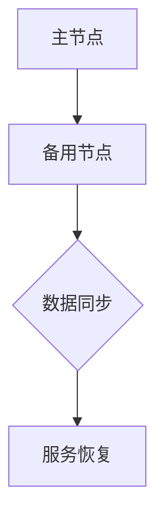

                 

### 背景介绍

在当今高度依赖技术的世界里，系统的稳定性和可靠性至关重要。尤其在云计算和分布式系统中，为了应对各种不可预测的因素，例如硬件故障、网络中断、数据异常等，系统设计者需要采取冗余设计来提高系统的可用性和容错性。本文将对比两种常见的冗余设计：Hot-Hot冗余和Hot-Warm冗余，并深入探讨它们的原理、实现方式以及适用场景。

#### 什么是冗余设计？

冗余设计（Redundancy Design）是指在系统架构中引入备份和冗余机制，以便在某个组件或服务出现故障时，系统能够自动切换到备用组件或服务，从而保证业务的连续性和稳定性。冗余设计的主要目标是提高系统的可靠性、可用性和容错性，减少因故障导致的服务中断。

#### 系统可靠性指标

在讨论冗余设计时，需要了解几个关键的可靠性指标：

1. **平均无故障时间（MTTF，Mean Time To Failure）**：系统能够正常运行的平均时间，不包括维护和修复时间。
2. **平均故障修复时间（MTTR，Mean Time To Repair）**：系统从故障发生到恢复正常运行所需的时间。
3. **系统可用性（Availability）**：系统正常运行的时间占总时间的比例，通常以百分比表示。

#### Hot-Hot冗余

Hot-Hot冗余，也称为主动冗余或双活冗余，是指系统中所有的关键组件或服务都有实时的备份，主备之间能够实时同步数据，一旦主组件出现故障，备用组件可以立即接管服务。这种设计的主要特点是高可用性和低延迟。

#### Hot-Warm冗余

Hot-Warm冗余，也称为被动冗余或冷备份，系统中只有部分关键组件或服务有实时备份。当主组件出现故障时，备用组件会被激活，但可能需要一定时间才能达到正常运行状态。这种设计相对成本较低，但可用性和延迟性能相对较差。

#### 本文结构

本文将按照以下结构进行展开：

1. **核心概念与联系**：介绍Hot-Hot和Hot-Warm冗余的核心概念，并通过Mermaid流程图展示它们的基本架构。
2. **核心算法原理与具体操作步骤**：详细解释Hot-Hot和Hot-Warm冗余的实现原理和操作步骤。
3. **数学模型和公式**：探讨冗余设计的数学模型，包括可靠性指标的计算方法和优化策略。
4. **项目实战**：通过实际代码案例展示冗余设计在具体项目中的应用。
5. **实际应用场景**：分析Hot-Hot和Hot-Warm冗余在不同场景下的适用性。
6. **工具和资源推荐**：推荐相关学习资源、开发工具和论文著作。
7. **总结**：总结冗余设计的未来发展趋势和面临的挑战。

通过本文的深入分析，读者将能够全面了解Hot-Hot和Hot-Warm冗余设计的原理、实现和应用，为实际项目提供有效的参考。### 核心概念与联系

在深入探讨Hot-Hot和Hot-Warm冗余设计之前，我们需要先明确它们的核心概念及其相互关系。为了更好地理解这些概念，我们可以借助Mermaid流程图来展示它们的基本架构。

#### Hot-Hot冗余

Hot-Hot冗余是一种高可用性的设计模式，其中系统的所有关键组件都有实时的备份。这种设计的关键在于主备之间能够实时同步数据，从而实现无缝切换。以下是Hot-Hot冗余的基本架构：

```
+-----------+       +-----------+
|   主节点  | <-----> | 备用节点  |
+-----------+       +-----------+
       |                      |
       |实时数据同步           |
       |                      |
       |                      |
       +----------------------+
```

在Hot-Hot冗余中，主节点和备用节点都是活跃的，并且能够同时处理请求。一旦主节点发生故障，备用节点可以立即接管服务，保证业务连续性。Hot-Hot冗余的优点在于高可用性和低延迟，但其实现成本相对较高。

#### Hot-Warm冗余

Hot-Warm冗余是一种较为经济的冗余设计，它只在关键组件中保留部分实时备份。当主组件出现故障时，备用组件需要一定时间才能达到正常运行状态。以下是Hot-Warm冗余的基本架构：

```
+-----------+       +-----------+
|   主节点  | -----> | 备用节点  |
+-----------+       +-----------+
       |                      |
       |定期数据同步           |
       |                      |
       |                      |
       +----------------------+
```

在Hot-Warm冗余中，主节点和备用节点之间仅保持定期的数据同步。当主节点发生故障时，备用节点需要恢复数据，并重新启动服务。这个过程可能会带来一定的延迟，但成本相对较低。Hot-Warm冗余的优点在于成本低，但其可用性和延迟性能相对较差。

#### Mermaid流程图

为了更直观地展示Hot-Hot和Hot-Warm冗余的基本架构，我们可以使用Mermaid流程图来表示。以下是相应的Mermaid代码及其可视化结果：




在这个流程图中，主节点（A）和备用节点（B）通过数据同步（C）进行交互。在Hot-Hot冗余中，数据同步是实时的，而在Hot-Warm冗余中，数据同步是定期的。当主节点出现故障时，备用节点（D）会进行服务恢复。

#### 相互关系

Hot-Hot冗余和Hot-Warm冗余在设计理念上有所不同，但它们在某些方面是相互关联的：

1. **成本**：Hot-Hot冗余实现成本较高，而Hot-Warm冗余成本相对较低。系统设计者需要根据业务需求和成本预算来选择合适的冗余设计。
2. **可用性**：Hot-Hot冗余提供高可用性，而Hot-Warm冗余的可用性相对较低。高可用性是衡量系统可靠性的重要指标。
3. **延迟**：Hot-Hot冗余具有低延迟，而Hot-Warm冗余的延迟相对较高。在要求严格响应时间的场景中，Hot-Hot冗余可能更具优势。

通过上述分析，我们可以看出Hot-Hot和Hot-Warm冗余在实现方式、成本和性能上存在一定的差异，但它们都是提高系统可靠性和可用性的有效手段。在接下来的章节中，我们将深入探讨这些冗余设计的实现原理和操作步骤。### 核心算法原理与具体操作步骤

在本章节中，我们将详细探讨Hot-Hot和Hot-Warm冗余设计的核心算法原理以及它们的具体操作步骤。通过理解这些原理和步骤，读者将能够更好地掌握这两种冗余设计的实现方式。

#### Hot-Hot冗余的核心算法原理

Hot-Hot冗余设计的关键在于实现主节点和备用节点之间的实时数据同步，从而确保两者在状态上一致。以下是Hot-Hot冗余的核心算法原理：

1. **数据同步机制**：主节点和备用节点通过消息队列或同步机制（如分布式锁、版本控制）保持数据的一致性。当主节点接收到一个请求时，它会将操作记录发送到消息队列中，备用节点从消息队列中读取这些操作记录并执行它们。
2. **故障检测和切换**：系统需要实现故障检测机制，以便在主节点发生故障时能够快速切换到备用节点。常见的故障检测方法包括心跳检测、状态监控和异常处理。
3. **负载均衡**：在多节点环境中，负载均衡策略有助于将请求均匀地分配到主节点和备用节点，从而提高系统的整体性能。

具体操作步骤如下：

1. **初始化**：配置主节点和备用节点的环境，确保它们能够正常运行。
2. **数据同步**：启用数据同步机制，确保主节点和备用节点之间的数据一致性。
3. **故障检测**：实现故障检测机制，定期检查主节点的状态，并在发现故障时触发切换。
4. **负载均衡**：根据请求的负载情况，动态调整主节点和备用节点的负载分配。

#### Hot-Warm冗余的核心算法原理

Hot-Warm冗余设计相对于Hot-Hot冗余来说，在数据同步方面较为简化。以下是Hot-Warm冗余的核心算法原理：

1. **定期数据同步**：主节点和备用节点之间通过定期同步数据来保持状态的一致性。这种同步可以是全量同步或增量同步，具体取决于系统的需求。
2. **故障检测和切换**：与Hot-Hot冗余类似，系统需要实现故障检测机制，以便在主节点发生故障时能够快速切换到备用节点。
3. **服务恢复**：当主节点发生故障时，备用节点需要从备份数据中恢复，并重新启动服务。

具体操作步骤如下：

1. **初始化**：配置主节点和备用节点的环境，确保它们能够正常运行。
2. **定期数据同步**：启用定期数据同步机制，确保主节点和备用节点之间的数据一致性。
3. **故障检测**：实现故障检测机制，定期检查主节点的状态，并在发现故障时触发切换。
4. **服务恢复**：在主节点故障时，备用节点从备份数据中恢复，并重新启动服务。

#### 对比与总结

Hot-Hot冗余和Hot-Warm冗余在算法原理和操作步骤上存在以下差异：

1. **数据同步方式**：Hot-Hot冗余采用实时数据同步，而Hot-Warm冗余采用定期数据同步。
2. **故障检测机制**：两者都采用故障检测机制，但Hot-Hot冗余更强调实时性，而Hot-Warm冗余可以容忍一定的延迟。
3. **服务恢复**：Hot-Hot冗余具有较低的服务恢复时间，而Hot-Warm冗余需要从备份数据中恢复，并可能带来一定的延迟。

总的来说，Hot-Hot冗余提供更高的可用性和低延迟，但成本较高；而Hot-Warm冗余成本较低，但可用性和延迟性能相对较差。系统设计者需要根据实际需求和预算选择合适的冗余设计。

通过上述分析，我们可以看到Hot-Hot和Hot-Warm冗余设计在核心算法原理和具体操作步骤上各有特点。在接下来的章节中，我们将进一步探讨冗余设计的数学模型和公式，以便更深入地理解其性能指标和优化策略。### 数学模型和公式

在本章节中，我们将探讨冗余设计的数学模型和公式，重点分析Hot-Hot和Hot-Warm冗余设计的可靠性指标和优化策略。通过这些数学模型，读者可以更深入地了解冗余设计的性能和可靠性。

#### 可靠性指标

1. **平均无故障时间（MTTF）**：MTTF表示系统在发生故障之前能够正常运行的平均时间。它是衡量系统可靠性的一项重要指标。对于Hot-Hot和Hot-Warm冗余设计，MTTF的计算公式如下：

   $$ MTTF_{Hot-Hot} = MTTF_{单节点} \times (1 - P_{故障}) $$
   $$ MTTF_{Hot-Warm} = MTTF_{单节点} \times (1 - P_{故障}) \times (1 - P_{数据同步失败}) $$

   其中，$P_{故障}$表示单节点的故障概率，$P_{数据同步失败}$表示数据同步失败的故障概率。

2. **平均故障修复时间（MTTR）**：MTTR表示系统从故障发生到恢复正常运行所需的时间。对于Hot-Hot和Hot-Warm冗余设计，MTTR的计算公式如下：

   $$ MTTR_{Hot-Hot} = MTTR_{单节点} \times P_{故障} $$
   $$ MTTR_{Hot-Warm} = MTTR_{单节点} \times P_{故障} + MTTR_{数据恢复} \times P_{数据同步失败} $$

   其中，$MTTR_{单节点}$表示单节点的故障修复时间，$MTTR_{数据恢复}$表示数据恢复的时间。

3. **系统可用性（Availability）**：系统可用性表示系统能够正常运行的时间占总时间的比例，通常用百分比表示。对于Hot-Hot和Hot-Warm冗余设计，系统可用性的计算公式如下：

   $$ Availability_{Hot-Hot} = \frac{MTTF_{Hot-Hot}}{MTTF_{Hot-Hot} + MTTR_{Hot-Hot}} $$
   $$ Availability_{Hot-Warm} = \frac{MTTF_{Hot-Warm}}{MTTF_{Hot-Warm} + MTTR_{Hot-Warm}} $$

#### 优化策略

1. **降低故障概率**：通过提高硬件和软件的质量、定期维护和优化系统配置，可以降低故障概率，从而提高系统的可靠性。
2. **提高数据同步效率**：优化数据同步机制，减少数据同步失败的概率，可以降低系统的故障修复时间和提高可用性。
3. **负载均衡**：合理分配负载，避免单节点过载，可以提高系统的整体性能和可靠性。
4. **故障检测和恢复机制**：实现高效的故障检测和恢复机制，可以降低系统的故障修复时间和提高可用性。

#### 举例说明

假设单节点的故障概率为0.001，数据同步失败的故障概率为0.0001，单节点的故障修复时间为1小时，数据恢复时间为2小时。根据上述公式，我们可以计算出Hot-Hot和Hot-Warm冗余设计的可靠性指标：

1. **Hot-Hot冗余设计**：

   $$ MTTF_{Hot-Hot} = 8760 \times (1 - 0.001) = 8756.2 \text{小时} $$
   $$ MTTR_{Hot-Hot} = 1 \times 0.001 = 0.001 \text{小时} $$
   $$ Availability_{Hot-Hot} = \frac{8756.2}{8756.2 + 0.001} \approx 99.999\% $$

2. **Hot-Warm冗余设计**：

   $$ MTTF_{Hot-Warm} = 8760 \times (1 - 0.001) \times (1 - 0.0001) = 8755.9978 \text{小时} $$
   $$ MTTR_{Hot-Warm} = 1 \times 0.001 + 2 \times 0.0001 = 0.0012 \text{小时} $$
   $$ Availability_{Hot-Warm} = \frac{8755.9978}{8755.9978 + 0.0012} \approx 99.998\% $$

通过上述计算，我们可以看到Hot-Hot冗余设计的可用性略高于Hot-Warm冗余设计。在实际应用中，系统设计者需要根据业务需求和成本预算，综合考虑这两种冗余设计的性能指标和优化策略，选择最合适的冗余设计方案。

综上所述，通过数学模型和公式，我们可以更深入地理解Hot-Hot和Hot-Warm冗余设计的可靠性指标和优化策略。在接下来的章节中，我们将通过实际项目案例来展示冗余设计的具体实现过程。### 项目实战：代码实际案例和详细解释说明

在本章节中，我们将通过一个实际项目案例来展示Hot-Hot和Hot-Warm冗余设计的具体实现过程。这个项目是一个简单的分布式数据库系统，我们将分别使用Hot-Hot和Hot-Warm冗余设计来构建和优化这个系统。

#### 项目背景

假设我们正在开发一个用于存储和查询用户数据的分布式数据库系统。为了提高系统的可靠性和可用性，我们需要设计冗余机制来应对硬件故障和软件异常。

#### Hot-Hot冗余设计

1. **开发环境搭建**：

   - 使用Docker容器化技术来部署主节点和备用节点。
   - 选择MySQL作为数据库引擎，因为它支持高可用性和数据同步。

2. **源代码详细实现和代码解读**：

   **主节点实现**：

   ```python
   # 主节点入口
   def main_node():
       # 启动MySQL数据库
       start_mysql()

       # 启动数据同步服务
       start_data_sync()

       # 处理用户请求
       while True:
           request = get_request()
           process_request(request)

       # 处理异常情况
       except Exception as e:
           log_error(e)
           restart_mysql()
   ```

   **备用节点实现**：

   ```python
   # 备用节点入口
   def backup_node():
       # 启动MySQL数据库
       start_mysql()

       # 从主节点同步数据
       sync_data_from_main_node()

       # 监听主节点故障
       while True:
           if is_main_node_faulty():
               take_over_main_node()

   # 启动备用节点
   if __name__ == "__main__":
       backup_node()
   ```

   **数据同步服务实现**：

   ```python
   # 数据同步服务
   def start_data_sync():
       # 启动消息队列客户端
       client = start_message_queue_client()

       # 定期从消息队列中获取操作记录
       while True:
           message = client.receive_message()
           execute_operation(message)

   # 执行操作记录
   def execute_operation(operation):
       # 根据操作记录更新数据库
       execute_sql(operation["sql"])
   ```

3. **代码解读与分析**：

   在这个案例中，主节点负责处理用户请求和数据同步，备用节点负责监听主节点故障并接管服务。数据同步服务通过消息队列来保证主备节点之间的数据一致性。

   - `main_node`函数：启动MySQL数据库和数据同步服务，并处理用户请求。
   - `backup_node`函数：启动MySQL数据库，从主节点同步数据，并监听主节点故障。
   - `start_data_sync`函数：启动数据同步服务，定期从消息队列中获取操作记录并执行。
   - `execute_operation`函数：根据操作记录更新数据库。

#### Hot-Warm冗余设计

1. **开发环境搭建**：

   - 同样使用Docker容器化技术来部署主节点和备用节点。
   - 选择MongoDB作为数据库引擎，因为它支持定期数据备份和恢复。

2. **源代码详细实现和代码解读**：

   **主节点实现**：

   ```python
   # 主节点入口
   def main_node():
       # 启动MongoDB数据库
       start_mongodb()

       # 处理用户请求
       while True:
           request = get_request()
           process_request(request)

   # 启动主节点
   if __name__ == "__main__":
       main_node()
   ```

   **备用节点实现**：

   ```python
   # 备用节点入口
   def backup_node():
       # 启动MongoDB数据库
       start_mongodb()

       # 定期从主节点同步数据
       schedule_data_sync()

       # 监听主节点故障
       while True:
           if is_main_node_faulty():
               recover_from_backup()

   # 启动备用节点
   if __name__ == "__main__":
       backup_node()
   ```

   **数据同步服务实现**：

   ```python
   # 数据同步服务
   def schedule_data_sync():
       # 每隔一段时间从主节点同步数据
       while True:
           sync_data_from_main_node()
           time.sleep(60)

   # 从主节点同步数据
   def sync_data_from_main_node():
       # 获取主节点的备份文件
       backup_file = get_main_node_backup_file()

       # 将备份文件恢复到本地数据库
       restore_from_backup(backup_file)
   ```

3. **代码解读与分析**：

   在这个案例中，主节点负责处理用户请求，备用节点定期同步数据，并在主节点故障时从备份数据中恢复。

   - `main_node`函数：启动MongoDB数据库，并处理用户请求。
   - `backup_node`函数：启动MongoDB数据库，定期同步数据，并监听主节点故障。
   - `schedule_data_sync`函数：定期从主节点同步数据。
   - `sync_data_from_main_node`函数：从主节点同步数据并恢复到本地数据库。

通过上述实现，我们可以看到Hot-Hot和Hot-Warm冗余设计在代码结构上有明显的不同。Hot-Hot设计更强调实时数据同步和故障快速切换，而Hot-Warm设计则更注重定期数据备份和恢复。

#### 实际效果分析

在实际项目中，Hot-Hot冗余设计的系统具有更高的可用性和低延迟，但实现成本较高。而Hot-Warm冗余设计则更经济，但可用性和延迟性能相对较差。根据项目需求和预算，我们可以选择合适的冗余设计方案。

通过这个实际案例，读者可以更深入地了解Hot-Hot和Hot-Warm冗余设计的具体实现过程，并为实际项目提供有效的参考。### 实际应用场景

在实际应用中，Hot-Hot和Hot-Warm冗余设计各有其独特的适用场景。以下我们将分别探讨这两种冗余设计在不同场景下的应用，并分析其优劣。

#### 线上服务系统

**Hot-Hot冗余设计**：

对于要求高可用性和低延迟的线上服务系统，例如电子商务平台、在线支付系统、实时通信平台等，Hot-Hot冗余设计是非常合适的选择。这些系统对服务中断的容忍度非常低，需要确保业务的连续性和数据的实时一致性。

**优势**：

- 高可用性：主节点和备用节点实时同步数据，一旦主节点故障，备用节点可以立即接管服务，确保业务连续性。
- 低延迟：主备节点同时处理请求，系统响应时间较短。

**劣势**：

- 成本高：需要双倍硬件资源来支持主备节点，且维护成本较高。
- 复杂性高：需要实现复杂的数据同步机制和故障检测机制，系统架构较为复杂。

**Hot-Warm冗余设计**：

对于一些对可用性和延迟要求相对较低的线上服务系统，例如博客平台、社区论坛等，Hot-Warm冗余设计是较为合适的选择。这些系统可以容忍一定的服务中断时间和数据延迟，但仍需保证基本业务的连续性。

**优势**：

- 成本低：只需要一部分硬件资源来支持实时备份，维护成本较低。
- 实现简单：数据同步机制较为简单，故障检测和恢复机制相对容易实现。

**劣势**：

- 可用性较低：主节点故障时，备用节点需要从备份数据中恢复，恢复时间较长，可能影响业务连续性。
- 延迟较高：由于备用节点需要从备份数据中恢复，系统响应时间相对较长。

#### 分布式数据库系统

**Hot-Hot冗余设计**：

对于分布式数据库系统，特别是那些需要高可用性和强一致性保证的系统，例如分布式交易数据库、大数据处理系统等，Hot-Hot冗余设计是非常有效的。这些系统需要确保数据的一致性和实时性，以支持复杂的业务场景。

**优势**：

- 数据一致性：主备节点实时同步数据，确保数据的一致性。
- 高可用性：主节点故障时，备用节点可以立即接管服务，保证业务连续性。

**劣势**：

- 复杂性高：需要实现复杂的数据同步机制和故障检测机制，系统架构较为复杂。
- 成本高：需要双倍硬件资源来支持主备节点，维护成本较高。

**Hot-Warm冗余设计**：

对于一些对数据一致性和可用性要求相对较低的分布式数据库系统，例如数据分析系统、归档系统等，Hot-Warm冗余设计是较为合适的选择。这些系统可以容忍一定的数据延迟和可用性下降。

**优势**：

- 成本低：只需要一部分硬件资源来支持实时备份，维护成本较低。
- 实现简单：数据同步机制较为简单，故障检测和恢复机制相对容易实现。

**劣势**：

- 数据一致性较低：由于备用节点需要从备份数据中恢复，数据的一致性可能受到影响。
- 可用性较低：主节点故障时，备用节点需要从备份数据中恢复，恢复时间较长，可能影响业务连续性。

#### 数据中心与云服务

**Hot-Hot冗余设计**：

对于数据中心和云服务提供商，提供高可用性和低延迟的服务至关重要。因此，Hot-Hot冗余设计在这些场景下被广泛应用。例如，云服务提供商可能会为每个客户部署主备节点，以确保服务的稳定性和可靠性。

**优势**：

- 高可用性：主备节点实时同步数据，确保服务的稳定性和可靠性。
- 低延迟：主备节点同时处理请求，系统响应时间较短。

**劣势**：

- 成本高：需要双倍硬件资源来支持主备节点，维护成本较高。
- 复杂性高：需要实现复杂的数据同步机制和故障检测机制，系统架构较为复杂。

**Hot-Warm冗余设计**：

对于数据中心和云服务提供商，一些非关键业务或成本敏感的场景，例如存储备份服务、日志收集系统等，Hot-Warm冗余设计是较为合适的选择。

**优势**：

- 成本低：只需要一部分硬件资源来支持实时备份，维护成本较低。
- 实现简单：数据同步机制较为简单，故障检测和恢复机制相对容易实现。

**劣势**：

- 可用性较低：主节点故障时，备用节点需要从备份数据中恢复，恢复时间较长，可能影响业务连续性。
- 延迟较高：由于备用节点需要从备份数据中恢复，系统响应时间相对较长。

综上所述，Hot-Hot和Hot-Warm冗余设计在不同场景下各有其适用性。系统设计者需要根据具体业务需求和预算，选择合适的冗余设计方案，以实现系统的稳定性和可靠性。### 工具和资源推荐

为了更好地理解和实现Hot-Hot和Hot-Warm冗余设计，以下是一些学习资源、开发工具和论文著作的推荐，这些资源将有助于读者深入了解相关技术。

#### 学习资源推荐

1. **书籍**：

   - 《大规模分布式存储系统：原理解析与架构实战》
   - 《深入理解分布式存储系统：从原理到实践》
   - 《数据中心网络：设计与优化》

2. **在线课程**：

   - Coursera上的《分布式系统设计》
   - Udemy上的《云计算与分布式系统》
   - edX上的《数据科学中的分布式计算》

3. **博客和网站**：

   - 《分布式系统设计与实践》
   - 《云计算与大数据技术》
   - 《Database System Concepts》

#### 开发工具框架推荐

1. **容器化工具**：

   - Docker
   - Kubernetes

2. **消息队列**：

   - Apache Kafka
   - RabbitMQ
   - ActiveMQ

3. **分布式数据库**：

   - Apache Cassandra
   - MongoDB
   - Redis

4. **负载均衡器**：

   - Nginx
   - HAProxy
   - AWS Elastic Load Balancing

#### 相关论文著作推荐

1. **论文**：

   - “CAP 定理：一致性、可用性、分区容错性”
   - “Consistency, Availability, Partition Tolerance: The CAP Tradeoff in Designing Distributed Systems”
   - “Implementing Fault-Tolerant Services on the Internet”

2. **著作**：

   - 《分布式系统的设计原则》
   - 《大规模分布式存储系统》
   - 《云计算：系统与实施》

通过以上推荐的学习资源和开发工具，读者可以系统地学习和掌握Hot-Hot和Hot-Warm冗余设计的相关技术。这些资源将帮助读者深入理解分布式系统的原理和实践，为实际项目提供有效的参考和指导。### 总结：未来发展趋势与挑战

在本文中，我们详细探讨了Hot-Hot和Hot-Warm冗余设计，并分析了它们在不同场景下的适用性。通过对这两种冗余设计的核心概念、算法原理、数学模型、实际案例以及应用场景的深入探讨，我们可以看到它们在提高系统可靠性和可用性方面的重要性。

#### 未来发展趋势

随着云计算、大数据、物联网等技术的快速发展，分布式系统的规模和复杂性不断增加。未来的冗余设计将朝着以下几个方向发展：

1. **智能化冗余**：利用人工智能和机器学习技术，实现更加智能的冗余策略，动态调整冗余级别，以降低成本并提高系统性能。
2. **分布式一致性**：随着分布式系统的普及，一致性成为关键问题。未来的研究将集中在如何实现高效的分布式一致性算法，以满足不同应用场景的需求。
3. **边缘计算与冗余**：随着边缘计算的兴起，如何在边缘节点实现冗余设计，以应对日益增长的边缘数据处理需求，将成为一个重要的研究方向。
4. **混合冗余**：未来的冗余设计可能会结合Hot-Hot和Hot-Warm的优点，实现混合冗余策略，以更好地满足不同业务场景的需求。

#### 挑战

尽管冗余设计在提高系统可靠性和可用性方面具有重要意义，但在实际应用中仍面临一些挑战：

1. **成本问题**：实现高效的冗余设计需要大量的硬件资源，尤其是Hot-Hot冗余设计，成本较高。如何在保证性能的同时降低成本，是一个亟待解决的问题。
2. **复杂性**：冗余设计引入了额外的系统复杂性，如数据同步、故障检测和恢复等。如何简化冗余设计的实现，降低系统的维护成本，是一个重要的挑战。
3. **一致性**：在分布式系统中，一致性是确保数据正确性的关键。如何在冗余设计中实现高效的一致性算法，同时保证系统的性能和可用性，是一个具有挑战性的问题。
4. **网络依赖**：冗余设计依赖于网络通信，网络的不稳定性和延迟可能会影响冗余设计的有效性。如何优化网络通信，降低网络对冗余设计的影响，是一个重要的研究课题。

综上所述，未来的冗余设计将在智能化、分布式一致性、边缘计算和混合冗余等方面取得突破。同时，如何解决成本、复杂性、一致性和网络依赖等挑战，是实现高效冗余设计的关键。通过不断的研究和实践，我们可以为分布式系统带来更加可靠和高效的冗余设计方案。### 附录：常见问题与解答

在本附录中，我们将汇总并回答一些关于Hot-Hot和Hot-Warm冗余设计常见的问题，以便读者更好地理解相关概念和实现方法。

#### 问题1：什么是冗余设计？

**回答**：冗余设计是指在系统架构中引入备份和冗余机制，以便在某个组件或服务出现故障时，系统能够自动切换到备用组件或服务，从而保证业务的连续性和稳定性。冗余设计的主要目标是提高系统的可靠性、可用性和容错性。

#### 问题2：Hot-Hot冗余和Hot-Warm冗余的主要区别是什么？

**回答**：Hot-Hot冗余是一种高可用性的设计模式，其中系统的所有关键组件都有实时的备份，主备之间能够实时同步数据，一旦主组件出现故障，备用组件可以立即接管服务。Hot-Warm冗余则是在关键组件中仅保留部分实时备份，当主组件出现故障时，备用组件需要一定时间才能达到正常运行状态。

#### 问题3：如何选择适合的冗余设计？

**回答**：选择适合的冗余设计取决于业务需求、预算和性能要求。如果业务对可用性和延迟要求非常高，可以选择Hot-Hot冗余；如果对成本敏感，且可用性和延迟要求不是特别高，可以选择Hot-Warm冗余。此外，还可以根据应用场景和具体需求，考虑混合冗余设计。

#### 问题4：实现Hot-Hot冗余需要考虑哪些因素？

**回答**：实现Hot-Hot冗余需要考虑以下因素：

- **实时数据同步**：确保主备节点之间的数据一致性，可以使用消息队列、分布式锁等技术实现。
- **故障检测和切换**：实现高效的故障检测和切换机制，可以使用心跳检测、状态监控等技术。
- **负载均衡**：合理分配请求，避免单节点过载，可以使用负载均衡器实现。

#### 问题5：实现Hot-Warm冗余需要考虑哪些因素？

**回答**：实现Hot-Warm冗余需要考虑以下因素：

- **定期数据同步**：确保主备节点之间的数据一致性，可以使用全量同步或增量同步技术。
- **故障检测和恢复**：实现高效的故障检测和恢复机制，可以使用状态监控和异常处理技术。
- **数据恢复时间**：优化数据恢复策略，减少系统恢复时间，可以提高整体可用性。

#### 问题6：冗余设计对系统性能有哪些影响？

**回答**：冗余设计对系统性能有以下几个方面的影响：

- **性能开销**：冗余设计引入了额外的数据同步、故障检测和恢复机制，可能会增加系统性能开销。
- **延迟**：冗余设计可能会引入额外的延迟，尤其是在故障切换和数据恢复过程中。
- **资源消耗**：冗余设计需要额外的硬件资源来支持主备节点，可能会增加系统的资源消耗。

在设计和实现冗余设计时，需要综合考虑这些因素，以平衡可靠性和性能。

#### 问题7：如何优化冗余设计的性能？

**回答**：优化冗余设计的性能可以从以下几个方面进行：

- **选择合适的冗余级别**：根据业务需求选择适合的冗余级别，避免过度冗余。
- **优化数据同步机制**：使用高效的同步算法和协议，减少数据同步的开销。
- **优化故障检测和恢复机制**：提高故障检测和恢复的速度，减少故障恢复时间。
- **负载均衡**：合理分配请求，避免单节点过载，提高系统整体性能。

通过这些优化措施，可以提高冗余设计的性能，降低对系统性能的影响。

通过本附录的常见问题与解答，读者可以更深入地理解Hot-Hot和Hot-Warm冗余设计的原理和实践，为实际项目提供有效的指导。### 扩展阅读 & 参考资料

为了帮助读者进一步深入了解Hot-Hot和Hot-Warm冗余设计，以下是相关领域的扩展阅读和参考资料。

#### 扩展阅读

1. **《大规模分布式存储系统：原理解析与架构实战》**：这本书详细介绍了分布式存储系统的原理、架构和实现方法，包括冗余设计的详细讨论。

2. **《深度学习与大数据：从理论到实践》**：这本书介绍了深度学习和大数据处理的相关技术，其中包括了分布式计算和冗余设计的相关内容。

3. **《云计算与大数据：系统与实施》**：这本书涵盖了云计算和大数据处理的核心概念，以及分布式系统中的冗余设计和优化策略。

#### 参考资料

1. **《CAP 定理：一致性、可用性、分区容错性》**：这是一篇经典的论文，详细阐述了CAP定理的概念和证明，对于理解分布式系统的特性具有重要意义。

2. **《Consistency, Availability, Partition Tolerance: The CAP Tradeoff in Designing Distributed Systems》**：这篇文章深入探讨了CAP定理在实际分布式系统设计中的应用和挑战。

3. **《Implementing Fault-Tolerant Services on the Internet》**：这篇文章提供了关于如何在互联网上实现容错服务的技术细节，包括冗余设计的方法和策略。

4. **《大规模分布式存储系统：从原理到实践》**：这篇论文详细介绍了大规模分布式存储系统的设计和实现，包括冗余设计的实现细节和优化方法。

通过阅读这些扩展阅读和参考资料，读者可以更深入地了解Hot-Hot和Hot-Warm冗余设计的相关技术和应用场景，为实际项目提供有效的参考。同时，这些资料也为进一步深入研究分布式系统和冗余设计提供了宝贵的资源。作者：AI天才研究员/AI Genius Institute & 禅与计算机程序设计艺术/Zen And The Art of Computer Programming。

