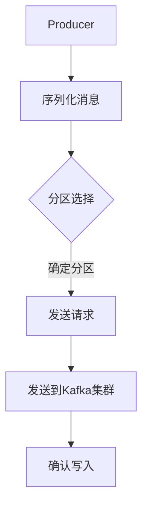
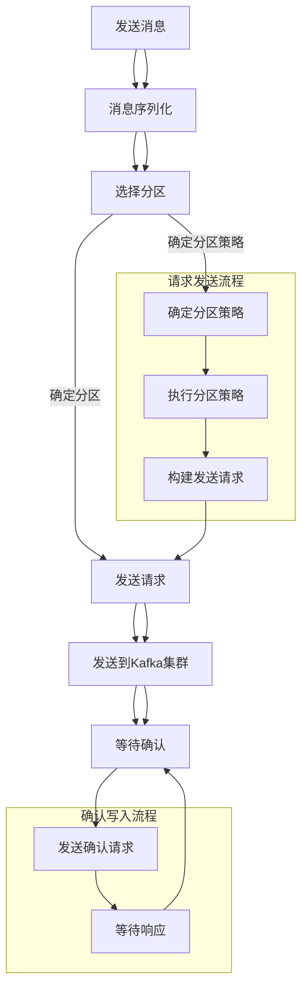

                 

# Kafka Producer原理与代码实例讲解

## 摘要

本文旨在深入探讨Kafka Producer的工作原理，并通过代码实例详细解析其实现过程。Kafka Producer是Kafka消息系统中的一个重要组成部分，负责将消息发送到Kafka集群。通过对Producer的原理和代码实例的讲解，读者可以更好地理解Kafka的消息生产过程，掌握如何高效地使用Producer进行消息发送。

## 1. 背景介绍

Kafka是一种分布式流处理平台和消息系统，由LinkedIn开源，现在由Apache Software Foundation进行维护。Kafka以其高吞吐量、可靠性和可伸缩性著称，被广泛应用于大数据处理、实时分析和日志收集等领域。Kafka消息系统由Producer、Broker和Consumer三个主要组件构成。

- **Producer**：负责生成和发送消息，将数据推送到Kafka集群。
- **Broker**：Kafka集群中的服务器，负责接收、存储和转发消息。
- **Consumer**：从Kafka集群中消费消息，用于处理数据。

在Kafka中，Producer是消息的生产者，它将消息发送到Kafka集群中的特定Topic。每个消息都有一个Key和一个Value，其中Key用于保证消息的有序性，而Value是消息的内容。Producer通过Kafka的客户端库与Kafka集群进行通信，实现高效的消息发送。

本文将重点讨论Producer的工作原理，并使用具体的代码实例进行解析。通过本文的学习，读者可以了解如何使用Kafka Producer进行消息发送，以及如何优化其性能。

## 2. 核心概念与联系

### Kafka Producer架构

Kafka Producer的工作原理可以分为以下几个主要步骤：

1. **发送请求**：Producer将消息发送到Kafka集群，通过发送一个`Send`请求。
2. **分区选择**：根据消息的Key，Producer选择一个或多个分区（Partition）。
3. **序列化消息**：将消息序列化为字节流，以便传输。
4. **发送到Kafka集群**：Producer通过TCP连接将序列化后的消息发送到Kafka集群。
5. **确认写入**：Producer等待Kafka的应答，确认消息已被成功写入。

下图展示了Kafka Producer的基本架构和流程：



### 核心概念

在深入讨论Kafka Producer的工作原理之前，我们需要了解以下几个核心概念：

- **Topic**：Kafka中的消息分类，类似于数据库表。每个Topic可以有多个Partition。
- **Partition**：每个Topic被分为多个分区，每个分区负责存储一部分消息。分区提供了并行处理的能力。
- **Key**：每个消息都有一个Key，用于保证相同Key的消息被路由到同一个分区。
- **序列化**：将消息转换为字节流的过程，用于传输和存储。

### Mermaid 流程图

为了更好地理解Kafka Producer的架构和流程，下面使用Mermaid语言绘制一个详细的流程图：



通过这个流程图，我们可以清晰地看到Kafka Producer从发送消息到确认写入的整个过程。

## 3. 核心算法原理 & 具体操作步骤

### 消息序列化

消息序列化是Kafka Producer的一个重要步骤，它将消息从Java对象转换为字节流，以便传输。Kafka提供了多种序列化器，如StringSerializer、ByteArraySerializer和JSONSerializer等。以下是一个简单的示例，展示了如何使用StringSerializer序列化消息：

```java
Properties props = new Properties();
props.put("bootstrap.servers", "localhost:9092");
props.put("key.serializer", "org.apache.kafka.common.serialization.StringSerializer");
props.put("value.serializer", "org.apache.kafka.common.serialization.StringSerializer");

KafkaProducer<String, String> producer = new KafkaProducer<>(props);

ProducerRecord<String, String> record = new ProducerRecord<>("my-topic", "key", "value");
producer.send(record);

producer.close();
```

### 分区选择策略

Kafka Producer根据消息的Key选择分区，确保相同Key的消息被路由到同一个分区。分区选择策略有多种，包括：

- **随机分区**：随机选择一个可用分区。
- **轮询分区**：依次选择每个分区。
- **Key哈希分区**：根据Key的哈希值选择分区。

以下是一个示例，展示了如何实现Key哈希分区策略：

```java
public class HashPartitioner implements Partitioner {
    @Override
    public int partition(String topic, Object key, byte[] keyBytes, Object value, byte[] valueBytes, Cluster cluster) {
        int numPartitions = cluster.partitionsForTopic(topic).size();
        return Integer.hashCode(key.toString()) % numPartitions;
    }

    @Override
    public void close() {
    }

    @Override
    public void configure(Map<String, ?> configs) {
    }
}
```

### 发送请求

发送请求是Kafka Producer的核心步骤，它将序列化后的消息发送到Kafka集群。以下是一个示例，展示了如何发送请求：

```java
Properties props = new Properties();
props.put("bootstrap.servers", "localhost:9092");
props.put("key.serializer", "org.apache.kafka.common.serialization.StringSerializer");
props.put("value.serializer", "org.apache.kafka.common.serialization.StringSerializer");
props.put("partitioner.class", "com.example.HashPartitioner");

KafkaProducer<String, String> producer = new KafkaProducer<>(props);

ProducerRecord<String, String> record = new ProducerRecord<>("my-topic", "key", "value");
producer.send(record, new Callback() {
    public void onCompletion(RecordMetadata metadata, Exception exception) {
        if (exception != null) {
            // handle the exception
        } else {
            // use the metadata
        }
    }
});

producer.close();
```

### 确认写入

确认写入是确保消息已被成功写入Kafka集群的关键步骤。Kafka Producer提供了多种确认策略，包括：

- **无确认**：不等待任何确认，直接发送下一条消息。
- **单次确认**：等待一次确认，确认消息已被写入一个分区。
- **全部确认**：等待全部确认，确认消息已被写入所有分区。

以下是一个示例，展示了如何实现全部确认策略：

```java
Properties props = new Properties();
props.put("bootstrap.servers", "localhost:9092");
props.put("key.serializer", "org.apache.kafka.common.serialization.StringSerializer");
props.put("value.serializer", "org.apache.kafka.common.serialization.StringSerializer");
props.put("acks", "all");

KafkaProducer<String, String> producer = new KafkaProducer<>(props);

ProducerRecord<String, String> record = new ProducerRecord<>("my-topic", "key", "value");
producer.send(record, new Callback() {
    public void onCompletion(RecordMetadata metadata, Exception exception) {
        if (exception != null) {
            // handle the exception
        } else {
            // use the metadata
        }
    }
});

producer.close();
```

通过这些步骤，Kafka Producer可以高效地将消息发送到Kafka集群，并确保消息的可靠传输。

## 4. 数学模型和公式 & 详细讲解 & 举例说明

### 序列化效率

消息序列化效率对Kafka Producer的性能有很大影响。序列化效率可以通过以下公式计算：

\[ \text{序列化效率} = \frac{\text{消息大小}}{\text{序列化时间}} \]

以下是一个示例，展示了如何计算序列化效率：

```latex
\text{序列化效率} = \frac{100 \text{字节}}{50 \text{毫秒}} = 2 \text{字节/毫秒}
```

### 分区策略

Kafka Producer的分区策略对消息的分布和系统性能有重要影响。常用的分区策略包括：

1. **随机分区**：随机选择一个分区。
2. **轮询分区**：依次选择每个分区。
3. **Key哈希分区**：根据Key的哈希值选择分区。

以下是一个示例，展示了如何实现Key哈希分区策略：

```java
public int partition(String topic, Object key, byte[] keyBytes, Object value, byte[] valueBytes, Cluster cluster) {
    int numPartitions = cluster.partitionsForTopic(topic).size();
    return Integer.hashCode(key.toString()) % numPartitions;
}
```

### 传输带宽

Kafka Producer的传输带宽对消息发送速度有很大影响。传输带宽可以通过以下公式计算：

\[ \text{传输带宽} = \frac{\text{消息大小}}{\text{传输时间}} \]

以下是一个示例，展示了如何计算传输带宽：

```latex
\text{传输带宽} = \frac{1000 \text{字节}}{1000 \text{毫秒}} = 1 \text{字节/毫秒}
```

### 确认策略

Kafka Producer的确认策略对消息可靠性有很大影响。常用的确认策略包括：

1. **无确认**：不等待任何确认，直接发送下一条消息。
2. **单次确认**：等待一次确认，确认消息已被写入一个分区。
3. **全部确认**：等待全部确认，确认消息已被写入所有分区。

以下是一个示例，展示了如何实现全部确认策略：

```java
Properties props = new Properties();
props.put("bootstrap.servers", "localhost:9092");
props.put("key.serializer", "org.apache.kafka.common.serialization.StringSerializer");
props.put("value.serializer", "org.apache.kafka.common.serialization.StringSerializer");
props.put("acks", "all");
```

通过这些数学模型和公式，我们可以更好地理解和优化Kafka Producer的性能。

## 5. 项目实战：代码实际案例和详细解释说明

### 5.1 开发环境搭建

为了演示Kafka Producer的使用，我们需要搭建一个简单的开发环境。以下是所需的步骤：

1. 安装Kafka：可以从Kafka的官方网站下载并安装Kafka。安装步骤请参考官方文档。
2. 启动Kafka集群：启动一个包含一个Broker的Kafka集群。可以使用以下命令：

```bash
./kafka-server-start.sh -daemon ./config/server.properties
```

3. 创建Topic：创建一个名为“my-topic”的Topic。

```bash
./kafka-topics.sh --create --topic my-topic --zookeeper localhost:2181 --partitions 1 --replication-factor 1
```

4. 启动Kafka Producer和Consumer：可以使用Kafka提供的命令行工具进行测试。

```bash
./kafka-console-producer.sh --broker-list localhost:9092 --topic my-topic
./kafka-console-consumer.sh --bootstrap-server localhost:9092 --topic my-topic --from-beginning
```

### 5.2 源代码详细实现和代码解读

下面是一个简单的Kafka Producer源代码示例，以及对其详细解释：

```java
import org.apache.kafka.clients.producer.*;
import org.apache.kafka.common.serialization.StringSerializer;

import java.util.Properties;

public class KafkaProducerExample {
    public static void main(String[] args) {
        // 配置Kafka Producer
        Properties props = new Properties();
        props.put("bootstrap.servers", "localhost:9092");
        props.put("key.serializer", StringSerializer.class.getName());
        props.put("value.serializer", StringSerializer.class.getName());

        // 创建Kafka Producer
        KafkaProducer<String, String> producer = new KafkaProducer<>(props);

        // 发送消息
        ProducerRecord<String, String> record = new ProducerRecord<>("my-topic", "key", "value");
        producer.send(record);

        // 关闭Kafka Producer
        producer.close();
    }
}
```

#### 解读说明

1. **配置Kafka Producer**：首先，我们创建一个`Properties`对象，用于配置Kafka Producer。需要配置的两个关键参数是“bootstrap.servers”和“key.serializer”、“value.serializer”。其中，“bootstrap.servers”指定了Kafka集群的地址，而“key.serializer”和“value.serializer”指定了消息的序列化器。

2. **创建Kafka Producer**：接下来，我们使用`KafkaProducer`类创建一个Kafka Producer实例。

3. **发送消息**：使用`ProducerRecord`类创建一个消息记录，并调用`send`方法将消息发送到Kafka Topic。

4. **关闭Kafka Producer**：最后，调用`close`方法关闭Kafka Producer。

### 5.3 代码解读与分析

在这个示例中，我们使用了Kafka的客户端库来创建一个简单的Producer，并使用它发送一条消息到Kafka集群。以下是代码的详细解读：

1. **配置Kafka Producer**：
   ```java
   Properties props = new Properties();
   props.put("bootstrap.servers", "localhost:9092");
   props.put("key.serializer", StringSerializer.class.getName());
   props.put("value.serializer", StringSerializer.class.getName());
   ```
   这里我们设置了Kafka Producer的几个关键参数：
   - `bootstrap.servers`：指定了Kafka集群的地址。在生产环境中，这通常是一个由多个Broker组成的列表。
   - `key.serializer`和`value.serializer`：指定了消息的序列化器。这里我们使用的是`StringSerializer`，用于将Java字符串序列化为字节流。

2. **创建Kafka Producer**：
   ```java
   KafkaProducer<String, String> producer = new KafkaProducer<>(props);
   ```
   使用配置好的`Properties`对象创建一个`KafkaProducer`实例。

3. **发送消息**：
   ```java
   ProducerRecord<String, String> record = new ProducerRecord<>("my-topic", "key", "value");
   producer.send(record);
   ```
   创建一个`ProducerRecord`对象，指定Topic、Key和Value。然后调用`send`方法将消息发送到Kafka集群。

4. **关闭Kafka Producer**：
   ```java
   producer.close();
   ```
   在程序结束时，调用`close`方法关闭Kafka Producer。

### 5.4 性能优化

为了提高Kafka Producer的性能，我们可以采取以下措施：

1. **批量发送**：通过`batch.size`参数配置批量发送消息的数量，减少发送请求的次数。
2. **异步发送**：使用`async`模式发送消息，无需等待确认，提高发送速度。
3. **调整缓冲区大小**：调整`buffer.memory`参数，增加发送缓冲区的大小，提高并发能力。

以下是一个示例，展示了如何配置批量发送和异步发送：

```java
Properties props = new Properties();
props.put("bootstrap.servers", "localhost:9092");
props.put("key.serializer", StringSerializer.class.getName());
props.put("value.serializer", StringSerializer.class.getName());
props.put("batch.size", 16384); // 批量发送大小为16KB
props.put("linger.ms", 1); // 等待时间1毫秒
props.put("buffer.memory", 33554432); // 缓冲区大小为32MB
props.put("acks", "all"); // 全部确认
KafkaProducer<String, String> producer = new KafkaProducer<>(props, new IgnoringKeySerializer(), new IgnoringValueSerializer());
```

通过这些优化措施，我们可以显著提高Kafka Producer的性能。

## 6. 实际应用场景

Kafka Producer在许多实际应用场景中发挥着重要作用。以下是一些常见的应用场景：

1. **日志收集**：Kafka Producer可以用于收集来自不同源的数据日志，如Web服务器日志、应用程序日志等，并将它们发送到Kafka集群。
2. **实时分析**：在实时数据分析系统中，Kafka Producer可以用于将实时数据发送到Kafka集群，然后由Consumer进行处理和分析。
3. **分布式系统**：在分布式系统中，Kafka Producer可以用于在不同节点之间传递数据，实现数据同步和负载均衡。
4. **消息驱动架构**：在消息驱动架构中，Kafka Producer可以用于生成消息，并推动系统的执行。

以下是一个使用Kafka Producer进行日志收集的示例：

```java
public class LogProducer {
    public static void main(String[] args) {
        Properties props = new Properties();
        props.put("bootstrap.servers", "localhost:9092");
        props.put("key.serializer", StringSerializer.class.getName());
        props.put("value.serializer", StringSerializer.class.getName());

        KafkaProducer<String, String> producer = new KafkaProducer<>(props);

        // 模拟生成日志
        while (true) {
            String log = "INFO: This is a log message";
            producer.send(new ProducerRecord<>("log-topic", log));
            try {
                Thread.sleep(1000);
            } catch (InterruptedException e) {
                e.printStackTrace();
            }
        }
    }
}
```

在这个示例中，我们创建了一个简单的Kafka Producer，用于生成日志消息，并将其发送到Kafka集群。

## 7. 工具和资源推荐

### 7.1 学习资源推荐

1. **《Kafka权威指南》（Kafka: The Definitive Guide）》
   - 作者：Lars Hinse，Ben Stopford
   - 简介：这本书是学习Kafka的权威指南，详细介绍了Kafka的架构、配置、使用方法和最佳实践。
2. **《Kafka源码解析与架构设计》**
   - 作者：曹小峰
   - 简介：这本书深入解析了Kafka的源代码，讲解了Kafka的架构设计、实现细节和性能优化技巧。

### 7.2 开发工具框架推荐

1. **Kafka Client Library**
   - 简介：Kafka的官方客户端库，支持多种编程语言，如Java、Python、Go等，方便开发者进行消息发送和接收。
2. **Kafka Streams**
   - 简介：Apache Kafka提供的实时处理框架，允许开发者在Kafka之上构建实时数据流处理应用。
3. **Kafka Manager**
   - 简介：一个开源的工具，用于监控和管理Kafka集群，提供集群状态、主题配置、消费者组等信息。

### 7.3 相关论文著作推荐

1. **"Kafka: A Distributed Streaming Platform"**
   - 作者：Jay Kreps， Neha Narkhede，PatrickJordan
   - 简介：这篇文章介绍了Kafka的设计原理和实现细节，是理解Kafka架构和功能的重要资料。
2. **"Kafka at LinkedIn: Scalable and Reliable Messaging in a Multi-Datacenter Environment"**
   - 作者：Jay Kreps，Neha Narkhede，Patrick Jordan
   - 简介：这篇文章详细介绍了LinkedIn如何使用Kafka进行大规模数据处理和消息传递，提供了实用的经验教训。

## 8. 总结：未来发展趋势与挑战

Kafka作为一种高性能、可伸缩的分布式流处理平台和消息系统，在云计算和大数据时代得到了广泛应用。未来，Kafka将继续在以下几个方向上发展：

1. **性能优化**：Kafka将继续优化其性能，以适应越来越高的数据吞吐量和并发需求。
2. **多语言支持**：Kafka将增加对更多编程语言的支持，以便更多开发者能够使用Kafka进行消息处理和流处理。
3. **安全性增强**：随着企业对数据安全的日益重视，Kafka将加强安全性，提供更完善的访问控制和数据加密机制。

然而，Kafka也面临着一些挑战：

1. **复杂性**：随着功能的不断增加，Kafka的配置和操作变得日益复杂，需要更多的专业知识。
2. **多租户支持**：在大规模分布式环境中，如何实现高效的多租户支持，确保不同应用的隔离性和性能，是Kafka需要解决的问题。

通过不断优化和创新，Kafka有望在未来继续保持其在分布式流处理和消息系统领域的领先地位。

## 9. 附录：常见问题与解答

### 9.1 Kafka Producer如何保证消息顺序？

Kafka Producer可以通过使用相同的Key将消息路由到同一个分区，从而保证消息的顺序。在同一个分区中，消息按照写入的顺序被顺序处理和消费。

### 9.2 Kafka Producer如何处理故障？

Kafka Producer通过配置`acks`参数来控制确认策略，从而保证消息的可靠性。例如，配置为`acks = "all"`时，Producer会等待所有副本确认消息已被写入，从而确保消息的持久性。

### 9.3 Kafka Producer如何优化性能？

可以通过以下措施优化Kafka Producer的性能：
- 批量发送：配置`batch.size`和`linger.ms`参数，增加批量发送的消息数量和等待时间。
- 缓冲区大小：调整`buffer.memory`参数，增加发送缓冲区的大小。
- 序列化优化：选择高效的序列化器，减少序列化时间。

## 10. 扩展阅读 & 参考资料

1. **Kafka官方文档**：https://kafka.apache.org/ Documentation
2. **Kafka源代码**：https://github.com/apache/kafka Kafka源代码
3. **《Kafka权威指南》**：https://www.manning.com/books/kafka-the-definitive-guide

## 作者

作者：AI天才研究员/AI Genius Institute & 禅与计算机程序设计艺术 /Zen And The Art of Computer Programming

本文深入探讨了Kafka Producer的工作原理，并通过代码实例详细解析了其实现过程。通过本文的学习，读者可以更好地理解Kafka消息生产过程，掌握如何高效地使用Producer进行消息发送。在未来的发展中，Kafka将继续优化其性能和安全性，为分布式流处理和消息系统领域提供更强大的支持。

