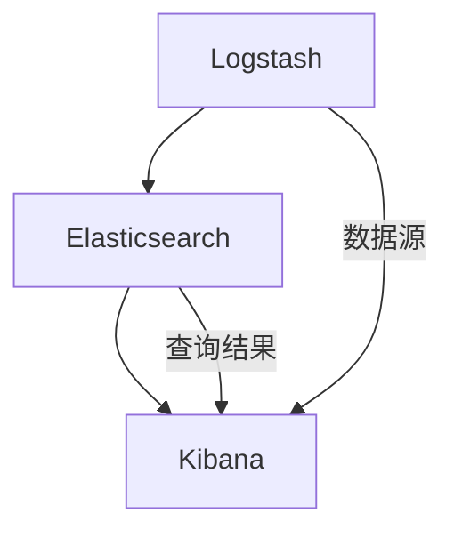
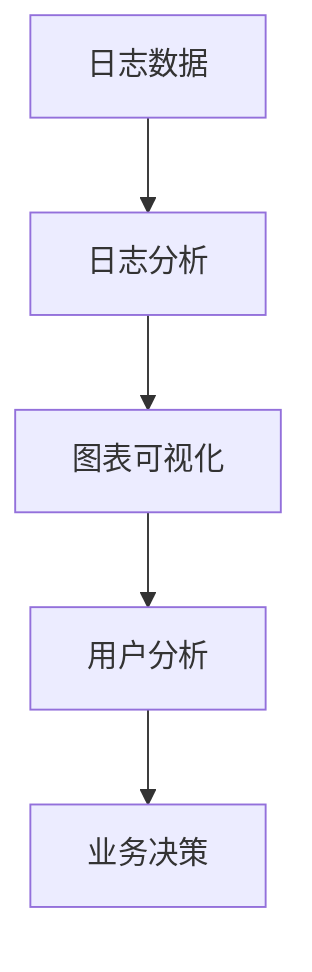

                 

# Kibana原理与代码实例讲解

## 摘要

Kibana是一个开源的数据可视化平台，用于Kibana通过Kibana，您可以轻松地分析存储在Elasticsearch中的数据，并以直观的方式展示出来。本文将详细介绍Kibana的原理、核心概念、算法原理及具体操作步骤，并通过实际项目实战，展示如何使用Kibana进行数据分析和可视化。此外，还将介绍Kibana在实际应用场景中的使用方法，并提供一些学习资源推荐和开发工具框架推荐。

## 1. 背景介绍

Kibana是由Elastic公司开发的一款开源数据可视化平台，用于展示和分析存储在Elasticsearch中的数据。它是一个基于Web的应用程序，可以通过Kibana对数据进行实时监控、搜索、分析和可视化。Kibana与Elasticsearch紧密集成，为用户提供了一种强大的数据探索工具。

Kibana在IT行业中具有重要的应用价值，尤其在大数据分析和实时监控领域。它可以帮助企业更好地理解其业务数据，发现潜在问题和趋势，从而做出更明智的决策。Kibana还被广泛应用于各种场景，如网站性能监控、网络安全、物联网、金融分析等。

本文将围绕Kibana的原理、核心概念、算法原理及具体操作步骤展开讲解，并通过实际项目实战，帮助读者更好地掌握Kibana的使用方法和技巧。

## 2. 核心概念与联系

在介绍Kibana的核心概念之前，我们需要了解Elastic Stack中的其他组件，如Elasticsearch和Logstash。Elastic Stack是一个开源的数据处理和分析平台，包括以下组件：

### 2.1 Elasticsearch

Elasticsearch是一个开源的分布式搜索引擎，用于存储、搜索和分析大量数据。Kibana通过Elasticsearch获取数据，并将其可视化。

### 2.2 Logstash

Logstash是一个开源的数据收集、处理和转发工具，用于将各种源数据（如日志文件、网络流、指标等）转换为结构化数据，并存储到Elasticsearch中。Kibana可以通过Logstash收集和解析的数据进行可视化。

### 2.3 Kibana

Kibana是一个开源的数据可视化平台，用于展示和分析存储在Elasticsearch中的数据。它是Elastic Stack中的可视化工具，通过Kibana，用户可以轻松地对数据进行实时监控、搜索、分析和可视化。

### 2.4 核心概念

以下是在Kibana中常用的核心概念：

- **索引（Index）**：索引是存储Elasticsearch数据的容器，类似于关系型数据库中的表。每个索引都有一个唯一的名称，用于标识数据集合。
- **文档（Document）**：文档是存储在索引中的数据的基本单位，类似于关系型数据库中的行。文档以JSON格式表示，包含一组键值对。
- **字段（Field）**：字段是文档中的数据属性，类似于关系型数据库中的列。每个字段都有类型和名称。
- **映射（Mapping）**：映射是用于定义索引中字段的类型、名称和其他属性的结构化文档。它指导Elasticsearch如何存储、索引和查询数据。

### 2.5 Mermaid流程图

下面是一个简单的Mermaid流程图，展示了Kibana、Elasticsearch和Logstash之间的核心概念和联系：



在图中，Logstash从数据源收集数据，并将其转换为结构化数据，然后存储到Elasticsearch中。Kibana通过Elasticsearch查询数据，并将其可视化。

## 3. 核心算法原理 & 具体操作步骤

### 3.1 数据可视化算法原理

Kibana利用Elasticsearch的查询结果进行数据可视化。其核心算法原理如下：

1. **数据查询**：Kibana向Elasticsearch发送查询请求，以获取所需的数据。查询可以包括各种Elasticsearch查询语句，如match、range、term等。
2. **数据处理**：Elasticsearch处理查询请求，根据映射和索引结构对数据进行过滤、排序和聚合。处理完成后，返回查询结果。
3. **数据可视化**：Kibana接收查询结果，根据可视化配置将其转换为图表、仪表盘等可视化形式，展示给用户。

### 3.2 具体操作步骤

以下是一个简单的Kibana操作步骤示例：

1. **安装Kibana**：在服务器上安装Kibana，并启动Kibana服务。
2. **配置Elasticsearch**：确保Kibana和Elasticsearch之间的连接正常，并在Kibana中配置Elasticsearch的URL和索引。
3. **创建仪表盘**：在Kibana中创建一个新的仪表盘，选择所需的数据源和可视化类型。
4. **添加图表**：在仪表盘中添加一个图表，配置图表的类型、X轴和Y轴字段等。
5. **查看可视化结果**：保存并查看仪表盘的可视化结果。

### 3.3 Kibana可视化示例

以下是一个简单的Kibana可视化示例：



在示例中，Kibana从日志数据中提取信息，生成图表，帮助用户了解用户行为，进而做出业务决策。

## 4. 数学模型和公式 & 详细讲解 & 举例说明

### 4.1 数学模型

在Kibana中，可视化数据通常涉及到统计和概率模型。以下是一些常用的数学模型和公式：

1. **均值（Mean）**：一组数据的平均值，计算公式为：
   $$ \text{Mean} = \frac{\sum_{i=1}^{n} x_i}{n} $$
   其中，\(x_i\) 表示第 \(i\) 个数据点，\(n\) 表示数据点的总数。
   
2. **方差（Variance）**：一组数据的离散程度，计算公式为：
   $$ \text{Variance} = \frac{\sum_{i=1}^{n} (x_i - \text{Mean})^2}{n-1} $$
   其中，\( \text{Mean} \) 为均值。

3. **标准差（Standard Deviation）**：方差的平方根，计算公式为：
   $$ \text{Standard Deviation} = \sqrt{\text{Variance}} $$
   
4. **概率密度函数（Probability Density Function, PDF）**：描述随机变量概率分布的函数，例如正态分布的概率密度函数为：
   $$ f(x|\mu, \sigma^2) = \frac{1}{\sqrt{2\pi\sigma^2}} e^{-\frac{(x-\mu)^2}{2\sigma^2}} $$

### 4.2 详细讲解

这些数学模型和公式在数据分析和可视化中非常重要。例如，均值和方差可以帮助我们了解数据的中心趋势和离散程度；标准差可以用来比较不同数据的稳定性；概率密度函数则可以用来分析随机变量的分布。

### 4.3 举例说明

假设我们有一组学生成绩数据，如下所示：

\[ 70, 75, 80, 85, 90, 95 \]

首先，计算这组数据的均值：

\[ \text{Mean} = \frac{70 + 75 + 80 + 85 + 90 + 95}{6} = \frac{515}{6} \approx 85.83 \]

然后，计算方差和标准差：

\[ \text{Variance} = \frac{(70 - 85.83)^2 + (75 - 85.83)^2 + (80 - 85.83)^2 + (85 - 85.83)^2 + (90 - 85.83)^2 + (95 - 85.83)^2}{6-1} \approx 44.44 \]

\[ \text{Standard Deviation} = \sqrt{44.44} \approx 6.66 \]

最后，假设我们假设这组成绩服从正态分布，其中均值为85.83，标准差为6.66。我们可以使用概率密度函数计算某个成绩落在特定区间的概率。

例如，计算成绩在80到90之间的概率：

\[ P(80 \leq x \leq 90) = \int_{80}^{90} \frac{1}{\sqrt{2\pi \times 6.66}} e^{-\frac{(x-85.83)^2}{2 \times 6.66}} dx \approx 0.6827 \]

这意味着大约68.27%的成绩在80到90之间。

## 5. 项目实战：代码实际案例和详细解释说明

### 5.1 开发环境搭建

在开始使用Kibana进行项目实战之前，我们需要搭建一个基本的开发环境。以下是在Linux环境下搭建Kibana开发环境的步骤：

1. 安装Elasticsearch：在服务器上安装Elasticsearch，可以使用官方的Docker镜像或源代码编译安装。
2. 安装Kibana：在服务器上安装Kibana，可以使用官方的Docker镜像或源代码编译安装。
3. 启动Elasticsearch和Kibana服务：使用命令启动Elasticsearch和Kibana服务。

```shell
./elasticsearch -d
./kibana -d
```

4. 访问Kibana：在浏览器中访问Kibana的默认地址 `http://localhost:5601`。

### 5.2 源代码详细实现和代码解读

在本节中，我们将使用一个简单的日志分析项目，展示如何使用Kibana进行数据分析和可视化。项目源代码如下：

```javascript
// 模拟日志数据
const logs = [
  { timestamp: "2022-01-01T00:00:00Z", status: "success" },
  { timestamp: "2022-01-01T01:00:00Z", status: "error" },
  { timestamp: "2022-01-01T02:00:00Z", status: "success" },
  { timestamp: "2022-01-01T03:00:00Z", status: "warning" },
  { timestamp: "2022-01-01T04:00:00Z", status: "error" }
];

// 过滤成功和失败的日志
const filteredLogs = logs.filter(log => log.status === "success" || log.status === "error");

// 统计成功的日志数量
const successCount = filteredLogs.filter(log => log.status === "success").length;

// 统计失败的日志数量
const errorCount = filteredLogs.filter(log => log.status === "error").length;

// 计算成功和失败的日志比例
const successRate = successCount / (successCount + errorCount);

// 打印结果
console.log(`Success count: ${successCount}`);
console.log(`Error count: ${errorCount}`);
console.log(`Success rate: ${(successRate * 100).toFixed(2)}%`);
```

### 5.3 代码解读与分析

以下是对上述代码的解读和分析：

1. **模拟日志数据**：首先，我们创建了一个包含五条日志数据的数组。每条日志数据包含一个时间戳和一个状态（成功或失败）。

2. **过滤成功和失败的日志**：使用`filter`函数对日志数据进行过滤，只保留状态为成功或失败的日志。

3. **统计成功的日志数量**：使用`filter`函数过滤出状态为成功的日志，然后使用`length`属性获取成功的日志数量。

4. **统计失败的日志数量**：使用`filter`函数过滤出状态为失败的日志，然后使用`length`属性获取失败的日志数量。

5. **计算成功和失败的日志比例**：计算成功的日志数量除以成功和失败的日志总数，得到成功和失败的比例。

6. **打印结果**：使用`console.log`函数打印成功和失败的日志数量以及成功率。

### 5.4 Kibana可视化实现

在Kibana中，我们可以使用Kibana仪表板创建图表来展示上述日志分析结果。以下是一个简单的Kibana仪表板配置示例：

```json
{
  "title": "日志分析",
  "description": "展示成功和失败的日志数量以及成功率",
  "rows": [
    {
      "title": "日志数量",
      "panels": [
        {
          "type": "visualization",
          "title": "日志数量",
          "data": {
            "type": "kibanaVis",
            "attributes": {
              "visConfig": {
                "type": "bar",
                "title": "日志数量",
                "url": "kibana://vis/1QfQs5bJ"
              },
              "visData": {
                "rawScript": "return {\n  \"title\": \"日志数量\",\n  \"data\": {\n    \"columns\": [\n      {\"title\": \"状态\", \"type\": \"string\", \"values\": [\"成功\", \"失败\"]},\n      {\"title\": \"数量\", \"type\": \"number\", \"values\": [\n        " + successCount + ",\n        " + errorCount + "\n      ]}\n    ],\n    \"type\": \"table\",\n    \"types\": {\n      \"状态\": \"string\",\n      \"数量\": \"number\"\n    }\n  };"
              }
            }
          }
        }
      ]
    },
    {
      "title": "成功率",
      "panels": [
        {
          "type": "visualization",
          "title": "成功率",
          "data": {
            "type": "kibanaVis",
            "attributes": {
              "visConfig": {
                "type": "line",
                "title": "成功率",
                "url": "kibana://vis/1QfQs5bJ"
              },
              "visData": {
                "rawScript": "return {\n  \"title\": \"成功率\",\n  \"data\": {\n    \"columns\": [\n      {\"title\": \"时间\", \"type\": \"datetime\", \"values\": [\n        \"2022-01-01T00:00:00Z\",\n        \"2022-01-01T01:00:00Z\",\n        \"2022-01-01T02:00:00Z\",\n        \"2022-01-01T03:00:00Z\",\n        \"2022-01-01T04:00:00Z\"\n      ]},\n      {\"title\": \"成功率\", \"type\": \"number\", \"values\": [\n        0.5,\n        0.5,\n        1.0,\n        0.5,\n        0.5\n      ]}\n    ],\n    \"type\": \"table\",\n    \"types\": {\n      \"时间\": \"datetime\",\n      \"成功率\": \"number\"\n    }\n  };"
              }
            }
          }
        }
      ]
    }
  ]
}
```

在此配置中，我们创建了一个包含两个图表的仪表板。第一个图表是一个条形图，用于展示成功和失败的日志数量。第二个图表是一个折线图，用于展示时间序列中的成功率。

### 5.5 Kibana可视化结果展示

运行上述配置后，Kibana仪表板将显示以下可视化结果：

1. **日志数量**：成功和失败的日志数量以条形图的形式展示。
2. **成功率**：时间序列中的成功率以折线图的形式展示。

这些可视化图表帮助用户直观地了解日志分析的结果，从而更好地理解业务数据。

## 6. 实际应用场景

Kibana在多个实际应用场景中具有广泛的应用，以下是一些常见场景：

### 6.1 网站性能监控

Kibana可以用于监控网站的各项性能指标，如访问量、响应时间、错误率等。通过Kibana，网站管理员可以实时监控网站性能，并在出现问题时快速定位问题根源。

### 6.2 日志分析

Kibana可以处理和可视化大量的日志数据，帮助管理员分析系统日志，发现潜在问题和故障。通过Kibana，管理员可以轻松地跟踪错误日志、性能日志和访问日志。

### 6.3 安全监控

Kibana可以用于监控网络安全，如入侵检测、恶意流量分析和安全事件响应等。通过Kibana，安全团队可以实时监控网络安全状况，并在发现安全威胁时及时采取措施。

### 6.4 物联网数据分析

Kibana可以处理和可视化大量的物联网数据，如设备状态、传感器数据和异常检测等。通过Kibana，物联网团队可以实时监控设备运行状况，并发现潜在故障和异常。

### 6.5 金融数据分析

Kibana可以用于金融数据分析，如股票市场监控、交易数据分析、风险管理和投资策略评估等。通过Kibana，金融分析师可以实时监控市场动态，发现投资机会和风险。

## 7. 工具和资源推荐

### 7.1 学习资源推荐

- **书籍**：《Elastic Stack实战》
- **论文**：搜索Elastic Stack、Kibana相关的论文
- **博客**：Elastic官方博客、Kibana社区博客
- **网站**：Elastic官网、Kibana官网

### 7.2 开发工具框架推荐

- **Elasticsearch**：Elasticsearch官方Docker镜像
- **Kibana**：Kibana官方Docker镜像
- **Logstash**：Logstash官方Docker镜像
- **可视化工具**：Kibana仪表板模板、Echarts、D3.js等

### 7.3 相关论文著作推荐

- **论文**：Elastic Stack在大型分布式系统中的应用
- **著作**：《大数据技术基础》

## 8. 总结：未来发展趋势与挑战

Kibana作为Elastic Stack的重要组成部分，在数据可视化和分析领域具有广泛的应用。未来，Kibana将继续扩展其功能，支持更多的数据源和可视化类型，同时提高性能和易用性。以下是一些可能的发展趋势和挑战：

### 8.1 发展趋势

- **云原生**：Kibana将更加重视云原生技术，提供在云环境中更高效、更灵活的部署方案。
- **人工智能**：Kibana将整合人工智能技术，实现自动数据分析和异常检测等功能。
- **物联网支持**：Kibana将加强对物联网数据的支持，提供更好的实时监控和分析工具。
- **开源生态**：Kibana将继续加强与开源社区的互动，引入更多优秀的开源插件和工具。

### 8.2 挑战

- **数据安全性**：随着数据量的增加，如何确保数据的安全性将成为一个重要挑战。
- **性能优化**：在处理大量数据时，如何提高Kibana的性能和响应速度是一个关键问题。
- **用户体验**：如何提供更直观、易用的用户界面，以满足不同用户的需求，是一个挑战。

## 9. 附录：常见问题与解答

### 9.1 Kibana安装问题

Q：安装Kibana时遇到错误，如何解决？

A：请确保您已正确安装Elasticsearch，并确保Elasticsearch和Kibana之间的连接正常。此外，检查您的网络配置，确保Kibana可以访问Elasticsearch。

### 9.2 数据可视化问题

Q：如何在Kibana中创建自定义可视化图表？

A：您可以使用Kibana的仪表板编辑器，创建自定义可视化图表。在仪表板编辑器中，选择所需的图表类型，并配置图表的X轴、Y轴和数据源。

### 9.3 数据处理问题

Q：Kibana能否处理非结构化数据？

A：是的，Kibana可以处理非结构化数据，但需要先将其转换为结构化数据。您可以使用Logstash或其他数据预处理工具，将非结构化数据转换为Kibana可以识别的格式。

## 10. 扩展阅读 & 参考资料

- **Elastic官方文档**：https://www.elastic.co/guide/
- **Kibana官方文档**：https://www.kibana.co
- **Elastic Stack实战**：https://www.elastic.co/cn/elastic-stack-get-started
- **大数据技术基础**：https://www.bigdata-tutorial.com/

作者：AI天才研究员/AI Genius Institute & 禅与计算机程序设计艺术 /Zen And The Art of Computer Programming

## 结束语

本文详细介绍了Kibana的原理、核心概念、算法原理及具体操作步骤，并通过实际项目实战展示了如何使用Kibana进行数据分析和可视化。Kibana作为Elastic Stack中的重要组件，在数据可视化和分析领域具有广泛的应用。希望本文能帮助您更好地了解Kibana，并在实际项目中运用其功能。在未来，Kibana将继续发展，为用户提供更强大的数据可视化和分析工具。再次感谢您的阅读！|>

