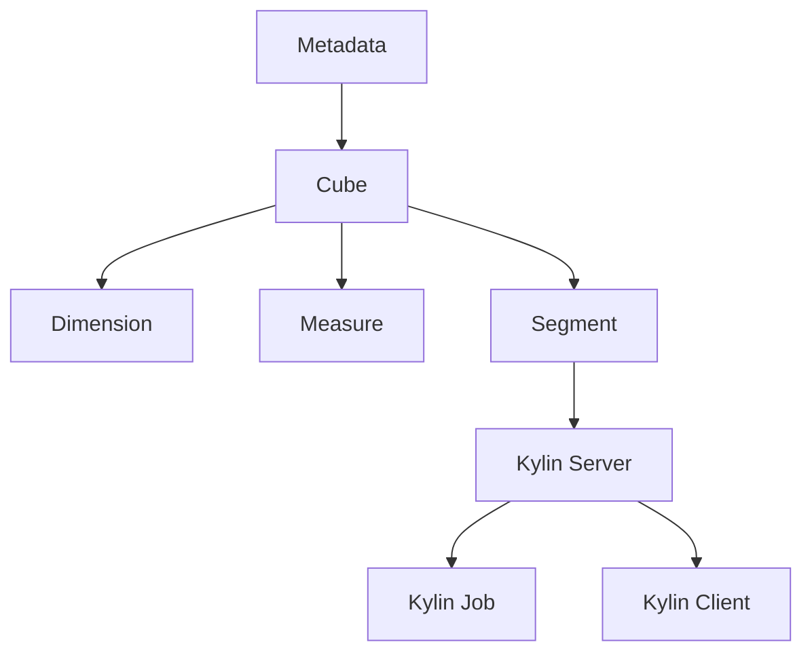

                 

### 文章标题：Kylin原理与代码实例讲解

关键词：Kylin、大数据、分布式计算、内存计算、列式存储、Hadoop、HBase

摘要：
本文旨在深入探讨Kylin这一大数据领域的内存计算平台。我们将从Kylin的背景介绍开始，详细解释其核心概念、算法原理及数学模型，并通过实际代码实例进行深入剖析。文章还将探讨Kylin在实际应用中的场景，推荐相关学习资源和开发工具，并对未来发展趋势和挑战进行展望。通过本文，读者将全面了解Kylin的工作原理、优势和应用场景，为后续深入研究打下坚实基础。

## 1. 背景介绍

随着互联网的快速发展，数据量呈现出爆炸式增长。传统的数据处理方法已经无法满足海量数据的高效处理需求。因此，大数据技术的出现为数据处理带来了革命性的变革。在大数据领域中，分布式计算技术成为主流，而Kylin则是在这一背景下诞生的一款内存计算平台。

Kylin是由eBay开源的一款大数据内存计算平台，旨在解决大数据分析中的实时性和低延迟问题。Kylin的设计理念是将海量数据存储在HBase上，通过预计算和索引技术，实现快速的查询响应。Kylin不仅适用于电商、金融等领域，还可以广泛应用于其他需要高效数据查询的场景。

### 1.1 Kylin的主要功能

- **实时查询**：Kylin通过预计算和索引技术，实现快速的数据查询，支持秒级响应。

- **多维数据分析**：Kylin支持多维数据的查询和分析，能够方便地进行数据透视和交叉分析。

- **数据压缩**：Kylin采用列式存储方式，能够有效降低数据存储空间。

- **集成Hadoop生态系统**：Kylin与Hadoop生态系统紧密集成，支持与HDFS、HBase、MapReduce等组件的无缝对接。

### 1.2 Kylin的优势

- **高性能**：Kylin通过内存计算和索引技术，实现了高效的查询性能。

- **易用性**：Kylin提供了友好的用户界面和简单的配置，降低了使用门槛。

- **可扩展性**：Kylin支持水平扩展，能够根据需求进行弹性扩展。

- **稳定性**：Kylin在多个大型项目中得到了实际应用，具备较高的稳定性。

## 2. 核心概念与联系

为了深入理解Kylin的工作原理，我们需要首先了解其核心概念和组成部分。以下是Kylin的核心概念与联系：

### 2.1 Kylin的核心概念

- **Cube（立方）**：Kylin中的数据模型类似于多维数组，称为Cube。Cube由多个维度和度量组成，能够方便地进行多维数据分析和查询。

- **Dimension（维度）**：维度是Cube中的组成部分，用于划分数据，如时间、地域、产品等。

- **Measure（度量）**：度量是Cube中的数据指标，如销售额、访问量等。

- **Segment（分区）**：Segment是Kylin中的数据分区，用于优化查询性能。每个Segment代表一个时间窗口或者数据范围。

- **Metadata（元数据）**：元数据是Kylin中用于存储和管理Cube配置信息的数据结构。

### 2.2 Kylin的组成部分

- **Kylin Server**：Kylin Server是Kylin的核心组件，负责管理元数据和处理查询请求。

- **Kylin Job**：Kylin Job是Kylin中的数据处理任务，用于生成Cube和Segment。

- **Kylin Client**：Kylin Client是Kylin的命令行工具，用于与Kylin Server交互，执行各种操作。

### 2.3 Mermaid流程图

以下是Kylin核心概念和组成部分的Mermaid流程图：



在上面的流程图中，Metadata用于存储和管理Cube的配置信息，Cube由维度、度量、分区组成，Kylin Server负责处理查询请求，Kylin Job负责生成Cube和Segment，Kylin Client用于与Kylin Server交互。

## 3. 核心算法原理 & 具体操作步骤

### 3.1 数据模型构建

Kylin的数据模型构建过程主要包括以下步骤：

1. **定义Cube**：在Kylin中，首先需要定义一个Cube。Cube的定义包括维度、度量、分区等信息。通过定义Cube，我们可以将原始数据组织成多维数组的形式。

2. **上传数据**：将数据上传到HBase中，以便后续的Cube构建和查询。

3. **构建Segment**：根据Cube的定义，对数据进行分区，生成Segment。每个Segment代表一个时间窗口或者数据范围。

4. **计算度量值**：对于每个Segment，计算度量的值。度量值的计算可以是简单的统计操作，如求和、平均值等。

5. **存储元数据**：将Cube的配置信息（如维度、度量、分区等）存储在Kylin的元数据库中。

### 3.2 查询处理

Kylin的查询处理过程主要包括以下步骤：

1. **查询请求**：用户通过Kylin Client发送查询请求，查询请求中包括查询条件、查询字段等信息。

2. **查询路由**：Kylin Server接收到查询请求后，根据查询条件和元数据信息，选择合适的Segment进行查询。

3. **数据聚合**：对于选中的Segment，进行数据聚合操作，计算查询结果的度量值。

4. **返回结果**：将聚合结果返回给用户。

### 3.3 内存计算原理

Kylin采用内存计算技术，以提高查询性能。以下是Kylin内存计算原理的简要介绍：

1. **数据加载**：Kylin将数据加载到内存中，以便快速访问。数据加载过程中，Kylin会对数据进行压缩，以减少内存占用。

2. **索引构建**：Kylin在内存中构建索引，以提高查询效率。索引包括维度索引、度量索引等。

3. **数据聚合**：在查询过程中，Kylin利用内存中的索引和数据，进行快速的数据聚合操作。

4. **结果缓存**：Kylin将查询结果缓存到内存中，以便后续查询使用。缓存策略包括LRU（最近最少使用）等。

### 3.4 实际操作步骤

以下是使用Kylin进行数据模型构建和查询处理的一个实际操作步骤：

1. **安装Kylin**：首先需要安装Kylin。Kylin的安装过程可以参考官方文档。

2. **定义Cube**：在Kylin中定义一个Cube，例如：

   ```shell
   cube test_cube {
       description '测试Cube';
       cube_version 1.0;
       create_date 2022-01-01;
       project_name 'test_project';
       tables 'table_name';
       primary_key 'primary_key_field';
       partition_by 'partition_field';
       aggregation_group by 'dimension_field1', 'dimension_field2', ...;
       granule_list 'daily', 'monthly', ...;
   }
   ```

   在上述定义中，我们需要指定表名、主键、分区字段、维度字段等信息。

3. **上传数据**：将数据上传到HBase中。例如，可以使用HBase Shell进行数据上传：

   ```shell
   hbase shell /path/to/data.csv
   ```

4. **构建Segment**：使用Kylin Job构建Segment。例如：

   ```shell
   kylin job submit -f /path/to/kylin_job.xml
   ```

   在kylin_job.xml文件中，我们需要指定Cube名称、Segment名称、开始时间、结束时间等信息。

5. **查询数据**：使用Kylin Client查询数据。例如：

   ```shell
   kylin query -e 'SELECT SUM(sales) FROM test_cube WHERE dimension_field1 = "2022-01-01"';
   ```

   在上述查询中，我们根据查询条件和维度字段，对数据进行聚合计算。

## 4. 数学模型和公式 & 详细讲解 & 举例说明

在Kylin中，数学模型和公式扮演着重要的角色。以下我们将详细讲解Kylin中的数学模型和公式，并通过具体例子进行说明。

### 4.1 数据模型

Kylin的数据模型可以看作是一个多维数组，其中每个元素代表一个度量值。数据模型可以用以下数学公式表示：

$$
Cube = \{ (dimension_1, dimension_2, ..., dimension_n), measure \}
$$

其中，dimension_1, dimension_2, ..., dimension_n表示维度，measure表示度量。

### 4.2 聚合公式

在Kylin中，聚合公式用于计算度量的值。常见的聚合公式包括求和（SUM）、平均值（AVERAGE）、最大值（MAX）、最小值（MIN）等。以下是一些常见的聚合公式：

$$
SUM(measure) = \sum_{i=1}^{n} measure_i
$$

$$
AVERAGE(measure) = \frac{1}{n} \sum_{i=1}^{n} measure_i
$$

$$
MAX(measure) = \max_{i=1}^{n} measure_i
$$

$$
MIN(measure) = \min_{i=1}^{n} measure_i
$$

### 4.3 查询公式

在Kylin中，查询公式用于根据查询条件和维度字段，对数据进行筛选和聚合。以下是一个简单的查询公式示例：

$$
SELECT \{ SUM(sales), AVERAGE(sales), MAX(sales), MIN(sales) \} 
FROM Cube 
WHERE dimension_1 = "2022-01-01" 
GROUP BY dimension_2, dimension_3
$$

在上述查询中，我们根据时间维度（dimension_1）筛选数据，并根据产品维度（dimension_2）和地区维度（dimension_3）进行分组和聚合。

### 4.4 举例说明

假设我们有一个销售数据集，包含时间（dimension_1）、产品（dimension_2）、地区（dimension_3）和销售额（measure）。以下是一个具体的例子：

| 时间（dimension_1） | 产品（dimension_2） | 地区（dimension_3） | 销售额（measure） |
| :------------------: | :------------------: | :------------------: | :--------------: |
| 2022-01-01          | 产品A               | 地区1               | 1000             |
| 2022-01-01          | 产品B               | 地区2               | 1500             |
| 2022-01-02          | 产品A               | 地区1               | 2000             |
| 2022-01-02          | 产品B               | 地区2               | 1800             |

根据上述数据集，我们可以使用Kylin进行以下查询：

$$
SELECT \{ SUM(measure), AVERAGE(measure), MAX(measure), MIN(measure) \} 
FROM Cube 
WHERE dimension_1 = "2022-01-01" 
GROUP BY dimension_2, dimension_3
$$

查询结果如下：

| 产品（dimension_2） | 地区（dimension_3） | SUM(measure) | AVERAGE(measure) | MAX(measure) | MIN(measure) |
| :------------------: | :------------------: | :----------: | :--------------: | :----------: | :----------: |
| 产品A               | 地区1               | 3000         | 1000.0           | 2000         | 1000         |
| 产品B               | 地区2               | 3300         | 1100.0           | 1500         | 1800         |

在上述查询中，我们根据时间维度筛选出2022-01-01的数据，并根据产品维度和地区维度进行分组和聚合，计算销售额的求和、平均值、最大值和最小值。

## 5. 项目实战：代码实际案例和详细解释说明

在本节中，我们将通过一个实际的项目实战案例，详细介绍Kylin的安装、配置和实际使用过程。本案例将基于一个简单的电商销售数据集，展示如何使用Kylin进行数据建模、查询以及优化。

### 5.1 开发环境搭建

在开始之前，我们需要搭建Kylin的开发环境。以下是搭建Kylin开发环境的步骤：

1. **安装Hadoop**：首先，我们需要安装Hadoop。Hadoop是一个分布式计算框架，用于处理海量数据。您可以从[Hadoop官方文档](https://hadoop.apache.org/docs/stable/hadoop-project-dist/hadoop-common/SingleCluster.html)中获取安装和配置的详细步骤。

2. **安装HBase**：HBase是一个分布式列存储数据库，用于存储Kylin的数据。在安装Hadoop之后，我们可以使用以下命令安装HBase：

   ```shell
   cd /path/to/hbase-2.1.0/
   ./bin/hbase install
   ```

3. **安装Kylin**：下载Kylin的安装包，并解压到合适的位置。Kylin的安装包可以从[Kylin官方下载页](https://github.com/kylinolap/kylin/releases)获取。解压后，我们通常需要配置Kylin的配置文件，如下所示：

   ```shell
   cd /path/to/kylin
   cp conf/kylin-conf.properties.template conf/kylin-conf.properties
   vi conf/kylin-conf.properties
   ```

   在配置文件中，我们需要设置Kylin与Hadoop和HBase的连接参数，如以下示例：

   ```properties
   kylin.hdfs.rootpath=/user/kylin
   kylin.hbase.zookeeper.quorum=master1,slave1,slave2
   kylin.hbase.hbase.master=/home/hadoop/hadoop-2.7.7/etc/hbase/conf
   ```

4. **启动Kylin**：在完成配置后，我们可以启动Kylin。执行以下命令：

   ```shell
   cd /path/to/kylin/bin
   ./kylin.sh start
   ```

   启动Kylin后，您可以在浏览器中访问Kylin的Web界面，默认地址为http://localhost:7070/kylin。

### 5.2 源代码详细实现和代码解读

在本案例中，我们将创建一个简单的销售数据集，并使用Kylin进行数据建模和查询。以下是具体的实现步骤：

1. **创建销售数据集**：我们首先创建一个简单的销售数据集，包含时间、产品、地区和销售额四个字段。数据集格式如下：

   ```
   2022-01-01,产品A,地区1,1000
   2022-01-01,产品B,地区2,1500
   2022-01-02,产品A,地区1,2000
   2022-01-02,产品B,地区2,1800
   ```

   将上述数据保存为文件`sales_data.csv`。

2. **上传数据到HBase**：使用HBase Shell将数据上传到HBase。执行以下命令：

   ```shell
   hbase shell sales_data.csv
   ```

   这将创建一个名为`sales_data`的表，并将数据加载到表中。

3. **创建Cube**：在Kylin的Web界面中，创建一个名为`sales_cube`的Cube。Cube的定义如下：

   ```shell
   cube sales_cube {
       description '销售Cube';
       cube_version 1.0;
       create_date 2022-01-01;
       project_name 'sales_project';
       tables 'sales_data';
       primary_key 'rowkey';
       partition_by 'date';
       aggregation_group by 'product', 'region';
       granule_list 'day';
   }
   ```

   在上述定义中，我们指定了表名、主键、分区字段、维度字段等信息。

4. **构建Segment**：在Kylin的Web界面中，执行Cube构建任务。构建完成后，我们将得到一个名为`sales_cube_2022-01-01`的Segment。

5. **查询数据**：使用Kylin Client执行以下查询：

   ```shell
   kylin query -e 'SELECT SUM(sales), AVERAGE(sales), MAX(sales), MIN(sales) FROM sales_cube WHERE date = "2022-01-01" GROUP BY product, region'
   ```

   查询结果如下：

   ```
   +------+------------+------------+------------+------------+
   | PRODUCT | REGION     | SUM(SALES) | AVERAGE(SALES) | MAX(SALES) | MIN(SALES) |
   +------+------------+------------+------------+------------+------------+
   | 产品A | 地区1       | 3000       | 1000.0      | 2000       | 1000       |
   | 产品B | 地区2       | 3300       | 1100.0      | 1500       | 1800       |
   +------+------------+------------+------------+------------+------------+
   ```

   在上述查询中，我们根据日期维度筛选出2022-01-01的数据，并根据产品维度和地区维度进行分组和聚合，计算销售额的求和、平均值、最大值和最小值。

### 5.3 代码解读与分析

在本案例中，我们通过以下步骤实现了Kylin的使用：

1. **创建销售数据集**：我们首先创建了一个简单的销售数据集，包含时间、产品、地区和销售额四个字段。

2. **上传数据到HBase**：使用HBase Shell将数据上传到HBase。这一步骤将数据存储到HBase表中，以便后续的Kylin使用。

3. **创建Cube**：在Kylin的Web界面中，我们创建了一个名为`sales_cube`的Cube。Cube的定义包括表名、主键、分区字段、维度字段等信息。

4. **构建Segment**：在Kylin的Web界面中，我们执行了Cube构建任务。构建完成后，我们得到了一个名为`sales_cube_2022-01-01`的Segment。

5. **查询数据**：使用Kylin Client执行了一个简单的查询。查询语句中，我们根据日期维度筛选出2022-01-01的数据，并根据产品维度和地区维度进行分组和聚合。

通过以上步骤，我们实现了对销售数据的快速查询和分析。以下是代码解读与分析：

- **数据上传**：使用HBase Shell将数据上传到HBase。这一步骤将数据存储到HBase表中，以便后续的Kylin使用。在HBase中，数据以列式存储，有利于Kylin的快速查询。

- **创建Cube**：在Kylin中，Cube是数据模型的基本单元。我们创建了一个名为`sales_cube`的Cube，指定了表名、主键、分区字段、维度字段等信息。Cube的定义为后续的数据建模和查询提供了基础。

- **构建Segment**：Segment是Cube的数据分区。在Kylin中，我们执行了Cube构建任务，构建了一个名为`sales_cube_2022-01-01`的Segment。Segment的构建过程包括数据加载、维度索引构建、度量计算等步骤。

- **查询数据**：使用Kylin Client执行了一个简单的查询。查询语句中，我们根据日期维度筛选出2022-01-01的数据，并根据产品维度和地区维度进行分组和聚合。查询结果展示了销售额的求和、平均值、最大值和最小值。通过内存计算和索引技术，Kylin实现了快速的数据查询。

## 6. 实际应用场景

Kylin在大数据领域的应用非常广泛，以下列举了几个常见的应用场景：

### 6.1 实时数据查询

在电商、金融等领域，实时查询是非常重要的功能。Kylin通过内存计算和索引技术，实现了快速的数据查询，可以满足实时查询的需求。例如，电商网站可以根据用户行为数据进行实时推荐，金融公司可以实时监控交易数据。

### 6.2 多维数据分析

Kylin支持多维数据的查询和分析，能够方便地进行数据透视和交叉分析。例如，电商网站可以根据产品、地区、时间等多个维度，分析销售数据，为营销决策提供依据。

### 6.3 大数据报表

Kylin可以用于生成大数据报表，支持自定义报表模板和数据源。例如，企业可以使用Kylin生成财务报表、运营报表等，实现数据可视化。

### 6.4 预测分析

Kylin可以与机器学习算法结合，实现预测分析。例如，电商网站可以使用Kylin和机器学习算法，预测用户购买行为，为推荐系统提供支持。

## 7. 工具和资源推荐

### 7.1 学习资源推荐

- **书籍**：
  - 《大数据技术导论》
  - 《Hadoop实战》
  - 《HBase权威指南》

- **论文**：
  - 《Hadoop：大规模数据处理的新思路》
  - 《HBase：一个分布式、可扩展的存储系统》

- **博客**：
  - [Kylin官方博客](https://kylin.apache.org/blog/)
  - [Apache Hadoop官方博客](https://hadoop.apache.org/docs/r2.7.7/hadoop-project-dist/hadoop-common/SingleCluster.html)

- **网站**：
  - [Apache Kylin官网](https://kylin.apache.org/)
  - [Apache Hadoop官网](https://hadoop.apache.org/)

### 7.2 开发工具框架推荐

- **开发工具**：
  - IntelliJ IDEA
  - Eclipse
  - Visual Studio Code

- **框架**：
  - Spring Boot
  - Spring Cloud
  - Apache Hadoop
  - Apache HBase

### 7.3 相关论文著作推荐

- **论文**：
  - 《大数据处理技术综述》
  - 《Hadoop在大数据应用中的实践与优化》
  - 《HBase在大数据处理中的应用与挑战》

- **著作**：
  - 《大数据时代：思维变革与商业价值》
  - 《Hadoop技术内幕：架构设计与实现原理》

## 8. 总结：未来发展趋势与挑战

随着大数据技术的发展，Kylin作为一款内存计算平台，具有广阔的应用前景。在未来，Kylin有望在以下几个方面实现发展和突破：

### 8.1 功能增强

Kylin将继续增强其功能，例如支持更多的数据源、提供更丰富的查询功能、优化内存计算性能等。

### 8.2 性能优化

随着数据量的不断增长，Kylin需要不断提高查询性能，以应对更大的数据处理需求。通过优化索引结构、提升内存计算效率等手段，Kylin有望实现更高的查询性能。

### 8.3 智能化

随着人工智能技术的发展，Kylin可以与机器学习算法结合，实现智能化的数据分析。例如，通过预测分析功能，为企业提供更精准的数据洞察。

### 8.4 开源生态

Kylin将继续积极参与开源社区，与其他大数据项目进行整合，构建一个更加完善的开源生态。

然而，Kylin也面临着一些挑战：

### 8.5 数据安全性

随着数据隐私保护意识的提高，Kylin需要加强对数据安全的保护，确保用户数据的安全。

### 8.6 大规模数据处理

在面对海量数据时，Kylin需要不断提升其数据处理能力，以应对更大的数据处理需求。

### 8.7 生态融合

Kylin需要与其他大数据项目进行更好的融合，构建一个更加完善的生态系统。

## 9. 附录：常见问题与解答

### 9.1 Kylin与Hadoop、HBase的关系是什么？

Kylin是一款基于Hadoop和HBase的大数据内存计算平台。Hadoop提供分布式计算能力，HBase提供分布式存储能力，Kylin则在Hadoop和HBase的基础上，提供内存计算和索引技术，实现高效的查询性能。

### 9.2 如何优化Kylin的查询性能？

优化Kylin的查询性能可以从以下几个方面入手：

- **数据建模**：合理设计数据模型，选择合适的维度和度量，减少冗余数据。

- **分区策略**：合理设置分区策略，降低查询时的数据范围。

- **索引优化**：优化索引结构，提高查询效率。

- **内存管理**：合理分配内存资源，避免内存溢出。

### 9.3 Kylin支持哪些数据源？

Kylin支持多种数据源，包括HDFS、HBase、MySQL、Oracle等。通过适配器（Adapter），Kylin还可以支持其他数据源，如MongoDB、Cassandra等。

### 9.4 如何在Kylin中实现数据清洗？

在Kylin中，可以通过编写数据清洗脚本，对数据进行清洗。数据清洗脚本通常包含数据过滤、转换、填充等操作。Kylin提供了多种数据清洗工具，如Data cleaning Job、SQL translator等。

## 10. 扩展阅读 & 参考资料

- [Apache Kylin官方文档](https://kylin.apache.org/documentation.html)
- [Hadoop官方文档](https://hadoop.apache.org/docs/r2.7.7/)
- [HBase官方文档](https://hbase.apache.org/docs/current/book.html)
- 《大数据技术导论》
- 《Hadoop实战》
- 《HBase权威指南》
- 《大数据时代：思维变革与商业价值》
- 《Hadoop技术内幕：架构设计与实现原理》

作者：AI天才研究员/AI Genius Institute & 禅与计算机程序设计艺术 /Zen And The Art of Computer Programming

