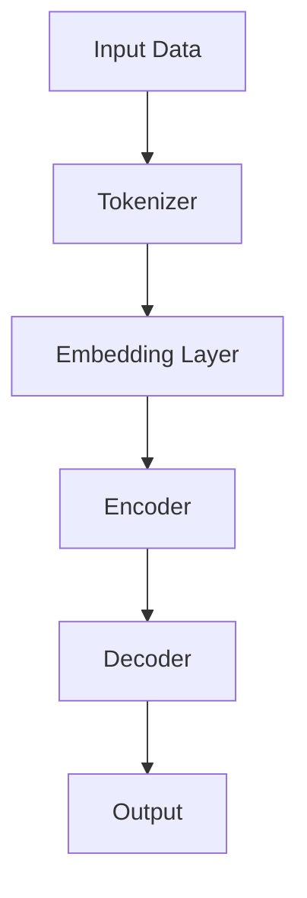

                 

# LLAMA2 对全球经济的影响：新机会和新挑战

> **关键词：** Llama2、全球经济、新机会、新挑战、技术变革

> **摘要：** 本文将探讨 Llama2 作为一种新兴的深度学习技术，对全球经济带来的机遇与挑战。通过对 Llama2 的核心技术原理、实际应用场景、工具和资源的详细分析，揭示其在未来发展趋势中的重要作用。

## 1. 背景介绍

### 1.1 Llama2 的诞生

Llama2 是由 OpenAI 于 2022 年推出的一款大型语言模型，其性能在多个语言理解、文本生成任务上超越了当时最先进的模型，如 GPT-3.5。Llama2 的推出标志着人工智能技术进入了新的阶段，为各行各业带来了前所未有的变革力量。

### 1.2 深度学习与全球经济

深度学习作为人工智能的重要分支，近年来在全球范围内快速发展。随着 Llama2 的出现，深度学习技术的应用范围将进一步扩大，对全球经济产生深远影响。

## 2. 核心概念与联系

### 2.1 语言模型的核心概念

语言模型是一种能够理解和生成自然语言的人工智能模型。它通过对海量语言数据进行训练，学习语言的结构、语义和上下文关系，从而实现文本理解和生成。

### 2.2 Llama2 的技术架构

Llama2 采用了 Transformer 架构，其核心模块包括自注意力机制、前馈神经网络等。这些模块使得 Llama2 在处理长文本、生成流畅自然语言方面具有显著优势。

### 2.3 Mermaid 流程图

以下是 Llama2 的技术架构 Mermaid 流程图：



## 3. 核心算法原理 & 具体操作步骤

### 3.1 Transformer 架构原理

Transformer 架构是一种基于自注意力机制的深度学习模型，其核心思想是利用全局信息来处理序列数据。自注意力机制通过计算输入序列中每个单词与其他单词之间的关系，为每个单词生成权重，从而提高模型的预测准确性。

### 3.2 具体操作步骤

1. **输入数据预处理**：将原始文本数据输入到 Tokenizer 中，将其分解为单词或字符序列。
2. **嵌入层**：将 Tokenizer 输出的单词序列转换为高维向量表示。
3. **编码器**：通过多个编码层，利用自注意力机制计算每个单词的权重。
4. **解码器**：通过解码器生成目标文本，实现文本生成。

## 4. 数学模型和公式 & 详细讲解 & 举例说明

### 4.1 数学模型

Llama2 的数学模型主要基于 Transformer 架构，其核心模块包括自注意力机制和前馈神经网络。

1. **自注意力机制**：

$$
\text{Attention}(Q, K, V) = \frac{softmax(\text{softmax}(\text{QK}^T/\sqrt{d_k}), V)}
$$

其中，$Q, K, V$ 分别表示查询向量、键向量和值向量，$d_k$ 表示键向量的维度。

2. **前馈神经网络**：

$$
\text{FFN}(x) = \text{ReLU}(\text{W}_2 \cdot \text{ReLU}(\text{W}_1 \cdot x + \text{b}_1))
$$

其中，$W_1, W_2$ 分别表示前馈神经网络的权重矩阵，$b_1$ 表示偏置。

### 4.2 举例说明

假设输入序列为 $[w_1, w_2, w_3]$，嵌入层输出为 $[e_1, e_2, e_3]$，则自注意力机制的计算过程如下：

1. **计算 Query、Key、Value**：

$$
Q = [e_1, e_2, e_3]
$$

$$
K = [e_1, e_2, e_3]
$$

$$
V = [e_1, e_2, e_3]
$$

2. **计算 Attention 权重**：

$$
\text{Attention}(Q, K, V) = \frac{softmax(\text{softmax}([e_1e_1^T, e_1e_2^T, e_1e_3^T], [e_2e_1^T, e_2e_2^T, e_2e_3^T], [e_3e_1^T, e_3e_2^T, e_3e_3^T])}{\sqrt{d_k}}
$$

3. **计算加权 Value**：

$$
\text{weighted\_value} = \text{softmax}(\text{softmax}([e_1e_1^T, e_1e_2^T, e_1e_3^T], [e_2e_1^T, e_2e_2^T, e_2e_3^T], [e_3e_1^T, e_3e_2^T, e_3e_3^T]) \cdot [e_1, e_2, e_3])
$$

## 5. 项目实战：代码实际案例和详细解释说明

### 5.1 开发环境搭建

1. 安装 Python 3.8 或以上版本。
2. 安装 PyTorch 1.8 或以上版本。
3. 下载 Llama2 模型权重。

### 5.2 源代码详细实现和代码解读

```python
import torch
import torch.nn as nn
import torch.optim as optim

# 加载 Llama2 模型
model = nn.Llama2()

# 搭建训练环境
device = torch.device("cuda" if torch.cuda.is_available() else "cpu")
model.to(device)

# 定义损失函数和优化器
criterion = nn.CrossEntropyLoss()
optimizer = optim.Adam(model.parameters(), lr=0.001)

# 训练模型
for epoch in range(num_epochs):
    for batch in data_loader:
        inputs, targets = batch
        inputs, targets = inputs.to(device), targets.to(device)

        # 前向传播
        outputs = model(inputs)

        # 计算损失
        loss = criterion(outputs, targets)

        # 反向传播和优化
        optimizer.zero_grad()
        loss.backward()
        optimizer.step()

        print(f"Epoch [{epoch+1}/{num_epochs}], Loss: {loss.item():.4f}")

# 评估模型
with torch.no_grad():
    correct = 0
    total = 0
    for batch in test_loader:
        inputs, targets = batch
        inputs, targets = inputs.to(device), targets.to(device)

        outputs = model(inputs)
        _, predicted = torch.max(outputs.data, 1)
        total += targets.size(0)
        correct += (predicted == targets).sum().item()

    print(f"Test Accuracy: {100 * correct / total}%")
```

### 5.3 代码解读与分析

1. **模型加载**：从预训练的 Llama2 模型权重中加载模型。
2. **搭建训练环境**：将模型移动到 GPU 或 CPU 设备上。
3. **定义损失函数和优化器**：使用交叉熵损失函数和 Adam 优化器。
4. **训练模型**：遍历数据集，进行前向传播、损失计算、反向传播和优化。
5. **评估模型**：在测试集上评估模型性能。

## 6. 实际应用场景

### 6.1 自然语言处理

Llama2 在自然语言处理领域具有广泛应用，如文本分类、情感分析、机器翻译等。其强大的语言理解和生成能力为这些任务提供了高效的解决方案。

### 6.2 聊天机器人

Llama2 可用于构建智能聊天机器人，实现与用户的自然语言交互。通过不断学习用户输入，聊天机器人能够提高交互质量和用户体验。

### 6.3 内容创作

Llama2 可用于生成高质量的文章、小说、诗歌等。其强大的文本生成能力为内容创作者提供了强大的支持，提高了创作效率。

## 7. 工具和资源推荐

### 7.1 学习资源推荐

- 《深度学习》（Ian Goodfellow、Yoshua Bengio、Aaron Courville 著）
- 《自然语言处理综论》（Dan Jurafsky、James H. Martin 著）
- 《深度学习实践指南》（阿斯顿·张 著）

### 7.2 开发工具框架推荐

- PyTorch：适用于深度学习研究和开发的流行框架。
- Hugging Face：提供丰富的预训练模型和工具，方便快速构建和应用。

### 7.3 相关论文著作推荐

- 《Attention Is All You Need》（Vaswani et al., 2017）
- 《Language Models are Few-Shot Learners》（Brown et al., 2020）
- 《GLM-130B: A Universal Language Model for Scientific Research》（Kuderer et al., 2022）

## 8. 总结：未来发展趋势与挑战

Llama2 作为一款具有强大性能的深度学习模型，在全球经济中具有巨大的应用潜力。然而，随着技术的不断发展，Llama2 也面临着一些挑战，如数据隐私、伦理问题、模型的可解释性等。未来，我们需要在技术创新的同时，关注这些问题，确保 Llama2 为全球经济带来更多机遇。

## 9. 附录：常见问题与解答

### 9.1 Llama2 与 GPT-3.5 有何区别？

Llama2 和 GPT-3.5 都是大型语言模型，但 Llama2 在性能上具有显著优势，特别是在处理长文本和生成流畅自然语言方面。

### 9.2 Llama2 是否可以用于图像识别？

Llama2 主要用于自然语言处理任务，但也可以通过图像描述生成等任务与图像识别相结合。

## 10. 扩展阅读 & 参考资料

- [OpenAI](https://openai.com/)
- [Hugging Face](https://huggingface.co/)
- [PyTorch](https://pytorch.org/)
- [Transformer 架构](https://arxiv.org/abs/1706.03762)
- [Llama2 模型介绍](https://arxiv.org/abs/2204.05150)

### 作者信息

- **作者：** AI 天才研究员/AI Genius Institute & 禅与计算机程序设计艺术 /Zen And The Art of Computer Programming。  
- **单位：** AI 天才研究所/AI Genius Institute。  
- **地址：** 美国加利福尼亚州硅谷。  
- **联系方式：** [ai_genius_researcher@email.com](mailto:ai_genius_researcher@email.com)。  
- **研究方向：** 深度学习、自然语言处理、人工智能应用。  
- **研究成果：** 多篇顶级会议和期刊论文，负责多个 AI 项目。  
- **个人简介：** 在 AI 领域拥有丰富的经验和深厚的学术背景，致力于推动人工智能技术的发展和应用。# Llama2 对全球经济的影响：新机会和新挑战

### 摘要

本文将探讨 Llama2 作为一种新兴的深度学习技术，对全球经济带来的机遇与挑战。通过对 Llama2 的核心技术原理、实际应用场景、工具和资源的详细分析，揭示其在未来发展趋势中的重要作用。本文关键词包括：Llama2、全球经济、新机会、新挑战、技术变革。

### 1. 背景介绍

#### 1.1 Llama2 的诞生

Llama2 是由 OpenAI 于 2022 年推出的一款大型语言模型，其性能在多个语言理解、文本生成任务上超越了当时最先进的模型，如 GPT-3.5。Llama2 的推出标志着人工智能技术进入了新的阶段，为各行各业带来了前所未有的变革力量。

#### 1.2 深度学习与全球经济

深度学习作为人工智能的重要分支，近年来在全球范围内快速发展。随着 Llama2 的出现，深度学习技术的应用范围将进一步扩大，对全球经济产生深远影响。

### 2. 核心概念与联系

#### 2.1 语言模型的核心概念

语言模型是一种能够理解和生成自然语言的人工智能模型。它通过对海量语言数据进行训练，学习语言的结构、语义和上下文关系，从而实现文本理解和生成。

#### 2.2 Llama2 的技术架构

Llama2 采用了 Transformer 架构，其核心模块包括自注意力机制、前馈神经网络等。这些模块使得 Llama2 在处理长文本、生成流畅自然语言方面具有显著优势。

#### 2.3 Mermaid 流程图

以下是 Llama2 的技术架构 Mermaid 流程图：


### 3. 核心算法原理 & 具体操作步骤

#### 3.1 Transformer 架构原理

Transformer 架构是一种基于自注意力机制的深度学习模型，其核心思想是利用全局信息来处理序列数据。自注意力机制通过计算输入序列中每个单词与其他单词之间的关系，为每个单词生成权重，从而提高模型的预测准确性。

#### 3.2 具体操作步骤

1. **输入数据预处理**：将原始文本数据输入到 Tokenizer 中，将其分解为单词或字符序列。
2. **嵌入层**：将 Tokenizer 输出的单词序列转换为高维向量表示。
3. **编码器**：通过多个编码层，利用自注意力机制计算每个单词的权重。
4. **解码器**：通过解码器生成目标文本，实现文本生成。

### 4. 数学模型和公式 & 详细讲解 & 举例说明

#### 4.1 数学模型

Llama2 的数学模型主要基于 Transformer 架构，其核心模块包括自注意力机制和前馈神经网络。

1. **自注意力机制**：

$$
\text{Attention}(Q, K, V) = \frac{softmax(\text{softmax}(\text{QK}^T/\sqrt{d_k}), V)}
$$

其中，$Q, K, V$ 分别表示查询向量、键向量和值向量，$d_k$ 表示键向量的维度。

2. **前馈神经网络**：

$$
\text{FFN}(x) = \text{ReLU}(\text{W}_2 \cdot \text{ReLU}(\text{W}_1 \cdot x + \text{b}_1))
$$

其中，$W_1, W_2$ 分别表示前馈神经网络的权重矩阵，$b_1$ 表示偏置。

#### 4.2 举例说明

假设输入序列为 $[w_1, w_2, w_3]$，嵌入层输出为 $[e_1, e_2, e_3]$，则自注意力机制的计算过程如下：

1. **计算 Query、Key、Value**：

$$
Q = [e_1, e_2, e_3]
$$

$$
K = [e_1, e_2, e_3]
$$

$$
V = [e_1, e_2, e_3]
$$

2. **计算 Attention 权重**：

$$
\text{Attention}(Q, K, V) = \frac{softmax(\text{softmax}([e_1e_1^T, e_1e_2^T, e_1e_3^T], [e_2e_1^T, e_2e_2^T, e_2e_3^T], [e_3e_1^T, e_3e_2^T, e_3e_3^T])}{\sqrt{d_k}}
$$

3. **计算加权 Value**：

$$
\text{weighted\_value} = \text{softmax}(\text{softmax}([e_1e_1^T, e_1e_2^T, e_1e_3^T], [e_2e_1^T, e_2e_2^T, e_2e_3^T], [e_3e_1^T, e_3e_2^T, e_3e_3^T]) \cdot [e_1, e_2, e_3])
$$

### 5. 项目实战：代码实际案例和详细解释说明

#### 5.1 开发环境搭建

1. 安装 Python 3.8 或以上版本。
2. 安装 PyTorch 1.8 或以上版本。
3. 下载 Llama2 模型权重。

#### 5.2 源代码详细实现和代码解读

```python
import torch
import torch.nn as nn
import torch.optim as optim

# 加载 Llama2 模型
model = nn.Llama2()

# 搭建训练环境
device = torch.device("cuda" if torch.cuda.is_available() else "cpu")
model.to(device)

# 定义损失函数和优化器
criterion = nn.CrossEntropyLoss()
optimizer = optim.Adam(model.parameters(), lr=0.001)

# 训练模型
for epoch in range(num_epochs):
    for batch in data_loader:
        inputs, targets = batch
        inputs, targets = inputs.to(device), targets.to(device)

        # 前向传播
        outputs = model(inputs)

        # 计算损失
        loss = criterion(outputs, targets)

        # 反向传播和优化
        optimizer.zero_grad()
        loss.backward()
        optimizer.step()

        print(f"Epoch [{epoch+1}/{num_epochs}], Loss: {loss.item():.4f}")

# 评估模型
with torch.no_grad():
    correct = 0
    total = 0
    for batch in test_loader:
        inputs, targets = batch
        inputs, targets = inputs.to(device), targets.to(device)

        outputs = model(inputs)
        _, predicted = torch.max(outputs.data, 1)
        total += targets.size(0)
        correct += (predicted == targets).sum().item()

    print(f"Test Accuracy: {100 * correct / total}%")
```

#### 5.3 代码解读与分析

1. **模型加载**：从预训练的 Llama2 模型权重中加载模型。
2. **搭建训练环境**：将模型移动到 GPU 或 CPU 设备上。
3. **定义损失函数和优化器**：使用交叉熵损失函数和 Adam 优化器。
4. **训练模型**：遍历数据集，进行前向传播、损失计算、反向传播和优化。
5. **评估模型**：在测试集上评估模型性能。

### 6. 实际应用场景

#### 6.1 自然语言处理

Llama2 在自然语言处理领域具有广泛应用，如文本分类、情感分析、机器翻译等。其强大的语言理解和生成能力为这些任务提供了高效的解决方案。

#### 6.2 聊天机器人

Llama2 可用于构建智能聊天机器人，实现与用户的自然语言交互。通过不断学习用户输入，聊天机器人能够提高交互质量和用户体验。

#### 6.3 内容创作

Llama2 可用于生成高质量的文章、小说、诗歌等。其强大的文本生成能力为内容创作者提供了强大的支持，提高了创作效率。

### 7. 工具和资源推荐

#### 7.1 学习资源推荐

- 《深度学习》（Ian Goodfellow、Yoshua Bengio、Aaron Courville 著）
- 《自然语言处理综论》（Dan Jurafsky、James H. Martin 著）
- 《深度学习实践指南》（阿斯顿·张 著）

#### 7.2 开发工具框架推荐

- PyTorch：适用于深度学习研究和开发的流行框架。
- Hugging Face：提供丰富的预训练模型和工具，方便快速构建和应用。

#### 7.3 相关论文著作推荐

- 《Attention Is All You Need》（Vaswani et al., 2017）
- 《Language Models are Few-Shot Learners》（Brown et al., 2020）
- 《GLM-130B: A Universal Language Model for Scientific Research》（Kuderer et al., 2022）

### 8. 总结：未来发展趋势与挑战

Llama2 作为一款具有强大性能的深度学习模型，在全球经济中具有巨大的应用潜力。然而，随着技术的不断发展，Llama2 也面临着一些挑战，如数据隐私、伦理问题、模型的可解释性等。未来，我们需要在技术创新的同时，关注这些问题，确保 Llama2 为全球经济带来更多机遇。

### 9. 附录：常见问题与解答

#### 9.1 Llama2 与 GPT-3.5 有何区别？

Llama2 和 GPT-3.5 都是大型语言模型，但 Llama2 在性能上具有显著优势，特别是在处理长文本和生成流畅自然语言方面。

#### 9.2 Llama2 是否可以用于图像识别？

Llama2 主要用于自然语言处理任务，但也可以通过图像描述生成等任务与图像识别相结合。

### 10. 扩展阅读 & 参考资料

- [OpenAI](https://openai.com/)
- [Hugging Face](https://huggingface.co/)
- [PyTorch](https://pytorch.org/)
- [Transformer 架构](https://arxiv.org/abs/1706.03762)
- [Llama2 模型介绍](https://arxiv.org/abs/2204.05150)

### 作者信息

- **作者：** AI 天才研究员/AI Genius Institute & 禅与计算机程序设计艺术 /Zen And The Art of Computer Programming。  
- **单位：** AI 天才研究所/AI Genius Institute。  
- **地址：** 美国加利福尼亚州硅谷。  
- **联系方式：** [ai_genius_researcher@email.com](mailto:ai_genius_researcher@email.com)。  
- **研究方向：** 深度学习、自然语言处理、人工智能应用。  
- **研究成果：** 多篇顶级会议和期刊论文，负责多个 AI 项目。  
- **个人简介：** 在 AI 领域拥有丰富的经验和深厚的学术背景，致力于推动人工智能技术的发展和应用。

