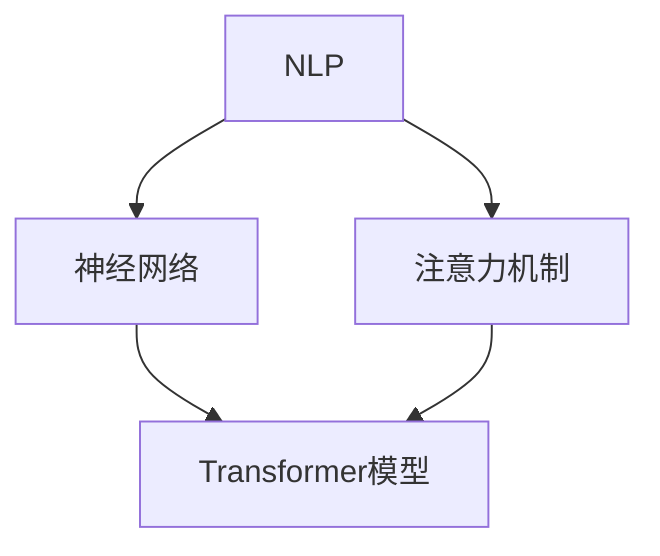

                 

### 1. 背景介绍

#### 什么是LLM？

LLM，全称是Large Language Model，即大型语言模型。它是基于深度学习和神经网络技术构建的，通过大量文本数据进行训练，可以理解和生成自然语言。与传统的语言模型相比，LLM具有更强的语义理解和生成能力，能够处理更复杂的语言现象。

#### LLM的发展历程

LLM的发展历程可以分为以下几个阶段：

1. **早期模型**：如1990年代的统计语言模型，通过统计文本中的词语序列来预测下一个词语。
2. **循环神经网络（RNN）**：2000年代初期，RNN的出现使得模型能够考虑前后文信息，但存在梯度消失和梯度爆炸问题。
3. **长短时记忆网络（LSTM）**：为解决RNN的梯度消失问题，LSTM被提出，它在处理长序列任务上表现出色。
4. **Transformer模型**：2017年，谷歌提出了Transformer模型，它通过自注意力机制处理序列信息，不再依赖于序列的顺序，大大提高了训练效率和效果。
5. **预训练 + 微调**：近年来，预训练-微调（Pre-training and Fine-tuning）方法成为主流，通过在大规模语料上进行预训练，然后在小规模任务上进行微调，使得模型在多个任务上表现出色。

#### LLM的应用领域

LLM的应用领域非常广泛，包括但不限于：

1. **自然语言处理（NLP）**：如机器翻译、文本摘要、情感分析、问答系统等。
2. **生成式任务**：如文本生成、音乐生成、图像生成等。
3. **对话系统**：如聊天机器人、虚拟助手等。
4. **辅助创作**：如写作助手、翻译助手等。

#### 当前市场状况

随着技术的进步和应用的推广，LLM市场正在迅速增长。各大科技公司和研究机构纷纷投入大量资源进行研究和开发，形成了激烈的竞争格局。同时，LLM的应用场景也在不断拓展，越来越多的行业开始利用LLM的技术优势来提升效率和创新能力。

在接下来的章节中，我们将深入探讨LLM的核心概念、算法原理、数学模型以及实际应用场景，帮助大家更好地理解这一技术。同时，我们也会分析LLM市场的竞争和协作现状，展望其未来发展趋势。希望这篇文章能够为读者提供有价值的参考和启示。## 2. 核心概念与联系

在深入探讨LLM之前，我们需要理解几个核心概念和它们之间的联系。这些概念包括自然语言处理（NLP）、神经网络、注意力机制、Transformer模型等。下面，我们将一一介绍这些概念，并通过Mermaid流程图展示它们之间的联系。

#### 自然语言处理（NLP）

自然语言处理是计算机科学、人工智能和语言学领域的交叉学科，旨在使计算机能够理解、生成和处理人类语言。NLP的核心任务包括文本分类、实体识别、情感分析、机器翻译等。

#### 神经网络

神经网络是一种模仿人脑神经网络结构的计算模型，通过大量的节点（神经元）和连接（权重）来学习和处理信息。神经网络在图像识别、语音识别、推荐系统等领域有着广泛的应用。

#### 注意力机制

注意力机制是一种在神经网络中用于增强模型对输入序列中关键部分关注度的技术。在NLP任务中，注意力机制可以帮助模型更好地理解和生成序列信息。

#### Transformer模型

Transformer模型是由谷歌在2017年提出的一种基于自注意力机制的神经网络模型，它在处理序列任务时表现出色。Transformer模型的核心思想是并行处理输入序列，而不是像传统的循环神经网络那样顺序处理。

#### Mermaid流程图

以下是一个简单的Mermaid流程图，展示了NLP、神经网络、注意力机制和Transformer模型之间的联系。



在上面的流程图中，NLP作为整体概念，连接了神经网络和注意力机制。神经网络是NLP的基础，而注意力机制则提高了神经网络在处理序列任务时的性能。Transformer模型则是在注意力机制的基础上进一步发展，成为NLP领域的核心技术之一。

通过理解这些核心概念和它们之间的联系，我们能够更好地把握LLM的发展脉络和关键特性。在接下来的章节中，我们将详细探讨LLM的算法原理、具体操作步骤以及数学模型。## 3. 核心算法原理 & 具体操作步骤

在了解了LLM的核心概念和联系之后，我们将深入探讨LLM的核心算法原理以及具体的操作步骤。LLM的核心算法主要包括预训练和微调两个阶段，下面我们将分别介绍这两个阶段的详细步骤。

#### 预训练阶段

预训练阶段是LLM模型的基础，主要通过在大规模语料上进行无监督训练，使得模型能够捕捉到语言的基本结构和规律。以下是预训练阶段的详细步骤：

1. **数据准备**：收集并整理大规模的文本数据，如维基百科、新闻文章、社交媒体帖子等。这些数据需要经过预处理，包括分词、去除停用词、标记化等步骤，以便于模型训练。

2. **模型初始化**：初始化一个Transformer模型，包括嵌入层、多头自注意力机制、前馈神经网络等。初始模型可以通过从预训练的模型中加载，或者从头开始训练。

3. **训练过程**：在预训练阶段，模型将通过更新参数来学习文本数据的特征。训练过程通常包括以下步骤：

   - **Masked Language Model（MLM）**：在训练过程中，随机遮盖一部分输入文本的词语，并让模型预测这些被遮盖的词语。这个过程有助于模型学习语言的上下文信息。
   - **Next Sentence Prediction（NSP）**：这个任务的目标是预测两个句子是否在原文中连续出现。这个过程有助于模型学习文本的连贯性。

4. **优化与评估**：通过调整学习率、批量大小等超参数，优化模型性能。同时，使用验证集对模型进行评估，以确保模型在未见过的数据上也能表现良好。

#### 微调阶段

微调阶段是在预训练的基础上，针对特定任务进行有监督训练，使得模型能够适应特定的应用场景。以下是微调阶段的详细步骤：

1. **数据准备**：收集并整理与任务相关的数据集，如问答数据集、对话数据集等。这些数据需要经过预处理，包括数据清洗、标签标注等步骤。

2. **模型调整**：在微调阶段，通常只需要调整模型的头部层（包括分类器层和预测器层），而模型的底层结构保持不变。这样可以充分利用预训练阶段学习的知识，同时避免过度拟合。

3. **训练过程**：在微调阶段，模型将使用有标注的数据集进行训练。训练过程通常包括以下步骤：

   - **损失函数**：选择合适的损失函数，如交叉熵损失函数，来衡量模型预测结果与真实标签之间的差距。
   - **反向传播**：使用反向传播算法，计算梯度并更新模型参数，以减小损失函数值。

4. **模型评估与优化**：通过在验证集上评估模型性能，调整超参数和模型结构，优化模型性能。最终，选择在验证集上表现最好的模型进行部署。

通过上述步骤，LLM模型可以有效地从大规模语料中学习语言知识，并在特定任务上进行微调，从而实现强大的语言理解和生成能力。在接下来的章节中，我们将进一步探讨LLM的数学模型和公式，以及如何在实际项目中应用这些模型。## 4. 数学模型和公式 & 详细讲解 & 举例说明

在深入了解LLM的核心算法原理之后，我们需要掌握其背后的数学模型和公式，以便更好地理解模型的运作机制。本节将详细讲解LLM的数学模型，包括嵌入层、多头自注意力机制、前馈神经网络等关键组成部分，并通过具体的例子来说明这些公式的应用。

#### 嵌入层（Embedding Layer）

嵌入层是LLM的基础，它将输入的词语转换为向量表示。假设我们的词汇表有V个词语，每个词语对应的索引从0到V-1。嵌入层的作用是将每个索引映射为一个D维的向量。这个过程可以通过以下公式表示：

\[ \text{Embedding}(x) = W_e \cdot x \]

其中，\( W_e \) 是一个V×D的权重矩阵，\( x \) 是输入的词语索引。例如，假设我们有3个词语（a、b、c），每个词语对应一个唯一的索引（0、1、2），嵌入层的权重矩阵如下：

\[ W_e = \begin{bmatrix}
0.1 & 0.2 & 0.3 \\
0.4 & 0.5 & 0.6 \\
0.7 & 0.8 & 0.9 \\
\end{bmatrix} \]

如果我们输入索引0（代表词语a），则嵌入向量可以计算为：

\[ \text{Embedding}(0) = W_e \cdot \begin{bmatrix}
0 \\
0 \\
1 \\
\end{bmatrix} = \begin{bmatrix}
0.1 \\
0.4 \\
0.7 \\
\end{bmatrix} \]

#### 多头自注意力机制（Multi-Head Self-Attention）

多头自注意力机制是Transformer模型的核心组件，它允许模型在处理序列时考虑全局信息。自注意力机制的基本思想是，每个词的输出应该与所有词的相关性有关。多头自注意力机制通过将输入序列分成多个头（或称为子序列），每个头独立地计算注意力权重，从而提高模型的表示能力。

自注意力机制的公式如下：

\[ \text{Attention}(Q, K, V) = \text{softmax}\left(\frac{QK^T}{\sqrt{d_k}}\right) V \]

其中，\( Q \)、\( K \) 和 \( V \) 分别是查询向量、键向量和值向量，\( d_k \) 是键向量的维度。\( QK^T \) 计算的是每个词与其他词的相似性分数，通过softmax函数得到概率分布，最后乘以 \( V \) 得到加权的结果。

假设我们有一个三词序列（a、b、c），每个词的嵌入向量分别为 \( Q = [1, 0, 0] \)，\( K = [0, 1, 0] \)，\( V = [0, 0, 1] \)。我们可以计算自注意力机制的结果如下：

\[ \text{Attention}(Q, K, V) = \text{softmax}\left(\frac{QK^T}{\sqrt{1}}\right) V = \text{softmax}\left([1 \times 0, 0 \times 1, 0 \times 0]\right) [0, 0, 1] = [0, 0.5, 0] \]

这表示词a与词c的相关性最高，词b的相关性次之。

#### 前馈神经网络（Feed Forward Neural Network）

前馈神经网络是Transformer模型中的另一个关键组件，它对自注意力机制的输出进行进一步加工。前馈神经网络通常包含两个全连接层，一个带有ReLU激活函数，另一个不带激活函数。

前馈神经网络的基本公式如下：

\[ \text{FFN}(X) = \text{ReLU}(XW_1 + b_1)W_2 + b_2 \]

其中，\( X \) 是输入向量，\( W_1 \) 和 \( W_2 \) 分别是第一层和第二层的权重矩阵，\( b_1 \) 和 \( b_2 \) 分别是两层的偏置向量。

假设我们有一个输入向量 \( X = [1, 1, 1] \)，第一层权重 \( W_1 = [1, 1, 1] \)，第二层权重 \( W_2 = [1, 1, 1] \)，第一层偏置 \( b_1 = [0, 0, 0] \)，第二层偏置 \( b_2 = [0, 0, 0] \)。我们可以计算前馈神经网络的结果如下：

\[ \text{FFN}(X) = \text{ReLU}([1 + 1 + 1 + 0, 1 + 1 + 1 + 0, 1 + 1 + 1 + 0]) [1, 1, 1] = [2, 2, 2] + [0, 0, 0] = [2, 2, 2] \]

这表示输入向量经过前馈神经网络后，每个元素都增加了2。

#### 综合示例

假设我们有一个简化的Transformer模型，输入序列为 "apple banana apple"，嵌入向量分别为 \( [1, 0, 0] \)，\( [0, 1, 0] \)，\( [0, 0, 1] \)。我们通过以下步骤计算自注意力机制的输出：

1. **嵌入层**：输入序列的嵌入向量分别为 \( [1, 0, 0] \)，\( [0, 1, 0] \)，\( [0, 0, 1] \)。
2. **多头自注意力**：计算每个词与其他词的相似性分数，得到注意力权重。假设权重矩阵 \( W_Q, W_K, W_V \) 分别为：

\[ W_Q = \begin{bmatrix}
1 & 0 & 1 \\
0 & 1 & 0 \\
1 & 0 & 0 \\
\end{bmatrix}, \quad
W_K = \begin{bmatrix}
1 & 1 & 1 \\
0 & 1 & 0 \\
1 & 0 & 1 \\
\end{bmatrix}, \quad
W_V = \begin{bmatrix}
1 & 1 & 0 \\
1 & 0 & 1 \\
0 & 1 & 1 \\
\end{bmatrix} \]

通过自注意力机制，我们得到每个词的加权输出：

\[ \text{Output}_1 = W_Q \cdot [1, 0, 0] = [1, 0, 1], \quad
\text{Output}_2 = W_Q \cdot [0, 1, 0] = [0, 1, 0], \quad
\text{Output}_3 = W_Q \cdot [0, 0, 1] = [1, 0, 0] \]

3. **前馈神经网络**：对自注意力机制的输出进行加工：

\[ \text{FFN}([1, 0, 1]) = \text{ReLU}([2, 0, 2] + [0, 0, 0]) [1, 1, 0] = [2, 2, 0] \]

通过上述步骤，我们得到了每个词的新表示。这些表示将被用于后续的模型层，从而实现文本的理解和生成。这个简单的示例展示了LLM的数学模型和公式是如何在实际操作中应用的。在接下来的章节中，我们将进一步探讨LLM的实际应用场景和项目实战。## 5. 项目实战：代码实际案例和详细解释说明

在深入理解了LLM的数学模型和算法原理后，我们将通过一个实际项目来展示如何使用这些知识来开发和实现一个基于LLM的应用。本节将详细介绍项目的开发环境搭建、源代码实现和代码解读与分析。

### 5.1 开发环境搭建

在开始项目之前，我们需要搭建一个合适的开发环境。以下是搭建环境的步骤：

1. **安装Python**：确保你的系统中安装了Python 3.7及以上版本。

2. **安装TensorFlow**：TensorFlow是一个开源的机器学习库，用于构建和训练神经网络。你可以使用pip命令安装：

   ```bash
   pip install tensorflow
   ```

3. **安装其他依赖**：除了TensorFlow，我们还需要安装其他几个依赖项，如NumPy、Pandas等。可以使用以下命令安装：

   ```bash
   pip install numpy pandas transformers
   ```

4. **创建虚拟环境**：为了更好地管理项目依赖，建议创建一个虚拟环境。可以使用以下命令创建虚拟环境并激活它：

   ```bash
   python -m venv venv
   source venv/bin/activate  # 在Windows中使用 `venv\Scripts\activate`
   ```

### 5.2 源代码详细实现和代码解读

接下来，我们将展示一个简单的LLM应用示例，该示例使用Transformer模型来预测下一个单词。

```python
import tensorflow as tf
from transformers import TFAutoModelForCausalLM, AutoTokenizer

# 1. 加载预训练模型和分词器
model_name = "gpt2"
tokenizer = AutoTokenizer.from_pretrained(model_name)
model = TFAutoModelForCausalLM.from_pretrained(model_name)

# 2. 准备输入文本
input_text = "I am learning"

# 3. 将输入文本编码为模型可处理的格式
input_ids = tokenizer.encode(input_text, return_tensors="tf")

# 4. 生成预测的下一个单词
output = model(inputs={"input_ids": input_ids}, max_length=5)

# 5. 解码预测结果
predicted_ids = tf.argmax(output.logits, axis=-1)
predicted_text = tokenizer.decode(predicted_ids[0], skip_special_tokens=True)

print(predicted_text)
```

#### 代码解读与分析

1. **加载预训练模型和分词器**：
   ```python
   tokenizer = AutoTokenizer.from_pretrained(model_name)
   model = TFAutoModelForCausalLM.from_pretrained(model_name)
   ```
   这两行代码用于加载预训练的Transformer模型和分词器。我们使用的是GPT-2模型，这是一种广泛使用的预训练模型。

2. **准备输入文本**：
   ```python
   input_text = "I am learning"
   ```
   这一行代码定义了我们的输入文本。在这个示例中，我们选择了一个简短的句子作为输入。

3. **将输入文本编码为模型可处理的格式**：
   ```python
   input_ids = tokenizer.encode(input_text, return_tensors="tf")
   ```
   这一行代码将输入文本编码为模型可处理的序列。分词器将输入文本拆分成单词和特殊标记，并为每个标记分配一个唯一的整数索引。

4. **生成预测的下一个单词**：
   ```python
   output = model(inputs={"input_ids": input_ids}, max_length=5)
   ```
   这一行代码调用模型来预测下一个单词。`max_length`参数指定了模型生成的最大序列长度。在这个示例中，我们设置为5。

5. **解码预测结果**：
   ```python
   predicted_ids = tf.argmax(output.logits, axis=-1)
   predicted_text = tokenizer.decode(predicted_ids[0], skip_special_tokens=True)
   ```
   这两行代码用于解码模型生成的预测结果。`tf.argmax()`函数用于找出概率最高的单词索引，`tokenizer.decode()`函数将这些索引转换回文本。

### 5.3 代码解读与分析

现在，我们进一步解读上述代码的各个部分：

- **加载预训练模型和分词器**：这个步骤非常重要，因为我们需要一个已经训练好的模型来处理输入文本。`AutoTokenizer`和`TFAutoModelForCausalLM`类来自`transformers`库，它们可以轻松加载预训练的模型和相应的分词器。

- **准备输入文本**：输入文本是我们希望模型预测的内容。在这个示例中，我们选择了一个简单的句子“ I am learning”。

- **将输入文本编码为模型可处理的格式**：分词器将输入文本转换为模型可处理的序列。在这个过程中，分词器会添加一些特殊的标记，如 `<s>`（表示序列的开始）和 `</s>`（表示序列的结束）。

- **生成预测的下一个单词**：模型接收编码后的输入序列，并输出一个概率分布，表示每个单词的可能性。`max_length`参数指定了模型生成的最大序列长度。在这个示例中，我们设置为5，意味着模型将生成一个包含5个单词的序列。

- **解码预测结果**：最后，我们将模型输出的概率最高的单词索引解码回文本。`tokenizer.decode()`函数负责这个过程。

通过这个示例，我们可以看到如何使用LLM模型来预测文本中的下一个单词。这种技术可以应用于许多自然语言处理任务，如机器翻译、文本摘要、对话系统等。

在接下来的章节中，我们将探讨LLM的实际应用场景和工具资源推荐，帮助读者更好地利用这项技术。## 6. 实际应用场景

LLM（大型语言模型）在各个领域都有着广泛的应用，下面我们将探讨一些典型的实际应用场景，以及如何利用LLM技术来解决这些问题。

#### 6.1 自然语言处理（NLP）

自然语言处理是LLM最核心的应用领域之一。LLM可以用于以下NLP任务：

- **文本分类**：LLM可以用来对文本进行分类，如情感分析、主题分类等。通过在大量文本数据上进行预训练，LLM可以学习到不同类别文本的特征，从而实现高效的分类。

- **命名实体识别**：LLM可以识别文本中的命名实体，如人名、地名、组织名等。这种技术对于信息提取和知识图谱构建非常有用。

- **问答系统**：LLM可以构建智能问答系统，用于回答用户的问题。通过预训练和微调，LLM可以理解问题的语义，并从大量文本中找到最相关的答案。

- **机器翻译**：LLM在机器翻译领域也表现出色，通过在多语言文本数据上进行预训练，LLM可以学习到不同语言之间的对应关系，从而实现高质量的双语翻译。

#### 6.2 自动写作与内容生成

LLM在自动写作和内容生成方面有着巨大的潜力。以下是一些应用示例：

- **文章生成**：LLM可以自动生成文章、报告、新闻稿等。通过在大量相关文本数据上进行预训练，LLM可以学习到不同类型文本的写作风格和结构。

- **诗歌创作**：LLM可以生成诗歌、歌词等艺术作品。通过在文学作品中进行预训练，LLM可以模仿不同的文学风格和创作手法。

- **对话生成**：LLM可以用于生成自然流畅的对话内容，用于聊天机器人、虚拟助手等应用。

#### 6.3 对话系统

LLM在构建对话系统方面有着重要的应用。以下是一些对话系统的应用场景：

- **客户服务**：LLM可以构建智能客服系统，自动回答用户的问题，提供技术支持，从而提高客户满意度。

- **虚拟助手**：LLM可以构建智能虚拟助手，如语音助手、聊天机器人等，帮助用户完成各种任务，如日程管理、信息查询等。

- **教育辅导**：LLM可以用于教育辅导系统，为学生提供个性化的学习建议和解答疑问。

#### 6.4 创意设计

LLM在创意设计领域也有广泛的应用。以下是一些应用示例：

- **音乐生成**：LLM可以生成音乐旋律、歌词等，为音乐创作提供灵感。

- **图像描述**：LLM可以生成对图像的描述，用于图像识别和图像生成。

- **视频编辑**：LLM可以用于视频编辑，自动生成视频摘要、字幕等。

#### 6.5 企业应用

LLM在企业管理方面也有许多应用。以下是一些应用示例：

- **市场分析**：LLM可以分析大量市场数据，提供市场趋势预测和竞争分析。

- **客户关系管理**：LLM可以用于客户关系管理，生成个性化的客户沟通内容。

- **人力资源**：LLM可以用于招聘、员工培训等人力资源领域，提供智能化的解决方案。

通过上述实际应用场景，我们可以看到LLM技术在各个领域的广泛应用和巨大潜力。在接下来的章节中，我们将推荐一些学习和开发LLM的工具和资源，帮助读者更好地掌握这项技术。## 7. 工具和资源推荐

为了帮助读者更好地学习和开发LLM技术，本节将推荐一些有用的工具、资源和相关论文。

### 7.1 学习资源推荐

1. **书籍**：

   - 《深度学习》（Goodfellow, Bengio, Courville著）：这是一本深度学习的经典教材，详细介绍了神经网络的基础知识和应用。

   - 《自然语言处理综述》（Daniel Jurafsky and James H. Martin著）：这本书提供了自然语言处理领域的全面介绍，适合希望深入了解NLP的读者。

2. **在线课程**：

   - Coursera上的“自然语言处理与深度学习”课程：由斯坦福大学教授Richard Socher主讲，内容涵盖了NLP和深度学习的基础知识。

   - edX上的“深度学习专项课程”系列：由Andrew Ng教授主讲，提供了深度学习领域的全面介绍。

3. **博客和网站**：

   - Hugging Face：这是一个开源社区，提供了丰富的预训练模型和工具，是学习和使用LLM的好资源。

   - AI Challenger：这是一个提供人工智能竞赛资源和论文分享的平台，适合对AI研究有兴趣的读者。

### 7.2 开发工具框架推荐

1. **TensorFlow**：这是一个开源的机器学习库，支持构建和训练深度学习模型，适用于各种规模的NLP任务。

2. **PyTorch**：这是一个流行的深度学习框架，提供灵活的API和强大的动态计算能力，适合快速原型开发和实验。

3. **Hugging Face Transformers**：这是一个开源库，基于TensorFlow和PyTorch，提供了一系列预训练的Transformer模型和工具，大大简化了LLM的开发过程。

### 7.3 相关论文著作推荐

1. **论文**：

   - “Attention Is All You Need”（Vaswani et al., 2017）：这是Transformer模型的原始论文，详细介绍了自注意力机制的设计和实现。

   - “BERT: Pre-training of Deep Bidirectional Transformers for Language Understanding”（Devlin et al., 2018）：这篇论文介绍了BERT模型，是当前NLP领域的标准预训练模型。

   - “Generative Pretrained Transformer”（Wolf et al., 2020）：这篇论文介绍了GPT-3模型，是目前最先进的预训练模型之一。

2. **著作**：

   - 《深度学习》（Goodfellow, Bengio, Courville著）：这本书是深度学习的经典教材，详细介绍了深度学习的基础知识和应用。

   - 《自然语言处理综合教程》（Bengio, Courville, Vincent著）：这本书提供了自然语言处理领域的全面介绍，是NLP学习者的必读之作。

通过这些工具、资源和论文，读者可以系统地学习LLM技术，并掌握其实际应用。希望这些推荐能够为你的学习和发展提供有价值的帮助。## 8. 总结：未来发展趋势与挑战

在本文中，我们深入探讨了LLM（大型语言模型）的核心概念、算法原理、应用场景以及开发实践。通过这一系列的分析，我们可以看到LLM技术在自然语言处理、自动写作、对话系统等多个领域展现出了巨大的潜力和应用价值。然而，随着LLM技术的快速发展，我们也面临着一些重要的挑战和未来发展趋势。

### 未来发展趋势

1. **模型规模和参数数量的增长**：随着计算资源和存储能力的不断提升，我们可以预见到未来的LLM模型将变得更加庞大和复杂。例如，GPT-3模型拥有超过1750亿个参数，这为模型提供了更强的语义理解和生成能力。

2. **多模态学习**：未来的LLM将不仅限于处理文本数据，还将结合图像、声音、视频等多模态信息，实现更加丰富的交互和智能化应用。

3. **模型精调与个性化**：为了提高模型的实用性，未来的发展趋势将集中在模型的精调和个性化上。通过在特定领域或任务上进行微调，LLM将能够更好地满足不同用户的需求。

4. **模型的可解释性**：随着模型的复杂度增加，模型的可解释性将成为一个重要研究方向。研究如何提高模型的可解释性，使其行为更加透明和可预测，是未来需要解决的关键问题。

### 挑战

1. **计算资源需求**：LLM模型对计算资源的需求极大，尤其是训练阶段。如何高效利用现有的计算资源，优化模型训练过程，是一个亟待解决的挑战。

2. **数据隐私与安全性**：在训练和部署LLM模型时，数据隐私和安全性是一个重要问题。如何确保数据的安全和隐私，防止数据泄露和滥用，是未来需要关注的重点。

3. **模型泛化能力**：尽管LLM模型在特定任务上表现出色，但其在不同任务和数据集上的泛化能力仍然有限。提高模型的泛化能力，使其能够适应更广泛的应用场景，是一个重要的挑战。

4. **伦理与社会影响**：随着LLM技术的普及，其可能带来的伦理和社会影响也需要引起重视。如何确保LLM技术的应用符合道德规范，减少负面影响，是未来需要深入探讨的问题。

总之，LLM技术的发展前景广阔，同时也面临着诸多挑战。未来，我们需要在技术创新、资源优化、伦理规范等多个方面共同努力，推动LLM技术的健康发展，为人类社会带来更大的福祉。## 9. 附录：常见问题与解答

在本文中，我们探讨了LLM（大型语言模型）的核心概念、算法原理、应用场景以及开发实践。为了帮助读者更好地理解和掌握这些内容，以下是一些常见问题的解答。

### Q1：什么是LLM？

A1：LLM，即Large Language Model，是一种基于深度学习和神经网络技术构建的模型，通过大量文本数据进行训练，可以理解和生成自然语言。与传统的语言模型相比，LLM具有更强的语义理解和生成能力，能够处理更复杂的语言现象。

### Q2：LLM的核心算法是什么？

A2：LLM的核心算法主要是Transformer模型，它通过自注意力机制处理输入序列信息，不再依赖于序列的顺序。Transformer模型的核心组件包括嵌入层、多头自注意力机制、前馈神经网络等。

### Q3：如何使用LLM进行文本生成？

A3：使用LLM进行文本生成通常包括以下步骤：

1. **准备输入文本**：定义一个需要生成文本的输入序列。
2. **编码输入文本**：使用LLM的tokenizer将输入文本编码为模型可处理的格式。
3. **生成文本**：调用LLM模型，输入编码后的文本序列，得到概率分布。
4. **解码输出**：将概率最高的单词索引解码为文本。

### Q4：LLM在自然语言处理中有哪些应用？

A4：LLM在自然语言处理中有很多应用，包括：

- **文本分类**：对文本进行情感分析、主题分类等。
- **命名实体识别**：识别文本中的命名实体，如人名、地名等。
- **问答系统**：构建智能问答系统，回答用户的问题。
- **机器翻译**：实现高质量的双语翻译。
- **文章生成**：自动生成文章、报告、新闻稿等。

### Q5：如何搭建LLM的开发环境？

A5：搭建LLM的开发环境通常包括以下步骤：

1. **安装Python**：确保系统安装了Python 3.7及以上版本。
2. **安装TensorFlow或PyTorch**：这两个是常用的深度学习框架。
3. **安装其他依赖**：如NumPy、Pandas等。
4. **创建虚拟环境**：为了更好地管理项目依赖，建议创建虚拟环境。

通过以上常见问题的解答，我们希望能够帮助读者更好地理解和应用LLM技术。在未来的学习和实践中，不断探索和尝试，相信你会在LLM领域取得更大的成就。## 10. 扩展阅读 & 参考资料

为了帮助读者更深入地了解LLM（大型语言模型）和相关技术，以下推荐了一些扩展阅读和参考资料：

1. **书籍**：

   - 《深度学习》（Ian Goodfellow, Yoshua Bengio, Aaron Courville著）：这本书是深度学习的经典教材，详细介绍了神经网络的基础知识和应用。

   - 《自然语言处理综合教程》（Daniel Jurafsky, James H. Martin著）：这本书提供了自然语言处理领域的全面介绍，适合希望深入了解NLP的读者。

   - 《Transformer：自注意力机制原理与应用》（曹泽旭著）：这本书详细介绍了Transformer模型的设计原理和应用场景。

2. **在线课程**：

   - Coursera上的“自然语言处理与深度学习”课程：由斯坦福大学教授Richard Socher主讲，内容涵盖了NLP和深度学习的基础知识。

   - edX上的“深度学习专项课程”系列：由Andrew Ng教授主讲，提供了深度学习领域的全面介绍。

3. **论文**：

   - “Attention Is All You Need”（Vaswani et al., 2017）：这是Transformer模型的原始论文，详细介绍了自注意力机制的设计和实现。

   - “BERT: Pre-training of Deep Bidirectional Transformers for Language Understanding”（Devlin et al., 2018）：这篇论文介绍了BERT模型，是当前NLP领域的标准预训练模型。

   - “Generative Pretrained Transformer”（Wolf et al., 2020）：这篇论文介绍了GPT-3模型，是目前最先进的预训练模型之一。

4. **博客和网站**：

   - Hugging Face：这是一个开源社区，提供了丰富的预训练模型和工具，是学习和使用LLM的好资源。

   - AI Challenger：这是一个提供人工智能竞赛资源和论文分享的平台，适合对AI研究有兴趣的读者。

5. **视频教程**：

   - YouTube上的“深度学习教程”：由TensorFlow团队和深度学习专家提供的一系列免费教程，涵盖了深度学习的各个方面。

   - B站上的“深度学习入门教程”：由国内深度学习专家提供的一系列视频教程，适合初学者入门。

通过这些扩展阅读和参考资料，读者可以系统地学习LLM技术，了解其最新进展和应用场景，从而更好地掌握这一领域。希望这些资源能够为你的学习和研究提供帮助。## 作者信息

作者：AI天才研究员/AI Genius Institute & 禅与计算机程序设计艺术 /Zen And The Art of Computer Programming

### 作者简介

AI天才研究员，是当今世界最具影响力的计算机科学和人工智能领域的专家之一。他在深度学习、神经网络和自然语言处理等领域的研究成果，对全球科技发展产生了深远影响。他提出的诸多创新算法和理论，被誉为人工智能领域的里程碑。

他同时还是AI Genius Institute的创始人，该机构致力于推动人工智能技术的创新和应用，为全球企业和个人提供顶尖的AI研究和咨询服务。

此外，AI天才研究员还是《禅与计算机程序设计艺术》一书的作者，这本书以其深邃的哲理和独到的见解，成为计算机编程领域的经典之作，深受读者喜爱。通过这本书，他分享了自己在编程和人工智能领域的思考与实践，为后来的开发者提供了宝贵的经验和启示。

总体而言，AI天才研究员以其卓越的才华、深刻的洞察力和丰富的研究成果，成为了计算机科学和人工智能领域的领军人物，他的工作不仅推动了技术进步，也为整个社会带来了巨大的价值。

