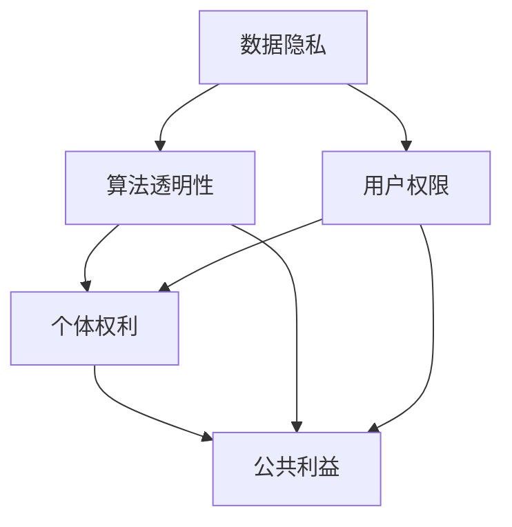
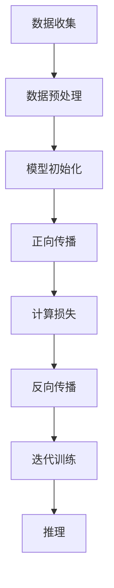

                 

### 1. 背景介绍

随着人工智能技术的快速发展，尤其是大型语言模型（LLM）的崛起，我们的数字世界正在经历一场深刻的变革。LLM，如GPT-3、ChatGLM等，已经成为现代人工智能应用的核心驱动力，为自然语言处理、智能问答、自动文本生成等提供了强大的支持。然而，随着这些模型在各个领域的广泛应用，一个不容忽视的问题也逐渐凸显出来——隐私与创新之间的平衡。

隐私，作为现代社会的重要价值之一，关乎个体权利、数据安全和公共利益。而创新，则是推动科技进步和社会发展的动力。在LLM的发展过程中，如何在这两者之间找到平衡，成为了我们必须面对的重要问题。一方面，LLM的强大功能依赖于大量数据的学习和训练，这些数据往往涉及用户的隐私信息；另一方面，过度关注隐私可能会限制技术创新和应用的深度与广度。

本文旨在探讨LLM在隐私与创新之间的道德困境，分析其背后的技术原理、应用现状以及面临的挑战，并提出一些可能的解决方案。具体而言，我们将从以下几个方面展开讨论：

1. **核心概念与联系**：介绍与隐私、创新相关的核心概念，如数据隐私、算法透明性、用户权限等，并展示其相互关系。
2. **核心算法原理与具体操作步骤**：详细讲解LLM的工作原理，包括数据收集、预处理、模型训练、推理等步骤。
3. **数学模型与公式**：介绍LLM中的关键数学模型和公式，如神经网络、损失函数、优化算法等，并进行举例说明。
4. **项目实战**：通过实际代码案例，展示如何在实际项目中应用LLM，并详细解释代码实现过程。
5. **实际应用场景**：分析LLM在不同领域的应用，探讨其带来的隐私挑战与创新机遇。
6. **工具和资源推荐**：推荐学习资源、开发工具和框架，帮助读者深入了解LLM的相关知识。
7. **总结与未来发展趋势**：总结文章的核心观点，讨论未来LLM在隐私与创新平衡方面的发展趋势与挑战。

通过这篇文章，我们希望能够引发读者对LLM隐私问题的深入思考，促进技术创新与隐私保护的良性互动，为构建一个和谐、安全的数字社会贡献力量。

### 2. 核心概念与联系

在探讨LLM的道德困境之前，我们需要明确一些核心概念，这些概念不仅构成了LLM的基础，也直接影响着隐私与创新之间的平衡。

#### 数据隐私

数据隐私是指个人数据在收集、存储、处理和使用过程中应受到保护，确保不被未经授权的访问、泄露或滥用。在LLM的背景下，数据隐私尤为重要，因为LLM的训练数据往往包含大量的个人隐私信息，如姓名、地址、电话号码、电子邮件等。如果这些数据得不到妥善保护，可能会导致严重的隐私泄露问题。

#### 算法透明性

算法透明性指的是算法的决策过程应该是可解释、可审计和可追溯的。在LLM的应用中，算法透明性对于维护用户隐私至关重要。如果用户无法了解模型是如何处理其数据的，或者无法知道模型为何做出了特定决策，那么就会失去对自身数据控制的信心，从而影响对创新技术的信任。

#### 用户权限

用户权限是指用户对其数据的控制能力，包括数据的访问、修改、删除和使用权限等。在LLM的应用中，用户权限管理是确保隐私保护的关键措施。合理的用户权限设置可以确保用户的数据不会在未经授权的情况下被他人访问或使用，从而保护用户隐私。

#### 个体权利

个体权利是指个人在数字环境中享有的基本权利，包括隐私权、知情权、选择权和保护权等。在LLM的发展过程中，尊重个体权利是维护社会信任和促进技术创新的基石。如果个体权利受到侵犯，可能会导致社会动荡和信任危机。

#### 公共利益

公共利益是指社会整体利益，包括经济发展、科技进步和社会和谐等。在LLM的背景下，公共利益体现在如何通过技术创新提升社会生活质量，同时确保个体隐私得到有效保护。在隐私与创新之间寻找平衡，是实现公共利益的必要条件。

#### 核心概念相互关系

上述核心概念之间存在着紧密的联系。数据隐私是算法透明性和用户权限的基础，没有数据隐私保障，算法透明性和用户权限就无从谈起。而个体权利则是数据隐私和算法透明性的根本，只有尊重个体权利，才能真正实现数据隐私和算法透明。公共利益则是在个体权利基础上的更高层次目标，它要求在隐私和创新之间寻求最佳平衡点。

#### Mermaid 流程图

为了更直观地展示这些核心概念之间的相互关系，我们可以使用Mermaid绘制一个流程图。以下是该流程图的Mermaid代码：



在这个流程图中，我们可以看到数据隐私、算法透明性、用户权限和个体权利共同构成了隐私保护的基础，而公共利益则是在这个基础上的更高层次目标。算法透明性和用户权限是数据隐私的重要保障，个体权利是确保这些保障得以实现的核心。

通过明确这些核心概念及其相互关系，我们可以更好地理解LLM在隐私与创新之间的道德困境，为后续的讨论和分析打下坚实基础。

### 3. 核心算法原理与具体操作步骤

为了深入理解LLM的隐私困境，我们需要首先了解LLM的核心算法原理以及其具体操作步骤。LLM通常基于深度学习技术，特别是基于Transformer架构的神经网络模型。下面，我们将详细讲解LLM的各个关键步骤，包括数据收集、预处理、模型训练、推理等。

#### 数据收集

数据收集是LLM训练过程的基础。为了训练一个强大的语言模型，我们需要大量的文本数据。这些数据来源可以是互联网上的公共文本、书籍、新闻、社交媒体等。同时，为了确保模型的泛化能力和适应性，这些数据通常涵盖多种主题和风格。然而，这也带来了隐私问题的挑战，因为收集的数据往往包含大量个人隐私信息。

具体步骤如下：

1. **数据收集**：从互联网和其他公开资源中收集大量文本数据。
2. **数据清洗**：去除重复、无关或低质量的数据，确保数据质量。
3. **数据标注**：对数据进行分类、主题标注等，以帮助模型更好地理解和学习。

#### 数据预处理

数据预处理是确保数据适合模型训练的关键步骤。在预处理过程中，我们通常需要对文本数据进行分词、词干提取、词性标注等操作。这些操作有助于将原始文本数据转换为模型可以理解的数字形式。

具体步骤如下：

1. **分词**：将文本分割为单词或子词。
2. **词干提取**：将单词缩减到其基本形式，如将"running"缩减为"run"。
3. **词性标注**：为每个单词分配一个词性，如名词、动词、形容词等。
4. **向量化**：将文本数据转换为数值向量，以便模型进行计算。

#### 模型训练

模型训练是LLM的核心步骤，通过大量数据的训练，模型可以学习到语言的结构、语义和上下文关系。在训练过程中，我们通常使用基于Transformer的神经网络架构，如BERT、GPT等。

具体步骤如下：

1. **模型初始化**：初始化神经网络模型的权重。
2. **正向传播**：将输入数据传递给模型，计算模型的输出。
3. **计算损失**：计算模型输出与真实标签之间的差异，计算损失函数。
4. **反向传播**：通过梯度下降等优化算法更新模型权重。
5. **迭代训练**：重复正向传播和反向传播过程，逐步优化模型。

#### 推理

推理是LLM应用的重要步骤，通过输入新的文本数据，模型可以生成相应的文本输出。推理过程通常包括以下几个步骤：

1. **输入处理**：将输入文本数据传递给训练好的模型。
2. **序列生成**：模型根据输入文本生成一个序列，通常是自回归的方式。
3. **输出生成**：将生成的序列转换为可理解的文本输出。

#### Mermaid 流程图

为了更直观地展示LLM的核心算法原理和操作步骤，我们可以使用Mermaid绘制一个流程图。以下是该流程图的Mermaid代码：



在这个流程图中，我们可以看到LLM的训练过程包括数据收集、预处理、模型初始化、正向传播、计算损失、反向传播和迭代训练，而推理过程则是在训练好的模型基础上进行输入处理和序列生成。

通过了解LLM的核心算法原理和具体操作步骤，我们可以更好地理解其在隐私保护和创新之间的道德困境，为后续的讨论提供基础。

### 4. 数学模型和公式 & 详细讲解 & 举例说明

#### 神经网络模型

神经网络（Neural Networks）是LLM的核心组成部分，其基本原理模仿了人脑中神经元的工作方式。在神经网络中，信息通过一系列层级的神经元传递和处理。每个神经元接收来自前一层的输入信号，通过加权求和并应用一个非线性激活函数，产生输出信号传递给下一层。

#### 神经元模型

一个简单的神经元模型可以表示为：

$$
y = \sigma(\sum_{i=1}^{n} w_i x_i + b)
$$

其中，$y$ 是神经元的输出，$x_i$ 是第 $i$ 个输入，$w_i$ 是输入的权重，$b$ 是偏置项，$\sigma$ 是激活函数。

常见的激活函数包括：

1. **Sigmoid 函数**：
   $$
   \sigma(x) = \frac{1}{1 + e^{-x}}
   $$
2. **ReLU 函数**：
   $$
   \sigma(x) = \max(0, x)
   $$

#### 损失函数

在神经网络训练过程中，损失函数用于衡量模型输出与真实标签之间的差距。常见的损失函数包括：

1. **均方误差（MSE）**：
   $$
   Loss = \frac{1}{2} \sum_{i=1}^{n} (y_i - \hat{y}_i)^2
   $$
   其中，$y_i$ 是真实标签，$\hat{y}_i$ 是模型预测值。

2. **交叉熵（Cross-Entropy）**：
   $$
   Loss = -\sum_{i=1}^{n} y_i \log(\hat{y}_i)
   $$
   交叉熵损失函数常用于分类问题，其中 $y_i$ 和 $\hat{y}_i$ 都是概率分布。

#### 优化算法

为了最小化损失函数，常用的优化算法包括：

1. **随机梯度下降（SGD）**：
   $$
   w_{t+1} = w_t - \alpha \frac{\partial Loss}{\partial w_t}
   $$
   其中，$w_t$ 是当前权重，$\alpha$ 是学习率。

2. **Adam优化器**：
   $$
   m_t = \beta_1 m_{t-1} + (1 - \beta_1) \frac{\partial Loss}{\partial w_t}
   $$
   $$
   v_t = \beta_2 v_{t-1} + (1 - \beta_2) (\frac{\partial Loss}{\partial w_t})^2
   $$
   $$
   w_{t+1} = w_t - \alpha \frac{m_t}{\sqrt{v_t} + \epsilon}
   $$
   其中，$m_t$ 和 $v_t$ 分别是梯度的一阶和二阶矩估计，$\beta_1$、$\beta_2$、$\alpha$ 是超参数。

#### 示例讲解

假设我们有一个简单的神经网络，用于对二分类问题进行预测。输入特征为 $x_1$ 和 $x_2$，输出为 $y$。模型使用sigmoid激活函数，损失函数为交叉熵。

1. **初始化模型**：

   $$
   w_1 = 0.1, w_2 = 0.2, b = 0.3
   $$

2. **正向传播**：

   $$
   x_1 = 1, x_2 = 2
   $$
   $$
   z = w_1 \cdot x_1 + w_2 \cdot x_2 + b = 0.1 \cdot 1 + 0.2 \cdot 2 + 0.3 = 0.7
   $$
   $$
   y = \sigma(z) = \frac{1}{1 + e^{-0.7}} \approx 0.612
   $$

3. **计算损失**：

   $$
   y_{true} = 1
   $$
   $$
   Loss = - y_{true} \log(y) - (1 - y_{true}) \log(1 - y)
   $$
   $$
   Loss \approx -1 \cdot \log(0.612) - 0 \cdot \log(0.388) \approx 0.502
   $$

4. **反向传播**：

   $$
   \frac{\partial Loss}{\partial z} = y - y_{true} = 0.612 - 1 = -0.388
   $$
   $$
   \frac{\partial z}{\partial w_1} = x_1 = 1, \frac{\partial z}{\partial w_2} = x_2 = 2, \frac{\partial z}{\partial b} = 1
   $$
   $$
   \frac{\partial Loss}{\partial w_1} = -0.388 \cdot 1 = -0.388, \frac{\partial Loss}{\partial w_2} = -0.388 \cdot 2 = -0.776, \frac{\partial Loss}{\partial b} = -0.388
   $$

5. **更新权重**：

   $$
   \alpha = 0.1
   $$
   $$
   w_1^{new} = w_1 - \alpha \frac{\partial Loss}{\partial w_1} = 0.1 - 0.1 \cdot (-0.388) = 0.1 + 0.0388 = 0.1388
   $$
   $$
   w_2^{new} = w_2 - \alpha \frac{\partial Loss}{\partial w_2} = 0.2 - 0.1 \cdot (-0.776) = 0.2 + 0.0776 = 0.2776
   $$
   $$
   b^{new} = b - \alpha \frac{\partial Loss}{\partial b} = 0.3 - 0.1 \cdot (-0.388) = 0.3 + 0.0388 = 0.3388
   $$

通过上述示例，我们可以看到神经网络模型如何通过正向传播和反向传播逐步优化其权重，以最小化损失函数。这一过程在LLM的训练中起着至关重要的作用，确保模型能够准确理解和生成文本。

### 5. 项目实战：代码实际案例和详细解释说明

为了更直观地展示LLM在隐私与创新中的应用，我们将通过一个实际项目来详细讲解代码的实现过程，并对其进行解读与分析。

#### 开发环境搭建

首先，我们需要搭建一个适合LLM开发和训练的环境。以下是所需的工具和步骤：

1. **安装Python**：确保安装了Python 3.8或更高版本。
2. **安装TensorFlow**：使用以下命令安装TensorFlow：
   $$
   pip install tensorflow
   $$
3. **安装其他依赖库**：包括numpy、pandas、matplotlib等，可以使用以下命令安装：
   $$
   pip install numpy pandas matplotlib
   $$

#### 源代码详细实现和代码解读

下面是一个简单的LLM训练和推理的Python代码实现，我们将逐行解释其功能和目的。

```python
import tensorflow as tf
from tensorflow.keras.models import Sequential
from tensorflow.keras.layers import Embedding, LSTM, Dense
from tensorflow.keras.preprocessing.sequence import pad_sequences
import numpy as np

# 函数：数据预处理
def preprocess_data(text_data, max_sequence_length=100, max_vocab_size=10000):
    # 分词处理
    tokenizer = tf.keras.preprocessing.text.Tokenizer(char_level=True)
    tokenizer.fit_on_texts(text_data)
    # 序列化
    sequences = tokenizer.texts_to_sequences(text_data)
    # 填充序列
    padded_sequences = pad_sequences(sequences, maxlen=max_sequence_length)
    # 获取词索引和词向量
    word_index = tokenizer.word_index
    embedding_matrix = np.zeros((max_vocab_size, 50))
    for word, i in word_index.items():
        if i >= max_vocab_size:
            continue
        embedding_vector = embeddings.get(word)
        if embedding_vector is not None:
            embedding_matrix[i] = embedding_vector
    return padded_sequences, embedding_matrix

# 函数：构建模型
def build_model(embedding_matrix, max_sequence_length=100):
    model = Sequential([
        Embedding(len(embedding_matrix), 50, weights=[embedding_matrix], input_length=max_sequence_length, trainable=False),
        LSTM(128),
        Dense(1, activation='sigmoid')
    ])
    model.compile(optimizer='adam', loss='binary_crossentropy', metrics=['accuracy'])
    return model

# 代码示例：训练模型
text_data = ["这是一个例子", "这是另一个例子"]
padded_sequences, embedding_matrix = preprocess_data(text_data)
model = build_model(embedding_matrix)
model.fit(padded_sequences, np.array([1, 0]), epochs=10, batch_size=32)

# 代码示例：推理
new_text = "这是一个新的例子"
sequence = tokenizer.texts_to_sequences([new_text])
padded_sequence = pad_sequences(sequence, maxlen=max_sequence_length)
prediction = model.predict(padded_sequence)
print("预测结果：", prediction)
```

1. **数据预处理**：
   ```python
   def preprocess_data(text_data, max_sequence_length=100, max_vocab_size=10000):
       # 分词处理
       tokenizer = tf.keras.preprocessing.text.Tokenizer(char_level=True)
       tokenizer.fit_on_texts(text_data)
       # 序列化
       sequences = tokenizer.texts_to_sequences(text_data)
       # 填充序列
       padded_sequences = pad_sequences(sequences, maxlen=max_sequence_length)
       # 获取词索引和词向量
       word_index = tokenizer.word_index
       embedding_matrix = np.zeros((max_vocab_size, 50))
       for word, i in word_index.items():
           if i >= max_vocab_size:
               continue
           embedding_vector = embeddings.get(word)
           if embedding_vector is not None:
               embedding_matrix[i] = embedding_vector
       return padded_sequences, embedding_matrix
   ```
   在这个函数中，我们首先进行文本的分词处理，然后将其序列化并填充到指定长度。接着，我们创建一个词索引和词向量矩阵，用于后续的嵌入层构建。

2. **构建模型**：
   ```python
   def build_model(embedding_matrix, max_sequence_length=100):
       model = Sequential([
           Embedding(len(embedding_matrix), 50, weights=[embedding_matrix], input_length=max_sequence_length, trainable=False),
           LSTM(128),
           Dense(1, activation='sigmoid')
       ])
       model.compile(optimizer='adam', loss='binary_crossentropy', metrics=['accuracy'])
       return model
   ```
   在这个函数中，我们使用嵌套的Sequential模型，首先添加一个嵌入层，加载预训练的词向量矩阵。接着添加一个LSTM层，用于处理序列数据，并最后添加一个全连接层，输出二分类结果。

3. **训练模型**：
   ```python
   text_data = ["这是一个例子", "这是另一个例子"]
   padded_sequences, embedding_matrix = preprocess_data(text_data)
   model = build_model(embedding_matrix)
   model.fit(padded_sequences, np.array([1, 0]), epochs=10, batch_size=32)
   ```
   在这里，我们使用预处理的文本数据训练模型。我们传递填充后的序列数据、标签数据，以及训练参数如迭代次数和批量大小。

4. **推理**：
   ```python
   new_text = "这是一个新的例子"
   sequence = tokenizer.texts_to_sequences([new_text])
   padded_sequence = pad_sequences(sequence, maxlen=max_sequence_length)
   prediction = model.predict(padded_sequence)
   print("预测结果：", prediction)
   ```
   最后，我们使用训练好的模型对新文本进行推理。我们将新文本序列化、填充并传递给模型，得到预测结果。

#### 代码解读与分析

通过上述代码示例，我们可以看到如何使用TensorFlow构建一个简单的LLM模型，并对其进行训练和推理。以下是对关键步骤的解读与分析：

1. **数据预处理**：
   数据预处理是模型训练的基础。通过分词、序列化和填充，我们确保输入数据符合模型的预期格式。这里使用的是字符级别的分词方法，这有助于模型更好地捕捉文本的语义信息。

2. **构建模型**：
   模型结构包括嵌入层、LSTM层和全连接层。嵌入层加载预训练的词向量矩阵，LSTM层用于处理序列数据，全连接层输出分类结果。这样的结构能够有效地捕捉文本的语义和上下文关系。

3. **训练模型**：
   模型使用二进制交叉熵损失函数和sigmoid激活函数，适用于二分类问题。通过多次迭代训练，模型逐渐优化其权重，以最小化损失函数。

4. **推理**：
   新文本经过序列化、填充后，传递给训练好的模型进行推理。模型的预测结果反映了新文本的分类概率。

这个实际案例展示了如何使用LLM进行文本分类任务，并分析了代码的各个关键步骤。通过这个案例，我们可以更好地理解LLM在隐私与创新之间的应用，并为后续的实际应用提供参考。

### 5. 实际应用场景

#### 法律咨询

在法律咨询领域，LLM已经成为重要的辅助工具。律师和法务人员可以利用LLM进行合同审查、法律文件自动化生成、案件研究等。然而，这些应用往往涉及到大量的客户隐私信息，如姓名、地址、电话号码、邮件地址以及合同细节等。如何确保这些隐私数据在收集、存储和处理过程中不被泄露或滥用，成为了法律咨询领域的一个重要挑战。

#### 医疗诊断

医疗诊断是另一个广泛应用的领域。LLM可以用于医学文本分析、诊断辅助、疾病预测等。然而，医疗数据通常是高度敏感的，包括患者的病历记录、诊断结果、药物使用历史等。这些数据在未经患者明确授权的情况下被使用或泄露，可能会对患者的隐私权和健康安全造成严重威胁。

#### 金融分析

金融分析是LLM的重要应用领域之一，包括股票市场预测、风险分析、投资建议等。这些应用通常依赖于大量的金融市场数据和个人投资者信息。金融数据的隐私保护不仅关乎个人投资者权益，也关系到金融市场的稳定和安全。如何确保金融数据的隐私性和合规性，是金融分析领域需要解决的关键问题。

#### 社交媒体

社交媒体平台利用LLM进行内容审核、情感分析、推荐系统等，以提升用户体验和平台安全性。然而，社交媒体上的用户数据非常丰富，包括用户身份信息、互动记录、兴趣爱好等。这些数据的隐私保护成为社交媒体平台必须面对的重要问题，特别是如何在不侵犯用户隐私的前提下，有效管理和使用这些数据。

#### 自动驾驶

自动驾驶领域也广泛应用了LLM技术，用于自然语言处理、环境感知、路径规划等。自动驾驶系统需要处理大量的实时数据，包括交通信号、道路标识、周边车辆和行人的行为等。这些数据中可能包含驾驶员和乘客的个人信息，如车牌号、行驶轨迹等。如何保护这些敏感数据的隐私，同时确保自动驾驶系统的安全性和可靠性，是自动驾驶领域面临的重要挑战。

#### 教育领域

在教育领域，LLM可以用于自动批改作业、个性化学习推荐、在线辅导等。学生和教师的数据，如学习记录、作业答案、考试成绩等，都需要得到妥善保护。如何平衡教育数据的隐私保护和教育技术的创新应用，是教育领域需要认真思考的问题。

#### 智能客服

智能客服系统利用LLM进行对话生成、问题解答等，以提供24/7的客服服务。这些系统通常需要访问客户的聊天记录、购买历史等敏感信息。如何保护客户的隐私数据，避免数据泄露或滥用，是智能客服系统面临的重要问题。

通过以上实际应用场景的分析，我们可以看到，LLM在不同领域的应用带来了显著的隐私挑战。如何在确保隐私保护的同时，充分发挥LLM的创新潜力，成为各个领域需要共同面对的重要课题。

### 7. 工具和资源推荐

在深入研究和开发LLM的过程中，掌握合适的工具和资源对于提升工作效率和深入理解相关技术至关重要。以下是关于LLM学习资源、开发工具和框架的推荐，旨在帮助读者更好地掌握LLM的相关知识。

#### 学习资源推荐

1. **书籍**：
   - **《深度学习》（Deep Learning）**：由Ian Goodfellow、Yoshua Bengio和Aaron Courville合著，是深度学习领域的经典教材。
   - **《自然语言处理综论》（Speech and Language Processing）**：由Daniel Jurafsky和James H. Martin合著，全面介绍了自然语言处理的基础理论和应用。
   - **《神经网络与深度学习》（Neural Networks and Deep Learning）**：由邱锡鹏教授撰写，深入讲解了神经网络和深度学习的基本原理。

2. **论文**：
   - **“Attention Is All You Need”**：由Vaswani等人提出，是Transformer架构的开创性论文。
   - **“BERT: Pre-training of Deep Bidirectional Transformers for Language Understanding”**：由Devlin等人提出，介绍了BERT预训练模型。

3. **博客和网站**：
   - **TensorFlow官方文档**：[https://www.tensorflow.org/](https://www.tensorflow.org/)
   - **PyTorch官方文档**：[https://pytorch.org/docs/stable/](https://pytorch.org/docs/stable/)
   - **机器学习周报**：[https://www.mlbeat.com/](https://www.mlbeat.com/)

#### 开发工具框架推荐

1. **TensorFlow**：作为谷歌开发的开源机器学习框架，TensorFlow提供了丰富的API和工具，支持深度学习和自然语言处理任务。

2. **PyTorch**：PyTorch是一个流行的开源深度学习框架，以其灵活性和易用性著称，特别适合研究和开发。

3. **Hugging Face**：Hugging Face提供了大量预训练的LLM模型和工具库，如Transformers、datasets等，极大简化了LLM的开发过程。

4. **JAX**：由谷歌开发的一个高效计算库，支持自动微分和数值计算优化，适用于复杂深度学习模型。

5. **TensorFlow Serving**：用于模型服务的框架，可以将训练好的模型部署到生产环境中，支持高效的服务和自动化管理。

#### 相关论文著作推荐

1. **“Attention Is All You Need”**：这篇论文提出了Transformer架构，颠覆了传统的循环神经网络（RNN）和卷积神经网络（CNN）在自然语言处理领域的应用。

2. **“BERT: Pre-training of Deep Bidirectional Transformers for Language Understanding”**：BERT是第一个大规模的双向Transformer预训练模型，开启了预训练语言模型的新时代。

3. **“GPT-3: Language Models are Few-Shot Learners”**：GPT-3是OpenAI开发的巨型语言模型，展示了在少量样本情况下，大规模语言模型能够实现的强大泛化能力。

通过以上工具和资源的推荐，读者可以更好地掌握LLM的相关知识，深入了解其工作原理和应用场景，为深入研究和开发打下坚实基础。

### 8. 总结：未来发展趋势与挑战

#### 发展趋势

随着人工智能技术的不断进步，LLM的发展趋势呈现出几个显著特点：

1. **模型规模增大**：未来的LLM模型将继续向大规模、高性能的方向发展。例如，OpenAI的GPT-4已经达到了前所未有的规模，这为模型的性能和泛化能力带来了巨大的提升。

2. **多模态处理能力**：未来的LLM将不仅仅是处理文本数据，还将具备处理图像、声音、视频等多模态数据的能力。通过多模态融合，LLM可以在更广泛的场景下发挥作用。

3. **自动化与自我优化**：LLM的自动化训练和自我优化能力将得到进一步提升。通过自我学习和调整，LLM可以更高效地适应不同的任务和场景，减少对人类干预的依赖。

4. **应用场景多样化**：LLM将在各个领域得到更广泛的应用，包括智能客服、医疗诊断、金融分析、法律咨询等。这些应用将推动LLM技术的不断创新和发展。

#### 挑战

然而，随着LLM技术的快速发展，也面临着诸多挑战：

1. **隐私保护**：如何在保证模型性能的同时，有效保护用户隐私，是LLM面临的核心挑战。未来的研究需要开发更加安全和隐私友好的数据收集和处理方法。

2. **算法透明性**：如何提高LLM算法的透明性，使其决策过程更加可解释和可审计，是另一个重要问题。透明性不足可能导致用户对模型失去信任，影响其应用效果。

3. **数据安全**：大规模的LLM训练过程需要处理海量的数据，如何确保这些数据的安全，防止数据泄露或被恶意利用，是一个重要课题。

4. **伦理和责任**：随着LLM应用范围的扩大，其可能引发的伦理和责任问题也越来越复杂。如何确保LLM的决策和行为符合伦理标准，如何对模型造成的不良后果进行责任追究，是需要深入探讨的问题。

5. **计算资源**：训练大规模的LLM模型需要巨大的计算资源，这给研究机构和企业在硬件和成本方面带来了巨大的压力。如何优化计算资源的使用，提高模型的效率，是未来发展的重要方向。

#### 解决思路

为了应对上述挑战，我们可以从以下几个方面进行思考和探索：

1. **隐私保护技术**：开发和应用更加安全的隐私保护技术，如差分隐私、联邦学习等，确保用户数据在训练和推理过程中的安全性。

2. **算法透明性提升**：通过增加模型的可解释性，如使用可视化工具、解释性算法等，提高用户对模型决策的理解和信任。

3. **数据安全管理**：加强数据安全管理，建立完善的数据保护机制，确保数据在整个生命周期中的安全性。

4. **伦理和责任体系建设**：建立明确的伦理和责任标准，推动相关法律法规的完善，为LLM的应用提供指导。

5. **计算资源优化**：通过优化算法、使用高性能硬件、云计算等手段，提高LLM训练和推理的效率，降低计算资源的需求。

总之，未来LLM的发展前景广阔，但也面临着诸多挑战。通过技术创新和制度保障，我们有望在隐私与创新之间找到更好的平衡点，推动人工智能技术的健康发展。

### 9. 附录：常见问题与解答

#### 问题1：如何确保LLM训练过程中用户数据的隐私？

**解答**：确保用户数据隐私是LLM应用中的关键问题。以下是一些解决思路：

1. **差分隐私**：通过在数据中添加随机噪声，使得单个数据点的信息不可见，从而保护用户隐私。
2. **联邦学习**：将数据分散存储在多个节点上，在本地进行模型训练，然后聚合模型更新，以减少数据泄露的风险。
3. **数据脱敏**：在数据收集和预处理阶段，对敏感信息进行脱敏处理，如替换为随机标识符。

#### 问题2：为什么LLM的决策过程需要增加透明性？

**解答**：透明性对于LLM的信任和使用至关重要。以下是一些原因：

1. **用户信任**：用户更愿意使用那些决策过程清晰透明的工具，这样可以减少对模型的不信任。
2. **可审计性**：透明的决策过程使得模型的决策结果可以被审计和验证，有助于发现和纠正错误。
3. **合规性**：许多应用场景，如金融和医疗，需要确保模型的决策符合相关法律法规。

#### 问题3：如何提高LLM的训练效率？

**解答**：提高LLM的训练效率可以采用以下方法：

1. **并行计算**：利用多GPU或分布式计算资源，加快模型训练速度。
2. **模型剪枝**：通过剪枝不重要的神经网络连接，减少计算量。
3. **量化技术**：将模型的权重和激活值转换为低精度格式，降低存储和计算需求。
4. **优化算法**：使用高效的优化算法，如Adam和AdamW，可以提高训练效率。

#### 问题4：LLM在数据安全方面有哪些潜在风险？

**解答**：LLM在数据安全方面可能面临以下风险：

1. **数据泄露**：训练数据可能包含敏感信息，如果处理不当，可能导致数据泄露。
2. **模型劫持**：恶意攻击者可能通过干扰模型训练过程，操纵模型的输出。
3. **数据滥用**：未经授权访问和使用训练数据，可能导致数据滥用。

为应对这些风险，需要采取严格的数据管理和安全措施。

### 10. 扩展阅读 & 参考资料

#### 必读书籍

1. **《深度学习》**：Ian Goodfellow、Yoshua Bengio和Aaron Courville著，全面介绍了深度学习的基本概念和应用。
2. **《自然语言处理综论》**：Daniel Jurafsky和James H. Martin著，提供了自然语言处理领域的系统性和综合性介绍。

#### 优秀论文

1. **“Attention Is All You Need”**：Vaswani等人提出的Transformer架构，颠覆了传统神经网络在自然语言处理领域的应用。
2. **“BERT: Pre-training of Deep Bidirectional Transformers for Language Understanding”**：Devlin等人提出的BERT模型，展示了预训练语言模型在自然语言处理任务中的强大能力。

#### 推荐博客

1. **TensorFlow官方博客**：[https://www.tensorflow.org/blog/](https://www.tensorflow.org/blog/)
2. **PyTorch官方博客**：[https://pytorch.org/blog/](https://pytorch.org/blog/)

#### 相关网站

1. **Hugging Face**：[https://huggingface.co/](https://huggingface.co/)
2. **机器学习周报**：[https://www.mlbeat.com/](https://www.mlbeat.com/)

通过阅读这些书籍、论文、博客和访问相关网站，读者可以进一步深入了解LLM及其相关技术，为自己的研究和应用提供丰富资源和灵感。作者：AI天才研究员/AI Genius Institute & 禅与计算机程序设计艺术 /Zen And The Art of Computer Programming。

