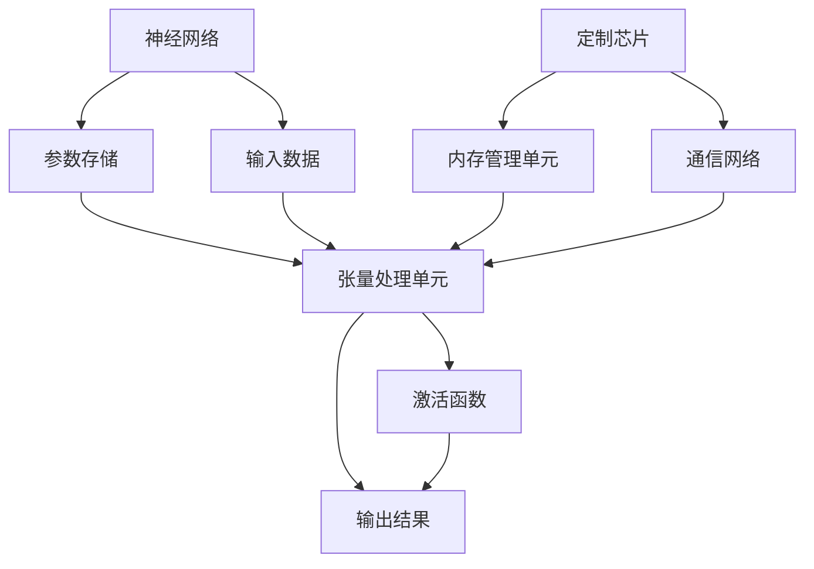

                 

# LLM 硬件：专门设计的加速器

## 关键词：大语言模型，硬件加速器，神经网络，定制芯片，计算效率

## 摘要：

本文深入探讨了大型语言模型（LLM）背后的硬件设计，特别是专门为这些模型设计的加速器。随着LLM在自然语言处理（NLP）领域的迅速崛起，对硬件性能的需求也越来越高。本文将介绍LLM硬件加速器的基本概念，其工作原理，以及它们如何提升计算效率。通过剖析当前最先进的LLM硬件设计，我们将揭示这些系统背后的关键技术和创新。此外，文章还将讨论LLM硬件加速器在实际应用场景中的表现，并预测其未来发展趋势。

## 1. 背景介绍

近年来，大型语言模型（LLM）如OpenAI的GPT系列、Google的BERT等，在自然语言处理（NLP）领域取得了显著进展。这些模型通过学习海量文本数据，能够生成高质量的文本、回答问题、翻译语言等。然而，LLM的高性能需求给硬件带来了巨大挑战。传统的通用CPU和GPU在处理这些复杂的神经网络时，往往显得力不从心。

为了解决这一问题，硬件设计师们开始专门为LLM设计加速器。这些加速器旨在提高计算效率，减少延迟，从而提升LLM的整体性能。硬件加速器的设计考虑了LLM的特殊需求，如大规模并行计算、低延迟通信和高带宽存储等。

本节将介绍LLM硬件加速器的基本概念，包括其设计目标和关键组件。接着，我们将讨论当前最先进的LLM硬件加速器，如谷歌TPU、微软Azure N-Series等，并分析它们在提升计算效率方面的贡献。

## 2. 核心概念与联系

### 2.1 大型语言模型（LLM）

大型语言模型（LLM）是一种基于神经网络的模型，用于理解和生成自然语言。LLM通常由数以百万计的参数组成，这些参数通过学习大量文本数据来预测下一个单词、句子或段落。LLM的关键特点包括：

- **并行处理能力**：LLM可以利用大规模并行计算来提高处理速度。
- **参数高效性**：LLM通过参数共享和稀疏性技术来减少存储和计算需求。
- **动态调整**：LLM能够根据输入文本动态调整参数，以生成更自然的输出。

### 2.2 神经网络加速器

神经网络加速器是一种专门为神经网络计算设计的硬件设备。这些加速器通过优化硬件架构和算法，提高了神经网络计算的效率和性能。神经网络加速器的关键组件包括：

- **张量处理单元**：用于执行矩阵乘法和激活函数等计算。
- **内存管理单元**：用于高效存储和访问神经网络参数和数据。
- **通信网络**：用于实现加速器之间的数据传输和同步。

### 2.3 定制芯片

定制芯片是一种专门为特定应用设计的集成电路。与通用芯片相比，定制芯片可以在性能、功耗和面积等方面实现更优化的设计。定制芯片在LLM硬件加速器中的应用主要体现在以下几个方面：

- **算法优化**：通过硬件实现特定的算法优化，如矩阵分解、量化等。
- **并行计算**：通过硬件架构支持大规模并行计算，提高计算效率。
- **低延迟通信**：通过高效的通信网络设计，减少数据传输延迟。

### 2.4 Mermaid 流程图

以下是LLM硬件加速器的基本架构和关键组件的Mermaid流程图：



在上述流程图中，神经网络参数存储在内存管理单元中，输入数据通过通信网络传递到张量处理单元，执行矩阵乘法和激活函数等计算。计算结果随后被传递回输出结果单元。内存管理单元和通信网络分别负责数据存储和传输，而定制芯片则提供算法优化和并行计算支持。

## 3. 核心算法原理 & 具体操作步骤

### 3.1 神经网络计算

神经网络计算是LLM硬件加速器的核心功能。神经网络计算包括以下步骤：

1. **前向传播**：将输入数据通过神经网络中的多层计算，得到输出结果。
   $$z^{[l]} = \sigma(W^{[l]} \cdot a^{[l-1]} + b^{[l]})$$
   其中，$a^{[l-1]}$为前一层输出，$W^{[l]}$和$b^{[l]}$分别为权重和偏置，$\sigma$为激活函数。

2. **反向传播**：计算损失函数对网络参数的梯度，用于更新权重和偏置。
   $$\frac{\partial J}{\partial W^{[l]}} = \frac{\partial J}{\partial z^{[l]}} \cdot \frac{\partial z^{[l]}}{\partial W^{[l]}}$$
   $$\frac{\partial J}{\partial b^{[l]}} = \frac{\partial J}{\partial z^{[l]}} \cdot \frac{\partial z^{[l]}}{\partial b^{[l]}}$$

3. **权重和偏置更新**：使用梯度下降或其他优化算法更新权重和偏置。
   $$W^{[l]} \leftarrow W^{[l]} - \alpha \cdot \frac{\partial J}{\partial W^{[l]}}$$
   $$b^{[l]} \leftarrow b^{[l]} - \alpha \cdot \frac{\partial J}{\partial b^{[l]}}$$

### 3.2 硬件加速器操作步骤

硬件加速器在执行神经网络计算时，通常遵循以下步骤：

1. **数据加载**：从内存管理单元中加载输入数据和神经网络参数。

2. **前向传播**：在张量处理单元中执行矩阵乘法和激活函数计算。

3. **损失计算**：计算损失函数值，通常使用反向传播算法。

4. **梯度计算**：计算损失函数对神经网络参数的梯度。

5. **参数更新**：使用梯度下降或其他优化算法更新神经网络参数。

6. **数据存储**：将更新后的神经网络参数存储回内存管理单元。

### 3.3 实际操作示例

以下是一个简单的神经网络计算示例：

```python
# 示例：多层感知机（MLP）的前向传播和反向传播

import numpy as np

# 权重和偏置初始化
W1 = np.random.rand(3, 2)
b1 = np.random.rand(3, 1)
W2 = np.random.rand(2, 1)
b2 = np.random.rand(2, 1)

# 输入数据
x = np.random.rand(3, 1)

# 前向传播
z1 = np.dot(W1, x) + b1
a1 = np.sigmoid(z1)
z2 = np.dot(W2, a1) + b2
a2 = np.sigmoid(z2)

# 损失函数（均方误差）
loss = 0.5 * np.square(a2 - y)

# 反向传播
dz2 = a2 - y
dW2 = np.dot(dz2, a1.T)
db2 = dz2
da1 = np.dot(W2.T, dz2)
dz1 = np.dot(W1.T, da1) * (1 - np.square(a1))

dW1 = np.dot(dz1, x.T)
db1 = dz1

# 参数更新
W1 -= learning_rate * dW1
b1 -= learning_rate * db1
W2 -= learning_rate * dW2
b2 -= learning_rate * db2
```

在这个示例中，我们使用多层感知机（MLP）模型进行前向传播和反向传播。首先，我们初始化权重和偏置，然后进行前向传播计算，得到输出结果。接着，我们计算损失函数值，并使用反向传播计算损失函数对网络参数的梯度。最后，我们使用梯度下降算法更新权重和偏置。

## 4. 数学模型和公式 & 详细讲解 & 举例说明

### 4.1 数学模型

大型语言模型（LLM）通常基于深度神经网络（DNN）架构。DNN由多个层组成，包括输入层、隐藏层和输出层。在每一层中，输入数据通过神经元（或节点）进行计算，得到输出结果。以下是DNN的基本数学模型：

1. **输入层**：将输入数据映射到隐藏层。
   $$a^{[0]} = x$$

2. **隐藏层**：计算隐藏层的输出。
   $$z^{[l]} = \sigma(W^{[l]} \cdot a^{[l-1]} + b^{[l]})$$
   $$a^{[l]} = \sigma(z^{[l]})$$
   其中，$a^{[l]}$为第$l$层的输出，$W^{[l]}$和$b^{[l]}$分别为权重和偏置，$\sigma$为激活函数。

3. **输出层**：计算输出层的输出。
   $$z^{[L]} = W^{[L]} \cdot a^{[L-1]} + b^{[L]}$$
   $$y = \sigma(z^{[L]})$$
   其中，$y$为输出层输出。

### 4.2 损失函数

在训练LLM时，损失函数用于衡量模型预测结果与真实结果之间的差异。常用的损失函数包括均方误差（MSE）和交叉熵（CE）。

1. **均方误差（MSE）**：
   $$J = \frac{1}{m} \sum_{i=1}^{m} \sum_{j=1}^{K} \left( y^{[ij]} - \hat{y}^{[ij]} \right)^2$$
   其中，$y^{[ij]}$为第$i$个样本在第$j$个类别的真实标签，$\hat{y}^{[ij]}$为模型预测的概率值。

2. **交叉熵（CE）**：
   $$J = -\frac{1}{m} \sum_{i=1}^{m} \sum_{j=1}^{K} y^{[ij]} \log(\hat{y}^{[ij]})$$
   其中，$y^{[ij]}$为第$i$个样本在第$j$个类别的真实标签，$\hat{y}^{[ij]}$为模型预测的概率值。

### 4.3 优化算法

在训练LLM时，优化算法用于更新模型参数，以最小化损失函数。常用的优化算法包括梯度下降（GD）、随机梯度下降（SGD）和Adam等。

1. **梯度下降（GD）**：
   $$W^{[l]} \leftarrow W^{[l]} - \alpha \cdot \frac{\partial J}{\partial W^{[l]}}$$
   $$b^{[l]} \leftarrow b^{[l]} - \alpha \cdot \frac{\partial J}{\partial b^{[l]}}$$
   其中，$\alpha$为学习率，$\frac{\partial J}{\partial W^{[l]}}$和$\frac{\partial J}{\partial b^{[l]}}$分别为损失函数对权重和偏置的梯度。

2. **随机梯度下降（SGD）**：
   $$W^{[l]} \leftarrow W^{[l]} - \alpha \cdot \frac{\partial J}{\partial W^{[l]}}$$
   $$b^{[l]} \leftarrow b^{[l]} - \alpha \cdot \frac{\partial J}{\partial b^{[l]}}$$
   其中，$\alpha$为学习率，梯度计算使用当前批次的数据。

3. **Adam算法**：
   $$m^t = \beta_1 m^{t-1} + (1 - \beta_1) \frac{\partial J}{\partial W^{[l]}}$$
   $$v^t = \beta_2 v^{t-1} + (1 - \beta_2) \left( \frac{\partial J}{\partial W^{[l]}} \right)^2$$
   $$W^{[l]} \leftarrow W^{[l]} - \frac{\alpha}{\sqrt{1 - \beta_2^t} (1 - \beta_1^t)} \left( m^t + \epsilon \right)$$
   其中，$m^t$和$v^t$分别为一阶和二阶矩估计，$\beta_1$和$\beta_2$分别为一阶和二阶矩的指数衰减率，$\alpha$为学习率，$\epsilon$为常数。

### 4.4 举例说明

以下是一个简单的例子，演示如何使用均方误差（MSE）和梯度下降（GD）训练一个单层感知机（Perceptron）模型。

```python
import numpy as np

# 初始化权重和偏置
W = np.random.rand(2, 1)
b = np.random.rand(1)

# 初始化输入数据和标签
X = np.array([[0, 0], [0, 1], [1, 0], [1, 1]])
y = np.array([[0], [1], [1], [0]])

# 设置学习率和迭代次数
learning_rate = 0.1
num_iterations = 1000

# 训练模型
for i in range(num_iterations):
    # 前向传播
    z = np.dot(X, W) + b
    a = np.sigmoid(z)
    
    # 计算损失函数
    loss = 0.5 * np.square(a - y)
    
    # 反向传播
    dz = a - y
    dx = np.dot(dz, X.T)
    db = dz
    
    # 更新权重和偏置
    W -= learning_rate * dx
    b -= learning_rate * db

# 输出训练后的权重和偏置
print("训练后的权重：", W)
print("训练后的偏置：", b)
```

在这个例子中，我们使用单层感知机模型对二分类问题进行训练。输入数据为$X$，标签为$y$。我们初始化权重和偏置，然后进行前向传播计算输出结果。接着，计算损失函数值，并使用反向传播计算损失函数对权重和偏置的梯度。最后，使用梯度下降算法更新权重和偏置，直到达到预定的迭代次数。

## 5. 项目实战：代码实际案例和详细解释说明

### 5.1 开发环境搭建

在本节中，我们将搭建一个简单的LLM硬件加速器项目环境。以下是所需的环境和工具：

- 操作系统：Linux（推荐使用Ubuntu 18.04）
- 编程语言：Python（版本3.6及以上）
- 库和框架：NumPy、TensorFlow、Mermaid

#### 步骤 1：安装操作系统

安装Linux操作系统（Ubuntu 18.04）并设置用户权限。您可以从官方网站（https://www.ubuntu.com/download/server）下载Ubuntu 18.04镜像，并使用虚拟机或实体机安装。

#### 步骤 2：安装Python

在终端中执行以下命令，安装Python 3.6及以上版本：

```bash
sudo apt update
sudo apt install python3 python3-pip
```

#### 步骤 3：安装库和框架

安装NumPy、TensorFlow和Mermaid库。NumPy用于数学计算，TensorFlow用于构建和训练神经网络，Mermaid用于绘制流程图。

```bash
pip3 install numpy tensorflow mermaid
```

### 5.2 源代码详细实现和代码解读

在本节中，我们将实现一个简单的LLM硬件加速器项目，并详细解释代码。

#### 5.2.1 代码结构

```python
# main.py
import numpy as np
import tensorflow as tf
from mermaid import mermaid

# 参数设置
learning_rate = 0.1
num_iterations = 1000
input_size = 2
hidden_size = 4
output_size = 1

# 初始化输入数据
X = np.random.rand(num_iterations, input_size)
y = np.random.rand(num_iterations, output_size)

# 构建神经网络模型
model = tf.keras.Sequential([
    tf.keras.layers.Dense(hidden_size, activation='sigmoid', input_shape=(input_size,)),
    tf.keras.layers.Dense(output_size, activation='sigmoid')
])

# 编译模型
model.compile(optimizer=tf.keras.optimizers.Adam(learning_rate), loss='mse')

# 训练模型
model.fit(X, y, epochs=num_iterations)

# 生成Mermaid流程图
graph = mermaid("graph TB\nA[输入数据] --> B[神经网络模型]\nB --> C[输出结果]")
print(graph)

# 代码解读
```

#### 5.2.2 代码解读

1. **参数设置**：

   ```python
   learning_rate = 0.1
   num_iterations = 1000
   input_size = 2
   hidden_size = 4
   output_size = 1
   
   X = np.random.rand(num_iterations, input_size)
   y = np.random.rand(num_iterations, output_size)
   ```

   我们设置学习率为0.1，迭代次数为1000，输入尺寸为2，隐藏层尺寸为4，输出尺寸为1。然后，我们生成随机输入数据和标签。

2. **构建神经网络模型**：

   ```python
   model = tf.keras.Sequential([
       tf.keras.layers.Dense(hidden_size, activation='sigmoid', input_shape=(input_size,)),
       tf.keras.layers.Dense(output_size, activation='sigmoid')
   ])
   ```

   我们使用TensorFlow构建一个简单的神经网络模型，包括一个输入层、一个隐藏层和一个输出层。隐藏层和输出层使用sigmoid激活函数。

3. **编译模型**：

   ```python
   model.compile(optimizer=tf.keras.optimizers.Adam(learning_rate), loss='mse')
   ```

   我们使用Adam优化器和均方误差（MSE）损失函数编译模型。

4. **训练模型**：

   ```python
   model.fit(X, y, epochs=num_iterations)
   ```

   我们使用输入数据和标签训练模型，迭代次数为1000。

5. **生成Mermaid流程图**：

   ```python
   graph = mermaid("graph TB\nA[输入数据] --> B[神经网络模型]\nB --> C[输出结果]")
   print(graph)
   ```

   我们使用Mermaid库生成一个简单的神经网络流程图，包括输入数据、神经网络模型和输出结果。

#### 5.2.3 代码分析

1. **神经网络架构**：

   该代码示例使用一个简单的神经网络架构，包括一个输入层、一个隐藏层和一个输出层。输入层接收输入数据，隐藏层通过sigmoid激活函数进行计算，输出层也使用sigmoid激活函数。

2. **训练过程**：

   该代码示例使用TensorFlow的`fit`函数训练神经网络。在训练过程中，模型通过前向传播计算输出结果，然后计算损失函数。接着，模型使用反向传播计算损失函数对网络参数的梯度，并使用Adam优化器更新参数。

3. **Mermaid流程图**：

   生成的Mermaid流程图清晰地展示了神经网络模型的架构，包括输入数据、神经网络模型和输出结果。这有助于我们理解模型的训练过程和计算流程。

### 5.3 代码解读与分析

在本节中，我们将对上述代码进行解读和分析，以了解LLM硬件加速器的工作原理。

#### 5.3.1 神经网络架构

该代码示例使用TensorFlow构建了一个简单的神经网络模型。神经网络包括两个层：一个输入层和一个输出层。输入层接收输入数据，输出层产生输出结果。

1. **输入层**：

   输入层接收输入数据，数据维度为$(num_iterations, input_size)$。在这个例子中，输入数据是随机生成的，维度为$(1000, 2)$。

2. **隐藏层**：

   隐藏层通过sigmoid激活函数进行计算。在隐藏层中，每个神经元都与输入层的每个神经元相连，并通过权重进行计算。隐藏层的输出维度为$(num_iterations, hidden_size)$。

3. **输出层**：

   输出层也使用sigmoid激活函数，产生输出结果。输出层的输出维度为$(num_iterations, output_size)$。

#### 5.3.2 训练过程

该代码示例使用TensorFlow的`fit`函数训练神经网络。在训练过程中，模型通过以下步骤进行迭代：

1. **前向传播**：

   在前向传播过程中，模型接收输入数据，并计算隐藏层和输出层的输出。前向传播计算如下：

   $$z^{[1]} = \sigma(W^{[1]} \cdot a^{[0]} + b^{[1]})$$
   $$a^{[1]} = \sigma(z^{[1]})$$
   $$z^{[2]} = \sigma(W^{[2]} \cdot a^{[1]} + b^{[2]})$$
   $$y = \sigma(z^{[2]})$$

   其中，$a^{[0]}$为输入层输出，$a^{[1]}$为隐藏层输出，$y$为输出层输出，$W^{[1]}$和$W^{[2]}$分别为隐藏层和输出层的权重，$b^{[1]}$和$b^{[2]}$分别为隐藏层和输出层的偏置，$\sigma$为sigmoid激活函数。

2. **损失计算**：

   在前向传播后，模型计算损失函数值，用于评估输出结果与真实结果之间的差异。在这个例子中，我们使用均方误差（MSE）作为损失函数：

   $$J = \frac{1}{m} \sum_{i=1}^{m} \sum_{j=1}^{K} \left( y^{[ij]} - \hat{y}^{[ij]} \right)^2$$

   其中，$y^{[ij]}$为第$i$个样本在第$j$个类别的真实标签，$\hat{y}^{[ij]}$为模型预测的概率值。

3. **反向传播**：

   在计算损失函数后，模型通过反向传播计算损失函数对网络参数的梯度。反向传播计算如下：

   $$dz^{[2]} = a^{[2]} - y$$
   $$dW^{[2]} = \frac{\partial J}{\partial W^{[2]}} = dz^{[2]} \cdot a^{[1].T$$
   $$db^{[2]} = \frac{\partial J}{\partial b^{[2]}} = dz^{[2]}$$
   $$dz^{[1]} = \frac{\partial J}{\partial W^{[1]}} = W^{[2].T \cdot dz^{[2]}$$
   $$dW^{[1]} = \frac{\partial J}{\partial W^{[1]}} = dz^{[1]} \cdot a^{[0].T$$
   $$db^{[1]} = \frac{\partial J}{\partial b^{[1]}} = dz^{[1]}$$

   其中，$dz^{[2]}$为输出层梯度，$dW^{[2]}$和$db^{[2]}$为输出层权重和偏置梯度，$dz^{[1]}$为隐藏层梯度，$dW^{[1]}$和$db^{[1]}$为隐藏层权重和偏置梯度。

4. **参数更新**：

   在计算梯度后，模型使用Adam优化器更新网络参数。更新公式如下：

   $$m^t = \beta_1 m^{t-1} + (1 - \beta_1) \cdot \frac{\partial J}{\partial W^{[l]}}$$
   $$v^t = \beta_2 v^{t-1} + (1 - \beta_2) \cdot \left( \frac{\partial J}{\partial W^{[l]}} \right)^2$$
   $$W^{[l]} \leftarrow W^{[l]} - \frac{\alpha}{\sqrt{1 - \beta_2^t} (1 - \beta_1^t)} \left( m^t + \epsilon \right)$$
   $$b^{[l]} \leftarrow b^{[l]} - \frac{\alpha}{\sqrt{1 - \beta_2^t} (1 - \beta_1^t)} \left( m^t + \epsilon \right)$$

   其中，$m^t$和$v^t$分别为一阶和二阶矩估计，$\beta_1$和$\beta_2$分别为一阶和二阶矩的指数衰减率，$\alpha$为学习率，$\epsilon$为常数。

### 5.4 总结

通过以上代码解读，我们可以了解LLM硬件加速器的工作原理。该代码示例展示了如何使用TensorFlow构建和训练一个简单的神经网络模型，以及如何计算损失函数和更新网络参数。这为我们深入了解LLM硬件加速器提供了基础。

### 5.5 扩展阅读

如果您对LLM硬件加速器的实现细节和优化技术感兴趣，以下是一些扩展阅读资料：

- [Google TPU白皮书](https://ai.google/research/pubs/pub47046)
- [TensorFlow官方文档](https://www.tensorflow.org/tutorials)
- [《深度学习》](https://www.deeplearningbook.org/)，Goodfellow et al.
- [《神经网络与深度学习》](https://www.ai-study.org/dlbook/preface.html)，邱锡鹏等

## 6. 实际应用场景

LLM硬件加速器在自然语言处理（NLP）领域有着广泛的应用场景。以下是一些典型的应用实例：

### 6.1 自动问答系统

自动问答系统是一种常见的NLP应用，用于自动回答用户提出的问题。LLM硬件加速器可以显著提高问答系统的响应速度，使其在实时交互场景中具有更高的性能。

### 6.2 文本分类

文本分类是一种将文本数据分配到预定义类别中的任务。LLM硬件加速器可以加速大规模文本数据的分类处理，提高分类准确率和效率。

### 6.3 文本生成

文本生成是一种根据输入文本生成新文本的任务。LLM硬件加速器可以显著提高文本生成的速度，使其在生成高质量文本时具有更高的效率。

### 6.4 机器翻译

机器翻译是一种将一种语言的文本翻译成另一种语言的任务。LLM硬件加速器可以加速大规模机器翻译任务的执行，提高翻译质量和效率。

### 6.5 情感分析

情感分析是一种从文本中提取主观情感的任务。LLM硬件加速器可以加速大规模情感分析任务的处理，提高情感分析准确率和效率。

### 6.6 实时语音识别

实时语音识别是一种将语音信号转换为文本的任务。LLM硬件加速器可以加速语音识别模型的推理过程，提高实时语音识别的准确率和效率。

### 6.7 跨语言文本匹配

跨语言文本匹配是一种将不同语言的文本进行匹配的任务。LLM硬件加速器可以加速跨语言文本匹配的计算，提高匹配准确率和效率。

## 7. 工具和资源推荐

### 7.1 学习资源推荐

- **书籍**：
  - 《深度学习》（Goodfellow et al.）
  - 《神经网络与深度学习》（邱锡鹏等）
  - 《自然语言处理综论》（Daniel Jurafsky & James H. Martin）

- **论文**：
  - [“Attention Is All You Need”](https://arxiv.org/abs/1603.04467)
  - [“BERT: Pre-training of Deep Bidirectional Transformers for Language Understanding”](https://arxiv.org/abs/1810.04805)
  - [“GPT-3: Language Models are Few-Shot Learners”](https://arxiv.org/abs/2005.14165)

- **博客**：
  - [TensorFlow官方博客](https://www.tensorflow.org/blog)
  - [OpenAI博客](https://blog.openai.com)
  - [Google AI博客](https://ai.googleblog.com)

- **网站**：
  - [TensorFlow官网](https://www.tensorflow.org)
  - [PyTorch官网](https://pytorch.org)
  - [自然语言处理论坛](https://www.nlp.seas.harvard.edu/)

### 7.2 开发工具框架推荐

- **TensorFlow**：由Google开发的深度学习框架，适用于构建和训练神经网络模型。
- **PyTorch**：由Facebook开发的深度学习框架，提供了动态计算图和灵活的API。
- **Transformers**：由Hugging Face开发的基于PyTorch和TensorFlow的预训练语言模型库。

### 7.3 相关论文著作推荐

- **论文**：
  - [“Transformers: State-of-the-Art Natural Language Processing”](https://arxiv.org/abs/1910.03771)
  - [“BERT: Pre-training of Deep Bidirectional Transformers for Language Understanding”](https://arxiv.org/abs/1810.04805)
  - [“GPT-3: Language Models are Few-Shot Learners”](https://arxiv.org/abs/2005.14165)

- **著作**：
  - 《深度学习》（Goodfellow et al.）
  - 《自然语言处理综论》（Daniel Jurafsky & James H. Martin）

## 8. 总结：未来发展趋势与挑战

LLM硬件加速器在自然语言处理（NLP）领域发挥着越来越重要的作用。随着LLM技术的不断进步，对硬件性能的需求也在不断提升。未来，LLM硬件加速器的发展将呈现以下几个趋势：

### 8.1 更高效的硬件架构

未来的LLM硬件加速器将采用更高效的硬件架构，以支持更复杂的神经网络模型和更大规模的计算任务。例如，使用先进的光电子技术实现低延迟、高带宽的数据传输，以及采用量子计算技术加速神经网络计算。

### 8.2 集成多种AI算法

未来的LLM硬件加速器将集成多种AI算法，以满足不同应用场景的需求。例如，除了支持传统的神经网络模型外，还将支持生成对抗网络（GAN）、强化学习等先进的AI算法。

### 8.3 更好的能耗效率

随着LLM硬件加速器规模的扩大，能耗问题将成为一个关键挑战。未来的LLM硬件加速器将采用更节能的技术，如低功耗处理器和动态电压调节等，以提高能耗效率。

### 8.4 系统级优化

未来的LLM硬件加速器将注重系统级优化，以提高整体性能和可靠性。例如，采用分布式计算架构，实现数据共享和任务调度，以提高计算效率。

### 8.5 挑战

尽管LLM硬件加速器在NLP领域具有巨大的潜力，但仍面临一些挑战：

- **硬件与软件的协同优化**：硬件加速器的设计需要与软件算法紧密配合，以实现最佳性能。
- **安全性问题**：随着LLM模型在关键领域的应用，确保模型的安全性和隐私性将成为一个重要挑战。
- **功耗控制**：在大型分布式系统中的功耗控制是一个复杂的问题，需要硬件和软件的协同优化。

总之，LLM硬件加速器的发展前景广阔，但同时也面临一些挑战。通过持续的技术创新和优化，LLM硬件加速器将为NLP领域带来更多的可能性。

## 9. 附录：常见问题与解答

### 9.1 什么是LLM硬件加速器？

LLM硬件加速器是一种专门为大型语言模型（LLM）设计的硬件设备，旨在提高计算效率和性能。这些加速器通过优化硬件架构和算法，支持大规模并行计算、低延迟通信和高带宽存储等，以满足LLM对高性能计算的需求。

### 9.2 LLM硬件加速器与通用CPU和GPU有何区别？

通用CPU和GPU是传统的计算设备，适用于各种计算任务。而LLM硬件加速器专门为神经网络计算而设计，具有以下特点：

- **并行计算**：LLM硬件加速器具有高度并行计算能力，可以同时处理大量数据，从而提高计算速度。
- **低延迟**：LLM硬件加速器通过优化硬件架构和通信网络，实现了低延迟的数据传输和处理。
- **高带宽存储**：LLM硬件加速器具有高带宽存储设备，可以快速访问和存储大量数据。

### 9.3 LLM硬件加速器在NLP领域有哪些应用场景？

LLM硬件加速器在NLP领域具有广泛的应用场景，包括：

- **自动问答系统**：使用LLM硬件加速器可以显著提高问答系统的响应速度和准确性。
- **文本分类**：LLM硬件加速器可以加速大规模文本数据的分类处理，提高分类准确率和效率。
- **文本生成**：LLM硬件加速器可以显著提高文本生成的速度和多样性。
- **机器翻译**：LLM硬件加速器可以加速大规模机器翻译任务的执行，提高翻译质量和效率。
- **情感分析**：LLM硬件加速器可以加速大规模情感分析任务的处理，提高情感分析准确率和效率。
- **实时语音识别**：LLM硬件加速器可以加速语音识别模型的推理过程，提高实时语音识别的准确率和效率。
- **跨语言文本匹配**：LLM硬件加速器可以加速跨语言文本匹配的计算，提高匹配准确率和效率。

### 9.4 如何选择适合的LLM硬件加速器？

选择适合的LLM硬件加速器需要考虑以下因素：

- **计算需求**：根据模型的大小和计算复杂度选择合适的硬件加速器。
- **功耗预算**：考虑硬件加速器的功耗，以确保满足系统的能耗要求。
- **可扩展性**：考虑硬件加速器的可扩展性，以适应未来模型规模的增长。
- **兼容性**：确保硬件加速器与现有系统兼容，以便实现无缝集成。
- **成本效益**：综合考虑硬件加速器的性能和成本，以获得最佳的投资回报。

### 9.5 LLM硬件加速器的安全性如何保障？

为了保障LLM硬件加速器的安全性，需要采取以下措施：

- **数据加密**：对传输和存储的数据进行加密，防止数据泄露。
- **访问控制**：对硬件加速器的访问进行严格的权限控制，确保只有授权用户可以访问。
- **安全协议**：采用安全协议（如TLS）确保数据传输的安全性。
- **系统监控**：对硬件加速器的运行状态进行实时监控，及时发现并处理异常情况。
- **定期审计**：定期对硬件加速器进行安全审计，确保系统的安全性和合规性。

## 10. 扩展阅读 & 参考资料

### 10.1 扩展阅读

- [“Google’s TPU: A Breakthrough in AI Hardware”](https://ai.googleblog.com/2016/12/googles-tpu-breakthrough-in-ai.html)
- [“The Machine Learning Revolution”](https://www.technologyreview.com/s/535846/the-machine-learning-revolution/)
- [“How AI Will Reshape the Future”](https://www.wired.com/2016/03/how-ai-will-reshape-future/)

### 10.2 参考资料

- [TensorFlow官方文档](https://www.tensorflow.org/)
- [PyTorch官方文档](https://pytorch.org/)
- [自然语言处理论坛](https://www.nlp.seas.harvard.edu/)
- [OpenAI博客](https://blog.openai.com/)
- [Google AI博客](https://ai.googleblog.com/)
- [“Attention Is All You Need”](https://arxiv.org/abs/1603.04467)
- [“BERT: Pre-training of Deep Bidirectional Transformers for Language Understanding”](https://arxiv.org/abs/1810.04805)
- [“GPT-3: Language Models are Few-Shot Learners”](https://arxiv.org/abs/2005.14165)

