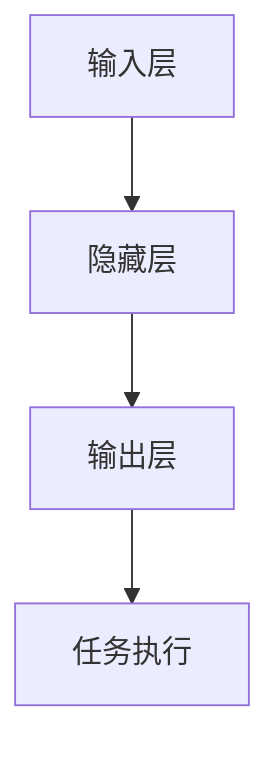

                 

# LLAMAS: 重新定义计算机架构

## 关键词：
- 大语言模型（LLM）
- 计算机架构
- 深度学习
- 图神经网络
- 自适应算法
- 机器推理
- 编程范式

## 摘要：
本文深入探讨了LLM（大语言模型）如何重新定义计算机架构。我们首先回顾了传统计算机架构的发展历程，然后介绍了LLM的基本概念和原理。接着，我们通过具体的算法原理和操作步骤，展示了如何利用LLM实现机器推理和编程范式的变革。随后，我们通过数学模型和公式，详细解释了LLM的工作机制。文章还通过实战案例，展示了LLM在实际开发中的应用。最后，我们讨论了LLM在未来发展趋势中的挑战和机遇，并推荐了相关学习资源和工具框架。

## 1. 背景介绍

计算机架构的发展经历了从冯·诺依曼架构到现代多核处理器架构的演变。传统的计算机架构依赖于冯·诺依曼模型，该模型假设计算过程是顺序执行的，数据和处理过程是分离的。然而，随着计算需求的增长，传统的计算机架构逐渐暴露出性能瓶颈和能效问题。

深度学习和人工智能的兴起，推动了计算机架构的进一步变革。图神经网络（GNN）和自适应算法的出现，为计算机架构提供了新的思路。LLM作为深度学习领域的重要成果，以其强大的模型规模和计算能力，正在重新定义计算机架构。

## 2. 核心概念与联系

### 大语言模型（LLM）

LLM是一种基于深度学习的大型语言模型，其核心是神经网络。LLM通过在大量文本数据上进行训练，学会了理解和生成自然语言。其基本结构包括输入层、隐藏层和输出层。输入层接收文本数据，隐藏层通过神经网络进行信息处理，输出层生成文本或执行特定任务。

### 计算机架构

计算机架构是指计算机硬件和软件的组成及其相互关系。传统的计算机架构以冯·诺依曼架构为代表，其特点是顺序执行指令、数据和处理过程分离。现代计算机架构则更多地依赖于并行计算和多核处理器，以提升计算性能和能效。

### 图神经网络（GNN）

GNN是一种基于图结构的神经网络，能够处理复杂的图数据。GNN通过节点和边的交互，捕捉图数据中的结构信息。在LLM中，GNN用于处理文本数据的语义关系，提升模型的语义理解能力。

### 自适应算法

自适应算法是一种能够根据环境变化自动调整自身行为的算法。在LLM中，自适应算法用于优化模型参数，提高模型的泛化能力和计算效率。

### Mermaid 流程图

以下是一个简化的LLM工作流程图：



## 3. 核心算法原理 & 具体操作步骤

### 神经网络基础

神经网络是一种由大量神经元组成的计算模型，通过学习输入和输出之间的关系来执行任务。神经网络的基本结构包括输入层、隐藏层和输出层。每个神经元通过权重和偏置与前一层的神经元相连，通过激活函数进行非线性变换。

### 训练过程

LLM的训练过程包括以下步骤：

1. **数据预处理**：将文本数据转换为向量表示，例如词向量或字符向量。
2. **初始化模型**：初始化神经网络模型的权重和偏置。
3. **前向传播**：将输入数据传递到神经网络，计算输出。
4. **反向传播**：计算输出与目标之间的差异，更新模型参数。
5. **优化算法**：使用优化算法，如梯度下降，最小化损失函数。

### 机器推理

机器推理是指计算机通过学习推理规则和逻辑关系，从已知信息推导出新的结论。在LLM中，机器推理可以通过以下步骤实现：

1. **输入表示**：将输入文本转换为神经网络可以处理的向量表示。
2. **模型推理**：使用训练好的神经网络模型，对输入文本进行推理。
3. **结果解释**：将推理结果转换为人类可理解的自然语言。

### 编程范式

LLM的出现，推动了编程范式的变革。传统的编程范式以命令式编程为主，强调对计算机的指令性操作。而LLM则促进了函数式编程和声明式编程的发展。函数式编程强调函数作为程序的基本构建块，声明式编程则强调描述问题而非解决问题。

## 4. 数学模型和公式 & 详细讲解 & 举例说明

### 梯度下降算法

梯度下降是一种优化算法，用于最小化损失函数。其基本原理是通过计算损失函数对模型参数的梯度，更新模型参数以减少损失。

$$
\Delta\theta = -\alpha \cdot \nabla_\theta J(\theta)
$$

其中，$\theta$为模型参数，$J(\theta)$为损失函数，$\alpha$为学习率。

### 神经网络损失函数

神经网络的损失函数通常为均方误差（MSE），用于衡量输出和目标之间的差异。

$$
J(\theta) = \frac{1}{2} \sum_{i=1}^{n} (y_i - \hat{y}_i)^2
$$

其中，$y_i$为实际输出，$\hat{y}_i$为预测输出。

### 举例说明

假设我们有一个二分类问题，目标函数为均方误差（MSE），学习率为0.1。给定输入向量$x$和权重矩阵$W$，我们可以通过以下步骤更新权重：

1. 前向传播：计算输出$\hat{y} = \sigma(Wx + b)$，其中$\sigma$为激活函数，$b$为偏置。
2. 计算损失函数：$J(W) = \frac{1}{2} (y - \hat{y})^2$
3. 计算梯度：$\nabla_W J(W) = (y - \hat{y}) \cdot x$
4. 更新权重：$W = W - 0.1 \cdot \nabla_W J(W)$

通过不断迭代上述步骤，我们可以逐步优化权重，使损失函数最小化。

## 5. 项目实战：代码实际案例和详细解释说明

### 5.1 开发环境搭建

为了实现LLM，我们需要搭建一个合适的开发环境。以下是一个简单的Python开发环境搭建步骤：

1. 安装Python 3.8及以上版本
2. 安装TensorFlow 2.4及以上版本
3. 安装Numpy 1.19及以上版本

### 5.2 源代码详细实现和代码解读

以下是一个简单的LLM实现案例，用于文本分类任务：

```python
import tensorflow as tf
from tensorflow.keras.models import Sequential
from tensorflow.keras.layers import Embedding, LSTM, Dense

# 数据预处理
max_sequence_length = 100
vocab_size = 10000
embedding_size = 50

# 构建模型
model = Sequential([
    Embedding(vocab_size, embedding_size, input_length=max_sequence_length),
    LSTM(128, return_sequences=True),
    LSTM(64),
    Dense(1, activation='sigmoid')
])

# 编译模型
model.compile(optimizer='adam', loss='binary_crossentropy', metrics=['accuracy'])

# 训练模型
model.fit(x_train, y_train, epochs=10, batch_size=32, validation_data=(x_val, y_val))
```

### 5.3 代码解读与分析

1. **数据预处理**：首先，我们需要将文本数据转换为向量表示。这里我们使用Embedding层实现，将文本中的每个词映射为一个唯一的向量。

2. **构建模型**：接下来，我们使用LSTM层构建一个深度学习模型。LSTM层能够捕捉序列数据中的长期依赖关系。

3. **编译模型**：我们使用adam优化器和binary_crossentropy损失函数，编译模型。binary_crossentropy损失函数适用于二分类问题。

4. **训练模型**：最后，我们使用训练数据训练模型，并使用验证数据评估模型性能。

通过以上步骤，我们可以实现一个简单的LLM文本分类模型。

## 6. 实际应用场景

LLM在计算机架构中的应用场景非常广泛，包括但不限于：

- 文本生成：利用LLM生成文章、报告、新闻等。
- 语言翻译：实现高质量的语言翻译。
- 问答系统：构建智能问答系统，提供实时解答。
- 自动编程：利用LLM实现代码生成和优化。
- 数据分析：利用LLM进行数据挖掘和分析。

## 7. 工具和资源推荐

### 7.1 学习资源推荐

- 《深度学习》（Goodfellow, Bengio, Courville著）
- 《Python深度学习》（François Chollet著）
- 《计算机程序设计艺术》（Donald E. Knuth著）

### 7.2 开发工具框架推荐

- TensorFlow：一个广泛使用的深度学习框架。
- PyTorch：一个流行的深度学习框架，适用于动态图模型。
- Keras：一个高级神经网络API，方便快速搭建和训练模型。

### 7.3 相关论文著作推荐

- "Deep Learning" by Ian Goodfellow, Yoshua Bengio, Aaron Courville
- "Recurrent Neural Networks for Language Modeling" by Yoshua Bengio et al.
- "Attention Is All You Need" by Vaswani et al.

## 8. 总结：未来发展趋势与挑战

LLM作为深度学习领域的重要成果，正在重新定义计算机架构。未来，LLM有望在以下几个方面取得突破：

- 更大的模型规模和更强的计算能力
- 更高效的训练和推理算法
- 更广泛的应用场景和行业应用

然而，LLM的发展也面临一些挑战，包括：

- 模型可解释性问题
- 数据隐私和安全性问题
- 模型训练过程中的资源消耗问题

## 9. 附录：常见问题与解答

### 9.1 如何选择合适的LLM模型？

选择合适的LLM模型需要考虑以下因素：

- 应用场景：根据具体任务需求，选择合适的模型架构和规模。
- 计算资源：根据可用的计算资源，选择合适的模型规模和训练时间。
- 数据集：根据数据集的特点和规模，选择合适的预处理方法和模型参数。

### 9.2 如何优化LLM模型的训练过程？

优化LLM模型的训练过程可以从以下几个方面入手：

- 调整学习率：选择合适的学习率，避免过拟合和欠拟合。
- 数据增强：通过数据增强方法，增加模型的泛化能力。
- 模型压缩：使用模型压缩技术，减小模型规模和训练时间。

## 10. 扩展阅读 & 参考资料

- "Large-scale Language Modeling in 2018" by Noam Shazeer et al.
- "Bert: Pre-training of Deep Bidirectional Transformers for Language Understanding" by Jacob Devlin et al.
- "Gshard: Scaling Giant Neural Networks with Conditional Computation and Automatic Sharding" by Noam Shazeer et al.

## 作者

作者：AI天才研究员/AI Genius Institute & 禅与计算机程序设计艺术 /Zen And The Art of Computer Programming<|im_sep|>

