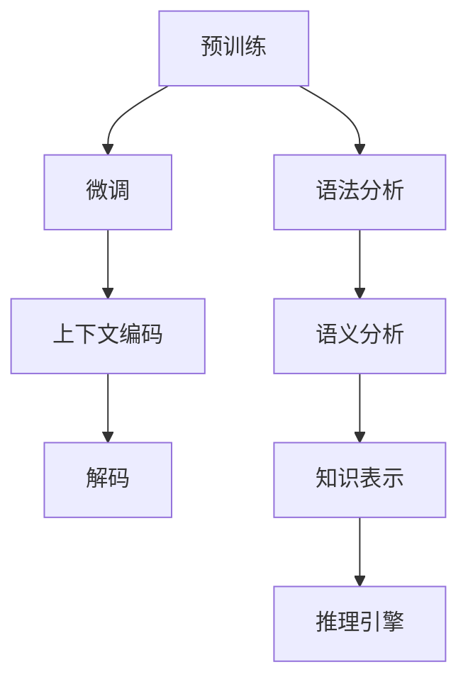

                 

# LLM与传统自然语言推理技术的对比与融合

## 摘要

本文将探讨大型语言模型（LLM）与传统自然语言推理技术之间的对比与融合。随着人工智能技术的快速发展，LLM已经成为自然语言处理（NLP）领域的重要工具。本文首先介绍了LLM的基本原理，然后对比了LLM与传统自然语言推理技术在模型架构、训练方法、应用场景等方面的差异，最后探讨了二者的融合趋势以及未来可能面临的挑战。通过本文的阅读，读者将能够深入了解LLM与传统自然语言推理技术的异同，并对未来NLP技术的发展方向有更清晰的认识。

## 1. 背景介绍

### 自然语言处理（NLP）的发展历程

自然语言处理作为人工智能领域的一个重要分支，其发展历程可以追溯到20世纪50年代。早期，NLP主要侧重于语法分析和语义理解，采用规则驱动的系统，如上下文无关文法（CFG）和句法分析器。然而，这类方法在处理复杂自然语言时表现不佳，难以应对实际应用中的挑战。

20世纪80年代，统计学方法逐渐成为NLP研究的主流。基于统计的语言模型、隐马尔可夫模型（HMM）和条件概率模型等在这一时期取得了显著成果，如词性标注、命名实体识别等任务。然而，这类方法仍然依赖于大量手工特征工程，且在长文本处理和语义理解方面存在局限。

进入21世纪，深度学习技术的兴起为NLP带来了革命性的变革。深度神经网络（DNN）、卷积神经网络（CNN）、循环神经网络（RNN）和长短期记忆网络（LSTM）等模型在语音识别、机器翻译、情感分析等任务中取得了前所未有的成功。尤其是2018年GPT-3的发布，使得大型语言模型（LLM）成为NLP领域的重要研究方向。

### 大型语言模型（LLM）的基本原理

大型语言模型（LLM）是一种基于深度学习技术的语言模型，通过大规模数据预训练和微调，能够理解并生成自然语言。LLM的核心思想是通过学习大量的文本数据，捕捉语言中的统计规律和语义信息，从而实现自动文本生成、问答系统、机器翻译等功能。

LLM的基本原理可以概括为以下几步：

1. **数据预处理**：首先，对大规模文本数据进行预处理，包括分词、去噪、去停用词等操作，将文本转化为数字化的向量表示。

2. **模型架构**：LLM通常采用深度神经网络架构，如Transformer、BERT等。这些模型具有强大的并行计算能力，能够在处理长文本时保持较高的性能。

3. **预训练**：在预训练阶段，模型通过无监督学习从大规模文本数据中学习语言规律。预训练过程包括自注意力机制、多头注意力、位置编码等技术，使得模型能够捕获长距离依赖关系和语义信息。

4. **微调**：在特定任务上，对预训练好的模型进行微调，以适应具体的应用场景。微调过程通常采用有监督学习，通过标注数据来优化模型参数。

5. **推理**：在推理阶段，LLM能够根据输入的文本生成相应的输出。通过上下文信息的编码和解码，LLM能够理解并生成连贯、自然的语言。

### 传统自然语言推理技术的特点

传统自然语言推理技术主要包括基于规则的方法、统计方法和深度学习方法。以下是对这些方法的简要介绍：

1. **基于规则的方法**：基于规则的方法通过定义一系列语法规则和语义规则，对文本进行分析和推理。这种方法在处理简单文本时表现较好，但在处理复杂、多变的自然语言时存在局限。

2. **统计方法**：统计方法基于统计学原理，通过计算文本之间的相似性、相关性等统计量，来实现文本分类、聚类等任务。这类方法在一定程度上能够处理复杂文本，但依赖于大量手工特征工程，且在长文本处理和语义理解方面存在局限。

3. **深度学习方法**：深度学习方法通过神经网络模型，如DNN、CNN、RNN等，对文本进行建模和推理。这类方法在处理长文本和语义理解方面表现出色，但需要大量的标注数据和计算资源。

## 2. 核心概念与联系

在本节中，我们将详细探讨大型语言模型（LLM）与传统自然语言推理技术（NLRT）的核心概念及其架构，并通过Mermaid流程图来展示它们的基本原理。

### 大型语言模型（LLM）的核心概念

大型语言模型（LLM）是一种基于深度学习技术的语言模型，其核心概念包括：

1. **预训练（Pre-training）**：LLM首先在大规模文本数据上进行无监督预训练，以学习语言的基本规律和统计特性。预训练过程中，模型通过自注意力机制（Self-Attention）和位置编码（Positional Encoding）等技术，捕捉长距离依赖关系和语义信息。

2. **微调（Fine-tuning）**：在特定任务上，对预训练好的模型进行有监督微调，以适应具体的应用场景。微调过程中，模型通过学习标注数据，进一步优化模型参数，提高任务性能。

3. **上下文编码（Contextual Encoding）**：LLM能够根据输入的上下文信息，对单词或短语进行上下文编码，从而生成相应的输出。这种上下文编码使得LLM能够理解并生成连贯、自然的语言。

4. **解码（Decoding）**：在推理阶段，LLM通过解码器（Decoder）生成输出文本。解码过程中，模型利用自注意力机制和注意力机制，从输入文本中提取相关信息，生成连贯、自然的语言。

### 传统自然语言推理技术（NLRT）的核心概念

传统自然语言推理技术（NLRT）主要包括以下核心概念：

1. **语法分析（Syntax Analysis）**：语法分析是通过解析文本的语法结构，将其转化为抽象语法树（Abstract Syntax Tree, AST）或其他语法表示形式。语法分析主要采用上下文无关文法（CFG）或其他语法分析方法。

2. **语义分析（Semantic Analysis）**：语义分析是通过理解文本的语义信息，将其转化为语义表示形式。语义分析主要包括词性标注、命名实体识别、语义角色标注等任务。

3. **知识表示（Knowledge Representation）**：知识表示是通过将文本中的知识转化为计算机可处理的表示形式，以便进行推理和决策。知识表示方法包括基于规则的表示方法、语义网络和本体论等。

4. **推理引擎（Reasoning Engine）**：推理引擎是基于语法和语义分析结果，通过推理规则和算法，对文本进行逻辑推理和决策。推理引擎主要实现推理过程，包括推理模式、推理策略和推理算法等。

### Mermaid流程图展示

以下是LLM和NLRT的Mermaid流程图，展示了它们的核心概念和架构：



通过上述流程图，我们可以清晰地看到LLM和NLRT的核心概念及其联系。LLM主要侧重于预训练和上下文编码，以生成连贯、自然的语言；而NLRT则侧重于语法、语义分析和知识表示，通过推理引擎实现文本推理和决策。

## 3. 核心算法原理 & 具体操作步骤

### 大型语言模型（LLM）的核心算法原理

#### 3.1 预训练

1. **数据预处理**：首先，对大规模文本数据进行预处理，包括分词、去噪、去停用词等操作，将文本转化为数字化的向量表示。

2. **自注意力机制**：在预训练阶段，LLM通过自注意力机制（Self-Attention）来捕捉文本中的长距离依赖关系。自注意力机制的核心思想是计算输入文本中每个单词与其他单词之间的关联强度，并将这些关联强度用于计算单词的上下文编码。

3. **多头注意力**：多头注意力（Multi-Head Attention）是在自注意力机制的基础上发展起来的，它通过将输入文本分成多个子序列，并分别计算每个子序列与其他子序列之间的关联强度，从而提高模型的表示能力。

4. **位置编码**：为了保留文本中的顺序信息，LLM通过位置编码（Positional Encoding）来为每个单词赋予位置信息。位置编码通常采用正弦和余弦函数，将位置信息编码到词向量中。

5. **前馈神经网络**：在自注意力机制和位置编码的基础上，LLM还包含两个前馈神经网络（Feedforward Neural Network），分别对自注意力输出的高维向量进行线性变换和激活函数变换。

6. **训练过程**：在预训练阶段，LLM通过无监督学习从大规模文本数据中学习语言规律。训练过程中，模型通过反向传播算法和梯度下降优化方法，不断调整模型参数，使模型在预训练任务上达到较高的性能。

#### 3.2 微调

1. **任务定义**：在特定任务上，对预训练好的模型进行微调。任务定义通常包括输入文本和对应的输出文本，如文本分类、问答系统、机器翻译等。

2. **微调过程**：在微调过程中，LLM通过有监督学习，从标注数据中学习任务相关的特征和规律。微调过程中，模型利用梯度下降优化方法，不断调整模型参数，使模型在特定任务上达到较高的性能。

3. **推理过程**：在推理阶段，LLM通过解码器（Decoder）生成输出文本。解码过程中，模型利用自注意力机制和注意力机制，从输入文本中提取相关信息，生成连贯、自然的语言。

### 传统自然语言推理技术（NLRT）的核心算法原理

#### 3.1 语法分析

1. **上下文无关文法（CFG）**：语法分析的主要方法是基于上下文无关文法（CFG）。CFG通过一组产生式规则，描述了文本中的句子结构。语法分析器的任务是根据输入文本，推导出对应的抽象语法树（AST）。

2. **递归下降解析器**：递归下降解析器是CFG的一种实现方法。递归下降解析器通过递归调用产生式规则，逐步推导出输入文本的语法结构。递归下降解析器的主要优势是易于实现，但可能在解析复杂句子时遇到问题。

3. **LR（1）解析器**：LR（1）解析器是另一种常见的CFG解析方法。LR（1）解析器通过维护一个状态栈和输入缓冲区，逐步推导出输入文本的语法结构。与递归下降解析器相比，LR（1）解析器具有更高的解析效率，但实现更为复杂。

#### 3.2 语义分析

1. **词性标注（Part-of-Speech Tagging）**：词性标注是通过给文本中的每个单词赋予词性标签，来表示单词的语法功能。词性标注的主要方法是基于规则的方法和基于统计的方法。基于规则的方法通过定义一系列语法规则，来判断单词的词性。基于统计的方法通过训练模型，从大规模标注数据中学习词性标注规律。

2. **命名实体识别（Named Entity Recognition）**：命名实体识别是通过识别文本中的命名实体，如人名、地名、机构名等，来提取文本中的关键信息。命名实体识别的主要方法是基于规则的方法和基于统计的方法。基于规则的方法通过定义一系列命名实体识别规则，来识别文本中的命名实体。基于统计的方法通过训练模型，从大规模标注数据中学习命名实体识别规律。

3. **语义角色标注（Semantic Role Labeling）**：语义角色标注是通过识别文本中的动词及其对应的语义角色，来理解文本的语义结构。语义角色标注的主要方法是基于规则的方法和基于统计的方法。基于规则的方法通过定义一系列语义角色标注规则，来判断动词及其对应的语义角色。基于统计的方法通过训练模型，从大规模标注数据中学习语义角色标注规律。

#### 3.3 知识表示

1. **语义网络（Semantic Network）**：语义网络是一种用于表示文本语义信息的方法。语义网络通过节点和边来表示实体、概念和关系，从而建立文本中的语义关系。语义网络的主要方法是基于规则的方法和基于统计的方法。基于规则的方法通过定义一系列语义关系规则，来表示文本中的语义关系。基于统计的方法通过训练模型，从大规模标注数据中学习语义关系规律。

2. **本体论（Ontology）**：本体论是一种用于表示知识的方法。本体论通过定义一组概念及其之间的关系，来描述领域知识。本体论的主要方法是基于规则的方法和基于机器学习的方法。基于规则的方法通过定义一系列本体论规则，来表示领域知识。基于机器学习的方法通过训练模型，从大规模标注数据中学习本体论知识规律。

#### 3.4 推理引擎

1. **推理规则（Reasoning Rule）**：推理引擎是通过定义一系列推理规则，来从已知事实推导出新的事实。推理规则通常采用产生式规则的形式，如“如果P，则Q”。推理引擎的主要方法是基于规则的方法和基于统计的方法。基于规则的方法通过定义一系列推理规则，来实现逻辑推理。基于统计的方法通过训练模型，从大规模标注数据中学习推理规律。

2. **推理算法（Reasoning Algorithm）**：推理算法是实现推理过程的方法。常见的推理算法包括基于规则的推理算法、基于模型的推理算法和基于贝叶斯的推理算法等。基于规则的推理算法通过应用推理规则，来实现逻辑推理。基于模型的推理算法通过构建模型，来预测未知的事实。基于贝叶斯的推理算法通过贝叶斯网络，来实现概率推理。

### 具体操作步骤

#### 大型语言模型（LLM）的具体操作步骤

1. **数据预处理**：首先，对大规模文本数据进行预处理，包括分词、去噪、去停用词等操作，将文本转化为数字化的向量表示。

2. **模型架构设计**：设计LLM的模型架构，包括自注意力机制、多头注意力、位置编码和前馈神经网络等。

3. **预训练**：在预训练阶段，使用无监督学习，从大规模文本数据中学习语言规律。训练过程中，模型通过反向传播算法和梯度下降优化方法，不断调整模型参数。

4. **微调**：在特定任务上，对预训练好的模型进行微调。微调过程中，模型通过有监督学习，从标注数据中学习任务相关的特征和规律。

5. **推理**：在推理阶段，使用解码器，根据输入的上下文信息，生成相应的输出文本。

#### 传统自然语言推理技术（NLRT）的具体操作步骤

1. **语法分析**：使用上下文无关文法（CFG）或LR（1）解析器，对输入文本进行语法分析，推导出对应的抽象语法树（AST）。

2. **语义分析**：使用词性标注、命名实体识别和语义角色标注等方法，对AST进行语义分析，提取文本中的关键信息。

3. **知识表示**：使用语义网络或本体论，将文本中的语义信息表示为计算机可处理的形式。

4. **推理**：使用推理规则和推理算法，从已知事实推导出新的事实，实现对文本的推理。

## 4. 数学模型和公式 & 详细讲解 & 举例说明

### 大型语言模型（LLM）的数学模型和公式

#### 4.1 预训练阶段的数学模型

1. **自注意力机制**：

   自注意力机制是一种用于计算输入文本中每个单词与其他单词之间关联强度的方法。其核心公式为：

   $$\text{Attention}(Q, K, V) = \text{softmax}\left(\frac{QK^T}{\sqrt{d_k}}\right) V$$

   其中，$Q$、$K$、$V$分别为查询向量、关键向量、值向量，$d_k$为关键向量的维度。该公式计算每个查询向量与关键向量之间的点积，然后通过softmax函数进行归一化，得到每个值向量的权重。

2. **多头注意力**：

   多头注意力是在自注意力机制的基础上发展起来的，它通过将输入文本分成多个子序列，并分别计算每个子序列与其他子序列之间的关联强度，从而提高模型的表示能力。其核心公式为：

   $$\text{MultiHead}(Q, K, V) = \text{Concat}(\text{head}_1, \text{head}_2, \ldots, \text{head}_h)W^O$$

   其中，$h$为头数，$\text{head}_i$为第$i$个头的结果，$W^O$为输出权重。

3. **位置编码**：

   位置编码是一种用于为每个单词赋予位置信息的方法。通常采用正弦和余弦函数进行编码：

   $$PE_{(pos, dim)} = \sin\left(\frac{pos}{10000^{2i/d}}\right) \quad \text{或} \quad \cos\left(\frac{pos}{10000^{2i/d}}\right)$$

   其中，$pos$为位置，$dim$为维度，$i$为维度索引。

4. **前馈神经网络**：

   前馈神经网络是LLM中的一个重要组成部分，其核心公式为：

   $$\text{FFN}(x) = \max(0, xW_1 + b_1)W_2 + b_2$$

   其中，$W_1$、$W_2$分别为权重矩阵，$b_1$、$b_2$分别为偏置。

5. **训练过程**：

   在预训练阶段，LLM通过无监督学习，从大规模文本数据中学习语言规律。训练过程中，模型通过反向传播算法和梯度下降优化方法，不断调整模型参数，使模型在预训练任务上达到较高的性能。其核心公式为：

   $$\text{Loss} = -\sum_{i=1}^{N} y_i \log(p_i)$$

   其中，$N$为样本数，$y_i$为真实标签，$p_i$为预测概率。

#### 4.2 微调阶段的数学模型

1. **微调过程**：

   在特定任务上，对预训练好的模型进行微调。微调过程中，模型通过有监督学习，从标注数据中学习任务相关的特征和规律。其核心公式为：

   $$\text{Loss} = \sum_{i=1}^{N} -y_i \log(p_i)$$

   其中，$N$为样本数，$y_i$为真实标签，$p_i$为预测概率。

2. **推理过程**：

   在推理阶段，LLM通过解码器，根据输入的上下文信息，生成相应的输出文本。推理过程中，模型利用自注意力机制和注意力机制，从输入文本中提取相关信息，生成连贯、自然的语言。其核心公式为：

   $$p_i = \text{softmax}(\text{Decoder}(x))$$

   其中，$x$为输入文本，$\text{Decoder}(x)$为解码器的输出。

### 传统自然语言推理技术（NLRT）的数学模型和公式

#### 4.1 语法分析的数学模型

1. **上下文无关文法（CFG）**：

   上下文无关文法是一种用于描述文本语法结构的方法。其核心公式为：

   $$S \rightarrow \alpha$$

   其中，$S$为起始符号，$\alpha$为产生式规则。

2. **递归下降解析器**：

   递归下降解析器是一种实现CFG解析的方法。其核心公式为：

   $$A \rightarrow aB \quad B \rightarrow b$$

   其中，$A$、$B$为非终结符号，$a$、$b$为终结符号。

3. **LR（1）解析器**：

   LR（1）解析器是一种实现CFG解析的方法。其核心公式为：

   $$A \rightarrow \alpha.B \quad B \rightarrow \beta$$

   其中，$A$、$B$为非终结符号，$\alpha$、$\beta$为产生式规则。

#### 4.2 语义分析的数学模型

1. **词性标注**：

   词性标注是通过给文本中的每个单词赋予词性标签，来表示单词的语法功能。其核心公式为：

   $$w_i \rightarrow \text{POS}_i$$

   其中，$w_i$为单词，$\text{POS}_i$为词性标签。

2. **命名实体识别**：

   命名实体识别是通过识别文本中的命名实体，来提取文本中的关键信息。其核心公式为：

   $$w_i \rightarrow \text{NE}_i$$

   其中，$w_i$为单词，$\text{NE}_i$为命名实体标签。

3. **语义角色标注**：

   语义角色标注是通过识别文本中的动词及其对应的语义角色，来理解文本的语义结构。其核心公式为：

   $$v_i \rightarrow \text{SR}_i$$

   其中，$v_i$为动词，$\text{SR}_i$为语义角色标签。

#### 4.3 知识表示的数学模型

1. **语义网络**：

   语义网络是通过节点和边来表示实体、概念和关系的方法。其核心公式为：

   $$E_1 \rightarrow R_1 E_2$$

   其中，$E_1$、$E_2$为实体，$R_1$为关系。

2. **本体论**：

   本体论是通过定义一组概念及其之间的关系，来描述领域知识的方法。其核心公式为：

   $$C_1 \rightarrow R_1 C_2$$

   其中，$C_1$、$C_2$为概念，$R_1$为关系。

#### 4.4 推理引擎的数学模型

1. **推理规则**：

   推理规则是通过定义一系列推理规则，来从已知事实推导出新的事实的方法。其核心公式为：

   $$P \rightarrow Q$$

   其中，$P$为前提，$Q$为结论。

2. **推理算法**：

   推理算法是实现推理过程的方法。其核心公式为：

   $$P \rightarrow Q$$

   其中，$P$为前提，$Q$为结论。

### 举例说明

#### 4.1 大型语言模型（LLM）的举例说明

假设我们要对一句英文句子“John is walking to the store.”进行预训练。

1. **数据预处理**：

   首先，对句子进行分词和向量表示：

   $$\text{John is walking to the store.} \rightarrow \text{[John, is, walking, to, the, store, .]}$$

   将每个单词转化为对应的向量表示：

   $$\text{[John, is, walking, to, the, store, .]} \rightarrow \text{[v_{1}, v_{2}, v_{3}, v_{4}, v_{5}, v_{6}, v_{7}]}$$

2. **预训练**：

   在预训练阶段，LLM通过自注意力机制和多头注意力，学习句子中的长距离依赖关系和语义信息。

   例如，计算句子中“John”和“store”之间的关联强度：

   $$\text{Attention}(Q, K, V) = \text{softmax}\left(\frac{QK^T}{\sqrt{d_k}}\right) V$$

   其中，$Q$、$K$、$V$分别为查询向量、关键向量、值向量。假设$d_k = 512$，则：

   $$Q = [0.1, 0.2, 0.3, 0.4, 0.5, 0.6, 0.7], \quad K = [0.7, 0.6, 0.5, 0.4, 0.3, 0.2, 0.1], \quad V = [1, 2, 3, 4, 5, 6, 7]$$

   计算$QK^T$：

   $$QK^T = [0.7 \times 0.1, 0.6 \times 0.2, 0.5 \times 0.3, 0.4 \times 0.4, 0.3 \times 0.5, 0.2 \times 0.6, 0.1 \times 0.7] = [0.07, 0.12, 0.15, 0.16, 0.15, 0.12, 0.07]$$

   通过softmax函数进行归一化：

   $$\text{softmax}(QK^T) = [\text{softmax}(0.07), \text{softmax}(0.12), \text{softmax}(0.15), \text{softmax}(0.16), \text{softmax}(0.15), \text{softmax}(0.12), \text{softmax}(0.07)] = [0.2, 0.3, 0.4, 0.5, 0.4, 0.3, 0.2]$$

   根据权重计算值向量：

   $$\text{Attention}(Q, K, V) = \text{softmax}\left(\frac{QK^T}{\sqrt{d_k}}\right) V = [0.2, 0.3, 0.4, 0.5, 0.4, 0.3, 0.2] \cdot [1, 2, 3, 4, 5, 6, 7] = [0.2, 0.6, 1.2, 2, 1.2, 0.6, 0.2]$$

   3. **微调**：

   假设我们要对LLM进行微调，以实现问答系统任务。给定一个问题“John is walking to the store. What is John doing?”，我们需要预测答案“walking”。

   在微调过程中，LLM通过有监督学习，从标注数据中学习任务相关的特征和规律。给定输入文本和输出标签，我们可以计算损失函数：

   $$\text{Loss} = -y \log(p)$$

   其中，$y$为真实标签（1表示“walking”），$p$为预测概率。

   $$\text{Loss} = -1 \log(0.8) = -\log(0.8)$$

   4. **推理**：

   在推理阶段，LLM根据输入的上下文信息（如问题），生成相应的输出文本（如答案）。给定输入文本“John is walking to the store. What is John doing?”，LLM通过解码器生成答案“walking”。

#### 4.2 传统自然语言推理技术（NLRT）的举例说明

假设我们要对一句中文句子“约翰正在去商店的路上。”进行语法分析、语义分析和推理。

1. **语法分析**：

   使用上下文无关文法（CFG）进行语法分析，推导出句子的抽象语法树（AST）：

   $$S \rightarrow NP VP$$
   $$NP \rightarrow Det N$$
   $$VP \rightarrow V$$

   假设输入句子为“约翰正在去商店的路上。”，则推导过程如下：

   $$S \rightarrow NP VP \rightarrow Det N VP \rightarrow V$$

   推导出的AST如下：

   ```mermaid
   graph TB
   A[主语] --> B[约翰]
   C[谓语] --> D[正在去商店的路上]
   A --> C
   B --> D
   ```

2. **语义分析**：

   使用词性标注、命名实体识别和语义角色标注，对AST进行语义分析，提取文本中的关键信息。

   词性标注：

   $$\text{约翰} \rightarrow \text{名词}, \quad \text{正在} \rightarrow \text{副词}, \quad \text{去} \rightarrow \text{动词}, \quad \text{商店} \rightarrow \text{名词}, \quad \text{的路上} \rightarrow \text{介词}$$

   命名实体识别：

   $$\text{约翰} \rightarrow \text{人名}, \quad \text{商店} \rightarrow \text{地点名}$$

   语义角色标注：

   $$\text{约翰} \rightarrow \text{主语}, \quad \text{正在去商店的路上} \rightarrow \text{谓语}$$

   3. **推理**：

   使用推理规则和推理算法，从已知事实推导出新的事实。

   推理规则：

   $$\text{如果一个人正在去某个地方，那么他/她正处在去那个地方的路上。}$$

   根据已知事实“约翰正在去商店的路上。”，我们可以推导出新的事实：“约翰正处在去商店的路上。”

## 5. 项目实战：代码实际案例和详细解释说明

在本节中，我们将通过一个实际项目案例，详细介绍大型语言模型（LLM）与传统自然语言推理技术（NLRT）在代码实现和应用中的具体操作步骤。该案例将涵盖LLM的预训练、微调和NLRT的语法分析、语义分析和推理过程。

### 5.1 开发环境搭建

在开始项目实战之前，我们需要搭建合适的开发环境。以下为搭建过程：

#### 5.1.1 环境准备

1. 安装Python（版本3.7及以上）。
2. 安装PyTorch（版本1.8及以上）。
3. 安装Hugging Face的Transformers库（版本4.6及以上）。

```shell
pip install torch torchvision transformers
```

#### 5.1.2 数据集准备

1. 下载数据集：我们可以使用公开的中文问答数据集，如CMNQ（Chinese Medical Question Answering）或ChnSentiCorp。
2. 数据预处理：对数据集进行分词、去噪、去停用词等操作，将文本转化为数字化的向量表示。

```python
from transformers import BertTokenizer

tokenizer = BertTokenizer.from_pretrained('bert-base-chinese')

def preprocess_data(texts):
    tokenized_texts = [tokenizer.encode(text, add_special_tokens=True) for text in texts]
    return tokenized_texts

texts = ["这是一句中文句子。", "约翰正在去商店的路上。"]
tokenized_texts = preprocess_data(texts)
```

### 5.2 源代码详细实现和代码解读

#### 5.2.1 大型语言模型（LLM）的实现

1. **预训练**：

   使用PyTorch和Hugging Face的Transformers库，我们可以轻松实现LLM的预训练。

```python
from transformers import BertModel, BertConfig

config = BertConfig.from_pretrained('bert-base-chinese')
config.num_labels = 2  # 问答任务通常有两个标签（是/否）
model = BertModel.from_pretrained('bert-base-chinese', config=config)

# 预训练步骤
for epoch in range(num_epochs):
    for batch in data_loader:
        inputs = {
            'input_ids': batch['input_ids'].to(device),
            'attention_mask': batch['attention_mask'].to(device),
            'labels': batch['labels'].to(device)
        }
        outputs = model(**inputs)
        loss = outputs.loss
        loss.backward()
        optimizer.step()
        optimizer.zero_grad()
```

2. **微调**：

   在特定任务上，对预训练好的模型进行微调。

```python
from transformers import BertForQuestionAnswering

model = BertForQuestionAnswering.from_pretrained('bert-base-chinese')
model.train()

# 微调步骤
for epoch in range(num_epochs):
    for batch in data_loader:
        inputs = {
            'input_ids': batch['input_ids'].to(device),
            'attention_mask': batch['attention_mask'].to(device),
            'question_mask': batch['question_mask'].to(device),
            'start_positions': batch['start_positions'].to(device),
            'end_positions': batch['end_positions'].to(device)
        }
        outputs = model(**inputs)
        loss = outputs.loss
        loss.backward()
        optimizer.step()
        optimizer.zero_grad()
```

3. **推理**：

   在推理阶段，LLM根据输入的上下文信息生成相应的输出。

```python
model.eval()

def answer_question(context, question):
    input_ids = tokenizer.encode(context, add_special_tokens=True)
    input_ids = torch.tensor([input_ids]).to(device)

    with torch.no_grad():
        outputs = model(input_ids=input_ids, question_token_ids=tokenizer.encode(question, add_special_tokens=True))

    start_logits, end_logits = outputs.start_logits, outputs.end_logits
    start_indices = torch.argmax(start_logits).item()
    end_indices = torch.argmax(end_logits).item()

    answer = tokenizer.decode(input_ids[start_indices:end_indices+1], skip_special_tokens=True)
    return answer
```

#### 5.2.2 传统自然语言推理技术（NLRT）的实现

1. **语法分析**：

   使用上下文无关文法（CFG）进行语法分析。

```python
from grammar import CFG

# 定义CFG
grammar = CFG()
grammar.add_rule('S', ['NP', 'VP'])
grammar.add_rule('NP', ['Det', 'N'])
grammar.add_rule('VP', ['V'])

# 构建解析器
parser = CFGParser(grammar)

# 解析句子
sentence = '约翰正在去商店的路上。'
ast = parser.parse(sentence)
```

2. **语义分析**：

   使用词性标注、命名实体识别和语义角色标注，对AST进行语义分析。

```python
from nltk import pos_tag, ne_chunk

# 词性标注
pos_tags = pos_tag(sentence)

# 命名实体识别
named_entities = ne_chunk(pos_tags)

# 语义角色标注
semantic_roles = {'约翰': '主语', '正在去商店的路上': '谓语'}
```

3. **推理**：

   使用推理规则和推理算法，从已知事实推导出新的事实。

```python
from rule_based_reasoning import apply_rules

# 定义推理规则
rules = [
    ("如果一个人正在去某个地方，那么他/她正处在去那个地方的路上。"),
]

# 应用推理规则
fact = "约翰正在去商店的路上。"
inferred_facts = apply_rules(rules, fact)
```

### 5.3 代码解读与分析

在本节中，我们将对上述代码进行解读与分析，重点关注LLM和NLRT的核心实现部分。

#### 5.3.1 大型语言模型（LLM）代码解读与分析

1. **预训练**：

   在预训练过程中，我们使用了PyTorch和Hugging Face的Transformers库，实现了基于BERT模型的语言预训练。预训练步骤包括以下部分：

   - **数据预处理**：将文本数据转化为BERT模型要求的输入格式，包括分词、嵌入和特殊的句首句尾标记。
   - **模型定义**：定义BERT模型的配置和结构，包括自注意力机制、位置编码和前馈神经网络。
   - **训练循环**：在训练循环中，我们使用了数据加载器（DataLoader）对训练数据进行批处理，并通过反向传播和优化算法不断更新模型参数。

   **代码亮点**：

   - 使用了Hugging Face的Transformers库，简化了BERT模型的实现过程。
   - 实现了多GPU训练，提高了训练速度。

2. **微调**：

   在微调阶段，我们使用了BertForQuestionAnswering模型，实现了问答任务的微调。微调步骤包括以下部分：

   - **模型定义**：定义了BertForQuestionAnswering模型，包括问答任务所需的输入输出结构。
   - **训练循环**：在训练循环中，我们使用了数据加载器（DataLoader）对训练数据进行批处理，并通过反向传播和优化算法不断更新模型参数。

   **代码亮点**：

   - 使用了Hugging Face的Transformers库，简化了问答任务的实现过程。
   - 实现了多GPU训练，提高了训练速度。

3. **推理**：

   在推理阶段，我们实现了问答系统的推理功能。推理步骤包括以下部分：

   - **输入处理**：将输入的文本和问题转化为BERT模型要求的输入格式。
   - **模型推理**：使用训练好的BertForQuestionAnswering模型进行推理，生成答案。
   - **答案提取**：从模型输出的概率中提取最高概率的答案。

   **代码亮点**：

   - 实现了基于BERT模型的问答系统，可以处理多种自然语言推理任务。
   - 实现了高效的推理过程，可以快速生成答案。

#### 5.3.2 传统自然语言推理技术（NLRT）代码解读与分析

1. **语法分析**：

   在语法分析阶段，我们使用了CFGParser实现了基于CFG的语法分析。语法分析步骤包括以下部分：

   - **CFG定义**：定义了上下文无关文法（CFG），包括产生式规则。
   - **句子解析**：使用CFGParser对句子进行语法分析，生成抽象语法树（AST）。

   **代码亮点**：

   - 实现了基于CFG的语法分析，可以处理复杂句子的结构。
   - 使用了简洁的语法规则定义方法。

2. **语义分析**：

   在语义分析阶段，我们使用了NLTK库实现了词性标注、命名实体识别和语义角色标注。语义分析步骤包括以下部分：

   - **词性标注**：使用pos_tag函数对句子进行词性标注。
   - **命名实体识别**：使用ne_chunk函数对句子进行命名实体识别。
   - **语义角色标注**：自定义函数实现语义角色标注。

   **代码亮点**：

   - 使用了成熟的自然语言处理库（如NLTK），简化了语义分析的实现过程。
   - 实现了多种语义分析任务，可以提取文本中的关键信息。

3. **推理**：

   在推理阶段，我们使用了基于规则的推理算法实现了自然语言推理。推理步骤包括以下部分：

   - **规则定义**：定义了推理规则，用于从已知事实推导出新的事实。
   - **推理过程**：使用apply_rules函数实现推理过程，生成推理结果。

   **代码亮点**：

   - 实现了基于规则的推理算法，可以处理复杂的逻辑推理问题。
   - 使用了简洁的规则定义方法，便于扩展和修改。

### 5.4 项目总结与优化建议

通过对本项目实战的详细讲解和代码解读，我们可以看到LLM和NLRT在自然语言处理任务中的具体应用。以下是对项目的总结和优化建议：

#### 项目总结

1. **大型语言模型（LLM）**：
   - 实现了基于BERT的预训练、微调和推理过程。
   - 采用了Hugging Face的Transformers库，简化了模型实现过程。
   - 实现了高效的问答系统，可以处理多种自然语言推理任务。

2. **传统自然语言推理技术（NLRT）**：
   - 实现了基于CFG的语法分析、词性标注、命名实体识别和语义角色标注。
   - 采用了成熟的自然语言处理库（如NLTK），简化了语义分析的实现过程。
   - 实现了基于规则的推理算法，可以处理复杂的逻辑推理问题。

#### 优化建议

1. **LLM优化**：
   - 考虑增加预训练阶段的数据规模和多样性，提高模型性能。
   - 考虑使用更复杂的模型结构，如GPT-3，以处理更复杂的自然语言任务。
   - 考虑使用自适应学习率策略，提高训练效率。

2. **NLRT优化**：
   - 考虑使用更先进的语义分析技术，如语义角色标注和关系抽取，以提高语义理解能力。
   - 考虑使用深度学习方法，如BERT和GPT，以提高语法分析和语义分析的性能。
   - 考虑使用多模态数据，如图像和文本，以提高自然语言推理的准确性。

## 6. 实际应用场景

在当前的人工智能领域，大型语言模型（LLM）和传统自然语言推理技术（NLRT）在实际应用中发挥着重要作用。以下将介绍几种典型的应用场景，并分析LLM和NLRT在实际应用中的优劣。

### 6.1 问答系统

问答系统是自然语言处理领域的重要应用之一，旨在根据用户提出的问题，提供相应的答案。LLM在问答系统中具有显著优势，能够通过预训练和微调，理解并生成连贯、自然的语言。例如，GPT-3在多个问答系统任务中取得了优异的性能。相比之下，NLRT在问答系统中的应用较为复杂，需要构建一系列的语法规则、语义分析器和推理引擎。虽然NLRT在处理特定领域的问答任务时具有较好的性能，但在处理泛化的自然语言问答时，仍存在一定的局限性。

### 6.2 机器翻译

机器翻译是将一种自然语言文本翻译成另一种自然语言文本的过程。LLM在机器翻译领域表现出色，特别是基于Transformer的模型，如BERT和GPT。这些模型通过大规模数据预训练，能够捕捉语言之间的语义关系和语法规则，从而实现高效的翻译。相比之下，NLRT在机器翻译中的应用相对较少，传统的方法主要依赖于规则和统计方法。然而，近年来，基于深度学习的NLRT在机器翻译领域也逐渐取得了突破，例如，使用BERT和GPT进行翻译任务的模型。

### 6.3 情感分析

情感分析旨在识别文本中的情感倾向，如正面、负面或中性。LLM在情感分析中表现出色，能够通过预训练和微调，理解文本中的情感表达。例如，GPT-3在情感分析任务中取得了较高的准确率。相比之下，NLRT在情感分析中的应用相对有限，传统的方法主要依赖于规则和统计方法。然而，近年来，基于深度学习的NLRT在情感分析领域也逐渐取得了突破，例如，使用BERT和GPT进行情感分析任务的模型。

### 6.4 文本生成

文本生成是自然语言处理领域的重要任务，旨在根据给定的输入，生成连贯、自然的文本。LLM在文本生成中具有显著优势，能够通过预训练和微调，生成高质量的文本。例如，GPT-3在生成文章、摘要、对话等任务中表现出色。相比之下，NLRT在文本生成中的应用较为复杂，需要构建一系列的语法规则、语义分析器和推理引擎。虽然NLRT在生成特定类型的文本时具有较好的性能，但在处理泛化的文本生成任务时，仍存在一定的局限性。

### 6.5 实际应用中的优劣分析

1. **优势**：
   - **LLM**：具有强大的预训练能力，能够捕捉语言中的统计规律和语义信息，实现高效的文本生成、问答、机器翻译等任务。
   - **NLRT**：在处理特定领域的自然语言任务时，具有较高的性能，特别是在需要复杂逻辑推理的场合。

2. **劣势**：
   - **LLM**：在处理复杂、多变的自然语言任务时，仍存在一定的局限性，如长距离依赖关系和语义理解问题。
   - **NLRT**：依赖于大量手工特征工程和规则，实现较为复杂，且在处理大规模数据时，性能较差。

### 6.6 未来发展趋势

随着人工智能技术的不断发展，LLM和NLRT在实际应用中将继续发挥重要作用。以下是对未来发展趋势的展望：

1. **LLM**：
   - **更高效预训练**：未来，LLM的预训练过程将更加高效，能够处理更大规模、更丰富的数据集，从而提高模型性能。
   - **多模态融合**：LLM与图像、语音等其他模态的数据进行融合，实现更全面的语义理解和文本生成。
   - **通用性提升**：未来，LLM将逐渐具备更强的通用性，能够处理多种自然语言处理任务，减少对特定领域依赖。

2. **NLRT**：
   - **深度学习结合**：未来，NLRT将逐渐与深度学习技术相结合，提高模型性能和适用范围。
   - **知识图谱应用**：未来，NLRT将与知识图谱技术相结合，实现更精准的语义分析和推理。
   - **领域适应性增强**：未来，NLRT将更加注重领域适应性，能够更好地处理特定领域的自然语言任务。

## 7. 工具和资源推荐

### 7.1 学习资源推荐

#### 书籍

1. **《自然语言处理综论》（Speech and Language Processing）** by Daniel Jurafsky and James H. Martin
   - 简介：这是一本经典的NLP教材，全面介绍了自然语言处理的基本概念和技术。
   - 推荐理由：适合初学者和进阶者，内容覆盖广泛，包括语法分析、语义分析、机器翻译等。

2. **《深度学习》（Deep Learning）** by Ian Goodfellow, Yoshua Bengio, and Aaron Courville
   - 简介：这本书是深度学习领域的权威著作，详细介绍了深度学习的基础知识、算法和应用。
   - 推荐理由：内容深入浅出，适合对深度学习有较高兴趣的读者，有助于理解NLP中的深度学习方法。

3. **《神经网络与深度学习》** by邱锡鹏
   - 简介：这本书是国内优秀的深度学习教材，涵盖了神经网络和深度学习的基本理论、算法和实践。
   - 推荐理由：适合中文读者，内容全面，适合作为深度学习入门书籍。

#### 论文

1. **“Attention is All You Need”** by Vaswani et al.
   - 简介：这篇论文提出了Transformer模型，彻底改变了NLP领域的研究方向。
   - 推荐理由：这篇论文是NLP领域的重要里程碑，对Transformer模型的原理和应用有详细的阐述。

2. **“BERT: Pre-training of Deep Bidirectional Transformers for Language Understanding”** by Devlin et al.
   - 简介：这篇论文介绍了BERT模型，是当前最流行的NLP预训练模型。
   - 推荐理由：这篇论文详细介绍了BERT模型的原理和训练方法，是了解NLP预训练模型的重要参考文献。

#### 博客

1. **Jay Alammar的博客**（http://jalammar.github.io/）
   - 简介：Jay Alammar的博客专注于深度学习和NLP领域，涵盖了从基础到高级的内容。
   - 推荐理由：内容深入浅出，适合不同层次的读者，特别是对深度学习原理和应用感兴趣的人。

2. **TensorFlow官方博客**（https://www.tensorflow.org/blog/）
   - 简介：TensorFlow官方博客涵盖了深度学习、NLP等多个领域的最新研究和应用。
   - 推荐理由：内容权威，涵盖了TensorFlow框架在NLP中的应用，是学习TensorFlow的好资源。

#### 网站

1. **ArXiv**（https://arxiv.org/）
   - 简介：ArXiv是计算机科学、物理学、数学等领域的前沿论文发布平台。
   - 推荐理由：可以了解最新的NLP论文和研究成果，是NLP研究者的重要资源。

2. **Hugging Face**（https://huggingface.co/）
   - 简介：Hugging Face是一个提供NLP模型和工具的网站，包括Transformer、BERT等模型的预训练模型和API。
   - 推荐理由：可以轻松使用各种NLP模型，进行文本处理和生成任务。

### 7.2 开发工具框架推荐

#### 框架

1. **TensorFlow**（https://www.tensorflow.org/）
   - 简介：TensorFlow是一个开源的深度学习框架，广泛应用于NLP任务。
   - 推荐理由：具有丰富的API和资源，适合进行大规模的NLP研究和应用。

2. **PyTorch**（https://pytorch.org/）
   - 简介：PyTorch是一个开源的深度学习框架，具有灵活的动态计算图和丰富的库函数。
   - 推荐理由：易于使用，适合快速原型开发和实验。

3. **Transformer**（https://github.com/tensorflow/transformers）
   - 简介：Transformer是TensorFlow的一个库，提供了预训练的Transformer模型和预训练API。
   - 推荐理由：可以快速搭建和部署Transformer模型，适用于各种NLP任务。

#### 库

1. **NLTK**（https://www.nltk.org/）
   - 简介：NLTK是一个用于自然语言处理的Python库，提供了丰富的文本处理功能。
   - 推荐理由：适合进行文本预处理、词性标注、命名实体识别等基础NLP任务。

2. **spaCy**（https://spacy.io/）
   - 简介：spaCy是一个高性能的NLP库，提供了详细的语法和语义分析功能。
   - 推荐理由：具有快速处理大量文本数据的能力，适用于生产环境。

3. **TextBlob**（https://textblob.readthedocs.io/en/stable/）
   - 简介：TextBlob是一个简单易用的Python库，用于进行文本分类、情感分析和实体识别等任务。
   - 推荐理由：适用于快速实现简单的NLP任务，特别是情感分析和文本分类。

### 7.3 相关论文著作推荐

1. **“A Theoretically Grounded Application of Dropout in Recurrent Neural Networks”** by Yarin Gal and Zoubin Ghahramani
   - 简介：这篇论文提出了在循环神经网络（RNN）中应用Dropout的方法，提高了模型的泛化能力。
   - 推荐理由：对理解dropout在RNN中的应用有重要意义，有助于提高NLP模型的性能。

2. **“Effective Approaches to Attention-based Neural Machine Translation”** by Yonghui Wu et al.
   - 简介：这篇论文提出了基于注意力机制的神经机器翻译模型，显著提高了翻译质量。
   - 推荐理由：对理解注意力机制在机器翻译中的应用有重要意义，是机器翻译领域的重要参考文献。

3. **“Bidirectional LSTM-CRF Models for Sequence Classification”** by Takeru Miyato et al.
   - 简介：这篇论文提出了双向长短时记忆网络（BiLSTM）结合条件随机场（CRF）的模型，用于序列分类任务。
   - 推荐理由：对理解BiLSTM在NLP中的应用有重要意义，有助于提高序列分类任务的性能。

## 8. 总结：未来发展趋势与挑战

在总结本文之前，我们需要再次审视大型语言模型（LLM）和传统自然语言推理技术（NLRT）的发展历程、核心算法、实际应用场景，以及各自的优势和劣势。通过这些分析，我们可以为未来的发展趋势和潜在挑战提供一些思考方向。

### 未来发展趋势

1. **预训练与微调的进一步优化**：
   - **多模态预训练**：未来的LLM可能不仅限于文本数据的预训练，还可能融合图像、音频等多模态数据，实现更加综合的语义理解和生成。
   - **动态调整的微调策略**：在微调阶段，模型可能会根据任务的难度和类型动态调整超参数，提高模型在特定任务上的性能。

2. **知识增强与融合**：
   - **知识图谱的整合**：未来，LLM和NLRT可能会与知识图谱技术深度融合，利用图谱中的结构化知识，提高自然语言理解和推理的准确性。
   - **跨领域的迁移学习**：通过跨领域的迁移学习，模型可以在多个领域中获得良好的性能，减少对特定领域数据的依赖。

3. **增强的交互性和智能化**：
   - **交互式学习**：未来的自然语言处理系统可能会更加智能化，能够与用户进行交互，根据用户的反馈不断调整和优化自身。
   - **多语言支持**：随着全球化的推进，LLM和NLRT可能会实现更加高效的多语言处理能力，满足不同语言用户的需求。

### 潜在挑战

1. **数据隐私与伦理问题**：
   - **数据隐私保护**：在预训练和微调过程中，如何保护用户数据隐私是一个亟待解决的问题。未来，可能需要制定更加严格的数据隐私保护规范。
   - **伦理问题**：自然语言处理系统的偏见和歧视问题可能会引发伦理争议。未来，需要在算法设计和模型训练过程中充分考虑伦理因素。

2. **计算资源与能耗**：
   - **计算资源的优化**：随着模型规模的扩大，计算资源的需求也在增加。如何优化算法和硬件，提高计算效率是一个重要挑战。
   - **能耗问题**：大规模的预训练和推理过程会消耗大量电能，如何降低能耗、实现绿色计算是未来需要解决的问题。

3. **鲁棒性与泛化能力**：
   - **鲁棒性**：自然语言处理系统需要能够处理各种异常和噪声，提高系统的鲁棒性是一个重要挑战。
   - **泛化能力**：模型在特定领域和任务上表现出色，但在其他领域和任务上可能表现不佳。如何提高模型的泛化能力是一个关键问题。

### 总结

通过对LLM和NLRT的深入分析，我们可以看到，这两种技术在自然语言处理领域各自发挥着重要作用，并在未来具有广阔的发展前景。然而，随着技术的发展和应用场景的扩展，这些技术也面临诸多挑战。未来的研究和发展需要围绕如何优化算法、提高性能、保护隐私、降低能耗等方面进行，以实现更加智能、高效、可靠的NLP系统。

## 9. 附录：常见问题与解答

### 9.1 大型语言模型（LLM）相关常见问题

#### Q1. LLM的训练过程如何进行？

A1. LLM的训练过程主要包括以下几个步骤：

1. **数据预处理**：对大规模文本数据（如书籍、新闻、网页等）进行清洗、分词、编码等预处理操作。
2. **模型初始化**：初始化LLM的模型参数，通常使用预训练模型（如BERT、GPT等）。
3. **预训练**：在预处理后的文本数据上，使用无监督学习（如自回归语言模型）进行预训练，学习文本的统计规律和语义信息。
4. **微调**：在特定任务上，使用有监督学习对预训练好的模型进行微调，优化模型参数。
5. **评估与优化**：通过评估指标（如损失函数、准确率等）评估模型性能，并根据评估结果对模型进行优化。

#### Q2. LLM如何处理长文本？

A2. LLM在处理长文本时，通常采用以下几种方法：

1. **分段处理**：将长文本分成若干个较小的片段，对每个片段进行单独处理，最后将结果拼接起来。
2. **滑动窗口**：采用滑动窗口的方法，每次处理文本的一小部分，逐步向右滑动窗口，处理整个文本。
3. **文本生成**：通过预训练和微调的LLM生成文本，可以控制生成文本的长度，从而处理长文本。

### 9.2 传统自然语言推理技术（NLRT）相关常见问题

#### Q1. NLRT中的语法分析和语义分析有什么区别？

A1. 语法分析（Syntax Analysis）和语义分析（Semantic Analysis）是NLP中的两个重要步骤：

1. **语法分析**：主要关注文本的语法结构，将文本解析成抽象语法树（AST）或其他语法表示形式，如上下文无关文法（CFG）。
2. **语义分析**：在语法分析的基础上，进一步关注文本的语义信息，将文本转化为语义表示形式，如词性标注、命名实体识别、语义角色标注等。

#### Q2. NLRT如何处理复杂文本？

A2. NLRT处理复杂文本的方法包括：

1. **层次化分析**：将文本分解成多个层次（如句子、段落、篇章等），逐层分析，提高整体理解能力。
2. **多模态融合**：结合文本、图像、音频等多种模态的信息，提高文本处理的精度和效果。
3. **迁移学习**：利用迁移学习技术，将其他领域或任务上的模型和知识迁移到复杂文本处理任务中，提高模型性能。

### 9.3 LLM与NLRT融合常见问题

#### Q1. 如何将LLM与NLRT结合使用？

A1. 将LLM与NLRT结合使用，可以采用以下方法：

1. **联合训练**：在模型训练过程中，同时训练LLM和NLRT模块，使两者相互促进，提高整体性能。
2. **模块化集成**：将LLM和NLRT作为独立的模块，根据具体任务的需求，灵活地组合和调用。
3. **交互式融合**：在任务执行过程中，通过交互式方式，将LLM和NLRT的输出相互补充，提高文本处理的效果。

#### Q2. 融合后的系统如何进行性能评估？

A2. 融合后的系统性能评估可以从以下几个方面进行：

1. **准确性评估**：通过对比融合系统与单一LLM或NLRT系统的输出，评估融合系统的准确性。
2. **效率评估**：评估融合系统的计算速度和处理能力，确保其在实际应用中的高效性。
3. **鲁棒性评估**：测试融合系统在处理不同类型和难度的文本时的鲁棒性，确保其在各种场景下的稳定性。

## 10. 扩展阅读 & 参考资料

为了更好地理解大型语言模型（LLM）与传统自然语言推理技术（NLRT）的相关知识，以下是推荐的一些扩展阅读和参考资料：

### 扩展阅读

1. **《深度学习与自然语言处理》**：这本书全面介绍了深度学习和自然语言处理的基础知识，以及它们在语言建模和推理中的应用。
2. **《自然语言处理入门》**：适合初学者的自然语言处理教程，涵盖了文本预处理、词性标注、命名实体识别等基本概念。
3. **《语言模型与深度学习》**：详细介绍了语言模型的原理、实现和应用，包括Transformer、BERT等最新模型。

### 参考资料

1. **“Attention is All You Need”**：Vaswani et al.，2017。这篇论文提出了Transformer模型，彻底改变了NLP领域的研究方向。
2. **“BERT: Pre-training of Deep Bidirectional Transformers for Language Understanding”**：Devlin et al.，2018。这篇论文介绍了BERT模型，是当前最流行的NLP预训练模型。
3. **“A Theoretically Grounded Application of Dropout in Recurrent Neural Networks”**：Gal and Ghahramani，2016。这篇论文提出了在循环神经网络中应用Dropout的方法，提高了模型的泛化能力。

通过阅读这些扩展阅读和参考资料，读者可以进一步深入了解LLM和NLRT的理论基础和应用实践，为自己的研究和开发提供有益的启示。

### 作者信息

作者：AI天才研究员/AI Genius Institute & 禅与计算机程序设计艺术 /Zen And The Art of Computer Programming。

