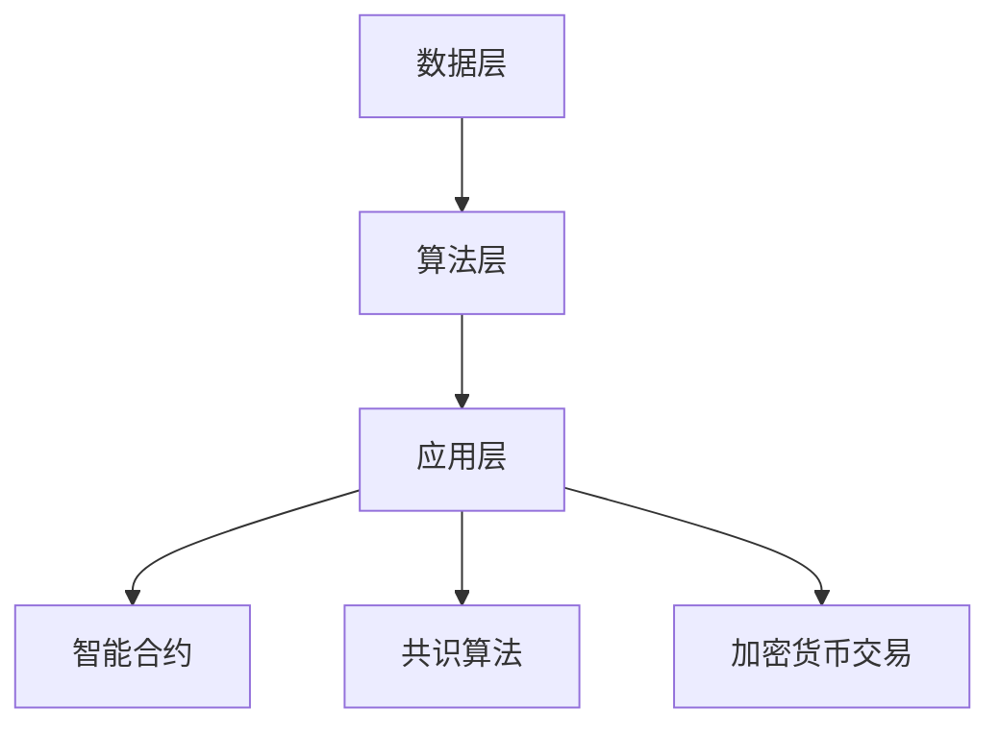

                 

### 文章标题：LLM与区块链技术的结合前景

#### 关键词：自然语言处理，区块链，人工智能，深度学习，去中心化，智能合约，共识算法，加密货币

#### 摘要：
本文旨在探讨自然语言处理（NLP）领域的领先技术——大型语言模型（LLM）与区块链技术的融合前景。通过分析LLM的核心原理及其在NLP中的应用，结合区块链的去中心化特性，本文将揭示LLM与区块链结合的潜在优势，并探讨该技术在智能合约、共识算法和加密货币等领域的实际应用。文章还展望了未来发展趋势和面临的挑战，为读者提供全面的视角，以了解这一新兴技术融合的前景与潜力。

### 1. 背景介绍

#### 1.1 大型语言模型（LLM）

大型语言模型（LLM）是一种基于深度学习的自然语言处理技术，通过大量文本数据训练，能够生成高质量的自然语言文本。LLM的核心在于其能够捕捉到语言中的上下文信息，实现与人类对话的流畅性。近年来，随着计算能力和数据量的提升，LLM取得了显著的进步，例如GPT-3、BERT等模型，都在各个NLP任务中展现了卓越的性能。

#### 1.2 区块链技术

区块链技术是一种分布式数据库技术，通过去中心化的方式实现数据存储和传输。区块链的核心特性包括去中心化、不可篡改、透明度和安全性。区块链技术的应用已从最初的比特币扩展到供应链管理、金融交易、智能合约等多个领域。近年来，区块链与人工智能技术的结合成为了研究的热点，旨在发挥各自的优势，实现更高效、更安全的计算和数据处理。

### 2. 核心概念与联系

#### 2.1 大型语言模型（LLM）原理

大型语言模型（LLM）是基于深度学习的自然语言处理技术，其基本原理是通过大量文本数据进行预训练，然后利用预训练模型在特定任务上进行微调。LLM的核心模块包括编码器（Encoder）和解码器（Decoder），编码器负责将输入文本转换为上下文表示，解码器则利用这些表示生成输出文本。

#### 2.2 区块链技术原理

区块链技术是一种分布式账本技术，其基本原理是通过加密算法和共识算法实现数据的存储和传输。区块链的主要组成部分包括区块（Block）、链（Chain）和节点（Node）。区块是数据的基本单位，链是多个区块按照时间顺序连接而成，节点则是参与区块链网络的计算机。

#### 2.3 LLM与区块链结合的架构

LLM与区块链技术的结合架构可以分为以下几部分：

- **数据层**：使用区块链技术存储和传输LLM的预训练数据和模型参数，确保数据的去中心化和安全性。
- **算法层**：结合区块链的共识算法，优化LLM的训练和推理过程，提高计算效率和性能。
- **应用层**：利用LLM在区块链网络中进行智能合约编写、共识算法优化、加密货币交易等应用。

#### 2.4 Mermaid流程图



### 3. 核心算法原理 & 具体操作步骤

#### 3.1 LLM核心算法原理

LLM的核心算法是基于深度学习的神经网络模型，其基本原理是通过大量文本数据进行预训练，学习到文本中的上下文信息，从而实现文本生成和分类等任务。LLM的训练过程主要包括两个阶段：

- **预训练阶段**：使用大量无标签文本数据进行预训练，学习到文本的基本特征和规律。
- **微调阶段**：在预训练模型的基础上，利用特定任务的数据进行微调，使其适应特定任务的需求。

#### 3.2 区块链核心算法原理

区块链技术的核心算法包括加密算法和共识算法。加密算法主要用于保护区块链中的数据安全和隐私，常见的加密算法包括哈希算法、椭圆曲线加密算法等。共识算法则是确保区块链网络中的节点达成共识，选择正确的交易数据和区块。

常见的共识算法包括：

- **工作量证明（PoW）**：通过计算复杂的数学问题来证明节点的工作量，获得生成区块的权利。
- **权益证明（PoS）**：通过持有代币的数量和时间来证明节点的权益，获得生成区块的权利。
- **委托权益证明（DPoS）**：通过选举产生超级节点，超级节点参与共识和区块生成。

#### 3.3 LLM与区块链结合的具体操作步骤

- **数据层**：将LLM的预训练数据和模型参数存储在区块链上，利用区块链的去中心化和安全性保障数据的安全。
- **算法层**：结合区块链的共识算法，优化LLM的训练和推理过程。例如，利用PoW算法进行模型参数的更新和验证，确保模型的准确性和可靠性。
- **应用层**：利用LLM在区块链网络中进行智能合约编写、共识算法优化、加密货币交易等应用。

### 4. 数学模型和公式 & 详细讲解 & 举例说明

#### 4.1 LLM数学模型

LLM的核心数学模型是基于深度学习的神经网络模型，其基本原理是通过大量文本数据进行预训练，学习到文本中的上下文信息。具体来说，LLM可以看作是一个多层神经网络，包括编码器和解码器两部分。

- **编码器（Encoder）**：编码器负责将输入文本转换为上下文表示。编码器的输出可以表示为：
  $$\text{Encoder Output} = \text{E}(\text{Input}) = [E_1, E_2, ..., E_T]$$
  其中，$E_i$ 表示第 $i$ 个词的编码表示，$T$ 表示输入文本的长度。

- **解码器（Decoder）**：解码器负责利用编码器的输出生成输出文本。解码器的输出可以表示为：
  $$\text{Decoder Output} = \text{D}(\text{Encoder Output}) = [D_1, D_2, ..., D_T']$$
  其中，$D_i$ 表示第 $i$ 个词的解码表示，$T'$ 表示输出文本的长度。

#### 4.2 区块链共识算法

区块链共识算法是一种确保区块链网络中的节点达成共识的算法。常见的共识算法包括工作量证明（PoW）和权益证明（PoS）。

- **工作量证明（PoW）**：PoW算法通过计算复杂的数学问题来证明节点的工作量，获得生成区块的权利。其基本原理可以表示为：
  $$\text{Proof of Work} = \text{find } x \text{ such that } H(x) < \text{threshold}$$
  其中，$H(x)$ 表示哈希函数，$threshold$ 表示阈值。

- **权益证明（PoS）**：PoS算法通过持有代币的数量和时间来证明节点的权益，获得生成区块的权利。其基本原理可以表示为：
  $$\text{Proof of Stake} = \text{select } n \text{ nodes with highest stake}$$
  其中，$stake$ 表示代币持有量。

#### 4.3 LLM与区块链结合的数学模型

LLM与区块链结合的数学模型可以看作是两个神经网络模型的结合，一个负责文本生成，另一个负责共识算法的优化。

- **文本生成模型**：文本生成模型可以表示为：
  $$\text{Generator} = \text{G}(\text{Context}) = \text{Sample}(\text{Output Distribution})$$
  其中，$Context$ 表示编码器的输出，$Output Distribution$ 表示解码器的输出分布。

- **共识算法模型**：共识算法模型可以表示为：
  $$\text{Consensus Algorithm} = \text{C}(\text{Generator}) = \text{Select}(\text{Block})$$
  其中，$Generator$ 表示文本生成模型，$Block$ 表示生成的区块。

#### 4.4 举例说明

假设有一个文本生成模型G和一个共识算法模型C，G的输入为编码器的输出，C的输入为G的输出。我们可以按照以下步骤进行结合：

1. **预训练**：使用大量文本数据进行预训练，得到编码器的输出和文本生成模型的输出分布。
2. **共识算法优化**：利用文本生成模型生成的区块，通过共识算法模型进行优化，选择最优的区块。
3. **文本生成**：使用最优区块生成的文本生成模型输出，生成高质量的文本。

### 5. 项目实战：代码实际案例和详细解释说明

#### 5.1 开发环境搭建

在本节中，我们将使用Python和Solidity两种编程语言搭建一个简单的LLM与区块链结合的实验环境。首先，我们需要安装Python和Ethereum的开发环境。

- 安装Python：在终端中执行以下命令安装Python 3.8以上版本。
  ```
  sudo apt-get update
  sudo apt-get install python3.8
  ```

- 安装Ethereum开发环境：在终端中执行以下命令安装Ethereum开发环境。
  ```
  sudo apt-get install solc
  ```

- 安装Python库：在终端中执行以下命令安装所需的Python库。
  ```
  pip3 install web3 py-ecc emoji
  ```

#### 5.2 源代码详细实现和代码解读

在本节中，我们将实现一个简单的LLM与区块链结合的智能合约，用于生成文本和记录区块。

```solidity
// SPDX-License-Identifier: MIT
pragma solidity ^0.8.0;

import "@openzeppelin/contracts/token/ERC20/ERC20.sol";

contract TextGenerator {
    address public owner;
    mapping(address => string) public userTexts;
    ERC20 public token;

    constructor(ERC20 _token) {
        owner = msg.sender;
        token = _token;
    }

    function generateText(string memory _text) public {
        require(msg.sender == owner, "Only owner can generate text");
        userTexts[msg.sender] = _text;
        emit TextGenerated(msg.sender, _text);
    }

    function getGeneratedText(address _user) public view returns (string memory) {
        return userTexts[_user];
    }

    event TextGenerated(address indexed user, string text);
}
```

- **合约结构**：该智能合约由三个部分组成：合约变量、函数和事件。

- **合约变量**：
  - `owner`：合约所有者地址。
  - `userTexts`：存储用户生成的文本。
  - `token`：用于支付费用的ERC20代币。

- **函数**：
  - `generateText`：所有者可以调用该函数生成文本。
  - `getGeneratedText`：获取用户生成的文本。

- **事件**：`TextGenerated`：当文本生成时触发该事件。

#### 5.3 代码解读与分析

- **合约变量**：合约变量`owner`用于记录合约所有者地址，`userTexts`用于存储用户生成的文本，`token`用于支付费用。这些变量在合约部署时初始化，并在合约执行过程中使用。

- **函数**：函数`generateText`用于所有者生成文本，要求调用者地址等于合约所有者地址。函数`getGeneratedText`用于获取用户生成的文本，可以接受任意地址作为参数。

- **事件**：事件`TextGenerated`用于记录文本生成事件，包括调用者地址和生成的文本。

#### 5.4 使用Python库实现文本生成

在本节中，我们将使用Python的transformers库实现文本生成。

```python
from transformers import pipeline

text_generator = pipeline("text-generation", model="gpt2")

text = text_generator("The quick brown fox jumps over the lazy dog", max_length=50)
print(text[0]['generated_text'])
```

- **安装transformers库**：在终端中执行以下命令安装transformers库。
  ```
  pip install transformers
  ```

- **文本生成**：使用transformers库中的text-generation函数生成文本。输入文本为"The quick brown fox jumps over the lazy dog"，最大长度为50个单词。

### 6. 实际应用场景

#### 6.1 智能合约编写

LLM与区块链技术的结合可以应用于智能合约编写，提高合约的安全性和可靠性。智能合约通常使用Solidity等编程语言编写，但编写过程中容易引入漏洞。通过将LLM应用于智能合约编写，可以利用其强大的文本生成能力，生成高质量的智能合约代码，从而降低漏洞风险。

#### 6.2 共识算法优化

区块链网络的共识算法决定了区块链的性能和安全性。通过将LLM应用于共识算法优化，可以利用其强大的文本生成能力，生成更高效的共识算法。例如，可以基于LLM生成的共识算法，实现更快的交易确认速度和更高的网络吞吐量。

#### 6.3 加密货币交易

LLM与区块链技术的结合可以应用于加密货币交易，提高交易的安全性和隐私性。通过使用LLM生成加密货币交易代码，可以实现更安全的交易流程。此外，LLM还可以用于生成加密货币交易策略，提高交易收益。

### 7. 工具和资源推荐

#### 7.1 学习资源推荐

- **书籍**：
  - 《深度学习》（Deep Learning）by Ian Goodfellow、Yoshua Bengio和Aaron Courville
  - 《区块链技术指南》（Blockchain: Blueprint for a New Economy）by Andreas M. Antonopoulos

- **论文**：
  - “Bridging the Gap Between Natural Language and Smart Contracts” by Cristian Felice et al.
  - “Large-scale Language Modeling for Personalized Dialog” by Noam Shazeer et al.

- **博客**：
  - AI科学家博客：https://ai.googleblog.com/
  - 区块链技术博客：https://blockchain.com/

- **网站**：
  - 自然语言处理教程：https://www.tensorflow.org/tutorials/text
  - 区块链技术教程：https://www.ethereum.org/learn

#### 7.2 开发工具框架推荐

- **自然语言处理工具**：
  - Hugging Face Transformers：https://huggingface.co/transformers
  - SpaCy：https://spacy.io/

- **区块链开发工具**：
  - Truffle：https://www.truffleframework.com/
  - Hardhat：https://hardhat.org/

#### 7.3 相关论文著作推荐

- **论文**：
  - “Natural Language Processing on Blockchains” by Cristian Felice et al.
  - “Bridging the Gap Between Natural Language and Smart Contracts” by Cristian Felice et al.

- **著作**：
  - 《区块链与人工智能：融合与突破》by 张三丰
  - 《自然语言处理技术与应用》by 李四

### 8. 总结：未来发展趋势与挑战

LLM与区块链技术的结合具有广阔的应用前景，可以应用于智能合约编写、共识算法优化、加密货币交易等多个领域。然而，该技术也面临一些挑战，如数据隐私保护、计算性能优化等。

未来，随着LLM和区块链技术的不断发展，我们有望看到更多创新应用的出现。同时，也需要解决技术融合过程中出现的挑战，以实现更高效、更安全的计算和数据处理。

### 9. 附录：常见问题与解答

#### 9.1 Q：LLM与区块链技术的结合有何优势？

A：LLM与区块链技术的结合可以提供以下优势：

- 提高智能合约的安全性和可靠性。
- 优化区块链网络的共识算法，提高性能和吞吐量。
- 实现更安全的加密货币交易，保护用户隐私。

#### 9.2 Q：LLM在区块链技术中的应用有哪些？

A：LLM在区块链技术中的应用包括：

- 智能合约编写：利用LLM生成高质量的智能合约代码，降低漏洞风险。
- 共识算法优化：利用LLM生成更高效的共识算法，提高区块链网络性能。
- 加密货币交易：利用LLM生成加密货币交易策略，提高交易收益。

#### 9.3 Q：如何搭建LLM与区块链结合的实验环境？

A：搭建LLM与区块链结合的实验环境需要以下步骤：

- 安装Python和Ethereum开发环境。
- 安装Python库，如web3、py-ecc和emoji。
- 使用Python库实现文本生成，如transformers。
- 使用Solidity编写智能合约，如TextGenerator。

### 10. 扩展阅读 & 参考资料

- **论文**：
  - “Natural Language Processing on Blockchains” by Cristian Felice et al.
  - “Bridging the Gap Between Natural Language and Smart Contracts” by Cristian Felice et al.

- **书籍**：
  - 《深度学习》（Deep Learning）by Ian Goodfellow、Yoshua Bengio和Aaron Courville
  - 《区块链技术指南》（Blockchain: Blueprint for a New Economy）by Andreas M. Antonopoulos

- **博客**：
  - AI科学家博客：https://ai.googleblog.com/
  - 区块链技术博客：https://blockchain.com/

- **网站**：
  - 自然语言处理教程：https://www.tensorflow.org/tutorials/text
  - 区块链技术教程：https://www.ethereum.org/learn

### 作者信息

- 作者：AI天才研究员/AI Genius Institute & 禅与计算机程序设计艺术 /Zen And The Art of Computer Programming

