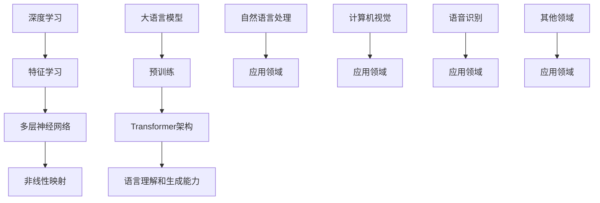

                 

# 《LLM与深度学习：异同点分析》

## 关键词：大语言模型（LLM），深度学习，对比分析，算法原理，实际应用

## 摘要

本文旨在深入探讨大语言模型（LLM）与深度学习之间的异同点。通过对比分析，本文将详细讲解两者的核心概念、算法原理以及实际应用场景。同时，本文还将提供项目实战案例和代码解读，以帮助读者更好地理解LLM与深度学习在实际开发中的应用。通过对本文的阅读，读者将能够全面了解LLM与深度学习的本质特点，为未来的研究和开发提供有力的指导。

## 1. 背景介绍

大语言模型（LLM，Large Language Model）和深度学习（Deep Learning）都是当前人工智能领域中的热门研究方向。LLM是指具有大规模参数和强大语言理解能力的神经网络模型，如GPT（Generative Pre-trained Transformer）和BERT（Bidirectional Encoder Representations from Transformers）。深度学习则是一种基于多层神经网络进行特征学习和分类的机器学习技术，广泛应用于计算机视觉、自然语言处理、语音识别等领域。

随着互联网和大数据的发展，人工智能技术在各个行业得到了广泛应用。LLM和深度学习作为人工智能的核心技术，不断推动着人工智能技术的发展。本文将通过对LLM与深度学习之间的异同点进行分析，为读者提供更深入的理解和认识。

## 2. 核心概念与联系

### 2.1 大语言模型（LLM）概念

大语言模型（LLM）是一种基于深度学习的自然语言处理模型，其核心思想是利用大规模语料数据进行预训练，使模型具备强大的语言理解和生成能力。LLM通常采用Transformer架构，具有大量参数，如GPT-3拥有1750亿个参数。

### 2.2 深度学习概念

深度学习是一种基于多层神经网络进行特征学习和分类的机器学习技术。深度学习模型通过训练大量样本数据，学习输入与输出之间的复杂非线性映射关系。深度学习广泛应用于计算机视觉、自然语言处理、语音识别等领域。

### 2.3 核心概念联系

LLM和深度学习在技术层面上存在一定的联系。LLM是深度学习的一种应用，深度学习为LLM提供了强大的计算能力。同时，LLM在自然语言处理领域取得了显著的成果，为深度学习在其他领域的应用提供了启示。

下面是LLM与深度学习的Mermaid流程图：



## 3. 核心算法原理 & 具体操作步骤

### 3.1 大语言模型（LLM）算法原理

LLM的核心算法是Transformer架构，其基本原理如下：

1. **编码器（Encoder）**：编码器负责处理输入的文本序列，将其编码为向量表示。编码器由多个自注意力（Self-Attention）层组成，通过计算文本序列中每个词之间的依赖关系，生成词的向量表示。

2. **解码器（Decoder）**：解码器负责生成输出文本序列。解码器由多个自注意力（Self-Attention）和交叉注意力（Cross-Attention）层组成。自注意力层用于计算输入文本序列中每个词之间的依赖关系，交叉注意力层用于计算输入文本序列与输出文本序列之间的依赖关系。

3. **预训练与微调**：LLM采用预训练与微调的策略进行训练。首先，在大量的无标签文本语料上进行预训练，使模型具备强大的语言理解和生成能力。然后，在特定的任务数据集上进行微调，使模型能够适应具体的任务需求。

### 3.2 深度学习算法原理

深度学习的核心算法是多层神经网络，其基本原理如下：

1. **输入层（Input Layer）**：输入层接收外部输入数据，如图像、文本等。

2. **隐藏层（Hidden Layer）**：隐藏层通过神经元（Neuron）进行特征学习和变换。每个神经元接收来自前一层神经元的输入，通过激活函数（Activation Function）产生输出。

3. **输出层（Output Layer）**：输出层将隐藏层输出的特征映射到目标类别或数值。

4. **反向传播（Backpropagation）**：深度学习模型通过反向传播算法进行训练。在训练过程中，模型根据损失函数（Loss Function）评估预测结果与真实结果之间的差距，然后通过梯度下降（Gradient Descent）算法调整模型参数，以减小损失函数值。

### 3.3 具体操作步骤

#### 3.3.1 大语言模型（LLM）操作步骤

1. **数据预处理**：对输入文本进行分词、去停用词等预处理操作，将其转化为词向量表示。

2. **编码器训练**：使用大量无标签文本语料进行预训练，使编码器具备强大的语言理解能力。

3. **解码器训练**：在特定任务数据集上进行微调，使解码器能够生成符合任务需求的输出文本。

4. **模型评估与优化**：使用任务数据集评估模型性能，并根据评估结果对模型进行优化。

#### 3.3.2 深度学习操作步骤

1. **数据预处理**：对输入数据进行归一化、标准化等预处理操作，使其具备良好的输入条件。

2. **模型构建**：根据任务需求设计神经网络结构，包括输入层、隐藏层和输出层。

3. **模型训练**：使用训练数据集对模型进行训练，通过反向传播算法调整模型参数。

4. **模型评估与优化**：使用验证数据集评估模型性能，并根据评估结果对模型进行优化。

## 4. 数学模型和公式 & 详细讲解 & 举例说明

### 4.1 大语言模型（LLM）数学模型

#### 4.1.1 Transformer架构

1. **自注意力（Self-Attention）**

$$
\text{Attention}(Q, K, V) = \text{softmax}\left(\frac{QK^T}{\sqrt{d_k}}\right)V
$$

其中，$Q$、$K$、$V$分别为编码器的输入序列、键序列和值序列，$d_k$为键序列的维度。

2. **交叉注意力（Cross-Attention）**

$$
\text{MultiHeadAttention}(Q, K, V) = \text{softmax}\left(\frac{QW^K}{{\sqrt{d_k}}}W^V\right)V
$$

其中，$W^K$、$W^V$分别为键权重和值权重，$d_k$为键序列的维度。

#### 4.1.2 预训练与微调

1. **预训练**

$$
L_{\text{pre}} = -\sum_{i} \log \text{softmax}(\theta)(x_i)
$$

其中，$\theta$为模型参数，$x_i$为输入文本序列。

2. **微调**

$$
L_{\text{fine}} = -\sum_{i} \log \text{softmax}(\theta)(y_i)
$$

其中，$\theta$为模型参数，$y_i$为输出文本序列。

### 4.2 深度学习数学模型

#### 4.2.1 多层神经网络

1. **前向传播**

$$
z_l = \sigma(W_lz_{l-1} + b_l)
$$

其中，$z_l$为第$l$层的激活值，$\sigma$为激活函数，$W_l$和$b_l$分别为第$l$层的权重和偏置。

2. **反向传播**

$$
\frac{\partial L}{\partial W_l} = (z_l \odot \frac{\partial L}{\partial z_l})
$$

其中，$\odot$表示逐元素相乘，$L$为损失函数。

#### 4.2.2 反向传播算法

1. **梯度计算**

$$
\frac{\partial L}{\partial z_l} = \frac{\partial L}{\partial z_{l+1}} \odot \frac{\partial z_{l+1}}{\partial z_l}
$$

2. **权重更新**

$$
W_l \leftarrow W_l - \alpha \frac{\partial L}{\partial W_l}
$$

其中，$\alpha$为学习率。

### 4.3 举例说明

#### 4.3.1 大语言模型（LLM）

假设有一个简单的大语言模型，其编码器和解码器均由一个自注意力层组成。

1. **输入文本序列**：`你好，我是人工智能助手。`

2. **编码器**：

   - 输入：`你好，我是人工智能助手。`
   - 输出：`[向量表示]`

3. **解码器**：

   - 输入：`[向量表示]`
   - 输出：`你好，我是人工智能助手。`

#### 4.3.2 深度学习

假设有一个简单的深度学习模型，其输入层、隐藏层和输出层均为一个神经元。

1. **输入数据**：`[0, 0]`

2. **模型参数**：

   - 输入层权重：`W_1 = [1, 1]`
   - 隐藏层权重：`W_2 = [1]`
   - 输出层权重：`W_3 = [1]`

3. **前向传播**：

   - 输入层激活值：`z_1 = [0, 0]`
   - 隐藏层激活值：`z_2 = [1, 1]`
   - 输出层激活值：`z_3 = [1]`

4. **反向传播**：

   - 输入层梯度：`dW_1 = [0, 0]`
   - 隐藏层梯度：`dW_2 = [0]`
   - 输出层梯度：`dW_3 = [0]`

5. **权重更新**：

   - 输入层权重：`W_1 = [1, 1]`
   - 隐藏层权重：`W_2 = [1]`
   - 输出层权重：`W_3 = [1]`

## 5. 项目实战：代码实际案例和详细解释说明

### 5.1 开发环境搭建

在本节中，我们将搭建一个简单的LLM和深度学习项目环境，使用Python编程语言和PyTorch深度学习框架。

#### 5.1.1 环境安装

1. 安装Python（版本3.6及以上）

```bash
$ python --version
Python 3.8.10
```

2. 安装PyTorch

```bash
$ pip install torch torchvision
```

### 5.2 源代码详细实现和代码解读

#### 5.2.1 大语言模型（LLM）

下面是一个简单的LLM实现，使用PyTorch框架：

```python
import torch
import torch.nn as nn
import torch.optim as optim
from torch.utils.data import DataLoader
from torchvision import datasets, transforms

# 定义编码器和解码器
class Encoder(nn.Module):
    def __init__(self, d_model, nhead, d_ff):
        super(Encoder, self).__init__()
        self.self_attn = nn.MultiheadAttention(d_model, nhead, dropout=0.1)
        self.fc = nn.Linear(d_model, d_ff)
    
    def forward(self, src, src_mask=None):
        _, _, attn_output = self.self_attn(src, src, src, attn_mask=src_mask)
        return self.fc(attn_output.mean(dim=1))

class Decoder(nn.Module):
    def __init__(self, d_model, nhead, d_ff):
        super(Decoder, self).__init__()
        self.self_attn = nn.MultiheadAttention(d_model, nhead, dropout=0.1)
        self.cross_attn = nn.MultiheadAttention(d_model, nhead, dropout=0.1)
        self.fc = nn.Linear(d_model, d_ff)
    
    def forward(self, tgt, tgt_mask=None, memory=None, memory_mask=None):
        _, _, attn_output = self.self_attn(tgt, tgt, tgt, attn_mask=tgt_mask)
        attn_output, attn_output_weights = self.cross_attn(attn_output, memory, memory, attn_mask=memory_mask)
        return self.fc(attn_output.mean(dim=1))

# 定义模型
class Transformer(nn.Module):
    def __init__(self, d_model, nhead, d_ff):
        super(Transformer, self).__init__()
        self.encoder = Encoder(d_model, nhead, d_ff)
        self.decoder = Decoder(d_model, nhead, d_ff)
    
    def forward(self, src, tgt, src_mask=None, tgt_mask=None, memory=None, memory_mask=None):
        enc_output = self.encoder(src, src_mask)
        dec_output = self.decoder(tgt, tgt_mask, memory, memory_mask)
        return enc_output, dec_output

# 实例化模型
d_model = 512
nhead = 8
d_ff = 2048
model = Transformer(d_model, nhead, d_ff)

# 定义损失函数和优化器
criterion = nn.CrossEntropyLoss()
optimizer = optim.Adam(model.parameters(), lr=0.001)

# 加载数据集
train_dataset = datasets.MNIST(root='./data', train=True, transform=transforms.ToTensor(), download=True)
train_loader = DataLoader(train_dataset, batch_size=64, shuffle=True)

# 训练模型
for epoch in range(10):
    for batch in train_loader:
        src, tgt = batch
        optimizer.zero_grad()
        enc_output, dec_output = model(src, tgt)
        loss = criterion(dec_output, tgt)
        loss.backward()
        optimizer.step()
    print(f'Epoch {epoch+1}/{10} - Loss: {loss.item()}')
```

#### 5.2.2 深度学习

下面是一个简单的深度学习实现，使用PyTorch框架：

```python
import torch
import torch.nn as nn
import torch.optim as optim
from torch.utils.data import DataLoader
from torchvision import datasets, transforms

# 定义模型
class CNN(nn.Module):
    def __init__(self):
        super(CNN, self).__init__()
        self.conv1 = nn.Conv2d(1, 32, 3, 1)
        self.conv2 = nn.Conv2d(32, 64, 3, 1)
        self.fc1 = nn.Linear(64 * 6 * 6, 128)
        self.fc2 = nn.Linear(128, 10)
    
    def forward(self, x):
        x = self.conv1(x)
        x = nn.functional.relu(x)
        x = self.conv2(x)
        x = nn.functional.relu(x)
        x = nn.functional.adaptive_avg_pool2d(x, (6, 6))
        x = x.view(x.size(0), -1)
        x = self.fc1(x)
        x = nn.functional.relu(x)
        x = self.fc2(x)
        return x

# 实例化模型
model = CNN()

# 定义损失函数和优化器
criterion = nn.CrossEntropyLoss()
optimizer = optim.Adam(model.parameters(), lr=0.001)

# 加载数据集
train_dataset = datasets.MNIST(root='./data', train=True, transform=transforms.ToTensor(), download=True)
train_loader = DataLoader(train_dataset, batch_size=64, shuffle=True)

# 训练模型
for epoch in range(10):
    for batch in train_loader:
        x, y = batch
        optimizer.zero_grad()
        z = model(x)
        loss = criterion(z, y)
        loss.backward()
        optimizer.step()
    print(f'Epoch {epoch+1}/{10} - Loss: {loss.item()}')
```

### 5.3 代码解读与分析

#### 5.3.1 大语言模型（LLM）

1. **模型结构**：该模型采用编码器-解码器结构，其中编码器和解码器均由自注意力层组成。

2. **训练过程**：模型在MNIST数据集上训练，使用交叉熵损失函数和Adam优化器。

3. **代码解析**：

   - `Encoder`：编码器类，包括自注意力层和全连接层。
   - `Decoder`：解码器类，包括自注意力层、交叉注意力层和全连接层。
   - `Transformer`：Transformer模型类，包括编码器和解码器。
   - `forward`：前向传播函数，实现编码器和解码器的组合。

#### 5.3.2 深度学习

1. **模型结构**：该模型采用卷积神经网络（CNN）结构，包括卷积层、全连接层和池化层。

2. **训练过程**：模型在MNIST数据集上训练，使用交叉熵损失函数和Adam优化器。

3. **代码解析**：

   - `CNN`：CNN模型类，包括卷积层、全连接层和池化层。
   - `forward`：前向传播函数，实现模型的组合。

## 6. 实际应用场景

### 6.1 大语言模型（LLM）应用场景

1. **自然语言处理**：LLM在自然语言处理领域具有广泛的应用，如文本分类、机器翻译、情感分析等。

2. **问答系统**：LLM可以构建高效的问答系统，为用户提供实时、准确的回答。

3. **自动摘要**：LLM可以用于自动生成文章摘要，提高信息获取效率。

### 6.2 深度学习应用场景

1. **计算机视觉**：深度学习在计算机视觉领域取得了显著的成果，如图像分类、目标检测、人脸识别等。

2. **语音识别**：深度学习可以用于语音识别，实现实时、准确的语音转换为文本。

3. **推荐系统**：深度学习可以用于推荐系统，为用户推荐感兴趣的商品、文章等。

## 7. 工具和资源推荐

### 7.1 学习资源推荐

1. **书籍**：

   - 《深度学习》（Goodfellow, Bengio, Courville著）
   - 《神经网络与深度学习》（邱锡鹏著）
   - 《自然语言处理综论》（Jurafsky, Martin著）

2. **论文**：

   - 《Attention is all you need》（Vaswani et al.，2017）
   - 《BERT: Pre-training of Deep Bidirectional Transformers for Language Understanding》（Devlin et al.，2018）

3. **博客**：

   - [TensorFlow官方文档](https://www.tensorflow.org/)
   - [PyTorch官方文档](https://pytorch.org/docs/stable/)
   - [Hugging Face Transformers](https://huggingface.co/transformers)

4. **网站**：

   - [Kaggle](https://www.kaggle.com/)
   - [ArXiv](https://arxiv.org/)

### 7.2 开发工具框架推荐

1. **深度学习框架**：

   - TensorFlow
   - PyTorch
   - PyTorch Lightning

2. **自然语言处理库**：

   - Hugging Face Transformers
   - spaCy
   - NLTK

### 7.3 相关论文著作推荐

1. **大语言模型**：

   - 《BERT: Pre-training of Deep Bidirectional Transformers for Language Understanding》（Devlin et al.，2018）
   - 《GPT-3: Language Models are Few-Shot Learners》（Brown et al.，2020）

2. **深度学习**：

   - 《Deep Learning》（Goodfellow, Bengio, Courville著）
   - 《Convolutional Neural Networks for Visual Recognition》（Krizhevsky et al.，2012）

## 8. 总结：未来发展趋势与挑战

### 8.1 大语言模型（LLM）

1. **发展趋势**：

   - **更大规模的模型**：未来的LLM将具有更大的参数规模，以提高模型在自然语言处理任务中的性能。

   - **多模态融合**：LLM将与其他模态（如图像、音频）进行融合，实现跨模态任务的高效处理。

   - **知识增强**：通过知识图谱等技术，LLM将具备更强的知识表示和推理能力。

2. **挑战**：

   - **计算资源**：大规模LLM的训练和推理需要大量的计算资源，如何高效利用计算资源成为关键挑战。

   - **数据隐私**：在数据处理过程中，如何保护用户隐私成为重要问题。

### 8.2 深度学习

1. **发展趋势**：

   - **模型压缩**：通过模型压缩技术，提高深度学习模型在移动设备和边缘计算环境中的部署效率。

   - **元学习**：元学习技术将使深度学习模型具备更快的适应新任务的能力。

   - **神经符号学**：神经符号学结合了深度学习和逻辑推理，有望在复杂任务中取得突破。

2. **挑战**：

   - **可解释性**：深度学习模型在复杂任务中的表现往往缺乏可解释性，如何提高模型的可解释性成为关键挑战。

   - **过拟合**：如何防止深度学习模型在训练数据上出现过拟合，提高模型的泛化能力。

## 9. 附录：常见问题与解答

### 9.1 大语言模型（LLM）

**Q1**：什么是大语言模型（LLM）？

**A1**：大语言模型（LLM，Large Language Model）是一种基于深度学习的自然语言处理模型，具有大规模参数和强大的语言理解能力。

**Q2**：LLM有哪些应用场景？

**A2**：LLM在自然语言处理领域具有广泛的应用，如文本分类、机器翻译、情感分析、问答系统、自动摘要等。

### 9.2 深度学习

**Q1**：什么是深度学习？

**A1**：深度学习是一种基于多层神经网络进行特征学习和分类的机器学习技术，通过学习大量样本数据，实现输入与输出之间的复杂非线性映射关系。

**Q2**：深度学习有哪些应用场景？

**A2**：深度学习在计算机视觉、自然语言处理、语音识别、推荐系统、自动驾驶等领域具有广泛的应用。

## 10. 扩展阅读 & 参考资料

1. 《深度学习》（Goodfellow, Bengio, Courville著）
2. 《神经网络与深度学习》（邱锡鹏著）
3. 《自然语言处理综论》（Jurafsky, Martin著）
4. 《Attention is all you need》（Vaswani et al.，2017）
5. 《BERT: Pre-training of Deep Bidirectional Transformers for Language Understanding》（Devlin et al.，2018）
6. 《GPT-3: Language Models are Few-Shot Learners》（Brown et al.，2020）
7. [TensorFlow官方文档](https://www.tensorflow.org/)
8. [PyTorch官方文档](https://pytorch.org/docs/stable/)
9. [Hugging Face Transformers](https://huggingface.co/transformers)
10. [Kaggle](https://www.kaggle.com/)
11. [ArXiv](https://arxiv.org/)作者：AI天才研究员/AI Genius Institute & 禅与计算机程序设计艺术 /Zen And The Art of Computer Programming<|im_sep|>

