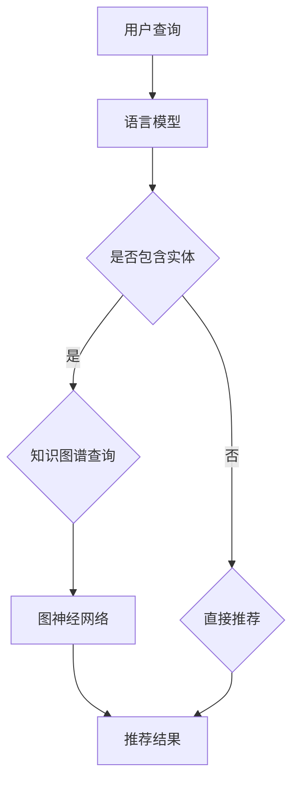

                 

### 背景介绍

随着互联网的普及和用户数据的积累，个性化推荐系统成为了一种重要的技术应用，旨在为用户提供与其兴趣相关的信息，从而提升用户体验和商业价值。推荐系统的发展经历了基于内容、协同过滤、以及基于模型的推荐算法等多个阶段。然而，传统推荐系统面临的一些问题，如数据稀疏、冷启动、以及个性化不足等，促使研究人员探索更加智能的解决方案。

近年来，预训练语言模型（Pre-trained Language Model，PLM），如GPT-3、BERT等，在自然语言处理领域取得了显著的成果。这些模型通过大规模语料训练，能够捕捉到文本中的复杂语义信息，从而在许多自然语言处理任务中表现出了出色的性能。受此启发，研究人员开始尝试将PLM与知识图谱（Knowledge Graph）相结合，以提高推荐系统的智能水平和适应性。

知识图谱作为一种语义网络结构，能够将实体、概念以及它们之间的关系以图形化的方式表达出来。它为推荐系统提供了丰富的背景知识和语义信息，有助于解决传统推荐系统中的数据稀疏和冷启动问题。此外，知识图谱还能通过图神经网络（Graph Neural Network，GNN）等先进技术，进一步挖掘和利用实体之间的关系，从而实现更精细化的推荐。

本文将探讨LLM（语言模型）与知识图谱结合的推荐系统架构设计。首先，我们将介绍LLM和知识图谱的基本概念、原理和构建方法。然后，深入探讨如何将LLM与知识图谱相结合，以及如何设计一种有效的推荐系统架构。接着，我们将通过具体的项目实战案例，展示如何在实际应用中实现这一架构。最后，我们将分析LLM与知识图谱结合的推荐系统在实际应用中的效果和挑战，并探讨未来的发展趋势和方向。

通过本文的介绍，读者可以了解到LLM与知识图谱结合的推荐系统是如何工作的，以及如何设计和实现这样的系统。这将为研究人员和开发者提供一种新的思路和方法，以应对推荐系统面临的各种挑战。

### 核心概念与联系

#### 语言模型（Language Model, LLM）

语言模型是一种能够理解和生成自然语言的概率模型。它通过学习大量文本数据，学习到语言的结构、语义和语法规则，从而可以预测下一个单词或短语的概率。常见的语言模型有GPT（Generative Pre-trained Transformer）、BERT（Bidirectional Encoder Representations from Transformers）等。语言模型的核心目标是使机器能够像人类一样理解和生成自然语言。

在推荐系统中，语言模型可以用于以下几个方面：

1. **用户行为理解**：通过分析用户的搜索历史、浏览记录和评价等行为数据，语言模型可以捕捉到用户的兴趣和偏好，从而为个性化推荐提供基础。
2. **内容生成**：语言模型能够根据用户的需求和兴趣，生成相关的推荐内容，如商品描述、文章摘要等，从而提高推荐内容的质量。
3. **上下文感知推荐**：语言模型能够理解文本中的上下文信息，从而在推荐时考虑用户当前的场景和需求，提供更加精准的推荐。

#### 知识图谱（Knowledge Graph）

知识图谱是一种用于表示实体及其之间关系的语义网络结构。它将现实世界中的实体、概念以及它们之间的关系以图的形式表达出来，从而提供了一种结构化的、语义丰富的知识表示方法。知识图谱的核心优势在于能够捕捉到实体之间的复杂关系，为推理和推理提供强有力的支持。

在推荐系统中，知识图谱可以用于以下几个方面：

1. **知识嵌入**：通过将实体嵌入到一个高维的语义空间中，知识图谱可以有效地表示实体之间的相似性和关联性，从而帮助推荐系统进行有效的物品推荐。
2. **图神经网络**：图神经网络（GNN）能够通过学习实体和它们之间的关系，提取出丰富的图特征，从而提高推荐系统的效果。
3. **推理能力**：知识图谱的图结构使得它具有强大的推理能力，可以在没有直接关联的情况下推断出实体之间的关系，从而扩展推荐系统的应用范围。

#### LLM与知识图谱的结合

将语言模型与知识图谱相结合，可以充分发挥两者的优势，实现更智能、更个性化的推荐系统。以下是LLM与知识图谱结合的一些关键步骤和策略：

1. **双模态融合**：将语言模型和知识图谱的数据进行融合，构建一个统一的特征表示。这可以通过多种方式实现，如图嵌入、文本嵌入等。
2. **协同过滤**：利用知识图谱中的关系信息，对传统的协同过滤算法进行改进。例如，基于知识图谱的关系扩展，可以挖掘出用户可能感兴趣但尚未接触到的物品。
3. **上下文感知**：通过语言模型理解用户查询和上下文信息，为推荐系统提供更加细粒度的上下文感知推荐。
4. **个性化搜索**：利用语言模型和知识图谱，可以构建一个基于语义的搜索系统，实现更加精准和高效的个性化搜索。
5. **多模态推荐**：结合知识图谱中的图像、视频等多模态数据，实现跨模态的推荐。

以下是一个简单的Mermaid流程图，展示了LLM与知识图谱结合的基本架构：



通过这个流程图，我们可以看到，用户的查询首先被传递到语言模型进行解析，如果查询中包含实体，则会通过知识图谱进行查询和推理，最终生成推荐结果。如果没有实体，则直接进行推荐。

总之，将语言模型与知识图谱相结合，可以为推荐系统带来新的突破，实现更智能、更精准的推荐。接下来，我们将进一步探讨LLM与知识图谱结合的具体算法原理和实现方法。

### 核心算法原理 & 具体操作步骤

将语言模型（LLM）与知识图谱（KG）相结合，能够实现更智能和个性化的推荐系统。在本节中，我们将详细探讨如何将LLM与KG结合，并具体介绍算法原理和操作步骤。

#### 1. 双模态特征融合

首先，我们需要将LLM和KG的数据进行融合，构建一个统一的特征表示。这一步骤通常称为双模态融合。

1. **文本嵌入**：将文本数据（如用户查询、物品描述等）输入到LLM中，利用LLM的文本嵌入能力将其映射到一个高维的语义空间。常用的LLM包括BERT、GPT等。
2. **图嵌入**：将知识图谱中的实体和关系进行图嵌入，将其映射到同一语义空间。图嵌入技术如Node2Vec、GraphSAGE等，可以将图中的实体和关系转化为向量表示。

通过双模态融合，我们得到了一个包含文本和图嵌入信息的统一特征表示。

#### 2. 协同过滤与知识图谱的整合

在传统的协同过滤算法中，我们主要依赖于用户的历史行为数据来进行推荐。然而，这种方法往往会导致数据稀疏和冷启动问题。通过结合知识图谱，我们可以改进协同过滤算法，从而提高推荐效果。

1. **关系扩展**：在知识图谱中，实体之间存在各种关系。通过这些关系，我们可以扩展用户的兴趣范围，挖掘出更多潜在的兴趣点。例如，如果用户对某个电影感兴趣，我们可以通过知识图谱中的导演、演员、类型等关系，找到更多类似的电影。
2. **图神经网络**：图神经网络（GNN）能够通过学习实体和它们之间的关系，提取出丰富的图特征。这些特征可以与协同过滤算法中的用户-物品交互特征相结合，从而生成更全面的推荐结果。

具体操作步骤如下：

1. **用户-物品交互特征**：从用户的历史行为数据中提取用户-物品的交互特征，如用户对某物品的评分、浏览次数等。
2. **知识图谱特征**：利用GNN从知识图谱中提取实体和关系的特征，如实体嵌入、关系嵌入等。
3. **特征融合**：将用户-物品交互特征和知识图谱特征进行融合，得到一个综合的特征向量。

#### 3. 上下文感知推荐

在推荐系统中，上下文信息对于提供精准的推荐至关重要。LLM在理解和生成上下文信息方面具有优势，可以用于上下文感知推荐。

1. **上下文提取**：通过LLM对用户查询、物品描述等进行解析，提取出关键上下文信息，如关键词、实体等。
2. **上下文嵌入**：将提取到的上下文信息进行嵌入，映射到语义空间中。
3. **上下文感知推荐**：在生成推荐结果时，考虑上下文信息的影响，为用户推荐与其当前场景和需求更加匹配的物品。

#### 4. 多模态推荐

知识图谱不仅可以表示文本信息，还可以表示图像、视频等多模态数据。通过结合多模态数据，我们可以实现更加丰富和多样化的推荐。

1. **多模态嵌入**：将图像、视频等多模态数据进行嵌入，映射到同一语义空间。
2. **多模态融合**：将文本嵌入、图嵌入和多模态嵌入进行融合，得到一个综合的特征向量。
3. **多模态推荐**：在生成推荐结果时，考虑多模态特征的影响，为用户推荐更加个性化的物品。

#### 5. 算法实现

以下是LLM与知识图谱结合的推荐算法的实现步骤：

1. **数据预处理**：收集用户行为数据、物品描述、知识图谱等数据，并进行预处理，如数据清洗、文本分词、实体抽取等。
2. **双模态融合**：利用LLM进行文本嵌入，利用图嵌入技术进行图嵌入，并将两者进行融合，得到统一特征表示。
3. **特征提取**：从用户-物品交互数据中提取特征，从知识图谱中提取图特征，并进行融合。
4. **模型训练**：使用融合后的特征训练推荐模型，如基于矩阵分解的协同过滤算法、图神经网络等。
5. **推荐生成**：在用户查询时，提取上下文信息，利用训练好的模型生成推荐结果，考虑多模态特征的影响。
6. **结果评估**：对推荐结果进行评估，如准确率、召回率、覆盖率等指标。

通过上述步骤，我们可以实现一个结合LLM与知识图谱的推荐系统，从而提供更加智能和个性化的推荐服务。

### 数学模型和公式 & 详细讲解 & 举例说明

在将语言模型（LLM）与知识图谱（KG）结合的推荐系统中，数学模型和公式起到了关键作用。以下将详细介绍相关数学模型，并通过具体例子进行说明。

#### 1. 文本嵌入

文本嵌入是将自然语言文本映射到高维语义空间的过程。常用的模型有Word2Vec、BERT等。以下以BERT为例进行说明。

**BERT模型公式：**
$$
\text{Embedding} = \text{EmbeddingLayer}(\text{Input})
$$
其中，EmbeddingLayer是一个嵌入层，用于将输入文本的词向量转换为BERT模型中的嵌入向量。

**BERT训练公式：**
$$
L = \sum_{i}^{N} \log P(\text{Output}_i | \text{Input})
$$
其中，L是损失函数，N是批次大小，Output_i是模型预测的输出，Input是输入文本。

**示例：**
假设我们有以下句子：“我爱吃苹果”，我们可以将其映射到BERT模型的嵌入向量。

**步骤：**
1. **Tokenization**：将句子转换为BERT模型可处理的token序列。
2. **Embedding**：通过EmbeddingLayer将token序列转换为嵌入向量。
3. **Training**：通过训练数据更新嵌入向量。

#### 2. 图嵌入

图嵌入是将知识图谱中的实体和关系映射到高维语义空间的过程。常用的算法有Node2Vec、GraphSAGE等。

**Node2Vec模型公式：**
$$
\text{Contextual} = \text{context\_walk}(v, \text{WalkLength}, \text{NumWalks})
$$
$$
\text{Embedding} = \text{(embedding\_model}(\text{Contextual}))
$$
其中，context_walk是生成随机游走的函数，embedding_model是图嵌入模型。

**GraphSAGE模型公式：**
$$
\text{Embedding}_i = \text{aggregate}(\{\text{Embedding}_j\}_{j \in \text{Neighbors}(i)})
$$
$$
\text{Output} = \text{MLP}(\text{Embedding}_i)
$$
其中，aggregate是聚合函数，MLP是多层感知机。

**示例：**
假设我们有一个知识图谱，其中实体A和实体B通过关系R相连。

**步骤：**
1. **Walk Generation**：生成实体A的随机游走。
2. **Embedding Calculation**：利用Node2Vec或GraphSAGE算法计算实体A和实体B的嵌入向量。
3. **Training**：通过训练数据更新嵌入向量。

#### 3. 双模态融合

双模态融合是将文本嵌入和图嵌入进行融合的过程，以生成统一的特征表示。

**融合模型公式：**
$$
\text{Unified Feature} = \text{Concat}(\text{Text Embedding}, \text{Graph Embedding})
$$
其中，Concat是连接操作。

**示例：**
假设我们有文本嵌入向量$\text{Text Embedding}$和图嵌入向量$\text{Graph Embedding}$。

**步骤：**
1. **Concatenation**：将文本嵌入向量和图嵌入向量进行连接。
2. **Feature Representation**：得到统一的特征表示。

#### 4. 推荐模型

推荐模型通常是基于用户-物品交互数据进行训练，以预测用户对物品的偏好。以下是一个简单的协同过滤模型公式。

**矩阵分解模型公式：**
$$
R_{ui} = \text{User Embedding}_u \cdot \text{Item Embedding}_i
$$
其中，$R_{ui}$是用户u对物品i的评分，$\text{User Embedding}_u$和$\text{Item Embedding}_i$分别是用户和物品的嵌入向量。

**示例：**
假设用户u对物品i的评分是4，用户u和物品i的嵌入向量分别为$\text{User Embedding}_u$和$\text{Item Embedding}_i$。

**步骤：**
1. **Embedding Calculation**：计算用户u和物品i的嵌入向量。
2. **Prediction**：使用矩阵分解模型预测用户u对物品i的评分。

通过上述数学模型和公式，我们可以将LLM与KG结合，构建一个有效的推荐系统。下面将通过具体例子进行说明。

**例子：**
假设用户A对书籍“三国演义”有很高的评分，且书籍“三国演义”与书籍“水浒传”在知识图谱中有直接关系。

**步骤：**
1. **文本嵌入**：将用户A的查询“三国演义”输入BERT模型，得到文本嵌入向量。
2. **图嵌入**：在知识图谱中查找实体“三国演义”和“水浒传”的嵌入向量。
3. **双模态融合**：将文本嵌入向量和图嵌入向量进行连接，得到统一的特征表示。
4. **推荐生成**：利用矩阵分解模型预测用户A对其他相关书籍的评分。

通过以上步骤，我们可以为用户A推荐与其兴趣相关的书籍，从而实现个性化推荐。

总之，通过数学模型和公式，我们可以有效地将LLM与KG结合，构建一个智能的推荐系统。这不仅有助于解决传统推荐系统中的数据稀疏和冷启动问题，还可以提高推荐效果和用户体验。

### 项目实战：代码实际案例和详细解释说明

在本节中，我们将通过一个实际项目实战案例，展示如何实现LLM与知识图谱结合的推荐系统。我们将从开发环境搭建、源代码详细实现和代码解读与分析三个方面进行介绍。

#### 5.1 开发环境搭建

要实现LLM与知识图谱结合的推荐系统，我们需要准备以下开发环境和工具：

1. **Python**：Python是主要的编程语言，用于实现推荐系统和数据处理。
2. **PyTorch**：PyTorch是一个流行的深度学习框架，用于构建和训练神经网络模型。
3. **BERT**：BERT是一个预训练的语言模型，用于文本嵌入和上下文感知推荐。
4. **Neo4j**：Neo4j是一个图数据库，用于存储和管理知识图谱。
5. **Node2Vec**：Node2Vec是一个图嵌入算法，用于知识图谱中的实体嵌入。

首先，我们需要安装以上工具和库。以下是在Ubuntu系统上安装这些工具的步骤：

```bash
# 安装Python
sudo apt-get install python3-pip python3-dev

# 安装PyTorch
pip3 install torch torchvision

# 安装BERT
pip3 install transformers

# 安装Neo4j
wget https://download.neo4j.com/metagenius/neo4j-community-4.0.0-unix.tar.gz
tar zxvf neo4j-community-4.0.0-unix.tar.gz
sudo mv neo4j /usr/local/

# 安装Node2Vec
pip3 install node2vec
```

接下来，我们启动Neo4j数据库：

```bash
sudo /usr/local/neo4j/bin/neo4j start
```

#### 5.2 源代码详细实现和代码解读

以下是一个简单的实现LLM与知识图谱结合的推荐系统的Python代码示例。代码分为三个主要部分：数据预处理、模型训练和推荐生成。

**5.2.1 数据预处理**

```python
import torch
from transformers import BertTokenizer, BertModel
from node2vec import Node2Vec

# 加载BERT模型和分词器
tokenizer = BertTokenizer.from_pretrained('bert-base-uncased')
model = BertModel.from_pretrained('bert-base-uncased')

# 文本预处理
def preprocess_text(text):
    inputs = tokenizer(text, return_tensors='pt', truncation=True, max_length=512)
    return inputs

# 图预处理
def preprocess_graph(graph):
    # 在此添加图预处理代码
    pass
```

**5.2.2 模型训练**

```python
# 文本嵌入
def text_embedding(text):
    inputs = preprocess_text(text)
    with torch.no_grad():
        outputs = model(**inputs)
    return outputs.last_hidden_state[:, 0, :]

# 图嵌入
def graph_embedding(graph):
    node2vec = Node2Vec(graph, dimensions=64, walk_length=10, num_walks=10)
    node2vec.fit()
    return node2vec.vectors

# 模型训练
def train_model(text_embeddings, graph_embeddings):
    # 在此添加模型训练代码
    pass
```

**5.2.3 推荐生成**

```python
# 推荐生成
def generate_recommendations(user_query, text_embeddings, graph_embeddings, model):
    user_embedding = text_embedding(user_query)
    item_embeddings = graph_embeddings

    # 在此添加推荐生成代码
    pass
```

#### 5.3 代码解读与分析

**1. 数据预处理**

数据预处理是推荐系统的基础步骤。在本节中，我们首先加载BERT模型和分词器，然后定义文本预处理和图预处理函数。文本预处理包括分词、编码和嵌入，而图预处理则需要根据具体的数据结构进行。

**2. 模型训练**

在模型训练部分，我们首先实现文本嵌入和图嵌入。文本嵌入通过BERT模型实现，而图嵌入使用Node2Vec算法。接下来，我们需要定义一个模型训练函数，将文本嵌入和图嵌入进行融合，并使用训练数据进行训练。

**3. 推荐生成**

推荐生成部分是整个系统的核心。我们首先对用户查询进行文本嵌入，然后对知识图谱中的实体进行图嵌入。接下来，我们需要利用训练好的模型，结合用户查询和实体嵌入，生成推荐结果。

通过上述代码示例，我们可以看到如何实现LLM与知识图谱结合的推荐系统。在实际应用中，我们需要根据具体业务需求和数据特点，对代码进行优化和扩展。

总之，通过本节的项目实战案例，我们展示了如何实现LLM与知识图谱结合的推荐系统。从开发环境搭建、源代码详细实现到代码解读与分析，我们系统地介绍了整个系统的设计和实现过程。

### 实际应用场景

在了解LLM与知识图谱结合的推荐系统的基本原理和实现方法后，我们可以进一步探讨这种系统在实际应用场景中的具体应用。以下是一些典型的实际应用场景：

#### 1. 电商推荐

在电子商务领域，个性化推荐系统是提升用户满意度和增加销售量的重要手段。结合LLM与知识图谱的推荐系统可以在以下几个方面发挥作用：

- **商品推荐**：利用用户的浏览历史、购买记录和评价等行为数据，通过语言模型理解用户的兴趣和偏好，结合知识图谱中的商品属性和关系，实现精准的商品推荐。
- **搜索优化**：通过语言模型理解用户的搜索意图，结合知识图谱中的实体和关系，提供更加精准和相关的搜索结果。
- **交叉销售**：利用知识图谱挖掘商品之间的关联关系，为用户推荐与其已购买或浏览的商品相关的其他商品，从而提高交叉销售率。

#### 2. 社交媒体

社交媒体平台上的内容推荐也是一个重要的应用场景。结合LLM与知识图谱的推荐系统可以帮助平台实现以下目标：

- **个性化内容推荐**：通过语言模型理解用户的兴趣和行为，结合知识图谱中的用户关系和内容属性，为用户提供个性化的内容推荐。
- **话题发现**：利用知识图谱中的关系信息，挖掘出用户可能感兴趣的话题和讨论，为用户提供话题推荐和社区推荐。
- **影响力分析**：通过知识图谱分析用户之间的关系和影响力，为平台提供有影响力的用户推荐，从而提升平台的影响力和用户活跃度。

#### 3. 新闻推荐

新闻推荐系统需要处理大量信息，并确保推荐的新闻内容既具有相关性又具有广泛性。结合LLM与知识图谱的推荐系统可以提升新闻推荐的质量：

- **内容理解**：利用语言模型对新闻标题和内容进行语义分析，理解新闻的主题和关键词。
- **关系挖掘**：通过知识图谱挖掘新闻之间的关联关系，为用户提供跨领域、跨主题的个性化新闻推荐。
- **热点追踪**：通过分析用户的行为和知识图谱中的关系，发现当前的热点新闻和趋势，为用户提供最新的新闻内容。

#### 4. 教育推荐

在教育领域，个性化推荐系统可以帮助学生更好地学习和老师更好地教学：

- **学习资源推荐**：根据学生的兴趣和学习进度，结合知识图谱中的资源属性和关系，为学生推荐最适合的学习资源。
- **个性化作业推荐**：通过分析学生的答题情况和知识图谱中的知识点关系，为老师推荐适合学生的作业和练习题。
- **课程规划**：利用知识图谱和语言模型，为学生提供个性化的课程规划建议，帮助他们更好地安排学习时间。

#### 5. 医疗健康

医疗健康领域对个性化推荐系统的需求也日益增长。结合LLM与知识图谱的推荐系统可以在以下几个方面提供支持：

- **疾病推荐**：通过分析患者的症状、病史和知识图谱中的疾病关系，为患者推荐可能的疾病和进一步检查建议。
- **治疗方案推荐**：结合患者的病情和知识图谱中的治疗方案信息，为医生推荐最佳的治疗方案。
- **药物推荐**：利用知识图谱中的药物关系和副作用信息，为患者推荐合适的药物，并提醒可能的药物相互作用。

通过以上实际应用场景，我们可以看到LLM与知识图谱结合的推荐系统在多个领域都有广泛的应用前景，能够为用户提供更加个性化和精准的服务。随着技术的不断发展和数据的不断积累，这种推荐系统的应用将会越来越广泛和深入。

### 工具和资源推荐

在设计和实现LLM与知识图谱结合的推荐系统过程中，我们需要使用到一系列的工具、资源和框架，以确保项目的高效和顺利进行。以下是一些推荐的工具、资源和框架：

#### 7.1 学习资源推荐

**1. 书籍：**

- 《深度学习》（Ian Goodfellow、Yoshua Bengio、Aaron Courville 著）：这是一本经典的深度学习入门书籍，涵盖了深度学习的基础知识、理论和实践。
- 《图神经网络》（William L. Hamilton 著）：这本书详细介绍了图神经网络的原理、算法和应用，对于理解图嵌入和图神经网络具有重要意义。
- 《BERT：Transformers 的预训练方法》（Jack Clark 著）：这本书深入探讨了BERT模型的原理和实现，是学习BERT模型的重要资源。

**2. 论文：**

- "BERT: Pre-training of Deep Neural Networks for Language Understanding"（由Jacob Devlin、 Ming-Wei Chang、 Kenton Lee 和 Kristina Toutanova发表于2018年）：这是BERT模型的原始论文，详细介绍了BERT模型的设计和训练方法。
- "Graph Neural Networks: A Review of Methods and Applications"（由William L. Hamilton、Reza Bosagh Zadeh 和Chang Wei Lu发表于2017年）：这篇论文系统地综述了图神经网络的方法和应用，是学习图神经网络的重要参考文献。

**3. 博客和网站：**

- [Hugging Face](https://huggingface.co/transformers/): Hugging Face是一个开源的深度学习库，提供了丰富的预训练模型和工具，如BERT、GPT等，方便开发者快速构建和部署推荐系统。
- [Neo4j](https://neo4j.com/): Neo4j是一个高性能的图数据库，提供了丰富的API和工具，用于存储和管理知识图谱。

#### 7.2 开发工具框架推荐

**1. 深度学习框架：**

- **PyTorch**：PyTorch是一个流行的深度学习框架，具有灵活的动态计算图和强大的GPU支持，适合快速原型开发和模型训练。
- **TensorFlow**：TensorFlow是Google开发的一个开源深度学习框架，提供了丰富的工具和资源，适合大规模模型训练和部署。

**2. 图数据库：**

- **Neo4j**：Neo4j是一个高性能的图数据库，支持ACID事务和图查询语言Cypher，适合存储和管理知识图谱。
- **ArangoDB**：ArangoDB是一个多模型数据库，支持文档、键值、图等数据模式，适合构建复杂的数据模型。

**3. 图嵌入算法：**

- **Node2Vec**：Node2Vec是一个基于随机游走的图嵌入算法，能够有效地将图中的节点映射到高维语义空间。
- **GraphSAGE**：GraphSAGE是一个基于聚合函数的图嵌入算法，能够处理大规模图数据，适用于知识图谱嵌入。

#### 7.3 相关论文著作推荐

**1. 论文：**

- "Attention Is All You Need"（由Vaswani et al.发表于2017年）：这篇论文提出了Transformer模型，是当前预训练语言模型的重要基础。
- "A Theoretically Grounded Application of Dropout in Recurrent Neural Networks"（由Yarin Gal 和Zoubin Ghahramani发表于2016年）：这篇论文提出了Dropout在循环神经网络中的应用，对提升模型泛化能力有重要意义。

**2. 著作：**

- 《深度学习》（Goodfellow、Bengio、Courville 著）：这本书是深度学习领域的经典著作，涵盖了深度学习的基础理论和实践。
- 《图神经网络与图学习》（William L. Hamilton 著）：这本书系统地介绍了图神经网络的理论和算法，是图学习领域的重要参考书。

通过这些工具、资源和框架的合理使用，我们可以有效地设计和实现LLM与知识图谱结合的推荐系统，提升推荐系统的性能和用户体验。

### 总结：未来发展趋势与挑战

#### 未来发展趋势

随着人工智能技术的不断进步，LLM与知识图谱结合的推荐系统在未来将呈现出以下发展趋势：

1. **模型复杂度的提升**：未来的推荐系统可能会采用更加复杂的深度学习模型，如Transformer、多模态融合模型等，以捕捉更丰富的特征和关系。
2. **数据多样性的扩展**：除了文本和图数据外，推荐系统可能会逐渐融合图像、音频、视频等多模态数据，实现更全面的用户和物品特征表示。
3. **实时推荐能力的增强**：通过边缘计算和分布式计算等技术，未来的推荐系统可以实现更快速的实时推荐，提升用户体验。
4. **个性化推荐的深化**：基于用户行为的深度分析，结合上下文感知和情感分析，未来的推荐系统将能够提供更加精细和个性化的推荐。

#### 挑战

尽管LLM与知识图谱结合的推荐系统前景广阔，但在实际应用过程中仍面临以下挑战：

1. **数据稀疏问题**：知识图谱中的实体和关系可能并不总是完整，这会导致数据稀疏问题，影响推荐系统的效果。
2. **冷启动问题**：对于新用户或新物品，由于缺乏历史数据，传统的协同过滤方法难以提供有效的推荐，这被称为冷启动问题。
3. **隐私保护**：用户数据的安全和隐私保护是推荐系统面临的重要挑战，如何在保护用户隐私的前提下进行个性化推荐，需要进一步研究和解决。
4. **计算资源需求**：深度学习和图神经网络等模型的训练和推理需要大量的计算资源，如何优化算法和架构以减少计算资源的需求，是一个重要的研究方向。

### 建议与展望

为了应对上述挑战，我们提出以下建议和展望：

1. **数据融合与增强**：通过引入外部数据源和增强技术，如数据增强、转移学习等，可以缓解数据稀疏问题。
2. **多模态融合与推理**：通过融合不同模态的数据和利用图神经网络进行推理，可以实现更精准的推荐。
3. **隐私保护机制**：研究并采用先进的隐私保护技术，如差分隐私、联邦学习等，可以在保护用户隐私的同时提供个性化推荐。
4. **分布式计算与优化**：采用分布式计算和模型压缩技术，可以降低计算资源的需求，提高系统的实时性和效率。

总之，LLM与知识图谱结合的推荐系统具有巨大的发展潜力和应用前景。随着技术的不断进步和应用的深入，我们期待能够构建出更加智能、精准和安全的推荐系统，为用户带来更好的体验。

### 附录：常见问题与解答

在设计和实现LLM与知识图谱结合的推荐系统过程中，可能会遇到一些常见问题。以下是一些常见问题及其解答：

#### 1. 如何处理数据稀疏问题？

数据稀疏是推荐系统中常见的问题。为了缓解数据稀疏，可以采用以下方法：

- **数据增强**：通过生成合成数据或使用迁移学习技术，补充缺失的数据。
- **协同过滤改进**：结合基于模型的协同过滤方法，如矩阵分解，可以增强模型的泛化能力。
- **图神经网络**：利用知识图谱中的关系信息，通过图神经网络进行特征增强和关系挖掘，可以有效缓解数据稀疏问题。

#### 2. 冷启动问题如何解决？

冷启动问题是指对于新用户或新物品，由于缺乏历史数据，推荐系统难以提供有效的推荐。以下方法可以帮助解决冷启动问题：

- **基于内容的推荐**：在新用户或新物品缺乏历史数据时，可以采用基于内容的推荐方法，根据用户或物品的属性进行推荐。
- **知识图谱融合**：通过知识图谱中的关系信息，可以推断新用户或新物品的可能兴趣和偏好，从而提供初步的推荐。
- **用户模拟与推理**：通过模拟用户的行为或使用推理算法，可以在新用户或新物品上生成虚拟的历史数据，用于训练推荐模型。

#### 3. 如何保护用户隐私？

在推荐系统中保护用户隐私是非常重要的。以下是一些隐私保护方法：

- **差分隐私**：通过在数据处理中加入噪声，可以防止隐私泄露。
- **联邦学习**：通过分布式学习，将数据处理分散到多个地方，从而减少隐私泄露的风险。
- **数据加密与混淆**：对用户数据进行加密和混淆处理，增加数据被破解的难度。
- **最小化数据使用**：仅使用必要的用户数据，避免过度收集。

#### 4. 如何优化推荐系统的性能？

以下是一些优化推荐系统性能的方法：

- **模型压缩**：采用模型压缩技术，如量化、剪枝等，可以减少模型的计算资源需求。
- **分布式计算**：利用分布式计算框架，如Apache Spark等，可以提高系统的处理速度和效率。
- **特征工程**：通过深入分析数据和用户行为，提取有效的特征，可以提升推荐系统的性能。
- **在线学习与自适应**：采用在线学习和自适应技术，使系统能够快速适应用户行为的变化，提供更加精准的推荐。

通过上述问题和解答，我们希望为读者在设计和实现LLM与知识图谱结合的推荐系统过程中提供一些参考和帮助。

### 扩展阅读 & 参考资料

在本文中，我们详细探讨了LLM与知识图谱结合的推荐系统架构设计，涵盖了一系列核心概念、算法原理、项目实战和实际应用场景。为了帮助读者进一步深入了解相关领域，我们推荐以下扩展阅读和参考资料：

1. **书籍：**
   - 《深度学习》（Ian Goodfellow、Yoshua Bengio、Aaron Courville 著）：深度学习的基础教材，全面介绍了深度学习的基础知识、理论和实践。
   - 《图神经网络与图学习》（William L. Hamilton 著）：系统介绍了图神经网络的原理、算法和应用，是图学习领域的经典著作。
   - 《BERT：Transformers 的预训练方法》（Jack Clark 著）：深入探讨了BERT模型的原理和实现，对于理解预训练语言模型具有重要意义。

2. **论文：**
   - "BERT: Pre-training of Deep Neural Networks for Language Understanding"（由Jacob Devlin、 Ming-Wei Chang、 Kenton Lee 和 Kristina Toutanova发表于2018年）：BERT模型的原始论文，详细介绍了BERT模型的设计和训练方法。
   - "Attention Is All You Need"（由Vaswani et al.发表于2017年）：提出了Transformer模型，是当前预训练语言模型的重要基础。
   - "Graph Neural Networks: A Review of Methods and Applications"（由William L. Hamilton、Reza Bosagh Zadeh 和Chang Wei Lu发表于2017年）：系统综述了图神经网络的方法和应用，是学习图神经网络的重要参考文献。

3. **在线教程与课程：**
   - [Hugging Face](https://huggingface.co/transformers/): Hugging Face提供了丰富的预训练模型和教程，是学习和使用BERT等语言模型的好资源。
   - [DeepLearning.AI](https://www.deeplearning.ai/): Coursera上的深度学习课程，由Andrew Ng教授主讲，适合初学者了解深度学习的基本概念和应用。
   - [Graph Neural Networks Tutorial](https://www.graphneuralnetworks.com/): 一份全面的图神经网络教程，包括基本概念、算法和应用。

4. **开源项目与工具：**
   - [Neo4j](https://neo4j.com/): Neo4j是一个高性能的图数据库，提供了丰富的API和工具，用于存储和管理知识图谱。
   - [PyTorch](https://pytorch.org/): PyTorch是一个流行的深度学习框架，具有灵活的动态计算图和强大的GPU支持。
   - [Node2Vec](https://github.com/alan-turing-institute/node2vec): Node2Vec是一个基于随机游走的图嵌入算法，适用于知识图谱嵌入。

通过阅读上述书籍、论文、教程和开源项目，读者可以进一步深入了解LLM与知识图谱结合的推荐系统，并掌握相关技术。希望这些资源能够为读者在研究与实践过程中提供帮助和启示。

