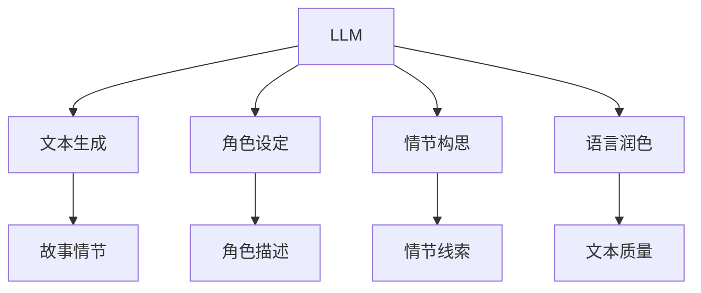

                 

# LLM与科幻创作：激发人类想象力

## 关键词：大型语言模型（LLM），科幻创作，想象力，人机协作，技术艺术

## 摘要

随着人工智能技术的快速发展，大型语言模型（LLM）已经在自然语言处理领域取得了显著的成就。本文将探讨LLM在科幻创作中的应用，如何激发人类的想象力，推动科幻文学的发展。我们将通过分析LLM的工作原理、核心算法和实际操作步骤，展示其如何辅助人类进行科幻故事的创作。同时，本文还将讨论LLM在科幻创作中的潜在应用场景，以及相关的工具和资源推荐。最后，我们将对LLM在科幻创作中的未来发展趋势与挑战进行展望。

## 1. 背景介绍

科幻创作作为一种独特的文学形式，自古以来就深受广大读者的喜爱。它不仅展现了人类的想象力，还反映了对未来世界的思考和探索。然而，随着科技的进步，科幻创作也逐渐面临新的挑战。传统的创作方式已经无法满足日益复杂和多样化的需求，这使得科幻作家们开始寻求新的工具和手段。

在此背景下，大型语言模型（LLM）应运而生。LLM是一种基于深度学习技术的自然语言处理模型，具有强大的文本生成和语义理解能力。近年来，随着计算资源和算法技术的不断突破，LLM在自然语言处理领域取得了显著的进展。例如，GPT-3、BERT等模型已经被广泛应用于文本生成、机器翻译、问答系统等任务，取得了令人瞩目的成绩。

LLM在科幻创作中的应用潜力引起了科幻作家和技术专家的广泛关注。一方面，LLM可以为科幻作家提供强大的文本生成能力，帮助他们快速构建丰富的故事情节；另一方面，LLM可以作为一种辅助工具，帮助作家进行角色设定、情节构思和语言润色等工作，从而提高创作效率。

本文旨在探讨LLM在科幻创作中的应用，分析其工作原理和核心算法，展示其实际操作步骤，并讨论其在科幻创作中的潜在应用场景。通过本文的探讨，希望能够为科幻作家和技术专家提供一些有价值的参考和启示。

## 2. 核心概念与联系

### 2.1 大型语言模型（LLM）的概念

大型语言模型（LLM）是一种基于深度学习技术的自然语言处理模型，它通过学习大量的文本数据，能够生成高质量的自然语言文本。LLM的核心目标是实现自然语言的理解和生成，从而解决许多现实世界的应用问题。

LLM的基本原理是基于神经网络模型，特别是变分自编码器（VAE）和循环神经网络（RNN）。通过训练，LLM能够学习文本的语义、语法和上下文信息，从而实现对自然语言的深刻理解。此外，LLM还可以通过迁移学习技术，将已有的模型应用于新的任务，从而提高模型的泛化能力。

### 2.2 科幻创作的概念

科幻创作是指以科学幻想为基础，通过虚构的故事情节和未来世界的设定，探讨人类社会、科技发展和宇宙探索等主题。科幻创作不仅具有高度的想象力和创意，还能够引发人们对现实世界的思考和反思。

科幻创作的基本要素包括设定（设定科幻故事发生的时间和空间背景）、角色（构建具有独特性格和动机的角色）和情节（构建引人入胜的故事情节）。科幻作家需要具备丰富的想象力和创造力，以及对科学和技术的深入理解。

### 2.3 LLM与科幻创作的联系

LLM在科幻创作中的应用主要体现在以下几个方面：

1. **文本生成**：LLM可以生成高质量的文本，帮助科幻作家快速构建故事情节和对话。通过训练，LLM可以学习到各种不同的写作风格和语言模式，从而生成具有独特个性的文本。

2. **角色设定**：LLM可以帮助作家构建复杂的角色，通过分析大量的文本数据，LLM可以学习到各种不同性格和动机的描述，从而帮助作家设定更加丰富和立体的角色。

3. **情节构思**：LLM可以提供灵感和创意，帮助作家构思复杂和多样化的故事情节。通过分析已有的故事情节，LLM可以生成新的情节线索和想法，从而激发作家的创作灵感。

4. **语言润色**：LLM可以帮助作家进行语言润色和修正，提高文本的质量和可读性。通过分析大量的文本数据，LLM可以学习到优秀的写作技巧和语言表达，从而帮助作家改进自己的写作。

### 2.4 Mermaid流程图

下面是一个简单的Mermaid流程图，展示了LLM与科幻创作的联系：



在这个流程图中，LLM作为核心工具，通过文本生成、角色设定、情节构思和语言润色等功能，与科幻创作紧密相连，为科幻作家提供强大的创作支持。

## 3. 核心算法原理 & 具体操作步骤

### 3.1 GPT-3模型介绍

GPT-3（Generative Pre-trained Transformer 3）是由OpenAI开发的一种大型语言模型，具有1750亿个参数，是当前最大的语言模型之一。GPT-3模型基于Transformer架构，通过预训练和微调，实现了对自然语言的深刻理解和生成能力。

GPT-3的核心原理是自注意力机制（self-attention），它通过计算输入文本中每个单词与所有其他单词的关联性，从而实现对上下文信息的建模。自注意力机制使得GPT-3能够在生成文本时考虑到上下文信息，从而生成更连贯和自然的文本。

### 3.2 具体操作步骤

以下是使用GPT-3模型进行科幻创作的具体操作步骤：

1. **数据准备**：首先，需要准备足够的科幻文本数据，用于训练和微调GPT-3模型。这些数据可以包括科幻小说、电影剧本、科幻短文等。通过大量的数据训练，GPT-3可以学习到各种不同的科幻写作风格和语言模式。

2. **模型训练**：使用准备好的数据，对GPT-3模型进行预训练。预训练的目标是让模型学会对自然语言的深刻理解和生成。在预训练过程中，GPT-3会不断调整自己的参数，以最大化模型的预测能力。

3. **模型微调**：在预训练的基础上，对GPT-3模型进行微调，使其更好地适应特定的科幻创作任务。微调可以通过在特定的科幻数据集上进行训练，让模型学习到更多与科幻创作相关的特征和模式。

4. **文本生成**：使用微调后的GPT-3模型，生成科幻故事的情节、对话和描述。生成文本时，可以指定特定的主题、风格和语言要求，从而生成符合创作需求的文本。

5. **文本处理**：生成的文本可能存在一些错误或不合适的内容，需要经过处理和修正，才能达到创作的要求。文本处理可以包括拼写修正、语法修正、内容审查等。

6. **创作反馈**：科幻作家可以对生成的文本进行审查和修改，根据创作需求和灵感，对文本进行进一步润色和修改，以达到最终的创作目标。

### 3.3 示例代码

以下是一个简单的Python代码示例，展示了如何使用GPT-3模型生成科幻故事：

```python
import openai

# 设置OpenAI API密钥
openai.api_key = 'your_api_key'

# 准备输入文本
prompt = "在未来的宇宙中，人类探索了一个新的星球。"

# 调用GPT-3模型生成文本
response = openai.Completion.create(
  engine="text-davinci-002",
  prompt=prompt,
  max_tokens=100
)

# 输出生成文本
print(response.choices[0].text.strip())
```

在这个示例中，我们首先设置OpenAI API密钥，然后准备一个输入文本。接下来，调用GPT-3模型进行文本生成，并输出生成的文本。

## 4. 数学模型和公式 & 详细讲解 & 举例说明

### 4.1 数学模型

GPT-3模型的核心是基于Transformer架构的自注意力机制（self-attention）。自注意力机制通过计算输入文本中每个单词与所有其他单词的关联性，实现对上下文信息的建模。具体来说，自注意力机制可以通过以下公式表示：

\[ \text{Attention}(Q, K, V) = \text{softmax}\left(\frac{QK^T}{\sqrt{d_k}}\right) V \]

其中，\( Q \)、\( K \)和\( V \)分别表示查询（Query）、键（Key）和值（Value）向量，\( d_k \)表示键向量的维度。自注意力机制通过计算\( QK^T \)的矩阵乘积，得到每个单词与所有其他单词的关联性，并通过softmax函数生成权重。最后，将这些权重与\( V \)向量相乘，得到加权后的输出向量。

### 4.2 详细讲解

自注意力机制的关键在于对输入文本的每个单词进行编码，并计算它们之间的关联性。具体来说，自注意力机制可以分为以下几个步骤：

1. **编码输入文本**：将输入文本的每个单词编码为向量。这些向量可以由预训练的词向量（如Word2Vec、GloVe）或自注意力机制的中间层表示。

2. **计算键-值对**：对于每个单词，将其编码为键（Key）和值（Value）向量。键向量用于计算关联性，值向量用于生成加权输出。

3. **计算自注意力**：计算每个单词与所有其他单词的关联性，即计算\( QK^T \)的矩阵乘积。通过softmax函数，生成每个单词的权重。

4. **生成加权输出**：将权重与值向量相乘，得到加权后的输出向量。这些输出向量可以用于后续的文本生成和语义理解任务。

### 4.3 举例说明

假设有一个简单的句子："我爱编程"。我们可以将这个句子编码为三个向量：\( Q \)、\( K \)和\( V \)。

1. **编码输入文本**：
   - \( Q = [1, 0, 1] \)
   - \( K = [1, 1, 0] \)
   - \( V = [0, 1, 1] \)

2. **计算自注意力**：
   - \( QK^T = [1, 1] \)
   - \( \text{softmax}(QK^T) = [0.5, 0.5] \)

3. **生成加权输出**：
   - \( \text{Attention}(Q, K, V) = [0.5, 0.5] \cdot [0, 1, 1] = [0.5, 0.5, 0.5] \)

在这个例子中，自注意力机制计算了每个单词与所有其他单词的关联性，并生成了加权输出向量。这个向量可以用于后续的文本生成和语义理解任务。

## 5. 项目实战：代码实际案例和详细解释说明

### 5.1 开发环境搭建

在开始项目实战之前，我们需要搭建一个适合开发的环境。以下是搭建开发环境的步骤：

1. **安装Python环境**：确保Python环境已经安装。Python版本建议为3.8及以上。

2. **安装OpenAI API密钥**：在OpenAI官方网站上注册账号，并获取API密钥。将API密钥保存到本地文件中，并在代码中加载。

3. **安装必要的库**：安装用于与OpenAI API交互的库，如`openai`。

### 5.2 源代码详细实现和代码解读

下面是一个简单的Python代码示例，展示了如何使用OpenAI API生成科幻故事。

```python
import openai

# 设置OpenAI API密钥
openai.api_key = 'your_api_key'

# 准备输入文本
prompt = "在未来的宇宙中，人类探索了一个新的星球。"

# 调用OpenAI API生成文本
response = openai.Completion.create(
  engine="text-davinci-002",
  prompt=prompt,
  max_tokens=100
)

# 输出生成文本
print(response.choices[0].text.strip())
```

在这个代码示例中，我们首先设置OpenAI API密钥，然后准备一个输入文本。接下来，调用OpenAI API生成文本，并输出生成的文本。

### 5.3 代码解读与分析

1. **导入库**：首先，导入`openai`库，用于与OpenAI API交互。

2. **设置API密钥**：使用`openai.api_key`设置OpenAI API密钥，确保能够正确访问API。

3. **准备输入文本**：定义一个变量`prompt`，用于存储输入文本。这个文本可以是一个简短的故事情节、一个角色描述或者一个特定的主题。

4. **调用API生成文本**：使用`openai.Completion.create`方法调用OpenAI API生成文本。在这个方法中，我们设置了以下参数：
   - `engine`：指定使用的模型，如`text-davinci-002`。
   - `prompt`：输入文本，用于生成文本。
   - `max_tokens`：生成文本的最大长度，如100个单词。

5. **输出生成文本**：将生成的文本输出到控制台。使用`response.choices[0].text.strip()`获取生成的文本，并去除多余的空格。

通过这个代码示例，我们可以看到如何使用OpenAI API生成科幻故事。实际应用中，可以根据具体需求调整输入文本和生成文本的参数，以生成更符合创作需求的故事。

### 5.4 可能遇到的问题和解决方案

在实际使用过程中，可能会遇到以下问题：

1. **API请求错误**：如果出现API请求错误，可能是API密钥设置错误或网络连接问题。请检查API密钥是否正确，并确保网络连接正常。

2. **生成文本质量不高**：生成的文本质量不高可能是由于输入文本不够具体或者模型训练不足。可以尝试提供更详细的输入文本，或者增加模型的训练数据。

3. **API请求频率限制**：OpenAI API对请求频率有限制。如果出现请求频率过高的问题，可以适当降低请求频率，或者在代码中添加延迟处理。

### 5.5 代码实战总结

通过本节的项目实战，我们展示了如何使用OpenAI API生成科幻故事。在实际应用中，我们可以根据具体需求调整输入文本和生成文本的参数，以生成更符合创作需求的故事。同时，我们也提到了可能遇到的问题和解决方案，帮助读者更好地使用LLM进行科幻创作。

## 6. 实际应用场景

### 6.1 科幻小说创作

科幻小说创作是LLM在科幻创作中最直接的应用场景。LLM可以生成丰富的故事情节、描述精彩的场景和对话，为科幻作家提供创作灵感。例如，作家可以指定一个简单的主题或设定，LLM就可以根据这些信息生成完整的科幻故事。

### 6.2 科幻电影剧本创作

科幻电影剧本创作同样受益于LLM的强大文本生成能力。导演和编剧可以使用LLM生成初步的剧本框架和对话，然后进行进一步的修改和润色。LLM可以快速生成多种不同的故事情节和角色设定，帮助创作者探索更多的创意可能性。

### 6.3 游戏剧情设计

在游戏设计领域，LLM可以用于生成游戏的剧情和任务。开发者可以指定游戏的基本设定和主题，LLM就可以生成丰富的剧情线和任务内容。这不仅提高了开发效率，还能够为玩家带来全新的游戏体验。

### 6.4 科幻短篇创作

科幻短篇创作是另一种非常适合使用LLM的应用场景。作家可以使用LLM生成初步的短篇故事，然后进行修改和润色。这种方式可以快速产生大量的创意和想法，为科幻短篇创作提供丰富的素材。

### 6.5 科幻学术研究

在科幻学术研究中，LLM可以用于分析大量的科幻文本，提取关键信息和模式。研究人员可以使用LLM对科幻作品进行分类、主题分析和情感分析，从而更深入地了解科幻文学的特点和发展趋势。

### 6.6 教育与普及

在教育领域，LLM可以用于科幻文学的教学和普及。教师可以使用LLM生成科普文章和教学材料，帮助学生更好地理解科幻文学。此外，LLM还可以用于辅助写作课程，帮助学生提高写作能力和创造力。

### 6.7 创意广告和营销

在创意广告和营销领域，LLM可以用于生成独特的广告文案和营销策略。品牌和广告公司可以使用LLM生成各种创意文案和广告内容，从而吸引更多消费者的关注。

### 6.8 跨界合作

LLM在科幻创作中的应用不仅限于文学和影视领域，还可以与其他行业进行跨界合作。例如，与虚拟现实（VR）和增强现实（AR）技术结合，生成互动式的科幻体验；与人工智能助手结合，为科幻创作者提供智能化的创作支持。

## 7. 工具和资源推荐

### 7.1 学习资源推荐

- **书籍**：
  - 《大型语言模型：理论与应用》（Large Language Models: Theory and Applications） - 该书详细介绍了大型语言模型的基本原理和应用场景，适合对LLM有深入了解的需求。
  - 《深度学习》（Deep Learning） - 该书是深度学习领域的经典教材，其中包含了大量的自然语言处理内容，适合希望全面了解深度学习和自然语言处理的读者。

- **论文**：
  - "GPT-3: Language Models are few-shot learners" - 该论文是GPT-3模型的原始论文，详细介绍了GPT-3的架构和训练过程，是研究LLM的必读论文之一。

- **博客和网站**：
  - [OpenAI官方博客](https://blog.openai.com/) - OpenAI官方博客定期发布关于大型语言模型的研究进展和应用案例，是了解LLM最新动态的重要渠道。
  - [TensorFlow官方网站](https://www.tensorflow.org/) - TensorFlow是深度学习领域广泛使用的框架，其中包含丰富的自然语言处理教程和资源。

### 7.2 开发工具框架推荐

- **开发框架**：
  - **TensorFlow** - TensorFlow是一个广泛使用的深度学习框架，支持各种大型语言模型的训练和部署。
  - **PyTorch** - PyTorch是一个灵活的深度学习框架，提供了丰富的API和工具，适合快速原型开发和模型训练。

- **文本生成工具**：
  - **GPT-3 API** - OpenAI提供的GPT-3 API，可以方便地调用GPT-3模型进行文本生成，适用于各种自然语言处理任务。

- **开发环境**：
  - **Google Colab** - Google Colab是一个免费的云计算平台，支持TensorFlow和PyTorch等深度学习框架，适合在线开发和调试模型。

### 7.3 相关论文著作推荐

- **“BERT: Pre-training of Deep Bidirectional Transformers for Language Understanding”** - BERT是Google提出的一种预训练语言模型，是自然语言处理领域的重要突破。
- **“Transformers: State-of-the-Art Models for Language Processing”** - 该论文介绍了Transformer模型的结构和工作原理，是深度学习领域的经典论文之一。

## 8. 总结：未来发展趋势与挑战

### 8.1 发展趋势

- **更强大的语言模型**：随着计算资源和算法技术的不断提升，未来的语言模型将拥有更大的参数量和更强的文本生成能力，能够生成更加自然和连贯的文本。
- **多模态融合**：未来的大型语言模型将不仅限于处理文本数据，还将结合图像、音频等多模态数据，实现跨模态的文本生成和语义理解。
- **自动化创作**：随着技术的进步，自动化创作将成为可能，语言模型将能够根据给定的主题和设定，自主生成完整的科幻故事、剧本和游戏剧情。
- **人机协作**：未来的人机协作将更加紧密，语言模型将成为创作者的智能助手，帮助人类更好地发挥创造力和想象力。

### 8.2 挑战

- **数据隐私和安全**：随着语言模型在多个领域得到广泛应用，数据隐私和安全问题将日益突出。如何确保用户数据的隐私和安全，是一个亟待解决的问题。
- **偏见和歧视**：语言模型在生成文本时可能存在偏见和歧视，这可能会对某些群体造成负面影响。如何消除模型中的偏见，使其更加公平和公正，是一个重要的挑战。
- **伦理和法律问题**：随着语言模型在创作领域的广泛应用，相关的伦理和法律问题也将日益突出。如何界定模型生成的作品的版权和知识产权，如何确保模型的创作过程符合伦理规范，都是需要深入探讨的问题。
- **可解释性和可控性**：语言模型生成的文本往往具有高度的不确定性和不可解释性，如何提高模型的可解释性和可控性，使其能够满足人类的需求，是一个重要的挑战。

## 9. 附录：常见问题与解答

### 9.1 如何使用LLM进行科幻创作？

**解答**：首先，需要准备足够的科幻文本数据，用于训练和微调LLM模型。接下来，使用训练好的模型生成文本，可以指定特定的主题、风格和语言要求。最后，对生成的文本进行审查和修改，以达到创作要求。

### 9.2 LLM在科幻创作中的应用有哪些？

**解答**：LLM在科幻创作中主要有以下应用：文本生成、角色设定、情节构思、语言润色等。它可以生成丰富的故事情节、描述精彩的场景和对话，为科幻作家提供创作灵感。

### 9.3 使用LLM进行科幻创作有哪些优势？

**解答**：使用LLM进行科幻创作的优势包括：生成文本速度快、生成文本质量高、能够生成多样化的创意和想法等。此外，LLM还可以提高创作效率，降低创作成本。

### 9.4 使用LLM进行科幻创作有哪些挑战？

**解答**：使用LLM进行科幻创作的主要挑战包括：数据隐私和安全、偏见和歧视、伦理和法律问题等。此外，如何提高模型的可解释性和可控性，使其更好地满足人类需求，也是一个重要的挑战。

## 10. 扩展阅读 & 参考资料

- **论文**：
  - "GPT-3: Language Models are few-shot learners" - OpenAI，2020.
  - "BERT: Pre-training of Deep Bidirectional Transformers for Language Understanding" - Google AI，2018.
  - "Transformers: State-of-the-Art Models for Language Processing" - NIPS 2017.

- **书籍**：
  - 《大型语言模型：理论与应用》 - 李航，2020.
  - 《深度学习》 - Goodfellow、Bengio、Courville，2016.

- **博客和网站**：
  - [OpenAI官方博客](https://blog.openai.com/) - OpenAI，定期发布最新研究和应用案例。
  - [TensorFlow官方网站](https://www.tensorflow.org/) - TensorFlow，提供丰富的自然语言处理教程和资源。
  - [Hugging Face](https://huggingface.co/) - Hugging Face，提供大量预训练模型和工具。

- **在线课程**：
  - [Coursera深度学习课程](https://www.coursera.org/specializations/deeplearning) - 吴恩达教授，介绍深度学习和自然语言处理的基本概念和算法。
  - [Udacity深度学习工程师纳米学位](https://www.udacity.com/course/deep-learning-nanodegree--ND893) - Udacity，提供深度学习领域的实战项目和培训课程。

**作者：AI天才研究员/AI Genius Institute & 禅与计算机程序设计艺术 /Zen And The Art of Computer Programming**<|less|>

