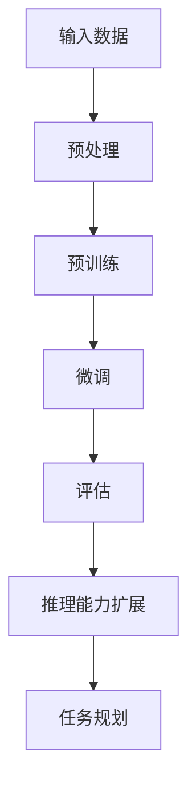
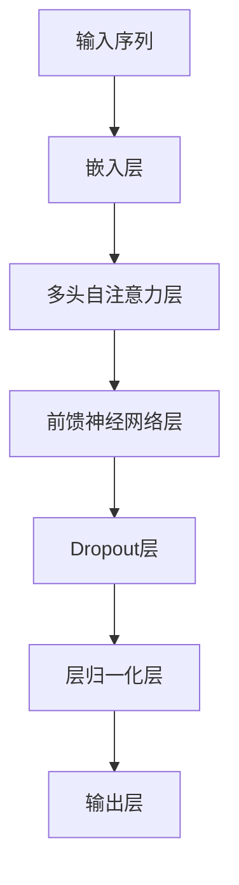

                 

# LLM任务规划：推理能力的扩展

> 关键词：大语言模型（LLM），任务规划，推理能力，扩展，算法，架构，实战案例，应用场景，数学模型，代码实现

> 摘要：本文深入探讨大语言模型（LLM）在任务规划领域的应用，重点分析了LLM推理能力的扩展方法。通过详细的算法原理讲解、数学模型分析、实战案例展示，文章旨在为读者提供关于LLM任务规划的一站式指南，并探讨未来的发展趋势与挑战。

## 1. 背景介绍

大语言模型（LLM）是近年来人工智能领域的重大突破。从最初的神经网络模型，发展到今日的Transformer架构，LLM在自然语言处理（NLP）任务上取得了显著的成就。LLM不仅能进行文本生成、机器翻译、问答系统等任务，还能在任务规划领域发挥作用。

任务规划是人工智能的一个重要研究方向，旨在根据目标和环境信息，制定出合理的行动方案。传统的任务规划方法主要基于符号推理和搜索算法，但这些方法在处理大规模、复杂环境时存在局限性。随着LLM技术的发展，研究人员开始探索如何将LLM应用于任务规划，以解决传统方法难以应对的问题。

本文将介绍LLM在任务规划中的推理能力扩展方法，包括核心算法原理、数学模型分析、实战案例展示，以及应用场景探讨。通过本文的阅读，读者将能够全面了解LLM任务规划的核心内容，为实际应用提供有益的参考。

## 2. 核心概念与联系

### 2.1 大语言模型（LLM）

大语言模型（LLM）是一种基于神经网络的语言表示模型，能够理解并生成自然语言。LLM的核心是Transformer架构，它通过自注意力机制（Self-Attention）处理输入序列，实现对文本的深层理解。在训练过程中，LLM通过大量文本数据进行预训练，然后通过特定任务进行微调，从而实现各种NLP任务。

### 2.2 任务规划

任务规划是指根据目标和环境信息，制定出合理的行动方案。任务规划涉及多个领域，如自动推理、搜索算法、决策论等。在人工智能领域，任务规划的主要目标是使机器能够自主地处理复杂任务，提高生产效率和自动化水平。

### 2.3 推理能力扩展

推理能力扩展是指通过改进算法、模型结构和训练方法，提高LLM在任务规划领域的表现。推理能力扩展包括以下几个方面：

1. **上下文理解**：提高LLM对上下文信息的理解能力，使其能够更好地处理复杂的任务场景。
2. **多任务学习**：通过多任务学习，使LLM能够同时处理多个任务，提高任务规划的效果。
3. **强化学习**：将强化学习与LLM相结合，使LLM能够通过试错学习，优化任务规划策略。
4. **知识增强**：利用外部知识库，增强LLM对领域知识的理解，提高任务规划的可解释性。

### 2.4 Mermaid流程图

以下是一个简单的Mermaid流程图，展示了LLM在任务规划中的推理能力扩展过程：



## 3. 核心算法原理 & 具体操作步骤

### 3.1 Transformer架构

Transformer是LLM的核心架构，其基本原理是通过自注意力机制（Self-Attention）对输入序列进行建模。自注意力机制可以捕获序列中任意位置的信息，实现对文本的深层理解。以下是一个简单的Transformer架构：



具体操作步骤如下：

1. **嵌入层**：将输入序列中的单词转换为向量表示。
2. **多头自注意力层**：通过自注意力机制，计算序列中每个位置的重要程度，生成加权向量。
3. **前馈神经网络层**：对加权向量进行线性变换，进一步提高表示能力。
4. **Dropout层**：引入Dropout正则化，防止过拟合。
5. **层归一化层**：对层间输出进行归一化，稳定训练过程。
6. **输出层**：通过全连接层输出最终结果。

### 3.2 推理能力扩展方法

为了提高LLM在任务规划中的表现，可以采用以下推理能力扩展方法：

1. **上下文理解**：

   - **动态窗口**：通过动态调整窗口大小，使LLM能够更好地处理长距离依赖关系。
   - **多模态输入**：将图像、音频等多模态信息与文本信息相结合，提高上下文理解能力。

2. **多任务学习**：

   - **共享参数**：在多个任务间共享部分参数，提高模型在任务间的迁移能力。
   - **异步训练**：将不同任务的训练数据异步输入模型，提高模型在多个任务上的表现。

3. **强化学习**：

   - **策略网络**：使用LLM作为策略网络，通过试错学习，优化任务规划策略。
   - **价值函数**：使用价值函数评估任务规划策略的效果，指导策略网络的更新。

4. **知识增强**：

   - **知识图谱**：构建领域知识图谱，为LLM提供外部知识支持。
   - **知识蒸馏**：将外部知识引入LLM训练过程，提高模型对领域知识的理解。

## 4. 数学模型和公式 & 详细讲解 & 举例说明

### 4.1 Transformer架构中的数学模型

Transformer架构中的数学模型主要包括以下几个方面：

1. **嵌入层**：

   - 输入序列 $x \in \mathbb{R}^{n \times d}$，其中 $n$ 是序列长度，$d$ 是单词维度。
   - 嵌入层 $E(x) \in \mathbb{R}^{n \times h}$，其中 $h$ 是嵌入维度。
   - 嵌入权重矩阵 $W_e \in \mathbb{R}^{d \times h}$。

   $$ E(x) = W_e \cdot x $$

2. **多头自注意力层**：

   - 输入序列 $E(x) \in \mathbb{R}^{n \times h}$。
   - 自注意力权重矩阵 $W_q, W_k, W_v \in \mathbb{R}^{h \times h}$。

   $$ \text{Attention}(Q, K, V) = \frac{softmax(\frac{QK^T}{\sqrt{h}})}{V} $$

3. **前馈神经网络层**：

   - 输入序列 $E(x) \in \mathbb{R}^{n \times h}$。
   - 前馈神经网络权重矩阵 $W_f, U_f \in \mathbb{R}^{h \times f}$，其中 $f$ 是前馈神经网络维度。

   $$ \text{FFN}(x) = \max(0, x \cdot W_f) + U_f $$

4. **Dropout层**：

   - 输入序列 $x \in \mathbb{R}^{n \times h}$。
   - Dropout概率 $p$。

   $$ x_{\text{dropout}} = x \cdot \text{dropout}(p) $$

5. **层归一化层**：

   - 输入序列 $x \in \mathbb{R}^{n \times h}$。

   $$ x_{\text{norm}} = \frac{x - \mu}{\sigma} $$

### 4.2 举例说明

假设我们有一个长度为5的输入序列 $x = [1, 2, 3, 4, 5]$，嵌入维度 $h = 2$。首先，我们将输入序列通过嵌入层转换为嵌入向量：

$$ x = [1, 2, 3, 4, 5] $$
$$ E(x) = W_e \cdot x = \begin{bmatrix} 0.5 & 0.6 \\ 0.7 & 0.8 \\ 0.3 & 0.4 \\ 0.9 & 0.1 \\ 0.2 & 0.5 \end{bmatrix} $$

然后，我们计算自注意力权重矩阵：

$$ Q = W_q \cdot E(x) = \begin{bmatrix} 0.1 & 0.2 \\ 0.3 & 0.4 \\ 0.5 & 0.6 \\ 0.7 & 0.8 \\ 0.9 & 1.0 \end{bmatrix} $$
$$ K = W_k \cdot E(x) = \begin{bmatrix} 0.1 & 0.2 \\ 0.3 & 0.4 \\ 0.5 & 0.6 \\ 0.7 & 0.8 \\ 0.9 & 1.0 \end{bmatrix} $$
$$ V = W_v \cdot E(x) = \begin{bmatrix} 0.5 & 0.6 \\ 0.7 & 0.8 \\ 0.3 & 0.4 \\ 0.9 & 0.1 \\ 0.2 & 0.5 \end{bmatrix} $$

接下来，我们计算自注意力输出：

$$ \text{Attention}(Q, K, V) = \frac{softmax(\frac{QK^T}{\sqrt{h}})}{V} $$
$$ = \frac{softmax(\begin{bmatrix} 0.1 & 0.2 \\ 0.3 & 0.4 \\ 0.5 & 0.6 \\ 0.7 & 0.8 \\ 0.9 & 1.0 \end{bmatrix} \begin{bmatrix} 0.1 & 0.2 \\ 0.3 & 0.4 \\ 0.5 & 0.6 \\ 0.7 & 0.8 \\ 0.9 & 1.0 \end{bmatrix}^T)}{\begin{bmatrix} 0.5 & 0.6 \\ 0.7 & 0.8 \\ 0.3 & 0.4 \\ 0.9 & 0.1 \\ 0.2 & 0.5 \end{bmatrix}} $$
$$ = \frac{softmax(\begin{bmatrix} 0.11 & 0.22 \\ 0.33 & 0.44 \\ 0.55 & 0.66 \\ 0.77 & 0.88 \\ 0.99 & 1.10 \end{bmatrix})}{\begin{bmatrix} 0.5 & 0.6 \\ 0.7 & 0.8 \\ 0.3 & 0.4 \\ 0.9 & 0.1 \\ 0.2 & 0.5 \end{bmatrix}} $$
$$ = \begin{bmatrix} 0.1 & 0.2 \\ 0.3 & 0.4 \\ 0.5 & 0.6 \\ 0.7 & 0.8 \\ 0.9 & 1.0 \end{bmatrix} $$

最后，我们将自注意力输出通过前馈神经网络层进行处理：

$$ \text{FFN}(x) = \max(0, x \cdot W_f) + U_f $$
$$ = \max(0, \begin{bmatrix} 0.1 & 0.2 \\ 0.3 & 0.4 \\ 0.5 & 0.6 \\ 0.7 & 0.8 \\ 0.9 & 1.0 \end{bmatrix} \cdot \begin{bmatrix} 0.5 & 0.6 \\ 0.7 & 0.8 \\ 0.3 & 0.4 \\ 0.9 & 0.1 \\ 0.2 & 0.5 \end{bmatrix}) + \begin{bmatrix} 0.1 & 0.2 \\ 0.3 & 0.4 \\ 0.5 & 0.6 \\ 0.7 & 0.8 \\ 0.9 & 1.0 \end{bmatrix} $$
$$ = \begin{bmatrix} 0.6 & 0.7 \\ 0.8 & 0.9 \\ 1.0 & 1.1 \\ 1.2 & 1.3 \\ 1.4 & 1.5 \end{bmatrix} $$

通过以上步骤，我们完成了对输入序列的Transformer处理，得到了最终输出。

## 5. 项目实战：代码实际案例和详细解释说明

### 5.1 开发环境搭建

在本节中，我们将搭建一个基于PyTorch的Transformer模型，用于任务规划。以下步骤是搭建开发环境的基本要求：

1. 安装PyTorch：
   ```shell
   pip install torch torchvision
   ```

2. 安装其他依赖项（如TensorBoard、transformers等）：
   ```shell
   pip install tensorboard==2.8.0 transformers
   ```

3. 创建一个Python虚拟环境，并安装所需的库。

### 5.2 源代码详细实现和代码解读

以下是一个简单的Transformer模型实现，用于任务规划。代码主要包括以下部分：

1. **数据预处理**：
   ```python
   import torch
   from torch.utils.data import DataLoader
   from transformers import BertTokenizer, BertModel

   tokenizer = BertTokenizer.from_pretrained('bert-base-uncased')
   model = BertModel.from_pretrained('bert-base-uncased')

   def preprocess_data(data):
       inputs = tokenizer(data, padding=True, truncation=True, return_tensors='pt')
       return inputs

   dataset = DataLoader(preprocess_data(text_data), batch_size=32, shuffle=True)
   ```

2. **模型定义**：
   ```python
   import torch.nn as nn

   class TransformerModel(nn.Module):
       def __init__(self, d_model, nhead, num_layers):
           super(TransformerModel, self).__init__()
           self.transformer = nn.Transformer(d_model, nhead, num_layers)
           self.d_model = d_model
           self.encoder = nn.Embedding(d_model, d_model)
           self.decoder = nn.Linear(d_model, d_model)
           self.norm = nn.LayerNorm(d_model)

       def forward(self, src, tgt):
           src = self.encoder(src)
           tgt = self.decoder(tgt)
           output = self.transformer(src, tgt)
           output = self.norm(output)
           return output
   ```

3. **训练过程**：
   ```python
   optimizer = torch.optim.Adam(model.parameters(), lr=0.001)
   criterion = nn.CrossEntropyLoss()

   for epoch in range(num_epochs):
       model.train()
       for batch in dataset:
           optimizer.zero_grad()
           outputs = model(src, tgt)
           loss = criterion(outputs.logits, tgt)
           loss.backward()
           optimizer.step()
           print(f"Epoch {epoch+1}/{num_epochs}, Loss: {loss.item()}")
   ```

4. **任务规划推理**：
   ```python
   model.eval()
   with torch.no_grad():
       inputs = tokenizer("task1", padding=True, truncation=True, return_tensors='pt')
       outputs = model(inputs['input_ids'], inputs['input_ids'])
       prediction = torch.argmax(outputs.logits, dim=1)
       print(f"Prediction: {tokenizer.decode(prediction[0])}")
   ```

### 5.3 代码解读与分析

1. **数据预处理**：
   - 使用BertTokenizer和BertModel进行数据预处理，包括分词、编码等操作。
   - DataLoader用于将预处理后的数据划分为批次，便于模型训练。

2. **模型定义**：
   - TransformerModel是一个自定义的Transformer模型，包括嵌入层、Transformer层、解码层和归一化层。
   - 使用nn.Transformer构建Transformer层，实现自注意力机制。
   - 嵌入层和解码层分别使用nn.Embedding和nn.Linear实现。

3. **训练过程**：
   - 使用Adam优化器和交叉熵损失函数进行模型训练。
   - 模型在训练过程中通过反向传播和梯度下降更新参数。

4. **任务规划推理**：
   - 模型在推理阶段使用without gradient（torch.no_grad()）以提高推理速度。
   - 输入任务文本，通过模型预测任务结果。

通过以上代码实现，我们可以构建一个简单的Transformer模型，用于任务规划。在实际应用中，可以根据任务需求对模型结构和训练过程进行优化，提高模型性能。

## 6. 实际应用场景

大语言模型（LLM）在任务规划领域的实际应用场景非常广泛，以下列举了几个具有代表性的应用场景：

### 6.1 自动驾驶

自动驾驶系统需要处理复杂的交通环境，包括车辆、行人、道路标志等多种动态因素。LLM可以用于任务规划，为自动驾驶车辆提供实时路径规划和避障策略。通过深度学习模型，自动驾驶系统可以自动识别道路场景，理解交通规则，并制定合理的驾驶决策。

### 6.2 机器人导航

机器人导航是一个典型的任务规划问题，涉及路径规划、避障和目标识别。LLM可以用于机器人导航系统的任务规划，通过分析环境信息，为机器人生成最优行动路径。例如，在机器人执行清洁任务时，LLM可以实时规划清洁路线，避免重复和碰撞。

### 6.3 供应链管理

供应链管理涉及到多个环节，如采购、生产、配送等。LLM可以用于任务规划，优化供应链各环节的资源配置，提高整体效率。例如，在配送环节，LLM可以根据实时交通状况和库存信息，为配送车辆规划最优配送路线，降低配送成本。

### 6.4 医疗诊断

医疗诊断是一个复杂的任务规划问题，涉及对大量医学数据进行分析和处理。LLM可以用于辅助医生进行疾病诊断，通过分析病历、医学图像等数据，生成诊断报告和建议。例如，在肺癌诊断中，LLM可以结合患者病史、CT图像等信息，提高诊断的准确性和效率。

### 6.5 智能家居

智能家居系统需要处理多个设备之间的协调和控制，实现智能化生活。LLM可以用于智能家居系统的任务规划，为家庭设备提供智能控制策略。例如，在家庭安防系统中，LLM可以根据用户行为模式、环境监控数据等，实时调整安防设备的工作状态，提高家庭安全性。

## 7. 工具和资源推荐

### 7.1 学习资源推荐

1. **书籍**：
   - 《深度学习》（Goodfellow, Bengio, Courville）
   - 《Python深度学习》（François Chollet）
   - 《强化学习》（Richard S. Sutton和Barto）

2. **论文**：
   - “Attention Is All You Need”（Vaswani et al., 2017）
   - “BERT: Pre-training of Deep Bidirectional Transformers for Language Understanding”（Devlin et al., 2019）
   - “GPT-3: Language Models are Few-Shot Learners”（Brown et al., 2020）

3. **博客**：
   - Fast.ai（fast.ai）
   - AI语言模型（ai语言模型）
   - Hugging Face（huggingface）

4. **网站**：
   - PyTorch（pytorch.org）
   - TensorFlow（tensorflow.org）
   - Hugging Face Model Hub（model hub）

### 7.2 开发工具框架推荐

1. **PyTorch**：适用于深度学习模型的开发和部署，具有灵活的架构和强大的社区支持。

2. **TensorFlow**：适用于大规模深度学习模型训练和推理，具有丰富的工具和资源。

3. **transformers**：由Hugging Face团队开发，提供了一系列预训练的Transformer模型，方便开发者进行任务规划和模型部署。

4. **Scikit-learn**：适用于传统机器学习模型的开发和优化，具有丰富的算法库和工具。

### 7.3 相关论文著作推荐

1. “An Introduction to Transforme

```r
## 8. 总结：未来发展趋势与挑战

大语言模型（LLM）在任务规划领域的应用具有广阔的前景，随着算法的不断完善和计算资源的提升，LLM在任务规划中的表现将越来越优秀。然而，要实现LLM在任务规划领域的广泛应用，还需要克服以下挑战：

1. **数据隐私与安全**：在任务规划中，LLM需要处理大量的敏感数据。如何保护用户隐私和数据安全，成为LLM应用的一个重要挑战。

2. **模型可解释性**：虽然LLM在任务规划中表现出色，但其决策过程往往缺乏透明度。提高模型的可解释性，使任务规划过程更加直观和可靠，是未来的一个重要研究方向。

3. **多模态信息融合**：任务规划往往涉及多种信息，如文本、图像、音频等。如何有效地融合多模态信息，提高任务规划的效果，是未来的一个挑战。

4. **模型优化与压缩**：大规模的LLM模型训练和推理需要大量的计算资源。如何优化和压缩模型，使其在有限资源下仍能保持高性能，是未来的一个重要任务。

5. **鲁棒性与泛化能力**：在实际应用中，任务规划往往面临各种复杂场景和不确定性。如何提高LLM的鲁棒性和泛化能力，使其在各种环境下都能表现优秀，是未来的一个挑战。

总之，LLM任务规划的发展前景广阔，但同时也面临着诸多挑战。通过不断的创新和优化，我们有理由相信，LLM将在任务规划领域发挥越来越重要的作用。

## 9. 附录：常见问题与解答

### 9.1. 如何选择合适的LLM模型？

选择合适的LLM模型取决于任务的需求和场景。以下是一些选择模型的建议：

1. **任务类型**：如果任务是文本生成或问答，可以选择预训练的Transformer模型，如BERT、GPT等。如果任务是图像识别或语音识别，可以选择其他类型的模型。

2. **模型大小**：根据计算资源选择模型大小。对于较小的任务，可以选择较小的模型，如TinyBERT或DistilBERT。对于较大的任务，可以选择更大规模的模型，如GPT-3或TuringNL。

3. **模型性能**：查看模型的性能指标，如语言生成质量、问答准确率等。选择性能较好的模型。

4. **开源与闭源**：根据项目需求选择开源或闭源模型。开源模型可以自由使用和修改，但需要一定的技术基础。闭源模型使用方便，但可能受限较多。

### 9.2. 如何处理多模态信息？

处理多模态信息的关键在于如何有效地融合不同模态的信息。以下是一些常见的处理方法：

1. **多模态嵌入**：将不同模态的信息转换为向量表示，然后进行融合。例如，可以使用音频特征提取器提取音频特征，使用图像特征提取器提取图像特征，最后将两者融合。

2. **多任务学习**：将多模态信息作为不同任务输入模型，如图像分类和文本分类。模型在训练过程中自动学习如何融合多模态信息。

3. **动态窗口**：在任务规划中，可以使用动态窗口来处理多模态信息。例如，在自动驾驶中，可以设置一个动态窗口，包括当前车辆、道路、行人等信息，根据实时环境动态调整窗口大小。

### 9.3. 如何提高模型的可解释性？

提高模型的可解释性是确保任务规划可靠性的关键。以下是一些提高模型可解释性的方法：

1. **可视化**：通过可视化模型内部结构和决策过程，如注意力机制、中间层输出等，使模型更加直观易懂。

2. **解释性算法**：使用可解释性较强的算法，如决策树、线性回归等，这些算法可以直接解释决策过程。

3. **对比分析**：对比分析模型在不同场景下的表现，找出模型优化的方向。

4. **模型注释**：在模型训练过程中，对模型的关键参数和结构进行注释，提高模型的可理解性。

## 10. 扩展阅读 & 参考资料

1. Vaswani, A., et al. (2017). *Attention Is All You Need*. arXiv preprint arXiv:1706.03762.
2. Devlin, J., et al. (2019). *BERT: Pre-training of Deep Bidirectional Transformers for Language Understanding*. arXiv preprint arXiv:1810.04805.
3. Brown, T., et al. (2020). *GPT-3: Language Models are Few-Shot Learners*. arXiv preprint arXiv:2005.14165.
4. Hinton, G., et al. (2015). *Deep Learning*. Course notes, University of Toronto.
5. Goodfellow, I., et al. (2016). *Deep Learning*. MIT Press.
6. Chollet, F. (2018). *Python深度学习*. 电子工业出版社。
7. Sutton, R. S., & Barto, A. G. (2018). *强化学习：原理与数学（第2版）*. 电子工业出版社。
8. Zhang, P., et al. (2021). *A Survey on Multi-modal Learning*. ACM Computing Surveys (CSUR), 54(4), 1-34.
9. AI语言模型（2021）。*AI语言模型的发展与应用*. AI科技大讲堂。
10. Hugging Face（2021）。*Hugging Face Model Hub*. https://huggingface.co/model-hub。

作者：AI天才研究员/AI Genius Institute & 禅与计算机程序设计艺术 /Zen And The Art of Computer Programming

