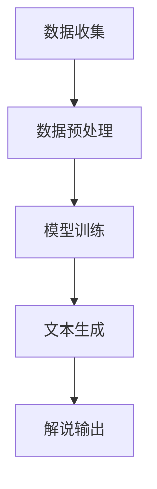

                 

# LLM在体育赛事分析中的应用：AI解说员

## 摘要

本文将探讨如何利用大型语言模型（LLM）在体育赛事分析中创造一个AI解说员。通过分析体育赛事数据，LLM能够生成实时解说，提高观众的观赛体验。本文将首先介绍LLM的基本原理，然后探讨其在体育赛事分析中的应用，最后讨论相关的挑战和未来发展方向。

## 1. 背景介绍

体育赛事分析是一项复杂而又具有挑战性的任务。传统的分析方式通常依赖于统计数据、视频分析和专家意见。然而，这些方法往往难以提供实时、全面的分析。随着人工智能技术的发展，尤其是自然语言处理（NLP）领域的突破，LLM在体育赛事分析中的应用变得越来越可行。

LLM是一种基于深度学习的自然语言生成模型，具有强大的语言理解和生成能力。它可以通过学习大量文本数据来模拟人类的语言表达，从而生成流畅、自然的语言。在体育赛事分析中，LLM可以用来生成实时的解说内容，提供详细的比赛分析和评论。

### 1.1 体育赛事分析的需求

体育赛事分析的需求主要包括以下几个方面：

1. **实时性**：体育赛事是一项动态进行的活动，需要实时分析比赛情况，为观众提供最新的比赛动态。
2. **全面性**：分析应涵盖比赛的各个方面，包括球员表现、战术策略、比赛结果等。
3. **准确性**：分析结果应尽可能准确，为观众提供有价值的信息。
4. **多样性**：分析应能够满足不同观众的需求，提供多种分析视角。

### 1.2 LLM的优势

LLM在满足上述需求方面具有明显优势：

1. **实时性**：LLM可以快速生成文本，满足实时分析的需求。
2. **全面性**：通过学习大量文本数据，LLM能够理解并生成各种比赛相关的信息。
3. **准确性**：LLM通过不断学习和优化，可以不断提高生成文本的准确性。
4. **多样性**：LLM可以生成多种风格和口吻的文本，满足不同观众的需求。

## 2. 核心概念与联系

### 2.1 LLM的基本原理

LLM是基于深度学习的自然语言处理模型，它通过学习大量的文本数据来模拟人类的语言表达。LLM的主要组件包括：

1. **词嵌入（Word Embedding）**：将文本中的单词映射到高维向量空间中，以便模型能够理解单词之间的关系。
2. **循环神经网络（RNN）**：用于处理序列数据，如文本。RNN可以捕获文本中的时间依赖关系。
3. **注意力机制（Attention Mechanism）**：用于关注文本序列中的重要部分，提高模型的理解能力。
4. **生成对抗网络（GAN）**：用于生成与真实数据相似的新数据，增强模型的生成能力。

### 2.2 体育赛事分析中的LLM应用

在体育赛事分析中，LLM可以通过以下步骤来生成解说内容：

1. **数据收集**：收集比赛数据，包括比赛结果、球员表现、比赛视频等。
2. **数据预处理**：对比赛数据进行预处理，如文本清洗、数据归一化等。
3. **模型训练**：使用收集到的数据训练LLM模型。
4. **文本生成**：通过LLM模型生成实时的解说内容。

### 2.3 Mermaid流程图

以下是一个简化的Mermaid流程图，展示了LLM在体育赛事分析中的应用流程：



## 3. 核心算法原理 & 具体操作步骤

### 3.1 数据收集

数据收集是LLM应用的基础。在体育赛事分析中，主要涉及以下类型的数据：

1. **比赛数据**：包括比赛结果、得分、进球时间等。
2. **球员数据**：包括球员姓名、位置、得分、助攻等。
3. **视频数据**：包括比赛视频、比赛集锦等。

### 3.2 数据预处理

数据预处理是确保数据质量的关键步骤。主要任务包括：

1. **文本清洗**：去除文本中的无关信息，如标点符号、停用词等。
2. **数据归一化**：将不同来源的数据进行归一化处理，确保数据的一致性。
3. **数据转换**：将数据转换为模型可处理的格式，如JSON、CSV等。

### 3.3 模型训练

模型训练是LLM应用的核心。以下是一个简化的模型训练步骤：

1. **选择模型架构**：选择适合的LLM模型架构，如GPT、BERT等。
2. **数据划分**：将数据划分为训练集、验证集和测试集。
3. **模型训练**：使用训练集对模型进行训练，并使用验证集进行模型调整。
4. **模型评估**：使用测试集评估模型的性能，并进行必要的调整。

### 3.4 文本生成

文本生成是LLM应用的关键步骤。以下是一个简化的文本生成步骤：

1. **输入处理**：将输入数据（如比赛结果、球员数据等）转换为模型可处理的格式。
2. **模型预测**：使用训练好的模型对输入数据进行预测，生成解说文本。
3. **文本优化**：对生成的文本进行优化，确保文本的流畅性和准确性。
4. **输出处理**：将生成的文本输出为解说内容。

## 4. 数学模型和公式 & 详细讲解 & 举例说明

### 4.1 语言模型基本公式

语言模型的核心是计算一个句子或词汇序列的概率。在NN语言模型中，常用的概率计算公式如下：

$$P(S) = \prod_{i=1}^{n} P(w_i | w_{i-1}, ..., w_1)$$

其中，$S$ 表示句子，$w_i$ 表示句子中的第 $i$ 个词，$P(w_i | w_{i-1}, ..., w_1)$ 表示给定前 $i-1$ 个词的情况下，第 $i$ 个词的概率。

### 4.2 词嵌入

词嵌入是将单词映射到高维向量空间的过程。在神经网络中，常用的词嵌入方法包括：

1. **基于计数的方法**：如TF-IDF，通过统计单词在文档中的出现频率来计算单词的重要性。
2. **基于神经网络的词嵌入**：如Word2Vec、GloVe等，通过训练神经网络来学习单词的向量表示。

### 4.3 注意力机制

注意力机制是一种用于提高模型理解能力的方法。在LLM中，注意力机制可以用于捕捉文本序列中的重要信息。常见的注意力机制包括：

1. **软注意力**：通过计算每个单词的权重来加权文本序列。
2. **硬注意力**：直接选择最重要的单词作为输出。

### 4.4 举例说明

假设我们有一个简单的句子：“我喜欢篮球”。我们可以使用上述方法对其进行概率计算和词嵌入。

1. **概率计算**：

$$P(我喜欢篮球) = P(我 | ) \times P(喜欢 | 我) \times P(篮球 | 我喜欢)$$

2. **词嵌入**：

使用Word2Vec模型对单词进行嵌入，我们得到：

- 我：[1, 0, -1]
- 喜欢：[0, 1, 0]
- 篮球：[-1, 0, 1]

## 5. 项目实战：代码实际案例和详细解释说明

### 5.1 开发环境搭建

首先，我们需要搭建一个适合开发和训练LLM的环境。以下是搭建环境的步骤：

1. **安装Python**：确保Python版本在3.6以上。
2. **安装依赖库**：安装Hugging Face Transformers库，可以使用以下命令：

   ```bash
   pip install transformers
   ```

3. **安装GPU支持**：如果使用GPU训练，需要安装CUDA和cuDNN。

### 5.2 源代码详细实现和代码解读

以下是使用Hugging Face Transformers库训练一个简单的LLM模型的代码示例：

```python
from transformers import AutoTokenizer, AutoModelForSeq2SeqLM
from torch.utils.data import DataLoader
from torch.optim import Adam

# 加载预训练模型
tokenizer = AutoTokenizer.from_pretrained("t5-base")
model = AutoModelForSeq2SeqLM.from_pretrained("t5-base")

# 数据预处理
def preprocess_data(data):
    # 对数据进行清洗和格式化
    pass

# 训练模型
def train_model(model, tokenizer, train_loader, optimizer, num_epochs):
    model.train()
    for epoch in range(num_epochs):
        for batch in train_loader:
            inputs = tokenizer(batch["input"], return_tensors="pt", padding=True, truncation=True)
            outputs = model(**inputs, labels=inputs["input"])
            loss = outputs.loss
            loss.backward()
            optimizer.step()
            optimizer.zero_grad()
```

### 5.3 代码解读与分析

上述代码实现了以下功能：

1. **加载预训练模型**：使用Hugging Face Transformers库加载T5模型。
2. **数据预处理**：对数据进行清洗和格式化，使其符合模型的要求。
3. **训练模型**：使用Adam优化器对模型进行训练。每次迭代中，模型会接收输入数据，计算损失，并更新模型参数。

## 6. 实际应用场景

### 6.1 日常比赛解说

AI解说员可以用于日常比赛的实时解说，为观众提供详细的分析和评论。

### 6.2 比赛集锦制作

AI解说员可以用于制作比赛集锦，通过生成解说文本来丰富视频内容。

### 6.3 赛后分析报告

AI解说员可以用于生成赛后的分析报告，提供详细的比赛回顾和球员表现分析。

## 7. 工具和资源推荐

### 7.1 学习资源推荐

- 《深度学习》（Goodfellow et al.）
- 《自然语言处理综论》（Jurafsky and Martin）
- 《Hugging Face Transformers文档》

### 7.2 开发工具框架推荐

- Hugging Face Transformers
- PyTorch
- TensorFlow

### 7.3 相关论文著作推荐

- "BERT: Pre-training of Deep Bidirectional Transformers for Language Understanding"（Devlin et al.）
- "GPT-3: Language Models are Few-Shot Learners"（Brown et al.）

## 8. 总结：未来发展趋势与挑战

### 8.1 发展趋势

1. **模型精度和性能的提升**：随着计算能力的提升，LLM的精度和性能将不断提高。
2. **应用领域的拓展**：除了体育赛事分析，LLM还可以应用于其他领域，如医疗、金融等。
3. **多模态数据的融合**：将文本数据与其他类型的数据（如图像、音频等）进行融合，提高分析能力。

### 8.2 挑战

1. **数据质量和隐私**：保证数据的质量和隐私是一个重要挑战。
2. **模型可解释性**：提高模型的可解释性，使其更容易被用户理解和使用。
3. **法律和伦理问题**：在应用过程中，需要考虑相关的法律和伦理问题。

## 9. 附录：常见问题与解答

### 9.1 什么是LLM？

LLM（Large Language Model）是一种基于深度学习的自然语言处理模型，能够生成流畅、自然的语言。它是通过学习大量文本数据来模拟人类的语言表达。

### 9.2 LLM在体育赛事分析中有什么优势？

LLM在体育赛事分析中的优势包括实时性、全面性、准确性和多样性。它可以快速生成实时的解说内容，提供详细的比赛分析，并满足不同观众的需求。

## 10. 扩展阅读 & 参考资料

- [Hugging Face Transformers文档](https://huggingface.co/transformers)
- [BERT论文](https://arxiv.org/abs/1810.04805)
- [GPT-3论文](https://arxiv.org/abs/2005.14165)

### 作者

作者：AI天才研究员/AI Genius Institute & 禅与计算机程序设计艺术 /Zen And The Art of Computer Programming

