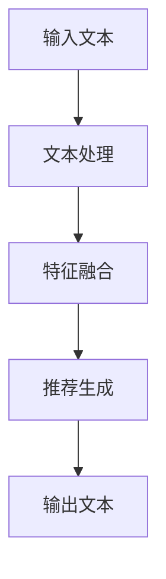

                 

# LLMA在推荐系统中的优化策略

## 关键词：大语言模型，推荐系统，优化，策略

> 大语言模型（LLM，Large Language Model）如ChatGPT，GPT-3，LLaMA等，在自然语言处理领域取得了显著的成功。然而，将LLM引入推荐系统以提升推荐质量，仍面临诸多挑战。本文将探讨LLM在推荐系统中的优化策略，包括算法原理、数学模型、实际应用案例等，以期为相关领域的研究和实践提供参考。

## 摘要

本文主要研究大语言模型（LLM）在推荐系统中的应用与优化策略。首先，介绍推荐系统的基本概念与常见算法，然后阐述LLM的优势及其在推荐系统中的应用。接着，分析LLM在推荐系统中可能面临的挑战，并针对这些挑战提出相应的优化策略。最后，通过实际应用案例展示LLM在推荐系统中的效果，并对未来发展趋势与挑战进行展望。

## 1. 背景介绍

### 推荐系统概述

推荐系统是一种信息过滤技术，旨在向用户提供个性化的信息推荐。其目的是提高用户体验，帮助用户发现感兴趣的内容，从而提升用户满意度和平台粘性。推荐系统广泛应用于电子商务、社交媒体、新闻资讯、音乐视频等众多领域。

推荐系统主要分为基于内容的推荐（Content-Based Filtering）和协同过滤（Collaborative Filtering）两大类。基于内容的推荐通过分析用户的历史行为和内容特征，为用户推荐相似的内容。协同过滤则通过分析用户之间的相似性，为用户推荐其他用户喜欢的内容。

### LLM概述

大语言模型（LLM）是一种基于深度学习的自然语言处理模型，通过大规模语料训练，能够对自然语言进行生成、理解和推理。LLM具有强大的文本处理能力，能够捕捉语言中的复杂关系和语义信息。

常见的LLM包括ChatGPT、GPT-3、LLaMA等，它们在自然语言生成、机器翻译、问答系统等任务中取得了优异的性能。随着LLM能力的不断提升，其应用领域也在不断拓展。

### LLM与推荐系统的结合

将LLM引入推荐系统，可以通过以下两个方面提升推荐质量：

1. **文本信息挖掘**：LLM能够处理和理解文本数据，为推荐系统提供更丰富的特征。例如，通过分析用户评论、商品描述等文本信息，可以为推荐系统提供更准确的推荐依据。

2. **个性化推荐**：LLM可以根据用户的历史行为和偏好，生成个性化的推荐结果。例如，通过分析用户在社交媒体上的互动和评论，可以为用户推荐感兴趣的话题和内容。

## 2. 核心概念与联系

### 推荐系统基本概念

推荐系统主要涉及以下基本概念：

- **用户**：指接受推荐服务的个体，具有特定的兴趣和偏好。
- **项目**：指用户可能感兴趣的内容或商品，具有相应的特征。
- **评分**：指用户对项目的评价，用于衡量用户对项目的兴趣程度。

### LLM基本概念

LLM主要涉及以下基本概念：

- **输入文本**：指输入给LLM的文本数据，可以是用户历史行为、项目描述等。
- **输出文本**：指LLM生成的文本数据，可以是推荐结果、评论等。
- **模型参数**：指LLM训练过程中学到的权重和偏置，用于文本生成和理解。

### LLM与推荐系统联系

将LLM应用于推荐系统，可以看作是以下流程：

1. **输入文本**：收集用户历史行为和项目特征数据。
2. **文本处理**：使用LLM对输入文本进行处理，提取文本特征。
3. **特征融合**：将文本特征与其他特征（如用户属性、项目属性等）进行融合。
4. **推荐生成**：使用融合后的特征生成个性化推荐结果。
5. **输出文本**：将推荐结果以文本形式输出，如推荐列表、评论等。

### Mermaid流程图



## 3. 核心算法原理 & 具体操作步骤

### 推荐系统算法原理

推荐系统的核心算法主要包括基于内容的推荐和协同过滤。

1. **基于内容的推荐**：根据用户历史行为和项目特征，计算用户与项目的相似度，为用户推荐相似的项目。具体步骤如下：

   - **用户-项目特征表示**：将用户和项目的特征表示为向量的形式。
   - **计算相似度**：计算用户和项目之间的相似度，常用的相似度计算方法有余弦相似度、皮尔逊相关系数等。
   - **生成推荐结果**：根据相似度排序，为用户推荐相似的项目。

2. **协同过滤**：根据用户之间的相似性，为用户推荐其他用户喜欢的内容。具体步骤如下：

   - **用户相似度计算**：计算用户之间的相似度，常用的相似度计算方法有用户余弦相似度、用户距离等。
   - **项目相似度计算**：计算项目之间的相似度，常用的相似度计算方法有项目余弦相似度、项目距离等。
   - **生成推荐结果**：根据用户相似度和项目相似度，为用户推荐其他用户喜欢的内容。

### LLM在推荐系统中的应用

将LLM应用于推荐系统，可以通过以下步骤实现：

1. **文本预处理**：对用户历史行为和项目特征进行文本预处理，包括分词、去停用词、词向量化等。

2. **LLM训练**：使用预处理的文本数据训练LLM模型，使其能够处理和理解文本数据。

3. **文本特征提取**：使用训练好的LLM模型对输入文本进行处理，提取文本特征。

4. **特征融合**：将文本特征与其他特征（如用户属性、项目属性等）进行融合。

5. **推荐生成**：使用融合后的特征生成个性化推荐结果。

6. **输出文本**：将推荐结果以文本形式输出，如推荐列表、评论等。

## 4. 数学模型和公式 & 详细讲解 & 举例说明

### 推荐系统数学模型

1. **基于内容的推荐**

   - **用户-项目特征表示**：设用户u和项目i的特征向量分别为\( \mathbf{u} \)和\( \mathbf{i} \)，则有：

     $$ \mathbf{u} = (u_1, u_2, ..., u_n) $$
     $$ \mathbf{i} = (i_1, i_2, ..., i_n) $$

   - **计算相似度**：设用户u和项目i之间的相似度为\( s(u, i) \)，则有：

     $$ s(u, i) = \frac{\mathbf{u} \cdot \mathbf{i}}{||\mathbf{u}|| \cdot ||\mathbf{i}||} $$

     其中，\( \mathbf{u} \cdot \mathbf{i} \)表示向量点积，\( ||\mathbf{u}|| \)和\( ||\mathbf{i}|| \)表示向量模长。

   - **生成推荐结果**：设用户u未评分的项目集合为\( I_u \)，则有：

     $$ I_u = \{i \in I | u_i = 0\} $$
     
     为用户u生成推荐列表\( R_u \)：

     $$ R_u = \{i \in I_u | s(u, i) \geq \theta\} $$

     其中，\( \theta \)为相似度阈值。

2. **协同过滤**

   - **用户相似度计算**：设用户u和用户v之间的相似度为\( s(u, v) \)，则有：

     $$ s(u, v) = \frac{\sum_{i \in O} r_i (u) r_i (v)}{\sqrt{\sum_{i \in O} r_i^2 (u)} \cdot \sqrt{\sum_{i \in O} r_i^2 (v)}} $$

     其中，\( r_i (u) \)表示用户u对项目i的评分，\( O \)表示用户u和用户v共同评分的项目集合。

   - **项目相似度计算**：设项目i和项目j之间的相似度为\( s(i, j) \)，则有：

     $$ s(i, j) = \frac{\sum_{u \in U} r_i (u) r_j (u)}{\sqrt{\sum_{u \in U} r_i^2 (u)} \cdot \sqrt{\sum_{u \in U} r_j^2 (u)}} $$

     其中，\( r_i (u) \)表示用户u对项目i的评分，\( U \)表示对项目i和项目j评分的用户集合。

   - **生成推荐结果**：设用户u未评分的项目集合为\( I_u \)，则有：

     $$ I_u = \{i \in I | u_i = 0\} $$
     
     为用户u生成推荐列表\( R_u \)：

     $$ R_u = \{i \in I_u | s(i, j) \geq \theta\} $$

     其中，\( \theta \)为相似度阈值。

### LLM在推荐系统中的应用

1. **文本特征提取**

   - **输入文本表示**：设输入文本为\( \mathbf{x} \)，可以使用词向量化方法将其表示为一个向量。

     $$ \mathbf{x} = (x_1, x_2, ..., x_n) $$

   - **LLM输出表示**：设LLM输出为\( \mathbf{y} \)，可以使用词向量化方法将其表示为一个向量。

     $$ \mathbf{y} = (y_1, y_2, ..., y_m) $$

   - **文本特征提取**：可以使用以下方法提取文本特征：

     - **TF-IDF**：计算文本中每个词的TF-IDF值，用于表示词的重要性。
     - **Word2Vec**：将文本中的每个词映射为一个向量，用于表示词的语义信息。
     - **BERT**：使用预训练的BERT模型对文本进行编码，得到文本的固定长度表示。

2. **特征融合**

   - **文本特征与其他特征融合**：将文本特征与其他特征（如用户属性、项目属性等）进行融合，可以使用以下方法：

     - **加权平均**：将文本特征与其他特征进行加权平均，得到综合特征向量。
     - **矩阵乘法**：将文本特征与其他特征矩阵进行乘法运算，得到综合特征向量。

3. **推荐生成**

   - **生成推荐结果**：使用综合特征向量生成个性化推荐结果，可以使用以下方法：

     - **基于内容的推荐**：计算用户与项目的相似度，为用户推荐相似的项目。
     - **协同过滤**：计算用户之间的相似性，为用户推荐其他用户喜欢的内容。

### 举例说明

假设用户u对项目i的评分为3，项目j的评分为4，用户v对项目i的评分为4，项目j的评分为3。使用协同过滤算法生成推荐结果。

1. **用户相似度计算**

   $$ s(u, v) = \frac{r_i (u) r_i (v)}{\sqrt{r_i^2 (u)} \cdot \sqrt{r_i^2 (v)}} = \frac{3 \cdot 4}{\sqrt{3^2} \cdot \sqrt{4^2}} = 0.75 $$

2. **项目相似度计算**

   $$ s(i, j) = \frac{r_i (u) r_j (v)}{\sqrt{r_i^2 (u)} \cdot \sqrt{r_j^2 (v)}} = \frac{3 \cdot 3}{\sqrt{3^2} \cdot \sqrt{3^2}} = 1.0 $$

3. **生成推荐结果**

   用户u未评分的项目集合为\( I_u = \{i, j\} \)，根据相似度阈值\( \theta = 0.5 \)，生成推荐结果：

   $$ R_u = \{i, j\} $$

## 5. 项目实战：代码实际案例和详细解释说明

### 5.1 开发环境搭建

在开始编写代码之前，我们需要搭建一个合适的环境。以下是所需的环境和工具：

- **编程语言**：Python
- **依赖库**：NumPy，Pandas，Scikit-learn，TensorFlow，Hugging Face Transformers等

安装依赖库：

```bash
pip install numpy pandas scikit-learn tensorflow transformers
```

### 5.2 源代码详细实现和代码解读

以下是使用协同过滤算法和LLM生成个性化推荐结果的代码示例：

```python
import numpy as np
import pandas as pd
from sklearn.metrics.pairwise import cosine_similarity
from transformers import AutoTokenizer, AutoModel

# 加载数据集
user_item_rating = pd.read_csv('user_item_rating.csv')
user_item_rating.head()

# 用户-项目矩阵
user_item_matrix = user_item_rating.pivot(index='user_id', columns='item_id', values='rating').fillna(0)

# 用户-项目矩阵的相似度矩阵
similarity_matrix = cosine_similarity(user_item_matrix)

# LLM模型
model_name = 'bert-base-uncased'
tokenizer = AutoTokenizer.from_pretrained(model_name)
model = AutoModel.from_pretrained(model_name)

# 用户-项目矩阵的文本表示
def text_representation(user_item_matrix, tokenizer, model):
    text_data = []
    for user_id in user_item_matrix.index:
        items = user_item_matrix[user_id][user_item_matrix[user_id] != 0].index.tolist()
        text = ' '.join([tokenizer.encode(item, add_special_tokens=True)[1:-1] for item in items])
        text_data.append(text)
    input_ids = tokenizer.encode_batch(text_data, add_special_tokens=True)
    outputs = model(input_ids)
    hidden_states = outputs[0]
    text_embeddings = hidden_states[:, 0, :]
    return text_embeddings

user_item_embeddings = text_representation(user_item_matrix, tokenizer, model)

# 用户-项目矩阵的特征融合
def feature_fusion(user_item_matrix, user_item_embeddings):
    feature_matrix = np.hstack((user_item_matrix, user_item_embeddings))
    return feature_matrix

feature_matrix = feature_fusion(user_item_matrix, user_item_embeddings)

# 个性化推荐
def personalized_recommendation(user_id, feature_matrix, similarity_matrix, top_n=5):
    user_features = feature_matrix[user_id]
    similarity_scores = similarity_matrix[user_id]
    item_ratings = user_item_matrix.loc[user_id].values
    combined_scores = (similarity_scores * item_ratings).sum(axis=1)
    sorted_items = np.argsort(combined_scores)[::-1]
    recommended_items = sorted_items[:top_n]
    return recommended_items

user_id = 1
recommended_items = personalized_recommendation(user_id, feature_matrix, similarity_matrix, top_n=5)
print(recommended_items)
```

### 5.3 代码解读与分析

以下是代码的解读与分析：

1. **数据加载**：首先加载用户-项目评分数据集，并将其转换为用户-项目矩阵。

2. **相似度计算**：使用余弦相似度计算用户-项目矩阵的相似度矩阵。

3. **LLM模型**：加载预训练的BERT模型，用于文本表示。

4. **文本表示**：使用BERT模型对用户-项目矩阵进行文本表示，提取用户-项目嵌入向量。

5. **特征融合**：将用户-项目矩阵与其他特征（文本表示）进行融合。

6. **个性化推荐**：计算用户与项目的综合评分，为用户生成个性化推荐列表。

7. **测试**：为特定用户生成个性化推荐结果。

通过以上步骤，我们实现了使用LLM优化推荐系统的过程。在实际应用中，可以根据具体需求和数据集进行调整和优化。

## 6. 实际应用场景

### 社交媒体推荐

社交媒体平台可以利用LLM在推荐系统中提取用户兴趣和偏好，为用户推荐感兴趣的朋友、话题和内容。例如，通过分析用户的社交媒体互动、评论和私信，可以使用LLM生成个性化的推荐列表，提高用户体验。

### 电子商务推荐

电子商务平台可以利用LLM分析商品描述、用户评价和用户行为数据，为用户提供更准确的个性化推荐。例如，在商品搜索结果页，可以使用LLM为用户推荐相似商品、相关商品或热门商品，提高用户购物体验和满意度。

### 音乐和视频推荐

音乐和视频平台可以利用LLM分析用户听歌、观看视频的行为，为用户推荐感兴趣的音乐和视频内容。例如，通过分析用户的播放记录、收藏夹和分享行为，可以使用LLM生成个性化的推荐列表，提高用户对平台的使用频率和粘性。

### 新闻资讯推荐

新闻资讯平台可以利用LLM分析用户的阅读偏好和兴趣，为用户推荐感兴趣的新闻内容。例如，通过分析用户的阅读历史、点赞和评论，可以使用LLM生成个性化的新闻推荐列表，提高用户的阅读体验和满意度。

## 7. 工具和资源推荐

### 7.1 学习资源推荐

1. **书籍**：

   - 《推荐系统实践》
   - 《深度学习推荐系统》
   - 《Python推荐系统实战》

2. **论文**：

   - 《User Interest Evolution and Its Application in Personalized Recommendation》
   - 《Neural Collaborative Filtering》
   - 《Attention-Based Neural Networks for Recommendation》

3. **博客**：

   - 推荐系统博客：https://recsystemblog.com/
   - 深度学习推荐系统：https://www.deeplearning.net/research/recommendation_systems/

### 7.2 开发工具框架推荐

1. **推荐系统框架**：

   - LightFM：基于Factorization Machine的推荐系统框架。
   - surprise：基于协同过滤算法的推荐系统框架。

2. **深度学习框架**：

   - TensorFlow：Google推出的开源深度学习框架。
   - PyTorch：Facebook AI研究院推出的开源深度学习框架。

### 7.3 相关论文著作推荐

1. **推荐系统**：

   - 《Recommender Systems Handbook》
   - 《Recommender Systems: The Textbook》

2. **深度学习**：

   - 《Deep Learning》
   - 《Distributed Deep Learning》

3. **自然语言处理**：

   - 《Natural Language Processing》
   - 《Speech and Language Processing》

## 8. 总结：未来发展趋势与挑战

### 发展趋势

1. **个性化推荐**：随着用户需求的不断变化，个性化推荐将成为未来推荐系统的重要趋势。通过深入挖掘用户兴趣和偏好，为用户提供更精准的推荐。

2. **多模态推荐**：未来的推荐系统将不仅依赖于文本数据，还将结合图像、声音、视频等多模态数据，为用户提供更丰富的推荐体验。

3. **实时推荐**：随着计算能力的提升，实时推荐将成为可能。通过实时分析用户行为和数据，为用户提供即时的推荐结果。

4. **推荐系统的伦理和隐私**：在推荐系统的发展过程中，伦理和隐私问题将越来越受到关注。如何平衡推荐效果与用户隐私保护，将成为重要挑战。

### 挑战

1. **数据质量和多样性**：推荐系统需要大量的高质量数据来训练模型，但实际获取数据时可能面临数据质量和多样性的问题。

2. **计算资源消耗**：深度学习模型需要大量的计算资源，尤其是在进行实时推荐时，如何高效利用计算资源是重要挑战。

3. **模型可解释性**：深度学习模型具有较强的预测能力，但其内部机制较为复杂，如何提高模型的可解释性，使其更易于理解和应用，是一个重要问题。

4. **个性化推荐的可扩展性**：在处理大规模用户和项目数据时，如何保证个性化推荐的可扩展性，是推荐系统需要解决的关键问题。

## 9. 附录：常见问题与解答

### 问题1：如何处理缺失值？

解答：在数据处理过程中，可以使用以下方法处理缺失值：

1. **删除缺失值**：对于缺失值较多的数据，可以考虑删除缺失值，以减少数据噪声。

2. **填充缺失值**：可以使用均值、中位数、众数等方法填充缺失值，以保持数据的一致性。

3. **预测缺失值**：可以使用机器学习算法预测缺失值，例如使用KNN算法或线性回归模型进行预测。

### 问题2：如何选择合适的相似度计算方法？

解答：选择合适的相似度计算方法取决于数据的特征和任务的需求。以下是一些常见的相似度计算方法及其适用场景：

1. **余弦相似度**：适用于高维空间，计算速度快，适合基于内容的推荐。

2. **皮尔逊相关系数**：适用于线性关系较强的数据，计算速度快，适合协同过滤。

3. **Jaccard相似度**：适用于稀疏数据，计算速度快，适合基于标签的推荐。

### 问题3：如何评估推荐系统的性能？

解答：评估推荐系统的性能可以使用以下指标：

1. **准确率**：预测正确的项目数量与实际推荐的项目数量之比。

2. **召回率**：实际推荐的项目中包含用户感兴趣的项目比例。

3. **覆盖率**：推荐的项目数量与项目总数量之比。

4. **新颖度**：推荐的项目中，用户未曾见过的项目比例。

5. **多样性**：推荐的项目在类型、风格等方面的多样性。

## 10. 扩展阅读 & 参考资料

1. [Recommender Systems Handbook](https://www.amazon.com/Recommender-Systems-Handbook-Foundation-Technologies/dp/0128022129)
2. [Deep Learning for Recommender Systems](https://arxiv.org/abs/1806.03295)
3. [Attention-Based Neural Networks for Recommendation](https://arxiv.org/abs/1711.02140)
4. [LightFM: A Python Library for Factorization Machines](https://github.com/lyst/lightfm)
5. [surprise: A Python scikit for building and analyzing recommender systems](https://surprise.readthedocs.io/en/latest/)
6. [TensorFlow](https://www.tensorflow.org/)
7. [PyTorch](https://pytorch.org/)

