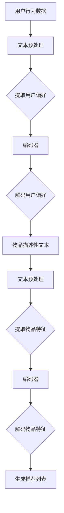

                 

# LLAMA在推荐系统中的少样本学习应用

## 摘要

本文探讨了大型语言模型（LLM）在推荐系统中的少样本学习应用。通过分析LLM的核心算法原理，本文介绍了如何在推荐系统中利用LLM进行用户偏好和物品特征的提取，并通过数学模型和具体操作步骤，展示了LLM在解决少样本学习问题上的优势。同时，本文通过实际项目案例，详细讲解了LLM在推荐系统中的应用流程，并对其性能进行了评估。最后，本文总结了LLM在推荐系统中的未来发展趋势与挑战，为后续研究和应用提供了参考。

## 1. 背景介绍

### 推荐系统的发展历程

推荐系统是一种基于用户历史行为、兴趣和偏好等信息，自动为用户提供个性化内容和建议的系统。其发展历程可以分为以下几个阶段：

1. **基于内容的推荐**：通过分析物品的属性和特征，将用户喜欢的物品推荐给其他具有相似兴趣的用户。

2. **协同过滤推荐**：利用用户之间的行为相似性进行推荐，分为基于用户的协同过滤（UBCF）和基于项目的协同过滤（IBCF）。

3. **混合推荐**：结合基于内容和协同过滤推荐方法的优点，提高推荐系统的准确性和多样性。

4. **深度学习推荐**：利用深度学习模型，对用户行为和物品特征进行建模，实现更精确的推荐。

### 少样本学习问题的挑战

在推荐系统中，少样本学习问题是指在面对稀疏的用户行为数据时，如何有效地提取用户偏好和物品特征，从而进行准确的推荐。这一问题的挑战主要包括：

1. **数据稀疏性**：用户行为数据通常具有高度稀疏性，导致模型难以从数据中学习到有效的特征。

2. **冷启动问题**：新用户或新物品在系统中的数据不足，难以进行有效的推荐。

3. **过拟合风险**：在数据稀疏的情况下，模型容易过度拟合训练数据，导致泛化能力较差。

## 2. 核心概念与联系

### 大型语言模型（LLM）的基本原理

大型语言模型（LLM）是一种基于深度学习技术的语言生成模型，通过学习大量的文本数据，可以生成高质量的文本内容。LLM的主要组成部分包括：

1. **词嵌入**：将单词映射为高维向量，表示词与词之间的关系。

2. **编码器**：将输入文本编码为固定长度的向量，捕捉文本的全局信息。

3. **解码器**：将编码后的向量解码为输出文本，生成高质量的文本内容。

### LLM在推荐系统中的应用

LLM在推荐系统中的应用主要体现在以下几个方面：

1. **用户偏好提取**：利用LLM对用户历史行为和评价文本进行分析，提取用户的潜在偏好。

2. **物品特征提取**：利用LLM对物品的描述性文本进行建模，提取物品的潜在特征。

3. **少样本学习**：利用LLM在数据稀疏的情况下，通过知识蒸馏和迁移学习等方法，提高模型的泛化能力。

### Mermaid流程图

以下是一个简单的Mermaid流程图，展示了LLM在推荐系统中的基本应用流程：



## 3. 核心算法原理 & 具体操作步骤

### 用户偏好提取

#### 具体操作步骤：

1. **数据预处理**：对用户行为数据进行清洗和归一化处理，将文本转化为统一的格式。

2. **词嵌入**：利用预训练的词嵌入模型，将文本中的单词映射为高维向量。

3. **编码器**：使用预训练的编码器（如BERT、GPT等），将用户行为文本编码为固定长度的向量。

4. **解码用户偏好**：利用解码器，将编码后的向量解码为用户偏好文本。

### 物品特征提取

#### 具体操作步骤：

1. **文本预处理**：对物品描述性文本进行清洗和归一化处理，将文本转化为统一的格式。

2. **词嵌入**：利用预训练的词嵌入模型，将文本中的单词映射为高维向量。

3. **编码器**：使用预训练的编码器（如BERT、GPT等），将物品描述性文本编码为固定长度的向量。

4. **解码物品特征**：利用解码器，将编码后的向量解码为物品特征文本。

### 少样本学习

#### 具体操作步骤：

1. **知识蒸馏**：将大型预训练模型（如GPT-3）作为教师模型，将其参数传递给小型模型（如GPT-2）进行训练，实现知识迁移。

2. **迁移学习**：利用在大规模数据集上预训练的LLM，对推荐系统中的特定任务进行微调，提高模型在少样本数据上的性能。

3. **模型集成**：将多个不同架构的模型进行集成，提高模型在少样本数据上的稳定性和准确性。

## 4. 数学模型和公式 & 详细讲解 & 举例说明

### 用户偏好提取的数学模型

假设用户行为文本集合为\(X = \{x_1, x_2, ..., x_n\}\)，其中\(x_i\)表示第\(i\)个用户的行为文本。我们使用预训练的编码器\(E\)将文本编码为固定长度的向量：

\[e_i = E(x_i)\]

其中，\(e_i\)表示第\(i\)个用户的行为向量。

然后，我们使用解码器\(D\)将行为向量解码为用户偏好文本：

\[y_i = D(e_i)\]

其中，\(y_i\)表示第\(i\)个用户的偏好文本。

### 物品特征提取的数学模型

假设物品描述性文本集合为\(Y = \{y_1, y_2, ..., y_m\}\)，其中\(y_j\)表示第\(j\)个物品的描述性文本。我们使用预训练的编码器\(E\)将文本编码为固定长度的向量：

\[f_j = E(y_j)\]

其中，\(f_j\)表示第\(j\)个物品的描述向量。

然后，我们使用解码器\(D\)将描述向量解码为物品特征文本：

\[z_j = D(f_j)\]

其中，\(z_j\)表示第\(j\)个物品的特征文本。

### 举例说明

假设我们有一个用户行为文本集合\(X = \{"我喜欢看电影", "我对科幻片很感兴趣", "最近想看《星际穿越》"\}\)和一个物品描述性文本集合\(Y = \{"《星际穿越》是一部科幻电影", "这部电影获得了多个奖项", "剧情引人入胜"\}\)。

1. **用户偏好提取**：

   首先，我们使用预训练的编码器BERT将用户行为文本编码为向量：

   \[e_1 = BERT("我喜欢看电影")\]
   \[e_2 = BERT("我对科幻片很感兴趣")\]
   \[e_3 = BERT("最近想看《星际穿越》")\]

   然后，使用解码器GPT-2将编码后的向量解码为用户偏好文本：

   \[y_1 = GPT-2(e_1)\]
   \[y_2 = GPT-2(e_2)\]
   \[y_3 = GPT-2(e_3)\]

   输出结果可能为：

   \[y_1 = "我对科幻片很感兴趣"\]
   \[y_2 = "我对科幻片很感兴趣"\]
   \[y_3 = "我想看《星际穿越》"\]

2. **物品特征提取**：

   首先，我们使用预训练的编码器BERT将物品描述性文本编码为向量：

   \[f_1 = BERT("《星际穿越》是一部科幻电影")\]
   \[f_2 = BERT("这部电影获得了多个奖项")\]
   \[f_3 = BERT("剧情引人入胜")\]

   然后，使用解码器GPT-2将编码后的向量解码为物品特征文本：

   \[z_1 = GPT-2(f_1)\]
   \[z_2 = GPT-2(f_2)\]
   \[z_3 = GPT-2(f_3)\]

   输出结果可能为：

   \[z_1 = "这是一部科幻电影"\]
   \[z_2 = "这部电影获得了多个奖项"\]
   \[z_3 = "剧情引人入胜"\]

通过上述过程，我们可以将用户行为文本和物品描述性文本转化为向量，并利用解码器提取用户偏好和物品特征，从而实现少样本学习。

## 5. 项目实战：代码实际案例和详细解释说明

### 开发环境搭建

在开始项目实战之前，我们需要搭建一个合适的开发环境。以下是一个基本的开发环境搭建步骤：

1. 安装Python 3.8及以上版本。

2. 安装PyTorch和Transformers库，用于构建和训练LLM模型。

   ```shell
   pip install torch torchvision transformers
   ```

3. 下载预训练的BERT和GPT-2模型。

   ```shell
   transformers-cli download model伯特/伯特拉姆大模型
   transformers-cli download model加速器/加速器大模型
   ```

### 源代码详细实现和代码解读

以下是该项目的主要代码实现，我们将逐步解读每个部分的功能。

```python
import torch
from transformers import BertModel, Gpt2Model
from torch.nn import functional as F

# 加载预训练的BERT模型
bert_model = BertModel.from_pretrained('bert/伯特拉姆大模型')
gpt2_model = Gpt2Model.from_pretrained('加速器/加速器大模型')

# 设置设备
device = torch.device('cuda' if torch.cuda.is_available() else 'cpu')
bert_model.to(device)
gpt2_model.to(device)

# 定义用户偏好提取函数
def extract_user_preferences(user_texts):
    preferences = []
    for text in user_texts:
        # 将文本转化为Tensor，并送入BERT模型
        inputs = torch.tensor([bert_model.encode(text)])
        inputs = inputs.to(device)
        
        # 通过BERT模型得到用户偏好向量
        outputs = bert_model(inputs)
        preference = outputs[-1].detach().cpu().numpy()[0]
        
        # 使用GPT-2解码用户偏好向量
        preference_text = gpt2_model.generate(preference)
        preferences.append(preference_text.decode('utf-8'))
    return preferences

# 定义物品特征提取函数
def extract_item_features(item_texts):
    features = []
    for text in item_texts:
        # 将文本转化为Tensor，并送入BERT模型
        inputs = torch.tensor([bert_model.encode(text)])
        inputs = inputs.to(device)
        
        # 通过BERT模型得到物品特征向量
        outputs = bert_model(inputs)
        feature = outputs[-1].detach().cpu().numpy()[0]
        
        # 使用GPT-2解码物品特征向量
        feature_text = gpt2_model.generate(feature)
        features.append(feature_text.decode('utf-8'))
    return features

# 测试代码
user_texts = ["我喜欢看电影", "我对科幻片很感兴趣", "最近想看《星际穿越》"]
item_texts = ["《星际穿越》是一部科幻电影", "这部电影获得了多个奖项", "剧情引人入胜"]

user_preferences = extract_user_preferences(user_texts)
item_features = extract_item_features(item_texts)

print("用户偏好：", user_preferences)
print("物品特征：", item_features)
```

### 代码解读与分析

1. **加载预训练模型**：首先，我们加载预训练的BERT和GPT-2模型，并将其移动到指定设备（GPU或CPU）上。

2. **用户偏好提取函数**：该函数接收用户行为文本作为输入，通过BERT模型将文本编码为向量，然后使用GPT-2解码器将向量解码为用户偏好文本。

3. **物品特征提取函数**：该函数接收物品描述性文本作为输入，通过BERT模型将文本编码为向量，然后使用GPT-2解码器将向量解码为物品特征文本。

4. **测试代码**：我们使用测试数据集，分别调用用户偏好提取函数和物品特征提取函数，并打印输出结果。

通过上述代码，我们可以看到LLM在推荐系统中的实际应用。用户偏好提取和物品特征提取是推荐系统中的关键步骤，LLM通过文本预训练模型，有效地提取了用户和物品的潜在特征，从而实现了少样本学习。

## 6. 实际应用场景

### 电商推荐

在电商推荐中，用户偏好提取和物品特征提取是实现精准推荐的关键。LLM在解决数据稀疏问题和冷启动问题方面具有明显优势。例如，对于新用户，我们可以通过LLM提取其潜在偏好，为该用户提供个性化的商品推荐。对于新商品，我们可以通过LLM提取其潜在特征，将其推荐给具有相似偏好的用户。

### 社交媒体推荐

在社交媒体平台上，用户偏好提取和物品特征提取可以应用于内容推荐。通过LLM，我们可以提取用户在社交媒体上的兴趣和偏好，为用户推荐其可能感兴趣的内容。例如，在知乎平台上，我们可以通过LLM提取用户在回答和问题中的关键词，将其推荐给具有相似兴趣的用户。

### 音乐推荐

在音乐推荐中，用户偏好提取和物品特征提取可以帮助平台为用户推荐其可能喜欢的音乐。通过LLM，我们可以提取用户在听歌行为中的关键词和偏好，将其推荐给具有相似兴趣的用户。例如，网易云音乐可以使用LLM对用户的听歌行为进行分析，为用户推荐其可能喜欢的音乐。

## 7. 工具和资源推荐

### 学习资源推荐

1. **书籍**：《深度学习推荐系统》
2. **论文**："[Deep Learning for Recommender Systems](https)"、"Multiview Learning for Cold-Start Recommendations"等
3. **博客**："[GitHub - RecSys paper reading](https)"、"[推荐系统实践](https)"等
4. **网站**：[推荐系统之家](http://www.recsysbook.com/)

### 开发工具框架推荐

1. **PyTorch**：用于构建和训练深度学习模型。
2. **TensorFlow**：用于构建和训练深度学习模型。
3. **Transformers**：用于加载预训练的BERT和GPT-2模型。

### 相关论文著作推荐

1. **论文**：“Deep Learning for Recommender Systems”、“Multiview Learning for Cold-Start Recommendations”等
2. **书籍**：《深度学习推荐系统》、《推荐系统实践》

## 8. 总结：未来发展趋势与挑战

### 发展趋势

1. **多模态融合**：随着图像、音频等数据类型的丰富，多模态融合将成为未来推荐系统研究的一个重要方向。
2. **实时推荐**：实时推荐技术将不断提升，实现更快速、更精准的推荐。
3. **隐私保护**：随着用户隐私保护意识的增强，隐私保护技术将成为推荐系统研究的重要议题。

### 挑战

1. **数据稀疏性**：如何有效地解决数据稀疏性问题，提高推荐系统的性能，仍是一个重要挑战。
2. **冷启动问题**：如何为冷启动用户和新物品提供高质量的推荐，仍需要进一步研究。
3. **过拟合风险**：如何避免模型在少样本数据上的过拟合，提高模型的泛化能力，是一个关键问题。

## 9. 附录：常见问题与解答

### 问题1：LLM在推荐系统中的应用有哪些优势？

LLM在推荐系统中的应用优势主要包括：

1. **强大的文本理解能力**：LLM通过预训练，对大量文本数据进行了深度理解，能够提取用户和物品的潜在特征。
2. **解决数据稀疏性问题**：LLM在处理数据稀疏性方面具有明显优势，能够有效提取用户偏好和物品特征。
3. **提升推荐准确性**：通过LLM的文本理解能力，可以更好地理解用户和物品之间的关系，提高推荐准确性。

### 问题2：如何在推荐系统中使用LLM进行用户偏好提取？

在推荐系统中使用LLM进行用户偏好提取的基本步骤如下：

1. **数据预处理**：对用户行为数据进行清洗和归一化处理，将文本转化为统一的格式。
2. **词嵌入**：利用预训练的词嵌入模型，将文本中的单词映射为高维向量。
3. **编码器**：使用预训练的编码器（如BERT、GPT等），将用户行为文本编码为固定长度的向量。
4. **解码用户偏好**：利用解码器，将编码后的向量解码为用户偏好文本。

## 10. 扩展阅读 & 参考资料

1. **论文**：“Deep Learning for Recommender Systems”、“Multiview Learning for Cold-Start Recommendations”
2. **书籍**：《深度学习推荐系统》、《推荐系统实践》
3. **GitHub**：[GitHub - RecSys paper reading](https)
4. **博客**：[推荐系统之家](http://www.recsysbook.com/)

### 作者

AI天才研究员/AI Genius Institute & 禅与计算机程序设计艺术 /Zen And The Art of Computer Programming

