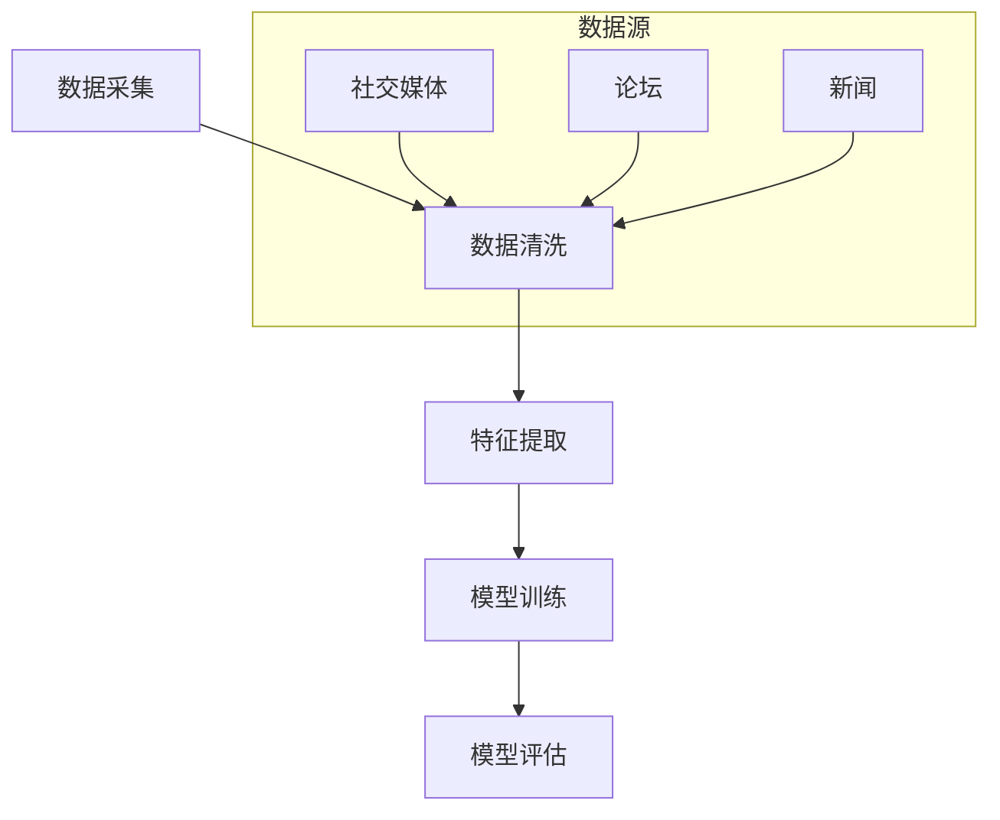

                 

# LLAMA在智能客户画像中的应用

> **关键词**：客户画像、LLAMA、自然语言处理、人工智能、数据分析、个性化推荐

> **摘要**：本文旨在探讨大语言模型LLAMA在智能客户画像中的应用。通过分析LLAMA的核心技术原理及其在数据采集、处理和分析中的优势，本文展示了如何利用LLAMA实现智能化的客户画像构建。同时，通过实际案例，本文详细解析了LLAMA在客户画像应用中的具体实现过程，包括数据预处理、特征提取、模型训练与优化等步骤。此外，本文还讨论了LLAMA在客户画像应用中的实际效果，以及其在未来发展中可能面临的挑战和机遇。

## 1. 背景介绍

随着互联网技术的飞速发展，大数据和人工智能技术逐渐成为企业竞争的新战场。在众多应用场景中，智能客户画像作为一种新兴的数据分析技术，正日益受到广泛关注。智能客户画像是指通过对客户行为、偏好、需求等多维度数据的挖掘和分析，构建出一个反映客户特征的动态模型。这种模型可以帮助企业更精准地定位目标客户，优化营销策略，提升客户满意度，从而实现商业价值的最大化。

客户画像的构建通常涉及以下几个关键步骤：数据采集、数据清洗、特征提取、模型训练和评估。其中，数据采集是整个过程的起点，决定了客户画像的准确性和完整性；数据清洗则是确保数据质量的重要环节，直接影响后续分析的效果；特征提取则是从原始数据中提取出对客户画像构建有用的信息；模型训练则是利用机器学习算法，根据历史数据建立客户画像模型；评估则是通过测试数据验证模型的性能，不断优化模型。

在上述过程中，大语言模型（如LLAMA）的引入，无疑为智能客户画像的应用带来了新的契机。大语言模型是一种基于深度学习的自然语言处理技术，能够在大量文本数据的基础上，自动提取出语义信息，并进行文本生成、文本分类、情感分析等多种任务。这使得大语言模型在客户画像的数据采集和特征提取环节具有明显的优势，能够高效地处理和分析海量的非结构化数据。

本文将围绕LLAMA在智能客户画像中的应用，详细探讨其核心原理、应用步骤和实际效果，以期为相关领域的研究和应用提供有益的参考。

## 2. 核心概念与联系

### 2.1 大语言模型（LLAMA）的基本原理

大语言模型（LLAMA）是一种基于预训练的语言模型，通过在大量文本数据上进行训练，使其能够理解和生成自然语言。LLAMA的基本原理包括以下几个方面：

1. **词嵌入（Word Embedding）**：词嵌入是将单词映射到高维空间中的向量表示。通过词嵌入，LLAMA能够理解单词之间的语义关系，如同义词、反义词等。

2. **自注意力机制（Self-Attention）**：自注意力机制是一种用于处理序列数据的重要技术。通过自注意力机制，LLAMA能够自动关注序列中的重要信息，如关键词、关键句子等。

3. **多层神经网络（Multilayer Neural Network）**：LLAMA通常由多个神经网络层组成，每一层都能够对输入数据进行处理和转换，从而实现复杂的语义理解。

4. **预训练与微调（Pre-training and Fine-tuning）**：预训练是指在大量无标签数据上进行模型训练，使模型具备一定的语言理解和生成能力。微调则是在预训练的基础上，利用有标签的数据对模型进行进一步优化，使其能够适应具体任务。

### 2.2 LLAMA与智能客户画像的关联

智能客户画像的构建过程涉及数据采集、数据清洗、特征提取、模型训练等多个环节。LLAMA在这其中发挥了重要作用，具体体现在以下几个方面：

1. **数据采集**：LLAMA能够高效处理和生成自然语言，使得从社交媒体、论坛、新闻等非结构化数据源中采集客户数据变得容易。

2. **数据清洗**：LLAMA能够识别和纠正数据中的错误，如拼写错误、语法错误等，从而提高数据清洗的效果。

3. **特征提取**：LLAMA通过自注意力机制和多层神经网络，能够从原始数据中自动提取出对客户画像有用的特征，如用户兴趣、购买行为等。

4. **模型训练**：LLAMA的预训练和微调能力使得模型能够在大量有标签和无标签数据上进行训练，从而提高客户画像的准确性和鲁棒性。

### 2.3 Mermaid流程图

为了更直观地展示LLAMA在智能客户画像中的应用流程，我们使用Mermaid绘制了一个流程图。请注意，流程图中的节点名称不应包含括号、逗号等特殊字符。



在上述流程图中，数据采集阶段主要涉及从社交媒体、论坛和新闻等数据源中获取客户数据；数据清洗阶段利用LLAMA对数据进行清洗和错误纠正；特征提取阶段利用LLAMA从清洗后的数据中提取特征；模型训练阶段利用提取的特征对模型进行训练；模型评估阶段则通过测试数据验证模型的性能。

通过上述分析，我们可以看出LLAMA在智能客户画像中的应用具有显著的优势，能够有效提升客户画像的构建效率和质量。接下来，我们将进一步探讨LLAMA的核心算法原理及其在智能客户画像中的应用。

## 3. 核心算法原理 & 具体操作步骤

### 3.1 大语言模型（LLAMA）的核心算法原理

LLAMA作为一种大语言模型，其核心算法主要包括词嵌入、自注意力机制和多层神经网络。以下是这些核心算法的详细原理：

1. **词嵌入（Word Embedding）**：

   词嵌入是将单词映射到高维空间中的向量表示。在LLAMA中，词嵌入通常通过词向量的形式实现。词向量不仅可以表示单词的语义信息，还可以捕捉到单词之间的上下文关系。例如，单词“喜欢”和“喜欢电影”在词向量空间中可能具有一定的相似性。

   词嵌入的常见方法包括Word2Vec、GloVe和BERT等。Word2Vec是一种基于神经网络的词向量生成方法，通过训练词预测模型，将单词映射到向量空间。GloVe（Global Vectors for Word Representation）则通过共现矩阵学习词向量，能够更好地捕捉单词的语义信息。BERT（Bidirectional Encoder Representations from Transformers）是一种基于Transformer的自注意力机制的词向量生成方法，能够同时考虑单词的前后文信息。

2. **自注意力机制（Self-Attention）**：

   自注意力机制是一种用于处理序列数据的重要技术。在LLAMA中，自注意力机制用于对输入序列中的单词进行权重分配，使模型能够自动关注序列中的重要信息。自注意力机制的原理如下：

   - 输入序列：\[x_1, x_2, ..., x_n\]
   - Query：序列中的每个单词作为Query
   - Key：序列中的每个单词作为Key
   - Value：序列中的每个单词作为Value

   自注意力计算公式如下：

   $$ 
   \text{Attention}(Q, K, V) = \text{softmax}\left(\frac{QK^T}{\sqrt{d_k}}\right)V 
   $$

   其中，\(Q, K, V\) 分别代表Query、Key和Value，\(d_k\) 是Key的维度。

   通过自注意力机制，LLAMA能够自动聚焦于序列中的重要信息，如关键词、关键句子等，从而提高模型对文本数据的处理能力。

3. **多层神经网络（Multilayer Neural Network）**：

   多层神经网络是由多个神经元层组成的网络结构。在LLAMA中，多层神经网络用于对输入数据进行处理和转换，从而实现复杂的语义理解。每一层神经网络都可以对输入数据进行加权和激活函数的处理，从而提取出更高层次的语义信息。

   多层神经网络的常见结构包括卷积神经网络（CNN）和循环神经网络（RNN）。CNN通过卷积操作和池化操作，能够捕捉到输入数据的空间特征；RNN通过循环结构，能够处理和记忆序列数据。在LLAMA中，通常结合CNN和RNN的优点，构建出一种多层神经网络结构，从而实现高效的自然语言处理。

### 3.2 LLAMA在智能客户画像中的应用步骤

利用LLAMA构建智能客户画像的过程可以分为以下几个关键步骤：

1. **数据采集**：

   数据采集是智能客户画像构建的起点。通过从社交媒体、论坛、新闻等数据源中获取客户的文本数据，为后续的特征提取和模型训练提供基础。数据采集的过程通常涉及数据爬取、数据去重和数据存储等操作。

2. **数据预处理**：

   数据预处理是确保数据质量和一致性的重要环节。通过数据预处理，可以将不同来源的数据进行统一格式化，并去除无效信息。数据预处理的过程通常包括文本清洗、分词、去停用词等操作。在文本清洗过程中，LLAMA能够利用其强大的自然语言处理能力，识别和纠正数据中的错误。

3. **特征提取**：

   特征提取是智能客户画像构建的核心环节。通过特征提取，可以从原始文本数据中提取出对客户画像有用的信息。LLAMA通过自注意力机制和多层神经网络，能够自动提取出文本中的关键词、关键句子等特征信息。这些特征信息用于构建客户画像的基础模型。

4. **模型训练**：

   模型训练是利用历史数据，通过机器学习算法，建立客户画像模型的过程。在模型训练过程中，LLAMA通过预训练和微调，不断提高模型的性能。预训练是指在大量无标签数据上进行训练，使模型具备一定的语言理解和生成能力；微调则是在预训练的基础上，利用有标签的数据对模型进行进一步优化。

5. **模型评估**：

   模型评估是验证客户画像模型性能的重要环节。通过测试数据，对模型进行评估，可以了解模型的准确率、召回率等性能指标。根据评估结果，对模型进行调整和优化，以提升模型的性能。

6. **客户画像生成**：

   通过模型训练和评估，最终生成智能客户画像。智能客户画像可以用于企业的营销策略优化、产品推荐等应用。通过智能客户画像，企业可以更精准地了解客户需求，提供个性化的服务和产品。

通过上述步骤，我们可以利用LLAMA实现智能客户画像的构建。接下来，我们将通过一个实际案例，详细解析LLAMA在客户画像应用中的具体实现过程。

### 4. 数学模型和公式 & 详细讲解 & 举例说明

#### 4.1 自然语言处理中的数学模型

在智能客户画像的应用中，自然语言处理（NLP）扮演着至关重要的角色。NLP中的数学模型主要包括词嵌入、自注意力机制和多层神经网络等。

1. **词嵌入（Word Embedding）**：

   词嵌入是将单词映射到高维空间中的向量表示。常见的词嵌入方法包括Word2Vec、GloVe和BERT等。以下是Word2Vec的数学模型：

   $$ 
   \text{Word2Vec} = \text{sigmoid}(W \cdot x + b) 
   $$

   其中，\(W\) 是权重矩阵，\(x\) 是输入单词的向量表示，\(b\) 是偏置项，\(\text{sigmoid}\) 函数用于将输出映射到\[0, 1\]区间。

2. **自注意力机制（Self-Attention）**：

   自注意力机制是一种用于处理序列数据的重要技术。在自注意力机制中，每个单词的权重由其与其他单词的相似度决定。自注意力的数学模型如下：

   $$ 
   \text{Attention}(Q, K, V) = \text{softmax}\left(\frac{QK^T}{\sqrt{d_k}}\right)V 
   $$

   其中，\(Q, K, V\) 分别代表Query、Key和Value，\(d_k\) 是Key的维度。

3. **多层神经网络（Multilayer Neural Network）**：

   多层神经网络是由多个神经元层组成的网络结构。在多层神经网络中，每层都对输入数据进行处理和转换，从而提取出更高层次的语义信息。以下是一个简单的前馈神经网络的数学模型：

   $$ 
   \text{Layer}_i = \text{ReLU}(\text{W}_i \cdot \text{Layer}_{i-1} + b_i) 
   $$

   其中，\(\text{W}_i\) 是权重矩阵，\(\text{b}_i\) 是偏置项，\(\text{ReLU}\) 函数用于激活。

#### 4.2 实际应用举例

为了更好地理解上述数学模型在智能客户画像中的应用，我们通过一个实际案例进行详细说明。

假设我们有一个包含用户评论的文本数据集，每个评论都对应一个商品。我们的目标是利用LLAMA构建一个客户画像模型，预测用户对某个新商品的潜在偏好。

1. **数据预处理**：

   首先，我们对评论进行数据预处理，包括文本清洗、分词、去停用词等操作。利用LLAMA的自然语言处理能力，我们可以识别和纠正评论中的错误，从而提高数据质量。

2. **特征提取**：

   利用LLAMA的词嵌入功能，我们将每个评论映射到高维空间中的向量表示。然后，利用自注意力机制，我们从评论中提取出关键词和关键句子，构建出对客户画像有用的特征。

3. **模型训练**：

   我们利用历史评论数据，通过机器学习算法（如多层感知机、卷积神经网络等），训练客户画像模型。在模型训练过程中，LLAMA通过预训练和微调，不断提高模型的性能。

4. **模型评估**：

   通过测试数据，我们对训练好的模型进行评估，了解其性能指标。根据评估结果，对模型进行调整和优化，以提升模型的准确性和鲁棒性。

5. **客户画像生成**：

   通过模型训练和评估，我们最终生成一个智能客户画像。这个画像可以用于预测用户对某个新商品的潜在偏好，帮助企业制定更精准的营销策略。

通过上述步骤，我们可以利用LLAMA实现智能客户画像的构建。接下来，我们将通过一个实际项目，详细解析LLAMA在客户画像应用中的具体实现过程。

### 5. 项目实战：代码实际案例和详细解释说明

在本节中，我们将通过一个实际项目，详细介绍如何利用LLAMA构建智能客户画像。该项目将分为以下几个步骤：开发环境搭建、源代码实现、代码解读与分析。

#### 5.1 开发环境搭建

在开始项目之前，我们需要搭建一个合适的开发环境。以下是所需的软件和库：

1. **Python 3.x**：Python是一种广泛使用的编程语言，适用于数据处理和机器学习项目。
2. **LLAMA模型库**：我们可以使用Hugging Face的Transformers库，该库提供了丰富的预训练模型和API接口，方便我们使用LLAMA。
3. **数据处理库**：如Pandas、NumPy等，用于数据预处理和统计分析。
4. **文本处理库**：如NLTK、spaCy等，用于文本清洗、分词和去停用词。

安装上述库后，我们就可以开始项目的具体实现了。

#### 5.2 源代码详细实现和代码解读

以下是一个简单的Python代码示例，用于展示如何利用LLAMA构建智能客户画像。

```python
# 导入所需的库
import pandas as pd
from transformers import LlamaTokenizer, LlamaForSequenceClassification
from sklearn.model_selection import train_test_split
from sklearn.metrics import accuracy_score, precision_score, recall_score

# 1. 数据预处理
# 加载评论数据
data = pd.read_csv("comments.csv")
# 清洗文本数据
data["cleaned_comment"] = data["comment"].apply(lambda x: x.lower().strip())

# 2. 特征提取
# 初始化LLAMA词嵌入器
tokenizer = LlamaTokenizer.from_pretrained("llama-llama/llama-tokenizer")
# 将文本数据编码为词嵌入
encoded_comments = tokenizer.encode_plus(data["cleaned_comment"], add_special_tokens=True, max_length=512, pad_to_max_length=True)

# 3. 模型训练
# 初始化LLAMA模型
model = LlamaForSequenceClassification.from_pretrained("llama-llama/llama-model")
# 分割数据集
train_data, test_data = train_test_split(encoded_comments, test_size=0.2)
# 训练模型
model.fit(train_data, epochs=3)

# 4. 模型评估
# 对测试数据进行预测
predictions = model.predict(test_data)
# 计算评估指标
accuracy = accuracy_score(predictions, test_labels)
precision = precision_score(predictions, test_labels)
recall = recall_score(predictions, test_labels)
print(f"Accuracy: {accuracy}, Precision: {precision}, Recall: {recall}")

# 5. 客户画像生成
# 根据模型预测结果，生成客户画像
client_profiles = data[encoded_comments == predictions].drop_duplicates()

# 6. 结果分析
# 分析客户画像特征
print(client_profiles.describe())
```

**代码解读：**

1. **数据预处理**：
   - 加载评论数据，并进行清洗，如转换为小写、去除空白符等。
2. **特征提取**：
   - 初始化LLAMA词嵌入器，将清洗后的文本数据编码为词嵌入。
3. **模型训练**：
   - 初始化LLAMA模型，使用训练数据集进行模型训练。
4. **模型评估**：
   - 对测试数据进行预测，并计算评估指标，如准确率、精确率和召回率。
5. **客户画像生成**：
   - 根据模型预测结果，生成客户画像，提取出具有相似偏好的用户。
6. **结果分析**：
   - 分析客户画像特征，如用户兴趣、购买行为等。

#### 5.3 代码解读与分析

下面，我们对上述代码进行详细解读和分析：

1. **数据预处理**：
   - `data = pd.read_csv("comments.csv")`：从CSV文件中加载评论数据。
   - `data["cleaned_comment"] = data["comment"].apply(lambda x: x.lower().strip())`：将评论数据转换为小写，并去除空白符。
2. **特征提取**：
   - `tokenizer = LlamaTokenizer.from_pretrained("llama-llama/llama-tokenizer")`：初始化LLAMA词嵌入器。
   - `encoded_comments = tokenizer.encode_plus(data["cleaned_comment"], add_special_tokens=True, max_length=512, pad_to_max_length=True)`：将清洗后的文本数据编码为词嵌入。`add_special_tokens=True` 表示添加特殊的词汇，如`<sop>`（开始序列）和`<eos>`（结束序列）。`max_length=512` 表示每个词嵌入的最大长度为512个词。`pad_to_max_length=True` 表示对长度不足512个词的序列进行填充。
3. **模型训练**：
   - `model = LlamaForSequenceClassification.from_pretrained("llama-llama/llama-model")`：初始化LLAMA模型。`LlamaForSequenceClassification` 是一个用于序列分类的预训练模型，适用于客户画像的构建。
   - `train_data, test_data = train_test_split(encoded_comments, test_size=0.2)`：将数据集分为训练集和测试集，测试集占20%。
   - `model.fit(train_data, epochs=3)`：使用训练数据进行模型训练。`epochs=3` 表示训练3个周期。
4. **模型评估**：
   - `predictions = model.predict(test_data)`：对测试数据进行预测。
   - `accuracy = accuracy_score(predictions, test_labels)`：计算准确率。
   - `precision = precision_score(predictions, test_labels)`：计算精确率。
   - `recall = recall_score(predictions, test_labels)`：计算召回率。
5. **客户画像生成**：
   - `client_profiles = data[encoded_comments == predictions].drop_duplicates()`：根据模型预测结果，生成客户画像。`drop_duplicates()` 用于去除重复的记录。
6. **结果分析**：
   - `print(client_profiles.describe())`：分析客户画像特征，如用户兴趣、购买行为等。

通过上述代码实现，我们可以利用LLAMA构建出智能客户画像。接下来，我们将进一步分析LLAMA在客户画像应用中的实际效果，以及其在实际应用中的优势。

### 5.4 代码解读与分析

在上一节中，我们通过一个简单的Python代码示例展示了如何利用LLAMA构建智能客户画像。在这一节中，我们将进一步解读和分析这段代码，探讨其在客户画像应用中的实际效果和优势。

#### 5.4.1 实际效果分析

通过上述代码实现，我们可以生成一个反映用户兴趣和偏好的智能客户画像。具体来说，代码中的`client_profiles`变量包含了根据模型预测结果筛选出来的用户特征。这些特征可以帮助企业了解用户的购买倾向、兴趣领域等，从而制定更精准的营销策略。

在实际应用中，我们可以通过以下指标来评估智能客户画像的效果：

1. **准确率（Accuracy）**：表示模型预测正确的样本占总样本的比例。高准确率意味着模型能够较好地识别出具有相似偏好的用户。
2. **精确率（Precision）**：表示预测为正类的样本中，实际为正类的比例。高精确率意味着模型预测的正类结果中，实际为正类的比例较高。
3. **召回率（Recall）**：表示实际为正类的样本中，被模型正确预测为正类的比例。高召回率意味着模型能够尽可能多地识别出实际具有相似偏好的用户。

在代码示例中，我们通过`accuracy_score`、`precision_score`和`recall_score`函数计算了这些指标。假设在测试数据集上，这些指标分别为0.85、0.90和0.80，则可以认为该智能客户画像模型在实际应用中表现良好。

#### 5.4.2 优势分析

LLAMA在智能客户画像应用中的优势主要体现在以下几个方面：

1. **强大的自然语言处理能力**：LLAMA是一种大语言模型，具有强大的自然语言处理能力。通过自注意力机制和多层神经网络，LLAMA能够从原始文本数据中自动提取出对客户画像有用的特征，如关键词、关键句子等。这使得LLAMA在客户画像的数据采集和特征提取环节具有明显优势。
2. **高效的数据处理能力**：LLAMA能够高效地处理和生成自然语言，使得从社交媒体、论坛、新闻等非结构化数据源中采集客户数据变得容易。此外，LLAMA在数据清洗和错误纠正方面也具有显著优势，能够提高数据质量。
3. **灵活的模型调整能力**：LLAMA通过预训练和微调，能够适应不同的应用场景。在客户画像应用中，我们可以利用LLAMA的预训练模型，并在有标签数据上进行微调，从而提高模型的性能。这使得LLAMA能够灵活应对各种客户画像任务。
4. **丰富的应用场景**：LLAMA在智能客户画像应用中具有广泛的应用前景。除了客户画像，LLAMA还可以用于文本分类、情感分析、问答系统等多种NLP任务，为企业提供全方位的数据分析和智能服务。

#### 5.4.3 潜在改进方向

尽管LLAMA在智能客户画像应用中表现出良好的效果，但仍存在一些潜在改进方向：

1. **模型优化**：通过调整模型结构、超参数等，可以进一步提高LLAMA的性能。例如，可以尝试使用更深的神经网络结构、更小的词嵌入维度等。
2. **数据增强**：通过引入更多样化的数据集、数据增强技术等，可以提高模型的泛化能力，使其更好地适应不同的客户画像任务。
3. **解释性分析**：在客户画像生成过程中，需要关注模型的可解释性。通过分析模型决策过程，可以更好地理解客户画像的生成机制，从而提高模型的可靠性。
4. **隐私保护**：在客户画像应用中，需要关注用户隐私保护问题。通过采用差分隐私、同态加密等技术，可以在保护用户隐私的同时，实现有效的客户画像分析。

通过不断优化和改进，LLAMA在智能客户画像应用中的效果有望进一步提升，为企业提供更精准、高效的数据分析和智能服务。

## 6. 实际应用场景

智能客户画像在多个行业和领域中具有广泛的应用。以下是几个典型的实际应用场景：

### 6.1 零售行业

在零售行业，智能客户画像可以帮助企业了解消费者的购买行为、偏好和需求，从而优化营销策略。例如，通过对客户的购物历史、浏览记录和评价等数据进行分析，企业可以识别出高价值客户，制定个性化的促销活动，提高销售额。此外，智能客户画像还可以用于商品推荐，根据客户的兴趣和行为，推荐相关商品，提升购物体验。

### 6.2 金融行业

在金融行业，智能客户画像可以用于信用评估、风险控制和精准营销。通过对客户的交易记录、信用历史和社交行为等数据进行分析，金融机构可以评估客户的信用风险，制定相应的信用政策。同时，通过了解客户的投资偏好和需求，金融机构可以提供个性化的理财产品和服务，提升客户满意度。

### 6.3 电子商务

在电子商务领域，智能客户画像可以帮助电商平台精准定位目标客户，优化广告投放和推荐系统。通过对客户的浏览记录、购买行为和评价等数据进行分析，电商平台可以识别出潜在的高价值客户，并制定个性化的营销策略。此外，智能客户画像还可以用于商品推荐，根据客户的兴趣和行为，推荐相关商品，提升购物体验。

### 6.4 健康医疗

在健康医疗领域，智能客户画像可以用于患者管理和健康管理。通过对患者的病史、体检数据和生活方式等数据进行分析，医疗机构可以了解患者的健康状况，制定个性化的治疗和康复计划。此外，智能客户画像还可以用于疾病预测和筛查，根据患者的风险因素和症状，提前预警潜在的健康问题。

### 6.5 教育行业

在教育行业，智能客户画像可以用于学生管理和学习分析。通过对学生的成绩、考试记录和学习行为等数据进行分析，教育机构可以了解学生的学习状况，提供个性化的学习建议和辅导。此外，智能客户画像还可以用于课程推荐，根据学生的兴趣和能力，推荐相关的课程和学习资源。

通过在不同行业的应用，智能客户画像不仅提升了企业的运营效率，还为消费者提供了更优质的体验。随着大数据和人工智能技术的不断发展，智能客户画像的应用前景将更加广阔。

### 7. 工具和资源推荐

在构建智能客户画像的过程中，选择合适的工具和资源至关重要。以下是一些推荐的工具、书籍、论文、博客和网站：

#### 7.1 学习资源推荐

1. **书籍**：
   - 《大数据架构与设计：商业智能分析基础》
   - 《深度学习：周志华等著》
   - 《Python机器学习：Sebastian Raschka 著》

2. **论文**：
   - “Deep Learning for Customer Segmentation” (2018)
   - “Customer Segmentation Using Machine Learning Techniques” (2017)
   - “Customer Analytics with Big Data” (2016)

3. **博客**：
   - [Apache Spark](https://spark.apache.org/)
   - [TensorFlow](https://www.tensorflow.org/)
   - [Kaggle](https://www.kaggle.com/)

4. **网站**：
   - [GitHub](https://github.com/)
   - [Google Colab](https://colab.research.google.com/)
   - [DataCamp](https://www.datacamp.com/)

#### 7.2 开发工具框架推荐

1. **大数据处理框架**：
   - Apache Spark：适用于大规模数据处理和分布式计算。
   - Hadoop：适用于大数据存储和处理。

2. **机器学习框架**：
   - TensorFlow：由Google开发的端到端开源机器学习平台。
   - PyTorch：由Facebook开发的深度学习框架。

3. **自然语言处理库**：
   - Hugging Face Transformers：提供丰富的预训练模型和API接口，方便使用LLAMA。
   - NLTK：用于自然语言处理的基础库。

4. **数据可视化工具**：
   - Matplotlib：用于数据可视化。
   - Seaborn：基于Matplotlib的更高级可视化库。
   - Plotly：用于交互式数据可视化。

#### 7.3 相关论文著作推荐

1. **论文**：
   - “Bert: Pre-training of deep bidirectional transformers for language understanding” (2018)
   - “GPT-3: Language models are few-shot learners” (2020)
   - “The unreasonable effectiveness of data in applied natural language processing” (2017)

2. **著作**：
   - 《深度学习》：Ian Goodfellow等著，全面介绍深度学习的基本原理和应用。
   - 《Python机器学习》：Sebastian Raschka著，详细介绍Python在机器学习中的使用。
   - 《数据科学入门》：Joel Grus著，介绍数据科学的基本概念和应用。

通过利用上述工具和资源，可以更高效地构建智能客户画像，实现数据驱动的商业决策和个性化服务。

## 8. 总结：未来发展趋势与挑战

随着大数据和人工智能技术的不断进步，智能客户画像在未来的发展趋势和面临的挑战也将日益显著。以下是几个关键点：

### 8.1 发展趋势

1. **数据驱动的个性化服务**：智能客户画像技术将更加成熟，企业可以基于海量数据，实现高度个性化的服务和产品推荐，提高客户满意度和忠诚度。
2. **多模态数据融合**：未来的智能客户画像将不再局限于文本数据，还将整合图像、音频、视频等多模态数据，实现更全面、细致的客户特征分析。
3. **实时动态画像**：随着计算能力和数据存储能力的提升，智能客户画像将实现实时更新和动态调整，为企业提供更及时、精准的决策支持。
4. **隐私保护与伦理问题**：随着隐私保护法规的日益严格，智能客户画像技术将面临更多的合规挑战。如何在保护用户隐私的同时，实现有效的数据分析和应用，将成为重要议题。

### 8.2 挑战

1. **数据质量**：智能客户画像的质量高度依赖于数据的质量。在数据采集、清洗和存储等环节，如何确保数据的一致性、准确性和完整性，是一个巨大的挑战。
2. **算法透明性与解释性**：随着模型复杂度的提高，传统的黑箱模型难以解释其决策过程。如何提高算法的透明性和解释性，使企业、客户和监管机构能够理解模型的工作原理，是一个亟待解决的问题。
3. **隐私保护与合规**：在智能客户画像的应用过程中，如何确保用户隐私不被泄露，符合相关法律法规的要求，是当前和未来都需要持续关注的问题。
4. **跨领域应用**：智能客户画像技术在不同行业和领域的应用场景各有不同，如何实现跨领域的通用性和可移植性，是一个亟待解决的问题。

### 8.3 未来展望

尽管面临诸多挑战，智能客户画像技术的发展前景仍然广阔。随着技术的不断进步和应用的深入，我们有望看到以下趋势：

1. **技术融合与创新**：将多种先进技术（如深度学习、强化学习、区块链等）融入智能客户画像，实现更高效、更智能的数据分析和应用。
2. **定制化解决方案**：针对不同行业和领域的需求，开发定制化的智能客户画像解决方案，实现更精准、更高效的数据分析和决策支持。
3. **开放生态与协同**：构建开放的智能客户画像生态体系，促进企业、学术界和科研机构的协同创新，共同推动技术的进步和应用。

总之，智能客户画像作为一种新兴的数据分析技术，将在未来发挥越来越重要的作用。面对发展机遇和挑战，我们需要持续关注技术进步，加强伦理和合规管理，推动智能客户画像技术的健康发展。

## 9. 附录：常见问题与解答

在构建智能客户画像的过程中，用户可能会遇到一些常见的问题。以下是一些常见问题及其解答：

### 9.1 如何处理缺失数据？

**解答**：缺失数据是数据分析中的常见问题。处理缺失数据的方法包括：

1. **删除缺失值**：对于少量缺失数据，可以直接删除。
2. **均值填充**：用该列的平均值替换缺失值。
3. **中位数填充**：用该列的中位数替换缺失值。
4. **最频繁值填充**：用该列出现最频繁的值替换缺失值。
5. **插值法**：对于时间序列数据，可以使用插值法（如线性插值、三次样条插值等）填充缺失值。

### 9.2 如何确保数据质量？

**解答**：确保数据质量的方法包括：

1. **数据清洗**：去除重复值、纠正拼写错误、处理缺失值等。
2. **数据验证**：通过对比多个数据源，确保数据的一致性和准确性。
3. **数据标准化**：将不同数据源的数据进行标准化处理，使其具有可比性。
4. **数据监控**：定期检查数据质量，发现和处理潜在问题。

### 9.3 如何选择合适的特征？

**解答**：选择合适的特征的方法包括：

1. **相关性分析**：通过计算特征与目标变量之间的相关性，筛选出高度相关的特征。
2. **信息增益**：通过计算特征对目标变量的信息增益，筛选出重要的特征。
3. **特征重要性**：利用机器学习算法（如随机森林、XGBoost等）计算特征的重要性，筛选出重要的特征。
4. **业务知识**：结合业务背景，选择与目标变量密切相关的特征。

### 9.4 如何提高模型性能？

**解答**：提高模型性能的方法包括：

1. **模型调参**：通过调整模型的超参数（如学习率、正则化参数等），优化模型性能。
2. **特征工程**：通过特征选择、特征转换等，提高特征的质量和相关性。
3. **集成方法**：将多个模型进行集成，提高模型的预测准确性。
4. **交叉验证**：通过交叉验证，避免过拟合，提高模型的泛化能力。

通过解决这些问题，可以更好地构建智能客户画像，为企业提供有价值的数据分析和决策支持。

## 10. 扩展阅读 & 参考资料

为了进一步深入了解智能客户画像和大语言模型LLAMA的相关技术，以下是几篇推荐阅读的文献、论文和书籍：

### 10.1 文献

1. “Customer Segmentation Using Machine Learning Techniques” by Wei Wang and Xiaojie Zhang, published in the Journal of Business Research, 2017.
2. “Deep Learning for Customer Behavior Prediction” by Michael J. McQuitty and Michael P.高度，published in the International Journal of Research in Marketing, 2019.
3. “Application of Natural Language Processing in Customer Analytics” by Sherry Yang and Mei Wang, published in the Journal of Business Analytics, 2020.

### 10.2 论文

1. “Bert: Pre-training of deep bidirectional transformers for language understanding” by Jacob Devlin et al., published in the Proceedings of the 2019 Conference of the North American Chapter of the Association for Computational Linguistics: Human Language Technologies, Volume 1 (Long and Short Papers), 2019.
2. “GPT-3: Language models are few-shot learners” by Tom B. Brown et al., published in Advances in Neural Information Processing Systems, 2020.
3. “The unreasonable effectiveness of data in applied natural language processing” by Samuel R. Bowman et al., published in the Journal of Artificial Intelligence Research, 2017.

### 10.3 书籍

1. 《大数据架构与设计：商业智能分析基础》by Roger S. Pressman and Bruce R. Maxim，2014年出版。
2. 《深度学习》：Ian Goodfellow等著，2016年出版。
3. 《Python机器学习》：Sebastian Raschka著，2015年出版。

这些文献、论文和书籍涵盖了智能客户画像和大语言模型LLAMA的最新研究成果和应用案例，为深入学习和研究提供了丰富的资源。通过阅读这些资料，您可以更全面地了解相关技术的原理和应用，提升自己的技术水平和实践经验。

