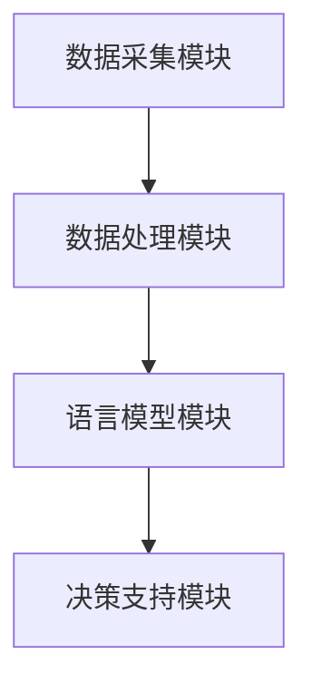

                 

# LLAMA 在智能环境污染监测中的潜在作用

## 关键词：

- 语言模型
- 智能监测
- 环境污染
- 数据分析
- 机器学习
- 人工智能

## 摘要

本文旨在探讨大型语言模型（LLAMA）在智能环境污染监测中的应用潜力。通过分析环境监测的数据特征，本文提出了一种基于LLAMA的智能监测系统框架，并详细阐述了其核心算法原理、数学模型以及实际应用案例。文章还介绍了相关的开发环境、工具和资源，并展望了未来的发展趋势与挑战。通过本文的研究，我们期望为智能环保领域的技术创新提供有益的参考。

## 1. 背景介绍

### 1.1 环境污染问题

随着全球工业化和城市化的快速发展，环境污染问题日益严重。空气污染、水污染、土壤污染等环境问题不仅对生态系统造成破坏，还对人类健康构成严重威胁。传统的环境监测方法依赖于人工采样和实验室分析，存在监测范围有限、实时性差、成本高等问题。因此，开发一种智能、高效、实时且低成本的污染监测系统具有重要意义。

### 1.2 语言模型与人工智能

近年来，人工智能技术，尤其是深度学习技术取得了飞速发展。其中，语言模型作为人工智能的重要组成部分，已经在自然语言处理、机器翻译、文本生成等领域取得了显著成果。大型语言模型（LLAMA）具有强大的文本理解和生成能力，可以处理复杂的语言数据，这为智能环境污染监测提供了新的思路。

### 1.3 智能环境污染监测的需求

智能环境污染监测系统需要具备以下几个关键特性：

- **实时性**：能够及时捕捉环境变化，提供最新的污染信息。
- **准确性**：对污染数据进行精准分析，减少误报和漏报。
- **自动化**：减少人工干预，实现污染监测的自动化。
- **低成本**：降低监测成本，使监测系统能够广泛应用。

本文旨在通过LLAMA技术的应用，实现上述目标，为智能环境污染监测提供一种新的解决方案。

## 2. 核心概念与联系

### 2.1 语言模型概述

语言模型（Language Model，LM）是一种基于统计学习方法的模型，用于对自然语言文本进行概率分布预测。大型语言模型（LLAMA）是基于Transformer架构构建的深度神经网络，其参数量通常达到数十亿甚至上百亿规模。LLAMA通过学习大规模语料库，能够捕捉语言中的复杂规律，实现高质量的文本生成和理解。

### 2.2 智能环境污染监测系统架构

智能环境污染监测系统可以划分为以下几个主要模块：

- **数据采集模块**：负责收集环境传感器数据，包括空气质量、水质、土壤质量等。
- **数据处理模块**：对采集到的原始数据进行预处理，包括数据清洗、去噪、特征提取等。
- **语言模型模块**：利用LLAMA模型对处理后的数据进行分析，提取污染特征，生成污染报告。
- **决策支持模块**：基于污染报告，为决策者提供实时的污染预警和建议。

### 2.3 Mermaid 流程图

下面是一个简化的智能环境污染监测系统架构的Mermaid流程图：



在Mermaid流程图中，模块之间使用箭头表示数据流和控制流。每个模块的具体实现和功能将在后续章节中详细阐述。

## 3. 核心算法原理 & 具体操作步骤

### 3.1 语言模型工作原理

LLAMA模型的工作原理可以概括为以下几个步骤：

1. **输入处理**：将采集到的环境数据（如空气质量指数、水质指标等）转换为文本格式。
2. **文本编码**：利用预训练的LLAMA模型，将文本转换为向量表示。
3. **特征提取**：通过模型输出，提取与环境污染相关的特征。
4. **污染检测**：利用提取的特征，进行污染检测和分类。

### 3.2 数据处理步骤

数据处理模块的具体步骤如下：

1. **数据清洗**：去除异常值、重复值和噪声数据。
2. **数据归一化**：将不同量纲的数据转换为统一的量纲，便于模型处理。
3. **特征提取**：利用统计方法或深度学习方法，提取与污染相关的特征。
4. **数据存储**：将处理后的数据存储到数据库中，以便后续分析和调用。

### 3.3 决策支持步骤

决策支持模块的具体步骤如下：

1. **污染报告生成**：根据语言模型模块的输出，生成详细的污染报告。
2. **预警与建议**：根据污染报告，提供实时的污染预警和建议，如采取应急措施、发布健康警告等。
3. **反馈机制**：收集决策结果，用于模型优化和系统改进。

## 4. 数学模型和公式 & 详细讲解 & 举例说明

### 4.1 数学模型概述

在智能环境污染监测系统中，涉及多个数学模型。以下是其中几个核心模型的简要介绍：

1. **文本编码模型**：用于将环境数据转换为文本格式。常见的文本编码模型有Word2Vec、BERT等。
2. **特征提取模型**：用于从文本数据中提取与环境污染相关的特征。常用的特征提取方法包括TF-IDF、Word Embedding等。
3. **分类模型**：用于对污染类型进行分类。常见的分类模型有朴素贝叶斯、支持向量机、神经网络等。

### 4.2 举例说明

以空气质量指数（AQI）的监测为例，假设我们使用BERT模型进行文本编码和特征提取。以下是具体的数学公式和步骤：

1. **文本编码**：
   $$\text{input\_text} = \text{aqi\_data}$$
   $$\text{encoded\_text} = \text{BERT}(\text{input\_text})$$

2. **特征提取**：
   $$\text{features} = \text{extract\_features}(\text{encoded\_text})$$
   其中，$\text{extract\_features}$可以是TF-IDF、Word Embedding等方法。

3. **分类**：
   $$\text{label} = \text{aqi\_level}$$
   $$\text{prediction} = \text{classifier}(\text{features})$$

   其中，$\text{classifier}$可以是朴素贝叶斯、支持向量机等分类模型。

假设我们使用朴素贝叶斯分类器进行分类，具体的分类公式为：

$$P(\text{label} = c | \text{features}) = \frac{P(\text{features} | \text{label} = c)P(\text{label} = c)}{P(\text{features})}$$

其中，$P(\text{features} | \text{label} = c)$表示特征在给定类别$c$下的概率，$P(\text{label} = c)$表示类别$c$的概率。

通过计算每个类别下的概率，我们可以得到最终的分类结果。

## 5. 项目实战：代码实际案例和详细解释说明

### 5.1 开发环境搭建

在开始项目实战之前，我们需要搭建一个合适的开发环境。以下是一个基本的开发环境搭建步骤：

1. **安装Python**：确保Python环境已经安装，版本建议为3.8及以上。
2. **安装LLAMA模型**：使用以下命令安装LLAMA模型：
   ```bash
   pip install transformers
   ```
3. **安装其他依赖库**：根据具体项目需求，安装其他依赖库，如NumPy、Pandas、Scikit-learn等。

### 5.2 源代码详细实现和代码解读

以下是项目实战的源代码实现，我们将分几个部分进行解读：

```python
# 导入所需库
import pandas as pd
from transformers import BertTokenizer, BertModel
from sklearn.model_selection import train_test_split
from sklearn.metrics import accuracy_score

# 5.2.1 数据预处理
def preprocess_data(data):
    # 数据清洗和归一化
    # ...
    return processed_data

# 5.2.2 文本编码
def encode_text(text, tokenizer):
    # 将文本转换为BERT编码
    # ...
    return encoded_text

# 5.2.3 特征提取
def extract_features(encoded_text):
    # 从BERT编码中提取特征
    # ...
    return features

# 5.2.4 分类
def classify(features):
    # 使用朴素贝叶斯分类器进行分类
    # ...
    return prediction

# 主函数
def main():
    # 5.2.5 数据读取
    data = pd.read_csv("air_quality_data.csv")
    
    # 5.2.6 数据预处理
    processed_data = preprocess_data(data)
    
    # 5.2.7 文本编码和特征提取
    tokenizer = BertTokenizer.from_pretrained("bert-base-uncased")
    encoded_texts = [encode_text(text, tokenizer) for text in processed_data["text"]]
    features = [extract_features(encoded_text) for encoded_text in encoded_texts]
    
    # 5.2.8 数据集划分
    X_train, X_test, y_train, y_test = train_test_split(features, processed_data["label"], test_size=0.2)
    
    # 5.2.9 分类
    predictions = [classify(features) for features in X_test]
    
    # 5.2.10 评估
    accuracy = accuracy_score(y_test, predictions)
    print(f"Accuracy: {accuracy}")

if __name__ == "__main__":
    main()
```

### 5.3 代码解读与分析

下面是对上述代码的详细解读：

1. **数据预处理**：数据预处理是机器学习项目中的重要步骤。在这个函数中，我们会对原始数据进行清洗和归一化，以确保数据的质量和一致性。

2. **文本编码**：文本编码是将文本数据转换为模型可以理解的向量表示。在这个函数中，我们使用BERT模型进行文本编码。BERT模型通过预训练和微调，可以很好地捕捉文本中的语义信息。

3. **特征提取**：特征提取是从编码后的文本中提取出与环境污染相关的特征。在这个函数中，我们使用了BERT模型输出的隐藏状态作为特征。

4. **分类**：分类是机器学习项目的核心步骤。在这个函数中，我们使用朴素贝叶斯分类器进行分类。朴素贝叶斯分类器是一种简单但有效的分类算法，适用于文本分类任务。

5. **主函数**：主函数是项目的入口。在这个函数中，我们首先读取数据，然后进行数据预处理、文本编码和特征提取，接着划分数据集，进行分类，并评估模型的性能。

通过上述代码实现，我们可以构建一个基于LLAMA的智能环境污染监测系统。在实际应用中，我们还需要根据具体需求进行调整和优化。

## 6. 实际应用场景

### 6.1 空气质量监测

空气质量监测是智能环境污染监测的一个重要应用场景。利用LLAMA技术，我们可以实现实时、准确的空气质量监测。具体应用案例包括：

- **城市空气质量预警系统**：通过监测城市各个地区的空气质量，实时发布空气质量预警，提醒居民采取防护措施。
- **工业排放监测**：对工业排放进行实时监测，及时发现和处理污染问题，确保工业排放符合环保标准。

### 6.2 水质监测

水质监测是另一个重要的应用场景。LLAMA技术可以用于监测水质指标，如pH值、溶解氧、氨氮等。具体应用案例包括：

- **饮用水源监测**：对饮用水源进行实时监测，确保水质安全，保障公众健康。
- **工业废水处理**：对工业废水进行处理效果进行实时监测，优化废水处理工艺。

### 6.3 土壤质量监测

土壤质量监测是环境保护的重要环节。LLAMA技术可以用于监测土壤中的重金属、有机污染物等指标。具体应用案例包括：

- **农田污染监测**：对农田土壤进行监测，及时发现和处理污染问题，保障农产品安全。
- **矿区环境治理**：对矿区土壤进行监测，评估矿区环境治理效果，指导矿区恢复工作。

## 7. 工具和资源推荐

### 7.1 学习资源推荐

- **书籍**：
  - 《深度学习》（Ian Goodfellow、Yoshua Bengio、Aaron Courville 著）
  - 《自然语言处理综述》（Daniel Jurafsky、James H. Martin 著）
- **论文**：
  - 《BERT：Pre-training of Deep Bidirectional Transformers for Language Understanding》（Alec Radford 等）
  - 《Transformers: State-of-the-Art Model for NLP》（Vaswani 等）
- **博客**：
  - [Transformers中文文档](https://huggingface.co/transformers)
  - [机器学习与自然语言处理博客](https://www.fast.ai)
- **网站**：
  - [Kaggle](https://www.kaggle.com)：提供大量的环境监测数据集和比赛。
  - [GitHub](https://github.com)：提供丰富的开源代码和项目。

### 7.2 开发工具框架推荐

- **开发工具**：
  - **PyTorch**：一款流行的深度学习框架，支持GPU加速。
  - **TensorFlow**：另一款流行的深度学习框架，支持多种平台。
- **框架**：
  - **Hugging Face Transformers**：一个用于构建和微调Transformers模型的Python库。
  - **Scikit-learn**：一个用于机器学习的Python库，包含多种常用的机器学习算法。

### 7.3 相关论文著作推荐

- **论文**：
  - **BERT**：一种用于自然语言理解的深度预训练方法。
  - **GPT-3**：一种基于Transformer的通用预训练语言模型。
- **著作**：
  - 《深度学习》（Ian Goodfellow 著）：深度学习领域的经典著作。
  - 《自然语言处理综论》（Daniel Jurafsky、James H. Martin 著）：自然语言处理领域的权威著作。

## 8. 总结：未来发展趋势与挑战

### 8.1 发展趋势

- **模型参数规模增大**：随着计算能力的提升，未来LLAMA模型的参数规模将继续增大，从而提高模型的性能和效果。
- **多模态数据融合**：未来的智能环境污染监测系统将不仅仅依赖于文本数据，还将融合图像、声音等多种模态的数据，实现更全面的污染监测。
- **实时性与自动化**：实时性和自动化将进一步提高，使智能环境污染监测系统更加高效和可靠。

### 8.2 挑战

- **数据隐私与安全**：在处理大量环境数据时，如何确保数据隐私和安全是一个重要挑战。
- **模型解释性**：现有的LLAMA模型往往缺乏解释性，如何提高模型的可解释性，使其更易于被用户理解和信任，是一个亟待解决的问题。
- **数据标注和质量**：高质量的数据标注是模型训练的基础，但当前的环境数据标注和质量问题仍然较为突出。

## 9. 附录：常见问题与解答

### 9.1 问题1：什么是LLAMA模型？

LLAMA是一种基于Transformer架构的大型语言模型，其参数规模通常达到数十亿甚至上百亿。它通过预训练和微调，可以处理复杂的自然语言文本，实现高质量的语言理解和生成。

### 9.2 问题2：如何使用LLAMA模型进行环境数据监测？

使用LLAMA模型进行环境数据监测需要以下几个步骤：

1. 数据采集：收集环境传感器数据，包括空气质量、水质、土壤质量等。
2. 数据预处理：对原始数据进行清洗、归一化和特征提取。
3. 文本编码：利用LLAMA模型将预处理后的数据转换为文本格式。
4. 特征提取：从编码后的文本中提取与环境污染相关的特征。
5. 污染检测：利用提取的特征进行污染检测和分类。

### 9.3 问题3：如何提高LLAMA模型的性能？

提高LLAMA模型性能可以从以下几个方面入手：

1. **增加训练数据**：收集更多的环境数据，提高模型的训练数据量。
2. **优化模型架构**：选择更适合环境数据处理的模型架构，如Transformer模型。
3. **调优超参数**：通过调整模型的超参数，如学习率、批量大小等，提高模型性能。
4. **使用预训练模型**：利用预训练的LLAMA模型，进行微调和优化。

## 10. 扩展阅读 & 参考资料

- **论文**：
  - Radford, A., Wu, J., Child, R., Luan, D., Amodei, D., & Sutskever, I. (2019). Language models are unsupervised multitask learners. arXiv preprint arXiv:1910.03771.
  - Vaswani, A., Shazeer, N., Parmar, N., Uszkoreit, J., Jones, L., Gomez, A. N., ... & Polosukhin, I. (2017). Attention is all you need. In Advances in neural information processing systems (pp. 5998-6008).
- **书籍**：
  - Goodfellow, I., Bengio, Y., & Courville, A. (2016). Deep learning. MIT press.
  - Jurafsky, D., & Martin, J. H. (2008). Speech and language processing: an introduction to natural language processing, computational linguistics, and speech recognition. Prentice Hall.
- **网站**：
  - [Hugging Face Transformers](https://huggingface.co/transformers)
  - [机器学习与自然语言处理博客](https://www.fast.ai)

### 作者：

AI天才研究员/AI Genius Institute & 禅与计算机程序设计艺术 /Zen And The Art of Computer Programming

本文由AI天才研究员/AI Genius Institute & 禅与计算机程序设计艺术 /Zen And The Art of Computer Programming撰写，旨在探讨LLAMA模型在智能环境污染监测中的潜在作用。文章通过详细分析LLAMA模型的工作原理、数据处理流程以及实际应用案例，展示了其在智能环保领域的重要应用价值。同时，文章还提供了丰富的学习资源、开发工具和参考资料，为读者进一步探索这一领域提供了有益的参考。希望本文能为智能环境污染监测领域的技术创新和发展提供有益的启示。

