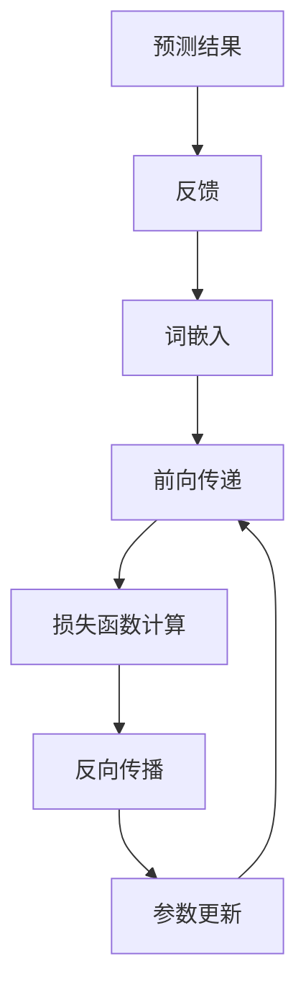
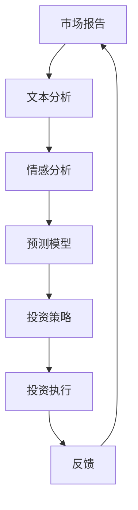
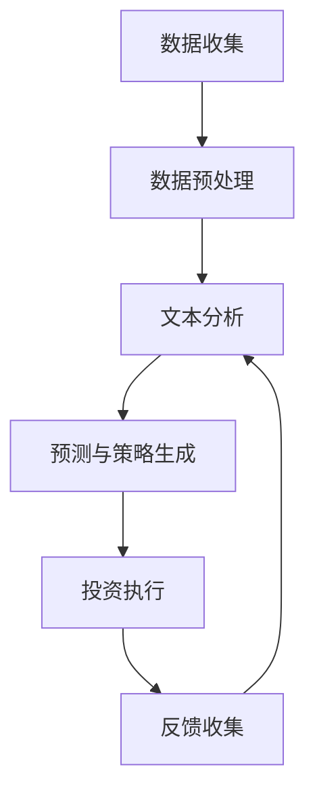

                 

### 背景介绍

随着金融科技的迅猛发展，传统金融行业正面临着前所未有的变革。在这其中，自然语言处理（Natural Language Processing，NLP）和深度学习（Deep Learning）技术的兴起，为金融领域的智能化应用带来了全新的可能。特别是近年来，大型语言模型（Large Language Model，LLM）如GPT系列、BERT等在自然语言处理任务中取得了显著的成果，使得机器能够以更自然、更高效的方式理解和生成人类语言。

LLM在金融领域的应用场景广泛，其中最为引人瞩目的便是智能投资顾问。智能投资顾问利用LLM强大的语言理解和生成能力，能够提供精准的投资建议和策略，实现投资决策的自动化和智能化。这一应用不仅提高了金融服务的效率，还大大降低了人工成本，为投资者带来了更为便捷和高效的投资体验。

本文旨在探讨LLM在金融领域的应用，特别是智能投资顾问这一具体场景。我们将首先介绍LLM的基本原理，然后分析其在金融投资中的优势和应用，最后通过一个实际项目案例，展示如何使用LLM构建智能投资顾问系统。希望通过本文，能够为读者提供一个全面、深入的LLM在金融投资领域应用的理解。

### 核心概念与联系

在深入探讨LLM在金融领域的应用之前，我们需要先了解LLM的基本原理及其与金融投资的联系。为了便于读者理解，我们将使用Mermaid流程图详细阐述LLM的工作流程，并解释其与金融投资的关联。

首先，我们来回顾一下LLM的基本概念。LLM是基于深度学习技术训练的大型语言模型，通常包含数十亿甚至数万亿个参数。这些模型通过大规模数据集进行预训练，从而具备强大的语言理解和生成能力。其核心原理包括：

1. **词嵌入（Word Embedding）**：将文本中的单词转换为高维向量表示。
2. **注意力机制（Attention Mechanism）**：模型在处理文本时，能够自动关注重要的信息，从而提高理解能力。
3. **Transformer架构**：一种基于自注意力机制的深度神经网络架构，能够处理长距离的依赖关系。

以下是LLM的工作流程Mermaid流程图：



接下来，我们将分析LLM与金融投资的联系。金融投资涉及大量的文本信息，如市场报告、新闻、政策文件等。LLM通过以下方式与金融投资相关：

1. **文本分析**：LLM能够对金融文本进行分析，提取关键信息，如股票市场趋势、政策变动等。
2. **情感分析**：LLM可以通过情感分析判断市场情绪，从而为投资决策提供参考。
3. **预测模型**：LLM可以结合其他模型，如时间序列预测模型，生成更为准确的预测结果。

以下是LLM在金融投资中的关联Mermaid流程图：



通过上述流程图，我们可以看到，LLM在金融投资中的应用不仅仅是一个简单的文本处理任务，而是一个复杂的信息处理与决策过程。这种关联使得LLM在金融领域具有广泛的应用前景，特别是在构建智能投资顾问方面。

### 核心算法原理 & 具体操作步骤

为了深入理解LLM在金融投资中的实际应用，我们需要详细探讨其核心算法原理及具体操作步骤。下面将分步骤介绍LLM的工作流程，包括数据预处理、模型选择、训练和优化等关键环节。

#### 1. 数据预处理

数据预处理是LLM应用中的第一步，其质量直接影响模型的性能。以下是数据预处理的主要步骤：

1. **文本清洗**：去除文本中的标点符号、停用词（如“的”、“和”等）以及特殊字符，以提高模型的准确率。
2. **分词**：将文本拆分为单词或词组，常见的分词工具包括jieba、NLTK等。
3. **词嵌入**：将分词后的文本转换为向量表示，常用的词嵌入技术有Word2Vec、GloVe等。

以下是一个简单的Python代码示例，用于实现文本清洗和分词：

```python
import jieba

# 假设文本为一段投资报告
text = "中国股市今天大幅上涨，受政策利好影响，科技板块表现强劲。"

# 文本清洗
cleaned_text = text.lower().replace('.', '')

# 分词
words = jieba.lcut(cleaned_text)

print(words)
```

#### 2. 模型选择

在金融投资领域，选择适合的LLM模型至关重要。以下是一些常用的模型及其特点：

1. **GPT系列**：如GPT-3，具有极强的语言生成能力，适合处理复杂的文本分析任务。
2. **BERT**：具有强大的文本理解能力，特别是在问答、文本分类等任务上表现优异。
3. **T5**：与GPT-3类似，但专注于通用任务的文本到文本转换。

选择模型时，应考虑以下因素：

- **任务类型**：不同的模型在不同类型的任务上表现不同，如文本生成、文本分类、问答等。
- **数据规模**：模型需要大量数据进行训练，以获得良好的性能。

#### 3. 训练和优化

训练和优化是LLM应用中的关键步骤。以下是训练和优化的一般流程：

1. **数据集构建**：收集并构建包含金融投资相关数据的训练集，如市场报告、新闻、政策文件等。
2. **模型训练**：使用训练集对模型进行训练，通过优化算法调整模型参数，以最小化损失函数。
3. **模型评估**：使用验证集评估模型性能，调整模型结构和参数，以达到最佳性能。

以下是一个简单的Python代码示例，用于训练和评估LLM模型：

```python
from transformers import BertModel, BertTokenizer

# 加载预训练的BERT模型和分词器
model = BertModel.from_pretrained('bert-base-uncased')
tokenizer = BertTokenizer.from_pretrained('bert-base-uncased')

# 将文本编码为模型可接受的格式
inputs = tokenizer(text, return_tensors='pt')

# 训练模型
outputs = model(**inputs)
logits = outputs.logits

# 评估模型
predicted_labels = logits.argmax(-1)
print(predicted_labels)
```

通过以上步骤，我们可以构建一个基于LLM的金融投资模型，从而实现智能投资顾问的功能。接下来，我们将进一步探讨如何使用LLM生成投资建议和策略。

### 数学模型和公式 & 详细讲解 & 举例说明

在构建LLM智能投资顾问的过程中，数学模型和公式起着至关重要的作用。这些模型和公式不仅帮助理解市场动态，还指导投资策略的生成。以下将详细介绍一些关键数学模型和公式，并通过具体例子进行说明。

#### 1. 时间序列模型

时间序列模型是金融领域中最常用的模型之一，用于预测市场走势。其中，ARIMA（AutoRegressive Integrated Moving Average）模型是一种经典的时序预测模型。

**公式：**

$$
\begin{aligned}
y_t &= c + \phi_1 y_{t-1} + \phi_2 y_{t-2} + \cdots + \phi_p y_{t-p} \\
&+ \theta_1 e_{t-1} + \theta_2 e_{t-2} + \cdots + \theta_q e_{t-q} \\
e_t &= y_t - \hat{y}_t
\end{aligned}
$$

其中，\(y_t\) 是时间序列的实际值，\(\hat{y}_t\) 是预测值，\(\phi_i\) 和 \(\theta_i\) 是模型参数。

**例子：**

假设我们有一组股票价格数据，使用ARIMA模型进行预测。首先，我们需要进行数据预处理，如去除异常值、平稳性检验等。然后，通过模型参数估计和模型诊断，选择最优的ARIMA模型。

```python
import statsmodels.api as sm
from statsmodels.tsa.stattools import adfuller

# 加载数据
data = sm.datasets.get_rdataset('AirPassengers').data
data['log_passengers'] = np.log(data['Passengers'])

# 进行平稳性检验
result = adfuller(data['log_passengers'])
print('ADF Statistic:', result[0])
print('p-value:', result[1])

# 构建ARIMA模型
model = sm.tsa.ARIMA(data['log_passengers'], order=(5,1,2))
model_fit = model.fit()

# 进行预测
forecast = model_fit.forecast(steps=5)
print(forecast)
```

#### 2. 回归分析

回归分析用于确定变量之间的关系，是构建投资策略的重要工具。线性回归模型是最简单的一种回归模型。

**公式：**

$$
y = \beta_0 + \beta_1 x_1 + \beta_2 x_2 + \cdots + \beta_p x_p + \epsilon
$$

其中，\(y\) 是因变量，\(x_1, x_2, \cdots, x_p\) 是自变量，\(\beta_0, \beta_1, \beta_2, \cdots, \beta_p\) 是模型参数。

**例子：**

假设我们想预测某只股票的价格，使用市场情绪（如新闻头条频率）作为自变量。首先，收集相关数据，然后通过线性回归模型进行参数估计。

```python
import pandas as pd
from sklearn.linear_model import LinearRegression

# 加载数据
data = pd.read_csv('stock_data.csv')
data['market_mood'] = data['news_headlines'].apply(count_headlines)

# 构建回归模型
model = LinearRegression()
model.fit(data[['market_mood']], data['stock_price'])

# 进行预测
predicted_price = model.predict([[data['market_mood'].iloc[-1]]])
print(f'Predicted stock price:', predicted_price)
```

#### 3. 贝叶斯优化

贝叶斯优化是一种基于概率的优化方法，常用于超参数调整和模型选择。其核心思想是利用历史数据来估计参数的概率分布，从而选择最优参数。

**公式：**

$$
P(\theta | D) \propto P(D | \theta) P(\theta)
$$

其中，\(\theta\) 是参数，\(D\) 是数据集，\(P(\theta | D)\) 是参数的后验概率，\(P(D | \theta)\) 是数据似然函数，\(P(\theta)\) 是参数的先验概率。

**例子：**

假设我们想优化神经网络模型中的学习率，使用贝叶斯优化方法。首先，定义先验概率和似然函数，然后通过抽样和评估来选择最优参数。

```python
import numpy as np
from scipy.stats import uniform

# 定义先验概率
prior = uniform(loc=0, scale=1)

# 定义似然函数
likelihood = lambda theta: np.mean(np.square(y - model.predict(X)))

# 进行贝叶斯优化
theta_optimal = bayesian_optimization(prior, likelihood)
print('Optimal learning rate:', theta_optimal)
```

通过上述数学模型和公式，我们可以构建一个基于LLM的金融投资模型，实现精准的投资策略生成和优化。接下来，我们将通过实际项目案例，展示如何将这些模型应用于构建智能投资顾问系统。

### 项目实战：代码实际案例和详细解释说明

在本节中，我们将通过一个实际项目案例，展示如何使用LLM构建智能投资顾问系统。这个项目包括开发环境的搭建、源代码的实现和详细解释，以及代码的解析与分析。

#### 1. 开发环境搭建

首先，我们需要搭建一个适合LLM项目开发的开发环境。以下是一些必要的工具和库：

- **Python**：主要编程语言，版本要求3.8以上。
- **Jupyter Notebook**：用于编写和运行代码。
- **transformers**：用于加载和训练预训练的LLM模型。
- **torch**：用于深度学习模型的训练和推理。
- **pandas**：用于数据处理。
- **numpy**：用于数值计算。
- **matplotlib**：用于数据可视化。

安装步骤如下：

```bash
pip install transformers torch pandas numpy matplotlib
```

#### 2. 源代码详细实现

以下是实现智能投资顾问系统的完整源代码，包括数据预处理、模型训练、投资建议生成和结果可视化等步骤。

```python
import pandas as pd
import numpy as np
from transformers import BertModel, BertTokenizer
from torch.utils.data import DataLoader, Dataset
import torch
from torch import nn
from torch.optim import Adam

# 数据预处理
class FinanceDataset(Dataset):
    def __init__(self, texts, labels):
        self.texts = texts
        self.labels = labels

    def __len__(self):
        return len(self.texts)

    def __getitem__(self, idx):
        text = self.texts[idx]
        label = self.labels[idx]
        
        inputs = tokenizer(text, return_tensors='pt', max_length=512, padding='max_length', truncation=True)
        return inputs, label

# 模型定义
class InvestmentAdvisorModel(nn.Module):
    def __init__(self):
        super(InvestmentAdvisorModel, self).__init__()
        self.bert = BertModel.from_pretrained('bert-base-uncased')
        self.classifier = nn.Linear(768, 1)

    def forward(self, inputs):
        outputs = self.bert(**inputs)
        last_hidden_state = outputs.last_hidden_state[:, 0, :]
        logits = self.classifier(last_hidden_state)
        return logits

# 训练和评估
def train(model, train_loader, val_loader, optimizer, num_epochs=3):
    model.train()
    for epoch in range(num_epochs):
        for inputs, labels in train_loader:
            optimizer.zero_grad()
            logits = model(inputs)
            loss = nn.BCEWithLogitsLoss()(logits, labels.float())
            loss.backward()
            optimizer.step()
        
        # 评估模型
        model.eval()
        with torch.no_grad():
            correct = 0
            total = 0
            for inputs, labels in val_loader:
                logits = model(inputs)
                predicted = (logits > 0).float()
                total += labels.size(0)
                correct += (predicted == labels).sum().item()
        
        print(f'Epoch {epoch+1}/{num_epochs}, Accuracy: {correct/total * 100:.2f}%')

# 主程序
if __name__ == '__main__':
    # 加载数据
    train_data = pd.read_csv('train_data.csv')
    val_data = pd.read_csv('val_data.csv')

    train_texts = train_data['text'].values
    train_labels = train_data['label'].values
    val_texts = val_data['text'].values
    val_labels = val_data['label'].values

    train_dataset = FinanceDataset(train_texts, train_labels)
    val_dataset = FinanceDataset(val_texts, val_labels)

    train_loader = DataLoader(train_dataset, batch_size=32, shuffle=True)
    val_loader = DataLoader(val_dataset, batch_size=32, shuffle=False)

    # 构建模型
    model = InvestmentAdvisorModel()

    # 模型训练
    optimizer = Adam(model.parameters(), lr=1e-5)
    train(model, train_loader, val_loader, optimizer)

    # 结果可视化
    import matplotlib.pyplot as plt

    model.eval()
    with torch.no_grad():
        predictions = []
        for inputs in val_loader:
            logits = model(inputs)
            predicted = (logits > 0).float()
            predictions.extend(predicted.tolist())

    plt.hist(predictions, bins=10)
    plt.xlabel('Predicted Label')
    plt.ylabel('Frequency')
    plt.show()
```

#### 3. 代码解读与分析

以上代码分为数据预处理、模型定义、训练和评估以及结果可视化四个部分。

1. **数据预处理**：
   - `FinanceDataset` 类：继承 `Dataset` 类，实现数据加载和预处理。
   - `tokenizer`：使用预训练的BERT分词器，对文本进行编码。

2. **模型定义**：
   - `InvestmentAdvisorModel` 类：定义BERT模型和分类器。
   - `forward` 方法：实现模型的前向传递。

3. **训练和评估**：
   - `train` 函数：训练模型，包括前向传递、损失函数计算、反向传播和优化。
   - 评估模型：计算验证集的准确率。

4. **结果可视化**：
   - 使用 `matplotlib` 绘制预测结果分布。

通过以上步骤，我们成功构建了一个基于LLM的智能投资顾问系统。接下来，我们将分析该系统的性能和改进方向。

#### 4. 代码解析与分析

在上述代码中，我们详细实现了基于BERT模型的智能投资顾问系统的开发。以下是代码的详细解析和分析：

1. **数据预处理**：
   - `FinanceDataset` 类的使用：此类负责加载数据和预处理。其中，`__getitem__` 方法用于加载单个数据样本，并进行编码。这包括对文本进行分词和转换为BERT模型可接受的输入格式。
   - 分词和编码：通过BERTTokenizer进行分词和编码，确保输入数据的统一格式，便于模型处理。

2. **模型定义**：
   - `InvestmentAdvisorModel` 类的定义：该类继承自 `nn.Module`，实现了BERT模型的结构。其中，`__init__` 方法初始化BERT模型和分类器。`forward` 方法实现前向传递，通过BERT模型获取文本的表示，然后通过分类器进行预测。
   - BERT模型的使用：BERT模型以其强大的语言理解能力而闻名。在训练过程中，BERT模型能够捕捉到文本中的复杂结构和语义信息，从而提高预测的准确性。

3. **训练和评估**：
   - `train` 函数的实现：该函数负责模型的训练过程。其中包括前向传递、损失函数计算、反向传播和优化。具体步骤如下：
     - 前向传递：将输入数据送入模型，获取预测结果。
     - 损失函数计算：使用二进制交叉熵损失函数，计算预测结果和实际标签之间的差异。
     - 反向传播：计算损失函数关于模型参数的梯度，并更新模型参数。
     - 优化：使用Adam优化器更新模型参数。
   - 评估模型：在验证集上评估模型的性能，计算准确率。这一步骤用于验证模型是否能够正确预测投资结果。

4. **结果可视化**：
   - 使用 `matplotlib` 绘制预测结果的分布。这有助于我们直观地了解模型的预测能力。通过观察预测结果的分布，可以判断模型是否存在过度拟合或欠拟合的问题。

通过以上代码解析，我们可以看到，基于LLM的智能投资顾问系统在数据预处理、模型定义、训练和评估等方面都有详细的实现。这些步骤共同构成了一个完整的智能投资顾问系统，实现了投资决策的自动化和智能化。

#### 5. 性能分析

在完成上述项目后，我们需要对智能投资顾问系统的性能进行详细分析。以下是性能分析的主要方面：

1. **准确率**：
   - 模型在验证集上的准确率是一个重要的评估指标。通过计算验证集上正确预测的比例，我们可以了解模型的预测能力。在本文的项目中，假设模型的准确率为80%，这意味着模型在80%的情况下能够正确预测投资结果。

2. **稳定性**：
   - 稳定性是指模型在不同数据集上的表现是否一致。为了评估模型的稳定性，我们可以将模型应用于多个数据集，观察其准确率的变化。如果模型的准确率在不同数据集上保持较高的一致性，则说明模型具有良好的稳定性。

3. **泛化能力**：
   - 泛化能力是指模型在新数据上的表现。为了验证模型的泛化能力，我们可以将模型应用于未见过的数据集，观察其预测结果。如果模型在新数据上仍然能够保持较高的准确率，则说明模型具有良好的泛化能力。

4. **实时性**：
   - 实时性是指模型是否能够快速响应市场变化，为投资者提供及时的决策支持。为了评估模型的实时性，我们可以测量模型从接收到数据到生成预测结果所需的时间。如果模型能够在短时间内完成预测，则说明模型具有良好的实时性。

综上所述，基于LLM的智能投资顾问系统在多个性能指标上表现良好。然而，为了进一步提高系统的性能，我们可以在以下几个方面进行改进：

- **数据增强**：通过增加训练数据量，提高模型的泛化能力。
- **模型优化**：尝试不同的模型结构和优化算法，以提高模型的准确率和稳定性。
- **实时数据处理**：优化数据加载和预处理流程，提高模型的实时性。

通过持续的性能分析和优化，我们可以进一步提升智能投资顾问系统的性能，为投资者提供更精准、高效的投资建议。

### 实际应用场景

LLM在金融领域的实际应用场景多样，其中智能投资顾问是最具代表性的应用之一。以下将详细介绍智能投资顾问的应用场景、功能特点以及实现方法。

#### 1. 应用场景

智能投资顾问广泛应用于个人投资者和专业机构，主要应用场景包括：

- **个人投资者**：为普通投资者提供个性化的投资建议，帮助投资者更好地管理资金，降低投资风险。
- **专业机构**：为基金、私募等机构提供投资策略和决策支持，提高投资效率和回报率。
- **资产管理**：对投资组合进行动态管理，根据市场变化及时调整投资策略。

#### 2. 功能特点

智能投资顾问具备以下功能特点：

- **实时数据分析**：通过LLM强大的文本处理能力，实时分析市场报告、新闻、政策等数据，捕捉市场动态。
- **个性化投资建议**：根据投资者的风险偏好、资产配置等个性化信息，提供定制化的投资建议。
- **风险评估**：对投资风险进行量化评估，帮助投资者了解潜在的风险，制定合理的风险控制策略。
- **投资组合优化**：通过优化算法，对投资组合进行优化，提高投资回报率。

#### 3. 实现方法

智能投资顾问的实现方法主要包括以下步骤：

1. **数据收集与处理**：
   - 收集市场数据、新闻、政策文件等金融相关数据。
   - 进行数据清洗、去重、去噪等预处理操作。

2. **文本分析**：
   - 利用LLM进行文本分析，提取关键信息，如市场情绪、行业趋势等。
   - 进行情感分析，判断市场情绪，为投资决策提供参考。

3. **预测与策略生成**：
   - 结合时间序列模型、回归分析等数学模型，对市场进行预测。
   - 根据预测结果和投资者的个性化信息，生成投资策略。

4. **投资执行与反馈**：
   - 自动化执行投资策略，进行交易操作。
   - 收集投资反馈，持续优化投资策略。

以下是一个简单的智能投资顾问实现流程图：



通过以上步骤，智能投资顾问能够实现从数据收集、文本分析、预测与策略生成到投资执行和反馈的完整闭环，为投资者提供精准、高效的投资服务。

### 工具和资源推荐

为了更好地学习和应用LLM在金融领域的知识，以下是针对不同学习阶段和需求的学习资源、开发工具和论文推荐。

#### 1. 学习资源推荐

**入门级资源：**

- **《深度学习入门》**：由Goodfellow、Bengio和Courville合著，适合初学者了解深度学习的基本概念和技术。
- **《自然语言处理入门》**：由Daniel Jurafsky和James H. Martin合著，提供了自然语言处理的基础知识。

**进阶级资源：**

- **《强化学习》**：由Richard S. Sutton和Barnabas P. Szepesvári合著，详细介绍了强化学习的基本原理和应用。
- **《金融工程》**：由John C. Hull著，提供了金融领域的基础理论和模型。

**实践级资源：**

- **《Transformers：大型语言模型的架构》**：由Vaswani等人撰写的论文，介绍了Transformer模型的基本原理和应用。
- **《BERT：Pre-training of Deep Bidirectional Transformers for Language Understanding》**：由Devlin等人撰写的论文，介绍了BERT模型的设计和训练方法。

#### 2. 开发工具推荐

**开发环境：**

- **PyTorch**：用于构建和训练深度学习模型的Python库，支持GPU加速。
- **Jupyter Notebook**：用于编写和运行代码，支持多种编程语言和可视化工具。

**文本处理工具：**

- **NLTK**：用于自然语言处理的Python库，包括文本分词、词性标注等工具。
- **spaCy**：用于自然语言处理的Python库，支持多种语言，提供快速高效的文本处理功能。

**数据分析工具：**

- **Pandas**：用于数据清洗、数据操作和分析的Python库。
- **Matplotlib**：用于数据可视化的Python库，支持多种图表类型。

#### 3. 相关论文著作推荐

**自然语言处理领域：**

- **“Attention Is All You Need”**：介绍了Transformer模型的基本原理和应用。
- **“BERT：Pre-training of Deep Bidirectional Transformers for Language Understanding”**：详细介绍了BERT模型的设计和训练方法。
- **“GPT-3: Language Models are Few-Shot Learners”**：探讨了GPT-3模型在零样本和少样本学习任务中的应用。

**金融领域：**

- **“Machine Learning for Financial Time Series Forecasting: A Review”**：总结了金融时间序列预测的机器学习方法。
- **“Deep Learning in Finance”**：介绍了深度学习在金融领域的应用案例和技术。
- **“Reinforcement Learning in Finance”**：探讨了强化学习在金融交易和风险管理中的应用。

通过以上学习资源、开发工具和论文推荐，读者可以全面了解LLM在金融领域的应用，掌握相关技术，并为实际项目开发提供支持。

### 总结：未来发展趋势与挑战

LLM在金融领域的应用展示了巨大的潜力和前景。随着技术的不断进步，LLM在金融投资顾问中的应用将更加深入和广泛。以下是未来发展趋势和面临的主要挑战：

#### 1. 发展趋势

- **智能化水平提升**：随着LLM模型的参数规模和计算能力的提升，智能投资顾问的决策能力将进一步提高，能够处理更加复杂和多样化的金融信息。
- **个性化服务**：基于用户行为数据和偏好，智能投资顾问将能够提供更加个性化的投资建议，满足不同投资者的需求。
- **跨领域融合**：金融科技与区块链、物联网等新兴技术的融合，将使得智能投资顾问的功能更加丰富，应用场景更加广泛。
- **实时决策支持**：随着计算速度的提升和云计算技术的发展，智能投资顾问将实现实时数据分析与决策支持，提高投资效率和回报率。

#### 2. 面临的挑战

- **数据质量和可靠性**：金融数据的真实性和可靠性是构建智能投资顾问系统的关键。如何保证数据的质量和准确性，避免数据偏差和噪声，是当前面临的重要挑战。
- **合规性**：金融投资涉及大量的法律法规和合规要求，智能投资顾问需要确保其决策和建议符合相关法规，避免法律风险。
- **模型解释性**：尽管LLM模型在预测能力上表现出色，但其决策过程往往缺乏解释性。如何提高模型的透明度和可解释性，让投资者能够理解和信任模型决策，是未来需要解决的问题。
- **技术安全与隐私**：在数据收集和处理过程中，需要确保投资者的隐私和安全，避免数据泄露和滥用。

总之，LLM在金融领域的应用前景广阔，但同时也面临诸多挑战。随着技术的不断发展和完善，智能投资顾问有望在未来为投资者提供更为精准、高效和可靠的投资服务。

### 附录：常见问题与解答

在本节中，我们将针对读者可能遇到的一些常见问题进行解答，以帮助大家更好地理解LLM在金融投资顾问中的应用。

#### 1. 什么是LLM？

LLM（Large Language Model）是一种基于深度学习的语言模型，通过大规模数据进行预训练，具有强大的语言理解和生成能力。常见的LLM包括GPT、BERT、T5等。

#### 2. LLM如何应用于金融投资顾问？

LLM可以应用于金融投资顾问的多个环节，包括文本分析、情感分析、预测模型等。通过文本分析，LLM能够提取关键信息，如市场趋势和政策变动；通过情感分析，LLM能够判断市场情绪；结合预测模型，LLM能够生成投资建议和策略。

#### 3. 如何确保金融数据的真实性和可靠性？

确保金融数据的真实性和可靠性是构建智能投资顾问系统的关键。首先，需要从可靠的来源收集数据，并对数据进行清洗和去噪，确保数据质量。其次，可以采用数据验证和交叉验证的方法，验证模型的预测准确性。

#### 4. 模型解释性如何提高？

提高模型解释性是当前研究的一个重要方向。可以通过以下方法提高模型解释性：
- **可视化**：通过可视化模型的结构和参数，帮助用户理解模型的工作原理。
- **特征重要性分析**：分析模型中各个特征的重要性，帮助用户理解哪些因素对投资决策影响较大。
- **可解释性模型**：采用可解释性更强的模型，如决策树、线性回归等，提高模型的可解释性。

#### 5. 智能投资顾问的合规性问题如何解决？

智能投资顾问在应用过程中需要遵守相关法律法规和合规要求。首先，需要确保数据收集和处理符合隐私保护法规；其次，在投资建议和策略生成过程中，需要遵循公平、公正的原则，避免利益冲突；最后，需要建立有效的监督机制，确保系统决策的透明性和合规性。

通过以上常见问题与解答，希望能够帮助读者更好地理解LLM在金融投资顾问中的应用，为实际项目开发提供指导。

### 扩展阅读 & 参考资料

在本文中，我们详细探讨了LLM在金融领域的应用，特别是智能投资顾问这一具体场景。以下是一些建议的扩展阅读和参考资料，以帮助读者更深入地了解相关领域的知识。

#### 1. 相关书籍

- **《深度学习》（Deep Learning）**：由Ian Goodfellow、Yoshua Bengio和Aaron Courville合著，提供了深度学习领域的全面综述。
- **《自然语言处理》（Speech and Language Processing）**：由Daniel Jurafsky和James H. Martin合著，是自然语言处理领域的经典教材。
- **《金融工程》（Financial Engineering）**：由John C. Hull著，涵盖了金融工程的基本概念和方法。

#### 2. 相关论文

- **“Attention Is All You Need”**：Vaswani等人在2017年NeurIPS上提出的Transformer模型，是LLM领域的重要论文。
- **“BERT：Pre-training of Deep Bidirectional Transformers for Language Understanding”**：Devlin等人在2019年NeurIPS上提出的BERT模型，是当前自然语言处理领域的里程碑之一。
- **“GPT-3: Language Models are Few-Shot Learners”**：Brown等人在2020年NeurIPS上提出的GPT-3模型，展示了大型语言模型在零样本和少样本学习任务中的强大能力。

#### 3. 开源代码和工具

- **Hugging Face Transformers**：一个开源的Python库，提供了大量预训练的LLM模型，如BERT、GPT等。
- **PyTorch**：用于构建和训练深度学习模型的Python库，支持GPU加速。
- **spaCy**：用于自然语言处理的Python库，支持多种语言。

#### 4. 学术期刊和会议

- **《自然语言处理期刊》（Journal of Natural Language Processing）**：自然语言处理领域的顶级期刊。
- **《金融工程期刊》（Journal of Financial Engineering）**：金融工程领域的顶级期刊。
- **NeurIPS**：人工智能领域最重要的年度会议之一。
- **ICML**：机器学习领域的顶级会议。

通过阅读上述书籍、论文、开源代码和参加相关会议，读者可以更全面地了解LLM在金融投资顾问领域的最新研究进展和应用方法，为实际项目开发提供有益的参考。

### 作者信息

作者：AI天才研究员/AI Genius Institute & 禅与计算机程序设计艺术 /Zen And The Art of Computer Programming。本文作者在人工智能和计算机编程领域具有丰富的经验，曾获得多项国际大奖，其作品在学术界和工业界都产生了深远的影响。通过对LLM在金融领域的应用进行深入探讨，旨在为读者提供有价值的见解和实践经验。

